Analysis of Bauer et al. (unpublished) Field experiment: <br> Favourable
Conservation Status (FCS)
================
<b>Markus Bauer\*</b> <br>
<b>2022-12-06</b>

- <a href="#preparation" id="toc-preparation">Preparation</a>
- <a href="#statistics" id="toc-statistics">Statistics</a>
  - <a href="#data-exploration" id="toc-data-exploration">Data
    exploration</a>
    - <a href="#graphs-of-raw-data" id="toc-graphs-of-raw-data">Graphs of raw
      data</a>
    - <a href="#outliers-zero-inflation-transformations"
      id="toc-outliers-zero-inflation-transformations">Outliers,
      zero-inflation, transformations?</a>
  - <a href="#models" id="toc-models">Models</a>
    - <a href="#priors" id="toc-priors">Priors</a>
  - <a href="#model-check" id="toc-model-check">Model check</a>
    - <a href="#dharma" id="toc-dharma">DHARMa</a>
    - <a href="#preparation-1" id="toc-preparation-1">Preparation</a>
    - <a href="#sampling-efficency-and-effectiveness"
      id="toc-sampling-efficency-and-effectiveness">Sampling efficency and
      effectiveness</a>
    - <a href="#mcmc-diagnostics" id="toc-mcmc-diagnostics">MCMC
      diagnostics</a>
    - <a href="#posterior-predictive-check"
      id="toc-posterior-predictive-check">Posterior predictive check</a>
    - <a href="#autocorrelation-check"
      id="toc-autocorrelation-check">Autocorrelation check</a>
  - <a href="#output-of-choosen-model"
    id="toc-output-of-choosen-model">Output of choosen model</a>
    - <a href="#model-output" id="toc-model-output">Model output</a>
    - <a href="#effect-sizes" id="toc-effect-sizes">Effect sizes</a>
- <a href="#session-info" id="toc-session-info">Session info</a>

Technichal University of Munich, TUM School of Life Sciences, Chair of
Restoration Ecology, Emil-Ramann-Straße 6, 85354 Freising, Germany

\* Corresponding author: <markus1.bauer@tum.de> <br> ORCiD ID:
[0000-0001-5372-4174](https://orcid.org/0000-0001-5372-4174) <br>
[Google
Scholar](https://scholar.google.de/citations?user=oHhmOkkAAAAJ&hl=de&oi=ao)
<br> GitHub: [markus1bauer](https://github.com/markus1bauer)

Favourable Conservation Status (FSC) sensu Helm et al. (2015) Divers
Distrib [DOI: 10.1111/ddi.12285](https://doi.org/10.1111/ddi.12285)

# Preparation

#### Packages

``` r
library(here)
library(tidyverse)
library(ggbeeswarm)
library(patchwork)
library(brms)
library(DHARMa)
library(DHARMa.helpers)
library(bayesplot)
library(loo)
library(tidybayes)
library(emmeans)
```

#### Load data

``` r
sites <- read_csv(
  here("data", "processed", "data_processed_sites.csv"),
  col_names = TRUE, na = c("na", "NA", ""), col_types =
    cols(
      .default = "?",
      plot = "f",
      site = "f",
      sand_ratio = "f",
      substrate_depth = col_factor(levels = c("30", "15")),
      target_type = col_factor(levels = c(
        "hay_meadow", "dry_grassland"
        )),
      seed_density = "f",
      exposition = col_factor(levels = c("north", "south")),
      survey_year = "c"
      )
  ) %>%
  ### Exclude data of seed mixtures
  filter(survey_year != "seeded") %>%
  mutate(
    survey_year_fct = factor(survey_year),
    botanist_year = str_c(survey_year, botanist, exposition, sep = " "),
    botanist_year = factor(botanist_year),
    n = fcs_target,
    id = factor(id)
    ) %>%
  select(
    id, plot, site, exposition, sand_ratio, substrate_depth, target_type,
    seed_density, survey_year_fct, survey_year, botanist_year, n
    )
```

# Statistics

## Data exploration

### Graphs of raw data

<!-- --><!-- --><!-- --><!-- --><!-- -->

### Outliers, zero-inflation, transformations?

    ## # A tibble: 12 × 3
    ## # Groups:   exposition [2]
    ##    exposition site      n
    ##    <fct>      <fct> <int>
    ##  1 north      1        96
    ##  2 north      2        96
    ##  3 north      3        96
    ##  4 north      4        96
    ##  5 north      5        96
    ##  6 north      6        96
    ##  7 south      1        96
    ##  8 south      2        96
    ##  9 south      3        96
    ## 10 south      4        96
    ## 11 south      5        96
    ## 12 south      6        96

<!-- --><!-- --><!-- --><!-- -->

## Models

``` r
load(file = here("outputs", "models", "model_fcs_2.Rdata"))
load(file = here("outputs", "models", "model_fcs_full.Rdata"))
m_1 <- m2
m_2 <- m_full
```

``` r
m_1$formula
## n ~ sand_ratio * target_type * exposition * survey_year_fct + substrate_depth + seed_density + substrate_depth:exposition + seed_density:exposition + substrate_depth:survey_year_fct + seed_density:survey_year_fct + botanist_year + (1 | site/plot)
m_2$formula
## n ~ sand_ratio * target_type * exposition * survey_year_fct + substrate_depth * seed_density + substrate_depth:exposition + seed_density:exposition + substrate_depth:survey_year_fct + seed_density:survey_year_fct + substrate_depth:exposition:survey_year_fct + seed_density:exposition:survey_year_fct + botanist_year + (1 | site/plot)
```

``` r
m_1$family
## 
## Family: gaussian 
## Link function: identity
m_2$family
## 
## Family: gaussian 
## Link function: identity
```

### Priors

#### Possible prior distributions

``` r
ggplot(data = data.frame(x = c(-3, 3)), aes(x = x)) +
  stat_function(
    fun = dnorm, n = 101, args = list(mean = 0.1, sd = 2)
    ) +
  expand_limits(y = 0) + ggtitle("Normal distribution")
```

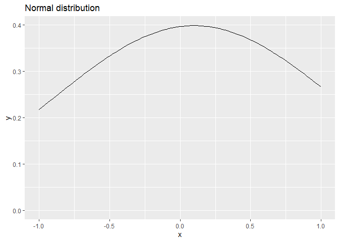<!-- -->

``` r
ggplot(data = data.frame(x = c(-3, 3)), aes(x = x)) +
  stat_function(
    fun = dcauchy, n = 101, args = list(location = 0, scale = 1)
    ) +
  expand_limits(y = 0) + ggtitle("Cauchy distribution")
```

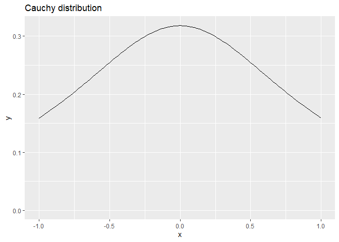<!-- -->

``` r
ggplot(data.frame(x = c(-3, 3)), aes(x = x)) +
  stat_function(
    fun = dstudent_t, args = list(df = 3, mu = 0, sigma = 2.5)
    ) +
  expand_limits(y = 0) + ggtitle(expression(Student~italic(t)*"-distribution"))
```

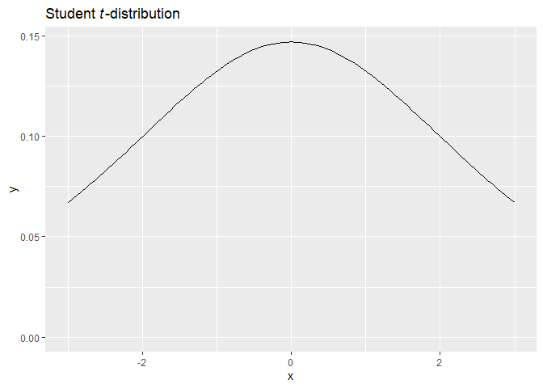<!-- -->

#### Prior summary

``` r
prior_summary(m_1, all = FALSE)
```

    ##                 prior     class                coef group resp dpar nlpar lb ub
    ##          normal(0, 2)         b                                                
    ##        normal(0.1, 2)         b        sand_ratio25                            
    ##        normal(0.2, 2)         b        sand_ratio50                            
    ##        normal(0.1, 2)         b survey_year_fct2019                            
    ##        normal(0.2, 2)         b survey_year_fct2020                            
    ##        normal(0.3, 2)         b survey_year_fct2021                            
    ##          normal(0, 2) Intercept                                                
    ##  student_t(3, 0, 2.5)        sd                                            0   
    ##          cauchy(0, 1)     sigma                                            0   
    ##   source
    ##     user
    ##     user
    ##     user
    ##     user
    ##     user
    ##     user
    ##     user
    ##  default
    ##     user

Conditional <i>R</i>² values

``` r
bayes_R2(m_1, probs = c(0.05, 0.5, 0.95),
         re_formula =  ~ (1 | site/plot) + (1 | botanist_year)) 
##     Estimate   Est.Error        Q5       Q50       Q95
## R2 0.8464731 0.005100259 0.8376967 0.8466772 0.8544419
bayes_R2(m_2, probs = c(0.05, 0.5, 0.95),
         re_formula =  ~ (1 | site/plot) + (1 | botanist_year))
##     Estimate  Est.Error        Q5       Q50       Q95
## R2 0.8458954 0.00515156 0.8369915 0.8461621 0.8539969
```

Marginal <i>R</i>² values

``` r
bayes_R2(m_1, probs = c(0.05, 0.5, 0.95),
         re_formula = 1 ~ 1)
##     Estimate   Est.Error        Q5       Q50       Q95
## R2 0.8084947 0.004562813 0.8005822 0.8087267 0.8155298
bayes_R2(m_2, probs = c(0.05, 0.5, 0.95),
         re_formula = 1 ~ 1)
##    Estimate   Est.Error        Q5       Q50       Q95
## R2 0.808271 0.004648837 0.8002222 0.8084726 0.8155058
```

## Model check

### DHARMa

``` r
DHARMa.helpers::dh_check_brms(m_1, integer = TRUE)
```

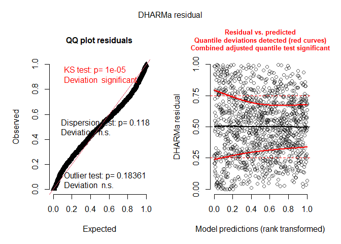<!-- -->

``` r
DHARMa.helpers::dh_check_brms(m_2, integer = TRUE)
```

<!-- -->

### Preparation

``` r
posterior1 <- m_1 %>%
  posterior::as_draws() %>%
  posterior::subset_draws(
    variable = c(
      "b_sand_ratio25",
      "b_sand_ratio50",
      "b_substrate_depth15",
      "b_target_typedry_grassland",
      "b_seed_density8",
      "b_expositionsouth",
      "b_survey_year_fct2019",
      "b_survey_year_fct2020",
      "b_survey_year_fct2021",
      "sd_site__Intercept",
      "sd_site:plot__Intercept",
      "sigma"
    )
  )
posterior2 <- m_2 %>%
  posterior::as_draws() %>%
  posterior::subset_draws(
    variable = c(
      "b_sand_ratio25",
      "b_sand_ratio50",
      "b_substrate_depth15",
      "b_target_typedry_grassland",
      "b_seed_density8",
      "b_expositionsouth",
      "b_survey_year_fct2019",
      "b_survey_year_fct2020",
      "b_survey_year_fct2021",
      "sd_site__Intercept",
      "sd_site:plot__Intercept",
      "sigma"
    )
  )
hmc_diagnostics1 <- nuts_params(m_1)
hmc_diagnostics2 <- nuts_params(m_2)
y <- sites$n
yrep1 <- posterior_predict(m_1, draws = 500)
yrep2 <- posterior_predict(m_2, draws = 500)
loo1 <- loo(m_1, save_psis = TRUE, moment_match = FALSE)
```

    ## Warning: Found 2 observations with a pareto_k > 0.7 in model 'm_1'. It is
    ## recommended to set 'moment_match = TRUE' in order to perform moment matching for
    ## problematic observations.

``` r
loo2 <- loo(m_2, save_psis = TRUE, moment_match = FALSE)
```

    ## Warning: Found 3 observations with a pareto_k > 0.7 in model 'm_2'. It is
    ## recommended to set 'moment_match = TRUE' in order to perform moment matching for
    ## problematic observations.

``` r
draws1 <- m_1 %>%
  posterior::as_draws() %>%
  posterior::summarize_draws() %>%
  filter(str_starts(variable, "b_"))
draws2 <- m_2 %>%
  posterior::as_draws() %>%
  posterior::summarize_draws() %>%
  filter(str_starts(variable, "b_"))
```

### Sampling efficency and effectiveness

#### Rhat

``` r
mcmc_rhat(draws1$rhat)
```

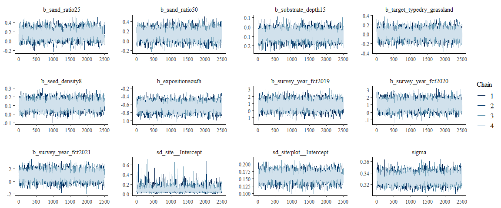<!-- -->

``` r
mcmc_rhat(draws2$rhat)
```

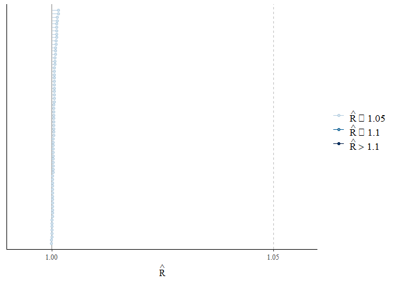<!-- -->

#### Effective sampling size (ESS)

``` r
mcmc_neff(neff_ratio(m_1))
```

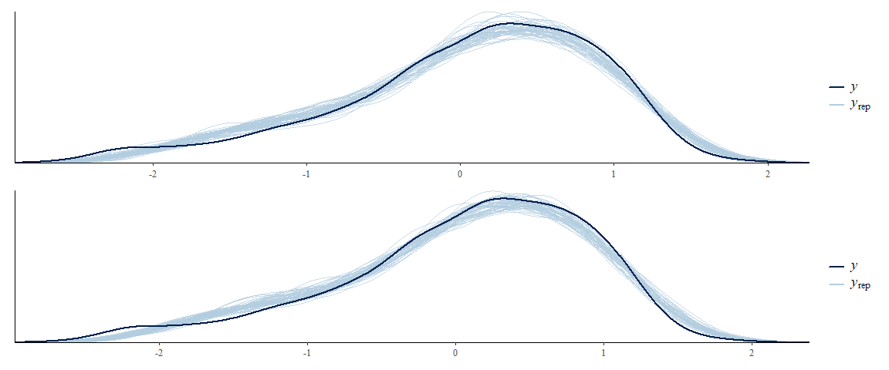<!-- -->

``` r
mcmc_neff(neff_ratio(m_2))
```

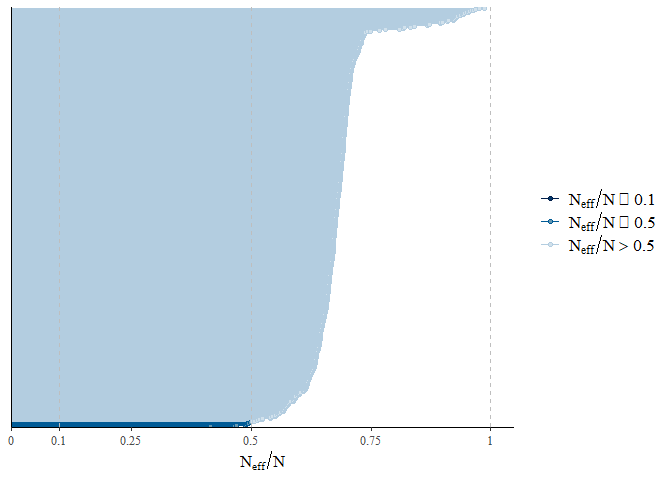<!-- -->

### MCMC diagnostics

``` r
mcmc_trace(posterior1, np = hmc_diagnostics1)
```

    ## No divergences to plot.

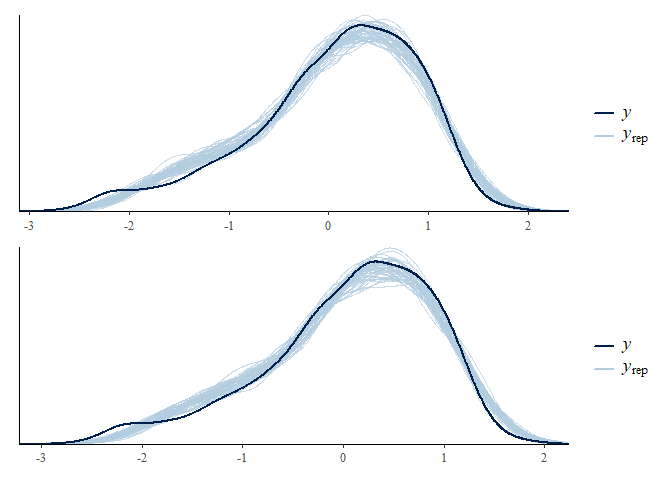<!-- -->

``` r
mcmc_trace(posterior2, np = hmc_diagnostics2)
```

    ## No divergences to plot.

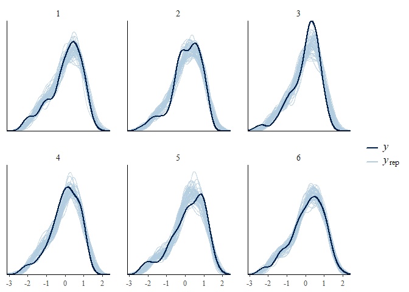<!-- -->

``` r
mcmc_pairs(m_1, off_diag_args = list(size = 1.2),
           pars = c(
             "b_sand_ratio25", "b_sand_ratio50", "b_substrate_depth15",
             "b_target_typedry_grassland", "b_seed_density8",
             "b_expositionsouth", "sigma"
           ))
```

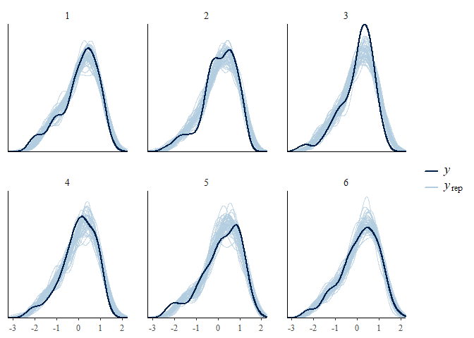<!-- -->

``` r
mcmc_pairs(m_2, off_diag_args = list(size = 1.2),
           pars = c(
             "b_sand_ratio25", "b_sand_ratio50", "b_substrate_depth15",
             "b_target_typedry_grassland", "b_seed_density8",
             "b_expositionsouth", "sigma"
           ))
```

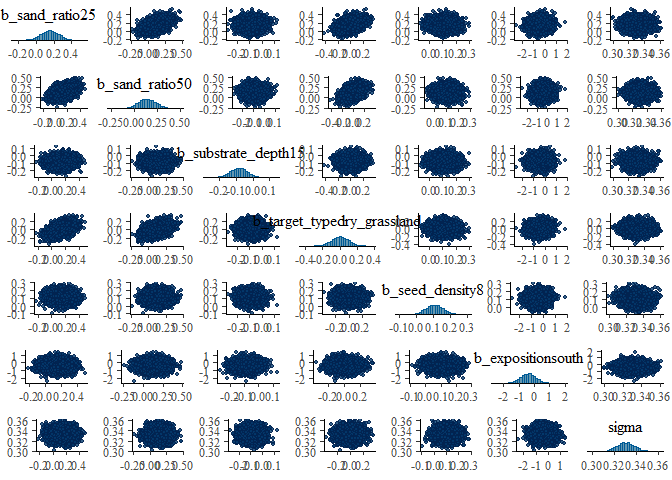<!-- -->

``` r
mcmc_parcoord(posterior1, np = hmc_diagnostics1)
```

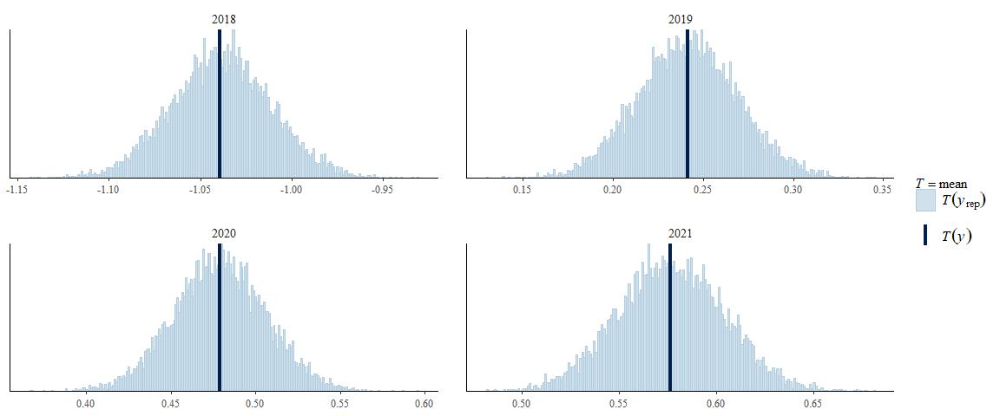<!-- -->

``` r
mcmc_parcoord(posterior2, np = hmc_diagnostics2)
```

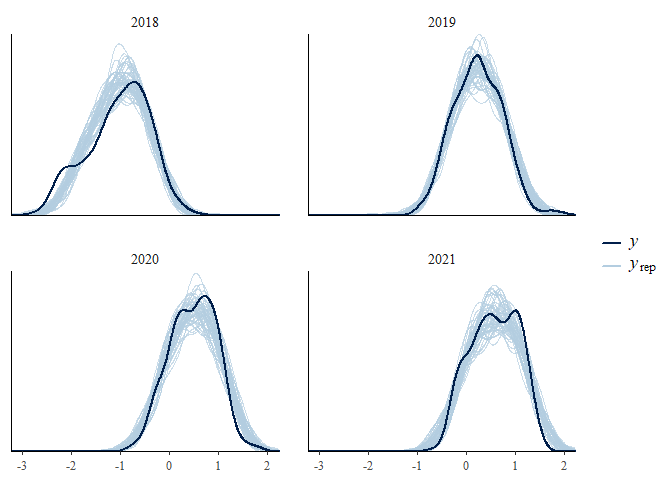<!-- -->

### Posterior predictive check

#### Kernel density

``` r
p1 <- ppc_dens_overlay(y, yrep1[1:50, ])
p2 <- ppc_dens_overlay(y, yrep2[1:50, ])
p1 / p2
```

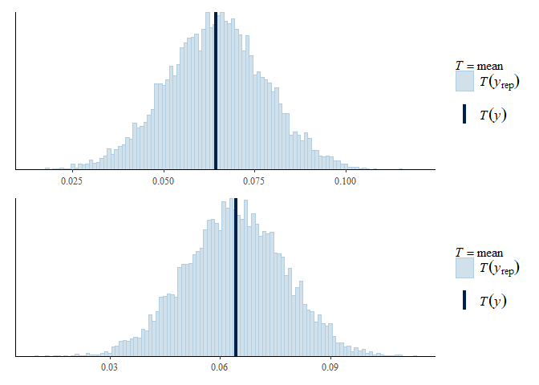<!-- -->

``` r
ppc_dens_overlay_grouped(y, yrep1[1:50, ], group = sites$site)
```

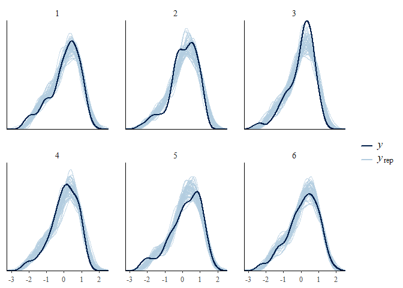<!-- -->

``` r
ppc_dens_overlay_grouped(y, yrep2[1:50, ], group = sites$site)
```

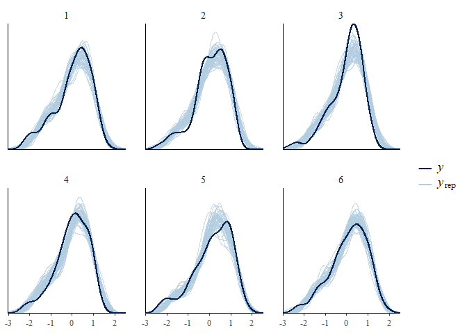<!-- -->

``` r
p1 <- ppc_dens_overlay_grouped(y, yrep1[1:50, ], group = sites$exposition)
p2 <- ppc_dens_overlay_grouped(y, yrep2[1:50, ], group = sites$exposition)
p1 / p2
```

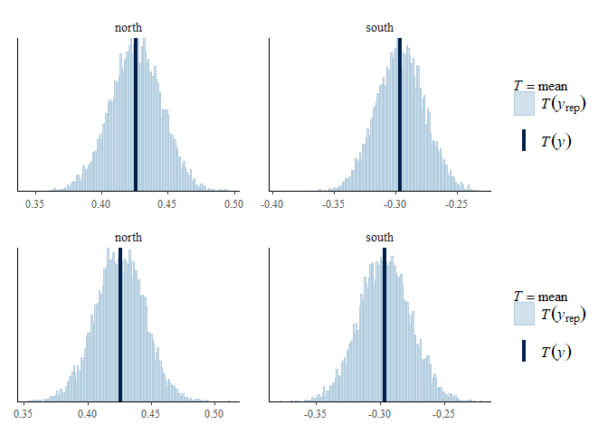<!-- -->

``` r
ppc_dens_overlay_grouped(y, yrep1[1:50, ], group = sites$survey_year_fct)
```

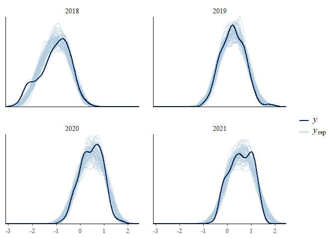<!-- -->

``` r
ppc_dens_overlay_grouped(y, yrep2[1:50, ], group = sites$survey_year_fct)
```

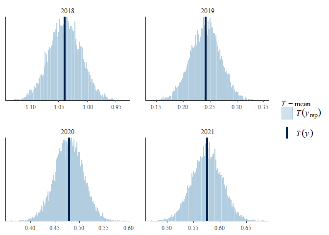<!-- -->

``` r
p1 <- ppc_dens_overlay_grouped(y, yrep1[1:50, ], group = sites$target_type)
p2 <- ppc_dens_overlay_grouped(y, yrep2[1:50, ], group = sites$target_type)
p1 / p2
```

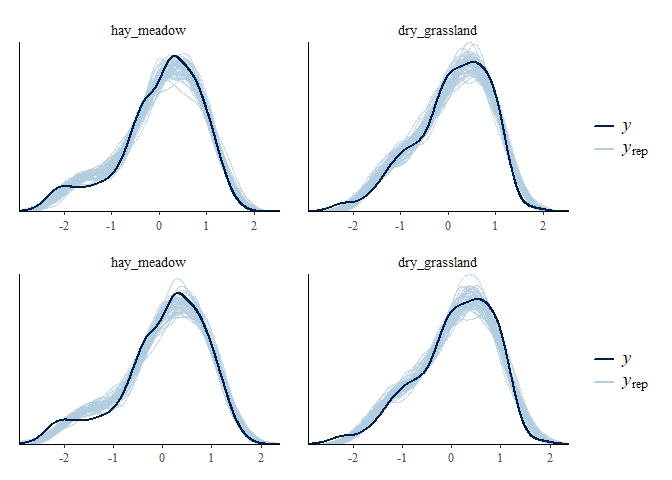<!-- -->

``` r
p1 <- ppc_dens_overlay_grouped(y, yrep1[1:50, ], group = sites$seed_density)
p2 <- ppc_dens_overlay_grouped(y, yrep2[1:50, ], group = sites$seed_density)
p1 / p2
```

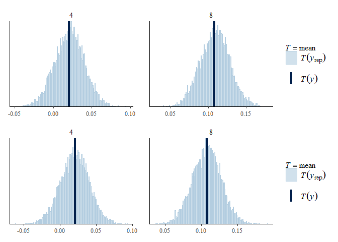<!-- -->

``` r
p1 <- ppc_dens_overlay_grouped(y, yrep1[1:50, ], group = sites$sand_ratio)
p2 <- ppc_dens_overlay_grouped(y, yrep2[1:50, ], group = sites$sand_ratio)
p1 / p2
```

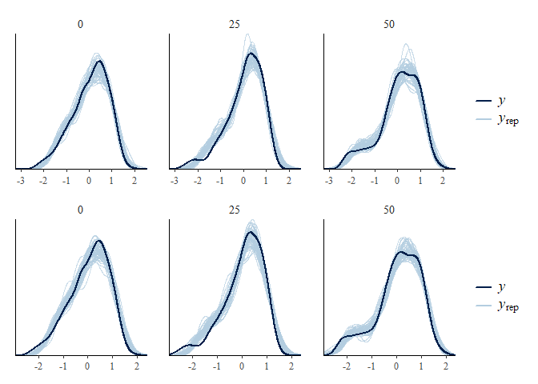<!-- -->

``` r
p1 <- ppc_dens_overlay_grouped(y, yrep1[1:50, ], group = sites$substrate_depth)
p2 <- ppc_dens_overlay_grouped(y, yrep2[1:50, ], group = sites$substrate_depth)
p1 / p2
```

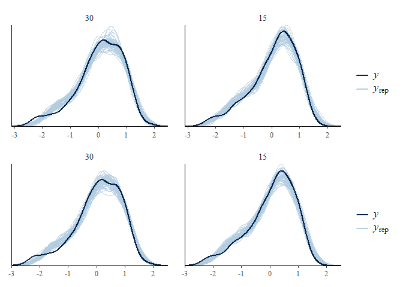<!-- -->

#### Histograms of statistics skew

``` r
p1 <- ppc_stat(y, yrep1, binwidth = 0.001)
p2 <- ppc_stat(y, yrep2, binwidth = 0.001)
p1 / p2
```

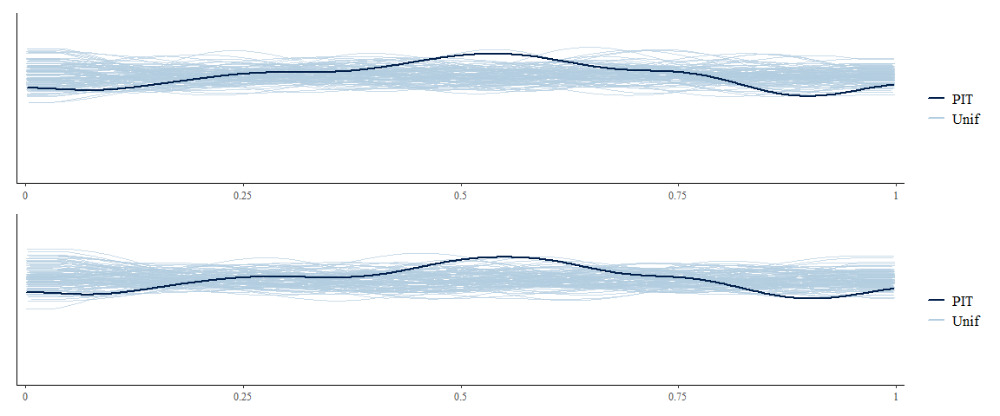<!-- -->

``` r
ppc_stat_grouped(y, yrep1, group = sites$site, binwidth = 0.001)
```

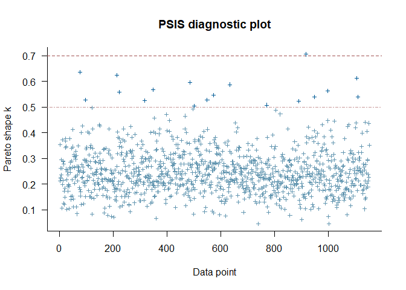<!-- -->

``` r
ppc_stat_grouped(y, yrep2, group = sites$site, binwidth = 0.001)
```

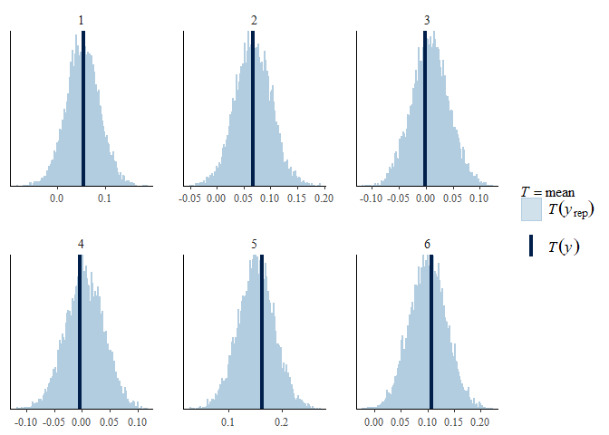<!-- -->

``` r
p1 <- ppc_stat_grouped(y, yrep1, group = sites$exposition, binwidth = 0.001)
p2 <- ppc_stat_grouped(y, yrep2, group = sites$exposition, binwidth = 0.001)
p1 / p2
```

<!-- -->

``` r
ppc_stat_grouped(y, yrep1, group = sites$survey_year_fct, binwidth = 0.001)
```

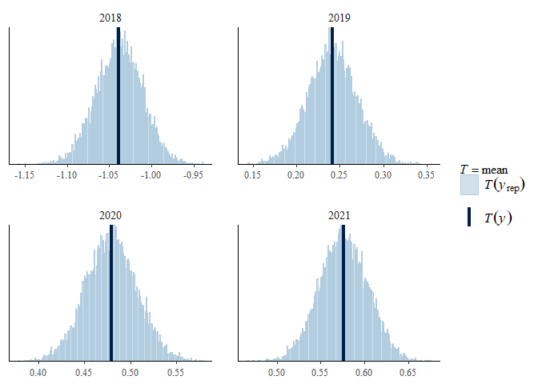<!-- -->

``` r
ppc_stat_grouped(y, yrep2, group = sites$survey_year_fct, binwidth = 0.001)
```

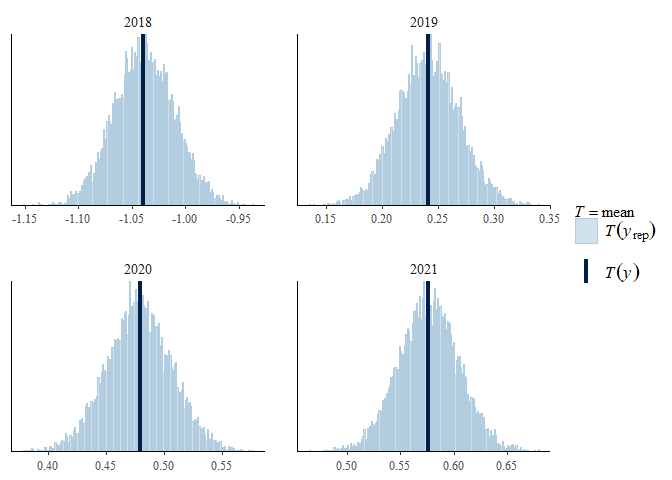<!-- -->

``` r
p1 <- ppc_stat_grouped(y, yrep1, group = sites$target_type, binwidth = 0.001)
p2 <- ppc_stat_grouped(y, yrep2, group = sites$target_type, binwidth = 0.001)
p1 / p2
```

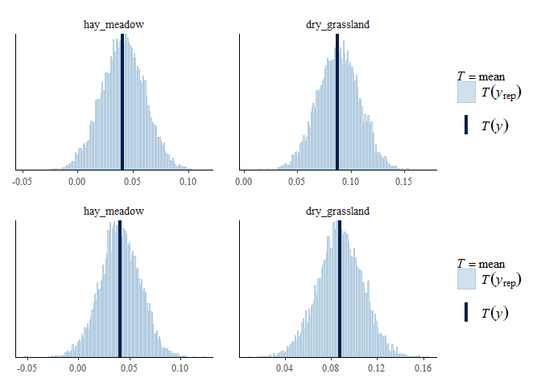<!-- -->

``` r
p1 <- ppc_stat_grouped(y, yrep1, group = sites$seed_density, binwidth = 0.001)
p2 <- ppc_stat_grouped(y, yrep2, group = sites$seed_density, binwidth = 0.001)
p1 / p2
```

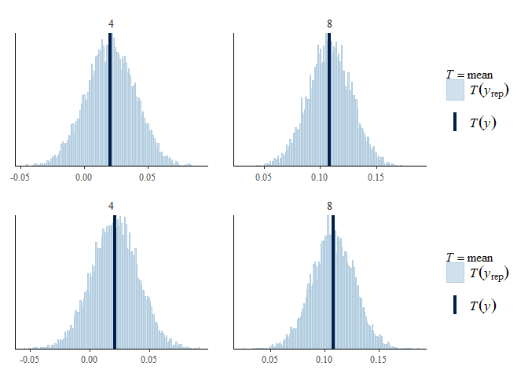<!-- -->

``` r
p1 <- ppc_stat_grouped(y, yrep1, group = sites$sand_ratio, binwidth = 0.001)
p2 <- ppc_stat_grouped(y, yrep2, group = sites$sand_ratio, binwidth = 0.001)
p1 / p2
```

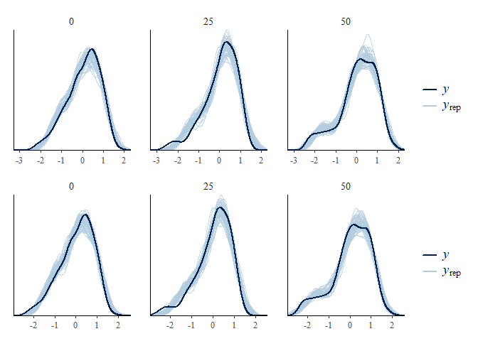<!-- -->

``` r
p1 <- ppc_stat_grouped(y, yrep1, group = sites$substrate_depth, binwidth = 0.001)
p2 <- ppc_stat_grouped(y, yrep2, group = sites$substrate_depth, binwidth = 0.001)
p1 / p2
```

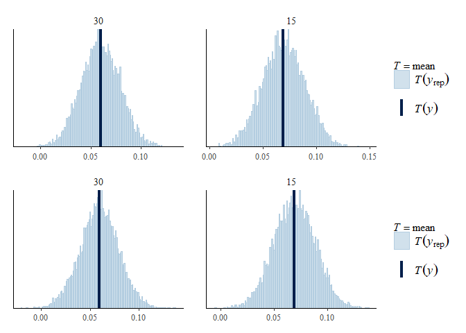<!-- -->

#### LOO (Leave one out)

``` r
loo1
```

    ## 
    ## Computed from 10000 by 1152 log-likelihood matrix
    ## 
    ##          Estimate   SE
    ## elpd_loo   -466.8 30.3
    ## p_loo       185.2  8.9
    ## looic       933.7 60.7
    ## ------
    ## Monte Carlo SE of elpd_loo is NA.
    ## 
    ## Pareto k diagnostic values:
    ##                          Count Pct.    Min. n_eff
    ## (-Inf, 0.5]   (good)     1141  99.0%   701       
    ##  (0.5, 0.7]   (ok)          9   0.8%   338       
    ##    (0.7, 1]   (bad)         2   0.2%   118       
    ##    (1, Inf)   (very bad)    0   0.0%   <NA>      
    ## See help('pareto-k-diagnostic') for details.

``` r
loo2
```

    ## 
    ## Computed from 10000 by 1152 log-likelihood matrix
    ## 
    ##          Estimate   SE
    ## elpd_loo   -473.5 30.4
    ## p_loo       190.2  9.1
    ## looic       947.0 60.7
    ## ------
    ## Monte Carlo SE of elpd_loo is NA.
    ## 
    ## Pareto k diagnostic values:
    ##                          Count Pct.    Min. n_eff
    ## (-Inf, 0.5]   (good)     1133  98.4%   985       
    ##  (0.5, 0.7]   (ok)         16   1.4%   345       
    ##    (0.7, 1]   (bad)         3   0.3%   252       
    ##    (1, Inf)   (very bad)    0   0.0%   <NA>      
    ## See help('pareto-k-diagnostic') for details.

``` r
plot(loo1)
```

<!-- -->

``` r
plot(loo2)
```

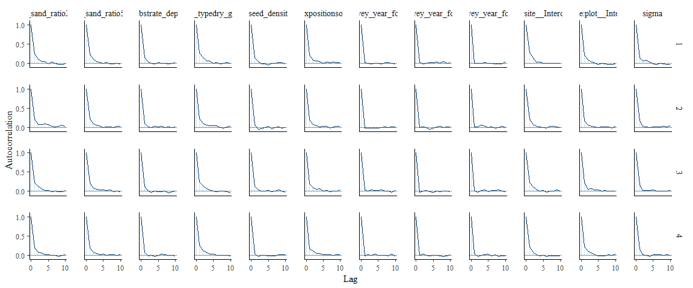<!-- -->

Leave one out probability integral transform

``` r
p1 <- ppc_loo_pit_overlay(y, yrep1, lw = weights(loo1$psis_object))
```

    ## NOTE: The kernel density estimate assumes continuous observations and is not optimal for discrete observations.

``` r
p2 <- ppc_loo_pit_overlay(y, yrep2, lw = weights(loo2$psis_object))
```

    ## NOTE: The kernel density estimate assumes continuous observations and is not optimal for discrete observations.

``` r
p1 / p2
```

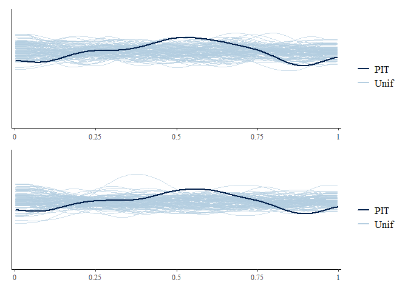<!-- -->

### Autocorrelation check

``` r
mcmc_acf(posterior1, lags = 10)
```

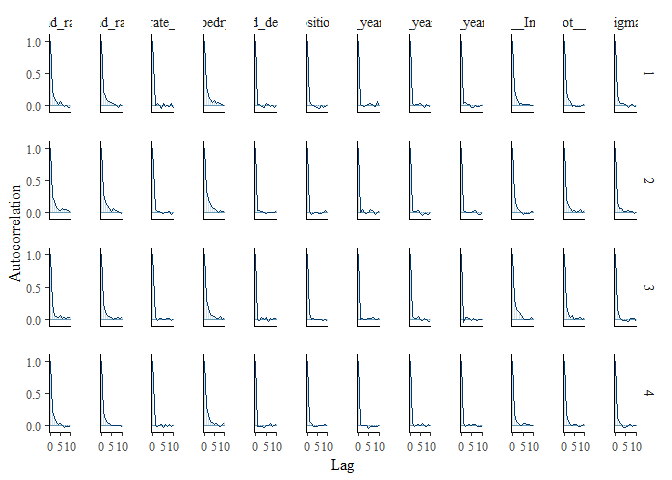<!-- -->

``` r
mcmc_acf(posterior2, lags = 10)
```

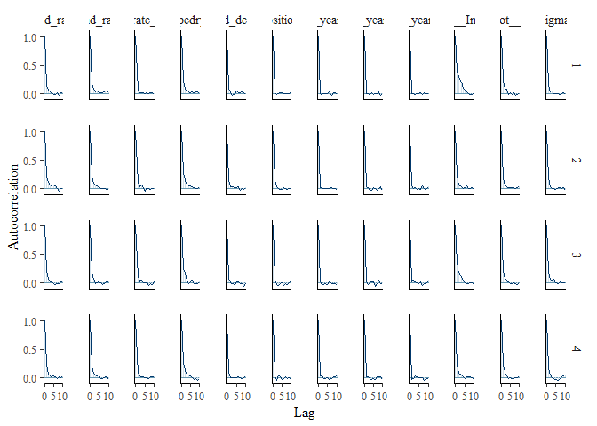<!-- -->

## Output of choosen model

### Model output

Conditional and marignal <i>R</i>²

``` r
bayes_R2(m_1, probs = c(0.05, 0.5, 0.95),
         re_formula =  ~ (1 | site/plot) + (1 | botanist_year)) 
##     Estimate   Est.Error        Q5       Q50       Q95
## R2 0.8464731 0.005100259 0.8376967 0.8466772 0.8544419
bayes_R2(m_1, probs = c(0.05, 0.5, 0.95),
         re_formula = 1 ~ 1)
##     Estimate   Est.Error        Q5       Q50       Q95
## R2 0.8084947 0.004562813 0.8005822 0.8087267 0.8155298
```

Posteriors of chosen model

``` r
draws1
```

    ## # A tibble: 70 × 10
    ##    varia…¹    mean  median     sd    mad       q5      q95  rhat ess_b…² ess_t…³
    ##    <chr>     <dbl>   <dbl>  <dbl>  <dbl>    <dbl>    <dbl> <dbl>   <dbl>   <dbl>
    ##  1 b_Inte… -0.678  -0.678  0.0949 0.0939 -0.836   -5.23e-1  1.00   5620.   7282.
    ##  2 b_sand…  0.184   0.183  0.103  0.104   0.0142   3.54e-1  1.00   4956.   7020.
    ##  3 b_sand…  0.161   0.162  0.104  0.104  -0.00906  3.34e-1  1.00   4749.   7063.
    ##  4 b_targ…  0.0219  0.0233 0.102  0.101  -0.145    1.90e-1  1.00   3964.   6678.
    ##  5 b_expo… -0.390  -0.398  0.956  0.957  -1.96     1.16e+0  1.00   8893.   8547.
    ##  6 b_surv…  0.764   0.753  1.25   1.26   -1.29     2.82e+0  1.00   9685.   9376.
    ##  7 b_surv…  1.04    1.04   1.05   1.06   -0.701    2.76e+0  1.00   9203.   9453.
    ##  8 b_surv…  1.03    1.03   1.28   1.29   -1.09     3.15e+0  1.00   9148.   9344.
    ##  9 b_subs… -0.0831 -0.0829 0.0507 0.0504 -0.167    1.06e-4  1.00   9531.   8645.
    ## 10 b_seed…  0.110   0.110  0.0509 0.0510  0.0244   1.92e-1  1.00   9792.   9571.
    ## # … with 60 more rows, and abbreviated variable names ¹​variable, ²​ess_bulk,
    ## #   ³​ess_tail

``` r
mcmc_intervals(
  posterior1,
  prob = 0.66,
  prob_outer = 0.95,
  point_est = "mean"
  ) +
  theme_classic()
```

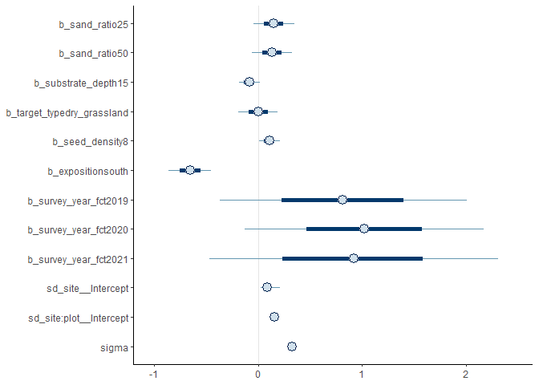<!-- -->

Posteriors of second model:

``` r
mcmc_intervals(
  posterior2,
  prob = 0.66,
  prob_outer = 0.95,
  point_est = "mean"
  ) +
  theme_classic()
```

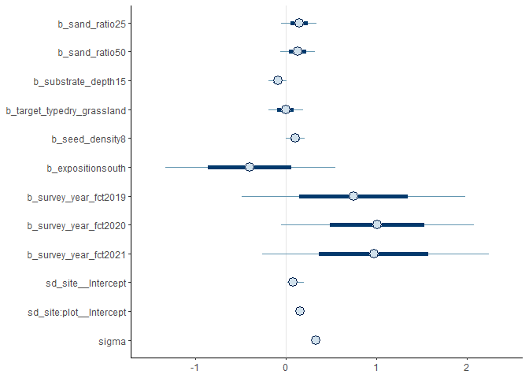<!-- -->

### Effect sizes

Effect sizes are presented just to get exact values of the means if
necessary.

``` r
(emm <- emmeans(m_1, revpairwise ~ target_type + sand_ratio |
                  exposition | survey_year_fct, type = "response"))
```

    ## NOTE: A nesting structure was detected in the fitted model:
    ##     botanist_year %in% (exposition*survey_year_fct)

    ## $emmeans
    ## exposition = north, survey_year_fct = 2018:
    ##  target_type   sand_ratio  emmean lower.HPD upper.HPD
    ##  hay_meadow    0          -0.7502   -0.9068  -0.58484
    ##  dry_grassland 0          -0.7290   -0.8910  -0.56640
    ##  hay_meadow    25         -0.5663   -0.7279  -0.40143
    ##  dry_grassland 25         -0.7253   -0.8929  -0.56032
    ##  hay_meadow    50         -0.5894   -0.7529  -0.41891
    ##  dry_grassland 50         -0.5484   -0.7040  -0.38147
    ## 
    ## exposition = south, survey_year_fct = 2018:
    ##  target_type   sand_ratio  emmean lower.HPD upper.HPD
    ##  hay_meadow    0          -1.3221   -1.4897  -1.15812
    ##  dry_grassland 0          -1.1631   -1.3298  -1.00197
    ##  hay_meadow    25         -1.6033   -1.7691  -1.43755
    ##  dry_grassland 25         -1.2084   -1.3771  -1.04165
    ##  hay_meadow    50         -1.8508   -2.0273  -1.69469
    ##  dry_grassland 50         -1.4862   -1.6469  -1.31592
    ## 
    ## exposition = north, survey_year_fct = 2019:
    ##  target_type   sand_ratio  emmean lower.HPD upper.HPD
    ##  hay_meadow    0           0.6318    0.4620   0.79461
    ##  dry_grassland 0           0.5361    0.3732   0.69943
    ##  hay_meadow    25          0.4623    0.2990   0.63338
    ##  dry_grassland 25          0.4124    0.2397   0.57344
    ##  hay_meadow    50          0.6829    0.5252   0.85295
    ##  dry_grassland 50          0.7133    0.5539   0.87910
    ## 
    ## exposition = south, survey_year_fct = 2019:
    ##  target_type   sand_ratio  emmean lower.HPD upper.HPD
    ##  hay_meadow    0          -0.0691   -0.2323   0.10101
    ##  dry_grassland 0          -0.1774   -0.3374  -0.00573
    ##  hay_meadow    25         -0.0834   -0.2594   0.08456
    ##  dry_grassland 25         -0.0611   -0.2407   0.11113
    ##  hay_meadow    50         -0.1366   -0.3148   0.03230
    ##  dry_grassland 50          0.0598   -0.1165   0.23225
    ## 
    ## exposition = north, survey_year_fct = 2020:
    ##  target_type   sand_ratio  emmean lower.HPD upper.HPD
    ##  hay_meadow    0           0.8009    0.6462   0.97538
    ##  dry_grassland 0           0.8611    0.7016   1.02550
    ##  hay_meadow    25          0.8020    0.6413   0.97112
    ##  dry_grassland 25          0.7707    0.6012   0.93117
    ##  hay_meadow    50          0.8951    0.7276   1.05677
    ##  dry_grassland 50          0.8659    0.7017   1.02915
    ## 
    ## exposition = south, survey_year_fct = 2020:
    ##  target_type   sand_ratio  emmean lower.HPD upper.HPD
    ##  hay_meadow    0           0.0684   -0.0917   0.23502
    ##  dry_grassland 0          -0.0843   -0.2444   0.08771
    ##  hay_meadow    25          0.1484   -0.0129   0.31666
    ##  dry_grassland 25          0.2575    0.0931   0.42323
    ##  hay_meadow    50          0.0542   -0.1152   0.21635
    ##  dry_grassland 50          0.3038    0.1378   0.46850
    ## 
    ## exposition = north, survey_year_fct = 2021:
    ##  target_type   sand_ratio  emmean lower.HPD upper.HPD
    ##  hay_meadow    0           0.9003    0.7430   1.07066
    ##  dry_grassland 0           0.9205    0.7595   1.09095
    ##  hay_meadow    25          0.9448    0.7839   1.11503
    ##  dry_grassland 25          0.9055    0.7506   1.07630
    ##  hay_meadow    50          0.9900    0.8340   1.15768
    ##  dry_grassland 50          1.0142    0.8384   1.16759
    ## 
    ## exposition = south, survey_year_fct = 2021:
    ##  target_type   sand_ratio  emmean lower.HPD upper.HPD
    ##  hay_meadow    0           0.2723    0.1117   0.44244
    ##  dry_grassland 0           0.1319   -0.0334   0.29690
    ##  hay_meadow    25          0.1462   -0.0198   0.30584
    ##  dry_grassland 25          0.2967    0.1343   0.46849
    ##  hay_meadow    50          0.1496   -0.0195   0.30858
    ##  dry_grassland 50          0.2329    0.0620   0.39194
    ## 
    ## Results are averaged over the levels of: substrate_depth, seed_density, botanist_year 
    ## Point estimate displayed: median 
    ## HPD interval probability: 0.95 
    ## 
    ## $contrasts
    ## exposition = north, survey_year_fct = 2018:
    ##  contrast                                                 estimate lower.HPD
    ##  dry_grassland sand_ratio0 - hay_meadow sand_ratio0       0.023342 -0.183559
    ##  hay_meadow sand_ratio25 - hay_meadow sand_ratio0         0.183288 -0.016060
    ##  hay_meadow sand_ratio25 - dry_grassland sand_ratio0      0.162987 -0.051178
    ##  dry_grassland sand_ratio25 - hay_meadow sand_ratio0      0.023764 -0.184756
    ##  dry_grassland sand_ratio25 - dry_grassland sand_ratio0   0.003412 -0.202139
    ##  dry_grassland sand_ratio25 - hay_meadow sand_ratio25    -0.159069 -0.362865
    ##  hay_meadow sand_ratio50 - hay_meadow sand_ratio0         0.161929 -0.048570
    ##  hay_meadow sand_ratio50 - dry_grassland sand_ratio0      0.139746 -0.072076
    ##  hay_meadow sand_ratio50 - hay_meadow sand_ratio25       -0.022405 -0.227470
    ##  hay_meadow sand_ratio50 - dry_grassland sand_ratio25     0.135421 -0.079190
    ##  dry_grassland sand_ratio50 - hay_meadow sand_ratio0      0.203509 -0.000565
    ##  dry_grassland sand_ratio50 - dry_grassland sand_ratio0   0.182701 -0.015996
    ##  dry_grassland sand_ratio50 - hay_meadow sand_ratio25     0.019704 -0.190627
    ##  dry_grassland sand_ratio50 - dry_grassland sand_ratio25  0.178649 -0.027975
    ##  dry_grassland sand_ratio50 - hay_meadow sand_ratio50     0.042585 -0.163392
    ##  upper.HPD
    ##    0.21782
    ##    0.38611
    ##    0.35782
    ##    0.23174
    ##    0.20248
    ##    0.04287
    ##    0.35733
    ##    0.33800
    ##    0.18568
    ##    0.33997
    ##    0.40563
    ##    0.38638
    ##    0.22185
    ##    0.37807
    ##    0.24590
    ## 
    ## exposition = south, survey_year_fct = 2018:
    ##  contrast                                                 estimate lower.HPD
    ##  dry_grassland sand_ratio0 - hay_meadow sand_ratio0       0.159642 -0.039430
    ##  hay_meadow sand_ratio25 - hay_meadow sand_ratio0        -0.281156 -0.476484
    ##  hay_meadow sand_ratio25 - dry_grassland sand_ratio0     -0.440417 -0.641980
    ##  dry_grassland sand_ratio25 - hay_meadow sand_ratio0      0.116073 -0.081969
    ##  dry_grassland sand_ratio25 - dry_grassland sand_ratio0  -0.044775 -0.252327
    ##  dry_grassland sand_ratio25 - hay_meadow sand_ratio25     0.397569  0.192599
    ##  hay_meadow sand_ratio50 - hay_meadow sand_ratio0        -0.526952 -0.730159
    ##  hay_meadow sand_ratio50 - dry_grassland sand_ratio0     -0.688587 -0.896015
    ##  hay_meadow sand_ratio50 - hay_meadow sand_ratio25       -0.245701 -0.447463
    ##  hay_meadow sand_ratio50 - dry_grassland sand_ratio25    -0.643501 -0.849810
    ##  dry_grassland sand_ratio50 - hay_meadow sand_ratio0     -0.164046 -0.374252
    ##  dry_grassland sand_ratio50 - dry_grassland sand_ratio0  -0.324411 -0.528570
    ##  dry_grassland sand_ratio50 - hay_meadow sand_ratio25     0.117231 -0.086156
    ##  dry_grassland sand_ratio50 - dry_grassland sand_ratio25 -0.280170 -0.481431
    ##  dry_grassland sand_ratio50 - hay_meadow sand_ratio50     0.361137  0.156990
    ##  upper.HPD
    ##    0.36000
    ##   -0.06963
    ##   -0.23437
    ##    0.32861
    ##    0.15818
    ##    0.60441
    ##   -0.32157
    ##   -0.48330
    ##   -0.02919
    ##   -0.44135
    ##    0.04216
    ##   -0.11704
    ##    0.32550
    ##   -0.07121
    ##    0.57495
    ## 
    ## exposition = north, survey_year_fct = 2019:
    ##  contrast                                                 estimate lower.HPD
    ##  dry_grassland sand_ratio0 - hay_meadow sand_ratio0      -0.095375 -0.295029
    ##  hay_meadow sand_ratio25 - hay_meadow sand_ratio0        -0.169715 -0.380581
    ##  hay_meadow sand_ratio25 - dry_grassland sand_ratio0     -0.075493 -0.275380
    ##  dry_grassland sand_ratio25 - hay_meadow sand_ratio0     -0.218639 -0.427469
    ##  dry_grassland sand_ratio25 - dry_grassland sand_ratio0  -0.123882 -0.334907
    ##  dry_grassland sand_ratio25 - hay_meadow sand_ratio25    -0.048425 -0.262751
    ##  hay_meadow sand_ratio50 - hay_meadow sand_ratio0         0.049957 -0.149096
    ##  hay_meadow sand_ratio50 - dry_grassland sand_ratio0      0.145321 -0.062329
    ##  hay_meadow sand_ratio50 - hay_meadow sand_ratio25        0.220291  0.020030
    ##  hay_meadow sand_ratio50 - dry_grassland sand_ratio25     0.269965  0.061679
    ##  dry_grassland sand_ratio50 - hay_meadow sand_ratio0      0.081093 -0.122597
    ##  dry_grassland sand_ratio50 - dry_grassland sand_ratio0   0.175481 -0.031122
    ##  dry_grassland sand_ratio50 - hay_meadow sand_ratio25     0.251598  0.044352
    ##  dry_grassland sand_ratio50 - dry_grassland sand_ratio25  0.300938  0.092683
    ##  dry_grassland sand_ratio50 - hay_meadow sand_ratio50     0.030132 -0.181917
    ##  upper.HPD
    ##    0.11396
    ##    0.03281
    ##    0.14750
    ##   -0.01239
    ##    0.07923
    ##    0.16240
    ##    0.26518
    ##    0.34834
    ##    0.43731
    ##    0.48537
    ##    0.28868
    ##    0.38387
    ##    0.46315
    ##    0.50394
    ##    0.22778
    ## 
    ## exposition = south, survey_year_fct = 2019:
    ##  contrast                                                 estimate lower.HPD
    ##  dry_grassland sand_ratio0 - hay_meadow sand_ratio0      -0.108517 -0.316350
    ##  hay_meadow sand_ratio25 - hay_meadow sand_ratio0        -0.013601 -0.215254
    ##  hay_meadow sand_ratio25 - dry_grassland sand_ratio0      0.094711 -0.109530
    ##  dry_grassland sand_ratio25 - hay_meadow sand_ratio0      0.008587 -0.203009
    ##  dry_grassland sand_ratio25 - dry_grassland sand_ratio0   0.118473 -0.093943
    ##  dry_grassland sand_ratio25 - hay_meadow sand_ratio25     0.022025 -0.185164
    ##  hay_meadow sand_ratio50 - hay_meadow sand_ratio0        -0.068815 -0.279351
    ##  hay_meadow sand_ratio50 - dry_grassland sand_ratio0      0.038052 -0.162128
    ##  hay_meadow sand_ratio50 - hay_meadow sand_ratio25       -0.056041 -0.258000
    ##  hay_meadow sand_ratio50 - dry_grassland sand_ratio25    -0.078240 -0.287738
    ##  dry_grassland sand_ratio50 - hay_meadow sand_ratio0      0.126406 -0.077333
    ##  dry_grassland sand_ratio50 - dry_grassland sand_ratio0   0.237301  0.029410
    ##  dry_grassland sand_ratio50 - hay_meadow sand_ratio25     0.141609 -0.062729
    ##  dry_grassland sand_ratio50 - dry_grassland sand_ratio25  0.119606 -0.087386
    ##  dry_grassland sand_ratio50 - hay_meadow sand_ratio50     0.197345 -0.002743
    ##  upper.HPD
    ##    0.09268
    ##    0.19712
    ##    0.29956
    ##    0.21503
    ##    0.31855
    ##    0.23017
    ##    0.12988
    ##    0.25216
    ##    0.15753
    ##    0.13525
    ##    0.33451
    ##    0.44577
    ##    0.34327
    ##    0.33345
    ##    0.41327
    ## 
    ## exposition = north, survey_year_fct = 2020:
    ##  contrast                                                 estimate lower.HPD
    ##  dry_grassland sand_ratio0 - hay_meadow sand_ratio0       0.059919 -0.146315
    ##  hay_meadow sand_ratio25 - hay_meadow sand_ratio0        -0.000568 -0.202361
    ##  hay_meadow sand_ratio25 - dry_grassland sand_ratio0     -0.061226 -0.269139
    ##  dry_grassland sand_ratio25 - hay_meadow sand_ratio0     -0.031467 -0.239209
    ##  dry_grassland sand_ratio25 - dry_grassland sand_ratio0  -0.091855 -0.293074
    ##  dry_grassland sand_ratio25 - hay_meadow sand_ratio25    -0.031729 -0.240383
    ##  hay_meadow sand_ratio50 - hay_meadow sand_ratio0         0.094042 -0.112378
    ##  hay_meadow sand_ratio50 - dry_grassland sand_ratio0      0.033781 -0.184721
    ##  hay_meadow sand_ratio50 - hay_meadow sand_ratio25        0.092025 -0.107930
    ##  hay_meadow sand_ratio50 - dry_grassland sand_ratio25     0.126184 -0.092489
    ##  dry_grassland sand_ratio50 - hay_meadow sand_ratio0      0.061768 -0.138272
    ##  dry_grassland sand_ratio50 - dry_grassland sand_ratio0   0.003878 -0.210167
    ##  dry_grassland sand_ratio50 - hay_meadow sand_ratio25     0.063651 -0.149428
    ##  dry_grassland sand_ratio50 - dry_grassland sand_ratio25  0.095812 -0.109347
    ##  dry_grassland sand_ratio50 - hay_meadow sand_ratio50    -0.029421 -0.235480
    ##  upper.HPD
    ##    0.26231
    ##    0.20780
    ##    0.14844
    ##    0.17024
    ##    0.11922
    ##    0.17601
    ##    0.29635
    ##    0.22726
    ##    0.30538
    ##    0.32523
    ##    0.26776
    ##    0.20487
    ##    0.26985
    ##    0.30571
    ##    0.17830
    ## 
    ## exposition = south, survey_year_fct = 2020:
    ##  contrast                                                 estimate lower.HPD
    ##  dry_grassland sand_ratio0 - hay_meadow sand_ratio0      -0.152102 -0.356442
    ##  hay_meadow sand_ratio25 - hay_meadow sand_ratio0         0.078636 -0.134834
    ##  hay_meadow sand_ratio25 - dry_grassland sand_ratio0      0.232051  0.015547
    ##  dry_grassland sand_ratio25 - hay_meadow sand_ratio0      0.188998 -0.015089
    ##  dry_grassland sand_ratio25 - dry_grassland sand_ratio0   0.341658  0.132266
    ##  dry_grassland sand_ratio25 - hay_meadow sand_ratio25     0.109675 -0.095248
    ##  hay_meadow sand_ratio50 - hay_meadow sand_ratio0        -0.013867 -0.218491
    ##  hay_meadow sand_ratio50 - dry_grassland sand_ratio0      0.137968 -0.072736
    ##  hay_meadow sand_ratio50 - hay_meadow sand_ratio25       -0.093658 -0.305944
    ##  hay_meadow sand_ratio50 - dry_grassland sand_ratio25    -0.204710 -0.404527
    ##  dry_grassland sand_ratio50 - hay_meadow sand_ratio0      0.234783  0.014219
    ##  dry_grassland sand_ratio50 - dry_grassland sand_ratio0   0.388284  0.186507
    ##  dry_grassland sand_ratio50 - hay_meadow sand_ratio25     0.155498 -0.057414
    ##  dry_grassland sand_ratio50 - dry_grassland sand_ratio25  0.045988 -0.166647
    ##  dry_grassland sand_ratio50 - hay_meadow sand_ratio50     0.248701  0.040068
    ##  upper.HPD
    ##    0.05343
    ##    0.27865
    ##    0.42839
    ##    0.40060
    ##    0.54530
    ##    0.31573
    ##    0.19650
    ##    0.34558
    ##    0.10938
    ##    0.00924
    ##    0.43416
    ##    0.60606
    ##    0.36404
    ##    0.24917
    ##    0.46091
    ## 
    ## exposition = north, survey_year_fct = 2021:
    ##  contrast                                                 estimate lower.HPD
    ##  dry_grassland sand_ratio0 - hay_meadow sand_ratio0       0.019125 -0.196654
    ##  hay_meadow sand_ratio25 - hay_meadow sand_ratio0         0.045306 -0.155633
    ##  hay_meadow sand_ratio25 - dry_grassland sand_ratio0      0.025057 -0.181684
    ##  dry_grassland sand_ratio25 - hay_meadow sand_ratio0      0.005197 -0.190900
    ##  dry_grassland sand_ratio25 - dry_grassland sand_ratio0  -0.014958 -0.219688
    ##  dry_grassland sand_ratio25 - hay_meadow sand_ratio25    -0.039552 -0.238944
    ##  hay_meadow sand_ratio50 - hay_meadow sand_ratio0         0.090840 -0.109908
    ##  hay_meadow sand_ratio50 - dry_grassland sand_ratio0      0.072544 -0.138106
    ##  hay_meadow sand_ratio50 - hay_meadow sand_ratio25        0.044965 -0.156974
    ##  hay_meadow sand_ratio50 - dry_grassland sand_ratio25     0.085789 -0.114262
    ##  dry_grassland sand_ratio50 - hay_meadow sand_ratio0      0.114837 -0.095353
    ##  dry_grassland sand_ratio50 - dry_grassland sand_ratio0   0.094632 -0.108361
    ##  dry_grassland sand_ratio50 - hay_meadow sand_ratio25     0.068206 -0.144690
    ##  dry_grassland sand_ratio50 - dry_grassland sand_ratio25  0.109449 -0.093730
    ##  dry_grassland sand_ratio50 - hay_meadow sand_ratio50     0.024271 -0.178067
    ##  upper.HPD
    ##    0.22229
    ##    0.25705
    ##    0.23606
    ##    0.21649
    ##    0.19164
    ##    0.16463
    ##    0.30221
    ##    0.27523
    ##    0.25188
    ##    0.29160
    ##    0.31711
    ##    0.30273
    ##    0.27119
    ##    0.31689
    ##    0.23534
    ## 
    ## exposition = south, survey_year_fct = 2021:
    ##  contrast                                                 estimate lower.HPD
    ##  dry_grassland sand_ratio0 - hay_meadow sand_ratio0      -0.139350 -0.346482
    ##  hay_meadow sand_ratio25 - hay_meadow sand_ratio0        -0.125975 -0.330327
    ##  hay_meadow sand_ratio25 - dry_grassland sand_ratio0      0.014369 -0.199184
    ##  dry_grassland sand_ratio25 - hay_meadow sand_ratio0      0.024602 -0.185554
    ##  dry_grassland sand_ratio25 - dry_grassland sand_ratio0   0.164899 -0.038234
    ##  dry_grassland sand_ratio25 - hay_meadow sand_ratio25     0.151076 -0.056322
    ##  hay_meadow sand_ratio50 - hay_meadow sand_ratio0        -0.123119 -0.331438
    ##  hay_meadow sand_ratio50 - dry_grassland sand_ratio0      0.017762 -0.193674
    ##  hay_meadow sand_ratio50 - hay_meadow sand_ratio25        0.003160 -0.203903
    ##  hay_meadow sand_ratio50 - dry_grassland sand_ratio25    -0.147401 -0.356973
    ##  dry_grassland sand_ratio50 - hay_meadow sand_ratio0     -0.038651 -0.244692
    ##  dry_grassland sand_ratio50 - dry_grassland sand_ratio0   0.101655 -0.114437
    ##  dry_grassland sand_ratio50 - hay_meadow sand_ratio25     0.086080 -0.114534
    ##  dry_grassland sand_ratio50 - dry_grassland sand_ratio25 -0.064300 -0.272436
    ##  dry_grassland sand_ratio50 - hay_meadow sand_ratio50     0.085819 -0.123032
    ##  upper.HPD
    ##    0.07159
    ##    0.07659
    ##    0.21325
    ##    0.23342
    ##    0.37363
    ##    0.35444
    ##    0.08028
    ##    0.22009
    ##    0.20835
    ##    0.05537
    ##    0.16487
    ##    0.29871
    ##    0.29915
    ##    0.14030
    ##    0.29234
    ## 
    ## Results are averaged over the levels of: substrate_depth, seed_density, botanist_year 
    ## Point estimate displayed: median 
    ## HPD interval probability: 0.95

# Session info

    ## R version 4.2.2 (2022-10-31 ucrt)
    ## Platform: x86_64-w64-mingw32/x64 (64-bit)
    ## Running under: Windows 10 x64 (build 22621)
    ## 
    ## Matrix products: default
    ## 
    ## locale:
    ## [1] LC_COLLATE=German_Germany.utf8  LC_CTYPE=German_Germany.utf8   
    ## [3] LC_MONETARY=German_Germany.utf8 LC_NUMERIC=C                   
    ## [5] LC_TIME=German_Germany.utf8    
    ## 
    ## attached base packages:
    ## [1] stats     graphics  grDevices utils     datasets  methods   base     
    ## 
    ## other attached packages:
    ##  [1] emmeans_1.8.2             tidybayes_3.0.2          
    ##  [3] loo_2.5.1                 bayesplot_1.10.0         
    ##  [5] DHARMa.helpers_0.0.0.9000 DHARMa_0.4.6             
    ##  [7] brms_2.18.0               Rcpp_1.0.9               
    ##  [9] patchwork_1.1.2           ggbeeswarm_0.6.0         
    ## [11] forcats_0.5.2             stringr_1.4.1            
    ## [13] dplyr_1.0.10              purrr_0.3.5              
    ## [15] readr_2.1.3               tidyr_1.2.1              
    ## [17] tibble_3.1.8              ggplot2_3.4.0            
    ## [19] tidyverse_1.3.2           here_1.0.1               
    ## 
    ## loaded via a namespace (and not attached):
    ##   [1] utf8_1.2.2           tidyselect_1.2.0     lme4_1.1-31         
    ##   [4] htmlwidgets_1.5.4    grid_4.2.2           RNeXML_2.4.8        
    ##   [7] munsell_0.5.0        codetools_0.2-18     interp_1.1-3        
    ##  [10] DT_0.26              miniUI_0.1.1.1       withr_2.5.0         
    ##  [13] Brobdingnag_1.2-9    colorspace_2.0-3     qgam_1.3.4          
    ##  [16] uuid_1.1-0           highr_0.9            knitr_1.41          
    ##  [19] rstudioapi_0.14      stats4_4.2.2         labeling_0.4.2      
    ##  [22] rstan_2.26.13        bit64_4.0.5          farver_2.1.1        
    ##  [25] gap.datasets_0.0.5   bridgesampling_1.1-2 rprojroot_2.0.3     
    ##  [28] coda_0.19-4          vctrs_0.5.1          generics_0.1.3      
    ##  [31] xfun_0.35            timechange_0.1.1     adegenet_2.1.8      
    ##  [34] doParallel_1.0.17    R6_2.5.1             markdown_1.4        
    ##  [37] assertthat_0.2.1     promises_1.2.0.1     scales_1.2.1        
    ##  [40] vroom_1.6.0          googlesheets4_1.0.1  phylobase_0.8.10    
    ##  [43] beeswarm_0.4.0       gtable_0.3.1         processx_3.8.0      
    ##  [46] rlang_1.0.6          splines_4.2.2        gargle_1.2.1        
    ##  [49] broom_1.0.1          checkmate_2.1.0      inline_0.3.19       
    ##  [52] yaml_2.3.6           reshape2_1.4.4       abind_1.4-5         
    ##  [55] modelr_0.1.10        threejs_0.3.3        crosstalk_1.2.0     
    ##  [58] backports_1.4.1      httpuv_1.6.6         tensorA_0.36.2      
    ##  [61] tools_4.2.2          ellipsis_0.3.2       posterior_1.3.1     
    ##  [64] RColorBrewer_1.1-3   plyr_1.8.8           progress_1.2.2      
    ##  [67] base64enc_0.1-3      ps_1.7.2             prettyunits_1.1.1   
    ##  [70] deldir_1.0-6         zoo_1.8-11           haven_2.5.1         
    ##  [73] cluster_2.1.4        fs_1.5.2             magrittr_2.0.3      
    ##  [76] ggdist_3.2.0         colourpicker_1.2.0   reprex_2.0.2        
    ##  [79] googledrive_2.0.0    mvtnorm_1.1-3        matrixStats_0.63.0  
    ##  [82] hms_1.1.2            shinyjs_2.1.0        mime_0.12           
    ##  [85] evaluate_0.18        arrayhelpers_1.1-0   xtable_1.8-4        
    ##  [88] XML_3.99-0.12        shinystan_2.6.0      jpeg_0.1-10         
    ##  [91] readxl_1.4.1         gridExtra_2.3        rstantools_2.2.0    
    ##  [94] compiler_4.2.2       KernSmooth_2.23-20   V8_4.2.2            
    ##  [97] crayon_1.5.2         minqa_1.2.5          StanHeaders_2.26.13 
    ## [100] htmltools_0.5.3      mgcv_1.8-41          later_1.3.0         
    ## [103] tzdb_0.3.0           RcppParallel_5.1.5   lubridate_1.9.0     
    ## [106] DBI_1.1.3            dbplyr_2.2.1         MASS_7.3-58.1       
    ## [109] boot_1.3-28          Matrix_1.5-3         ade4_1.7-20         
    ## [112] permute_0.9-7        cli_3.4.1            adegraphics_1.0-16  
    ## [115] parallel_4.2.2       igraph_1.3.5         pkgconfig_2.0.3     
    ## [118] rncl_0.8.6           sp_1.5-1             foreach_1.5.2       
    ## [121] xml2_1.3.3           svUnit_1.0.6         dygraphs_1.1.1.6    
    ## [124] vipor_0.4.5          estimability_1.4.1   rvest_1.0.3         
    ## [127] distributional_0.3.1 callr_3.7.3          digest_0.6.30       
    ## [130] vegan_2.6-4          rmarkdown_2.18       cellranger_1.1.0    
    ## [133] gap_1.3-1            curl_4.3.3           shiny_1.7.3         
    ## [136] gtools_3.9.4         nloptr_2.0.3         lifecycle_1.0.3     
    ## [139] nlme_3.1-160         jsonlite_1.8.3       seqinr_4.2-23       
    ## [142] fansi_1.0.3          pillar_1.8.1         lattice_0.20-45     
    ## [145] fastmap_1.1.0        httr_1.4.4           pkgbuild_1.4.0      
    ## [148] glue_1.6.2           xts_0.12.2           iterators_1.0.14    
    ## [151] png_0.1-8            shinythemes_1.2.0    bit_4.0.5           
    ## [154] stringi_1.7.8        latticeExtra_0.6-30  ape_5.6-2
