Favourable Conservation Status (FCS): <br> Analysis of Bauer et
al. (unpublished) Field experiment
================
Markus Bauer <br>
2022-12-01

FCS sensu Helm et al. (2015) <https://doi.org/10.1111/ddi.12285>

# Preparation

#### Packages

``` r
library(here)
library(tidyverse)
library(ggbeeswarm)
library(patchwork)
library(brms)
library(DHARMa)
library(DHARMa.helpers)
library(bayesplot)
library(loo)
library(tidybayes)
library(emmeans)
```

#### Load data

``` r
sites <- read_csv(
  here("data", "processed", "data_processed_sites.csv"),
  col_names = TRUE, na = c("na", "NA", ""), col_types =
    cols(
      .default = "?",
      plot = "f",
      site = "f",
      sand_ratio = "f",
      substrate_depth = col_factor(levels = c("30", "15")),
      target_type = col_factor(levels = c(
        "hay_meadow", "dry_grassland"
        )),
      seed_density = "f",
      exposition = col_factor(levels = c("north", "south")),
      survey_year = "c"
      )
  ) %>%
  ### Exclude data of seed mixtures
  filter(survey_year != "seeded") %>%
  mutate(
    survey_year_fct = factor(survey_year),
    botanist_year = str_c(survey_year, botanist, sep = " "),
    botanist_year = factor(botanist_year),
    n = fcs_target,
    id = factor(id)
    ) %>%
  select(
    id, plot, site, exposition, sand_ratio, substrate_depth, target_type,
    seed_density, survey_year_fct, survey_year, botanist_year, n
    )
```

# Statistics

## Data exploration

### Graphs of raw data

<!-- -->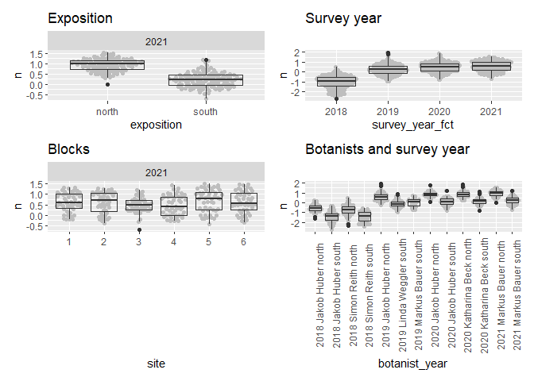<!-- --><!-- -->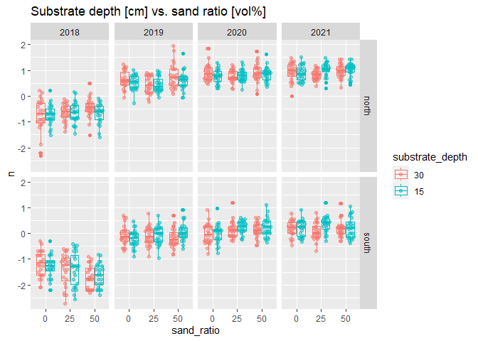<!-- --><!-- -->

### Outliers, zero-inflation, transformations?

    ## # A tibble: 12 × 3
    ## # Groups:   exposition [2]
    ##    exposition site      n
    ##    <fct>      <fct> <int>
    ##  1 north      1        96
    ##  2 north      2        96
    ##  3 north      3        96
    ##  4 north      4        96
    ##  5 north      5        96
    ##  6 north      6        96
    ##  7 south      1        96
    ##  8 south      2        96
    ##  9 south      3        96
    ## 10 south      4        96
    ## 11 south      5        96
    ## 12 south      6        96

<!-- --><!-- --><!-- --><!-- -->

## Model building

### Models

Model caluclations

``` r
load(file = here("outputs", "models", "model_fcs_2.Rdata"))
load(file = here("outputs", "models", "model_fcs_full.Rdata"))
```

### Model comparison

``` r
m_1 <- m2
m_2 <- m_full
```

Model forumlas for m_1 and m_2

``` r
m_1$formula
```

    ## n ~ sand_ratio * target_type * exposition * survey_year_fct + substrate_depth + seed_density + substrate_depth:exposition + seed_density:exposition + substrate_depth:survey_year_fct + seed_density:survey_year_fct + botanist_year + (1 | site/plot)

``` r
m_2$formula
```

    ## n ~ sand_ratio * target_type * exposition * survey_year_fct + substrate_depth * seed_density + substrate_depth:exposition + seed_density:exposition + substrate_depth:survey_year_fct + seed_density:survey_year_fct + substrate_depth:exposition:survey_year_fct + seed_density:exposition:survey_year_fct + botanist_year + (1 | site/plot)

Possible prior distributions

``` r
ggplot(data = data.frame(x = c(-1, 1)), aes(x = x)) +
  stat_function(fun = dnorm, n = 101, args = list(mean = 0.1, sd = 1)) +
  expand_limits(y = 0) + ggtitle("Normal distribution")
```

<!-- -->

``` r
ggplot(data = data.frame(x = c(-1, 1)), aes(x = x)) +
  stat_function(fun = dcauchy, n = 101, args = list(location = 0, scale = 1)) +
  expand_limits(y = 0) + ggtitle("Cauchy distribution")
```

<!-- -->

``` r
ggplot(data.frame(x = c(-1, 1)), aes(x = x)) +
  stat_function(fun = dstudent_t, args = list(df = 3, mu = 0, sigma = 2.5)) +
  expand_limits(y = 0) + ggtitle(expression(Student~italic(t)*"-distribution"))
```

<!-- -->

Prior summary

``` r
prior_summary(m_1, all = FALSE)
```

    ##                 prior     class                coef group resp dpar nlpar lb ub
    ##          normal(0, 1)         b                                                
    ##        normal(0.1, 1)         b        sand_ratio25                            
    ##        normal(0.2, 1)         b        sand_ratio50                            
    ##        normal(0.1, 1)         b survey_year_fct2019                            
    ##        normal(0.2, 1)         b survey_year_fct2020                            
    ##        normal(0.3, 1)         b survey_year_fct2021                            
    ##          normal(0, 1) Intercept                                                
    ##  student_t(3, 0, 2.5)        sd                                            0   
    ##          cauchy(0, 1)     sigma                                            0   
    ##   source
    ##     user
    ##     user
    ##     user
    ##     user
    ##     user
    ##     user
    ##     user
    ##  default
    ##     user

Conditional <i>R</i>² values

``` r
bayes_R2(m_1, probs = c(0.05, 0.5, 0.95),
         re_formula =  ~ (1 | site/plot) + (1 | botanist_year)) 
```

    ##     Estimate   Est.Error        Q5       Q50       Q95
    ## R2 0.8462899 0.005097922 0.8375052 0.8465433 0.8542504

``` r
bayes_R2(m_2, probs = c(0.05, 0.5, 0.95),
         re_formula =  ~ (1 | site/plot) + (1 | botanist_year))
```

    ##     Estimate   Est.Error        Q5       Q50       Q95
    ## R2 0.8457112 0.005134747 0.8368855 0.8459598 0.8537324

Marginal <i>R</i>² values

``` r
bayes_R2(m_1, probs = c(0.05, 0.5, 0.95),
         re_formula = 1 ~ 1)
```

    ##     Estimate   Est.Error        Q5       Q50       Q95
    ## R2 0.8080202 0.004573187 0.8002889 0.8082438 0.8151444

``` r
bayes_R2(m_2, probs = c(0.05, 0.5, 0.95),
         re_formula = 1 ~ 1)
```

    ##     Estimate   Est.Error        Q5       Q50      Q95
    ## R2 0.8078335 0.004578375 0.8000471 0.8080261 0.815036

### Model check

#### DHARMa

``` r
DHARMa.helpers::dh_check_brms(m_1, integer = TRUE)
```

<!-- -->

``` r
DHARMa.helpers::dh_check_brms(m_2, integer = TRUE)
```

<!-- -->

#### Preparation

``` r
posterior1 <- m_1 %>%
  posterior::as_draws() %>%
  posterior::subset_draws(
    variable = c(
      "b_sand_ratio25",
      "b_sand_ratio50",
      "b_substrate_depth15",
      "b_target_typedry_grassland",
      "b_seed_density8",
      "b_expositionsouth",
      "b_survey_year_fct2019",
      "b_survey_year_fct2020",
      "b_survey_year_fct2021",
      "sd_site__Intercept",
      "sd_site:plot__Intercept",
      "sigma"
    )
  )
posterior2 <- m_2 %>%
  posterior::as_draws() %>%
  posterior::subset_draws(
    variable = c(
      "b_sand_ratio25",
      "b_sand_ratio50",
      "b_substrate_depth15",
      "b_target_typedry_grassland",
      "b_seed_density8",
      "b_expositionsouth",
      "b_survey_year_fct2019",
      "b_survey_year_fct2020",
      "b_survey_year_fct2021",
      "sd_site__Intercept",
      "sd_site:plot__Intercept",
      "sigma"
    )
  )
hmc_diagnostics1 <- nuts_params(m_1)
hmc_diagnostics2 <- nuts_params(m_2)
y <- sites$n
yrep1 <- posterior_predict(m_1, draws = 500)
yrep2 <- posterior_predict(m_2, draws = 500)
loo1 <- loo(m_1, save_psis = TRUE, moment_match = FALSE)
```

    ## Warning: Found 4 observations with a pareto_k > 0.7 in model 'm_1'. It is
    ## recommended to set 'moment_match = TRUE' in order to perform moment matching for
    ## problematic observations.

``` r
loo2 <- loo(m_2, save_psis = TRUE, moment_match = FALSE)
```

    ## Warning: Found 1 observations with a pareto_k > 0.7 in model 'm_2'. It is
    ## recommended to set 'moment_match = TRUE' in order to perform moment matching for
    ## problematic observations.

``` r
draws1 <- m_1 %>%
  posterior::as_draws() %>%
  posterior::summarize_draws() %>%
  filter(str_starts(variable, "b_"))
draws2 <- m_2 %>%
  posterior::as_draws() %>%
  posterior::summarize_draws() %>%
  filter(str_starts(variable, "b_"))
```

#### Sampling efficency/effectiveness (Rhat and EFF)

``` r
range(draws1$rhat)
```

    ## [1] 0.9998772 1.0010835

``` r
range(draws2$rhat)
```

    ## [1] 0.9997552 1.0007494

``` r
range(draws1$ess_bulk)
```

    ## [1]  4885.057 10007.119

``` r
range(draws2$ess_bulk)
```

    ## [1]  4682.083 10002.631

``` r
range(draws1$ess_tail)
```

    ## [1] 7096.046 9531.096

``` r
range(draws2$ess_tail)
```

    ## [1] 6564.480 9577.983

#### MCMC diagnostics

``` r
mcmc_trace(posterior1, np = hmc_diagnostics1)
```

    ## No divergences to plot.

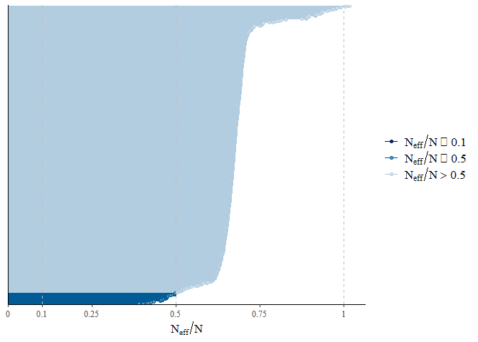<!-- -->

``` r
mcmc_trace(posterior2, np = hmc_diagnostics2)
```

    ## No divergences to plot.

<!-- -->

``` r
mcmc_pairs(m_1, off_diag_args = list(size = 1.2),
           pars = c(
             "b_sand_ratio25", "b_sand_ratio50", "b_substrate_depth15",
             "b_target_typedry_grassland", "b_seed_density8",
             "b_expositionsouth", "sigma"
           ))
```

<!-- -->

``` r
mcmc_pairs(m_2, off_diag_args = list(size = 1.2),
           pars = c(
             "b_sand_ratio25", "b_sand_ratio50", "b_substrate_depth15",
             "b_target_typedry_grassland", "b_seed_density8",
             "b_expositionsouth", "sigma"
           ))
```

<!-- -->

``` r
mcmc_parcoord(posterior1, np = hmc_diagnostics1)
```

<!-- -->

``` r
mcmc_parcoord(posterior2, np = hmc_diagnostics2)
```

<!-- -->

#### Posterior predictive check

##### Kernel density

``` r
p1 <- ppc_dens_overlay(y, yrep1[1:50, ])
p2 <- ppc_dens_overlay(y, yrep2[1:50, ])
p1 / p2
```

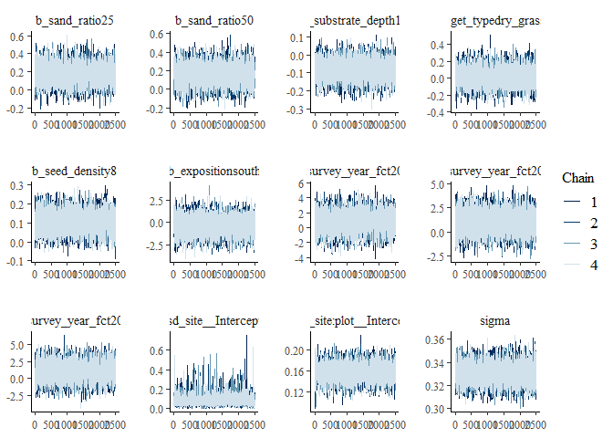<!-- -->

``` r
ppc_dens_overlay_grouped(y, yrep1[1:50, ], group = sites$site)
```

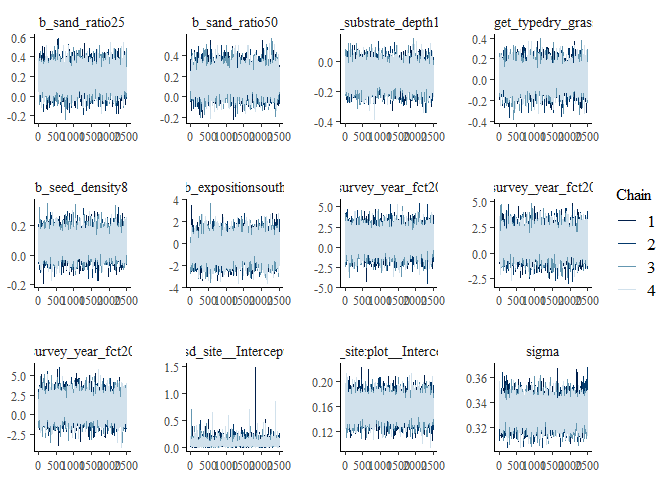<!-- -->

``` r
ppc_dens_overlay_grouped(y, yrep2[1:50, ], group = sites$site)
```

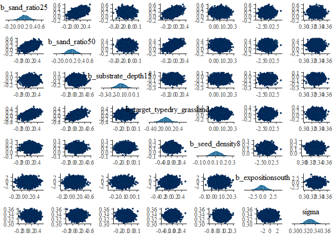<!-- -->

``` r
p1 <- ppc_dens_overlay_grouped(y, yrep1[1:50, ], group = sites$exposition)
p2 <- ppc_dens_overlay_grouped(y, yrep2[1:50, ], group = sites$exposition)
p1 / p2
```

<!-- -->

``` r
ppc_dens_overlay_grouped(y, yrep1[1:50, ], group = sites$survey_year_fct)
```

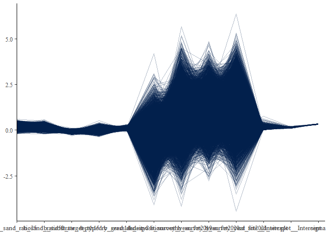<!-- -->

``` r
ppc_dens_overlay_grouped(y, yrep2[1:50, ], group = sites$survey_year_fct)
```

<!-- -->

``` r
p1 <- ppc_dens_overlay_grouped(y, yrep1[1:50, ], group = sites$target_type)
p2 <- ppc_dens_overlay_grouped(y, yrep2[1:50, ], group = sites$target_type)
p1 / p2
```

<!-- -->

``` r
p1 <- ppc_dens_overlay_grouped(y, yrep1[1:50, ], group = sites$seed_density)
p2 <- ppc_dens_overlay_grouped(y, yrep2[1:50, ], group = sites$seed_density)
p1 / p2
```

<!-- -->

``` r
p1 <- ppc_dens_overlay_grouped(y, yrep1[1:50, ], group = sites$sand_ratio)
p2 <- ppc_dens_overlay_grouped(y, yrep2[1:50, ], group = sites$sand_ratio)
p1 / p2
```

<!-- -->

``` r
p1 <- ppc_dens_overlay_grouped(y, yrep1[1:50, ], group = sites$substrate_depth)
p2 <- ppc_dens_overlay_grouped(y, yrep2[1:50, ], group = sites$substrate_depth)
p1 / p2
```

<!-- -->

##### Histograms of statistics skew

``` r
p1 <- ppc_stat(y, yrep1, binwidth = 0.001)
p2 <- ppc_stat(y, yrep2, binwidth = 0.001)
p1 / p2
```

<!-- -->

``` r
ppc_stat_grouped(y, yrep1, group = sites$site, binwidth = 0.001)
```

<!-- -->

``` r
ppc_stat_grouped(y, yrep2, group = sites$site, binwidth = 0.001)
```

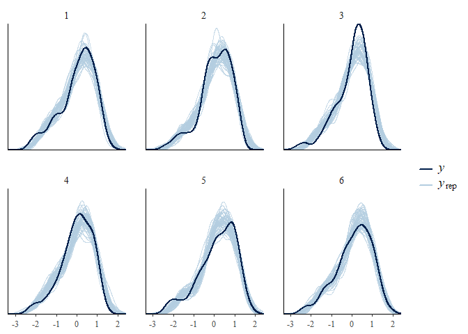<!-- -->

``` r
p1 <- ppc_stat_grouped(y, yrep1, group = sites$exposition, binwidth = 0.001)
p2 <- ppc_stat_grouped(y, yrep2, group = sites$exposition, binwidth = 0.001)
p1 / p2
```

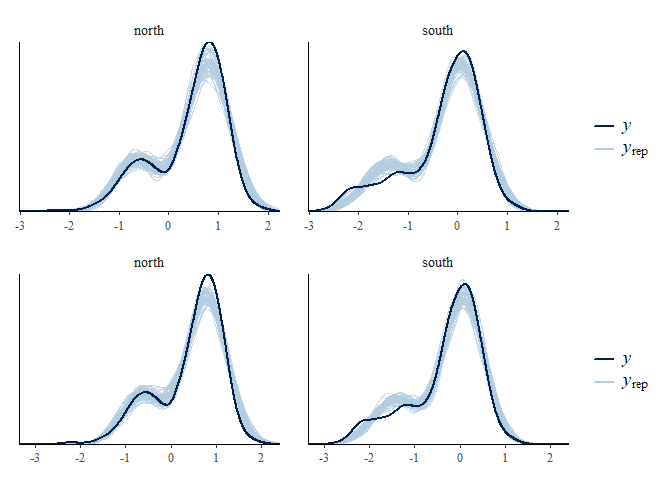<!-- -->

``` r
ppc_stat_grouped(y, yrep1, group = sites$survey_year_fct, binwidth = 0.001)
```

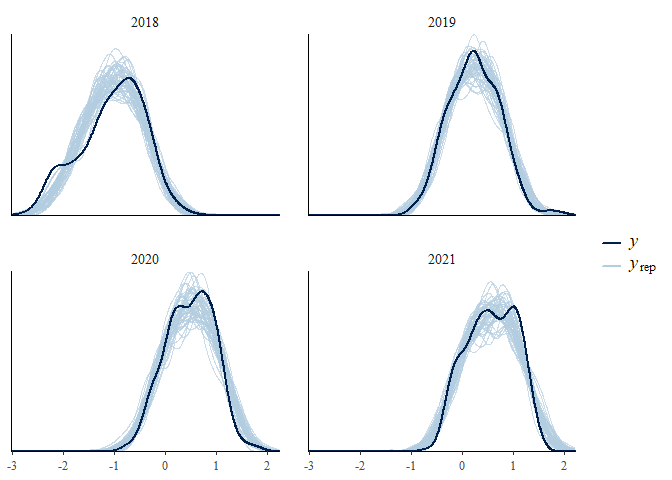<!-- -->

``` r
ppc_stat_grouped(y, yrep2, group = sites$survey_year_fct, binwidth = 0.001)
```

<!-- -->

``` r
p1 <- ppc_stat_grouped(y, yrep1, group = sites$target_type, binwidth = 0.001)
p2 <- ppc_stat_grouped(y, yrep2, group = sites$target_type, binwidth = 0.001)
p1 / p2
```

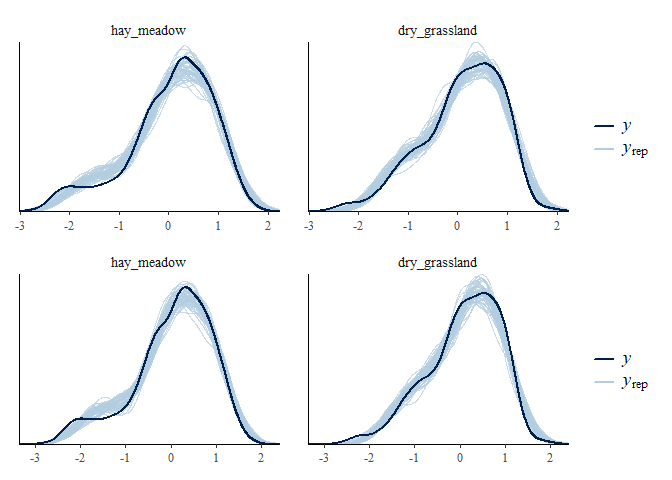<!-- -->

``` r
p1 <- ppc_stat_grouped(y, yrep1, group = sites$seed_density, binwidth = 0.001)
p2 <- ppc_stat_grouped(y, yrep2, group = sites$seed_density, binwidth = 0.001)
p1 / p2
```

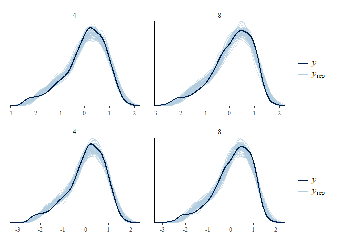<!-- -->

``` r
p1 <- ppc_stat_grouped(y, yrep1, group = sites$sand_ratio, binwidth = 0.001)
p2 <- ppc_stat_grouped(y, yrep2, group = sites$sand_ratio, binwidth = 0.001)
p1 / p2
```

<!-- -->

``` r
p1 <- ppc_stat_grouped(y, yrep1, group = sites$substrate_depth, binwidth = 0.001)
p2 <- ppc_stat_grouped(y, yrep2, group = sites$substrate_depth, binwidth = 0.001)
p1 / p2
```

<!-- -->

##### LOO (Leave one out)

``` r
loo1
```

    ## 
    ## Computed from 10000 by 1152 log-likelihood matrix
    ## 
    ##          Estimate   SE
    ## elpd_loo   -464.7 30.4
    ## p_loo       182.4  8.8
    ## looic       929.4 60.8
    ## ------
    ## Monte Carlo SE of elpd_loo is NA.
    ## 
    ## Pareto k diagnostic values:
    ##                          Count Pct.    Min. n_eff
    ## (-Inf, 0.5]   (good)     1137  98.7%   762       
    ##  (0.5, 0.7]   (ok)         11   1.0%   451       
    ##    (0.7, 1]   (bad)         4   0.3%   168       
    ##    (1, Inf)   (very bad)    0   0.0%   <NA>      
    ## See help('pareto-k-diagnostic') for details.

``` r
loo2
```

    ## 
    ## Computed from 10000 by 1152 log-likelihood matrix
    ## 
    ##          Estimate   SE
    ## elpd_loo   -471.0 30.5
    ## p_loo       187.2  9.0
    ## looic       942.0 60.9
    ## ------
    ## Monte Carlo SE of elpd_loo is NA.
    ## 
    ## Pareto k diagnostic values:
    ##                          Count Pct.    Min. n_eff
    ## (-Inf, 0.5]   (good)     1134  98.4%   542       
    ##  (0.5, 0.7]   (ok)         17   1.5%   206       
    ##    (0.7, 1]   (bad)         1   0.1%   169       
    ##    (1, Inf)   (very bad)    0   0.0%   <NA>      
    ## See help('pareto-k-diagnostic') for details.

``` r
plot(loo1)
```

<!-- -->

``` r
plot(loo2)
```

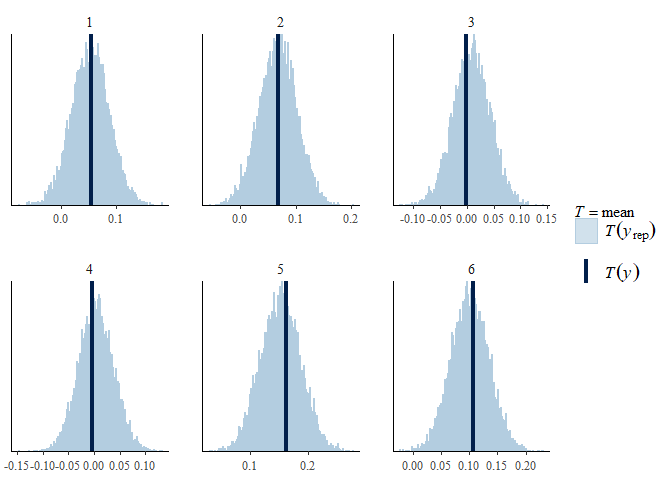<!-- -->

Leave one out probability integral transform

``` r
p1 <- ppc_loo_pit_overlay(y, yrep1, lw = weights(loo1$psis_object))
```

    ## NOTE: The kernel density estimate assumes continuous observations and is not optimal for discrete observations.

``` r
p2 <- ppc_loo_pit_overlay(y, yrep2, lw = weights(loo2$psis_object))
```

    ## NOTE: The kernel density estimate assumes continuous observations and is not optimal for discrete observations.

``` r
p1 / p2
```

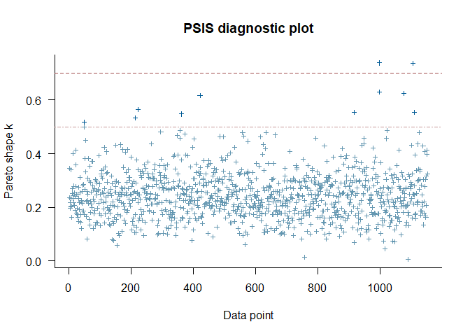<!-- -->

#### Autocorrelation check

``` r
mcmc_acf(posterior1, lags = 10)
```

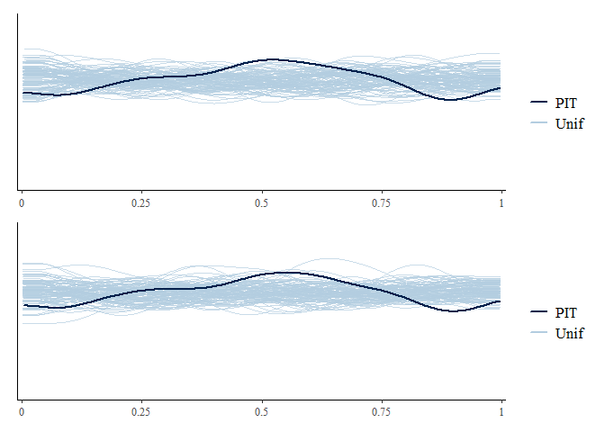<!-- -->

``` r
mcmc_acf(posterior2, lags = 10)
```

<!-- -->

## Output of choosen model

### Model output

Conditional and marignal <i>R</i>²

``` r
bayes_R2(m_1, probs = c(0.05, 0.5, 0.95),
         re_formula =  ~ (1 | site/plot) + (1 | botanist_year)) 
```

    ##     Estimate   Est.Error        Q5       Q50       Q95
    ## R2 0.8462899 0.005097922 0.8375052 0.8465433 0.8542504

``` r
bayes_R2(m_1, probs = c(0.05, 0.5, 0.95),
         re_formula = 1 ~ 1)
```

    ##     Estimate   Est.Error        Q5       Q50       Q95
    ## R2 0.8080202 0.004573187 0.8002889 0.8082438 0.8151444

Posteriors of chosen model

``` r
draws1
```

    ## # A tibble: 65 × 10
    ##    variable           mean   median     sd    mad      q5      q95  rhat ess_b…¹
    ##    <chr>             <dbl>    <dbl>  <dbl>  <dbl>   <dbl>    <dbl> <dbl>   <dbl>
    ##  1 b_Intercept    -0.678   -0.678   0.0907 0.0895 -0.829  -5.30e-1  1.00   6245.
    ##  2 b_sand_ratio25  0.151    0.151   0.0984 0.0976 -0.0100  3.15e-1  1.00   5437.
    ##  3 b_sand_ratio50  0.134    0.135   0.0984 0.0989 -0.0287  2.93e-1  1.00   5723.
    ##  4 b_target_type…  0.00175  0.00156 0.0965 0.0965 -0.157   1.62e-1  1.00   4965.
    ##  5 b_expositions… -0.654   -0.653   0.105  0.105  -0.827  -4.84e-1  1.00   5204.
    ##  6 b_survey_year…  0.816    0.809   0.605  0.613  -0.179   1.81e+0  1.00   9633.
    ##  7 b_survey_year…  1.02     1.02    0.588  0.591   0.0429  1.99e+0  1.00   9892.
    ##  8 b_survey_year…  0.918    0.924   0.713  0.712  -0.245   2.09e+0  1.00   9129.
    ##  9 b_substrate_d… -0.0828  -0.0827  0.0509 0.0508 -0.166   9.93e-4  1.00   9159.
    ## 10 b_seed_densit…  0.108    0.107   0.0510 0.0511  0.0260  1.93e-1  1.00   9632.
    ## # … with 55 more rows, 1 more variable: ess_tail <dbl>, and abbreviated
    ## #   variable name ¹​ess_bulk

``` r
mcmc_intervals(
  posterior1,
  prob = 0.66,
  prob_outer = 0.95,
  point_est = "mean"
  ) +
  theme_classic()
```

<!-- -->

Posteriors of second model:

``` r
mcmc_intervals(
  posterior2,
  prob = 0.66,
  prob_outer = 0.95,
  point_est = "mean"
  ) +
  theme_classic()
```

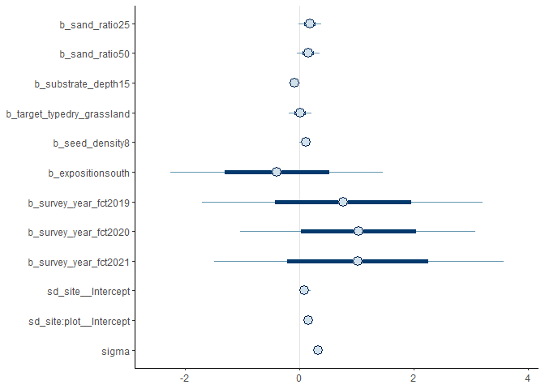<!-- -->

### Effect sizes

Just, to get exact values if necessary, which is not possible from the
figure

``` r
(emm <- emmeans(m_1, revpairwise ~ target_type + sand_ratio |
                  exposition | survey_year_fct, type = "response"))
```

    ## NOTE: A nesting structure was detected in the fitted model:
    ##     botanist_year %in% survey_year_fct

    ## $emmeans
    ## exposition = north, survey_year_fct = 2018:
    ##  target_type   sand_ratio  emmean lower.HPD upper.HPD
    ##  hay_meadow    0          -0.7290   -0.8868   -0.5731
    ##  dry_grassland 0          -0.7273   -0.8840   -0.5611
    ##  hay_meadow    25         -0.5787   -0.7408   -0.4108
    ##  dry_grassland 25         -0.7217   -0.8912   -0.5552
    ##  hay_meadow    50         -0.5959   -0.7597   -0.4303
    ##  dry_grassland 50         -0.5495   -0.7196   -0.3925
    ## 
    ## exposition = south, survey_year_fct = 2018:
    ##  target_type   sand_ratio  emmean lower.HPD upper.HPD
    ##  hay_meadow    0          -1.3404   -1.4986   -1.1774
    ##  dry_grassland 0          -1.1769   -1.3353   -1.0030
    ##  hay_meadow    25         -1.6058   -1.7681   -1.4367
    ##  dry_grassland 25         -1.2188   -1.3857   -1.0564
    ##  hay_meadow    50         -1.8548   -2.0186   -1.6886
    ##  dry_grassland 50         -1.4954   -1.6554   -1.3245
    ## 
    ## exposition = north, survey_year_fct = 2019:
    ##  target_type   sand_ratio  emmean lower.HPD upper.HPD
    ##  hay_meadow    0           0.4075   -0.5417    1.3434
    ##  dry_grassland 0           0.3170   -0.6856    1.2259
    ##  hay_meadow    25          0.2483   -0.6907    1.2065
    ##  dry_grassland 25          0.1906   -0.7119    1.1870
    ##  hay_meadow    50          0.4629   -0.5037    1.4055
    ##  dry_grassland 50          0.4923   -0.4315    1.4693
    ## 
    ## exposition = south, survey_year_fct = 2019:
    ##  target_type   sand_ratio  emmean lower.HPD upper.HPD
    ##  hay_meadow    0           0.0389   -0.4234    0.5642
    ##  dry_grassland 0          -0.0696   -0.5627    0.4331
    ##  hay_meadow    25          0.0218   -0.4808    0.5211
    ##  dry_grassland 25          0.0476   -0.4392    0.5619
    ##  hay_meadow    50         -0.0336   -0.5526    0.4453
    ##  dry_grassland 50          0.1666   -0.3359    0.6720
    ## 
    ## exposition = north, survey_year_fct = 2020:
    ##  target_type   sand_ratio  emmean lower.HPD upper.HPD
    ##  hay_meadow    0           0.7959    0.6340    0.9628
    ##  dry_grassland 0           0.8591    0.6973    1.0254
    ##  hay_meadow    25          0.8038    0.6407    0.9665
    ##  dry_grassland 25          0.7718    0.6096    0.9408
    ##  hay_meadow    50          0.8953    0.7303    1.0632
    ##  dry_grassland 50          0.8681    0.6947    1.0275
    ## 
    ## exposition = south, survey_year_fct = 2020:
    ##  target_type   sand_ratio  emmean lower.HPD upper.HPD
    ##  hay_meadow    0           0.0713   -0.0962    0.2342
    ##  dry_grassland 0          -0.0788   -0.2402    0.0886
    ##  hay_meadow    25          0.1481   -0.0186    0.3139
    ##  dry_grassland 25          0.2571    0.0928    0.4243
    ##  hay_meadow    50          0.0527   -0.1132    0.2220
    ##  dry_grassland 50          0.3006    0.1283    0.4590
    ## 
    ## exposition = north, survey_year_fct = 2021:
    ##  target_type   sand_ratio  emmean lower.HPD upper.HPD
    ##  hay_meadow    0           0.8984    0.7339    1.0606
    ##  dry_grassland 0           0.9189    0.7570    1.0913
    ##  hay_meadow    25          0.9454    0.7783    1.1122
    ##  dry_grassland 25          0.9064    0.7524    1.0817
    ##  hay_meadow    50          0.9930    0.8242    1.1565
    ##  dry_grassland 50          1.0168    0.8594    1.1944
    ## 
    ## exposition = south, survey_year_fct = 2021:
    ##  target_type   sand_ratio  emmean lower.HPD upper.HPD
    ##  hay_meadow    0           0.2731    0.1074    0.4381
    ##  dry_grassland 0           0.1349   -0.0323    0.2938
    ##  hay_meadow    25          0.1473   -0.0164    0.3133
    ##  dry_grassland 25          0.2968    0.1301    0.4669
    ##  hay_meadow    50          0.1474   -0.0227    0.3092
    ##  dry_grassland 50          0.2352    0.0650    0.3960
    ## 
    ## Results are averaged over the levels of: substrate_depth, seed_density, botanist_year 
    ## Point estimate displayed: median 
    ## HPD interval probability: 0.95 
    ## 
    ## $contrasts
    ## exposition = north, survey_year_fct = 2018:
    ##  contrast                                                estimate lower.HPD
    ##  dry_grassland sand_ratio0 - hay_meadow sand_ratio0       0.00156  -0.18759
    ##  hay_meadow sand_ratio25 - hay_meadow sand_ratio0         0.15103  -0.04974
    ##  hay_meadow sand_ratio25 - dry_grassland sand_ratio0      0.14973  -0.05107
    ##  dry_grassland sand_ratio25 - hay_meadow sand_ratio0      0.00610  -0.19370
    ##  dry_grassland sand_ratio25 - dry_grassland sand_ratio0   0.00696  -0.19400
    ##  dry_grassland sand_ratio25 - hay_meadow sand_ratio25    -0.14231  -0.34600
    ##  hay_meadow sand_ratio50 - hay_meadow sand_ratio0         0.13489  -0.05256
    ##  hay_meadow sand_ratio50 - dry_grassland sand_ratio0      0.13170  -0.07231
    ##  hay_meadow sand_ratio50 - hay_meadow sand_ratio25       -0.01896  -0.22546
    ##  hay_meadow sand_ratio50 - dry_grassland sand_ratio25     0.12563  -0.08387
    ##  dry_grassland sand_ratio50 - hay_meadow sand_ratio0      0.18044  -0.02247
    ##  dry_grassland sand_ratio50 - dry_grassland sand_ratio0   0.17921  -0.02489
    ##  dry_grassland sand_ratio50 - hay_meadow sand_ratio25     0.02790  -0.17391
    ##  dry_grassland sand_ratio50 - dry_grassland sand_ratio25  0.17328  -0.01965
    ##  dry_grassland sand_ratio50 - hay_meadow sand_ratio50     0.04653  -0.15562
    ##  upper.HPD
    ##    0.19174
    ##    0.33923
    ##    0.35425
    ##    0.20785
    ##    0.21009
    ##    0.05573
    ##    0.32858
    ##    0.32923
    ##    0.17980
    ##    0.32781
    ##    0.37533
    ##    0.37594
    ##    0.22973
    ##    0.39144
    ##    0.24050
    ## 
    ## exposition = south, survey_year_fct = 2018:
    ##  contrast                                                estimate lower.HPD
    ##  dry_grassland sand_ratio0 - hay_meadow sand_ratio0       0.16372  -0.03078
    ##  hay_meadow sand_ratio25 - hay_meadow sand_ratio0        -0.26527  -0.46785
    ##  hay_meadow sand_ratio25 - dry_grassland sand_ratio0     -0.42899  -0.64831
    ##  dry_grassland sand_ratio25 - hay_meadow sand_ratio0      0.12357  -0.08157
    ##  dry_grassland sand_ratio25 - dry_grassland sand_ratio0  -0.04126  -0.23835
    ##  dry_grassland sand_ratio25 - hay_meadow sand_ratio25     0.38887   0.18221
    ##  hay_meadow sand_ratio50 - hay_meadow sand_ratio0        -0.51265  -0.71349
    ##  hay_meadow sand_ratio50 - dry_grassland sand_ratio0     -0.67564  -0.89026
    ##  hay_meadow sand_ratio50 - hay_meadow sand_ratio25       -0.24759  -0.45714
    ##  hay_meadow sand_ratio50 - dry_grassland sand_ratio25    -0.63537  -0.84118
    ##  dry_grassland sand_ratio50 - hay_meadow sand_ratio0     -0.15300  -0.36233
    ##  dry_grassland sand_ratio50 - dry_grassland sand_ratio0  -0.31802  -0.52420
    ##  dry_grassland sand_ratio50 - hay_meadow sand_ratio25     0.11218  -0.08835
    ##  dry_grassland sand_ratio50 - dry_grassland sand_ratio25 -0.27747  -0.47659
    ##  dry_grassland sand_ratio50 - hay_meadow sand_ratio50     0.35848   0.15930
    ##  upper.HPD
    ##    0.36013
    ##   -0.07129
    ##   -0.23966
    ##    0.32597
    ##    0.16298
    ##    0.58304
    ##   -0.31229
    ##   -0.47703
    ##   -0.04942
    ##   -0.43468
    ##    0.04246
    ##   -0.11952
    ##    0.31751
    ##   -0.07067
    ##    0.56780
    ## 
    ## exposition = north, survey_year_fct = 2019:
    ##  contrast                                                estimate lower.HPD
    ##  dry_grassland sand_ratio0 - hay_meadow sand_ratio0      -0.08630  -0.28454
    ##  hay_meadow sand_ratio25 - hay_meadow sand_ratio0        -0.15685  -0.35684
    ##  hay_meadow sand_ratio25 - dry_grassland sand_ratio0     -0.07197  -0.27471
    ##  dry_grassland sand_ratio25 - hay_meadow sand_ratio0     -0.21454  -0.42081
    ##  dry_grassland sand_ratio25 - dry_grassland sand_ratio0  -0.12829  -0.33037
    ##  dry_grassland sand_ratio25 - hay_meadow sand_ratio25    -0.05711  -0.25306
    ##  hay_meadow sand_ratio50 - hay_meadow sand_ratio0         0.05874  -0.13366
    ##  hay_meadow sand_ratio50 - dry_grassland sand_ratio0      0.14402  -0.05534
    ##  hay_meadow sand_ratio50 - hay_meadow sand_ratio25        0.21587   0.01219
    ##  hay_meadow sand_ratio50 - dry_grassland sand_ratio25     0.27044   0.07634
    ##  dry_grassland sand_ratio50 - hay_meadow sand_ratio0      0.08998  -0.12384
    ##  dry_grassland sand_ratio50 - dry_grassland sand_ratio0   0.17359  -0.03818
    ##  dry_grassland sand_ratio50 - hay_meadow sand_ratio25     0.24440   0.03974
    ##  dry_grassland sand_ratio50 - dry_grassland sand_ratio25  0.30034   0.10156
    ##  dry_grassland sand_ratio50 - hay_meadow sand_ratio50     0.02804  -0.18238
    ##  upper.HPD
    ##    0.11876
    ##    0.04649
    ##    0.12934
    ##   -0.01586
    ##    0.07373
    ##    0.15207
    ##    0.27011
    ##    0.35070
    ##    0.42447
    ##    0.48701
    ##    0.28116
    ##    0.37134
    ##    0.44825
    ##    0.50846
    ##    0.22671
    ## 
    ## exposition = south, survey_year_fct = 2019:
    ##  contrast                                                estimate lower.HPD
    ##  dry_grassland sand_ratio0 - hay_meadow sand_ratio0      -0.10796  -0.31659
    ##  hay_meadow sand_ratio25 - hay_meadow sand_ratio0        -0.01864  -0.22612
    ##  hay_meadow sand_ratio25 - dry_grassland sand_ratio0      0.08799  -0.11185
    ##  dry_grassland sand_ratio25 - hay_meadow sand_ratio0      0.00995  -0.18877
    ##  dry_grassland sand_ratio25 - dry_grassland sand_ratio0   0.11731  -0.09400
    ##  dry_grassland sand_ratio25 - hay_meadow sand_ratio25     0.02722  -0.18343
    ##  hay_meadow sand_ratio50 - hay_meadow sand_ratio0        -0.07259  -0.28830
    ##  hay_meadow sand_ratio50 - dry_grassland sand_ratio0      0.03490  -0.17624
    ##  hay_meadow sand_ratio50 - hay_meadow sand_ratio25       -0.05565  -0.25361
    ##  hay_meadow sand_ratio50 - dry_grassland sand_ratio25    -0.08132  -0.28580
    ##  dry_grassland sand_ratio50 - hay_meadow sand_ratio0      0.12710  -0.08169
    ##  dry_grassland sand_ratio50 - dry_grassland sand_ratio0   0.23396   0.02294
    ##  dry_grassland sand_ratio50 - hay_meadow sand_ratio25     0.14588  -0.06147
    ##  dry_grassland sand_ratio50 - dry_grassland sand_ratio25  0.11832  -0.08278
    ##  dry_grassland sand_ratio50 - hay_meadow sand_ratio50     0.20031  -0.00424
    ##  upper.HPD
    ##    0.09394
    ##    0.18667
    ##    0.30328
    ##    0.22236
    ##    0.32239
    ##    0.23074
    ##    0.12692
    ##    0.24289
    ##    0.15259
    ##    0.12770
    ##    0.33152
    ##    0.43819
    ##    0.34900
    ##    0.32380
    ##    0.40310
    ## 
    ## exposition = north, survey_year_fct = 2020:
    ##  contrast                                                estimate lower.HPD
    ##  dry_grassland sand_ratio0 - hay_meadow sand_ratio0       0.06340  -0.15044
    ##  hay_meadow sand_ratio25 - hay_meadow sand_ratio0         0.00738  -0.19495
    ##  hay_meadow sand_ratio25 - dry_grassland sand_ratio0     -0.05473  -0.26954
    ##  dry_grassland sand_ratio25 - hay_meadow sand_ratio0     -0.02509  -0.22636
    ##  dry_grassland sand_ratio25 - dry_grassland sand_ratio0  -0.08752  -0.28585
    ##  dry_grassland sand_ratio25 - hay_meadow sand_ratio25    -0.03105  -0.23704
    ##  hay_meadow sand_ratio50 - hay_meadow sand_ratio0         0.09772  -0.10305
    ##  hay_meadow sand_ratio50 - dry_grassland sand_ratio0      0.03582  -0.16188
    ##  hay_meadow sand_ratio50 - hay_meadow sand_ratio25        0.09160  -0.11379
    ##  hay_meadow sand_ratio50 - dry_grassland sand_ratio25     0.12367  -0.08754
    ##  dry_grassland sand_ratio50 - hay_meadow sand_ratio0      0.07134  -0.14240
    ##  dry_grassland sand_ratio50 - dry_grassland sand_ratio0   0.00871  -0.19718
    ##  dry_grassland sand_ratio50 - hay_meadow sand_ratio25     0.06465  -0.14336
    ##  dry_grassland sand_ratio50 - dry_grassland sand_ratio25  0.09550  -0.10780
    ##  dry_grassland sand_ratio50 - hay_meadow sand_ratio50    -0.02659  -0.23377
    ##  upper.HPD
    ##    0.25670
    ##    0.21314
    ##    0.14330
    ##    0.18662
    ##    0.12088
    ##    0.17506
    ##    0.30587
    ##    0.25513
    ##    0.30487
    ##    0.32654
    ##    0.27532
    ##    0.21450
    ##    0.27007
    ##    0.30207
    ##    0.18387
    ## 
    ## exposition = south, survey_year_fct = 2020:
    ##  contrast                                                estimate lower.HPD
    ##  dry_grassland sand_ratio0 - hay_meadow sand_ratio0      -0.15059  -0.35942
    ##  hay_meadow sand_ratio25 - hay_meadow sand_ratio0         0.07761  -0.12210
    ##  hay_meadow sand_ratio25 - dry_grassland sand_ratio0      0.22740   0.02189
    ##  dry_grassland sand_ratio25 - hay_meadow sand_ratio0      0.18738  -0.01010
    ##  dry_grassland sand_ratio25 - dry_grassland sand_ratio0   0.33521   0.12899
    ##  dry_grassland sand_ratio25 - hay_meadow sand_ratio25     0.10899  -0.09972
    ##  hay_meadow sand_ratio50 - hay_meadow sand_ratio0        -0.01677  -0.21317
    ##  hay_meadow sand_ratio50 - dry_grassland sand_ratio0      0.13197  -0.07153
    ##  hay_meadow sand_ratio50 - hay_meadow sand_ratio25       -0.09498  -0.30938
    ##  hay_meadow sand_ratio50 - dry_grassland sand_ratio25    -0.20348  -0.40997
    ##  dry_grassland sand_ratio50 - hay_meadow sand_ratio0      0.23086   0.01671
    ##  dry_grassland sand_ratio50 - dry_grassland sand_ratio0   0.37945   0.17780
    ##  dry_grassland sand_ratio50 - hay_meadow sand_ratio25     0.15234  -0.05383
    ##  dry_grassland sand_ratio50 - dry_grassland sand_ratio25  0.04465  -0.16330
    ##  dry_grassland sand_ratio50 - hay_meadow sand_ratio50     0.24695   0.03419
    ##  upper.HPD
    ##    0.05282
    ##    0.29061
    ##    0.42930
    ##    0.40345
    ##    0.53794
    ##    0.30791
    ##    0.19485
    ##    0.33635
    ##    0.10680
    ##    0.00579
    ##    0.42967
    ##    0.59009
    ##    0.35893
    ##    0.24253
    ##    0.44499
    ## 
    ## exposition = north, survey_year_fct = 2021:
    ##  contrast                                                estimate lower.HPD
    ##  dry_grassland sand_ratio0 - hay_meadow sand_ratio0       0.01901  -0.18317
    ##  hay_meadow sand_ratio25 - hay_meadow sand_ratio0         0.04649  -0.15695
    ##  hay_meadow sand_ratio25 - dry_grassland sand_ratio0      0.02634  -0.18902
    ##  dry_grassland sand_ratio25 - hay_meadow sand_ratio0      0.00791  -0.20005
    ##  dry_grassland sand_ratio25 - dry_grassland sand_ratio0  -0.01170  -0.22242
    ##  dry_grassland sand_ratio25 - hay_meadow sand_ratio25    -0.03769  -0.24242
    ##  hay_meadow sand_ratio50 - hay_meadow sand_ratio0         0.09373  -0.11496
    ##  hay_meadow sand_ratio50 - dry_grassland sand_ratio0      0.07385  -0.13928
    ##  hay_meadow sand_ratio50 - hay_meadow sand_ratio25        0.04840  -0.16008
    ##  hay_meadow sand_ratio50 - dry_grassland sand_ratio25     0.08625  -0.12310
    ##  dry_grassland sand_ratio50 - hay_meadow sand_ratio0      0.11938  -0.09004
    ##  dry_grassland sand_ratio50 - dry_grassland sand_ratio0   0.09818  -0.11644
    ##  dry_grassland sand_ratio50 - hay_meadow sand_ratio25     0.07167  -0.13382
    ##  dry_grassland sand_ratio50 - dry_grassland sand_ratio25  0.11096  -0.09715
    ##  dry_grassland sand_ratio50 - hay_meadow sand_ratio50     0.02409  -0.17957
    ##  upper.HPD
    ##    0.22040
    ##    0.25313
    ##    0.22791
    ##    0.20508
    ##    0.18940
    ##    0.16570
    ##    0.29260
    ##    0.27638
    ##    0.25306
    ##    0.28153
    ##    0.32210
    ##    0.29980
    ##    0.27953
    ##    0.31476
    ##    0.22724
    ## 
    ## exposition = south, survey_year_fct = 2021:
    ##  contrast                                                estimate lower.HPD
    ##  dry_grassland sand_ratio0 - hay_meadow sand_ratio0      -0.13864  -0.34880
    ##  hay_meadow sand_ratio25 - hay_meadow sand_ratio0        -0.12418  -0.32892
    ##  hay_meadow sand_ratio25 - dry_grassland sand_ratio0      0.01302  -0.19304
    ##  dry_grassland sand_ratio25 - hay_meadow sand_ratio0      0.02459  -0.18159
    ##  dry_grassland sand_ratio25 - dry_grassland sand_ratio0   0.16314  -0.05069
    ##  dry_grassland sand_ratio25 - hay_meadow sand_ratio25     0.14883  -0.05209
    ##  hay_meadow sand_ratio50 - hay_meadow sand_ratio0        -0.12612  -0.33492
    ##  hay_meadow sand_ratio50 - dry_grassland sand_ratio0      0.01109  -0.18506
    ##  hay_meadow sand_ratio50 - hay_meadow sand_ratio25       -0.00109  -0.20457
    ##  hay_meadow sand_ratio50 - dry_grassland sand_ratio25    -0.14980  -0.34956
    ##  dry_grassland sand_ratio50 - hay_meadow sand_ratio0     -0.03753  -0.24174
    ##  dry_grassland sand_ratio50 - dry_grassland sand_ratio0   0.10121  -0.10433
    ##  dry_grassland sand_ratio50 - hay_meadow sand_ratio25     0.08764  -0.12168
    ##  dry_grassland sand_ratio50 - dry_grassland sand_ratio25 -0.06264  -0.27265
    ##  dry_grassland sand_ratio50 - hay_meadow sand_ratio50     0.08874  -0.12266
    ##  upper.HPD
    ##    0.06201
    ##    0.08418
    ##    0.21917
    ##    0.23263
    ##    0.36493
    ##    0.36520
    ##    0.08002
    ##    0.23119
    ##    0.20822
    ##    0.06412
    ##    0.16779
    ##    0.30248
    ##    0.28976
    ##    0.14428
    ##    0.29339
    ## 
    ## Results are averaged over the levels of: substrate_depth, seed_density, botanist_year 
    ## Point estimate displayed: median 
    ## HPD interval probability: 0.95

The system for this calculations

``` r
Sys.info()
```

    ##         sysname         release         version        nodename         machine 
    ##       "Windows"        "10 x64"   "build 22621" "LENOVO-MARKUS"        "x86-64" 
    ##           login            user  effective_user 
    ##        "Markus"        "Markus"        "Markus"
