Analysis of Bauer et al. (unpublished) Field experiment: <br> Favourable
Conservation Status (FCS)
================
<b>Markus Bauer\*</b> <br>
<b>2022-12-06</b>

- <a href="#preparation" id="toc-preparation">Preparation</a>
- <a href="#statistics" id="toc-statistics">Statistics</a>
  - <a href="#data-exploration" id="toc-data-exploration">Data
    exploration</a>
    - <a href="#graphs-of-raw-data" id="toc-graphs-of-raw-data">Graphs of raw
      data</a>
    - <a href="#outliers-zero-inflation-transformations"
      id="toc-outliers-zero-inflation-transformations">Outliers,
      zero-inflation, transformations?</a>
  - <a href="#models" id="toc-models">Models</a>
    - <a href="#priors" id="toc-priors">Priors</a>
  - <a href="#model-check" id="toc-model-check">Model check</a>
    - <a href="#dharma" id="toc-dharma">DHARMa</a>
    - <a href="#preparation-1" id="toc-preparation-1">Preparation</a>
    - <a href="#sampling-efficency-and-effectiveness"
      id="toc-sampling-efficency-and-effectiveness">Sampling efficency and
      effectiveness</a>
    - <a href="#mcmc-diagnostics" id="toc-mcmc-diagnostics">MCMC
      diagnostics</a>
    - <a href="#posterior-predictive-check"
      id="toc-posterior-predictive-check">Posterior predictive check</a>
    - <a href="#autocorrelation-check"
      id="toc-autocorrelation-check">Autocorrelation check</a>
  - <a href="#output-of-choosen-model"
    id="toc-output-of-choosen-model">Output of choosen model</a>
    - <a href="#model-output" id="toc-model-output">Model output</a>
    - <a href="#effect-sizes" id="toc-effect-sizes">Effect sizes</a>
- <a href="#session-info" id="toc-session-info">Session info</a>

Technichal University of Munich, TUM School of Life Sciences, Chair of
Restoration Ecology, Emil-Ramann-Straße 6, 85354 Freising, Germany

\* Corresponding author: <markus1.bauer@tum.de> <br> ORCiD ID:
[0000-0001-5372-4174](https://orcid.org/0000-0001-5372-4174) <br>
[Google
Scholar](https://scholar.google.de/citations?user=oHhmOkkAAAAJ&hl=de&oi=ao)
<br> GitHub: [markus1bauer](https://github.com/markus1bauer)

Favourable Conservation Status (FSC) sensu Helm et al. (2015) Divers
Distrib [DOI: 10.1111/ddi.12285](https://doi.org/10.1111/ddi.12285)

# Preparation

#### Packages

``` r
library(here)
library(tidyverse)
library(ggbeeswarm)
library(patchwork)
library(brms)
library(DHARMa)
library(DHARMa.helpers)
library(bayesplot)
library(loo)
library(tidybayes)
library(emmeans)
```

#### Load data

``` r
sites <- read_csv(
  here("data", "processed", "data_processed_sites.csv"),
  col_names = TRUE, na = c("na", "NA", ""), col_types =
    cols(
      .default = "?",
      plot = "f",
      site = "f",
      sand_ratio = "f",
      substrate_depth = col_factor(levels = c("30", "15")),
      target_type = col_factor(levels = c(
        "hay_meadow", "dry_grassland"
        )),
      seed_density = "f",
      exposition = col_factor(levels = c("north", "south")),
      survey_year = "c"
      )
  ) %>%
  ### Exclude data of seed mixtures
  filter(survey_year != "seeded") %>%
  mutate(
    survey_year_fct = factor(survey_year),
    botanist_year = str_c(survey_year, botanist, exposition, sep = " "),
    botanist_year = factor(botanist_year),
    n = fcs_target,
    id = factor(id)
    ) %>%
  select(
    id, plot, site, exposition, sand_ratio, substrate_depth, target_type,
    seed_density, survey_year_fct, survey_year, botanist_year, n
    )
```

# Statistics

## Data exploration

### Graphs of raw data

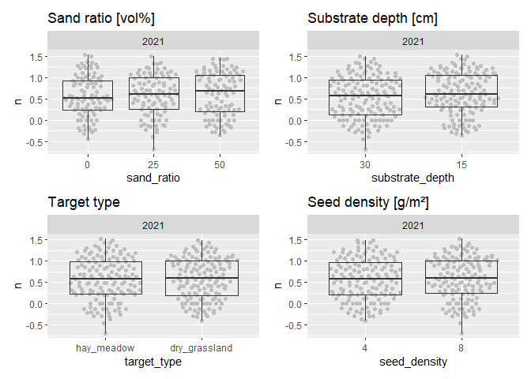<!-- --><!-- -->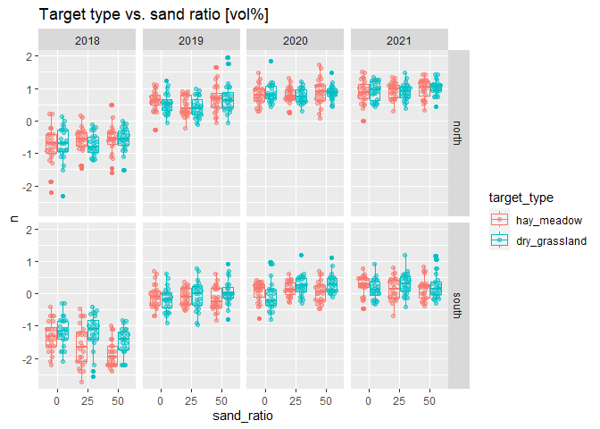<!-- --><!-- --><!-- -->

### Outliers, zero-inflation, transformations?

    ## # A tibble: 12 × 3
    ## # Groups:   exposition [2]
    ##    exposition site      n
    ##    <fct>      <fct> <int>
    ##  1 north      1        96
    ##  2 north      2        96
    ##  3 north      3        96
    ##  4 north      4        96
    ##  5 north      5        96
    ##  6 north      6        96
    ##  7 south      1        96
    ##  8 south      2        96
    ##  9 south      3        96
    ## 10 south      4        96
    ## 11 south      5        96
    ## 12 south      6        96

<!-- --><!-- -->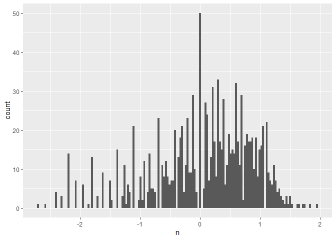<!-- --><!-- -->

## Models

``` r
load(file = here("outputs", "models", "model_fcs_2.Rdata"))
load(file = here("outputs", "models", "model_fcs_full.Rdata"))
m_1 <- m2
m_2 <- m_full
```

``` r
m_1$formula
## n ~ sand_ratio * target_type * exposition * survey_year_fct + substrate_depth + seed_density + substrate_depth:exposition + seed_density:exposition + substrate_depth:survey_year_fct + seed_density:survey_year_fct + botanist_year + (1 | site/plot)
m_2$formula
## n ~ sand_ratio * target_type * exposition * survey_year_fct + substrate_depth * seed_density + substrate_depth:exposition + seed_density:exposition + substrate_depth:survey_year_fct + seed_density:survey_year_fct + substrate_depth:exposition:survey_year_fct + seed_density:exposition:survey_year_fct + botanist_year + (1 | site/plot)
```

``` r
m_1$family
## 
## Family: gaussian 
## Link function: identity
m_2$family
## 
## Family: gaussian 
## Link function: identity
```

### Priors

#### Possible prior distributions

``` r
ggplot(data = data.frame(x = c(-3, 3)), aes(x = x)) +
  stat_function(
    fun = dnorm, n = 101, args = list(mean = 0.1, sd = 1)
    ) +
  expand_limits(y = 0) + ggtitle("Normal distribution")
```

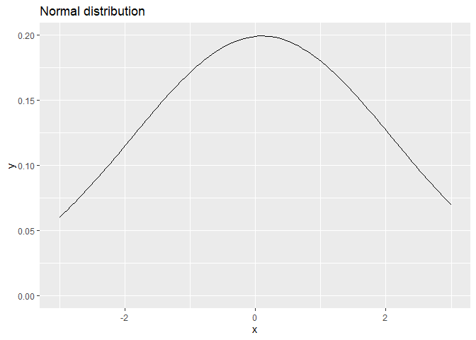<!-- -->

``` r
ggplot(data = data.frame(x = c(-3, 3)), aes(x = x)) +
  stat_function(
    fun = dcauchy, n = 101, args = list(location = 0, scale = 1)
    ) +
  expand_limits(y = 0) + ggtitle("Cauchy distribution")
```

<!-- -->

``` r
ggplot(data.frame(x = c(-3, 3)), aes(x = x)) +
  stat_function(
    fun = dstudent_t, args = list(df = 3, mu = 0, sigma = 2.5)
    ) +
  expand_limits(y = 0) + ggtitle(expression(Student~italic(t)*"-distribution"))
```

<!-- -->

#### Prior summary

``` r
prior_summary(m_1, all = FALSE)
```

    ##                 prior     class                coef group resp dpar nlpar lb ub
    ##          normal(0, 1)         b                                                
    ##        normal(0.1, 1)         b        sand_ratio25                            
    ##        normal(0.2, 1)         b        sand_ratio50                            
    ##        normal(0.1, 1)         b survey_year_fct2019                            
    ##        normal(0.2, 1)         b survey_year_fct2020                            
    ##        normal(0.3, 1)         b survey_year_fct2021                            
    ##          normal(0, 1) Intercept                                                
    ##  student_t(3, 0, 2.5)        sd                                            0   
    ##          cauchy(0, 1)     sigma                                            0   
    ##   source
    ##     user
    ##     user
    ##     user
    ##     user
    ##     user
    ##     user
    ##     user
    ##  default
    ##     user

Conditional <i>R</i>² values

``` r
bayes_R2(m_1, probs = c(0.05, 0.5, 0.95),
         re_formula =  ~ (1 | site/plot) + (1 | botanist_year)) 
##    Estimate   Est.Error        Q5       Q50       Q95
## R2 0.846296 0.005195245 0.8373229 0.8465799 0.8544651
bayes_R2(m_2, probs = c(0.05, 0.5, 0.95),
         re_formula =  ~ (1 | site/plot) + (1 | botanist_year))
##     Estimate   Est.Error        Q5       Q50       Q95
## R2 0.8457806 0.005093254 0.8370864 0.8459597 0.8539238
```

Marginal <i>R</i>² values

``` r
bayes_R2(m_1, probs = c(0.05, 0.5, 0.95),
         re_formula = 1 ~ 1)
##     Estimate   Est.Error       Q5       Q50       Q95
## R2 0.8082861 0.004599353 0.800521 0.8085158 0.8154934
bayes_R2(m_2, probs = c(0.05, 0.5, 0.95),
         re_formula = 1 ~ 1)
##     Estimate   Est.Error        Q5       Q50       Q95
## R2 0.8081253 0.004574755 0.8004376 0.8083452 0.8153329
```

## Model check

### DHARMa

``` r
DHARMa.helpers::dh_check_brms(m_1, integer = TRUE)
```

<!-- -->

``` r
DHARMa.helpers::dh_check_brms(m_2, integer = TRUE)
```

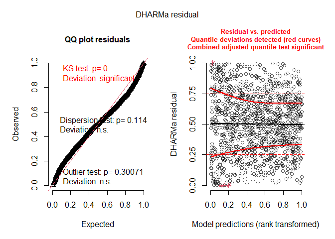<!-- -->

### Preparation

``` r
posterior1 <- m_1 %>%
  posterior::as_draws() %>%
  posterior::subset_draws(
    variable = c(
      "b_sand_ratio25",
      "b_sand_ratio50",
      "b_substrate_depth15",
      "b_target_typedry_grassland",
      "b_seed_density8",
      "b_expositionsouth",
      "b_survey_year_fct2019",
      "b_survey_year_fct2020",
      "b_survey_year_fct2021",
      "sd_site__Intercept",
      "sd_site:plot__Intercept",
      "sigma"
    )
  )
posterior2 <- m_2 %>%
  posterior::as_draws() %>%
  posterior::subset_draws(
    variable = c(
      "b_sand_ratio25",
      "b_sand_ratio50",
      "b_substrate_depth15",
      "b_target_typedry_grassland",
      "b_seed_density8",
      "b_expositionsouth",
      "b_survey_year_fct2019",
      "b_survey_year_fct2020",
      "b_survey_year_fct2021",
      "sd_site__Intercept",
      "sd_site:plot__Intercept",
      "sigma"
    )
  )
hmc_diagnostics1 <- nuts_params(m_1)
hmc_diagnostics2 <- nuts_params(m_2)
y <- sites$n
yrep1 <- posterior_predict(m_1, draws = 500)
yrep2 <- posterior_predict(m_2, draws = 500)
loo1 <- loo(m_1, save_psis = TRUE, moment_match = FALSE)
```

    ## Warning: Found 1 observations with a pareto_k > 0.7 in model 'm_1'. It is
    ## recommended to set 'moment_match = TRUE' in order to perform moment matching for
    ## problematic observations.

``` r
loo2 <- loo(m_2, save_psis = TRUE, moment_match = FALSE)
```

    ## Warning: Found 2 observations with a pareto_k > 0.7 in model 'm_2'. It is
    ## recommended to set 'moment_match = TRUE' in order to perform moment matching for
    ## problematic observations.

``` r
draws1 <- m_1 %>%
  posterior::as_draws() %>%
  posterior::summarize_draws() %>%
  filter(str_starts(variable, "b_"))
draws2 <- m_2 %>%
  posterior::as_draws() %>%
  posterior::summarize_draws() %>%
  filter(str_starts(variable, "b_"))
```

### Sampling efficency and effectiveness

#### Rhat

``` r
mcmc_rhat(draws1$rhat)
```

<!-- -->

``` r
mcmc_rhat(draws2$rhat)
```

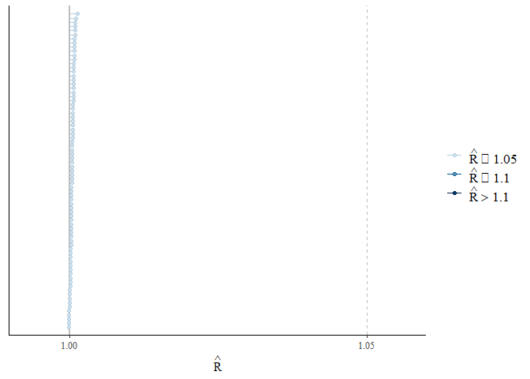<!-- -->

#### Effective sampling size (ESS)

``` r
mcmc_neff(neff_ratio(m_1))
```

<!-- -->

``` r
mcmc_neff(neff_ratio(m_2))
```

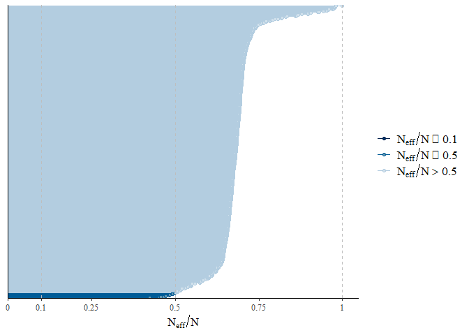<!-- -->

### MCMC diagnostics

``` r
mcmc_trace(posterior1, np = hmc_diagnostics1)
```

    ## No divergences to plot.

<!-- -->

``` r
mcmc_trace(posterior2, np = hmc_diagnostics2)
```

    ## No divergences to plot.

<!-- -->

``` r
mcmc_pairs(m_1, off_diag_args = list(size = 1.2),
           pars = c(
             "b_sand_ratio25", "b_sand_ratio50", "b_substrate_depth15",
             "b_target_typedry_grassland", "b_seed_density8",
             "b_expositionsouth", "sigma"
           ))
```

<!-- -->

``` r
mcmc_pairs(m_2, off_diag_args = list(size = 1.2),
           pars = c(
             "b_sand_ratio25", "b_sand_ratio50", "b_substrate_depth15",
             "b_target_typedry_grassland", "b_seed_density8",
             "b_expositionsouth", "sigma"
           ))
```

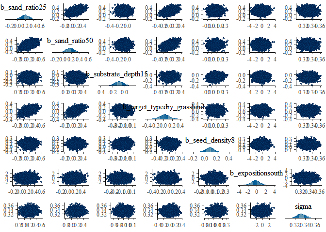<!-- -->

``` r
mcmc_parcoord(posterior1, np = hmc_diagnostics1)
```

<!-- -->

``` r
mcmc_parcoord(posterior2, np = hmc_diagnostics2)
```

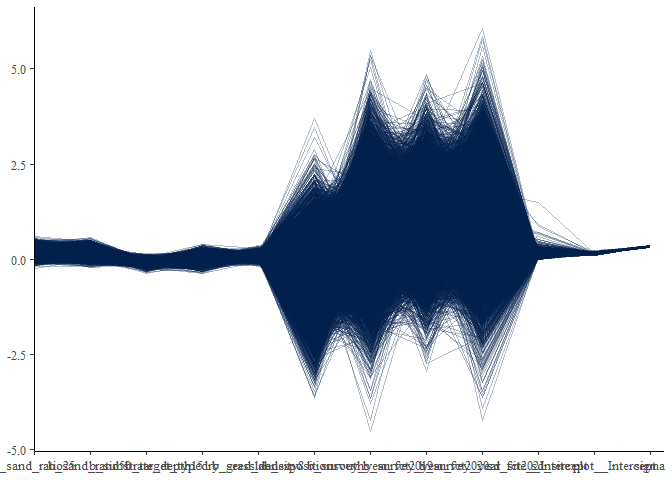<!-- -->

### Posterior predictive check

#### Kernel density

``` r
p1 <- ppc_dens_overlay(y, yrep1[1:50, ])
p2 <- ppc_dens_overlay(y, yrep2[1:50, ])
p1 / p2
```

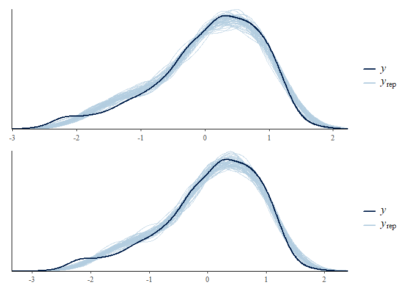<!-- -->

``` r
ppc_dens_overlay_grouped(y, yrep1[1:50, ], group = sites$site)
```

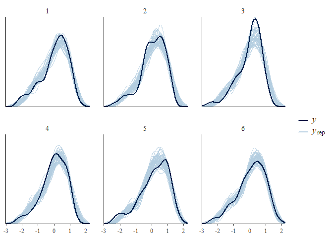<!-- -->

``` r
ppc_dens_overlay_grouped(y, yrep2[1:50, ], group = sites$site)
```

<!-- -->

``` r
p1 <- ppc_dens_overlay_grouped(y, yrep1[1:50, ], group = sites$exposition)
p2 <- ppc_dens_overlay_grouped(y, yrep2[1:50, ], group = sites$exposition)
p1 / p2
```

<!-- -->

``` r
ppc_dens_overlay_grouped(y, yrep1[1:50, ], group = sites$survey_year_fct)
```

<!-- -->

``` r
ppc_dens_overlay_grouped(y, yrep2[1:50, ], group = sites$survey_year_fct)
```

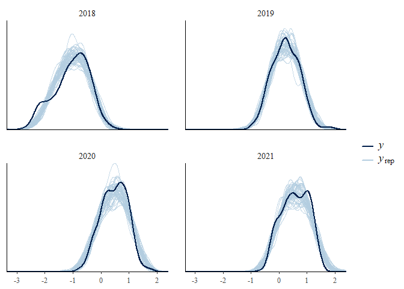<!-- -->

``` r
p1 <- ppc_dens_overlay_grouped(y, yrep1[1:50, ], group = sites$target_type)
p2 <- ppc_dens_overlay_grouped(y, yrep2[1:50, ], group = sites$target_type)
p1 / p2
```

<!-- -->

``` r
p1 <- ppc_dens_overlay_grouped(y, yrep1[1:50, ], group = sites$seed_density)
p2 <- ppc_dens_overlay_grouped(y, yrep2[1:50, ], group = sites$seed_density)
p1 / p2
```

<!-- -->

``` r
p1 <- ppc_dens_overlay_grouped(y, yrep1[1:50, ], group = sites$sand_ratio)
p2 <- ppc_dens_overlay_grouped(y, yrep2[1:50, ], group = sites$sand_ratio)
p1 / p2
```

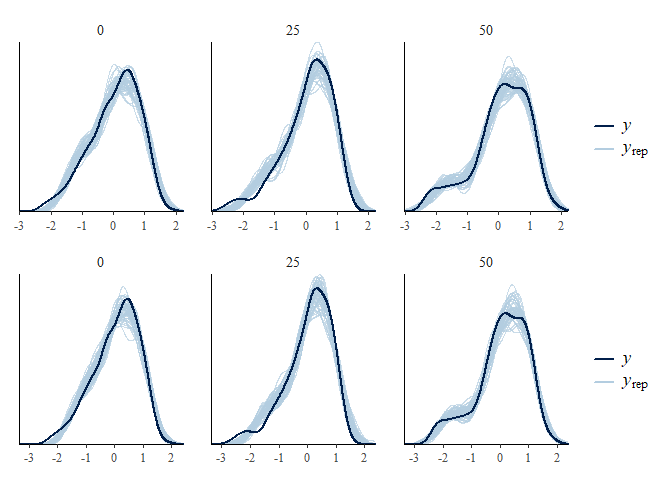<!-- -->

``` r
p1 <- ppc_dens_overlay_grouped(y, yrep1[1:50, ], group = sites$substrate_depth)
p2 <- ppc_dens_overlay_grouped(y, yrep2[1:50, ], group = sites$substrate_depth)
p1 / p2
```

<!-- -->

#### Histograms of statistics skew

``` r
p1 <- ppc_stat(y, yrep1, binwidth = 0.001)
p2 <- ppc_stat(y, yrep2, binwidth = 0.001)
p1 / p2
```

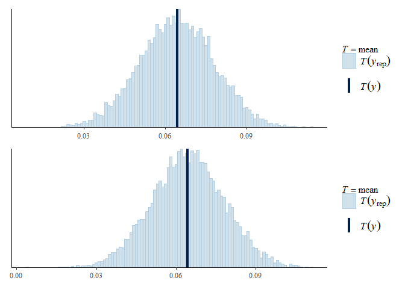<!-- -->

``` r
ppc_stat_grouped(y, yrep1, group = sites$site, binwidth = 0.001)
```

<!-- -->

``` r
ppc_stat_grouped(y, yrep2, group = sites$site, binwidth = 0.001)
```

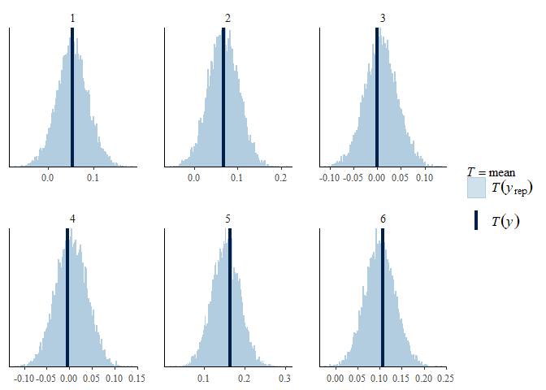<!-- -->

``` r
p1 <- ppc_stat_grouped(y, yrep1, group = sites$exposition, binwidth = 0.001)
p2 <- ppc_stat_grouped(y, yrep2, group = sites$exposition, binwidth = 0.001)
p1 / p2
```

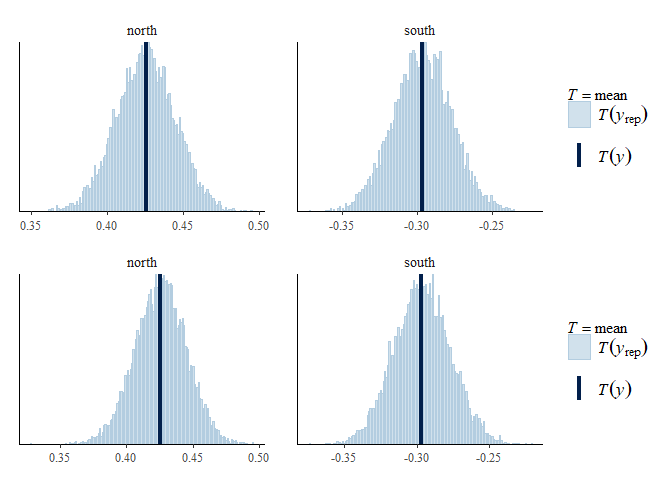<!-- -->

``` r
ppc_stat_grouped(y, yrep1, group = sites$survey_year_fct, binwidth = 0.001)
```

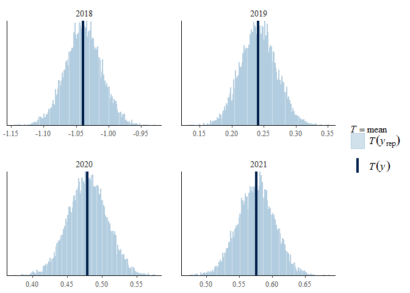<!-- -->

``` r
ppc_stat_grouped(y, yrep2, group = sites$survey_year_fct, binwidth = 0.001)
```

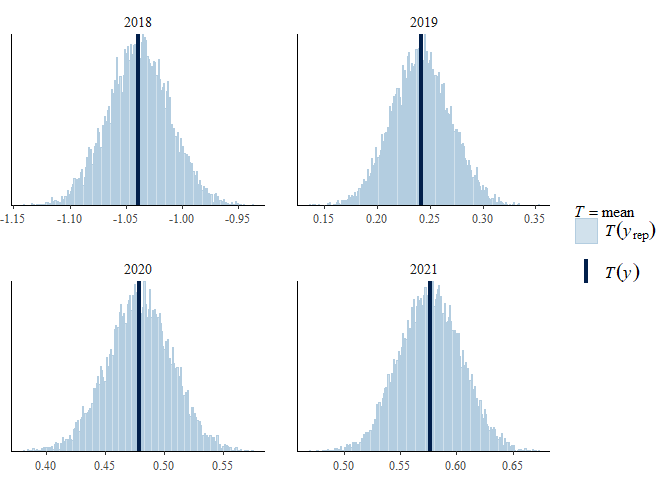<!-- -->

``` r
p1 <- ppc_stat_grouped(y, yrep1, group = sites$target_type, binwidth = 0.001)
p2 <- ppc_stat_grouped(y, yrep2, group = sites$target_type, binwidth = 0.001)
p1 / p2
```

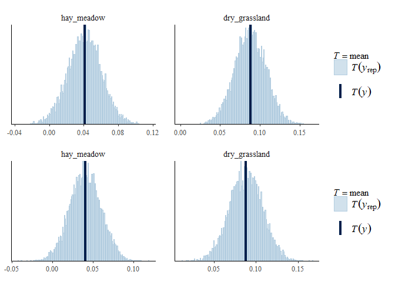<!-- -->

``` r
p1 <- ppc_stat_grouped(y, yrep1, group = sites$seed_density, binwidth = 0.001)
p2 <- ppc_stat_grouped(y, yrep2, group = sites$seed_density, binwidth = 0.001)
p1 / p2
```

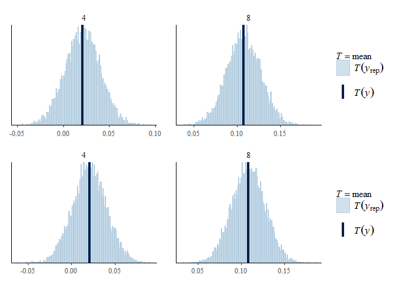<!-- -->

``` r
p1 <- ppc_stat_grouped(y, yrep1, group = sites$sand_ratio, binwidth = 0.001)
p2 <- ppc_stat_grouped(y, yrep2, group = sites$sand_ratio, binwidth = 0.001)
p1 / p2
```

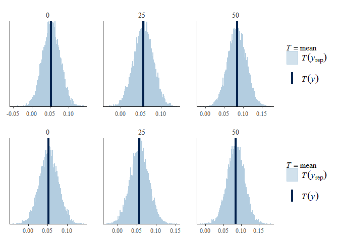<!-- -->

``` r
p1 <- ppc_stat_grouped(y, yrep1, group = sites$substrate_depth, binwidth = 0.001)
p2 <- ppc_stat_grouped(y, yrep2, group = sites$substrate_depth, binwidth = 0.001)
p1 / p2
```

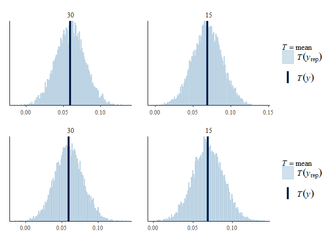<!-- -->

#### LOO (Leave one out)

``` r
loo1
```

    ## 
    ## Computed from 10000 by 1152 log-likelihood matrix
    ## 
    ##          Estimate   SE
    ## elpd_loo   -466.4 30.3
    ## p_loo       184.6  8.9
    ## looic       932.7 60.6
    ## ------
    ## Monte Carlo SE of elpd_loo is NA.
    ## 
    ## Pareto k diagnostic values:
    ##                          Count Pct.    Min. n_eff
    ## (-Inf, 0.5]   (good)     1132  98.3%   789       
    ##  (0.5, 0.7]   (ok)         19   1.6%   204       
    ##    (0.7, 1]   (bad)         1   0.1%   399       
    ##    (1, Inf)   (very bad)    0   0.0%   <NA>      
    ## See help('pareto-k-diagnostic') for details.

``` r
loo2
```

    ## 
    ## Computed from 10000 by 1152 log-likelihood matrix
    ## 
    ##          Estimate   SE
    ## elpd_loo   -472.7 30.4
    ## p_loo       189.6  9.1
    ## looic       945.4 60.8
    ## ------
    ## Monte Carlo SE of elpd_loo is NA.
    ## 
    ## Pareto k diagnostic values:
    ##                          Count Pct.    Min. n_eff
    ## (-Inf, 0.5]   (good)     1137  98.7%   456       
    ##  (0.5, 0.7]   (ok)         13   1.1%   205       
    ##    (0.7, 1]   (bad)         2   0.2%   201       
    ##    (1, Inf)   (very bad)    0   0.0%   <NA>      
    ## See help('pareto-k-diagnostic') for details.

``` r
plot(loo1)
```

<!-- -->

``` r
plot(loo2)
```

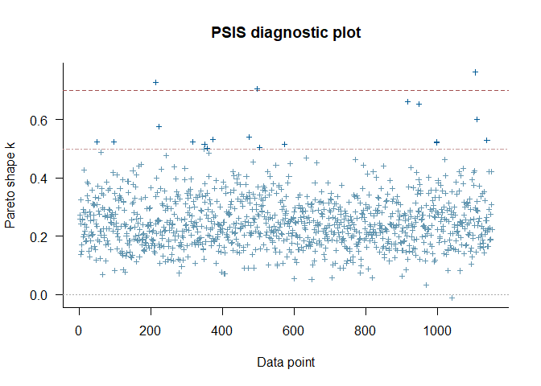<!-- -->

Leave one out probability integral transform

``` r
p1 <- ppc_loo_pit_overlay(y, yrep1, lw = weights(loo1$psis_object))
```

    ## NOTE: The kernel density estimate assumes continuous observations and is not optimal for discrete observations.

``` r
p2 <- ppc_loo_pit_overlay(y, yrep2, lw = weights(loo2$psis_object))
```

    ## NOTE: The kernel density estimate assumes continuous observations and is not optimal for discrete observations.

``` r
p1 / p2
```

<!-- -->

### Autocorrelation check

``` r
mcmc_acf(posterior1, lags = 10)
```

<!-- -->

``` r
mcmc_acf(posterior2, lags = 10)
```

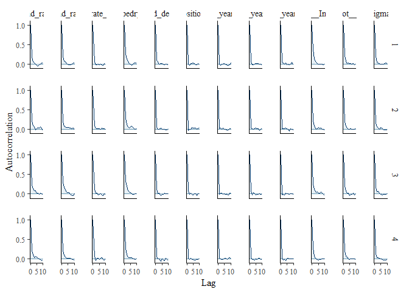<!-- -->

## Output of choosen model

### Model output

Conditional and marignal <i>R</i>²

``` r
bayes_R2(m_1, probs = c(0.05, 0.5, 0.95),
         re_formula =  ~ (1 | site/plot) + (1 | botanist_year)) 
##    Estimate   Est.Error        Q5       Q50       Q95
## R2 0.846296 0.005195245 0.8373229 0.8465799 0.8544651
bayes_R2(m_1, probs = c(0.05, 0.5, 0.95),
         re_formula = 1 ~ 1)
##     Estimate   Est.Error       Q5       Q50       Q95
## R2 0.8082861 0.004599353 0.800521 0.8085158 0.8154934
```

Posteriors of chosen model

``` r
draws1
```

    ## # A tibble: 70 × 10
    ##    variable           mean   median     sd    mad      q5      q95  rhat ess_b…¹
    ##    <chr>             <dbl>    <dbl>  <dbl>  <dbl>   <dbl>    <dbl> <dbl>   <dbl>
    ##  1 b_Intercept    -0.654   -0.655   0.0927 0.0922 -0.806  -5.04e-1  1.00   6190.
    ##  2 b_sand_ratio25  0.151    0.151   0.0995 0.101  -0.0158  3.14e-1  1.00   4880.
    ##  3 b_sand_ratio50  0.136    0.135   0.0988 0.100  -0.0244  3.00e-1  1.00   5241.
    ##  4 b_target_type…  0.00209  0.00181 0.0967 0.0958 -0.156   1.61e-1  1.00   4701.
    ##  5 b_expositions… -0.396   -0.391   0.480  0.476  -1.19    3.92e-1  1.00   8706.
    ##  6 b_survey_year…  0.750    0.753   0.630  0.629  -0.281   1.78e+0  1.00   9610.
    ##  7 b_survey_year…  1.01     1.00    0.541  0.545   0.139   1.90e+0  1.00   8218.
    ##  8 b_survey_year…  0.978    0.977   0.638  0.642  -0.0662  2.03e+0  1.00   9211.
    ##  9 b_substrate_d… -0.0836  -0.0837  0.0508 0.0496 -0.168   3.94e-4  1.00   9881.
    ## 10 b_seed_densit…  0.108    0.108   0.0510 0.0501  0.0240  1.91e-1  1.00   9762.
    ## # … with 60 more rows, 1 more variable: ess_tail <dbl>, and abbreviated
    ## #   variable name ¹​ess_bulk

``` r
mcmc_intervals(
  posterior1,
  prob = 0.66,
  prob_outer = 0.95,
  point_est = "mean"
  ) +
  theme_classic()
```

<!-- -->

Posteriors of second model:

``` r
mcmc_intervals(
  posterior2,
  prob = 0.66,
  prob_outer = 0.95,
  point_est = "mean"
  ) +
  theme_classic()
```

<!-- -->

### Effect sizes

Just, to get exact values if necessary, which is not possible from the
figure

``` r
(emm <- emmeans(m_1, revpairwise ~ target_type + sand_ratio |
                  exposition | survey_year_fct, type = "response"))
```

    ## NOTE: A nesting structure was detected in the fitted model:
    ##     botanist_year %in% (exposition*survey_year_fct)

    ## $emmeans
    ## exposition = north, survey_year_fct = 2018:
    ##  target_type   sand_ratio  emmean lower.HPD upper.HPD
    ##  hay_meadow    0          -0.7298   -0.8800   -0.5650
    ##  dry_grassland 0          -0.7272   -0.8883   -0.5634
    ##  hay_meadow    25         -0.5787   -0.7406   -0.4152
    ##  dry_grassland 25         -0.7201   -0.8791   -0.5581
    ##  hay_meadow    50         -0.5944   -0.7599   -0.4349
    ##  dry_grassland 50         -0.5498   -0.7078   -0.3843
    ## 
    ## exposition = south, survey_year_fct = 2018:
    ##  target_type   sand_ratio  emmean lower.HPD upper.HPD
    ##  hay_meadow    0          -1.3342   -1.4929   -1.1721
    ##  dry_grassland 0          -1.1663   -1.3290   -0.9998
    ##  hay_meadow    25         -1.5965   -1.7545   -1.4271
    ##  dry_grassland 25         -1.2083   -1.3757   -1.0497
    ##  hay_meadow    50         -1.8448   -2.0099   -1.6816
    ##  dry_grassland 50         -1.4845   -1.6535   -1.3251
    ## 
    ## exposition = north, survey_year_fct = 2019:
    ##  target_type   sand_ratio  emmean lower.HPD upper.HPD
    ##  hay_meadow    0           0.6255    0.4551    0.7796
    ##  dry_grassland 0           0.5401    0.3729    0.7030
    ##  hay_meadow    25          0.4653    0.2989    0.6251
    ##  dry_grassland 25          0.4105    0.2449    0.5747
    ##  hay_meadow    50          0.6833    0.5194    0.8450
    ##  dry_grassland 50          0.7145    0.5475    0.8695
    ## 
    ## exposition = south, survey_year_fct = 2019:
    ##  target_type   sand_ratio  emmean lower.HPD upper.HPD
    ##  hay_meadow    0          -0.0669   -0.2340    0.0985
    ##  dry_grassland 0          -0.1769   -0.3530   -0.0191
    ##  hay_meadow    25         -0.0857   -0.2539    0.0924
    ##  dry_grassland 25         -0.0580   -0.2379    0.1106
    ##  hay_meadow    50         -0.1376   -0.3147    0.0304
    ##  dry_grassland 50          0.0587   -0.1112    0.2375
    ## 
    ## exposition = north, survey_year_fct = 2020:
    ##  target_type   sand_ratio  emmean lower.HPD upper.HPD
    ##  hay_meadow    0           0.7983    0.6284    0.9487
    ##  dry_grassland 0           0.8581    0.6980    1.0203
    ##  hay_meadow    25          0.8022    0.6359    0.9630
    ##  dry_grassland 25          0.7695    0.6058    0.9336
    ##  hay_meadow    50          0.8961    0.7330    1.0610
    ##  dry_grassland 50          0.8658    0.7073    1.0371
    ## 
    ## exposition = south, survey_year_fct = 2020:
    ##  target_type   sand_ratio  emmean lower.HPD upper.HPD
    ##  hay_meadow    0           0.0709   -0.0909    0.2389
    ##  dry_grassland 0          -0.0804   -0.2408    0.0870
    ##  hay_meadow    25          0.1465   -0.0289    0.3091
    ##  dry_grassland 25          0.2567    0.0908    0.4199
    ##  hay_meadow    50          0.0559   -0.1175    0.2134
    ##  dry_grassland 50          0.3007    0.1318    0.4648
    ## 
    ## exposition = north, survey_year_fct = 2021:
    ##  target_type   sand_ratio  emmean lower.HPD upper.HPD
    ##  hay_meadow    0           0.8966    0.7333    1.0576
    ##  dry_grassland 0           0.9198    0.7455    1.0730
    ##  hay_meadow    25          0.9460    0.7849    1.1121
    ##  dry_grassland 25          0.9060    0.7458    1.0720
    ##  hay_meadow    50          0.9923    0.8291    1.1596
    ##  dry_grassland 50          1.0180    0.8576    1.1876
    ## 
    ## exposition = south, survey_year_fct = 2021:
    ##  target_type   sand_ratio  emmean lower.HPD upper.HPD
    ##  hay_meadow    0           0.2711    0.1045    0.4330
    ##  dry_grassland 0           0.1338   -0.0268    0.3033
    ##  hay_meadow    25          0.1496   -0.0177    0.3120
    ##  dry_grassland 25          0.2970    0.1391    0.4664
    ##  hay_meadow    50          0.1478   -0.0147    0.3059
    ##  dry_grassland 50          0.2342    0.0704    0.4020
    ## 
    ## Results are averaged over the levels of: substrate_depth, seed_density, botanist_year 
    ## Point estimate displayed: median 
    ## HPD interval probability: 0.95 
    ## 
    ## $contrasts
    ## exposition = north, survey_year_fct = 2018:
    ##  contrast                                                estimate lower.HPD
    ##  dry_grassland sand_ratio0 - hay_meadow sand_ratio0       0.00181   -0.1843
    ##  hay_meadow sand_ratio25 - hay_meadow sand_ratio0         0.15119   -0.0417
    ##  hay_meadow sand_ratio25 - dry_grassland sand_ratio0      0.14729   -0.0477
    ##  dry_grassland sand_ratio25 - hay_meadow sand_ratio0      0.00995   -0.1904
    ##  dry_grassland sand_ratio25 - dry_grassland sand_ratio0   0.00526   -0.1941
    ##  dry_grassland sand_ratio25 - hay_meadow sand_ratio25    -0.14227   -0.3440
    ##  hay_meadow sand_ratio50 - hay_meadow sand_ratio0         0.13540   -0.0489
    ##  hay_meadow sand_ratio50 - dry_grassland sand_ratio0      0.13395   -0.0647
    ##  hay_meadow sand_ratio50 - hay_meadow sand_ratio25       -0.01573   -0.2178
    ##  hay_meadow sand_ratio50 - dry_grassland sand_ratio25     0.12812   -0.0790
    ##  dry_grassland sand_ratio50 - hay_meadow sand_ratio0      0.17939   -0.0138
    ##  dry_grassland sand_ratio50 - dry_grassland sand_ratio0   0.17841   -0.0243
    ##  dry_grassland sand_ratio50 - hay_meadow sand_ratio25     0.02947   -0.1718
    ##  dry_grassland sand_ratio50 - dry_grassland sand_ratio25  0.17151   -0.0304
    ##  dry_grassland sand_ratio50 - hay_meadow sand_ratio50     0.04412   -0.1557
    ##  upper.HPD
    ##    0.19489
    ##    0.34527
    ##    0.36111
    ##    0.20756
    ##    0.20087
    ##    0.05652
    ##    0.33385
    ##    0.33866
    ##    0.18327
    ##    0.32915
    ##    0.38684
    ##    0.37428
    ##    0.23440
    ##    0.37413
    ##    0.24630
    ## 
    ## exposition = south, survey_year_fct = 2018:
    ##  contrast                                                estimate lower.HPD
    ##  dry_grassland sand_ratio0 - hay_meadow sand_ratio0       0.16580   -0.0238
    ##  hay_meadow sand_ratio25 - hay_meadow sand_ratio0        -0.26309   -0.4657
    ##  hay_meadow sand_ratio25 - dry_grassland sand_ratio0     -0.43174   -0.6288
    ##  dry_grassland sand_ratio25 - hay_meadow sand_ratio0      0.12302   -0.0782
    ##  dry_grassland sand_ratio25 - dry_grassland sand_ratio0  -0.04250   -0.2518
    ##  dry_grassland sand_ratio25 - hay_meadow sand_ratio25     0.38660    0.1888
    ##  hay_meadow sand_ratio50 - hay_meadow sand_ratio0        -0.51254   -0.7121
    ##  hay_meadow sand_ratio50 - dry_grassland sand_ratio0     -0.67870   -0.8830
    ##  hay_meadow sand_ratio50 - hay_meadow sand_ratio25       -0.24826   -0.4540
    ##  hay_meadow sand_ratio50 - dry_grassland sand_ratio25    -0.63553   -0.8488
    ##  dry_grassland sand_ratio50 - hay_meadow sand_ratio0     -0.15377   -0.3593
    ##  dry_grassland sand_ratio50 - dry_grassland sand_ratio0  -0.31887   -0.5223
    ##  dry_grassland sand_ratio50 - hay_meadow sand_ratio25     0.11067   -0.1014
    ##  dry_grassland sand_ratio50 - dry_grassland sand_ratio25 -0.27605   -0.4787
    ##  dry_grassland sand_ratio50 - hay_meadow sand_ratio50     0.35807    0.1555
    ##  upper.HPD
    ##    0.37287
    ##   -0.06490
    ##   -0.21152
    ##    0.32231
    ##    0.14769
    ##    0.59010
    ##   -0.31022
    ##   -0.46928
    ##   -0.04515
    ##   -0.44090
    ##    0.04618
    ##   -0.11869
    ##    0.31040
    ##   -0.07271
    ##    0.56671
    ## 
    ## exposition = north, survey_year_fct = 2019:
    ##  contrast                                                estimate lower.HPD
    ##  dry_grassland sand_ratio0 - hay_meadow sand_ratio0      -0.08664   -0.2843
    ##  hay_meadow sand_ratio25 - hay_meadow sand_ratio0        -0.15860   -0.3514
    ##  hay_meadow sand_ratio25 - dry_grassland sand_ratio0     -0.07277   -0.2802
    ##  dry_grassland sand_ratio25 - hay_meadow sand_ratio0     -0.21363   -0.4309
    ##  dry_grassland sand_ratio25 - dry_grassland sand_ratio0  -0.12779   -0.3274
    ##  dry_grassland sand_ratio25 - hay_meadow sand_ratio25    -0.05465   -0.2605
    ##  hay_meadow sand_ratio50 - hay_meadow sand_ratio0         0.05870   -0.1479
    ##  hay_meadow sand_ratio50 - dry_grassland sand_ratio0      0.14560   -0.0609
    ##  hay_meadow sand_ratio50 - hay_meadow sand_ratio25        0.21858    0.0209
    ##  hay_meadow sand_ratio50 - dry_grassland sand_ratio25     0.27380    0.0583
    ##  dry_grassland sand_ratio50 - hay_meadow sand_ratio0      0.08969   -0.1181
    ##  dry_grassland sand_ratio50 - dry_grassland sand_ratio0   0.17523   -0.0238
    ##  dry_grassland sand_ratio50 - hay_meadow sand_ratio25     0.24802    0.0372
    ##  dry_grassland sand_ratio50 - dry_grassland sand_ratio25  0.30294    0.0956
    ##  dry_grassland sand_ratio50 - hay_meadow sand_ratio50     0.03053   -0.1641
    ##  upper.HPD
    ##    0.11344
    ##    0.04810
    ##    0.13266
    ##   -0.01672
    ##    0.08240
    ##    0.14729
    ##    0.25739
    ##    0.34904
    ##    0.43172
    ##    0.47391
    ##    0.29267
    ##    0.38017
    ##    0.44794
    ##    0.50573
    ##    0.23673
    ## 
    ## exposition = south, survey_year_fct = 2019:
    ##  contrast                                                estimate lower.HPD
    ##  dry_grassland sand_ratio0 - hay_meadow sand_ratio0      -0.11051   -0.3219
    ##  hay_meadow sand_ratio25 - hay_meadow sand_ratio0        -0.01787   -0.2263
    ##  hay_meadow sand_ratio25 - dry_grassland sand_ratio0      0.09110   -0.1201
    ##  dry_grassland sand_ratio25 - hay_meadow sand_ratio0      0.00782   -0.1983
    ##  dry_grassland sand_ratio25 - dry_grassland sand_ratio0   0.11947   -0.0919
    ##  dry_grassland sand_ratio25 - hay_meadow sand_ratio25     0.02598   -0.1804
    ##  hay_meadow sand_ratio50 - hay_meadow sand_ratio0        -0.07230   -0.2778
    ##  hay_meadow sand_ratio50 - dry_grassland sand_ratio0      0.03851   -0.1649
    ##  hay_meadow sand_ratio50 - hay_meadow sand_ratio25       -0.05379   -0.2648
    ##  hay_meadow sand_ratio50 - dry_grassland sand_ratio25    -0.08094   -0.2866
    ##  dry_grassland sand_ratio50 - hay_meadow sand_ratio0      0.12587   -0.0765
    ##  dry_grassland sand_ratio50 - dry_grassland sand_ratio0   0.23494    0.0227
    ##  dry_grassland sand_ratio50 - hay_meadow sand_ratio25     0.14474   -0.0735
    ##  dry_grassland sand_ratio50 - dry_grassland sand_ratio25  0.11852   -0.1010
    ##  dry_grassland sand_ratio50 - hay_meadow sand_ratio50     0.19660   -0.0149
    ##  upper.HPD
    ##    0.08478
    ##    0.18966
    ##    0.30150
    ##    0.21705
    ##    0.31954
    ##    0.23339
    ##    0.13175
    ##    0.25168
    ##    0.15342
    ##    0.12921
    ##    0.33596
    ##    0.43495
    ##    0.34792
    ##    0.32172
    ##    0.40509
    ## 
    ## exposition = north, survey_year_fct = 2020:
    ##  contrast                                                estimate lower.HPD
    ##  dry_grassland sand_ratio0 - hay_meadow sand_ratio0       0.05899   -0.1387
    ##  hay_meadow sand_ratio25 - hay_meadow sand_ratio0         0.00548   -0.1931
    ##  hay_meadow sand_ratio25 - dry_grassland sand_ratio0     -0.05387   -0.2530
    ##  dry_grassland sand_ratio25 - hay_meadow sand_ratio0     -0.02685   -0.2322
    ##  dry_grassland sand_ratio25 - dry_grassland sand_ratio0  -0.08667   -0.2907
    ##  dry_grassland sand_ratio25 - hay_meadow sand_ratio25    -0.03014   -0.2426
    ##  hay_meadow sand_ratio50 - hay_meadow sand_ratio0         0.09907   -0.1043
    ##  hay_meadow sand_ratio50 - dry_grassland sand_ratio0      0.03833   -0.1791
    ##  hay_meadow sand_ratio50 - hay_meadow sand_ratio25        0.09287   -0.1151
    ##  hay_meadow sand_ratio50 - dry_grassland sand_ratio25     0.12545   -0.0866
    ##  dry_grassland sand_ratio50 - hay_meadow sand_ratio0      0.06806   -0.1275
    ##  dry_grassland sand_ratio50 - dry_grassland sand_ratio0   0.00804   -0.2011
    ##  dry_grassland sand_ratio50 - hay_meadow sand_ratio25     0.06274   -0.1496
    ##  dry_grassland sand_ratio50 - dry_grassland sand_ratio25  0.09563   -0.1095
    ##  dry_grassland sand_ratio50 - hay_meadow sand_ratio50    -0.03065   -0.2284
    ##  upper.HPD
    ##    0.26356
    ##    0.20971
    ##    0.14963
    ##    0.18315
    ##    0.12065
    ##    0.16927
    ##    0.29245
    ##    0.23138
    ##    0.28927
    ##    0.32495
    ##    0.28162
    ##    0.21323
    ##    0.26568
    ##    0.31016
    ##    0.17936
    ## 
    ## exposition = south, survey_year_fct = 2020:
    ##  contrast                                                estimate lower.HPD
    ##  dry_grassland sand_ratio0 - hay_meadow sand_ratio0      -0.15038   -0.3622
    ##  hay_meadow sand_ratio25 - hay_meadow sand_ratio0         0.07699   -0.1313
    ##  hay_meadow sand_ratio25 - dry_grassland sand_ratio0      0.22896    0.0271
    ##  dry_grassland sand_ratio25 - hay_meadow sand_ratio0      0.18545   -0.0131
    ##  dry_grassland sand_ratio25 - dry_grassland sand_ratio0   0.33725    0.1326
    ##  dry_grassland sand_ratio25 - hay_meadow sand_ratio25     0.10760   -0.0995
    ##  hay_meadow sand_ratio50 - hay_meadow sand_ratio0        -0.01502   -0.2188
    ##  hay_meadow sand_ratio50 - dry_grassland sand_ratio0      0.13391   -0.0751
    ##  hay_meadow sand_ratio50 - hay_meadow sand_ratio25       -0.09214   -0.2966
    ##  hay_meadow sand_ratio50 - dry_grassland sand_ratio25    -0.20063   -0.4078
    ##  dry_grassland sand_ratio50 - hay_meadow sand_ratio0      0.22952    0.0174
    ##  dry_grassland sand_ratio50 - dry_grassland sand_ratio0   0.38057    0.1695
    ##  dry_grassland sand_ratio50 - hay_meadow sand_ratio25     0.15220   -0.0491
    ##  dry_grassland sand_ratio50 - dry_grassland sand_ratio25  0.04328   -0.1526
    ##  dry_grassland sand_ratio50 - hay_meadow sand_ratio50     0.24536    0.0443
    ##  upper.HPD
    ##    0.04721
    ##    0.29005
    ##    0.44731
    ##    0.40341
    ##    0.54446
    ##    0.31440
    ##    0.19817
    ##    0.34614
    ##    0.11700
    ##    0.00399
    ##    0.42950
    ##    0.58707
    ##    0.36513
    ##    0.25355
    ##    0.45921
    ## 
    ## exposition = north, survey_year_fct = 2021:
    ##  contrast                                                estimate lower.HPD
    ##  dry_grassland sand_ratio0 - hay_meadow sand_ratio0       0.02248   -0.1836
    ##  hay_meadow sand_ratio25 - hay_meadow sand_ratio0         0.04695   -0.1586
    ##  hay_meadow sand_ratio25 - dry_grassland sand_ratio0      0.02656   -0.1770
    ##  dry_grassland sand_ratio25 - hay_meadow sand_ratio0      0.00823   -0.1964
    ##  dry_grassland sand_ratio25 - dry_grassland sand_ratio0  -0.01451   -0.2118
    ##  dry_grassland sand_ratio25 - hay_meadow sand_ratio25    -0.03983   -0.2526
    ##  hay_meadow sand_ratio50 - hay_meadow sand_ratio0         0.09518   -0.1005
    ##  hay_meadow sand_ratio50 - dry_grassland sand_ratio0      0.07278   -0.1291
    ##  hay_meadow sand_ratio50 - hay_meadow sand_ratio25        0.04685   -0.1532
    ##  hay_meadow sand_ratio50 - dry_grassland sand_ratio25     0.08675   -0.1315
    ##  dry_grassland sand_ratio50 - hay_meadow sand_ratio0      0.11801   -0.0791
    ##  dry_grassland sand_ratio50 - dry_grassland sand_ratio0   0.09640   -0.1053
    ##  dry_grassland sand_ratio50 - hay_meadow sand_ratio25     0.07240   -0.1452
    ##  dry_grassland sand_ratio50 - dry_grassland sand_ratio25  0.11028   -0.0998
    ##  dry_grassland sand_ratio50 - hay_meadow sand_ratio50     0.02485   -0.1788
    ##  upper.HPD
    ##    0.22126
    ##    0.25398
    ##    0.22934
    ##    0.21244
    ##    0.20019
    ##    0.16151
    ##    0.30351
    ##    0.28012
    ##    0.25690
    ##    0.28159
    ##    0.32952
    ##    0.30018
    ##    0.26684
    ##    0.31743
    ##    0.23103
    ## 
    ## exposition = south, survey_year_fct = 2021:
    ##  contrast                                                estimate lower.HPD
    ##  dry_grassland sand_ratio0 - hay_meadow sand_ratio0      -0.13784   -0.3443
    ##  hay_meadow sand_ratio25 - hay_meadow sand_ratio0        -0.12189   -0.3294
    ##  hay_meadow sand_ratio25 - dry_grassland sand_ratio0      0.01614   -0.2022
    ##  dry_grassland sand_ratio25 - hay_meadow sand_ratio0      0.02564   -0.1815
    ##  dry_grassland sand_ratio25 - dry_grassland sand_ratio0   0.16232   -0.0380
    ##  dry_grassland sand_ratio25 - hay_meadow sand_ratio25     0.14831   -0.0557
    ##  hay_meadow sand_ratio50 - hay_meadow sand_ratio0        -0.12369   -0.3164
    ##  hay_meadow sand_ratio50 - dry_grassland sand_ratio0      0.01240   -0.1902
    ##  hay_meadow sand_ratio50 - hay_meadow sand_ratio25       -0.00141   -0.2082
    ##  hay_meadow sand_ratio50 - dry_grassland sand_ratio25    -0.14896   -0.3648
    ##  dry_grassland sand_ratio50 - hay_meadow sand_ratio0     -0.03812   -0.2472
    ##  dry_grassland sand_ratio50 - dry_grassland sand_ratio0   0.10030   -0.1014
    ##  dry_grassland sand_ratio50 - hay_meadow sand_ratio25     0.08290   -0.1206
    ##  dry_grassland sand_ratio50 - dry_grassland sand_ratio25 -0.06312   -0.2649
    ##  dry_grassland sand_ratio50 - hay_meadow sand_ratio50     0.08416   -0.1203
    ##  upper.HPD
    ##    0.06495
    ##    0.08107
    ##    0.21366
    ##    0.22149
    ##    0.37464
    ##    0.35892
    ##    0.08578
    ##    0.21888
    ##    0.20143
    ##    0.04843
    ##    0.16397
    ##    0.31494
    ##    0.29680
    ##    0.14782
    ##    0.29081
    ## 
    ## Results are averaged over the levels of: substrate_depth, seed_density, botanist_year 
    ## Point estimate displayed: median 
    ## HPD interval probability: 0.95

# Session info

    ## R version 4.2.2 (2022-10-31 ucrt)
    ## Platform: x86_64-w64-mingw32/x64 (64-bit)
    ## Running under: Windows 10 x64 (build 22621)
    ## 
    ## Matrix products: default
    ## 
    ## locale:
    ## [1] LC_COLLATE=German_Germany.utf8  LC_CTYPE=German_Germany.utf8   
    ## [3] LC_MONETARY=German_Germany.utf8 LC_NUMERIC=C                   
    ## [5] LC_TIME=German_Germany.utf8    
    ## 
    ## attached base packages:
    ## [1] stats     graphics  grDevices utils     datasets  methods   base     
    ## 
    ## other attached packages:
    ##  [1] emmeans_1.8.2             tidybayes_3.0.2          
    ##  [3] loo_2.5.1                 bayesplot_1.10.0         
    ##  [5] DHARMa.helpers_0.0.0.9000 DHARMa_0.4.6             
    ##  [7] brms_2.18.0               Rcpp_1.0.9               
    ##  [9] patchwork_1.1.2           ggbeeswarm_0.6.0         
    ## [11] forcats_0.5.2             stringr_1.4.1            
    ## [13] dplyr_1.0.10              purrr_0.3.5              
    ## [15] readr_2.1.3               tidyr_1.2.1              
    ## [17] tibble_3.1.8              ggplot2_3.4.0            
    ## [19] tidyverse_1.3.2           here_1.0.1               
    ## 
    ## loaded via a namespace (and not attached):
    ##   [1] utf8_1.2.2           tidyselect_1.2.0     lme4_1.1-31         
    ##   [4] htmlwidgets_1.5.4    grid_4.2.2           RNeXML_2.4.8        
    ##   [7] munsell_0.5.0        codetools_0.2-18     interp_1.1-3        
    ##  [10] DT_0.26              miniUI_0.1.1.1       withr_2.5.0         
    ##  [13] Brobdingnag_1.2-9    colorspace_2.0-3     qgam_1.3.4          
    ##  [16] uuid_1.1-0           highr_0.9            knitr_1.41          
    ##  [19] rstudioapi_0.14      stats4_4.2.2         labeling_0.4.2      
    ##  [22] rstan_2.26.13        bit64_4.0.5          farver_2.1.1        
    ##  [25] gap.datasets_0.0.5   bridgesampling_1.1-2 rprojroot_2.0.3     
    ##  [28] coda_0.19-4          vctrs_0.5.1          generics_0.1.3      
    ##  [31] xfun_0.35            timechange_0.1.1     adegenet_2.1.8      
    ##  [34] doParallel_1.0.17    R6_2.5.1             markdown_1.4        
    ##  [37] assertthat_0.2.1     promises_1.2.0.1     scales_1.2.1        
    ##  [40] vroom_1.6.0          googlesheets4_1.0.1  phylobase_0.8.10    
    ##  [43] beeswarm_0.4.0       gtable_0.3.1         processx_3.8.0      
    ##  [46] rlang_1.0.6          splines_4.2.2        gargle_1.2.1        
    ##  [49] broom_1.0.1          checkmate_2.1.0      inline_0.3.19       
    ##  [52] yaml_2.3.6           reshape2_1.4.4       abind_1.4-5         
    ##  [55] modelr_0.1.10        threejs_0.3.3        crosstalk_1.2.0     
    ##  [58] backports_1.4.1      httpuv_1.6.6         tensorA_0.36.2      
    ##  [61] tools_4.2.2          ellipsis_0.3.2       posterior_1.3.1     
    ##  [64] RColorBrewer_1.1-3   plyr_1.8.8           progress_1.2.2      
    ##  [67] base64enc_0.1-3      ps_1.7.2             prettyunits_1.1.1   
    ##  [70] deldir_1.0-6         zoo_1.8-11           haven_2.5.1         
    ##  [73] cluster_2.1.4        fs_1.5.2             magrittr_2.0.3      
    ##  [76] ggdist_3.2.0         colourpicker_1.2.0   reprex_2.0.2        
    ##  [79] googledrive_2.0.0    mvtnorm_1.1-3        matrixStats_0.63.0  
    ##  [82] hms_1.1.2            shinyjs_2.1.0        mime_0.12           
    ##  [85] evaluate_0.18        arrayhelpers_1.1-0   xtable_1.8-4        
    ##  [88] XML_3.99-0.12        shinystan_2.6.0      jpeg_0.1-10         
    ##  [91] readxl_1.4.1         gridExtra_2.3        rstantools_2.2.0    
    ##  [94] compiler_4.2.2       KernSmooth_2.23-20   V8_4.2.2            
    ##  [97] crayon_1.5.2         minqa_1.2.5          StanHeaders_2.26.13 
    ## [100] htmltools_0.5.3      mgcv_1.8-41          later_1.3.0         
    ## [103] tzdb_0.3.0           RcppParallel_5.1.5   lubridate_1.9.0     
    ## [106] DBI_1.1.3            dbplyr_2.2.1         MASS_7.3-58.1       
    ## [109] boot_1.3-28          Matrix_1.5-3         ade4_1.7-20         
    ## [112] permute_0.9-7        cli_3.4.1            adegraphics_1.0-16  
    ## [115] parallel_4.2.2       igraph_1.3.5         pkgconfig_2.0.3     
    ## [118] rncl_0.8.6           sp_1.5-1             foreach_1.5.2       
    ## [121] xml2_1.3.3           svUnit_1.0.6         dygraphs_1.1.1.6    
    ## [124] vipor_0.4.5          estimability_1.4.1   rvest_1.0.3         
    ## [127] distributional_0.3.1 callr_3.7.3          digest_0.6.30       
    ## [130] vegan_2.6-4          rmarkdown_2.18       cellranger_1.1.0    
    ## [133] gap_1.3-1            curl_4.3.3           shiny_1.7.3         
    ## [136] gtools_3.9.4         nloptr_2.0.3         lifecycle_1.0.3     
    ## [139] nlme_3.1-160         jsonlite_1.8.3       seqinr_4.2-23       
    ## [142] fansi_1.0.3          pillar_1.8.1         lattice_0.20-45     
    ## [145] fastmap_1.1.0        httr_1.4.4           pkgbuild_1.4.0      
    ## [148] glue_1.6.2           xts_0.12.2           iterators_1.0.14    
    ## [151] png_0.1-8            shinythemes_1.2.0    bit_4.0.5           
    ## [154] stringi_1.7.8        latticeExtra_0.6-30  ape_5.6-2
