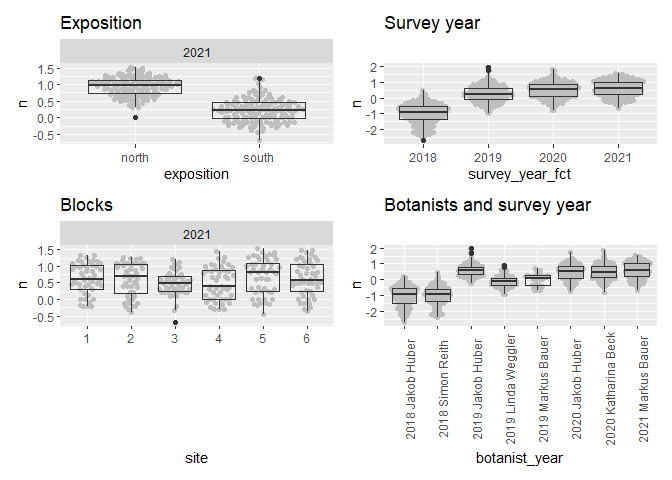
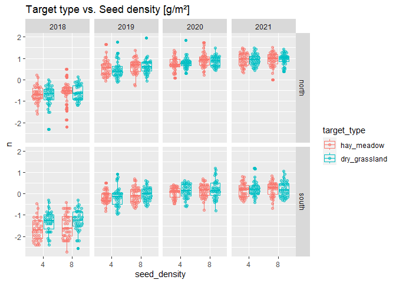
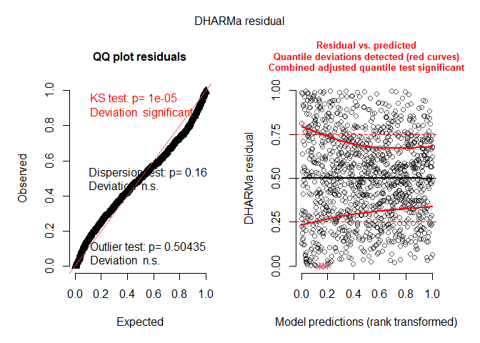

Favourable Conservation Status (FCS): <br> Analysis of Bauer et
al. (unpublished) Field experiment
================
Markus Bauer <br>
2022-11-17

# Preparation

#### Packages

``` r
library(here)
library(tidyverse)
library(ggbeeswarm)
library(patchwork)
library(brms)
library(DHARMa)
library(DHARMa.helpers)
library(bayesplot)
library(loo)
library(tidybayes)
library(emmeans)
```

#### Load data

``` r
sites <- read_csv(here("data", "processed", "data_processed_sites.csv"),
                  col_names = TRUE, na = c("na", "NA", ""), col_types =
                    cols(
                      .default = "?",
                      plot = "f",
                      site = "f",
                      sand_ratio = "f",
                      substrate_depth = col_factor(levels = c("30", "15")),
                      target_type = col_factor(levels = c(
                        "hay_meadow", "dry_grassland"
                      )),
                      seed_density = "f",
                      exposition = col_factor(levels = c(
                        "north", "south"
                      )),
                      survey_year = "c"
                    )) %>%
  ### Exclude data of seed mixtures
  filter(survey_year != "seeded") %>%
  mutate(
    survey_year_fct = factor(survey_year),
    botanist_year = str_c(survey_year, botanist, sep = " "),
    botanist_year = factor(botanist_year),
    n = fcs_target,
    id = factor(id)
    ) %>%
  select(
    id, plot, site, exposition, sand_ratio, substrate_depth, target_type,
    seed_density, survey_year_fct, survey_year, botanist_year, n
    )
```

# Statistics

## Data exploration

### Graphs of raw data

<!-- --><!-- --><!-- --><!-- --><!-- -->

### Outliers, zero-inflation, transformations?

``` r
sites %>% group_by(exposition) %>% count(site)
```

    ## # A tibble: 12 × 3
    ## # Groups:   exposition [2]
    ##    exposition site      n
    ##    <fct>      <fct> <int>
    ##  1 north      1        96
    ##  2 north      2        96
    ##  3 north      3        96
    ##  4 north      4        96
    ##  5 north      5        96
    ##  6 north      6        96
    ##  7 south      1        96
    ##  8 south      2        96
    ##  9 south      3        96
    ## 10 south      4        96
    ## 11 south      5        96
    ## 12 south      6        96

``` r
boxplot(sites$n)
```

<!-- -->

``` r
ggplot(sites, aes(x = exposition, y = n)) + geom_quasirandom()
```

<!-- -->

``` r
ggplot(sites, aes(x = n)) + geom_histogram(binwidth = 0.03)
```

<!-- -->

``` r
ggplot(sites, aes(x = n)) + geom_density()
```

<!-- -->

## Model building

### Models

Specifications for the models

``` r
iter = 10000
chains = 4
thin = 2
priors <- c(
  set_prior("normal(0, 1)", class = "b"),
  set_prior("normal(0.1, 1)", class = "b", coef = "sand_ratio25"),
  set_prior("normal(0.2, 1)", class = "b", coef = "sand_ratio50"),
  set_prior("normal(0.1, 1)", class = "b", coef = "expositionsouth"),
  set_prior("normal(0.1, 1)", class = "b", coef = "survey_year_fct2019"),
  set_prior("normal(0.2, 1)", class = "b", coef = "survey_year_fct2020"),
  set_prior("normal(0.3, 1)", class = "b",coef = "survey_year_fct2021"),
  set_prior("cauchy(0, 1)", class = "sigma")
)
```

Model caluclations

``` r
load(file = here("outputs", "models", "model_fcs_2.Rdata"))
load(file = here("outputs", "models", "model_fcs_full.Rdata"))
```

### Model comparison

``` r
m_1 <- m2
m_2 <- m_full
m_1$formula
```

    ## n ~ sand_ratio * target_type * exposition * survey_year_fct + substrate_depth + seed_density + substrate_depth:exposition + seed_density:exposition + substrate_depth:survey_year_fct + seed_density:survey_year_fct + botanist_year + (1 | site/plot)

``` r
m_2$formula
```

    ## n ~ sand_ratio * target_type * exposition * survey_year_fct + substrate_depth * seed_density + substrate_depth:exposition + seed_density:exposition + substrate_depth:survey_year_fct + seed_density:survey_year_fct + substrate_depth:exposition:survey_year_fct + seed_density:exposition:survey_year_fct + botanist_year + (1 | site/plot)

Conditional italic(R)² values

``` r
bayes_R2(m_1, probs = c(0.05, 0.5, 0.95),
         re_formula =  ~ (1 | site/plot) + (1 | botanist_year)) 
```

    ##     Estimate   Est.Error        Q5       Q50       Q95
    ## R2 0.8462696 0.005180763 0.8374346 0.8464422 0.8545334

``` r
bayes_R2(m_2, probs = c(0.05, 0.5, 0.95),
         re_formula =  ~ (1 | site/plot) + (1 | botanist_year))
```

    ##     Estimate   Est.Error        Q5       Q50       Q95
    ## R2 0.8455807 0.005138392 0.8367879 0.8457527 0.8536987

Marginal italic(R)² values

``` r
bayes_R2(m_1, probs = c(0.05, 0.5, 0.95),
         re_formula = 1 ~ 1)
```

    ##     Estimate   Est.Error        Q5       Q50       Q95
    ## R2 0.8080089 0.004623596 0.8000911 0.8082291 0.8151562

``` r
bayes_R2(m_2, probs = c(0.05, 0.5, 0.95),
         re_formula = 1 ~ 1)
```

    ##     Estimate   Est.Error        Q5       Q50       Q95
    ## R2 0.8077646 0.004572131 0.8000053 0.8079031 0.8148681

### Model check

#### DHARMa

``` r
DHARMa.helpers::dh_check_brms(m_1, integer = TRUE)
```

<!-- -->

``` r
DHARMa.helpers::dh_check_brms(m_2, integer = TRUE)
```

<!-- -->

#### Preparation

``` r
posterior1 <- m_1 %>%
  posterior::as_draws() %>%
  posterior::subset_draws(
    variable = c(
      "b_sand_ratio25",
      "b_sand_ratio50",
      "b_substrate_depth15",
      "b_target_typedry_grassland",
      "b_seed_density8",
      "b_expositionsouth",
      "b_survey_year_fct2019",
      "b_survey_year_fct2020",
      "b_survey_year_fct2021",
      "sd_site__Intercept",
      "sd_site:plot__Intercept",
      "sigma"
    )
  )
posterior2 <- m_2 %>%
  posterior::as_draws() %>%
  posterior::subset_draws(
    variable = c(
      "b_sand_ratio25",
      "b_sand_ratio50",
      "b_substrate_depth15",
      "b_target_typedry_grassland",
      "b_seed_density8",
      "b_expositionsouth",
      "b_survey_year_fct2019",
      "b_survey_year_fct2020",
      "b_survey_year_fct2021",
      "sd_site__Intercept",
      "sd_site:plot__Intercept",
      "sigma"
    )
  )
hmc_diagnostics1 <- nuts_params(m_1)
hmc_diagnostics2 <- nuts_params(m_2)
y <- sites$n
yrep1 <- posterior_predict(m_1, draws = 500)
yrep2 <- posterior_predict(m_2, draws = 500)
loo1 <- loo(m_1, save_psis = TRUE, moment_match = FALSE)
loo2 <- loo(m_2, save_psis = TRUE, moment_match = FALSE)
draws1 <- m_1 %>%
  posterior::as_draws() %>%
  posterior::summarize_draws() %>%
  filter(str_starts(variable, "b_"))
draws2 <- m_2 %>%
  posterior::as_draws() %>%
  posterior::summarize_draws() %>%
  filter(str_starts(variable, "b_"))
```

#### Samling efficency/effectiveness (Rhat and EFF)

``` r
range(draws1$rhat)
```

    ## [1] 0.9999311 1.0022577

``` r
range(draws2$rhat)
```

    ## [1] 0.9997943 1.0009477

``` r
range(draws1$ess_bulk)
```

    ## [1]  5012.424 10052.536

``` r
range(draws2$ess_bulk)
```

    ## [1] 4342.509 9829.689

``` r
range(draws1$ess_tail)
```

    ## [1] 7142.606 9570.239

``` r
range(draws2$ess_tail)
```

    ## [1] 6940.507 9577.830

#### MCMC diagnostics

``` r
mcmc_trace(posterior1, np = hmc_diagnostics1)
```

    ## No divergences to plot.

<!-- -->

``` r
mcmc_trace(posterior2, np = hmc_diagnostics2)
```

    ## No divergences to plot.

<!-- -->

``` r
mcmc_pairs(m_1, off_diag_args = list(size = 1.2),
           pars = c(
             "b_sand_ratio25", "b_sand_ratio50", "b_substrate_depth15",
             "b_target_typedry_grassland", "b_seed_density8",
             "b_expositionsouth", "sigma"
           ))
```

<!-- -->

``` r
mcmc_pairs(m_2, off_diag_args = list(size = 1.2),
           pars = c(
             "b_sand_ratio25", "b_sand_ratio50", "b_substrate_depth15",
             "b_target_typedry_grassland", "b_seed_density8",
             "b_expositionsouth", "sigma"
           ))
```

<!-- -->

``` r
mcmc_parcoord(posterior1, np = hmc_diagnostics1)
```

<!-- -->

``` r
mcmc_parcoord(posterior2, np = hmc_diagnostics2)
```

<!-- -->

#### Posterior predictive check

##### Kernel density

``` r
p1 <- ppc_dens_overlay(y, yrep1[1:50, ])
p2 <- ppc_dens_overlay(y, yrep2[1:50, ])
p1 / p2
```

<!-- -->

``` r
ppc_dens_overlay_grouped(y, yrep1[1:50, ], group = sites$site)
```

<!-- -->

``` r
ppc_dens_overlay_grouped(y, yrep2[1:50, ], group = sites$site)
```

<!-- -->

``` r
p1 <- ppc_dens_overlay_grouped(y, yrep1[1:50, ], group = sites$exposition)
p2 <- ppc_dens_overlay_grouped(y, yrep2[1:50, ], group = sites$exposition)
p1 / p2
```

<!-- -->

``` r
ppc_dens_overlay_grouped(y, yrep1[1:50, ], group = sites$survey_year_fct)
```

<!-- -->

``` r
ppc_dens_overlay_grouped(y, yrep2[1:50, ], group = sites$survey_year_fct)
```

<!-- -->

``` r
p1 <- ppc_dens_overlay_grouped(y, yrep1[1:50, ], group = sites$target_type)
p2 <- ppc_dens_overlay_grouped(y, yrep2[1:50, ], group = sites$target_type)
p1 / p2
```

<!-- -->

``` r
p1 <- ppc_dens_overlay_grouped(y, yrep1[1:50, ], group = sites$seed_density)
p2 <- ppc_dens_overlay_grouped(y, yrep2[1:50, ], group = sites$seed_density)
p1 / p2
```

<!-- -->

``` r
p1 <- ppc_dens_overlay_grouped(y, yrep1[1:50, ], group = sites$sand_ratio)
p2 <- ppc_dens_overlay_grouped(y, yrep2[1:50, ], group = sites$sand_ratio)
p1 / p2
```

<!-- -->

``` r
p1 <- ppc_dens_overlay_grouped(y, yrep1[1:50, ], group = sites$substrate_depth)
p2 <- ppc_dens_overlay_grouped(y, yrep2[1:50, ], group = sites$substrate_depth)
p1 / p2
```

<!-- -->

##### Histograms of statistics skew

``` r
p1 <- ppc_stat(y, yrep1, binwidth = 0.001)
p2 <- ppc_stat(y, yrep2, binwidth = 0.001)
p1 / p2
```

<!-- -->

``` r
ppc_stat_grouped(y, yrep1, group = sites$site, binwidth = 0.001)
```

<!-- -->

``` r
ppc_stat_grouped(y, yrep2, group = sites$site, binwidth = 0.001)
```

<!-- -->

``` r
p1 <- ppc_stat_grouped(y, yrep1, group = sites$exposition, binwidth = 0.001)
p2 <- ppc_stat_grouped(y, yrep2, group = sites$exposition, binwidth = 0.001)
p1 / p2
```

<!-- -->

``` r
ppc_stat_grouped(y, yrep1, group = sites$survey_year_fct, binwidth = 0.001)
```

<!-- -->

``` r
ppc_stat_grouped(y, yrep2, group = sites$survey_year_fct, binwidth = 0.001)
```

<!-- -->

``` r
p1 <- ppc_stat_grouped(y, yrep1, group = sites$target_type, binwidth = 0.001)
p2 <- ppc_stat_grouped(y, yrep2, group = sites$target_type, binwidth = 0.001)
p1 / p2
```

<!-- -->

``` r
p1 <- ppc_stat_grouped(y, yrep1, group = sites$seed_density, binwidth = 0.001)
p2 <- ppc_stat_grouped(y, yrep2, group = sites$seed_density, binwidth = 0.001)
p1 / p2
```

<!-- -->

``` r
p1 <- ppc_stat_grouped(y, yrep1, group = sites$sand_ratio, binwidth = 0.001)
p2 <- ppc_stat_grouped(y, yrep2, group = sites$sand_ratio, binwidth = 0.001)
p1 / p2
```

<!-- -->

``` r
p1 <- ppc_stat_grouped(y, yrep1, group = sites$substrate_depth, binwidth = 0.001)
p2 <- ppc_stat_grouped(y, yrep2, group = sites$substrate_depth, binwidth = 0.001)
p1 / p2
```

<!-- -->

##### LOO Leave one out

``` r
loo1
```

    ## 
    ## Computed from 10000 by 1152 log-likelihood matrix
    ## 
    ##          Estimate   SE
    ## elpd_loo   -464.8 30.4
    ## p_loo       182.4  8.8
    ## looic       929.6 60.7
    ## ------
    ## Monte Carlo SE of elpd_loo is 0.3.
    ## 
    ## Pareto k diagnostic values:
    ##                          Count Pct.    Min. n_eff
    ## (-Inf, 0.5]   (good)     1136  98.6%   909       
    ##  (0.5, 0.7]   (ok)         16   1.4%   187       
    ##    (0.7, 1]   (bad)         0   0.0%   <NA>      
    ##    (1, Inf)   (very bad)    0   0.0%   <NA>      
    ## 
    ## All Pareto k estimates are ok (k < 0.7).
    ## See help('pareto-k-diagnostic') for details.

``` r
loo2
```

    ## 
    ## Computed from 10000 by 1152 log-likelihood matrix
    ## 
    ##          Estimate   SE
    ## elpd_loo   -471.3 30.4
    ## p_loo       187.0  9.0
    ## looic       942.5 60.8
    ## ------
    ## Monte Carlo SE of elpd_loo is 0.3.
    ## 
    ## Pareto k diagnostic values:
    ##                          Count Pct.    Min. n_eff
    ## (-Inf, 0.5]   (good)     1136  98.6%   650       
    ##  (0.5, 0.7]   (ok)         16   1.4%   171       
    ##    (0.7, 1]   (bad)         0   0.0%   <NA>      
    ##    (1, Inf)   (very bad)    0   0.0%   <NA>      
    ## 
    ## All Pareto k estimates are ok (k < 0.7).
    ## See help('pareto-k-diagnostic') for details.

``` r
plot(loo1)
```

<!-- -->

``` r
plot(loo2)
```

<!-- -->

Leave one out probability integral transform

``` r
p1 <- ppc_loo_pit_overlay(y, yrep1, lw = weights(loo1$psis_object))
```

    ## NOTE: The kernel density estimate assumes continuous observations and is not optimal for discrete observations.

``` r
p2 <- ppc_loo_pit_overlay(y, yrep2, lw = weights(loo2$psis_object))
```

    ## NOTE: The kernel density estimate assumes continuous observations and is not optimal for discrete observations.

``` r
p1 / p2
```

<!-- -->

#### Autocorrelation check

``` r
mcmc_acf(posterior1, lags = 10)
```

<!-- -->

``` r
mcmc_acf(posterior2, lags = 10)
```

<!-- -->

## Output of choosen model

### Model output

Prior summary

``` r
prior_summary(m_2, all = FALSE)
```

    ##                   prior     class                coef group resp dpar nlpar lb
    ##            normal(0, 1)         b                                             
    ##          normal(0.1, 1)         b        sand_ratio25                         
    ##          normal(0.2, 1)         b        sand_ratio50                         
    ##          normal(0.1, 1)         b survey_year_fct2019                         
    ##          normal(0.2, 1)         b survey_year_fct2020                         
    ##          normal(0.3, 1)         b survey_year_fct2021                         
    ##  student_t(3, 0.2, 2.5) Intercept                                             
    ##    student_t(3, 0, 2.5)        sd                                            0
    ##            cauchy(0, 1)     sigma                                            0
    ##  ub  source
    ##        user
    ##        user
    ##        user
    ##        user
    ##        user
    ##        user
    ##     default
    ##     default
    ##        user

Conditional and marignal italic(R)²

``` r
bayes_R2(m_2, probs = c(0.05, 0.5, 0.95),
         re_formula =  ~ (1 | site/plot) + (1 | botanist_year)) 
```

    ##     Estimate   Est.Error        Q5       Q50       Q95
    ## R2 0.8455807 0.005138392 0.8367879 0.8457527 0.8536987

``` r
bayes_R2(m_2, probs = c(0.05, 0.5, 0.95),
         re_formula = 1 ~ 1)
```

    ##     Estimate   Est.Error        Q5       Q50       Q95
    ## R2 0.8077646 0.004572131 0.8000053 0.8079031 0.8148681

Posteriors

``` r
draws2
```

    ## # A tibble: 72 × 10
    ##    varia…¹     mean   median     sd    mad      q5     q95  rhat ess_b…² ess_t…³
    ##    <chr>      <dbl>    <dbl>  <dbl>  <dbl>   <dbl>   <dbl> <dbl>   <dbl>   <dbl>
    ##  1 b_Inte… -0.671   -0.671   0.0964 0.0919 -0.830  -0.515   1.00   5393.   7252.
    ##  2 b_sand…  0.153    0.154   0.0981 0.0982 -0.0103  0.312   1.00   4754.   6941.
    ##  3 b_sand…  0.139    0.139   0.0984 0.0978 -0.0215  0.305   1.00   5261.   7741.
    ##  4 b_targ…  0.00572  0.00509 0.0973 0.0977 -0.154   0.167   1.00   4343.   7133.
    ##  5 b_expo… -0.638   -0.638   0.113  0.114  -0.825  -0.453   1.00   4694.   7528.
    ##  6 b_surv…  0.819    0.806   0.607  0.609  -0.162   1.83    1.00   9830.   9415.
    ##  7 b_surv…  1.04     1.05    0.582  0.575   0.0991  2.00    1.00   9118.   8897.
    ##  8 b_surv…  0.911    0.914   0.718  0.726  -0.268   2.09    1.00   8838.   8496.
    ##  9 b_subs… -0.0982  -0.0983  0.0662 0.0658 -0.206   0.0116  1.00   8158.   9023.
    ## 10 b_seed…  0.0766   0.0761  0.0658 0.0657 -0.0307  0.186   1.00   7470.   8801.
    ## # … with 62 more rows, and abbreviated variable names ¹​variable, ²​ess_bulk,
    ## #   ³​ess_tail

``` r
mcmc_intervals(
  posterior1,
  prob = 0.66,
  prob_outer = 0.95,
  point_est = "mean"
)
```

<!-- -->

``` r
mcmc_intervals(
  posterior2,
  prob = 0.66,
  prob_outer = 0.95,
  point_est = "mean"
)
```

<!-- -->

### Effect sizes

``` r
(emm <- emmeans(m_2, revpairwise ~ target_type + sand_ratio |
                  exposition | survey_year_fct, type = "response"))
```

    ## NOTE: A nesting structure was detected in the fitted model:
    ##     botanist_year %in% survey_year_fct

    ## $emmeans
    ## exposition = north, survey_year_fct = 2018:
    ##  target_type   sand_ratio  emmean lower.HPD upper.HPD
    ##  hay_meadow    0          -0.7334   -0.8880   -0.5691
    ##  dry_grassland 0          -0.7257   -0.8924   -0.5630
    ##  hay_meadow    25         -0.5785   -0.7385   -0.4201
    ##  dry_grassland 25         -0.7212   -0.8871   -0.5551
    ##  hay_meadow    50         -0.5929   -0.7540   -0.4240
    ##  dry_grassland 50         -0.5489   -0.7078   -0.3793
    ## 
    ## exposition = south, survey_year_fct = 2018:
    ##  target_type   sand_ratio  emmean lower.HPD upper.HPD
    ##  hay_meadow    0          -1.3414   -1.4994   -1.1698
    ##  dry_grassland 0          -1.1760   -1.3440   -1.0132
    ##  hay_meadow    25         -1.6063   -1.7771   -1.4392
    ##  dry_grassland 25         -1.2182   -1.3825   -1.0427
    ##  hay_meadow    50         -1.8540   -2.0211   -1.6904
    ##  dry_grassland 50         -1.4961   -1.6631   -1.3270
    ## 
    ## exposition = north, survey_year_fct = 2019:
    ##  target_type   sand_ratio  emmean lower.HPD upper.HPD
    ##  hay_meadow    0           0.3868   -0.5353    1.3032
    ##  dry_grassland 0           0.2965   -0.6419    1.2015
    ##  hay_meadow    25          0.2266   -0.6684    1.1902
    ##  dry_grassland 25          0.1720   -0.7567    1.0940
    ##  hay_meadow    50          0.4408   -0.4766    1.3821
    ##  dry_grassland 50          0.4746   -0.4772    1.3705
    ## 
    ## exposition = south, survey_year_fct = 2019:
    ##  target_type   sand_ratio  emmean lower.HPD upper.HPD
    ##  hay_meadow    0           0.0504   -0.4071    0.5515
    ##  dry_grassland 0          -0.0607   -0.5327    0.4438
    ##  hay_meadow    25          0.0300   -0.4478    0.5313
    ##  dry_grassland 25          0.0548   -0.4465    0.5362
    ##  hay_meadow    50         -0.0277   -0.5010    0.4882
    ##  dry_grassland 50          0.1747   -0.2953    0.6802
    ## 
    ## exposition = north, survey_year_fct = 2020:
    ##  target_type   sand_ratio  emmean lower.HPD upper.HPD
    ##  hay_meadow    0           0.7964    0.6261    0.9618
    ##  dry_grassland 0           0.8588    0.6937    1.0304
    ##  hay_meadow    25          0.8030    0.6398    0.9740
    ##  dry_grassland 25          0.7729    0.6034    0.9387
    ##  hay_meadow    50          0.8940    0.7318    1.0629
    ##  dry_grassland 50          0.8652    0.6907    1.0263
    ## 
    ## exposition = south, survey_year_fct = 2020:
    ##  target_type   sand_ratio  emmean lower.HPD upper.HPD
    ##  hay_meadow    0           0.0700   -0.0983    0.2376
    ##  dry_grassland 0          -0.0807   -0.2498    0.0838
    ##  hay_meadow    25          0.1470   -0.0238    0.3182
    ##  dry_grassland 25          0.2572    0.0873    0.4260
    ##  hay_meadow    50          0.0540   -0.1157    0.2223
    ##  dry_grassland 50          0.3021    0.1327    0.4662
    ## 
    ## exposition = north, survey_year_fct = 2021:
    ##  target_type   sand_ratio  emmean lower.HPD upper.HPD
    ##  hay_meadow    0           0.8966    0.7330    1.0624
    ##  dry_grassland 0           0.9180    0.7504    1.0821
    ##  hay_meadow    25          0.9467    0.7740    1.1153
    ##  dry_grassland 25          0.9064    0.7426    1.0753
    ##  hay_meadow    50          0.9920    0.8189    1.1575
    ##  dry_grassland 50          1.0179    0.8417    1.1795
    ## 
    ## exposition = south, survey_year_fct = 2021:
    ##  target_type   sand_ratio  emmean lower.HPD upper.HPD
    ##  hay_meadow    0           0.2739    0.1083    0.4429
    ##  dry_grassland 0           0.1339   -0.0290    0.2995
    ##  hay_meadow    25          0.1479   -0.0182    0.3175
    ##  dry_grassland 25          0.2967    0.1297    0.4629
    ##  hay_meadow    50          0.1481   -0.0245    0.3126
    ##  dry_grassland 50          0.2335    0.0610    0.3981
    ## 
    ## Results are averaged over the levels of: substrate_depth, seed_density, botanist_year 
    ## Point estimate displayed: median 
    ## HPD interval probability: 0.95 
    ## 
    ## $contrasts
    ## exposition = north, survey_year_fct = 2018:
    ##  contrast                                                 estimate lower.HPD
    ##  dry_grassland sand_ratio0 - hay_meadow sand_ratio0       0.005090   -0.1818
    ##  hay_meadow sand_ratio25 - hay_meadow sand_ratio0         0.153855   -0.0398
    ##  hay_meadow sand_ratio25 - dry_grassland sand_ratio0      0.147101   -0.0509
    ##  dry_grassland sand_ratio25 - hay_meadow sand_ratio0      0.011353   -0.1896
    ##  dry_grassland sand_ratio25 - dry_grassland sand_ratio0   0.004604   -0.1867
    ##  dry_grassland sand_ratio25 - hay_meadow sand_ratio25    -0.142005   -0.3391
    ##  hay_meadow sand_ratio50 - hay_meadow sand_ratio0         0.139467   -0.0493
    ##  hay_meadow sand_ratio50 - dry_grassland sand_ratio0      0.134390   -0.0672
    ##  hay_meadow sand_ratio50 - hay_meadow sand_ratio25       -0.014277   -0.2113
    ##  hay_meadow sand_ratio50 - dry_grassland sand_ratio25     0.128863   -0.0672
    ##  dry_grassland sand_ratio50 - hay_meadow sand_ratio0      0.184764   -0.0220
    ##  dry_grassland sand_ratio50 - dry_grassland sand_ratio0   0.178846   -0.0184
    ##  dry_grassland sand_ratio50 - hay_meadow sand_ratio25     0.030952   -0.1728
    ##  dry_grassland sand_ratio50 - dry_grassland sand_ratio25  0.173965   -0.0239
    ##  dry_grassland sand_ratio50 - hay_meadow sand_ratio50     0.044863   -0.1638
    ##  upper.HPD
    ##     0.1971
    ##     0.3411
    ##     0.3484
    ##     0.2130
    ##     0.2097
    ##     0.0553
    ##     0.3369
    ##     0.3387
    ##     0.1875
    ##     0.3321
    ##     0.3784
    ##     0.3806
    ##     0.2288
    ##     0.3843
    ##     0.2422
    ## 
    ## exposition = south, survey_year_fct = 2018:
    ##  contrast                                                 estimate lower.HPD
    ##  dry_grassland sand_ratio0 - hay_meadow sand_ratio0       0.165342   -0.0364
    ##  hay_meadow sand_ratio25 - hay_meadow sand_ratio0        -0.266510   -0.4719
    ##  hay_meadow sand_ratio25 - dry_grassland sand_ratio0     -0.430269   -0.6413
    ##  dry_grassland sand_ratio25 - hay_meadow sand_ratio0      0.123338   -0.0893
    ##  dry_grassland sand_ratio25 - dry_grassland sand_ratio0  -0.042866   -0.2479
    ##  dry_grassland sand_ratio25 - hay_meadow sand_ratio25     0.387938    0.1812
    ##  hay_meadow sand_ratio50 - hay_meadow sand_ratio0        -0.514013   -0.7102
    ##  hay_meadow sand_ratio50 - dry_grassland sand_ratio0     -0.676564   -0.8871
    ##  hay_meadow sand_ratio50 - hay_meadow sand_ratio25       -0.247089   -0.4416
    ##  hay_meadow sand_ratio50 - dry_grassland sand_ratio25    -0.634755   -0.8399
    ##  dry_grassland sand_ratio50 - hay_meadow sand_ratio0     -0.155138   -0.3614
    ##  dry_grassland sand_ratio50 - dry_grassland sand_ratio0  -0.319738   -0.5299
    ##  dry_grassland sand_ratio50 - hay_meadow sand_ratio25     0.110295   -0.0930
    ##  dry_grassland sand_ratio50 - dry_grassland sand_ratio25 -0.277272   -0.4920
    ##  dry_grassland sand_ratio50 - hay_meadow sand_ratio50     0.356294    0.1601
    ##  upper.HPD
    ##     0.3662
    ##    -0.0728
    ##    -0.2302
    ##     0.3206
    ##     0.1583
    ##     0.5901
    ##    -0.3077
    ##    -0.4807
    ##    -0.0365
    ##    -0.4274
    ##     0.0465
    ##    -0.1226
    ##     0.3179
    ##    -0.0815
    ##     0.5655
    ## 
    ## exposition = north, survey_year_fct = 2019:
    ##  contrast                                                 estimate lower.HPD
    ##  dry_grassland sand_ratio0 - hay_meadow sand_ratio0      -0.086092   -0.2897
    ##  hay_meadow sand_ratio25 - hay_meadow sand_ratio0        -0.158611   -0.3721
    ##  hay_meadow sand_ratio25 - dry_grassland sand_ratio0     -0.072215   -0.2703
    ##  dry_grassland sand_ratio25 - hay_meadow sand_ratio0     -0.214511   -0.4100
    ##  dry_grassland sand_ratio25 - dry_grassland sand_ratio0  -0.128665   -0.3337
    ##  dry_grassland sand_ratio25 - hay_meadow sand_ratio25    -0.054141   -0.2619
    ##  hay_meadow sand_ratio50 - hay_meadow sand_ratio0         0.058460   -0.1441
    ##  hay_meadow sand_ratio50 - dry_grassland sand_ratio0      0.144559   -0.0493
    ##  hay_meadow sand_ratio50 - hay_meadow sand_ratio25        0.218635    0.0121
    ##  hay_meadow sand_ratio50 - dry_grassland sand_ratio25     0.273012    0.0683
    ##  dry_grassland sand_ratio50 - hay_meadow sand_ratio0      0.088784   -0.1124
    ##  dry_grassland sand_ratio50 - dry_grassland sand_ratio0   0.174710   -0.0385
    ##  dry_grassland sand_ratio50 - hay_meadow sand_ratio25     0.248353    0.0419
    ##  dry_grassland sand_ratio50 - dry_grassland sand_ratio25  0.302566    0.1039
    ##  dry_grassland sand_ratio50 - hay_meadow sand_ratio50     0.030214   -0.1812
    ##  upper.HPD
    ##     0.1179
    ##     0.0413
    ##     0.1385
    ##     0.0022
    ##     0.0767
    ##     0.1476
    ##     0.2612
    ##     0.3600
    ##     0.4250
    ##     0.4792
    ##     0.3060
    ##     0.3726
    ##     0.4540
    ##     0.5223
    ##     0.2286
    ## 
    ## exposition = south, survey_year_fct = 2019:
    ##  contrast                                                 estimate lower.HPD
    ##  dry_grassland sand_ratio0 - hay_meadow sand_ratio0      -0.111331   -0.3058
    ##  hay_meadow sand_ratio25 - hay_meadow sand_ratio0        -0.017355   -0.2330
    ##  hay_meadow sand_ratio25 - dry_grassland sand_ratio0      0.092569   -0.1149
    ##  dry_grassland sand_ratio25 - hay_meadow sand_ratio0      0.006221   -0.2074
    ##  dry_grassland sand_ratio25 - dry_grassland sand_ratio0   0.115072   -0.0853
    ##  dry_grassland sand_ratio25 - hay_meadow sand_ratio25     0.024518   -0.1806
    ##  hay_meadow sand_ratio50 - hay_meadow sand_ratio0        -0.073655   -0.2777
    ##  hay_meadow sand_ratio50 - dry_grassland sand_ratio0      0.035285   -0.1725
    ##  hay_meadow sand_ratio50 - hay_meadow sand_ratio25       -0.056724   -0.2672
    ##  hay_meadow sand_ratio50 - dry_grassland sand_ratio25    -0.079991   -0.2930
    ##  dry_grassland sand_ratio50 - hay_meadow sand_ratio0      0.123908   -0.0890
    ##  dry_grassland sand_ratio50 - dry_grassland sand_ratio0   0.235134    0.0288
    ##  dry_grassland sand_ratio50 - hay_meadow sand_ratio25     0.142913   -0.0716
    ##  dry_grassland sand_ratio50 - dry_grassland sand_ratio25  0.118764   -0.0870
    ##  dry_grassland sand_ratio50 - hay_meadow sand_ratio50     0.200274   -0.0158
    ##  upper.HPD
    ##     0.1036
    ##     0.1805
    ##     0.3043
    ##     0.2175
    ##     0.3379
    ##     0.2382
    ##     0.1319
    ##     0.2473
    ##     0.1473
    ##     0.1241
    ##     0.3238
    ##     0.4385
    ##     0.3481
    ##     0.3318
    ##     0.3991
    ## 
    ## exposition = north, survey_year_fct = 2020:
    ##  contrast                                                 estimate lower.HPD
    ##  dry_grassland sand_ratio0 - hay_meadow sand_ratio0       0.061500   -0.1415
    ##  hay_meadow sand_ratio25 - hay_meadow sand_ratio0         0.004129   -0.1880
    ##  hay_meadow sand_ratio25 - dry_grassland sand_ratio0     -0.055550   -0.2589
    ##  dry_grassland sand_ratio25 - hay_meadow sand_ratio0     -0.023291   -0.2189
    ##  dry_grassland sand_ratio25 - dry_grassland sand_ratio0  -0.087054   -0.2877
    ##  dry_grassland sand_ratio25 - hay_meadow sand_ratio25    -0.030527   -0.2258
    ##  hay_meadow sand_ratio50 - hay_meadow sand_ratio0         0.096422   -0.1057
    ##  hay_meadow sand_ratio50 - dry_grassland sand_ratio0      0.036051   -0.1684
    ##  hay_meadow sand_ratio50 - hay_meadow sand_ratio25        0.091393   -0.1103
    ##  hay_meadow sand_ratio50 - dry_grassland sand_ratio25     0.122235   -0.0880
    ##  dry_grassland sand_ratio50 - hay_meadow sand_ratio0      0.067789   -0.1347
    ##  dry_grassland sand_ratio50 - dry_grassland sand_ratio0   0.005321   -0.1956
    ##  dry_grassland sand_ratio50 - hay_meadow sand_ratio25     0.061686   -0.1410
    ##  dry_grassland sand_ratio50 - dry_grassland sand_ratio25  0.092298   -0.1064
    ##  dry_grassland sand_ratio50 - hay_meadow sand_ratio50    -0.029509   -0.2351
    ##  upper.HPD
    ##     0.2668
    ##     0.2157
    ##     0.1513
    ##     0.1958
    ##     0.1182
    ##     0.1828
    ##     0.3004
    ##     0.2476
    ##     0.3006
    ##     0.3259
    ##     0.2741
    ##     0.2148
    ##     0.2740
    ##     0.3073
    ##     0.1774
    ## 
    ## exposition = south, survey_year_fct = 2020:
    ##  contrast                                                 estimate lower.HPD
    ##  dry_grassland sand_ratio0 - hay_meadow sand_ratio0      -0.151498   -0.3583
    ##  hay_meadow sand_ratio25 - hay_meadow sand_ratio0         0.078492   -0.1303
    ##  hay_meadow sand_ratio25 - dry_grassland sand_ratio0      0.229708    0.0137
    ##  dry_grassland sand_ratio25 - hay_meadow sand_ratio0      0.186957   -0.0258
    ##  dry_grassland sand_ratio25 - dry_grassland sand_ratio0   0.337826    0.1351
    ##  dry_grassland sand_ratio25 - hay_meadow sand_ratio25     0.110827   -0.1028
    ##  hay_meadow sand_ratio50 - hay_meadow sand_ratio0        -0.014871   -0.2158
    ##  hay_meadow sand_ratio50 - dry_grassland sand_ratio0      0.133759   -0.0768
    ##  hay_meadow sand_ratio50 - hay_meadow sand_ratio25       -0.092928   -0.2907
    ##  hay_meadow sand_ratio50 - dry_grassland sand_ratio25    -0.205383   -0.4051
    ##  dry_grassland sand_ratio50 - hay_meadow sand_ratio0      0.233053    0.0273
    ##  dry_grassland sand_ratio50 - dry_grassland sand_ratio0   0.382257    0.1812
    ##  dry_grassland sand_ratio50 - hay_meadow sand_ratio25     0.153810   -0.0542
    ##  dry_grassland sand_ratio50 - dry_grassland sand_ratio25  0.045931   -0.1646
    ##  dry_grassland sand_ratio50 - hay_meadow sand_ratio50     0.248927    0.0395
    ##  upper.HPD
    ##     0.0539
    ##     0.2776
    ##     0.4390
    ##     0.3919
    ##     0.5399
    ##     0.3190
    ##     0.1917
    ##     0.3434
    ##     0.1238
    ##     0.0100
    ##     0.4398
    ##     0.5964
    ##     0.3576
    ##     0.2502
    ##     0.4540
    ## 
    ## exposition = north, survey_year_fct = 2021:
    ##  contrast                                                 estimate lower.HPD
    ##  dry_grassland sand_ratio0 - hay_meadow sand_ratio0       0.022006   -0.1798
    ##  hay_meadow sand_ratio25 - hay_meadow sand_ratio0         0.050266   -0.1522
    ##  hay_meadow sand_ratio25 - dry_grassland sand_ratio0      0.028174   -0.1765
    ##  dry_grassland sand_ratio25 - hay_meadow sand_ratio0      0.009253   -0.1990
    ##  dry_grassland sand_ratio25 - dry_grassland sand_ratio0  -0.011425   -0.2180
    ##  dry_grassland sand_ratio25 - hay_meadow sand_ratio25    -0.039653   -0.2409
    ##  hay_meadow sand_ratio50 - hay_meadow sand_ratio0         0.095792   -0.1069
    ##  hay_meadow sand_ratio50 - dry_grassland sand_ratio0      0.074663   -0.1314
    ##  hay_meadow sand_ratio50 - hay_meadow sand_ratio25        0.045812   -0.1537
    ##  hay_meadow sand_ratio50 - dry_grassland sand_ratio25     0.086574   -0.1228
    ##  dry_grassland sand_ratio50 - hay_meadow sand_ratio0      0.119900   -0.0873
    ##  dry_grassland sand_ratio50 - dry_grassland sand_ratio0   0.100158   -0.1108
    ##  dry_grassland sand_ratio50 - hay_meadow sand_ratio25     0.071096   -0.1322
    ##  dry_grassland sand_ratio50 - dry_grassland sand_ratio25  0.110678   -0.0994
    ##  dry_grassland sand_ratio50 - hay_meadow sand_ratio50     0.025010   -0.1760
    ##  upper.HPD
    ##     0.2230
    ##     0.2556
    ##     0.2310
    ##     0.2128
    ##     0.1945
    ##     0.1737
    ##     0.3015
    ##     0.2821
    ##     0.2636
    ##     0.2906
    ##     0.3252
    ##     0.2946
    ##     0.2802
    ##     0.3162
    ##     0.2361
    ## 
    ## exposition = south, survey_year_fct = 2021:
    ##  contrast                                                 estimate lower.HPD
    ##  dry_grassland sand_ratio0 - hay_meadow sand_ratio0      -0.140443   -0.3323
    ##  hay_meadow sand_ratio25 - hay_meadow sand_ratio0        -0.125997   -0.3259
    ##  hay_meadow sand_ratio25 - dry_grassland sand_ratio0      0.012912   -0.1940
    ##  dry_grassland sand_ratio25 - hay_meadow sand_ratio0      0.024289   -0.1859
    ##  dry_grassland sand_ratio25 - dry_grassland sand_ratio0   0.162435   -0.0367
    ##  dry_grassland sand_ratio25 - hay_meadow sand_ratio25     0.148702   -0.0492
    ##  hay_meadow sand_ratio50 - hay_meadow sand_ratio0        -0.125225   -0.3401
    ##  hay_meadow sand_ratio50 - dry_grassland sand_ratio0      0.013243   -0.1921
    ##  hay_meadow sand_ratio50 - hay_meadow sand_ratio25        0.000279   -0.2031
    ##  hay_meadow sand_ratio50 - dry_grassland sand_ratio25    -0.149365   -0.3596
    ##  dry_grassland sand_ratio50 - hay_meadow sand_ratio0     -0.039197   -0.2506
    ##  dry_grassland sand_ratio50 - dry_grassland sand_ratio0   0.099538   -0.1024
    ##  dry_grassland sand_ratio50 - hay_meadow sand_ratio25     0.087353   -0.1188
    ##  dry_grassland sand_ratio50 - dry_grassland sand_ratio25 -0.062900   -0.2787
    ##  dry_grassland sand_ratio50 - hay_meadow sand_ratio50     0.086639   -0.1163
    ##  upper.HPD
    ##     0.0712
    ##     0.0842
    ##     0.2186
    ##     0.2279
    ##     0.3676
    ##     0.3603
    ##     0.0738
    ##     0.2212
    ##     0.2096
    ##     0.0562
    ##     0.1619
    ##     0.3080
    ##     0.2994
    ##     0.1356
    ##     0.3008
    ## 
    ## Results are averaged over the levels of: substrate_depth, seed_density, botanist_year 
    ## Point estimate displayed: median 
    ## HPD interval probability: 0.95
