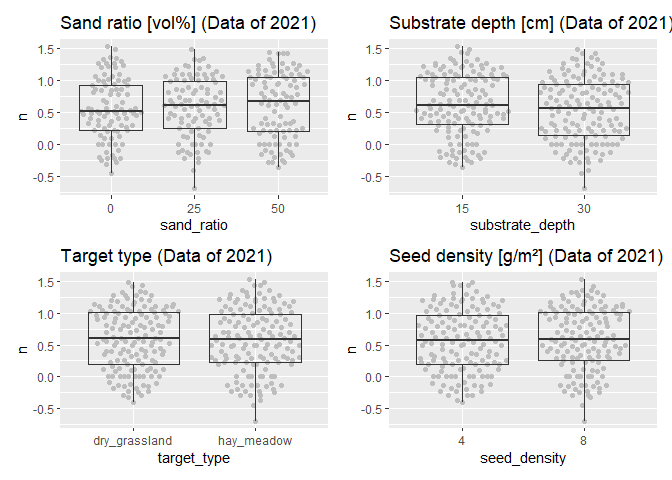
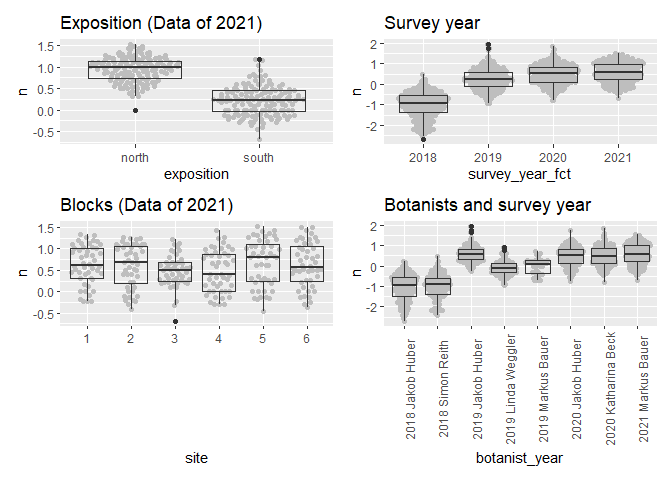
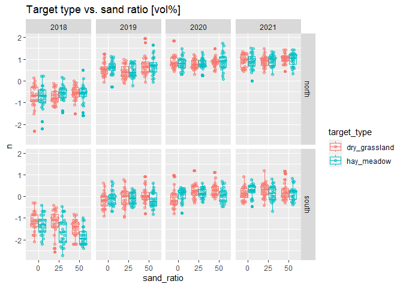
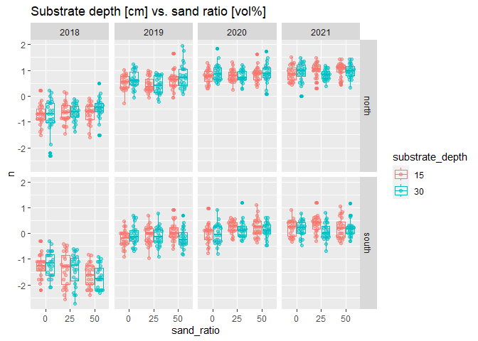
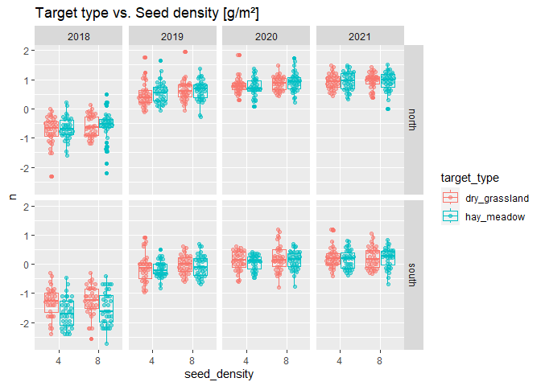

Favourable Conservation Status (FCS): <br> Analysis of Bauer et
al. (unpublished) Field experiment
================
Markus Bauer <br>
2022-11-10

# Preparation

#### Packages

``` r
library(here)
library(tidyverse)
library(ggbeeswarm)
library(patchwork)
library(brms)
library(DHARMa)
library(bayesplot)
library(loo)
library(tidybayes)
library(emmeans)
```

#### Load data

``` r
sites <- read_csv(here("data", "processed", "data_processed_sites.csv"),
                  col_names = TRUE, na = c("na", "NA", ""), col_types =
                    cols(
                      .default = "?",
                      plot = "f",
                      site = "f",
                      sand_ratio = "f",
                      substrate_depth = "f",
                      target_type = col_factor(levels = c(
                        "dry_grassland", "hay_meadow"
                        )),
                      seed_density = "f",
                      exposition = col_factor(levels = c(
                        "north", "south"
                      )),
                      survey_year = "d"
                    )) %>%
  ### Exclude data of seed mixtures
  filter(survey_year != "seeded") %>%
  mutate(
    survey_year_fct = factor(survey_year),
    botanist_year = str_c(survey_year, botanist, sep = " "),
    botanist_year = factor(botanist_year),
    n = fcs_target,
    id = factor(id)
    ) %>%
  select(
    id, plot, site, exposition, sand_ratio, substrate_depth, target_type,
    seed_density, survey_year_fct, survey_year, botanist_year, n
    )
```

    ## Warning: One or more parsing issues, call `problems()` on your data frame for details,
    ## e.g.:
    ##   dat <- vroom(...)
    ##   problems(dat)

# Statistics

## Data exploration

### Graphs

<!-- --><!-- --><!-- --><!-- --><!-- -->
