Analysis of Bauer et al. (unpublished) Field experiment: <br>
Persistence
================
<b>Markus Bauer\*</b> <br>
<b>2022-12-05</b>

- <a href="#preparation" id="toc-preparation">Preparation</a>
- <a href="#statistics" id="toc-statistics">Statistics</a>
  - <a href="#data-exploration" id="toc-data-exploration">Data
    exploration</a>
    - <a href="#graphs-of-raw-data" id="toc-graphs-of-raw-data">Graphs of raw
      data</a>
    - <a href="#outliers-zero-inflation-transformations"
      id="toc-outliers-zero-inflation-transformations">Outliers,
      zero-inflation, transformations?</a>
  - <a href="#models" id="toc-models">Models</a>
    - <a href="#priors" id="toc-priors">Priors</a>
  - <a href="#model-check" id="toc-model-check">Model check</a>
    - <a href="#dharma" id="toc-dharma">DHARMa</a>
    - <a href="#preparation-1" id="toc-preparation-1">Preparation</a>
    - <a href="#sampling-efficency-and-effectiveness"
      id="toc-sampling-efficency-and-effectiveness">Sampling efficency and
      effectiveness</a>
    - <a href="#mcmc-diagnostics" id="toc-mcmc-diagnostics">MCMC
      diagnostics</a>
    - <a href="#posterior-predictive-check"
      id="toc-posterior-predictive-check">Posterior predictive check</a>
    - <a href="#autocorrelation-check"
      id="toc-autocorrelation-check">Autocorrelation check</a>
  - <a href="#output-of-choosen-model"
    id="toc-output-of-choosen-model">Output of choosen model</a>
    - <a href="#model-output" id="toc-model-output">Model output</a>
    - <a href="#effect-sizes" id="toc-effect-sizes">Effect sizes</a>
- <a href="#session-info" id="toc-session-info">Session info</a>

Technichal University of Munich, TUM School of Life Sciences, Chair of
Restoration Ecology, Emil-Ramann-Straße 6, 85354 Freising, Germany

\* Corresponding author: <markus1.bauer@tum.de> <br> ORCiD ID:
[0000-0001-5372-4174](https://orcid.org/0000-0001-5372-4174) <br>
[Google
Scholar](https://scholar.google.de/citations?user=oHhmOkkAAAAJ&hl=de&oi=ao)
<br> GitHub: [markus1bauer](https://github.com/markus1bauer)

Persistence sensu Wilsey (2021) Restor Ecol [DOI:
10.1111/rec.13132](https://doi.org/10.1111/rec.13132)

# Preparation

#### Packages

``` r
library(here)
library(tidyverse)
library(ggbeeswarm)
library(patchwork)
library(brms)
library(DHARMa)
library(DHARMa.helpers)
library(bayesplot)
library(loo)
library(tidybayes)
library(emmeans)
```

#### Load data

``` r
sites <- read_csv(
  here("data", "processed", "data_processed_sites_temporal.csv"),
  col_names = TRUE, na = c("na", "NA", ""),
  col_types = cols(
    .default = "?",
    plot = "f",
    site = "f",
    sand_ratio = "f",
    substrate_depth = col_factor(levels = c("30", "15")),
    target_type = col_factor(levels = c("hay_meadow", "dry_grassland")),
    seed_density = "f",
    exposition = col_factor(levels = c("north", "south")),
    survey_year = "c"
  )
  ) %>%
  ### Exclude data of seed mixtures
  filter(presabu == "presence") %>%
  mutate(
    survey_year_fct = factor(survey_year),
    botanist_year = str_c(survey_year, botanist, exposition, sep = " "),
    botanist_year = factor(botanist_year),
    id = factor(id),
    n = persistence
  ) %>%
  select(
    id, plot, site, exposition, sand_ratio, substrate_depth, target_type,
    seed_density, survey_year_fct, survey_year, botanist_year, n
  )
```

# Statistics

## Data exploration

### Graphs of raw data

<!-- --><!-- --><!-- --><!-- --><!-- -->

### Outliers, zero-inflation, transformations?

    ## # A tibble: 12 × 3
    ## # Groups:   exposition [2]
    ##    exposition site      n
    ##    <fct>      <fct> <int>
    ##  1 north      1        96
    ##  2 north      2        96
    ##  3 north      3        96
    ##  4 north      4        96
    ##  5 north      5        96
    ##  6 north      6        96
    ##  7 south      1        96
    ##  8 south      2        96
    ##  9 south      3        96
    ## 10 south      4        96
    ## 11 south      5        96
    ## 12 south      6        96

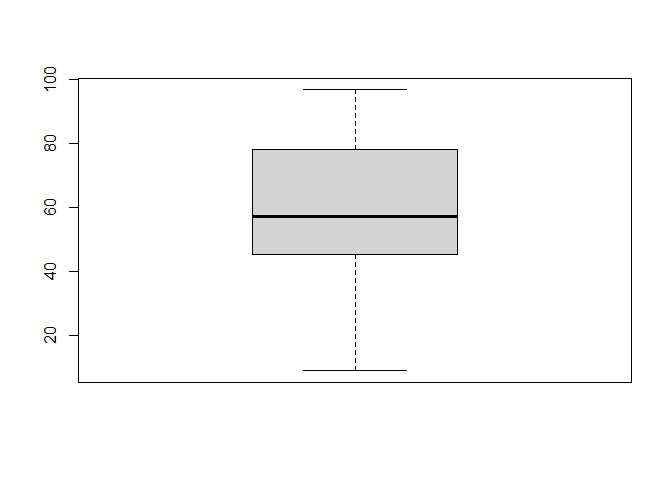<!-- --><!-- --><!-- --><!-- -->

## Models

``` r
load(file = here("outputs", "models", "model_persistence_2.Rdata"))
load(file = here("outputs", "models", "model_persistence_2_flat.Rdata"))
m_1 <- m2
m_2 <- m2_flat
```

``` r
m_1$formula
## n ~ sand_ratio * target_type * exposition * survey_year_fct + substrate_depth + seed_density + substrate_depth:exposition + seed_density:exposition + substrate_depth:survey_year_fct + seed_density:survey_year_fct + botanist_year + (1 | site/plot)
m_2$formula
## n ~ sand_ratio * target_type * exposition * survey_year_fct + substrate_depth + seed_density + substrate_depth:exposition + seed_density:exposition + substrate_depth:survey_year_fct + seed_density:survey_year_fct + botanist_year + (1 | site/plot)
```

``` r
m_1$family
## 
## Family: gaussian 
## Link function: identity
m_2$family
## 
## Family: gaussian 
## Link function: identity
```

### Priors

#### Possible prior distributions

``` r
get_prior(n ~ target_type + exposition + sand_ratio + survey_year_fct +
            seed_density + substrate_depth +
            (1 | site/plot),
          data = sites)
```

    ##                     prior     class                     coef     group resp
    ##                    (flat)         b                                        
    ##                    (flat)         b          expositionsouth               
    ##                    (flat)         b             sand_ratio25               
    ##                    (flat)         b             sand_ratio50               
    ##                    (flat)         b            seed_density8               
    ##                    (flat)         b        substrate_depth15               
    ##                    (flat)         b      survey_year_fct2019               
    ##                    (flat)         b      survey_year_fct2020               
    ##                    (flat)         b      survey_year_fct2021               
    ##                    (flat)         b target_typedry_grassland               
    ##  student_t(3, 57.1, 23.5) Intercept                                        
    ##     student_t(3, 0, 23.5)        sd                                        
    ##     student_t(3, 0, 23.5)        sd                               site     
    ##     student_t(3, 0, 23.5)        sd                Intercept      site     
    ##     student_t(3, 0, 23.5)        sd                          site:plot     
    ##     student_t(3, 0, 23.5)        sd                Intercept site:plot     
    ##     student_t(3, 0, 23.5)     sigma                                        
    ##  dpar nlpar lb ub       source
    ##                        default
    ##                   (vectorized)
    ##                   (vectorized)
    ##                   (vectorized)
    ##                   (vectorized)
    ##                   (vectorized)
    ##                   (vectorized)
    ##                   (vectorized)
    ##                   (vectorized)
    ##                   (vectorized)
    ##                        default
    ##              0         default
    ##              0    (vectorized)
    ##              0    (vectorized)
    ##              0    (vectorized)
    ##              0    (vectorized)
    ##              0         default

``` r
ggplot(data = data.frame(x = c(-40, 40)), aes(x = x)) +
  stat_function(fun = dnorm, n = 101, args = list(mean = 0, sd = 10)) +
  expand_limits(y = 0) + ggtitle("Normal distribution")
```

<!-- -->

``` r
ggplot(data = data.frame(x = c(-40, 40)), aes(x = x)) +
  stat_function(fun = dcauchy, n = 101, args = list(location = 0, scale = 10)) +
  expand_limits(y = 0) + ggtitle("Cauchy distribution")
```

<!-- -->

``` r
ggplot(data.frame(x = c(-40, 40)), aes(x = x)) +
  stat_function(fun = dstudent_t, args = list(df = 3, mu = 0, sigma = 10)) +
  expand_limits(y = 0) + ggtitle(expression(Student~italic(t)*"-distribution"))
```

<!-- -->

#### Prior summary

``` r
prior_summary(m_1, all = FALSE)
```

    ##                  prior     class                coef group resp dpar nlpar lb
    ##          normal(0, 20)         b                                             
    ##          normal(5, 20)         b     expositionsouth                         
    ##       normal(-2.5, 20)         b        sand_ratio25                         
    ##         normal(-5, 20)         b        sand_ratio50                         
    ##       normal(-2.5, 20)         b survey_year_fct2019                         
    ##         normal(-5, 20)         b survey_year_fct2020                         
    ##       normal(-7.5, 20)         b survey_year_fct2021                         
    ##          normal(0, 20) Intercept                                             
    ##  student_t(3, 0, 23.5)        sd                                            0
    ##          cauchy(0, 10)     sigma                                            0
    ##  ub  source
    ##        user
    ##        user
    ##        user
    ##        user
    ##        user
    ##        user
    ##        user
    ##        user
    ##     default
    ##        user

Conditional <i>R</i>² values

``` r
bayes_R2(m_1, probs = c(0.05, 0.5, 0.95),
         re_formula =  ~ (1 | site/plot) + (1 | botanist_year)) 
##     Estimate   Est.Error        Q5       Q50       Q95
## R2 0.8943171 0.003328029 0.8886081 0.8944525 0.8995968
bayes_R2(m_2, probs = c(0.05, 0.5, 0.95),
         re_formula =  ~ (1 | site/plot) + (1 | botanist_year))
##     Estimate   Est.Error        Q5       Q50       Q95
## R2 0.8946516 0.003363445 0.8888842 0.8947961 0.8999034
```

Marginal <i>R</i>² values

``` r
bayes_R2(m_1, probs = c(0.05, 0.5, 0.95),
         re_formula = 1 ~ 1)
##     Estimate   Est.Error        Q5       Q50       Q95
## R2 0.8586445 0.003560814 0.8524362 0.8588164 0.8641239
bayes_R2(m_2, probs = c(0.05, 0.5, 0.95),
         re_formula = 1 ~ 1)
##     Estimate   Est.Error        Q5       Q50      Q95
## R2 0.8591105 0.003523118 0.8530791 0.8592547 0.864556
```

## Model check

### DHARMa

``` r
DHARMa.helpers::dh_check_brms(m_1, integer = TRUE)
```

<!-- -->

``` r
DHARMa.helpers::dh_check_brms(m_2, integer = TRUE)
```

<!-- -->

### Preparation

``` r
posterior1 <- m_1 %>%
  posterior::as_draws() %>%
  posterior::subset_draws(
    variable = c(
      "b_sand_ratio25",
      "b_sand_ratio50",
      "b_substrate_depth15",
      "b_target_typedry_grassland",
      "b_seed_density8",
      "b_expositionsouth",
      "b_survey_year_fct2019",
      "b_survey_year_fct2020",
      "b_survey_year_fct2021",
      "sd_site__Intercept",
      "sd_site:plot__Intercept",
      "sigma"
    )
  )
posterior2 <- m_2 %>%
  posterior::as_draws() %>%
  posterior::subset_draws(
    variable = c(
      "b_sand_ratio25",
      "b_sand_ratio50",
      "b_substrate_depth15",
      "b_target_typedry_grassland",
      "b_seed_density8",
      "b_expositionsouth",
      "b_survey_year_fct2019",
      "b_survey_year_fct2020",
      "b_survey_year_fct2021",
      "sd_site__Intercept",
      "sd_site:plot__Intercept",
      "sigma"
    )
  )
hmc_diagnostics1 <- nuts_params(m_1)
hmc_diagnostics2 <- nuts_params(m_2)
y <- sites$n
yrep1 <- posterior_predict(m_1, draws = 500)
yrep2 <- posterior_predict(m_2, draws = 500)
loo1 <- loo(m_1, save_psis = TRUE, moment_match = FALSE)
loo2 <- loo(m_2, save_psis = TRUE, moment_match = FALSE)
draws1 <- m_1 %>%
  posterior::as_draws() %>%
  posterior::summarize_draws() %>%
  filter(str_starts(variable, "b_"))
draws2 <- m_2 %>%
  posterior::as_draws() %>%
  posterior::summarize_draws() %>%
  filter(str_starts(variable, "b_"))
```

### Sampling efficency and effectiveness

#### Rhat

``` r
mcmc_rhat(draws1$rhat)
```

<!-- -->

``` r
mcmc_rhat(draws2$rhat)
```

<!-- -->

#### Effective sampling size (ESS)

``` r
mcmc_neff(neff_ratio(m_1))
```

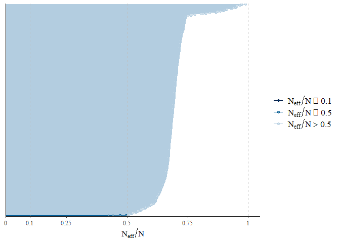<!-- -->

``` r
mcmc_neff(neff_ratio(m_2))
```

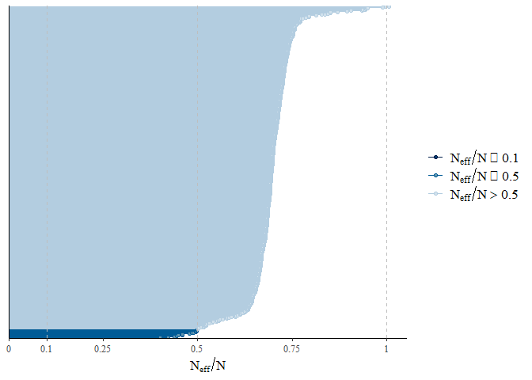<!-- -->

### MCMC diagnostics

``` r
mcmc_trace(posterior1, np = hmc_diagnostics1)
```

    ## No divergences to plot.

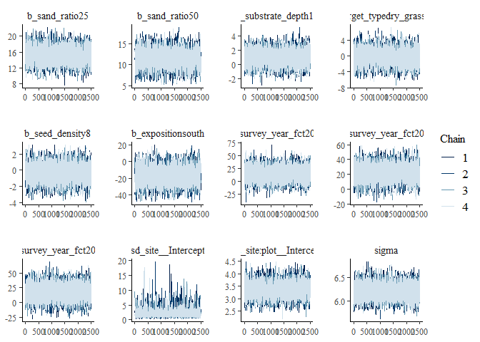<!-- -->

``` r
mcmc_trace(posterior2, np = hmc_diagnostics2)
```

    ## No divergences to plot.

<!-- -->

``` r
mcmc_pairs(m_1, off_diag_args = list(size = 1.2),
           pars = c(
             "b_sand_ratio25", "b_sand_ratio50", "b_substrate_depth15",
             "b_target_typedry_grassland", "b_seed_density8",
             "b_expositionsouth", "sigma"
           ))
```

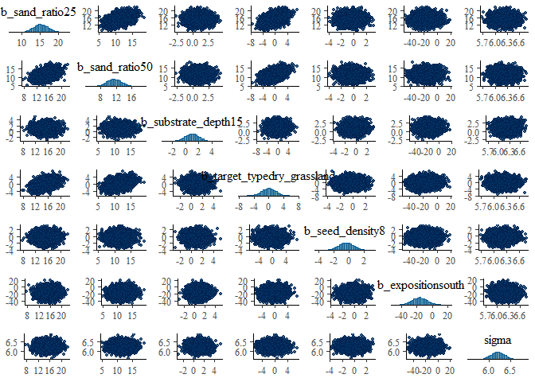<!-- -->

``` r
mcmc_pairs(m_2, off_diag_args = list(size = 1.2),
           pars = c(
             "b_sand_ratio25", "b_sand_ratio50", "b_substrate_depth15",
             "b_target_typedry_grassland", "b_seed_density8",
             "b_expositionsouth", "sigma"
           ))
```

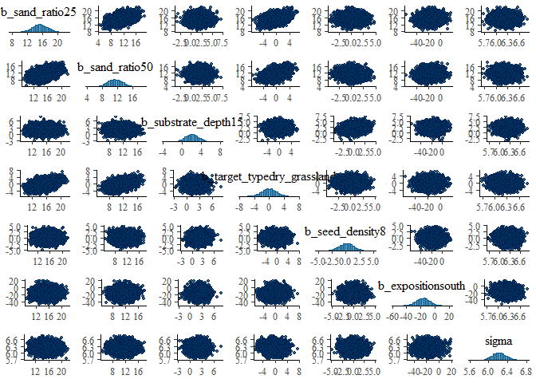<!-- -->

``` r
mcmc_parcoord(posterior1, np = hmc_diagnostics1)
```

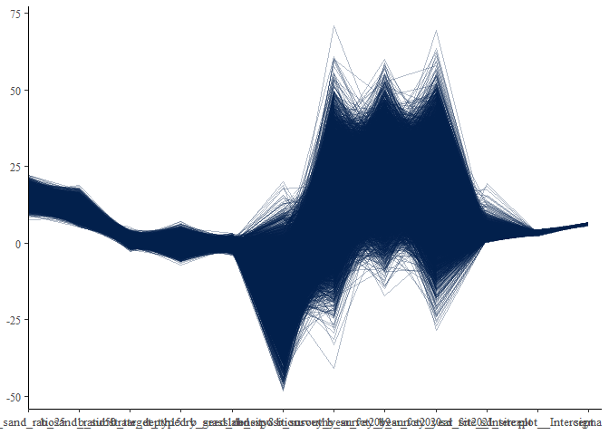<!-- -->

``` r
mcmc_parcoord(posterior2, np = hmc_diagnostics2)
```

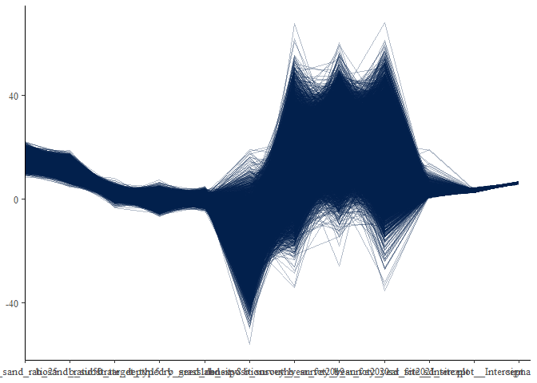<!-- -->

### Posterior predictive check

#### Kernel density

``` r
p1 <- ppc_dens_overlay(y, yrep1[1:50, ])
p2 <- ppc_dens_overlay(y, yrep2[1:50, ])
p1 / p2
```

<!-- -->

``` r
ppc_dens_overlay_grouped(y, yrep1[1:50, ], group = sites$site)
```

<!-- -->

``` r
ppc_dens_overlay_grouped(y, yrep2[1:50, ], group = sites$site)
```

<!-- -->

``` r
p1 <- ppc_dens_overlay_grouped(y, yrep1[1:50, ], group = sites$exposition)
p2 <- ppc_dens_overlay_grouped(y, yrep2[1:50, ], group = sites$exposition)
p1 / p2
```

<!-- -->

``` r
ppc_dens_overlay_grouped(y, yrep1[1:50, ], group = sites$survey_year_fct)
```

<!-- -->

``` r
ppc_dens_overlay_grouped(y, yrep2[1:50, ], group = sites$survey_year_fct)
```

<!-- -->

``` r
p1 <- ppc_dens_overlay_grouped(y, yrep1[1:50, ], group = sites$target_type)
p2 <- ppc_dens_overlay_grouped(y, yrep2[1:50, ], group = sites$target_type)
p1 / p2
```

<!-- -->

``` r
p1 <- ppc_dens_overlay_grouped(y, yrep1[1:50, ], group = sites$seed_density)
p2 <- ppc_dens_overlay_grouped(y, yrep2[1:50, ], group = sites$seed_density)
p1 / p2
```

<!-- -->

``` r
p1 <- ppc_dens_overlay_grouped(y, yrep1[1:50, ], group = sites$sand_ratio)
p2 <- ppc_dens_overlay_grouped(y, yrep2[1:50, ], group = sites$sand_ratio)
p1 / p2
```

<!-- -->

``` r
p1 <- ppc_dens_overlay_grouped(y, yrep1[1:50, ], group = sites$substrate_depth)
p2 <- ppc_dens_overlay_grouped(y, yrep2[1:50, ], group = sites$substrate_depth)
p1 / p2
```

<!-- -->

#### Histograms of statistics skew

``` r
p1 <- ppc_stat(y, yrep1, binwidth = 0.001)
p2 <- ppc_stat(y, yrep2, binwidth = 0.001)
p1 / p2
```

<!-- -->

``` r
ppc_stat_grouped(y, yrep1, group = sites$site, binwidth = 0.001)
```

<!-- -->

``` r
ppc_stat_grouped(y, yrep2, group = sites$site, binwidth = 0.001)
```

<!-- -->

``` r
p1 <- ppc_stat_grouped(y, yrep1, group = sites$exposition, binwidth = 0.001)
p2 <- ppc_stat_grouped(y, yrep2, group = sites$exposition, binwidth = 0.001)
p1 / p2
```

<!-- -->

``` r
ppc_stat_grouped(y, yrep1, group = sites$survey_year_fct, binwidth = 0.001)
```

<!-- -->

``` r
ppc_stat_grouped(y, yrep2, group = sites$survey_year_fct, binwidth = 0.001)
```

<!-- -->

``` r
p1 <- ppc_stat_grouped(y, yrep1, group = sites$target_type, binwidth = 0.001)
p2 <- ppc_stat_grouped(y, yrep2, group = sites$target_type, binwidth = 0.001)
p1 / p2
```

<!-- -->

``` r
p1 <- ppc_stat_grouped(y, yrep1, group = sites$seed_density, binwidth = 0.001)
p2 <- ppc_stat_grouped(y, yrep2, group = sites$seed_density, binwidth = 0.001)
p1 / p2
```

<!-- -->

``` r
p1 <- ppc_stat_grouped(y, yrep1, group = sites$sand_ratio, binwidth = 0.001)
p2 <- ppc_stat_grouped(y, yrep2, group = sites$sand_ratio, binwidth = 0.001)
p1 / p2
```

<!-- -->

``` r
p1 <- ppc_stat_grouped(y, yrep1, group = sites$substrate_depth, binwidth = 0.001)
p2 <- ppc_stat_grouped(y, yrep2, group = sites$substrate_depth, binwidth = 0.001)
p1 / p2
```

<!-- -->

#### LOO (Leave one out)

``` r
loo1
```

    ## 
    ## Computed from 10000 by 1152 log-likelihood matrix
    ## 
    ##          Estimate   SE
    ## elpd_loo  -3855.6 25.7
    ## p_loo       199.7  8.0
    ## looic      7711.2 51.4
    ## ------
    ## Monte Carlo SE of elpd_loo is 0.3.
    ## 
    ## Pareto k diagnostic values:
    ##                          Count Pct.    Min. n_eff
    ## (-Inf, 0.5]   (good)     1135  98.5%   736       
    ##  (0.5, 0.7]   (ok)         17   1.5%   350       
    ##    (0.7, 1]   (bad)         0   0.0%   <NA>      
    ##    (1, Inf)   (very bad)    0   0.0%   <NA>      
    ## 
    ## All Pareto k estimates are ok (k < 0.7).
    ## See help('pareto-k-diagnostic') for details.

``` r
loo2
```

    ## 
    ## Computed from 7500 by 1152 log-likelihood matrix
    ## 
    ##          Estimate   SE
    ## elpd_loo  -3855.3 25.8
    ## p_loo       200.6  8.1
    ## looic      7710.6 51.6
    ## ------
    ## Monte Carlo SE of elpd_loo is 0.3.
    ## 
    ## Pareto k diagnostic values:
    ##                          Count Pct.    Min. n_eff
    ## (-Inf, 0.5]   (good)     1135  98.5%   554       
    ##  (0.5, 0.7]   (ok)         17   1.5%   399       
    ##    (0.7, 1]   (bad)         0   0.0%   <NA>      
    ##    (1, Inf)   (very bad)    0   0.0%   <NA>      
    ## 
    ## All Pareto k estimates are ok (k < 0.7).
    ## See help('pareto-k-diagnostic') for details.

``` r
plot(loo1)
```

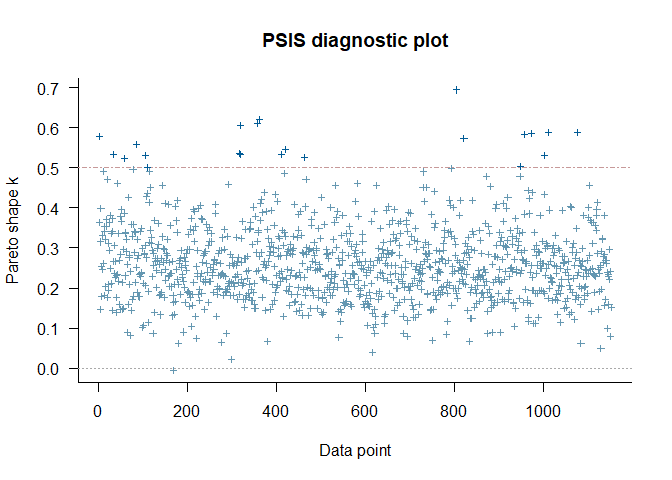<!-- -->

``` r
plot(loo2)
```

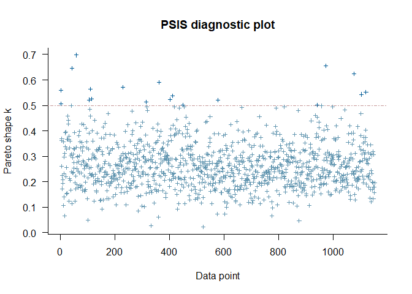<!-- -->

Leave one out probability integral transform

``` r
p1 <- ppc_loo_pit_overlay(y, yrep1, lw = weights(loo1$psis_object))
```

    ## NOTE: The kernel density estimate assumes continuous observations and is not optimal for discrete observations.

``` r
p2 <- ppc_loo_pit_overlay(y, yrep2, lw = weights(loo2$psis_object))
```

    ## NOTE: The kernel density estimate assumes continuous observations and is not optimal for discrete observations.

``` r
p1 / p2
```

<!-- -->

### Autocorrelation check

``` r
mcmc_acf(posterior1, lags = 10)
```

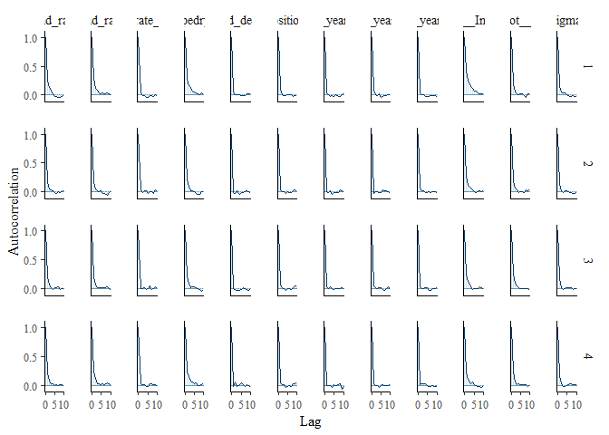<!-- -->

``` r
mcmc_acf(posterior2, lags = 10)
```

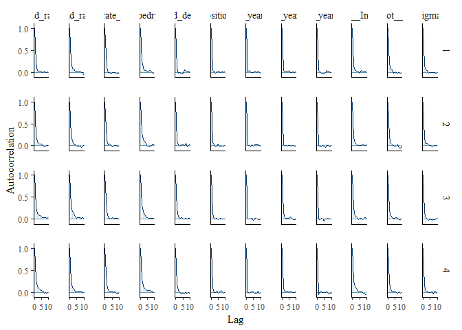<!-- -->

## Output of choosen model

### Model output

Conditional and marignal <i>R</i>²

``` r
bayes_R2(m_1, probs = c(0.05, 0.5, 0.95),
         re_formula =  ~ (1 | site/plot) + (1 | botanist_year)) 
##     Estimate   Est.Error        Q5       Q50       Q95
## R2 0.8943171 0.003328029 0.8886081 0.8944525 0.8995968
bayes_R2(m_1, probs = c(0.05, 0.5, 0.95),
         re_formula = 1 ~ 1)
##     Estimate   Est.Error        Q5       Q50       Q95
## R2 0.8586445 0.003560814 0.8524362 0.8588164 0.8641239
```

Posteriors of chosen model

``` r
draws1
```

    ## # A tibble: 70 × 10
    ##    variable       mean  median     sd    mad      q5   q95  rhat ess_b…¹ ess_t…²
    ##    <chr>         <dbl>   <dbl>  <dbl>  <dbl>   <dbl> <dbl> <dbl>   <dbl>   <dbl>
    ##  1 b_Intercept  50.1    50.2    1.95   1.85   46.9   53.2   1.00   5606.   6203.
    ##  2 b_sand_rat…  15.1    15.1    1.91   1.86   11.9   18.3   1.00   4931.   7524.
    ##  3 b_sand_rat…  11.3    11.2    1.92   1.91    8.08  14.4   1.00   4902.   7581.
    ##  4 b_target_t…  -0.243  -0.234  1.86   1.84   -3.31   2.85  1.00   4570.   7180.
    ##  5 b_expositi… -13.3   -13.3    9.60   9.67  -29.0    2.41  1.00   7612.   8942.
    ##  6 b_survey_y…  11.5    11.6   12.5   12.4    -8.91  32.1   1.00   9056.   9206.
    ##  7 b_survey_y…  18.8    18.9   10.6   10.7     1.41  36.0   1.00   8786.   8643.
    ##  8 b_survey_y…  11.3    11.4   12.8   12.7    -9.79  32.3   1.00   9672.   9090.
    ##  9 b_substrat…   0.987   0.979  0.989  0.997  -0.625  2.63  1.00   8776.   9431.
    ## 10 b_seed_den…  -0.364  -0.367  0.992  0.989  -2.00   1.27  1.00   9175.   9305.
    ## # … with 60 more rows, and abbreviated variable names ¹​ess_bulk, ²​ess_tail

``` r
mcmc_intervals(
  posterior1,
  prob = 0.66,
  prob_outer = 0.95,
  point_est = "mean"
  ) +
  theme_classic()
```

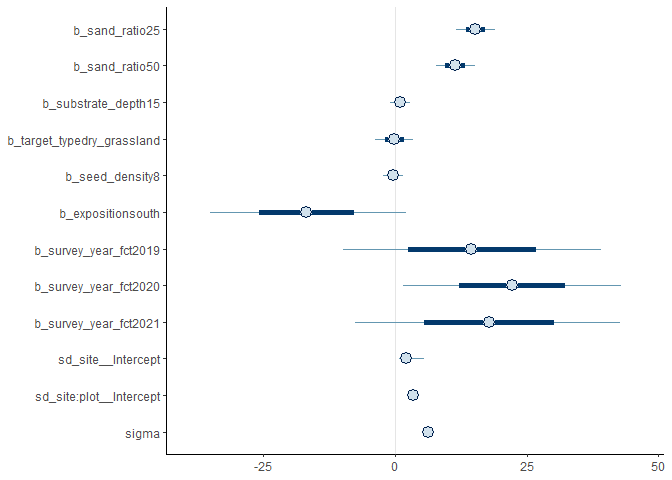<!-- -->

Posteriors of second model:

``` r
mcmc_intervals(
  posterior2,
  prob = 0.66,
  prob_outer = 0.95,
  point_est = "mean"
  ) +
  theme_classic()
```

<!-- -->

### Effect sizes

Just, to get exact values if necessary, which is not possible from the
figure

``` r
(emm <- emmeans(m_1, revpairwise ~ target_type + sand_ratio |
                  exposition | survey_year_fct, type = "response"))
```

    ## NOTE: A nesting structure was detected in the fitted model:
    ##     botanist_year %in% (exposition*survey_year_fct)

    ## $emmeans
    ## exposition = north, survey_year_fct = 2018:
    ##  target_type   sand_ratio emmean lower.HPD upper.HPD
    ##  hay_meadow    0            47.5      44.2      50.8
    ##  dry_grassland 0            47.2      43.9      50.6
    ##  hay_meadow    25           62.6      59.3      66.0
    ##  dry_grassland 25           55.9      52.4      59.2
    ##  hay_meadow    50           58.7      55.4      62.2
    ##  dry_grassland 50           55.4      52.1      58.9
    ## 
    ## exposition = south, survey_year_fct = 2018:
    ##  target_type   sand_ratio emmean lower.HPD upper.HPD
    ##  hay_meadow    0            30.5      27.0      33.9
    ##  dry_grassland 0            32.8      29.4      36.3
    ##  hay_meadow    25           31.0      27.5      34.4
    ##  dry_grassland 25           36.7      33.2      40.1
    ##  hay_meadow    50           28.0      24.5      31.4
    ##  dry_grassland 50           31.7      28.2      35.1
    ## 
    ## exposition = north, survey_year_fct = 2019:
    ##  target_type   sand_ratio emmean lower.HPD upper.HPD
    ##  hay_meadow    0            80.4      76.9      83.9
    ##  dry_grassland 0            76.1      72.6      79.5
    ##  hay_meadow    25           83.6      80.1      87.0
    ##  dry_grassland 25           75.3      71.8      78.6
    ##  hay_meadow    50           78.7      75.2      82.0
    ##  dry_grassland 50           75.9      72.5      79.4
    ## 
    ## exposition = south, survey_year_fct = 2019:
    ##  target_type   sand_ratio emmean lower.HPD upper.HPD
    ##  hay_meadow    0            45.6      42.1      49.2
    ##  dry_grassland 0            43.3      39.7      46.7
    ##  hay_meadow    25           45.9      42.4      49.6
    ##  dry_grassland 25           44.8      41.2      48.4
    ##  hay_meadow    50           42.0      38.4      45.5
    ##  dry_grassland 50           41.8      38.2      45.3
    ## 
    ## exposition = north, survey_year_fct = 2020:
    ##  target_type   sand_ratio emmean lower.HPD upper.HPD
    ##  hay_meadow    0            82.4      79.0      85.9
    ##  dry_grassland 0            79.5      75.9      82.9
    ##  hay_meadow    25           85.0      81.7      88.6
    ##  dry_grassland 25           80.4      77.0      83.8
    ##  hay_meadow    50           84.0      80.5      87.3
    ##  dry_grassland 50           79.9      76.3      83.2
    ## 
    ## exposition = south, survey_year_fct = 2020:
    ##  target_type   sand_ratio emmean lower.HPD upper.HPD
    ##  hay_meadow    0            51.6      48.3      55.2
    ##  dry_grassland 0            51.8      48.3      55.3
    ##  hay_meadow    25           54.2      50.6      57.5
    ##  dry_grassland 25           54.7      51.3      58.1
    ##  hay_meadow    50           50.0      46.5      53.3
    ##  dry_grassland 50           55.3      51.9      58.8
    ## 
    ## exposition = north, survey_year_fct = 2021:
    ##  target_type   sand_ratio emmean lower.HPD upper.HPD
    ##  hay_meadow    0            76.9      73.5      80.3
    ##  dry_grassland 0            75.4      72.1      79.0
    ##  hay_meadow    25           81.8      78.3      85.2
    ##  dry_grassland 25           78.3      74.7      81.7
    ##  hay_meadow    50           82.0      78.4      85.2
    ##  dry_grassland 50           80.6      77.2      84.0
    ## 
    ## exposition = south, survey_year_fct = 2021:
    ##  target_type   sand_ratio emmean lower.HPD upper.HPD
    ##  hay_meadow    0            52.6      49.2      56.2
    ##  dry_grassland 0            49.4      45.9      52.9
    ##  hay_meadow    25           48.4      44.8      51.8
    ##  dry_grassland 25           50.7      47.2      54.1
    ##  hay_meadow    50           51.1      47.5      54.6
    ##  dry_grassland 50           51.7      48.2      55.1
    ## 
    ## Results are averaged over the levels of: substrate_depth, seed_density, botanist_year 
    ## Point estimate displayed: median 
    ## HPD interval probability: 0.95 
    ## 
    ## $contrasts
    ## exposition = north, survey_year_fct = 2018:
    ##  contrast                                                estimate lower.HPD
    ##  dry_grassland sand_ratio0 - hay_meadow sand_ratio0        -0.234  -3.80148
    ##  hay_meadow sand_ratio25 - hay_meadow sand_ratio0          15.089  11.28034
    ##  hay_meadow sand_ratio25 - dry_grassland sand_ratio0       15.327  11.52450
    ##  dry_grassland sand_ratio25 - hay_meadow sand_ratio0        8.349   4.40976
    ##  dry_grassland sand_ratio25 - dry_grassland sand_ratio0     8.611   4.81339
    ##  dry_grassland sand_ratio25 - hay_meadow sand_ratio25      -6.729 -10.60462
    ##  hay_meadow sand_ratio50 - hay_meadow sand_ratio0          11.228   7.67718
    ##  hay_meadow sand_ratio50 - dry_grassland sand_ratio0       11.482   7.74207
    ##  hay_meadow sand_ratio50 - hay_meadow sand_ratio25         -3.832  -7.60560
    ##  hay_meadow sand_ratio50 - dry_grassland sand_ratio25       2.884  -1.22332
    ##  dry_grassland sand_ratio50 - hay_meadow sand_ratio0        7.897   4.03471
    ##  dry_grassland sand_ratio50 - dry_grassland sand_ratio0     8.174   4.34105
    ##  dry_grassland sand_ratio50 - hay_meadow sand_ratio25      -7.180 -11.00782
    ##  dry_grassland sand_ratio50 - dry_grassland sand_ratio25   -0.479  -4.31519
    ##  dry_grassland sand_ratio50 - hay_meadow sand_ratio50      -3.325  -7.27254
    ##  upper.HPD
    ##     3.5416
    ##    18.8486
    ##    19.3112
    ##    12.1425
    ##    12.3877
    ##    -2.9358
    ##    15.1965
    ##    15.4356
    ##     0.1263
    ##     6.6267
    ##    11.8561
    ##    12.0036
    ##    -3.1609
    ##     3.4259
    ##     0.5976
    ## 
    ## exposition = south, survey_year_fct = 2018:
    ##  contrast                                                estimate lower.HPD
    ##  dry_grassland sand_ratio0 - hay_meadow sand_ratio0         2.293  -1.58662
    ##  hay_meadow sand_ratio25 - hay_meadow sand_ratio0           0.413  -3.57903
    ##  hay_meadow sand_ratio25 - dry_grassland sand_ratio0       -1.861  -5.57430
    ##  dry_grassland sand_ratio25 - hay_meadow sand_ratio0        6.155   2.17522
    ##  dry_grassland sand_ratio25 - dry_grassland sand_ratio0     3.897  -0.00879
    ##  dry_grassland sand_ratio25 - hay_meadow sand_ratio25       5.744   1.73060
    ##  hay_meadow sand_ratio50 - hay_meadow sand_ratio0          -2.560  -6.56414
    ##  hay_meadow sand_ratio50 - dry_grassland sand_ratio0       -4.901  -8.98830
    ##  hay_meadow sand_ratio50 - hay_meadow sand_ratio25         -3.003  -7.03415
    ##  hay_meadow sand_ratio50 - dry_grassland sand_ratio25      -8.771 -12.57556
    ##  dry_grassland sand_ratio50 - hay_meadow sand_ratio0        1.114  -2.90769
    ##  dry_grassland sand_ratio50 - dry_grassland sand_ratio0    -1.193  -5.09610
    ##  dry_grassland sand_ratio50 - hay_meadow sand_ratio25       0.704  -3.00649
    ##  dry_grassland sand_ratio50 - dry_grassland sand_ratio25   -5.086  -8.84133
    ##  dry_grassland sand_ratio50 - hay_meadow sand_ratio50       3.717  -0.10687
    ##  upper.HPD
    ##     6.0966
    ##     4.1340
    ##     2.2566
    ##    10.0453
    ##     7.8789
    ##     9.5013
    ##     1.2161
    ##    -1.0401
    ##     0.9236
    ##    -4.6864
    ##     5.0080
    ##     2.8311
    ##     4.8085
    ##    -1.0457
    ##     7.6758
    ## 
    ## exposition = north, survey_year_fct = 2019:
    ##  contrast                                                estimate lower.HPD
    ##  dry_grassland sand_ratio0 - hay_meadow sand_ratio0        -4.356  -8.21500
    ##  hay_meadow sand_ratio25 - hay_meadow sand_ratio0           3.167  -0.64741
    ##  hay_meadow sand_ratio25 - dry_grassland sand_ratio0        7.505   3.60041
    ##  dry_grassland sand_ratio25 - hay_meadow sand_ratio0       -5.086  -9.07517
    ##  dry_grassland sand_ratio25 - dry_grassland sand_ratio0    -0.729  -4.85042
    ##  dry_grassland sand_ratio25 - hay_meadow sand_ratio25      -8.241 -12.20005
    ##  hay_meadow sand_ratio50 - hay_meadow sand_ratio0          -1.733  -5.71323
    ##  hay_meadow sand_ratio50 - dry_grassland sand_ratio0        2.582  -1.34618
    ##  hay_meadow sand_ratio50 - hay_meadow sand_ratio25         -4.901  -8.95014
    ##  hay_meadow sand_ratio50 - dry_grassland sand_ratio25       3.306  -0.63003
    ##  dry_grassland sand_ratio50 - hay_meadow sand_ratio0       -4.490  -8.49151
    ##  dry_grassland sand_ratio50 - dry_grassland sand_ratio0    -0.152  -4.09647
    ##  dry_grassland sand_ratio50 - hay_meadow sand_ratio25      -7.656 -11.59700
    ##  dry_grassland sand_ratio50 - dry_grassland sand_ratio25    0.604  -3.40572
    ##  dry_grassland sand_ratio50 - hay_meadow sand_ratio50      -2.718  -6.69931
    ##  upper.HPD
    ##    -0.3330
    ##     7.2484
    ##    11.6893
    ##    -1.0422
    ##     3.0471
    ##    -4.2722
    ##     2.1690
    ##     6.5960
    ##    -1.0064
    ##     7.2709
    ##    -0.5210
    ##     4.0118
    ##    -3.5522
    ##     4.6435
    ##     1.3148
    ## 
    ## exposition = south, survey_year_fct = 2019:
    ##  contrast                                                estimate lower.HPD
    ##  dry_grassland sand_ratio0 - hay_meadow sand_ratio0        -2.311  -6.40462
    ##  hay_meadow sand_ratio25 - hay_meadow sand_ratio0           0.317  -3.41292
    ##  hay_meadow sand_ratio25 - dry_grassland sand_ratio0        2.624  -1.26344
    ##  dry_grassland sand_ratio25 - hay_meadow sand_ratio0       -0.717  -4.71571
    ##  dry_grassland sand_ratio25 - dry_grassland sand_ratio0     1.586  -2.53594
    ##  dry_grassland sand_ratio25 - hay_meadow sand_ratio25      -1.049  -5.08029
    ##  hay_meadow sand_ratio50 - hay_meadow sand_ratio0          -3.592  -7.67203
    ##  hay_meadow sand_ratio50 - dry_grassland sand_ratio0       -1.316  -5.49063
    ##  hay_meadow sand_ratio50 - hay_meadow sand_ratio25         -3.950  -7.93624
    ##  hay_meadow sand_ratio50 - dry_grassland sand_ratio25      -2.882  -6.80136
    ##  dry_grassland sand_ratio50 - hay_meadow sand_ratio0       -3.783  -7.54567
    ##  dry_grassland sand_ratio50 - dry_grassland sand_ratio0    -1.522  -5.46484
    ##  dry_grassland sand_ratio50 - hay_meadow sand_ratio25      -4.114  -7.85163
    ##  dry_grassland sand_ratio50 - dry_grassland sand_ratio25   -3.029  -7.00539
    ##  dry_grassland sand_ratio50 - hay_meadow sand_ratio50      -0.174  -4.11858
    ##  upper.HPD
    ##     1.6385
    ##     4.5048
    ##     6.7194
    ##     3.3118
    ##     5.4674
    ##     2.8732
    ##     0.2203
    ##     2.5592
    ##     0.0444
    ##     1.1380
    ##     0.2808
    ##     2.6017
    ##     0.0832
    ##     0.9253
    ##     3.7913
    ## 
    ## exposition = north, survey_year_fct = 2020:
    ##  contrast                                                estimate lower.HPD
    ##  dry_grassland sand_ratio0 - hay_meadow sand_ratio0        -2.952  -6.78117
    ##  hay_meadow sand_ratio25 - hay_meadow sand_ratio0           2.540  -1.31323
    ##  hay_meadow sand_ratio25 - dry_grassland sand_ratio0        5.511   1.62740
    ##  dry_grassland sand_ratio25 - hay_meadow sand_ratio0       -2.071  -5.84743
    ##  dry_grassland sand_ratio25 - dry_grassland sand_ratio0     0.885  -2.93957
    ##  dry_grassland sand_ratio25 - hay_meadow sand_ratio25      -4.600  -8.65895
    ##  hay_meadow sand_ratio50 - hay_meadow sand_ratio0           1.529  -2.27107
    ##  hay_meadow sand_ratio50 - dry_grassland sand_ratio0        4.501   0.50181
    ##  hay_meadow sand_ratio50 - hay_meadow sand_ratio25         -1.015  -4.92012
    ##  hay_meadow sand_ratio50 - dry_grassland sand_ratio25       3.580  -0.33380
    ##  dry_grassland sand_ratio50 - hay_meadow sand_ratio0       -2.598  -6.62316
    ##  dry_grassland sand_ratio50 - dry_grassland sand_ratio0     0.385  -3.63519
    ##  dry_grassland sand_ratio50 - hay_meadow sand_ratio25      -5.161  -8.99079
    ##  dry_grassland sand_ratio50 - dry_grassland sand_ratio25   -0.491  -4.47856
    ##  dry_grassland sand_ratio50 - hay_meadow sand_ratio50      -4.134  -7.97804
    ##  upper.HPD
    ##     1.0830
    ##     6.4900
    ##     9.7551
    ##     1.9645
    ##     4.8214
    ##    -0.8625
    ##     5.5403
    ##     8.4773
    ##     2.8955
    ##     7.6262
    ##     1.3617
    ##     4.2810
    ##    -1.0794
    ##     3.4647
    ##    -0.1313
    ## 
    ## exposition = south, survey_year_fct = 2020:
    ##  contrast                                                estimate lower.HPD
    ##  dry_grassland sand_ratio0 - hay_meadow sand_ratio0         0.220  -3.85073
    ##  hay_meadow sand_ratio25 - hay_meadow sand_ratio0           2.559  -1.32724
    ##  hay_meadow sand_ratio25 - dry_grassland sand_ratio0        2.361  -1.51917
    ##  dry_grassland sand_ratio25 - hay_meadow sand_ratio0        3.090  -0.79246
    ##  dry_grassland sand_ratio25 - dry_grassland sand_ratio0     2.881  -0.95407
    ##  dry_grassland sand_ratio25 - hay_meadow sand_ratio25       0.534  -3.42257
    ##  hay_meadow sand_ratio50 - hay_meadow sand_ratio0          -1.616  -5.60189
    ##  hay_meadow sand_ratio50 - dry_grassland sand_ratio0       -1.834  -5.69635
    ##  hay_meadow sand_ratio50 - hay_meadow sand_ratio25         -4.167  -8.09059
    ##  hay_meadow sand_ratio50 - dry_grassland sand_ratio25      -4.722  -8.86836
    ##  dry_grassland sand_ratio50 - hay_meadow sand_ratio0        3.724  -0.24863
    ##  dry_grassland sand_ratio50 - dry_grassland sand_ratio0     3.523  -0.46594
    ##  dry_grassland sand_ratio50 - hay_meadow sand_ratio25       1.185  -2.84290
    ##  dry_grassland sand_ratio50 - dry_grassland sand_ratio25    0.645  -3.46307
    ##  dry_grassland sand_ratio50 - hay_meadow sand_ratio50       5.363   1.26199
    ##  upper.HPD
    ##     4.0915
    ##     6.4635
    ##     6.4932
    ##     7.0918
    ##     6.9590
    ##     4.4933
    ##     2.2337
    ##     2.3227
    ##    -0.2192
    ##    -0.9602
    ##     7.7372
    ##     7.5547
    ##     5.0678
    ##     4.6017
    ##     9.1711
    ## 
    ## exposition = north, survey_year_fct = 2021:
    ##  contrast                                                estimate lower.HPD
    ##  dry_grassland sand_ratio0 - hay_meadow sand_ratio0        -1.496  -5.30032
    ##  hay_meadow sand_ratio25 - hay_meadow sand_ratio0           4.844   0.96540
    ##  hay_meadow sand_ratio25 - dry_grassland sand_ratio0        6.329   2.42825
    ##  dry_grassland sand_ratio25 - hay_meadow sand_ratio0        1.374  -2.64256
    ##  dry_grassland sand_ratio25 - dry_grassland sand_ratio0     2.881  -1.14422
    ##  dry_grassland sand_ratio25 - hay_meadow sand_ratio25      -3.466  -7.32576
    ##  hay_meadow sand_ratio50 - hay_meadow sand_ratio0           5.014   1.16046
    ##  hay_meadow sand_ratio50 - dry_grassland sand_ratio0        6.502   2.36127
    ##  hay_meadow sand_ratio50 - hay_meadow sand_ratio25          0.184  -3.68276
    ##  hay_meadow sand_ratio50 - dry_grassland sand_ratio25       3.637  -0.60942
    ##  dry_grassland sand_ratio50 - hay_meadow sand_ratio0        3.668  -0.12851
    ##  dry_grassland sand_ratio50 - dry_grassland sand_ratio0     5.119   1.22588
    ##  dry_grassland sand_ratio50 - hay_meadow sand_ratio25      -1.188  -5.36698
    ##  dry_grassland sand_ratio50 - dry_grassland sand_ratio25    2.274  -1.71806
    ##  dry_grassland sand_ratio50 - hay_meadow sand_ratio50      -1.380  -5.37805
    ##  upper.HPD
    ##     2.6473
    ##     8.8919
    ##    10.3122
    ##     5.3851
    ##     6.6646
    ##     0.5951
    ##     9.0617
    ##    10.2716
    ##     4.2463
    ##     7.4118
    ##     7.7265
    ##     9.1629
    ##     2.6351
    ##     6.2858
    ##     2.4985
    ## 
    ## exposition = south, survey_year_fct = 2021:
    ##  contrast                                                estimate lower.HPD
    ##  dry_grassland sand_ratio0 - hay_meadow sand_ratio0        -3.217  -7.13472
    ##  hay_meadow sand_ratio25 - hay_meadow sand_ratio0          -4.226  -8.18956
    ##  hay_meadow sand_ratio25 - dry_grassland sand_ratio0       -0.998  -4.85682
    ##  dry_grassland sand_ratio25 - hay_meadow sand_ratio0       -1.953  -5.82466
    ##  dry_grassland sand_ratio25 - dry_grassland sand_ratio0     1.255  -2.76035
    ##  dry_grassland sand_ratio25 - hay_meadow sand_ratio25       2.249  -1.58493
    ##  hay_meadow sand_ratio50 - hay_meadow sand_ratio0          -1.577  -5.77773
    ##  hay_meadow sand_ratio50 - dry_grassland sand_ratio0        1.647  -2.29497
    ##  hay_meadow sand_ratio50 - hay_meadow sand_ratio25          2.648  -1.37458
    ##  hay_meadow sand_ratio50 - dry_grassland sand_ratio25       0.411  -3.48899
    ##  dry_grassland sand_ratio50 - hay_meadow sand_ratio0       -0.928  -4.96309
    ##  dry_grassland sand_ratio50 - dry_grassland sand_ratio0     2.264  -1.66515
    ##  dry_grassland sand_ratio50 - hay_meadow sand_ratio25       3.264  -0.74759
    ##  dry_grassland sand_ratio50 - dry_grassland sand_ratio25    1.014  -2.84138
    ##  dry_grassland sand_ratio50 - hay_meadow sand_ratio50       0.659  -3.50665
    ##  upper.HPD
    ##     0.8073
    ##    -0.1604
    ##     3.1026
    ##     2.2063
    ##     5.1723
    ##     6.3069
    ##     2.1908
    ##     5.7630
    ##     6.7662
    ##     4.4966
    ##     2.9894
    ##     6.2628
    ##     7.1685
    ##     5.0270
    ##     4.5039
    ## 
    ## Results are averaged over the levels of: substrate_depth, seed_density, botanist_year 
    ## Point estimate displayed: median 
    ## HPD interval probability: 0.95

# Session info

    ## R version 4.2.2 (2022-10-31 ucrt)
    ## Platform: x86_64-w64-mingw32/x64 (64-bit)
    ## Running under: Windows 10 x64 (build 22621)
    ## 
    ## Matrix products: default
    ## 
    ## locale:
    ## [1] LC_COLLATE=German_Germany.utf8  LC_CTYPE=German_Germany.utf8   
    ## [3] LC_MONETARY=German_Germany.utf8 LC_NUMERIC=C                   
    ## [5] LC_TIME=German_Germany.utf8    
    ## 
    ## attached base packages:
    ## [1] stats     graphics  grDevices utils     datasets  methods   base     
    ## 
    ## other attached packages:
    ##  [1] emmeans_1.8.2             tidybayes_3.0.2          
    ##  [3] loo_2.5.1                 bayesplot_1.10.0         
    ##  [5] DHARMa.helpers_0.0.0.9000 DHARMa_0.4.6             
    ##  [7] brms_2.18.0               Rcpp_1.0.9               
    ##  [9] patchwork_1.1.2           ggbeeswarm_0.6.0         
    ## [11] forcats_0.5.2             stringr_1.4.1            
    ## [13] dplyr_1.0.10              purrr_0.3.5              
    ## [15] readr_2.1.3               tidyr_1.2.1              
    ## [17] tibble_3.1.8              ggplot2_3.4.0            
    ## [19] tidyverse_1.3.2           here_1.0.1               
    ## 
    ## loaded via a namespace (and not attached):
    ##   [1] utf8_1.2.2           tidyselect_1.2.0     lme4_1.1-31         
    ##   [4] htmlwidgets_1.5.4    grid_4.2.2           RNeXML_2.4.8        
    ##   [7] munsell_0.5.0        codetools_0.2-18     interp_1.1-3        
    ##  [10] DT_0.26              miniUI_0.1.1.1       withr_2.5.0         
    ##  [13] Brobdingnag_1.2-9    colorspace_2.0-3     qgam_1.3.4          
    ##  [16] uuid_1.1-0           highr_0.9            knitr_1.41          
    ##  [19] rstudioapi_0.14      stats4_4.2.2         labeling_0.4.2      
    ##  [22] rstan_2.26.13        bit64_4.0.5          farver_2.1.1        
    ##  [25] gap.datasets_0.0.5   bridgesampling_1.1-2 rprojroot_2.0.3     
    ##  [28] coda_0.19-4          vctrs_0.5.1          generics_0.1.3      
    ##  [31] xfun_0.35            timechange_0.1.1     adegenet_2.1.8      
    ##  [34] doParallel_1.0.17    R6_2.5.1             markdown_1.4        
    ##  [37] assertthat_0.2.1     promises_1.2.0.1     scales_1.2.1        
    ##  [40] vroom_1.6.0          googlesheets4_1.0.1  phylobase_0.8.10    
    ##  [43] beeswarm_0.4.0       gtable_0.3.1         processx_3.8.0      
    ##  [46] rlang_1.0.6          splines_4.2.2        gargle_1.2.1        
    ##  [49] broom_1.0.1          checkmate_2.1.0      inline_0.3.19       
    ##  [52] yaml_2.3.6           reshape2_1.4.4       abind_1.4-5         
    ##  [55] modelr_0.1.10        threejs_0.3.3        crosstalk_1.2.0     
    ##  [58] backports_1.4.1      httpuv_1.6.6         tensorA_0.36.2      
    ##  [61] tools_4.2.2          ellipsis_0.3.2       posterior_1.3.1     
    ##  [64] RColorBrewer_1.1-3   plyr_1.8.8           progress_1.2.2      
    ##  [67] base64enc_0.1-3      ps_1.7.2             prettyunits_1.1.1   
    ##  [70] deldir_1.0-6         zoo_1.8-11           haven_2.5.1         
    ##  [73] cluster_2.1.4        fs_1.5.2             magrittr_2.0.3      
    ##  [76] ggdist_3.2.0         colourpicker_1.2.0   reprex_2.0.2        
    ##  [79] googledrive_2.0.0    mvtnorm_1.1-3        matrixStats_0.63.0  
    ##  [82] hms_1.1.2            shinyjs_2.1.0        mime_0.12           
    ##  [85] evaluate_0.18        arrayhelpers_1.1-0   xtable_1.8-4        
    ##  [88] XML_3.99-0.12        shinystan_2.6.0      jpeg_0.1-10         
    ##  [91] readxl_1.4.1         gridExtra_2.3        rstantools_2.2.0    
    ##  [94] compiler_4.2.2       KernSmooth_2.23-20   V8_4.2.2            
    ##  [97] crayon_1.5.2         minqa_1.2.5          StanHeaders_2.26.13 
    ## [100] htmltools_0.5.3      mgcv_1.8-41          later_1.3.0         
    ## [103] tzdb_0.3.0           RcppParallel_5.1.5   lubridate_1.9.0     
    ## [106] DBI_1.1.3            dbplyr_2.2.1         MASS_7.3-58.1       
    ## [109] boot_1.3-28          Matrix_1.5-3         ade4_1.7-20         
    ## [112] permute_0.9-7        cli_3.4.1            adegraphics_1.0-16  
    ## [115] parallel_4.2.2       igraph_1.3.5         pkgconfig_2.0.3     
    ## [118] rncl_0.8.6           sp_1.5-1             foreach_1.5.2       
    ## [121] xml2_1.3.3           svUnit_1.0.6         dygraphs_1.1.1.6    
    ## [124] vipor_0.4.5          estimability_1.4.1   rvest_1.0.3         
    ## [127] distributional_0.3.1 callr_3.7.3          digest_0.6.30       
    ## [130] vegan_2.6-4          rmarkdown_2.18       cellranger_1.1.0    
    ## [133] gap_1.3-1            curl_4.3.3           shiny_1.7.3         
    ## [136] gtools_3.9.4         nloptr_2.0.3         lifecycle_1.0.3     
    ## [139] nlme_3.1-160         jsonlite_1.8.3       seqinr_4.2-23       
    ## [142] fansi_1.0.3          pillar_1.8.1         lattice_0.20-45     
    ## [145] fastmap_1.1.0        httr_1.4.4           pkgbuild_1.4.0      
    ## [148] glue_1.6.2           xts_0.12.2           iterators_1.0.14    
    ## [151] png_0.1-8            shinythemes_1.2.0    bit_4.0.5           
    ## [154] stringi_1.7.8        latticeExtra_0.6-30  ape_5.6-2
