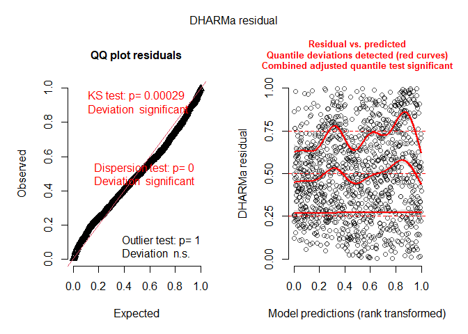
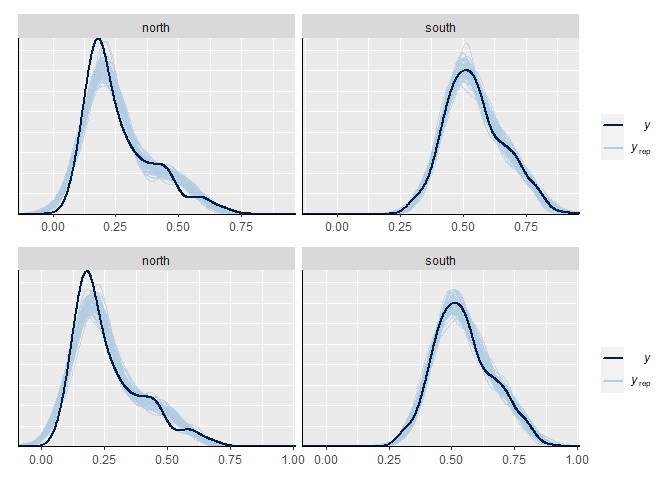

Persistence of seed mixture species: <br> Analysis of Bauer et
al. (unpublished) Field experiment
================
Markus Bauer <br>
2022-11-14

# Preparation

#### Packages

``` r
library(here)
library(tidyverse)
library(ggbeeswarm)
library(patchwork)
library(brms)
library(DHARMa)
library(bayesplot)
library(loo)
library(tidybayes)
library(emmeans)
```

#### Load data

``` r
sites <- read_csv(
  here("data", "processed", "data_processed_sites_temporal.csv"),
  col_names = TRUE, na = c("na", "NA", ""), col_types =
    cols(
      .default = "?",
      plot = "f",
      site = "f",
      sand_ratio = "f",
      substrate_depth = "f",
      target_type = col_factor(levels = c(
        "dry_grassland", "hay_meadow"
      )),
      seed_density = "f",
      exposition = col_factor(levels = c(
        "north", "south"
      )),
      survey_year = "c"
    )
  ) %>%
  ### Exclude data of seed mixtures
  filter(survey_year != "seeded") %>%
  pivot_longer(cols = c(B, C), names_to = "index", values_to = "n",
               names_transform = as.factor) %>%
  filter(index == "B" & presabu == "presence") %>%
  mutate(
    survey_year_fct = factor(survey_year),
    id = factor(id)
  ) %>%
  select(
    id, plot, site, exposition, sand_ratio, substrate_depth, target_type,
    seed_density, survey_year_fct, survey_year, n
  )
```

# Statistics

## Data exploration

### Graphs of raw data

<!-- --><!-- --><!-- --><!-- --><!-- -->

### Outliers, zero-inflation, transformations?

``` r
sites %>% group_by(exposition) %>% count(site)
```

    ## # A tibble: 12 × 3
    ## # Groups:   exposition [2]
    ##    exposition site      n
    ##    <fct>      <fct> <int>
    ##  1 north      1        96
    ##  2 north      2        96
    ##  3 north      3        96
    ##  4 north      4        96
    ##  5 north      5        96
    ##  6 north      6        96
    ##  7 south      1        96
    ##  8 south      2        96
    ##  9 south      3        96
    ## 10 south      4        96
    ## 11 south      5        96
    ## 12 south      6        96

``` r
boxplot(sites$n)
```

<!-- -->

``` r
ggplot(sites, aes(x = exposition, y = n)) + geom_quasirandom()
```

<!-- -->

``` r
ggplot(sites, aes(x = n)) + geom_histogram(binwidth = 0.03)
```

<!-- -->

``` r
ggplot(sites, aes(x = n)) + geom_density()
```

<!-- -->

## Model building

### Models

Specifications for the models

``` r
iter = 10000
chains = 4
thin = 2
priors <- c(
  set_prior("normal(0, 1)", class = "b"),
  set_prior("normal(-0.025, 1)", class = "b", coef = "sand_ratio25"),
  set_prior("normal(-0.050, 1)", class = "b", coef = "sand_ratio50"),
  set_prior("normal(0.050, 1)", class = "b", coef = "expositionsouth"),
  set_prior("normal(-0.025, 1)", class = "b", coef = "survey_year_fct2019"),
  set_prior("normal(-0.050, 1)", class = "b", coef = "survey_year_fct2020"),
  set_prior("normal(-0.075, 1)", class = "b", coef = "survey_year_fct2021"),
  set_prior("cauchy(0, 1)", class = "sigma")
)
```

Model caluclations

``` r
load(file = here("data", "processed", "model_persistence_1.Rdata"))
```

    ## Registered S3 methods overwritten by 'adegraphics':
    ##   method         from
    ##   biplot.dudi    ade4
    ##   kplot.foucart  ade4
    ##   kplot.mcoa     ade4
    ##   kplot.mfa      ade4
    ##   kplot.pta      ade4
    ##   kplot.sepan    ade4
    ##   kplot.statis   ade4
    ##   scatter.coa    ade4
    ##   scatter.dudi   ade4
    ##   scatter.nipals ade4
    ##   scatter.pco    ade4
    ##   score.acm      ade4
    ##   score.mix      ade4
    ##   score.pca      ade4
    ##   screeplot.dudi ade4

``` r
load(file = here("data", "processed", "model_persistence_2.Rdata"))
load(file = here("data", "processed", "model_persistence_3.Rdata"))
```

### Model comparison

``` r
m_1 <- m1
m_2 <- m3
m_1$formula
```

    ## n ~ (target_type + exposition + sand_ratio + survey_year_fct)^4 + substrate_depth + seed_density + (1 | site/plot)

``` r
m_2$formula
```

    ## n ~ (target_type + exposition + sand_ratio + survey_year_fct)^2 + substrate_depth + seed_density + substrate_depth:sand_ratio + seed_density:exposition + target_type:exposition:survey_year_fct + sand_ratio:exposition:survey_year_fct + seed_density:exposition:survey_year_fct + (1 | site/plot)

Conditional R² values

``` r
bayes_R2(m_1, probs = c(0.05, 0.5, 0.95),
         re_formula =  ~ (1 | site/plot) + (1 | botanist_year)) 
```

    ##     Estimate   Est.Error        Q5       Q50       Q95
    ## R2 0.8825997 0.003751403 0.8761437 0.8827464 0.8883576

``` r
bayes_R2(m_2, probs = c(0.05, 0.5, 0.95),
         re_formula =  ~ (1 | site/plot) + (1 | botanist_year))
```

    ##    Estimate   Est.Error        Q5       Q50       Q95
    ## R2 0.883216 0.003685545 0.8769896 0.8834158 0.8890752

Marginal R² values

``` r
bayes_R2(m_1, probs = c(0.05, 0.5, 0.95),
         re_formula = 1 ~ 1)
```

    ##     Estimate  Est.Error        Q5     Q50       Q95
    ## R2 0.8489146 0.00379379 0.8423528 0.84909 0.8547896

``` r
bayes_R2(m_2, probs = c(0.05, 0.5, 0.95),
         re_formula = 1 ~ 1)
```

    ##     Estimate   Est.Error        Q5       Q50       Q95
    ## R2 0.8482906 0.003830003 0.8416359 0.8485516 0.8541337

### Model check

#### DHARMa

``` r
createDHARMa(
  simulatedResponse = t(posterior_predict(m_1)),
  observedResponse = sites$n,
  fittedPredictedResponse = apply(t(posterior_epred(m_1)), 1, mean),
  integerResponse = TRUE
  ) %>%
  plot()
```

<!-- -->

``` r
createDHARMa(
  simulatedResponse = t(posterior_predict(m_2)),
  observedResponse = sites$n,
  fittedPredictedResponse = apply(t(posterior_epred(m_2)), 1, mean),
  integerResponse = TRUE
  ) %>%
  plot()
```

<!-- -->

#### Preparation

``` r
posterior1 <- m_1 %>%
  posterior::as_draws() %>%
  posterior::subset_draws(
    variable = c(
      "b_sand_ratio25",
      "b_sand_ratio50",
      "b_substrate_depth30",
      "b_target_typehay_meadow",
      "b_seed_density8",
      "b_expositionsouth",
      "b_survey_year_fct2019",
      "b_survey_year_fct2020",
      "b_survey_year_fct2021",
      "sd_site__Intercept",
      "sd_site:plot__Intercept",
      "sigma"
    )
  )
posterior2 <- m_2 %>%
  posterior::as_draws() %>%
  posterior::subset_draws(
    variable = c(
      "b_sand_ratio25",
      "b_sand_ratio50",
      "b_substrate_depth30",
      "b_target_typehay_meadow",
      "b_seed_density8",
      "b_expositionsouth",
      "b_survey_year_fct2019",
      "b_survey_year_fct2020",
      "b_survey_year_fct2021",
      "sd_site__Intercept",
      "sd_site:plot__Intercept",
      "sigma"
    )
  )
hmc_diagnostics1 <- nuts_params(m_1)
hmc_diagnostics2 <- nuts_params(m_2)
y <- sites$n
yrep1 <- posterior_predict(m_1, draws = 500)
yrep2 <- posterior_predict(m_2, draws = 500)
loo1 <- loo(m_1, save_psis = TRUE, moment_match = FALSE)
loo2 <- loo(m_2, save_psis = TRUE, moment_match = FALSE)
draws1 <- m_1 %>%
  posterior::as_draws() %>%
  posterior::summarize_draws() %>%
  filter(str_starts(variable, "b_"))
draws2 <- m_2 %>%
  posterior::as_draws() %>%
  posterior::summarize_draws() %>%
  filter(str_starts(variable, "b_"))
```

#### Samling efficency/effectiveness (Rhat and EFF)

``` r
range(draws1$rhat)
```

    ## [1] 0.9998276 1.0011925

``` r
range(draws2$rhat)
```

    ## [1] 0.9998186 1.0008194

``` r
range(draws1$ess_bulk)
```

    ## [1] 3109.188 9982.809

``` r
range(draws2$ess_bulk)
```

    ## [1] 3417.468 7655.059

``` r
range(draws1$ess_tail)
```

    ## [1] 5804.914 9220.671

``` r
range(draws2$ess_tail)
```

    ## [1] 5834.043 8977.647

#### MCMC diagnostics

``` r
mcmc_trace(posterior1, np = hmc_diagnostics1)
```

    ## No divergences to plot.

<!-- -->

``` r
mcmc_trace(posterior2, np = hmc_diagnostics2)
```

<!-- -->

#### Posterior predictive check

##### Kernel density

``` r
p1 <- ppc_dens_overlay(y, yrep1[1:50, ])
p2 <- ppc_dens_overlay(y, yrep2[1:50, ])
p1 / p2
```

<!-- -->

``` r
ppc_dens_overlay_grouped(y, yrep1[1:50, ], group = sites$site)
```

<!-- -->

``` r
ppc_dens_overlay_grouped(y, yrep2[1:50, ], group = sites$site)
```

<!-- -->

``` r
p1 <- ppc_dens_overlay_grouped(y, yrep1[1:50, ], group = sites$exposition)
p2 <- ppc_dens_overlay_grouped(y, yrep2[1:50, ], group = sites$exposition)
p1 / p2
```

<!-- -->

``` r
ppc_dens_overlay_grouped(y, yrep1[1:50, ], group = sites$survey_year_fct)
```

<!-- -->

``` r
ppc_dens_overlay_grouped(y, yrep2[1:50, ], group = sites$survey_year_fct)
```

<!-- -->

``` r
p1 <- ppc_dens_overlay_grouped(y, yrep1[1:50, ], group = sites$target_type)
p2 <- ppc_dens_overlay_grouped(y, yrep2[1:50, ], group = sites$target_type)
p1 / p2
```

<!-- -->

``` r
p1 <- ppc_dens_overlay_grouped(y, yrep1[1:50, ], group = sites$seed_density)
p2 <- ppc_dens_overlay_grouped(y, yrep2[1:50, ], group = sites$seed_density)
p1 / p2
```

<!-- -->

``` r
p1 <- ppc_dens_overlay_grouped(y, yrep1[1:50, ], group = sites$sand_ratio)
p2 <- ppc_dens_overlay_grouped(y, yrep2[1:50, ], group = sites$sand_ratio)
p1 / p2
```

<!-- -->

``` r
p1 <- ppc_dens_overlay_grouped(y, yrep1[1:50, ], group = sites$substrate_depth)
p2 <- ppc_dens_overlay_grouped(y, yrep2[1:50, ], group = sites$substrate_depth)
p1 / p2
```

<!-- -->

##### Histograms of statistics skew

``` r
p1 <- ppc_stat(y, yrep1, binwidth = 0.001)
p2 <- ppc_stat(y, yrep2, binwidth = 0.001)
p1 / p2
```

<!-- -->

``` r
ppc_stat_grouped(y, yrep1, group = sites$site, binwidth = 0.001)
```

<!-- -->

``` r
ppc_stat_grouped(y, yrep2, group = sites$site, binwidth = 0.001)
```

<!-- -->

``` r
p1 <- ppc_stat_grouped(y, yrep1, group = sites$exposition, binwidth = 0.001)
p2 <- ppc_stat_grouped(y, yrep2, group = sites$exposition, binwidth = 0.001)
p1 / p2
```

<!-- -->

``` r
ppc_stat_grouped(y, yrep1, group = sites$survey_year_fct, binwidth = 0.001)
```

<!-- -->

``` r
ppc_stat_grouped(y, yrep2, group = sites$survey_year_fct, binwidth = 0.001)
```

<!-- -->

``` r
p1 <- ppc_stat_grouped(y, yrep1, group = sites$target_type, binwidth = 0.001)
p2 <- ppc_stat_grouped(y, yrep2, group = sites$target_type, binwidth = 0.001)
p1 / p2
```

<!-- -->

``` r
p1 <- ppc_stat_grouped(y, yrep1, group = sites$seed_density, binwidth = 0.001)
p2 <- ppc_stat_grouped(y, yrep2, group = sites$seed_density, binwidth = 0.001)
p1 / p2
```

<!-- -->

``` r
p1 <- ppc_stat_grouped(y, yrep1, group = sites$sand_ratio, binwidth = 0.001)
p2 <- ppc_stat_grouped(y, yrep2, group = sites$sand_ratio, binwidth = 0.001)
p1 / p2
```

<!-- -->

``` r
p1 <- ppc_stat_grouped(y, yrep1, group = sites$substrate_depth, binwidth = 0.001)
p2 <- ppc_stat_grouped(y, yrep2, group = sites$substrate_depth, binwidth = 0.001)
p1 / p2
```

<!-- -->

##### LOO-PIT plots

``` r
p1 <- ppc_loo_pit_overlay(y, yrep1, lw = weights(loo1$psis_object))
```

    ## NOTE: The kernel density estimate assumes continuous observations and is not optimal for discrete observations.

``` r
p2 <- ppc_loo_pit_overlay(y, yrep2, lw = weights(loo2$psis_object))
```

    ## NOTE: The kernel density estimate assumes continuous observations and is not optimal for discrete observations.

``` r
p1 / p2
```

<!-- -->

``` r
plot(loo1)
```

<!-- -->

``` r
plot(loo2)
```

<!-- -->

#### Autocorrelation check

``` r
mcmc_acf(posterior1, lags = 10)
```

<!-- -->

``` r
mcmc_acf(posterior2, lags = 10)
```

<!-- -->

## Output of choosen model

### Model output

Priors and conditional and marignal R²

``` r
prior_summary(m_1, all = FALSE)
```

    ##                   prior     class                coef group resp dpar nlpar lb
    ##            normal(0, 1)         b                                             
    ##        normal(0.050, 1)         b     expositionsouth                         
    ##       normal(-0.025, 1)         b        sand_ratio25                         
    ##       normal(-0.050, 1)         b        sand_ratio50                         
    ##       normal(-0.025, 1)         b survey_year_fct2019                         
    ##       normal(-0.050, 1)         b survey_year_fct2020                         
    ##       normal(-0.075, 1)         b survey_year_fct2021                         
    ##  student_t(3, 0.4, 2.5) Intercept                                             
    ##    student_t(3, 0, 2.5)        sd                                            0
    ##            cauchy(0, 1)     sigma                                            0
    ##  ub  source
    ##        user
    ##        user
    ##        user
    ##        user
    ##        user
    ##        user
    ##        user
    ##     default
    ##     default
    ##        user

``` r
bayes_R2(m_1, probs = c(0.05, 0.5, 0.95),
         re_formula =  ~ (1 | site/plot) + (1 | botanist_year)) 
```

    ##     Estimate   Est.Error        Q5       Q50       Q95
    ## R2 0.8825997 0.003751403 0.8761437 0.8827464 0.8883576

``` r
bayes_R2(m_1, probs = c(0.05, 0.5, 0.95),
         re_formula = 1 ~ 1)
```

    ##     Estimate  Est.Error        Q5     Q50       Q95
    ## R2 0.8489146 0.00379379 0.8423528 0.84909 0.8547896

Posteriors

``` r
draws1
```

    ## # A tibble: 50 × 10
    ##    variable        mean   median      sd     mad       q5      q95  rhat ess_b…¹
    ##    <chr>          <dbl>    <dbl>   <dbl>   <dbl>    <dbl>    <dbl> <dbl>   <dbl>
    ##  1 b_Intercept  0.525    0.525   0.0182  0.0179   0.495    0.554    1.00   4259.
    ##  2 b_target_t…  0.0134   0.0135  0.0208  0.0209  -0.0206   0.0475   1.00   3120.
    ##  3 b_expositi…  0.157    0.157   0.0211  0.0214   0.122    0.191    1.00   3203.
    ##  4 b_sand_rat… -0.0809  -0.0806  0.0209  0.0207  -0.116   -0.0470   1.00   3764.
    ##  5 b_sand_rat… -0.0769  -0.0769  0.0209  0.0210  -0.111   -0.0425   1.00   4135.
    ##  6 b_survey_y… -0.285   -0.285   0.0188  0.0187  -0.315   -0.254    1.00   3931.
    ##  7 b_survey_y… -0.319   -0.319   0.0188  0.0190  -0.350   -0.287    1.00   3982.
    ##  8 b_survey_y… -0.279   -0.279   0.0187  0.0185  -0.310   -0.248    1.00   3735.
    ##  9 b_substrat…  0.00380  0.00381 0.00548 0.00545 -0.00517  0.0129   1.00   9776.
    ## 10 b_seed_den… -0.00730 -0.00728 0.00541 0.00535 -0.0162   0.00154  1.00   9983.
    ## # … with 40 more rows, 1 more variable: ess_tail <dbl>, and abbreviated
    ## #   variable name ¹​ess_bulk

``` r
mcmc_intervals(
  posterior1,
  prob = 0.66,
  prob_outer = 0.95,
  point_est = "mean"
)
```

<!-- -->

``` r
mcmc_intervals(
  posterior2,
  prob = 0.66,
  prob_outer = 0.95,
  point_est = "mean"
)
```

<!-- -->

### Effect sizes

``` r
(emm <- emmeans(m_1, revpairwise ~ target_type + sand_ratio |
                  exposition | survey_year_fct, type = "response"))
```

    ## $emmeans
    ## exposition = north, survey_year_fct = 2018:
    ##  target_type   sand_ratio emmean lower.HPD upper.HPD
    ##  dry_grassland 0           0.523     0.489     0.559
    ##  hay_meadow    0           0.537     0.500     0.571
    ##  dry_grassland 25          0.442     0.406     0.477
    ##  hay_meadow    25          0.366     0.332     0.402
    ##  dry_grassland 50          0.446     0.411     0.481
    ##  hay_meadow    50          0.407     0.372     0.442
    ## 
    ## exposition = south, survey_year_fct = 2018:
    ##  target_type   sand_ratio emmean lower.HPD upper.HPD
    ##  dry_grassland 0           0.680     0.644     0.714
    ##  hay_meadow    0           0.697     0.661     0.731
    ##  dry_grassland 25          0.638     0.604     0.672
    ##  hay_meadow    25          0.700     0.666     0.735
    ##  dry_grassland 50          0.689     0.654     0.724
    ##  hay_meadow    50          0.730     0.693     0.763
    ## 
    ## exposition = north, survey_year_fct = 2019:
    ##  target_type   sand_ratio emmean lower.HPD upper.HPD
    ##  dry_grassland 0           0.239     0.202     0.273
    ##  hay_meadow    0           0.192     0.157     0.226
    ##  dry_grassland 25          0.245     0.210     0.280
    ##  hay_meadow    25          0.164     0.128     0.198
    ##  dry_grassland 50          0.239     0.204     0.274
    ##  hay_meadow    50          0.213     0.177     0.247
    ## 
    ## exposition = south, survey_year_fct = 2019:
    ##  target_type   sand_ratio emmean lower.HPD upper.HPD
    ##  dry_grassland 0           0.550     0.516     0.587
    ##  hay_meadow    0           0.528     0.493     0.563
    ##  dry_grassland 25          0.529     0.494     0.564
    ##  hay_meadow    25          0.518     0.484     0.554
    ##  dry_grassland 50          0.560     0.525     0.596
    ##  hay_meadow    50          0.558     0.523     0.594
    ## 
    ## exposition = north, survey_year_fct = 2020:
    ##  target_type   sand_ratio emmean lower.HPD upper.HPD
    ##  dry_grassland 0           0.204     0.170     0.240
    ##  hay_meadow    0           0.172     0.136     0.206
    ##  dry_grassland 25          0.195     0.160     0.230
    ##  hay_meadow    25          0.150     0.115     0.185
    ##  dry_grassland 50          0.200     0.165     0.235
    ##  hay_meadow    50          0.160     0.124     0.193
    ## 
    ## exposition = south, survey_year_fct = 2020:
    ##  target_type   sand_ratio emmean lower.HPD upper.HPD
    ##  dry_grassland 0           0.481     0.445     0.515
    ##  hay_meadow    0           0.484     0.449     0.519
    ##  dry_grassland 25          0.452     0.416     0.486
    ##  hay_meadow    25          0.457     0.420     0.491
    ##  dry_grassland 50          0.446     0.409     0.479
    ##  hay_meadow    50          0.499     0.464     0.535
    ## 
    ## exposition = north, survey_year_fct = 2021:
    ##  target_type   sand_ratio emmean lower.HPD upper.HPD
    ##  dry_grassland 0           0.244     0.211     0.282
    ##  hay_meadow    0           0.228     0.191     0.262
    ##  dry_grassland 25          0.215     0.178     0.248
    ##  hay_meadow    25          0.181     0.147     0.217
    ##  dry_grassland 50          0.193     0.158     0.229
    ##  hay_meadow    50          0.180     0.146     0.217
    ## 
    ## exposition = south, survey_year_fct = 2021:
    ##  target_type   sand_ratio emmean lower.HPD upper.HPD
    ##  dry_grassland 0           0.505     0.471     0.542
    ##  hay_meadow    0           0.473     0.439     0.510
    ##  dry_grassland 25          0.492     0.457     0.527
    ##  hay_meadow    25          0.515     0.480     0.549
    ##  dry_grassland 50          0.482     0.447     0.517
    ##  hay_meadow    50          0.488     0.453     0.523
    ## 
    ## Results are averaged over the levels of: substrate_depth, seed_density 
    ## Point estimate displayed: median 
    ## HPD interval probability: 0.95 
    ## 
    ## $contrasts
    ## exposition = north, survey_year_fct = 2018:
    ##  contrast                                                 estimate lower.HPD
    ##  hay_meadow sand_ratio0 - dry_grassland sand_ratio0       0.013452 -0.026956
    ##  dry_grassland sand_ratio25 - dry_grassland sand_ratio0  -0.080603 -0.123567
    ##  dry_grassland sand_ratio25 - hay_meadow sand_ratio0     -0.094230 -0.135414
    ##  hay_meadow sand_ratio25 - dry_grassland sand_ratio0     -0.156862 -0.196092
    ##  hay_meadow sand_ratio25 - hay_meadow sand_ratio0        -0.170348 -0.211392
    ##  hay_meadow sand_ratio25 - dry_grassland sand_ratio25    -0.075894 -0.115883
    ##  dry_grassland sand_ratio50 - dry_grassland sand_ratio0  -0.076908 -0.118993
    ##  dry_grassland sand_ratio50 - hay_meadow sand_ratio0     -0.090293 -0.131464
    ##  dry_grassland sand_ratio50 - dry_grassland sand_ratio25  0.003969 -0.036656
    ##  dry_grassland sand_ratio50 - hay_meadow sand_ratio25     0.079672  0.039112
    ##  hay_meadow sand_ratio50 - dry_grassland sand_ratio0     -0.116441 -0.157932
    ##  hay_meadow sand_ratio50 - hay_meadow sand_ratio0        -0.129710 -0.169415
    ##  hay_meadow sand_ratio50 - dry_grassland sand_ratio25    -0.035582 -0.077558
    ##  hay_meadow sand_ratio50 - hay_meadow sand_ratio25        0.040381 -0.001596
    ##  hay_meadow sand_ratio50 - dry_grassland sand_ratio50    -0.039481 -0.079800
    ##  upper.HPD
    ##   0.053633
    ##  -0.041448
    ##  -0.054268
    ##  -0.114927
    ##  -0.128833
    ##  -0.033917
    ##  -0.036914
    ##  -0.049594
    ##   0.046025
    ##   0.120822
    ##  -0.075962
    ##  -0.087863
    ##   0.003414
    ##   0.080825
    ##   0.001450
    ## 
    ## exposition = south, survey_year_fct = 2018:
    ##  contrast                                                 estimate lower.HPD
    ##  hay_meadow sand_ratio0 - dry_grassland sand_ratio0       0.017293 -0.022803
    ##  dry_grassland sand_ratio25 - dry_grassland sand_ratio0  -0.041377 -0.082408
    ##  dry_grassland sand_ratio25 - hay_meadow sand_ratio0     -0.058769 -0.098434
    ##  hay_meadow sand_ratio25 - dry_grassland sand_ratio0      0.020966 -0.021190
    ##  hay_meadow sand_ratio25 - hay_meadow sand_ratio0         0.003361 -0.037058
    ##  hay_meadow sand_ratio25 - dry_grassland sand_ratio25     0.062311  0.021326
    ##  dry_grassland sand_ratio50 - dry_grassland sand_ratio0   0.009615 -0.031796
    ##  dry_grassland sand_ratio50 - hay_meadow sand_ratio0     -0.007640 -0.045992
    ##  dry_grassland sand_ratio50 - dry_grassland sand_ratio25  0.050966  0.010561
    ##  dry_grassland sand_ratio50 - hay_meadow sand_ratio25    -0.011243 -0.050494
    ##  hay_meadow sand_ratio50 - dry_grassland sand_ratio0      0.049905  0.010118
    ##  hay_meadow sand_ratio50 - hay_meadow sand_ratio0         0.032507 -0.007503
    ##  hay_meadow sand_ratio50 - dry_grassland sand_ratio25     0.091383  0.049130
    ##  hay_meadow sand_ratio50 - hay_meadow sand_ratio25        0.029306 -0.012019
    ##  hay_meadow sand_ratio50 - dry_grassland sand_ratio50     0.039851 -0.000123
    ##  upper.HPD
    ##   0.058588
    ##  -0.000678
    ##  -0.017343
    ##   0.060997
    ##   0.045987
    ##   0.103251
    ##   0.050483
    ##   0.036685
    ##   0.092432
    ##   0.031833
    ##   0.092640
    ##   0.074004
    ##   0.131659
    ##   0.069590
    ##   0.081971
    ## 
    ## exposition = north, survey_year_fct = 2019:
    ##  contrast                                                 estimate lower.HPD
    ##  hay_meadow sand_ratio0 - dry_grassland sand_ratio0      -0.046467 -0.089604
    ##  dry_grassland sand_ratio25 - dry_grassland sand_ratio0   0.006338 -0.033780
    ##  dry_grassland sand_ratio25 - hay_meadow sand_ratio0      0.052881  0.010007
    ##  hay_meadow sand_ratio25 - dry_grassland sand_ratio0     -0.074845 -0.116697
    ##  hay_meadow sand_ratio25 - hay_meadow sand_ratio0        -0.028000 -0.069425
    ##  hay_meadow sand_ratio25 - dry_grassland sand_ratio25    -0.080804 -0.121224
    ##  dry_grassland sand_ratio50 - dry_grassland sand_ratio0   0.000716 -0.040888
    ##  dry_grassland sand_ratio50 - hay_meadow sand_ratio0      0.047166  0.006645
    ##  dry_grassland sand_ratio50 - dry_grassland sand_ratio25 -0.005542 -0.045891
    ##  dry_grassland sand_ratio50 - hay_meadow sand_ratio25     0.075388  0.034706
    ##  hay_meadow sand_ratio50 - dry_grassland sand_ratio0     -0.025308 -0.066503
    ##  hay_meadow sand_ratio50 - hay_meadow sand_ratio0         0.021009 -0.020209
    ##  hay_meadow sand_ratio50 - dry_grassland sand_ratio25    -0.031824 -0.071818
    ##  hay_meadow sand_ratio50 - hay_meadow sand_ratio25        0.049164  0.009946
    ##  hay_meadow sand_ratio50 - dry_grassland sand_ratio50    -0.026424 -0.065858
    ##  upper.HPD
    ##  -0.004576
    ##   0.048264
    ##   0.093649
    ##  -0.033554
    ##   0.013661
    ##  -0.039556
    ##   0.043493
    ##   0.089494
    ##   0.035281
    ##   0.117683
    ##   0.017274
    ##   0.061886
    ##   0.009558
    ##   0.091624
    ##   0.017253
    ## 
    ## exposition = south, survey_year_fct = 2019:
    ##  contrast                                                 estimate lower.HPD
    ##  hay_meadow sand_ratio0 - dry_grassland sand_ratio0      -0.021599 -0.064879
    ##  dry_grassland sand_ratio25 - dry_grassland sand_ratio0  -0.021403 -0.063136
    ##  dry_grassland sand_ratio25 - hay_meadow sand_ratio0      0.000795 -0.037657
    ##  hay_meadow sand_ratio25 - dry_grassland sand_ratio0     -0.032102 -0.072852
    ##  hay_meadow sand_ratio25 - hay_meadow sand_ratio0        -0.010477 -0.051428
    ##  hay_meadow sand_ratio25 - dry_grassland sand_ratio25    -0.011158 -0.053309
    ##  dry_grassland sand_ratio50 - dry_grassland sand_ratio0   0.009921 -0.032285
    ##  dry_grassland sand_ratio50 - hay_meadow sand_ratio0      0.031301 -0.008662
    ##  dry_grassland sand_ratio50 - dry_grassland sand_ratio25  0.030598 -0.012259
    ##  dry_grassland sand_ratio50 - hay_meadow sand_ratio25     0.042018  0.000349
    ##  hay_meadow sand_ratio50 - dry_grassland sand_ratio0      0.007566 -0.035175
    ##  hay_meadow sand_ratio50 - hay_meadow sand_ratio0         0.029495 -0.012895
    ##  hay_meadow sand_ratio50 - dry_grassland sand_ratio25     0.028602 -0.011774
    ##  hay_meadow sand_ratio50 - hay_meadow sand_ratio25        0.039546 -0.001438
    ##  hay_meadow sand_ratio50 - dry_grassland sand_ratio50    -0.002016 -0.044678
    ##  upper.HPD
    ##   0.018300
    ##   0.019875
    ##   0.044884
    ##   0.010698
    ##   0.031138
    ##   0.029523
    ##   0.050491
    ##   0.074919
    ##   0.071301
    ##   0.083074
    ##   0.047379
    ##   0.069888
    ##   0.072919
    ##   0.081216
    ##   0.038712
    ## 
    ## exposition = north, survey_year_fct = 2020:
    ##  contrast                                                 estimate lower.HPD
    ##  hay_meadow sand_ratio0 - dry_grassland sand_ratio0      -0.032955 -0.074509
    ##  dry_grassland sand_ratio25 - dry_grassland sand_ratio0  -0.009881 -0.051283
    ##  dry_grassland sand_ratio25 - hay_meadow sand_ratio0      0.023000 -0.020796
    ##  hay_meadow sand_ratio25 - dry_grassland sand_ratio0     -0.054844 -0.093523
    ##  hay_meadow sand_ratio25 - hay_meadow sand_ratio0        -0.021760 -0.064442
    ##  hay_meadow sand_ratio25 - dry_grassland sand_ratio25    -0.045006 -0.086502
    ##  dry_grassland sand_ratio50 - dry_grassland sand_ratio0  -0.004310 -0.047437
    ##  dry_grassland sand_ratio50 - hay_meadow sand_ratio0      0.028816 -0.014917
    ##  dry_grassland sand_ratio50 - dry_grassland sand_ratio25  0.005503 -0.035516
    ##  dry_grassland sand_ratio50 - hay_meadow sand_ratio25     0.050531  0.009043
    ##  hay_meadow sand_ratio50 - dry_grassland sand_ratio0     -0.044519 -0.089126
    ##  hay_meadow sand_ratio50 - hay_meadow sand_ratio0        -0.011824 -0.052992
    ##  hay_meadow sand_ratio50 - dry_grassland sand_ratio25    -0.034936 -0.074472
    ##  hay_meadow sand_ratio50 - hay_meadow sand_ratio25        0.009939 -0.030269
    ##  hay_meadow sand_ratio50 - dry_grassland sand_ratio50    -0.040171 -0.080567
    ##  upper.HPD
    ##   0.008732
    ##   0.031641
    ##   0.061469
    ##  -0.010721
    ##   0.019304
    ##  -0.004524
    ##   0.035847
    ##   0.067637
    ##   0.046700
    ##   0.091371
    ##  -0.006948
    ##   0.028770
    ##   0.008244
    ##   0.050787
    ##   0.000786
    ## 
    ## exposition = south, survey_year_fct = 2020:
    ##  contrast                                                 estimate lower.HPD
    ##  hay_meadow sand_ratio0 - dry_grassland sand_ratio0       0.003652 -0.038162
    ##  dry_grassland sand_ratio25 - dry_grassland sand_ratio0  -0.028325 -0.069421
    ##  dry_grassland sand_ratio25 - hay_meadow sand_ratio0     -0.032002 -0.071498
    ##  hay_meadow sand_ratio25 - dry_grassland sand_ratio0     -0.023751 -0.065966
    ##  hay_meadow sand_ratio25 - hay_meadow sand_ratio0        -0.027315 -0.071250
    ##  hay_meadow sand_ratio25 - dry_grassland sand_ratio25     0.004454 -0.034876
    ##  dry_grassland sand_ratio50 - dry_grassland sand_ratio0  -0.035323 -0.074559
    ##  dry_grassland sand_ratio50 - hay_meadow sand_ratio0     -0.038406 -0.077964
    ##  dry_grassland sand_ratio50 - dry_grassland sand_ratio25 -0.006796 -0.047430
    ##  dry_grassland sand_ratio50 - hay_meadow sand_ratio25    -0.011209 -0.052923
    ##  hay_meadow sand_ratio50 - dry_grassland sand_ratio0      0.018101 -0.024363
    ##  hay_meadow sand_ratio50 - hay_meadow sand_ratio0         0.014877 -0.026409
    ##  hay_meadow sand_ratio50 - dry_grassland sand_ratio25     0.046528  0.006368
    ##  hay_meadow sand_ratio50 - hay_meadow sand_ratio25        0.042051  0.002921
    ##  hay_meadow sand_ratio50 - dry_grassland sand_ratio50     0.053212  0.011302
    ##  upper.HPD
    ##   0.044474
    ##   0.012902
    ##   0.010402
    ##   0.016726
    ##   0.012473
    ##   0.046716
    ##   0.007734
    ##   0.003937
    ##   0.035004
    ##   0.030781
    ##   0.058438
    ##   0.056326
    ##   0.087538
    ##   0.085129
    ##   0.093602
    ## 
    ## exposition = north, survey_year_fct = 2021:
    ##  contrast                                                 estimate lower.HPD
    ##  hay_meadow sand_ratio0 - dry_grassland sand_ratio0      -0.016465 -0.057252
    ##  dry_grassland sand_ratio25 - dry_grassland sand_ratio0  -0.029429 -0.069892
    ##  dry_grassland sand_ratio25 - hay_meadow sand_ratio0     -0.012775 -0.053093
    ##  hay_meadow sand_ratio25 - dry_grassland sand_ratio0     -0.063149 -0.104515
    ##  hay_meadow sand_ratio25 - hay_meadow sand_ratio0        -0.046456 -0.086917
    ##  hay_meadow sand_ratio25 - dry_grassland sand_ratio25    -0.033855 -0.075367
    ##  dry_grassland sand_ratio50 - dry_grassland sand_ratio0  -0.051359 -0.094730
    ##  dry_grassland sand_ratio50 - hay_meadow sand_ratio0     -0.034786 -0.078545
    ##  dry_grassland sand_ratio50 - dry_grassland sand_ratio25 -0.022227 -0.064689
    ##  dry_grassland sand_ratio50 - hay_meadow sand_ratio25     0.011462 -0.029488
    ##  hay_meadow sand_ratio50 - dry_grassland sand_ratio0     -0.065095 -0.104412
    ##  hay_meadow sand_ratio50 - hay_meadow sand_ratio0        -0.048328 -0.089383
    ##  hay_meadow sand_ratio50 - dry_grassland sand_ratio25    -0.035446 -0.078180
    ##  hay_meadow sand_ratio50 - hay_meadow sand_ratio25       -0.001862 -0.042724
    ##  hay_meadow sand_ratio50 - dry_grassland sand_ratio50    -0.013382 -0.055270
    ##  upper.HPD
    ##   0.025007
    ##   0.011811
    ##   0.028823
    ##  -0.022140
    ##  -0.004818
    ##   0.007288
    ##  -0.011641
    ##   0.004644
    ##   0.018811
    ##   0.052553
    ##  -0.021005
    ##  -0.006932
    ##   0.003966
    ##   0.039793
    ##   0.027661
    ## 
    ## exposition = south, survey_year_fct = 2021:
    ##  contrast                                                 estimate lower.HPD
    ##  hay_meadow sand_ratio0 - dry_grassland sand_ratio0      -0.032035 -0.073959
    ##  dry_grassland sand_ratio25 - dry_grassland sand_ratio0  -0.012611 -0.052792
    ##  dry_grassland sand_ratio25 - hay_meadow sand_ratio0      0.019416 -0.023499
    ##  hay_meadow sand_ratio25 - dry_grassland sand_ratio0      0.010012 -0.032233
    ##  hay_meadow sand_ratio25 - hay_meadow sand_ratio0         0.041647  0.001246
    ##  hay_meadow sand_ratio25 - dry_grassland sand_ratio25     0.022396 -0.017274
    ##  dry_grassland sand_ratio50 - dry_grassland sand_ratio0  -0.022644 -0.064964
    ##  dry_grassland sand_ratio50 - hay_meadow sand_ratio0      0.009143 -0.032016
    ##  dry_grassland sand_ratio50 - dry_grassland sand_ratio25 -0.010255 -0.051430
    ##  dry_grassland sand_ratio50 - hay_meadow sand_ratio25    -0.032629 -0.074426
    ##  hay_meadow sand_ratio50 - dry_grassland sand_ratio0     -0.016628 -0.055296
    ##  hay_meadow sand_ratio50 - hay_meadow sand_ratio0         0.015416 -0.026644
    ##  hay_meadow sand_ratio50 - dry_grassland sand_ratio25    -0.003911 -0.046450
    ##  hay_meadow sand_ratio50 - hay_meadow sand_ratio25       -0.026482 -0.067950
    ##  hay_meadow sand_ratio50 - dry_grassland sand_ratio50     0.006381 -0.034676
    ##  upper.HPD
    ##   0.008842
    ##   0.030839
    ##   0.059750
    ##   0.050596
    ##   0.084091
    ##   0.064916
    ##   0.018301
    ##   0.050255
    ##   0.030185
    ##   0.007443
    ##   0.028253
    ##   0.055167
    ##   0.036209
    ##   0.014373
    ##   0.047051
    ## 
    ## Results are averaged over the levels of: substrate_depth, seed_density 
    ## Point estimate displayed: median 
    ## HPD interval probability: 0.95
