Analysis of Bauer et al. (unpublished) Field experiment: <br>
Persistence
================
<b>Markus Bauer\*</b> <br>
<b>2022-12-06</b>

- <a href="#preparation" id="toc-preparation">Preparation</a>
- <a href="#statistics" id="toc-statistics">Statistics</a>
  - <a href="#data-exploration" id="toc-data-exploration">Data
    exploration</a>
    - <a href="#graphs-of-raw-data" id="toc-graphs-of-raw-data">Graphs of raw
      data</a>
    - <a href="#outliers-zero-inflation-transformations"
      id="toc-outliers-zero-inflation-transformations">Outliers,
      zero-inflation, transformations?</a>
  - <a href="#models" id="toc-models">Models</a>
    - <a href="#priors" id="toc-priors">Priors</a>
    - <a href="#r²" id="toc-r²"><i>R</i>²</a>
  - <a href="#model-check" id="toc-model-check">Model check</a>
    - <a href="#dharma" id="toc-dharma">DHARMa</a>
    - <a href="#preparation-1" id="toc-preparation-1">Preparation</a>
    - <a href="#sampling-efficency-and-effectiveness"
      id="toc-sampling-efficency-and-effectiveness">Sampling efficency and
      effectiveness</a>
    - <a href="#mcmc-diagnostics" id="toc-mcmc-diagnostics">MCMC
      diagnostics</a>
    - <a href="#posterior-predictive-check"
      id="toc-posterior-predictive-check">Posterior predictive check</a>
    - <a href="#autocorrelation-check"
      id="toc-autocorrelation-check">Autocorrelation check</a>
  - <a href="#output-of-choosen-model"
    id="toc-output-of-choosen-model">Output of choosen model</a>
    - <a href="#model-output" id="toc-model-output">Model output</a>
    - <a href="#effect-sizes" id="toc-effect-sizes">Effect sizes</a>
- <a href="#session-info" id="toc-session-info">Session info</a>

Technichal University of Munich, TUM School of Life Sciences, Chair of
Restoration Ecology, Emil-Ramann-Straße 6, 85354 Freising, Germany

\* Corresponding author: <markus1.bauer@tum.de> <br> ORCiD ID:
[0000-0001-5372-4174](https://orcid.org/0000-0001-5372-4174) <br>
[Google
Scholar](https://scholar.google.de/citations?user=oHhmOkkAAAAJ&hl=de&oi=ao)
<br> GitHub: [markus1bauer](https://github.com/markus1bauer)

Persistence sensu Wilsey (2021) Restor Ecol [DOI:
10.1111/rec.13132](https://doi.org/10.1111/rec.13132)

# Preparation

#### Packages

``` r
library(here)
library(tidyverse)
library(ggbeeswarm)
library(patchwork)
library(brms)
library(DHARMa)
library(DHARMa.helpers)
library(bayesplot)
library(loo)
library(tidybayes)
library(emmeans)
```

#### Load data

``` r
sites <- read_csv(
  here("data", "processed", "data_processed_sites_nmds.csv"),
  col_names = TRUE, na = c("na", "NA", ""),
  col_types = cols(
    .default = "?",
    id = "f",
    plot = "f",
    site = "f",
    exposition = col_factor(levels = c("north", "south", "other")),
    sand_ratio = "f",
    substrate_depth = col_factor(levels = c("30", "15")),
    target_type = col_factor(levels = c(
      "hay_meadow", "dry_grassland", "other"
      )),
    seed_density = "f"
    )
  ) %>%
  filter(reference == "2018" | reference == "2019" | reference == "2020" |
           reference == "2021") %>%
  mutate(
    survey_year_fct = factor(survey_year),
    survey_year = as.numeric(survey_year),
    botanist_year = str_c(survey_year, botanist, exposition, sep = " "),
    botanist_year = factor(botanist_year),
    n = recovery_time
    )
```

# Statistics

## Data exploration

### Graphs of raw data

<!-- --><!-- --><!-- -->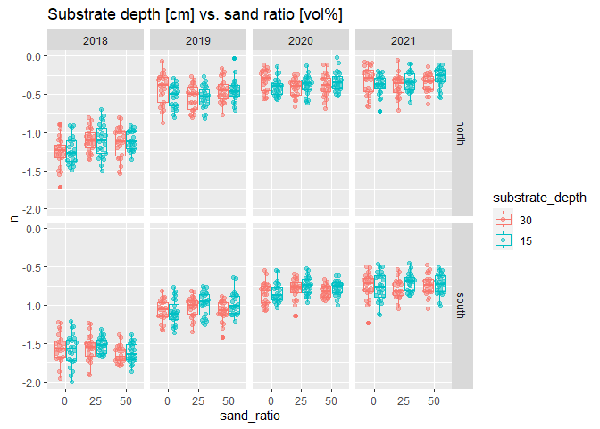<!-- --><!-- -->

### Outliers, zero-inflation, transformations?

    ## # A tibble: 12 × 3
    ## # Groups:   exposition [2]
    ##    exposition site      n
    ##    <fct>      <fct> <int>
    ##  1 north      1        96
    ##  2 north      2        96
    ##  3 north      3        96
    ##  4 north      4        96
    ##  5 north      5        96
    ##  6 north      6        96
    ##  7 south      1        96
    ##  8 south      2        96
    ##  9 south      3        96
    ## 10 south      4        96
    ## 11 south      5        96
    ## 12 south      6        96

<!-- --><!-- --><!-- --><!-- -->

## Models

``` r
load(file = here("outputs", "models", "model_recovery_full.Rdata"))
load(file = here("outputs", "models", "model_recovery_full_flat.Rdata"))
m_1 <- m_full
m_2 <- mfull_flat
```

``` r
m_1$formula
## n ~ sand_ratio * target_type * exposition * survey_year_fct + substrate_depth * seed_density + substrate_depth:exposition + seed_density:exposition + substrate_depth:survey_year_fct + seed_density:survey_year_fct + substrate_depth:exposition:survey_year_fct + seed_density:exposition:survey_year_fct + botanist_year + (1 | site/plot)
m_2$formula
## n ~ sand_ratio * target_type * exposition * survey_year_fct + substrate_depth * seed_density + substrate_depth:exposition + seed_density:exposition + substrate_depth:survey_year_fct + seed_density:survey_year_fct + substrate_depth:exposition:survey_year_fct + seed_density:exposition:survey_year_fct + botanist_year + (1 | site/plot)
```

``` r
m_1$family
## 
## Family: gaussian 
## Link function: identity
m_2$family
## 
## Family: gaussian 
## Link function: identity
```

### Priors

#### Possible prior distributions

``` r
get_prior(n ~ target_type + exposition + sand_ratio + survey_year_fct +
            seed_density + substrate_depth +
            (1 | site/plot),
          data = sites)
```

    ##                    prior     class                     coef     group resp dpar
    ##                   (flat)         b                                             
    ##                   (flat)         b          expositionsouth                    
    ##                   (flat)         b             sand_ratio25                    
    ##                   (flat)         b             sand_ratio50                    
    ##                   (flat)         b            seed_density8                    
    ##                   (flat)         b        substrate_depth15                    
    ##                   (flat)         b      survey_year_fct2019                    
    ##                   (flat)         b      survey_year_fct2020                    
    ##                   (flat)         b      survey_year_fct2021                    
    ##                   (flat)         b target_typedry_grassland                    
    ##  student_t(3, -0.8, 2.5) Intercept                                             
    ##     student_t(3, 0, 2.5)        sd                                             
    ##     student_t(3, 0, 2.5)        sd                               site          
    ##     student_t(3, 0, 2.5)        sd                Intercept      site          
    ##     student_t(3, 0, 2.5)        sd                          site:plot          
    ##     student_t(3, 0, 2.5)        sd                Intercept site:plot          
    ##     student_t(3, 0, 2.5)     sigma                                             
    ##  nlpar lb ub       source
    ##                   default
    ##              (vectorized)
    ##              (vectorized)
    ##              (vectorized)
    ##              (vectorized)
    ##              (vectorized)
    ##              (vectorized)
    ##              (vectorized)
    ##              (vectorized)
    ##              (vectorized)
    ##                   default
    ##         0         default
    ##         0    (vectorized)
    ##         0    (vectorized)
    ##         0    (vectorized)
    ##         0    (vectorized)
    ##         0         default

``` r
ggplot(data = data.frame(x = c(-2, 2)), aes(x = x)) +
  stat_function(fun = dnorm, n = 101, args = list(mean = 0, sd = 1)) +
  expand_limits(y = 0) + ggtitle("Normal distribution")
```

<!-- -->

``` r
ggplot(data = data.frame(x = c(-2, 2)), aes(x = x)) +
  stat_function(fun = dcauchy, n = 101, args = list(location = 0, scale = 1)) +
  expand_limits(y = 0) + ggtitle("Cauchy distribution")
```

<!-- -->

``` r
ggplot(data.frame(x = c(-2, 2)), aes(x = x)) +
  stat_function(fun = dstudent_t, args = list(df = 3, mu = 0, sigma = 2.5)) +
  expand_limits(y = 0) + ggtitle(expression(Student~italic(t)*"-distribution"))
```

<!-- -->

#### Prior summary

``` r
prior_summary(m_1, all = FALSE)
```

    ##                    prior     class                coef group resp dpar nlpar lb
    ##             normal(0, 1)         b                                             
    ##          normal(-0.1, 1)         b     expositionsouth                         
    ##           normal(0.1, 1)         b        sand_ratio25                         
    ##           normal(0.2, 1)         b        sand_ratio50                         
    ##           normal(0.1, 1)         b survey_year_fct2019                         
    ##           normal(0.2, 1)         b survey_year_fct2020                         
    ##           normal(0.3, 1)         b survey_year_fct2021                         
    ##  student_t(3, -0.8, 2.5) Intercept                                             
    ##     student_t(3, 0, 2.5)        sd                                            0
    ##             cauchy(0, 1)     sigma                                            0
    ##  ub  source
    ##        user
    ##        user
    ##        user
    ##        user
    ##        user
    ##        user
    ##        user
    ##     default
    ##     default
    ##        user

### <i>R</i>²

#### Conditional <i>R</i>² values

``` r
bayes_R2(m_1, probs = c(0.05, 0.5, 0.95),
         re_formula =  ~ (1 | site/plot) + (1 | botanist_year)) 
##    Estimate   Est.Error        Q5       Q50       Q95
## R2 0.918869 0.002526252 0.9145194 0.9189666 0.9227846
bayes_R2(m_2, probs = c(0.05, 0.5, 0.95),
         re_formula =  ~ (1 | site/plot) + (1 | botanist_year))
##     Estimate   Est.Error        Q5       Q50       Q95
## R2 0.9188511 0.002554191 0.9145228 0.9189646 0.9228868
```

#### Marginal <i>R</i>² values

``` r
bayes_R2(m_1, probs = c(0.05, 0.5, 0.95),
         re_formula = 1 ~ 1)
##     Estimate   Est.Error        Q5       Q50       Q95
## R2 0.9040615 0.001862663 0.9008053 0.9041456 0.9069507
bayes_R2(m_2, probs = c(0.05, 0.5, 0.95),
         re_formula = 1 ~ 1)
##     Estimate   Est.Error        Q5       Q50       Q95
## R2 0.9040513 0.001884073 0.9008151 0.9041225 0.9069994
```

## Model check

### DHARMa

``` r
DHARMa.helpers::dh_check_brms(m_1, integer = TRUE)
```

<!-- -->

``` r
DHARMa.helpers::dh_check_brms(m_2, integer = TRUE)
```

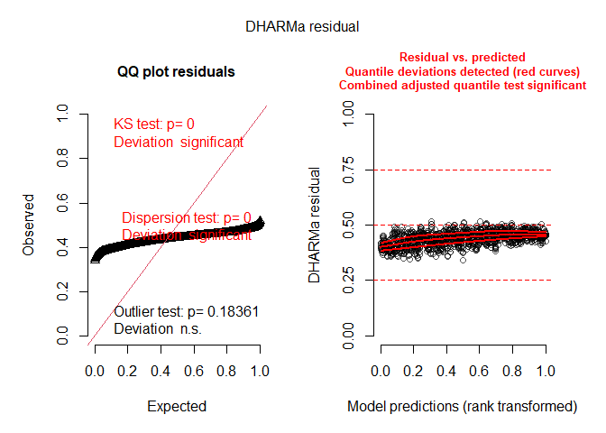<!-- -->

### Preparation

``` r
posterior1 <- m_1 %>%
  posterior::as_draws() %>%
  posterior::subset_draws(
    variable = c(
      "b_sand_ratio25",
      "b_sand_ratio50",
      "b_substrate_depth15",
      "b_target_typedry_grassland",
      "b_seed_density8",
      "b_expositionsouth",
      "b_survey_year_fct2019",
      "b_survey_year_fct2020",
      "b_survey_year_fct2021",
      "sd_site__Intercept",
      "sd_site:plot__Intercept",
      "sigma"
    )
  )
posterior2 <- m_2 %>%
  posterior::as_draws() %>%
  posterior::subset_draws(
    variable = c(
      "b_sand_ratio25",
      "b_sand_ratio50",
      "b_substrate_depth15",
      "b_target_typedry_grassland",
      "b_seed_density8",
      "b_expositionsouth",
      "b_survey_year_fct2019",
      "b_survey_year_fct2020",
      "b_survey_year_fct2021",
      "sd_site__Intercept",
      "sd_site:plot__Intercept",
      "sigma"
    )
  )
hmc_diagnostics1 <- nuts_params(m_1)
hmc_diagnostics2 <- nuts_params(m_2)
y <- sites$n
yrep1 <- posterior_predict(m_1, draws = 500)
yrep2 <- posterior_predict(m_2, draws = 500)
loo1 <- loo(m_1, save_psis = TRUE, moment_match = FALSE)
loo2 <- loo(m_2, save_psis = TRUE, moment_match = FALSE)
draws1 <- m_1 %>%
  posterior::as_draws() %>%
  posterior::summarize_draws() %>%
  filter(str_starts(variable, "b_"))
draws2 <- m_2 %>%
  posterior::as_draws() %>%
  posterior::summarize_draws() %>%
  filter(str_starts(variable, "b_"))
```

### Sampling efficency and effectiveness

#### Rhat

``` r
mcmc_rhat(draws1$rhat)
```

<!-- -->

``` r
mcmc_rhat(draws2$rhat)
```

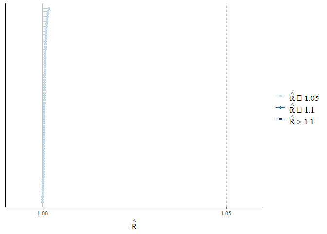<!-- -->

#### Effective sampling size (ESS)

``` r
mcmc_neff(neff_ratio(m_1))
```

<!-- -->

``` r
mcmc_neff(neff_ratio(m_2))
```

<!-- -->

### MCMC diagnostics

``` r
mcmc_trace(posterior1, np = hmc_diagnostics1)
```

    ## No divergences to plot.

<!-- -->

``` r
mcmc_trace(posterior2, np = hmc_diagnostics2)
```

    ## No divergences to plot.

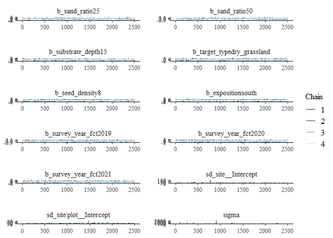<!-- -->

``` r
mcmc_pairs(m_1, off_diag_args = list(size = 1.2),
           pars = c(
             "b_sand_ratio25", "b_sand_ratio50", "b_substrate_depth15",
             "b_target_typedry_grassland", "b_seed_density8",
             "b_expositionsouth", "sigma"
           ))
```

<!-- -->

``` r
mcmc_pairs(m_2, off_diag_args = list(size = 1.2),
           pars = c(
             "b_sand_ratio25", "b_sand_ratio50", "b_substrate_depth15",
             "b_target_typedry_grassland", "b_seed_density8",
             "b_expositionsouth", "sigma"
           ))
```

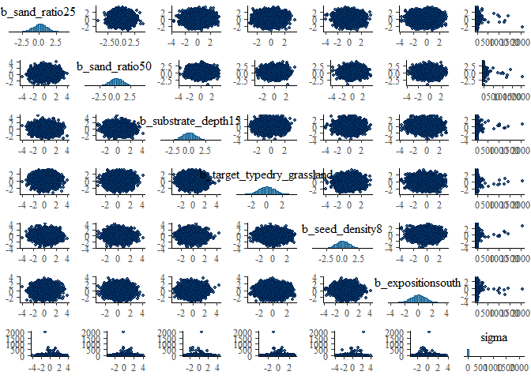<!-- -->

``` r
mcmc_parcoord(posterior1, np = hmc_diagnostics1) +
  theme(axis.text.x = element_text(angle = 90))
```

<!-- -->

``` r
mcmc_parcoord(posterior2, np = hmc_diagnostics2) +
  theme(axis.text.x = element_text(angle = 90))
```

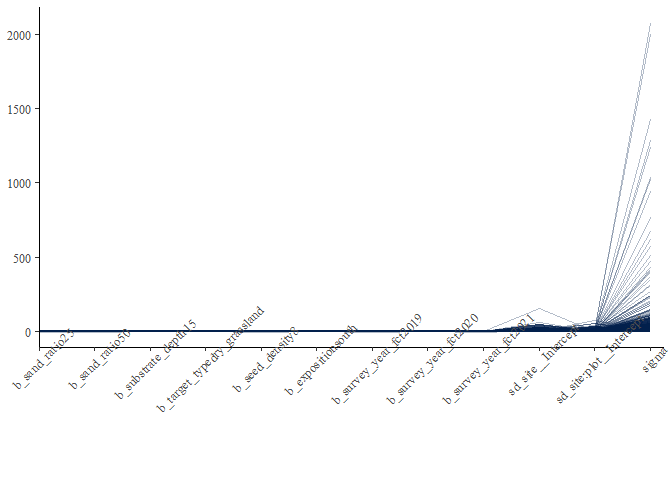<!-- -->

### Posterior predictive check

#### Kernel density

``` r
p1 <- ppc_dens_overlay(y, yrep1[1:50, ])
p2 <- ppc_dens_overlay(y, yrep2[1:50, ])
p1 / p2
```

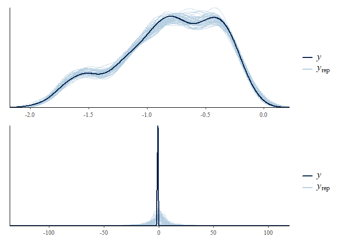<!-- -->

``` r
ppc_dens_overlay_grouped(y, yrep1[1:50, ], group = sites$site)
```

<!-- -->

``` r
ppc_dens_overlay_grouped(y, yrep2[1:50, ], group = sites$site)
```

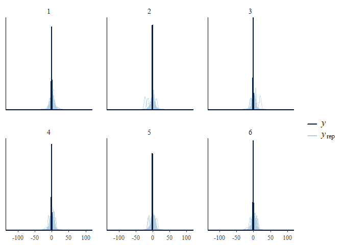<!-- -->

``` r
p1 <- ppc_dens_overlay_grouped(y, yrep1[1:50, ], group = sites$exposition)
p2 <- ppc_dens_overlay_grouped(y, yrep2[1:50, ], group = sites$exposition)
p1 / p2
```

<!-- -->

``` r
ppc_dens_overlay_grouped(y, yrep1[1:50, ], group = sites$survey_year_fct)
```

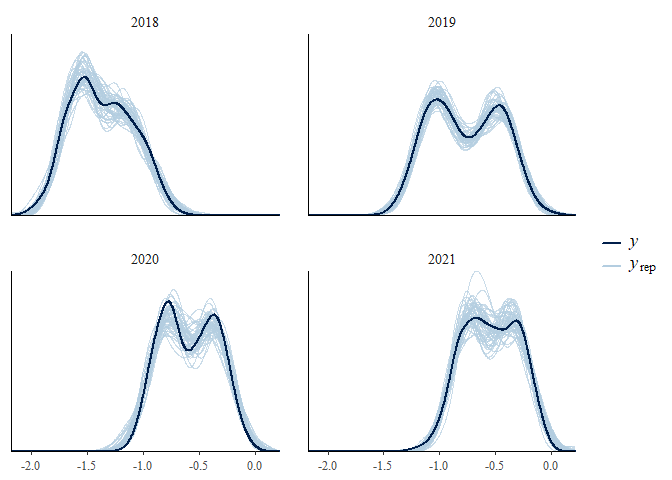<!-- -->

``` r
ppc_dens_overlay_grouped(y, yrep2[1:50, ], group = sites$survey_year_fct)
```

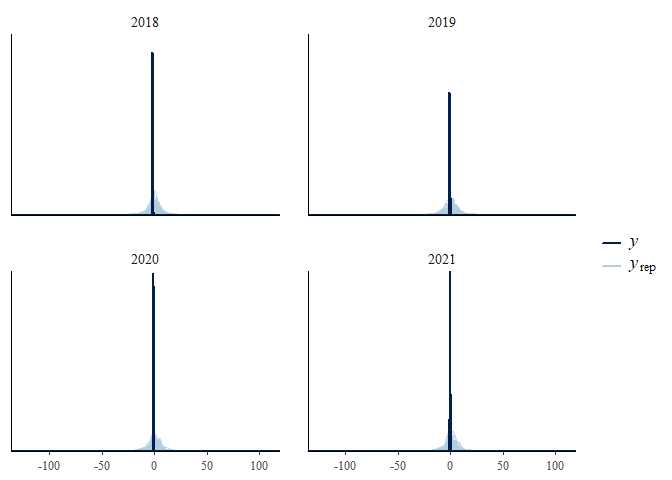<!-- -->

``` r
p1 <- ppc_dens_overlay_grouped(y, yrep1[1:50, ], group = sites$target_type)
p2 <- ppc_dens_overlay_grouped(y, yrep2[1:50, ], group = sites$target_type)
p1 / p2
```

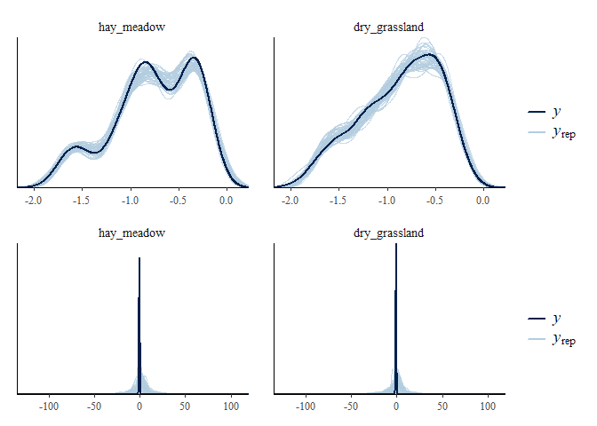<!-- -->

``` r
p1 <- ppc_dens_overlay_grouped(y, yrep1[1:50, ], group = sites$seed_density)
p2 <- ppc_dens_overlay_grouped(y, yrep2[1:50, ], group = sites$seed_density)
p1 / p2
```

<!-- -->

``` r
p1 <- ppc_dens_overlay_grouped(y, yrep1[1:50, ], group = sites$sand_ratio)
p2 <- ppc_dens_overlay_grouped(y, yrep2[1:50, ], group = sites$sand_ratio)
p1 / p2
```

<!-- -->

``` r
p1 <- ppc_dens_overlay_grouped(y, yrep1[1:50, ], group = sites$substrate_depth)
p2 <- ppc_dens_overlay_grouped(y, yrep2[1:50, ], group = sites$substrate_depth)
p1 / p2
```

<!-- -->

#### Histograms of statistics skew

``` r
p1 <- ppc_stat(y, yrep1, binwidth = 0.001)
p2 <- ppc_stat(y, yrep2, binwidth = 0.001)
p1 / p2
```

<!-- -->

``` r
ppc_stat_grouped(y, yrep1, group = sites$site, binwidth = 0.001)
```

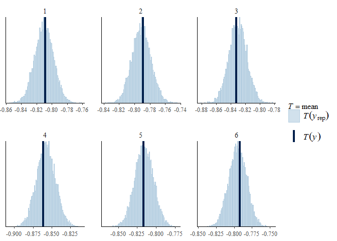<!-- -->

``` r
ppc_stat_grouped(y, yrep2, group = sites$site, binwidth = 0.001)
```

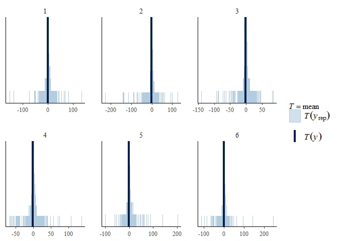<!-- -->

``` r
p1 <- ppc_stat_grouped(y, yrep1, group = sites$exposition, binwidth = 0.001)
p2 <- ppc_stat_grouped(y, yrep2, group = sites$exposition, binwidth = 0.001)
p1 / p2
```

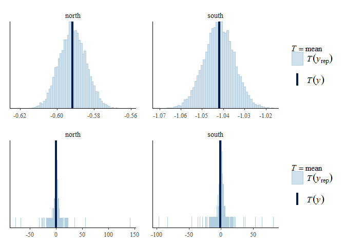<!-- -->

``` r
ppc_stat_grouped(y, yrep1, group = sites$survey_year_fct, binwidth = 0.001)
```

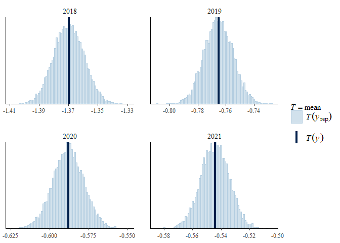<!-- -->

``` r
ppc_stat_grouped(y, yrep2, group = sites$survey_year_fct, binwidth = 0.001)
```

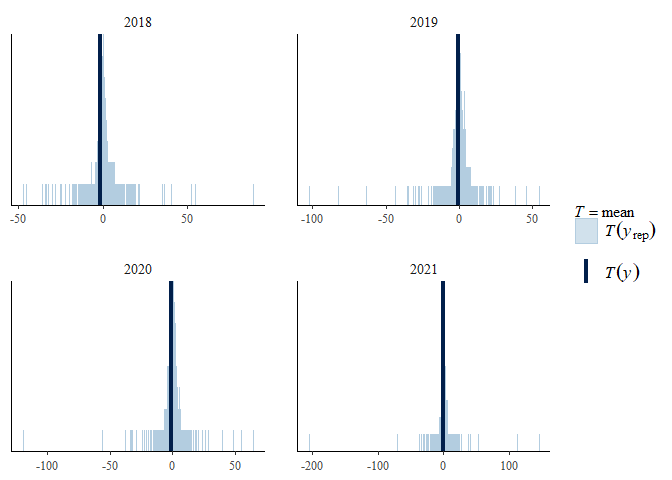<!-- -->

``` r
p1 <- ppc_stat_grouped(y, yrep1, group = sites$target_type, binwidth = 0.001)
p2 <- ppc_stat_grouped(y, yrep2, group = sites$target_type, binwidth = 0.001)
p1 / p2
```

<!-- -->

``` r
p1 <- ppc_stat_grouped(y, yrep1, group = sites$seed_density, binwidth = 0.001)
p2 <- ppc_stat_grouped(y, yrep2, group = sites$seed_density, binwidth = 0.001)
p1 / p2
```

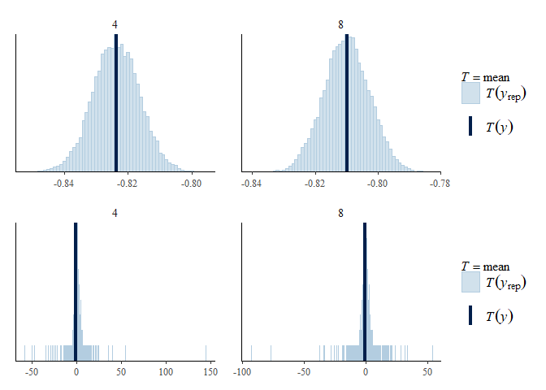<!-- -->

``` r
p1 <- ppc_stat_grouped(y, yrep1, group = sites$sand_ratio, binwidth = 0.001)
p2 <- ppc_stat_grouped(y, yrep2, group = sites$sand_ratio, binwidth = 0.001)
p1 / p2
```

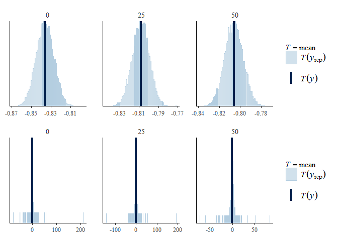<!-- -->

``` r
p1 <- ppc_stat_grouped(y, yrep1, group = sites$substrate_depth, binwidth = 0.001)
p2 <- ppc_stat_grouped(y, yrep2, group = sites$substrate_depth, binwidth = 0.001)
p1 / p2
```

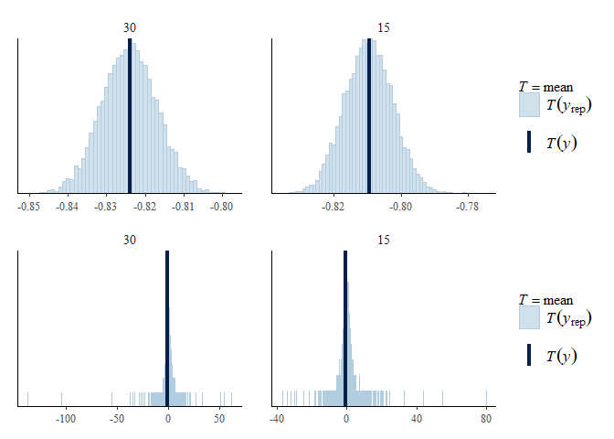<!-- -->

#### LOO (Leave one out)

``` r
loo1
```

    ## 
    ## Computed from 10000 by 1152 log-likelihood matrix
    ## 
    ##          Estimate   SE
    ## elpd_loo    686.9 25.5
    ## p_loo       168.3  6.9
    ## looic     -1373.8 51.0
    ## ------
    ## Monte Carlo SE of elpd_loo is 0.2.
    ## 
    ## Pareto k diagnostic values:
    ##                          Count Pct.    Min. n_eff
    ## (-Inf, 0.5]   (good)     1143  99.2%   1097      
    ##  (0.5, 0.7]   (ok)          9   0.8%   661       
    ##    (0.7, 1]   (bad)         0   0.0%   <NA>      
    ##    (1, Inf)   (very bad)    0   0.0%   <NA>      
    ## 
    ## All Pareto k estimates are ok (k < 0.7).
    ## See help('pareto-k-diagnostic') for details.

``` r
loo2
```

    ## 
    ## Computed from 10000 by 1152 log-likelihood matrix
    ## 
    ##          Estimate   SE
    ## elpd_loo    686.3 25.5
    ## p_loo       168.7  6.9
    ## looic     -1372.6 51.1
    ## ------
    ## Monte Carlo SE of elpd_loo is 0.2.
    ## 
    ## Pareto k diagnostic values:
    ##                          Count Pct.    Min. n_eff
    ## (-Inf, 0.5]   (good)     1143  99.2%   1010      
    ##  (0.5, 0.7]   (ok)          9   0.8%   470       
    ##    (0.7, 1]   (bad)         0   0.0%   <NA>      
    ##    (1, Inf)   (very bad)    0   0.0%   <NA>      
    ## 
    ## All Pareto k estimates are ok (k < 0.7).
    ## See help('pareto-k-diagnostic') for details.

``` r
plot(loo1)
```

<!-- -->

``` r
plot(loo2)
```

<!-- -->

Leave one out probability integral transform

``` r
p1 <- ppc_loo_pit_overlay(y, yrep1, lw = weights(loo1$psis_object))
```

    ## NOTE: The kernel density estimate assumes continuous observations and is not optimal for discrete observations.

``` r
p2 <- ppc_loo_pit_overlay(y, yrep2, lw = weights(loo2$psis_object))
```

    ## NOTE: The kernel density estimate assumes continuous observations and is not optimal for discrete observations.

``` r
p1 / p2
```

<!-- -->

### Autocorrelation check

``` r
mcmc_acf(posterior1, lags = 10)
```

<!-- -->

``` r
mcmc_acf(posterior2, lags = 10)
```

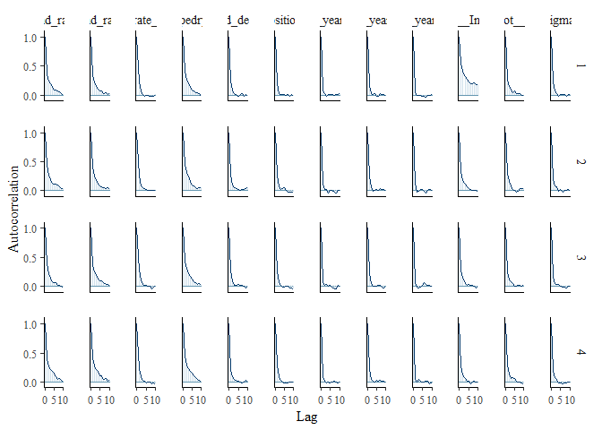<!-- -->

## Output of choosen model

### Model output

Conditional and marignal <i>R</i>²

``` r
bayes_R2(m_1, probs = c(0.05, 0.5, 0.95),
         re_formula =  ~ (1 | site/plot)) 
##    Estimate   Est.Error        Q5       Q50       Q95
## R2 0.918869 0.002526252 0.9145194 0.9189666 0.9227846
bayes_R2(m_1, probs = c(0.05, 0.5, 0.95),
         re_formula = 1 ~ 1)
##     Estimate   Est.Error        Q5       Q50       Q95
## R2 0.9040615 0.001862663 0.9008053 0.9041456 0.9069507
```

Posteriors of chosen model

``` r
draws1
```

    ## # A tibble: 77 × 10
    ##    varia…¹     mean   median     sd    mad      q5     q95  rhat ess_b…² ess_t…³
    ##    <chr>      <dbl>    <dbl>  <dbl>  <dbl>   <dbl>   <dbl> <dbl>   <dbl>   <dbl>
    ##  1 b_Inte… -1.11e+0 -1.11e+0 0.0371 0.0367 -1.17   -1.05    1.00   3356.   6035.
    ##  2 b_sand…  1.88e-1  1.88e-1 0.0371 0.0371  0.128   0.249   1.00   2524.   4607.
    ##  3 b_sand…  1.35e-1  1.35e-1 0.0376 0.0377  0.0725  0.196   1.00   2439.   4891.
    ##  4 b_targ… -1.72e-1 -1.72e-1 0.0374 0.0374 -0.233  -0.110   1.00   2479.   5042.
    ##  5 b_expo… -3.04e-1 -3.04e-1 0.474  0.471  -1.08    0.471   1.00   5491.   7546.
    ##  6 b_surv…  3.83e-1  3.87e-1 0.619  0.626  -0.628   1.39    1.00   7315.   8333.
    ##  7 b_surv…  6.13e-1  6.07e-1 0.527  0.521  -0.249   1.49    1.00   5811.   8108.
    ##  8 b_surv…  5.86e-1  5.85e-1 0.646  0.654  -0.468   1.65    1.00   7807.   8343.
    ##  9 b_subs…  9.85e-3  1.01e-2 0.0237 0.0233 -0.0289  0.0482  1.00   5419.   7399.
    ## 10 b_seed… -7.15e-5 -1.08e-5 0.0236 0.0239 -0.0386  0.0380  1.00   5337.   7856.
    ## # … with 67 more rows, and abbreviated variable names ¹​variable, ²​ess_bulk,
    ## #   ³​ess_tail

``` r
mcmc_intervals(
  posterior1,
  prob = 0.66,
  prob_outer = 0.95,
  point_est = "mean"
  ) +
  theme_classic()
```

<!-- -->

Posteriors of second model:

``` r
mcmc_intervals(
  posterior2,
  prob = 0.66,
  prob_outer = 0.95,
  point_est = "mean"
  ) +
  theme_classic()
```

<!-- -->

### Effect sizes

Effect sizes just to get exact values of means etc. if necessary.

``` r
(emm <- emmeans(m_1, revpairwise ~ target_type + sand_ratio |
                  exposition | survey_year_fct, type = "response"))
```

    ## NOTE: A nesting structure was detected in the fitted model:
    ##     botanist_year %in% (exposition*survey_year_fct)

    ## $emmeans
    ## exposition = north, survey_year_fct = 2018:
    ##  target_type   sand_ratio emmean lower.HPD upper.HPD
    ##  hay_meadow    0          -1.162    -1.224    -1.102
    ##  dry_grassland 0          -1.333    -1.395    -1.272
    ##  hay_meadow    25         -0.973    -1.034    -0.914
    ##  dry_grassland 25         -1.232    -1.294    -1.171
    ##  hay_meadow    50         -1.027    -1.087    -0.964
    ##  dry_grassland 50         -1.214    -1.278    -1.154
    ## 
    ## exposition = south, survey_year_fct = 2018:
    ##  target_type   sand_ratio emmean lower.HPD upper.HPD
    ##  hay_meadow    0          -1.536    -1.599    -1.476
    ##  dry_grassland 0          -1.594    -1.657    -1.534
    ##  hay_meadow    25         -1.538    -1.601    -1.474
    ##  dry_grassland 25         -1.542    -1.604    -1.482
    ##  hay_meadow    50         -1.615    -1.676    -1.553
    ##  dry_grassland 50         -1.645    -1.708    -1.586
    ## 
    ## exposition = north, survey_year_fct = 2019:
    ##  target_type   sand_ratio emmean lower.HPD upper.HPD
    ##  hay_meadow    0          -0.386    -0.448    -0.327
    ##  dry_grassland 0          -0.573    -0.634    -0.511
    ##  hay_meadow    25         -0.436    -0.497    -0.374
    ##  dry_grassland 25         -0.650    -0.710    -0.589
    ##  hay_meadow    50         -0.390    -0.450    -0.327
    ##  dry_grassland 50         -0.514    -0.576    -0.455
    ## 
    ## exposition = south, survey_year_fct = 2019:
    ##  target_type   sand_ratio emmean lower.HPD upper.HPD
    ##  hay_meadow    0          -1.030    -1.092    -0.966
    ##  dry_grassland 0          -1.161    -1.225    -1.099
    ##  hay_meadow    25         -0.996    -1.056    -0.928
    ##  dry_grassland 25         -1.052    -1.115    -0.987
    ##  hay_meadow    50         -1.050    -1.113    -0.987
    ##  dry_grassland 50         -1.057    -1.123    -0.995
    ## 
    ## exposition = north, survey_year_fct = 2020:
    ##  target_type   sand_ratio emmean lower.HPD upper.HPD
    ##  hay_meadow    0          -0.293    -0.355    -0.232
    ##  dry_grassland 0          -0.436    -0.496    -0.376
    ##  hay_meadow    25         -0.326    -0.385    -0.265
    ##  dry_grassland 25         -0.471    -0.534    -0.413
    ##  hay_meadow    50         -0.293    -0.359    -0.237
    ##  dry_grassland 50         -0.425    -0.486    -0.365
    ## 
    ## exposition = south, survey_year_fct = 2020:
    ##  target_type   sand_ratio emmean lower.HPD upper.HPD
    ##  hay_meadow    0          -0.797    -0.856    -0.734
    ##  dry_grassland 0          -0.885    -0.943    -0.822
    ##  hay_meadow    25         -0.744    -0.805    -0.682
    ##  dry_grassland 25         -0.790    -0.851    -0.730
    ##  hay_meadow    50         -0.799    -0.859    -0.738
    ##  dry_grassland 50         -0.798    -0.858    -0.737
    ## 
    ## exposition = north, survey_year_fct = 2021:
    ##  target_type   sand_ratio emmean lower.HPD upper.HPD
    ##  hay_meadow    0          -0.298    -0.356    -0.232
    ##  dry_grassland 0          -0.396    -0.457    -0.336
    ##  hay_meadow    25         -0.295    -0.357    -0.237
    ##  dry_grassland 25         -0.431    -0.490    -0.368
    ##  hay_meadow    50         -0.276    -0.337    -0.215
    ##  dry_grassland 50         -0.361    -0.422    -0.299
    ## 
    ## exposition = south, survey_year_fct = 2021:
    ##  target_type   sand_ratio emmean lower.HPD upper.HPD
    ##  hay_meadow    0          -0.680    -0.741    -0.618
    ##  dry_grassland 0          -0.839    -0.897    -0.775
    ##  hay_meadow    25         -0.719    -0.780    -0.657
    ##  dry_grassland 25         -0.768    -0.829    -0.706
    ##  hay_meadow    50         -0.705    -0.767    -0.644
    ##  dry_grassland 50         -0.760    -0.822    -0.700
    ## 
    ## Results are averaged over the levels of: substrate_depth, seed_density, botanist_year 
    ## Point estimate displayed: median 
    ## HPD interval probability: 0.95 
    ## 
    ## $contrasts
    ## exposition = north, survey_year_fct = 2018:
    ##  contrast                                                 estimate lower.HPD
    ##  dry_grassland sand_ratio0 - hay_meadow sand_ratio0      -0.172155  -0.24870
    ##  hay_meadow sand_ratio25 - hay_meadow sand_ratio0         0.187883   0.11559
    ##  hay_meadow sand_ratio25 - dry_grassland sand_ratio0      0.359731   0.28857
    ##  dry_grassland sand_ratio25 - hay_meadow sand_ratio0     -0.071040  -0.13975
    ##  dry_grassland sand_ratio25 - dry_grassland sand_ratio0   0.101103   0.02512
    ##  dry_grassland sand_ratio25 - hay_meadow sand_ratio25    -0.259011  -0.33098
    ##  hay_meadow sand_ratio50 - hay_meadow sand_ratio0         0.134688   0.05825
    ##  hay_meadow sand_ratio50 - dry_grassland sand_ratio0      0.306965   0.23306
    ##  hay_meadow sand_ratio50 - hay_meadow sand_ratio25       -0.053522  -0.12722
    ##  hay_meadow sand_ratio50 - dry_grassland sand_ratio25     0.205169   0.13204
    ##  dry_grassland sand_ratio50 - hay_meadow sand_ratio0     -0.052886  -0.12805
    ##  dry_grassland sand_ratio50 - dry_grassland sand_ratio0   0.118707   0.04547
    ##  dry_grassland sand_ratio50 - hay_meadow sand_ratio25    -0.241488  -0.31665
    ##  dry_grassland sand_ratio50 - dry_grassland sand_ratio25  0.017938  -0.05771
    ##  dry_grassland sand_ratio50 - hay_meadow sand_ratio50    -0.187662  -0.26222
    ##  upper.HPD
    ##   -0.10054
    ##    0.26110
    ##    0.43415
    ##    0.00641
    ##    0.17212
    ##   -0.18556
    ##    0.20641
    ##    0.38124
    ##    0.01750
    ##    0.28018
    ##    0.02053
    ##    0.19322
    ##   -0.17024
    ##    0.08960
    ##   -0.11386
    ## 
    ## exposition = south, survey_year_fct = 2018:
    ##  contrast                                                 estimate lower.HPD
    ##  dry_grassland sand_ratio0 - hay_meadow sand_ratio0      -0.056906  -0.13031
    ##  hay_meadow sand_ratio25 - hay_meadow sand_ratio0        -0.001865  -0.07814
    ##  hay_meadow sand_ratio25 - dry_grassland sand_ratio0      0.055434  -0.02085
    ##  dry_grassland sand_ratio25 - hay_meadow sand_ratio0     -0.005436  -0.08073
    ##  dry_grassland sand_ratio25 - dry_grassland sand_ratio0   0.051696  -0.02147
    ##  dry_grassland sand_ratio25 - hay_meadow sand_ratio25    -0.003537  -0.07458
    ##  hay_meadow sand_ratio50 - hay_meadow sand_ratio0        -0.078418  -0.15045
    ##  hay_meadow sand_ratio50 - dry_grassland sand_ratio0     -0.021625  -0.09512
    ##  hay_meadow sand_ratio50 - hay_meadow sand_ratio25       -0.077672  -0.15281
    ##  hay_meadow sand_ratio50 - dry_grassland sand_ratio25    -0.073819  -0.14517
    ##  dry_grassland sand_ratio50 - hay_meadow sand_ratio0     -0.108734  -0.18631
    ##  dry_grassland sand_ratio50 - dry_grassland sand_ratio0  -0.051628  -0.12070
    ##  dry_grassland sand_ratio50 - hay_meadow sand_ratio25    -0.107574  -0.18050
    ##  dry_grassland sand_ratio50 - dry_grassland sand_ratio25 -0.103482  -0.17668
    ##  dry_grassland sand_ratio50 - hay_meadow sand_ratio50    -0.030472  -0.10018
    ##  upper.HPD
    ##    0.01575
    ##    0.07319
    ##    0.13041
    ##    0.06745
    ##    0.12396
    ##    0.07294
    ##   -0.00492
    ##    0.05269
    ##   -0.00339
    ##    0.00315
    ##   -0.04058
    ##    0.02493
    ##   -0.03161
    ##   -0.03007
    ##    0.04582
    ## 
    ## exposition = north, survey_year_fct = 2019:
    ##  contrast                                                 estimate lower.HPD
    ##  dry_grassland sand_ratio0 - hay_meadow sand_ratio0      -0.187460  -0.26297
    ##  hay_meadow sand_ratio25 - hay_meadow sand_ratio0        -0.050007  -0.12304
    ##  hay_meadow sand_ratio25 - dry_grassland sand_ratio0      0.136925   0.05985
    ##  dry_grassland sand_ratio25 - hay_meadow sand_ratio0     -0.263148  -0.33538
    ##  dry_grassland sand_ratio25 - dry_grassland sand_ratio0  -0.076654  -0.14662
    ##  dry_grassland sand_ratio25 - hay_meadow sand_ratio25    -0.213222  -0.28791
    ##  hay_meadow sand_ratio50 - hay_meadow sand_ratio0        -0.003245  -0.07657
    ##  hay_meadow sand_ratio50 - dry_grassland sand_ratio0      0.183439   0.10863
    ##  hay_meadow sand_ratio50 - hay_meadow sand_ratio25        0.046414  -0.02544
    ##  hay_meadow sand_ratio50 - dry_grassland sand_ratio25     0.260246   0.18266
    ##  dry_grassland sand_ratio50 - hay_meadow sand_ratio0     -0.128487  -0.20460
    ##  dry_grassland sand_ratio50 - dry_grassland sand_ratio0   0.058811  -0.01720
    ##  dry_grassland sand_ratio50 - hay_meadow sand_ratio25    -0.078685  -0.15195
    ##  dry_grassland sand_ratio50 - dry_grassland sand_ratio25  0.135103   0.05836
    ##  dry_grassland sand_ratio50 - hay_meadow sand_ratio50    -0.124383  -0.19782
    ##  upper.HPD
    ##   -0.11510
    ##    0.02488
    ##    0.20867
    ##   -0.18710
    ##    0.00132
    ##   -0.14080
    ##    0.07114
    ##    0.25688
    ##    0.12263
    ##    0.33204
    ##   -0.05610
    ##    0.13331
    ##   -0.00294
    ##    0.20666
    ##   -0.04986
    ## 
    ## exposition = south, survey_year_fct = 2019:
    ##  contrast                                                 estimate lower.HPD
    ##  dry_grassland sand_ratio0 - hay_meadow sand_ratio0      -0.130616  -0.20518
    ##  hay_meadow sand_ratio25 - hay_meadow sand_ratio0         0.034854  -0.03922
    ##  hay_meadow sand_ratio25 - dry_grassland sand_ratio0      0.165025   0.09224
    ##  dry_grassland sand_ratio25 - hay_meadow sand_ratio0     -0.022308  -0.09727
    ##  dry_grassland sand_ratio25 - dry_grassland sand_ratio0   0.108865   0.03242
    ##  dry_grassland sand_ratio25 - hay_meadow sand_ratio25    -0.056912  -0.13006
    ##  hay_meadow sand_ratio50 - hay_meadow sand_ratio0        -0.019251  -0.09257
    ##  hay_meadow sand_ratio50 - dry_grassland sand_ratio0      0.110979   0.03515
    ##  hay_meadow sand_ratio50 - hay_meadow sand_ratio25       -0.054248  -0.12857
    ##  hay_meadow sand_ratio50 - dry_grassland sand_ratio25     0.002533  -0.07129
    ##  dry_grassland sand_ratio50 - hay_meadow sand_ratio0     -0.026951  -0.10005
    ##  dry_grassland sand_ratio50 - dry_grassland sand_ratio0   0.103952   0.03163
    ##  dry_grassland sand_ratio50 - hay_meadow sand_ratio25    -0.061579  -0.13277
    ##  dry_grassland sand_ratio50 - dry_grassland sand_ratio25 -0.004441  -0.08133
    ##  dry_grassland sand_ratio50 - hay_meadow sand_ratio50    -0.007241  -0.08238
    ##  upper.HPD
    ##   -0.05822
    ##    0.11071
    ##    0.24326
    ##    0.05329
    ##    0.18176
    ##    0.01991
    ##    0.05804
    ##    0.18578
    ##    0.01994
    ##    0.07877
    ##    0.04981
    ##    0.18041
    ##    0.01599
    ##    0.07111
    ##    0.06680
    ## 
    ## exposition = north, survey_year_fct = 2020:
    ##  contrast                                                 estimate lower.HPD
    ##  dry_grassland sand_ratio0 - hay_meadow sand_ratio0      -0.143069  -0.21988
    ##  hay_meadow sand_ratio25 - hay_meadow sand_ratio0        -0.032215  -0.10318
    ##  hay_meadow sand_ratio25 - dry_grassland sand_ratio0      0.111123   0.03899
    ##  dry_grassland sand_ratio25 - hay_meadow sand_ratio0     -0.177223  -0.25296
    ##  dry_grassland sand_ratio25 - dry_grassland sand_ratio0  -0.034111  -0.10883
    ##  dry_grassland sand_ratio25 - hay_meadow sand_ratio25    -0.145320  -0.21941
    ##  hay_meadow sand_ratio50 - hay_meadow sand_ratio0        -0.000286  -0.07382
    ##  hay_meadow sand_ratio50 - dry_grassland sand_ratio0      0.143028   0.06845
    ##  hay_meadow sand_ratio50 - hay_meadow sand_ratio25        0.032513  -0.04209
    ##  hay_meadow sand_ratio50 - dry_grassland sand_ratio25     0.177164   0.10325
    ##  dry_grassland sand_ratio50 - hay_meadow sand_ratio0     -0.132861  -0.20403
    ##  dry_grassland sand_ratio50 - dry_grassland sand_ratio0   0.010877  -0.06305
    ##  dry_grassland sand_ratio50 - hay_meadow sand_ratio25    -0.099765  -0.17329
    ##  dry_grassland sand_ratio50 - dry_grassland sand_ratio25  0.045642  -0.02693
    ##  dry_grassland sand_ratio50 - hay_meadow sand_ratio50    -0.131982  -0.20615
    ##  upper.HPD
    ##   -0.07212
    ##    0.04320
    ##    0.18799
    ##   -0.10209
    ##    0.03928
    ##   -0.07280
    ##    0.07384
    ##    0.21575
    ##    0.10478
    ##    0.25088
    ##   -0.05557
    ##    0.08614
    ##   -0.02599
    ##    0.12198
    ##   -0.05973
    ## 
    ## exposition = south, survey_year_fct = 2020:
    ##  contrast                                                 estimate lower.HPD
    ##  dry_grassland sand_ratio0 - hay_meadow sand_ratio0      -0.087796  -0.16172
    ##  hay_meadow sand_ratio25 - hay_meadow sand_ratio0         0.053189  -0.02118
    ##  hay_meadow sand_ratio25 - dry_grassland sand_ratio0      0.141033   0.06504
    ##  dry_grassland sand_ratio25 - hay_meadow sand_ratio0      0.006658  -0.06459
    ##  dry_grassland sand_ratio25 - dry_grassland sand_ratio0   0.094881   0.01935
    ##  dry_grassland sand_ratio25 - hay_meadow sand_ratio25    -0.046164  -0.12300
    ##  hay_meadow sand_ratio50 - hay_meadow sand_ratio0        -0.002050  -0.07496
    ##  hay_meadow sand_ratio50 - dry_grassland sand_ratio0      0.085475   0.01032
    ##  hay_meadow sand_ratio50 - hay_meadow sand_ratio25       -0.055236  -0.13156
    ##  hay_meadow sand_ratio50 - dry_grassland sand_ratio25    -0.008844  -0.08062
    ##  dry_grassland sand_ratio50 - hay_meadow sand_ratio0     -0.000704  -0.07361
    ##  dry_grassland sand_ratio50 - dry_grassland sand_ratio0   0.086621   0.01127
    ##  dry_grassland sand_ratio50 - hay_meadow sand_ratio25    -0.053515  -0.12710
    ##  dry_grassland sand_ratio50 - dry_grassland sand_ratio25 -0.006859  -0.08050
    ##  dry_grassland sand_ratio50 - hay_meadow sand_ratio50     0.001498  -0.07570
    ##  upper.HPD
    ##   -0.01372
    ##    0.12900
    ##    0.21513
    ##    0.08104
    ##    0.16695
    ##    0.02663
    ##    0.07155
    ##    0.15717
    ##    0.01791
    ##    0.06802
    ##    0.07541
    ##    0.16044
    ##    0.02242
    ##    0.06663
    ##    0.07124
    ## 
    ## exposition = north, survey_year_fct = 2021:
    ##  contrast                                                 estimate lower.HPD
    ##  dry_grassland sand_ratio0 - hay_meadow sand_ratio0      -0.098597  -0.17123
    ##  hay_meadow sand_ratio25 - hay_meadow sand_ratio0         0.001875  -0.07491
    ##  hay_meadow sand_ratio25 - dry_grassland sand_ratio0      0.100821   0.02741
    ##  dry_grassland sand_ratio25 - hay_meadow sand_ratio0     -0.132770  -0.20760
    ##  dry_grassland sand_ratio25 - dry_grassland sand_ratio0  -0.033964  -0.10671
    ##  dry_grassland sand_ratio25 - hay_meadow sand_ratio25    -0.135626  -0.20583
    ##  hay_meadow sand_ratio50 - hay_meadow sand_ratio0         0.021967  -0.05131
    ##  hay_meadow sand_ratio50 - dry_grassland sand_ratio0      0.120521   0.04927
    ##  hay_meadow sand_ratio50 - hay_meadow sand_ratio25        0.019987  -0.05500
    ##  hay_meadow sand_ratio50 - dry_grassland sand_ratio25     0.154727   0.07977
    ##  dry_grassland sand_ratio50 - hay_meadow sand_ratio0     -0.063636  -0.13682
    ##  dry_grassland sand_ratio50 - dry_grassland sand_ratio0   0.035361  -0.04206
    ##  dry_grassland sand_ratio50 - hay_meadow sand_ratio25    -0.066349  -0.13722
    ##  dry_grassland sand_ratio50 - dry_grassland sand_ratio25  0.069284  -0.00575
    ##  dry_grassland sand_ratio50 - hay_meadow sand_ratio50    -0.085255  -0.15912
    ##  upper.HPD
    ##   -0.02405
    ##    0.07436
    ##    0.17392
    ##   -0.05834
    ##    0.04031
    ##   -0.06116
    ##    0.09512
    ##    0.19604
    ##    0.09383
    ##    0.22761
    ##    0.01426
    ##    0.10686
    ##    0.01149
    ##    0.14312
    ##   -0.01110
    ## 
    ## exposition = south, survey_year_fct = 2021:
    ##  contrast                                                 estimate lower.HPD
    ##  dry_grassland sand_ratio0 - hay_meadow sand_ratio0      -0.158328  -0.22935
    ##  hay_meadow sand_ratio25 - hay_meadow sand_ratio0        -0.037826  -0.11412
    ##  hay_meadow sand_ratio25 - dry_grassland sand_ratio0      0.120405   0.04742
    ##  dry_grassland sand_ratio25 - hay_meadow sand_ratio0     -0.088642  -0.16438
    ##  dry_grassland sand_ratio25 - dry_grassland sand_ratio0   0.070249  -0.00549
    ##  dry_grassland sand_ratio25 - hay_meadow sand_ratio25    -0.049702  -0.12508
    ##  hay_meadow sand_ratio50 - hay_meadow sand_ratio0        -0.023915  -0.09598
    ##  hay_meadow sand_ratio50 - dry_grassland sand_ratio0      0.134613   0.05982
    ##  hay_meadow sand_ratio50 - hay_meadow sand_ratio25        0.014245  -0.06307
    ##  hay_meadow sand_ratio50 - dry_grassland sand_ratio25     0.064177  -0.00996
    ##  dry_grassland sand_ratio50 - hay_meadow sand_ratio0     -0.079401  -0.15430
    ##  dry_grassland sand_ratio50 - dry_grassland sand_ratio0   0.078563   0.00372
    ##  dry_grassland sand_ratio50 - hay_meadow sand_ratio25    -0.041495  -0.11593
    ##  dry_grassland sand_ratio50 - dry_grassland sand_ratio25  0.007916  -0.06884
    ##  dry_grassland sand_ratio50 - hay_meadow sand_ratio50    -0.056483  -0.13140
    ##  upper.HPD
    ##   -0.08091
    ##    0.03823
    ##    0.19561
    ##   -0.01320
    ##    0.14286
    ##    0.02399
    ##    0.05519
    ##    0.20987
    ##    0.08954
    ##    0.13877
    ##   -0.00252
    ##    0.15326
    ##    0.03438
    ##    0.08237
    ##    0.01748
    ## 
    ## Results are averaged over the levels of: substrate_depth, seed_density, botanist_year 
    ## Point estimate displayed: median 
    ## HPD interval probability: 0.95

# Session info

    ## R version 4.2.2 (2022-10-31 ucrt)
    ## Platform: x86_64-w64-mingw32/x64 (64-bit)
    ## Running under: Windows 10 x64 (build 22621)
    ## 
    ## Matrix products: default
    ## 
    ## locale:
    ## [1] LC_COLLATE=German_Germany.utf8  LC_CTYPE=German_Germany.utf8   
    ## [3] LC_MONETARY=German_Germany.utf8 LC_NUMERIC=C                   
    ## [5] LC_TIME=German_Germany.utf8    
    ## 
    ## attached base packages:
    ## [1] stats     graphics  grDevices utils     datasets  methods   base     
    ## 
    ## other attached packages:
    ##  [1] emmeans_1.8.2             tidybayes_3.0.2          
    ##  [3] loo_2.5.1                 bayesplot_1.10.0         
    ##  [5] DHARMa.helpers_0.0.0.9000 DHARMa_0.4.6             
    ##  [7] brms_2.18.0               Rcpp_1.0.9               
    ##  [9] patchwork_1.1.2           ggbeeswarm_0.6.0         
    ## [11] forcats_0.5.2             stringr_1.4.1            
    ## [13] dplyr_1.0.10              purrr_0.3.5              
    ## [15] readr_2.1.3               tidyr_1.2.1              
    ## [17] tibble_3.1.8              ggplot2_3.4.0            
    ## [19] tidyverse_1.3.2           here_1.0.1               
    ## 
    ## loaded via a namespace (and not attached):
    ##   [1] utf8_1.2.2           tidyselect_1.2.0     lme4_1.1-31         
    ##   [4] htmlwidgets_1.5.4    grid_4.2.2           RNeXML_2.4.8        
    ##   [7] munsell_0.5.0        codetools_0.2-18     interp_1.1-3        
    ##  [10] DT_0.26              miniUI_0.1.1.1       withr_2.5.0         
    ##  [13] Brobdingnag_1.2-9    colorspace_2.0-3     qgam_1.3.4          
    ##  [16] uuid_1.1-0           highr_0.9            knitr_1.41          
    ##  [19] rstudioapi_0.14      stats4_4.2.2         labeling_0.4.2      
    ##  [22] rstan_2.26.13        bit64_4.0.5          farver_2.1.1        
    ##  [25] gap.datasets_0.0.5   bridgesampling_1.1-2 rprojroot_2.0.3     
    ##  [28] coda_0.19-4          vctrs_0.5.1          generics_0.1.3      
    ##  [31] xfun_0.35            timechange_0.1.1     adegenet_2.1.8      
    ##  [34] doParallel_1.0.17    R6_2.5.1             markdown_1.4        
    ##  [37] assertthat_0.2.1     promises_1.2.0.1     scales_1.2.1        
    ##  [40] vroom_1.6.0          googlesheets4_1.0.1  phylobase_0.8.10    
    ##  [43] beeswarm_0.4.0       gtable_0.3.1         processx_3.8.0      
    ##  [46] rlang_1.0.6          splines_4.2.2        gargle_1.2.1        
    ##  [49] broom_1.0.1          checkmate_2.1.0      inline_0.3.19       
    ##  [52] yaml_2.3.6           reshape2_1.4.4       abind_1.4-5         
    ##  [55] modelr_0.1.10        threejs_0.3.3        crosstalk_1.2.0     
    ##  [58] backports_1.4.1      httpuv_1.6.6         tensorA_0.36.2      
    ##  [61] tools_4.2.2          ellipsis_0.3.2       posterior_1.3.1     
    ##  [64] RColorBrewer_1.1-3   plyr_1.8.8           progress_1.2.2      
    ##  [67] base64enc_0.1-3      ps_1.7.2             prettyunits_1.1.1   
    ##  [70] deldir_1.0-6         zoo_1.8-11           cluster_2.1.4       
    ##  [73] haven_2.5.1          fs_1.5.2             magrittr_2.0.3      
    ##  [76] ggdist_3.2.0         colourpicker_1.2.0   reprex_2.0.2        
    ##  [79] googledrive_2.0.0    mvtnorm_1.1-3        matrixStats_0.63.0  
    ##  [82] hms_1.1.2            shinyjs_2.1.0        mime_0.12           
    ##  [85] evaluate_0.18        arrayhelpers_1.1-0   xtable_1.8-4        
    ##  [88] XML_3.99-0.12        shinystan_2.6.0      jpeg_0.1-10         
    ##  [91] readxl_1.4.1         gridExtra_2.3        rstantools_2.2.0    
    ##  [94] compiler_4.2.2       KernSmooth_2.23-20   V8_4.2.2            
    ##  [97] crayon_1.5.2         minqa_1.2.5          StanHeaders_2.26.13 
    ## [100] htmltools_0.5.3      mgcv_1.8-41          later_1.3.0         
    ## [103] tzdb_0.3.0           RcppParallel_5.1.5   lubridate_1.9.0     
    ## [106] DBI_1.1.3            dbplyr_2.2.1         MASS_7.3-58.1       
    ## [109] boot_1.3-28          Matrix_1.5-3         ade4_1.7-20         
    ## [112] permute_0.9-7        cli_3.4.1            adegraphics_1.0-16  
    ## [115] parallel_4.2.2       igraph_1.3.5         pkgconfig_2.0.3     
    ## [118] rncl_0.8.6           sp_1.5-1             foreach_1.5.2       
    ## [121] xml2_1.3.3           svUnit_1.0.6         dygraphs_1.1.1.6    
    ## [124] vipor_0.4.5          estimability_1.4.1   rvest_1.0.3         
    ## [127] distributional_0.3.1 callr_3.7.3          digest_0.6.30       
    ## [130] vegan_2.6-4          rmarkdown_2.18       cellranger_1.1.0    
    ## [133] gap_1.3-1            curl_4.3.3           shiny_1.7.3         
    ## [136] gtools_3.9.4         nloptr_2.0.3         lifecycle_1.0.3     
    ## [139] nlme_3.1-160         jsonlite_1.8.3       seqinr_4.2-23       
    ## [142] fansi_1.0.3          pillar_1.8.1         lattice_0.20-45     
    ## [145] fastmap_1.1.0        httr_1.4.4           pkgbuild_1.4.0      
    ## [148] glue_1.6.2           xts_0.12.2           diffobj_0.3.5       
    ## [151] iterators_1.0.14     png_0.1-8            shinythemes_1.2.0   
    ## [154] bit_4.0.5            stringi_1.7.8        latticeExtra_0.6-30 
    ## [157] ape_5.6-2
