Persistence of seed mixture species: <br> Analysis of Bauer et
al. (unpublished) Field experiment
================
Markus Bauer <br>
2022-11-15

# Preparation

#### Packages

``` r
library(here)
library(tidyverse)
library(ggbeeswarm)
library(patchwork)
library(brms)
library(DHARMa)
library(DHARMa.helpers)
library(bayesplot)
library(loo)
library(tidybayes)
library(emmeans)
```

#### Load data

``` r
sites <- read_csv(
  here("data", "processed", "data_processed_sites_temporal.csv"),
  col_names = TRUE, na = c("na", "NA", ""), col_types =
    cols(
      .default = "?",
      plot = "f",
      site = "f",
      sand_ratio = "f",
      substrate_depth = "f",
      target_type = col_factor(levels = c(
        "dry_grassland", "hay_meadow"
      )),
      seed_density = "f",
      exposition = col_factor(levels = c(
        "north", "south"
      )),
      survey_year = "c"
    )
  ) %>%
  ### Exclude data of seed mixtures
  filter(presabu == "presence") %>%
  mutate(
    survey_year_fct = factor(survey_year),
    id = factor(id),
    n = persistence
  ) %>%
  select(
    id, plot, site, exposition, sand_ratio, substrate_depth, target_type,
    seed_density, survey_year_fct, survey_year, n
  )
```

# Statistics

## Data exploration

### Graphs of raw data

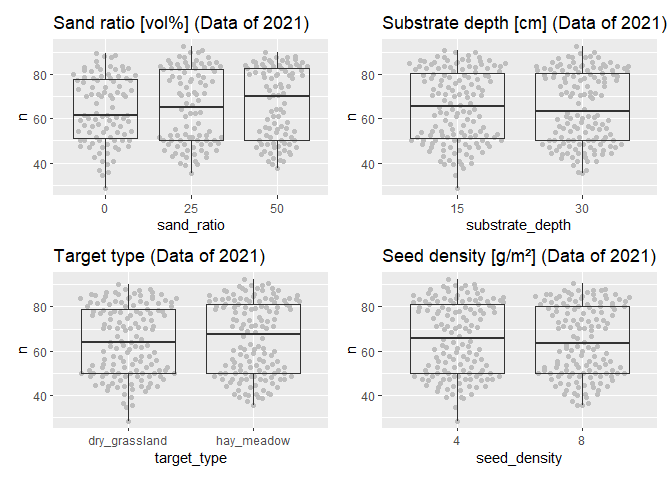<!-- --><!-- -->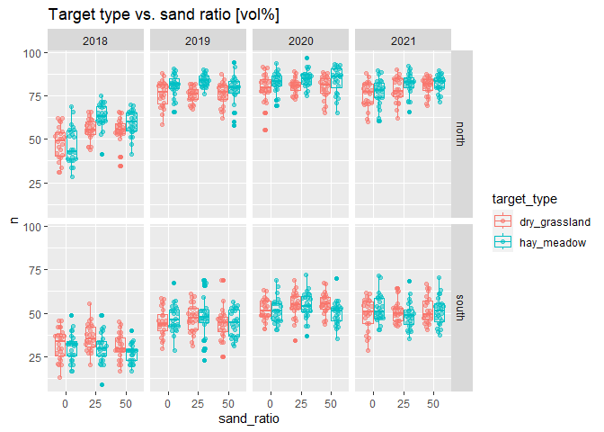<!-- -->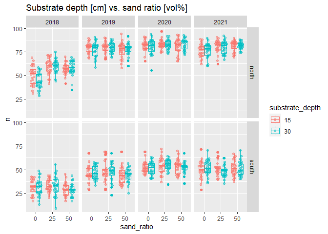<!-- -->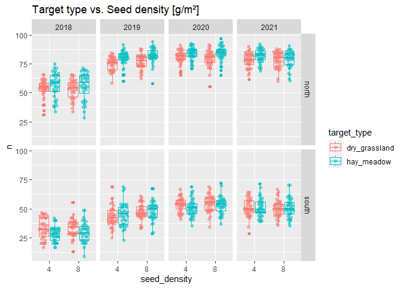<!-- -->

### Outliers, zero-inflation, transformations?

``` r
sites %>% group_by(exposition) %>% count(site)
```

    ## # A tibble: 12 × 3
    ## # Groups:   exposition [2]
    ##    exposition site      n
    ##    <fct>      <fct> <int>
    ##  1 north      1        96
    ##  2 north      2        96
    ##  3 north      3        96
    ##  4 north      4        96
    ##  5 north      5        96
    ##  6 north      6        96
    ##  7 south      1        96
    ##  8 south      2        96
    ##  9 south      3        96
    ## 10 south      4        96
    ## 11 south      5        96
    ## 12 south      6        96

``` r
boxplot(sites$n)
```

<!-- -->

``` r
ggplot(sites, aes(x = exposition, y = n)) + geom_quasirandom()
```

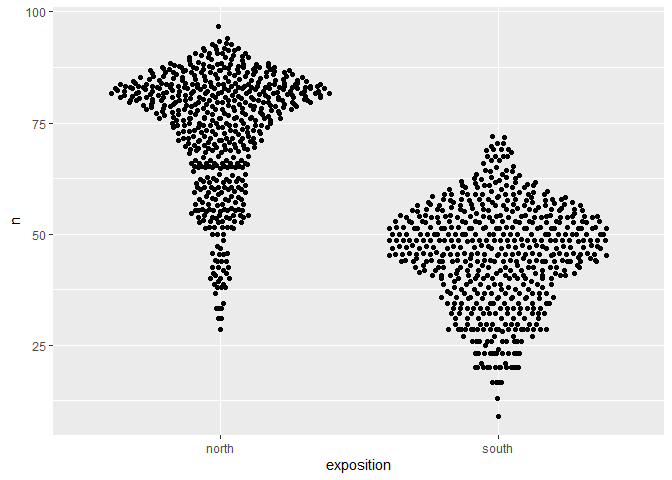<!-- -->

``` r
ggplot(sites, aes(x = n)) + geom_histogram(binwidth = 0.03)
```

<!-- -->

``` r
ggplot(sites, aes(x = n)) + geom_density()
```

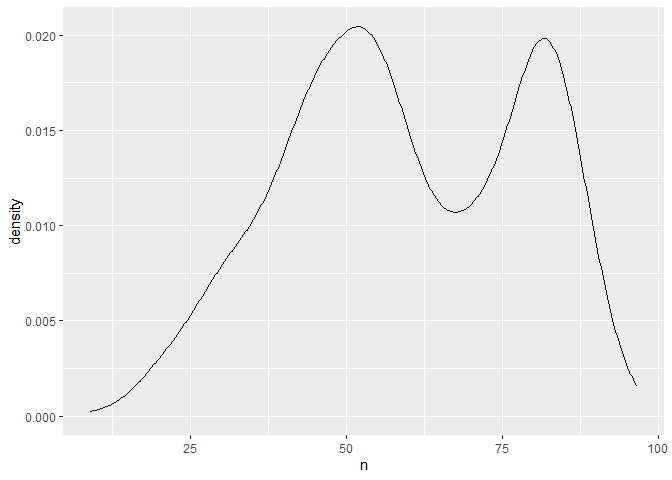<!-- -->

## Model building

### Models

Specifications for the models

``` r
iter = 10000
chains = 4
thin = 2
priors <- c(
  set_prior("normal(0, 20)", class = "b"),
  set_prior("normal(-2.5, 20)", class = "b", coef = "sand_ratio25"),
  set_prior("normal(-5, 20)", class = "b", coef = "sand_ratio50"),
  set_prior("normal(5, 20)", class = "b", coef = "expositionsouth"),
  set_prior("normal(-2.5, 20)", class = "b", coef = "survey_year_fct2019"),
  set_prior("normal(-5, 20)", class = "b", coef = "survey_year_fct2020"),
  set_prior("normal(-7.5, 20)", class = "b", coef = "survey_year_fct2021"),
  set_prior("cauchy(0, 10)", class = "sigma")
)
```

Model caluclations

``` r
load(file = here("outputs", "models", "model_persistence_1.Rdata"))
```

    ## Registered S3 methods overwritten by 'adegraphics':
    ##   method         from
    ##   biplot.dudi    ade4
    ##   kplot.foucart  ade4
    ##   kplot.mcoa     ade4
    ##   kplot.mfa      ade4
    ##   kplot.pta      ade4
    ##   kplot.sepan    ade4
    ##   kplot.statis   ade4
    ##   scatter.coa    ade4
    ##   scatter.dudi   ade4
    ##   scatter.nipals ade4
    ##   scatter.pco    ade4
    ##   score.acm      ade4
    ##   score.mix      ade4
    ##   score.pca      ade4
    ##   screeplot.dudi ade4

``` r
load(file = here("outputs", "models", "model_persistence_3.Rdata"))
```

### Model comparison

``` r
m_1 <- m1
m_2 <- m3
m_1$formula
```

    ## n ~ (target_type + exposition + sand_ratio + survey_year_fct)^4 + substrate_depth + seed_density + (1 | site/plot)

``` r
m_2$formula
```

    ## n ~ (target_type + exposition + sand_ratio + survey_year_fct)^2 + substrate_depth + seed_density + substrate_depth:sand_ratio + seed_density:exposition + target_type:exposition:survey_year_fct + sand_ratio:exposition:survey_year_fct + seed_density:exposition:survey_year_fct + (1 | site/plot)

Conditional R² values

``` r
bayes_R2(m_1, probs = c(0.05, 0.5, 0.95),
         re_formula =  ~ (1 | site/plot)) 
```

    ##     Estimate   Est.Error        Q5      Q50       Q95
    ## R2 0.8824012 0.003788493 0.8758881 0.882546 0.8883543

``` r
bayes_R2(m_2, probs = c(0.05, 0.5, 0.95),
         re_formula =  ~ (1 | site/plot))
```

    ##     Estimate   Est.Error        Q5       Q50       Q95
    ## R2 0.8828475 0.003645963 0.8765443 0.8830188 0.8886559

Marginal R² values

``` r
bayes_R2(m_1, probs = c(0.05, 0.5, 0.95),
         re_formula = 1 ~ 1)
```

    ##     Estimate   Est.Error        Q5       Q50       Q95
    ## R2 0.8485503 0.003776198 0.8419768 0.8487802 0.8542766

``` r
bayes_R2(m_2, probs = c(0.05, 0.5, 0.95),
         re_formula = 1 ~ 1)
```

    ##     Estimate   Est.Error        Q5       Q50       Q95
    ## R2 0.8478419 0.003821326 0.8412198 0.8480676 0.8537974

### Model check

#### DHARMa

``` r
DHARMa.helpers::dh_check_brms(m_1, integer = TRUE)
```

<!-- -->

``` r
DHARMa.helpers::dh_check_brms(m_2, integer = TRUE)
```

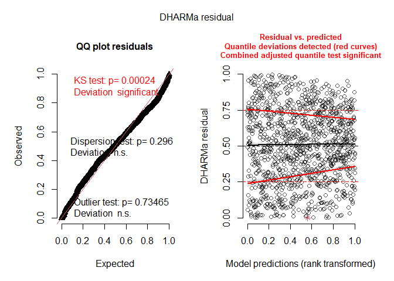<!-- -->

#### Preparation

``` r
posterior1 <- m_1 %>%
  posterior::as_draws() %>%
  posterior::subset_draws(
    variable = c(
      "b_sand_ratio25",
      "b_sand_ratio50",
      "b_substrate_depth30",
      "b_target_typehay_meadow",
      "b_seed_density8",
      "b_expositionsouth",
      "b_survey_year_fct2019",
      "b_survey_year_fct2020",
      "b_survey_year_fct2021",
      "sd_site__Intercept",
      "sd_site:plot__Intercept",
      "sigma"
    )
  )
posterior2 <- m_2 %>%
  posterior::as_draws() %>%
  posterior::subset_draws(
    variable = c(
      "b_sand_ratio25",
      "b_sand_ratio50",
      "b_substrate_depth30",
      "b_target_typehay_meadow",
      "b_seed_density8",
      "b_expositionsouth",
      "b_survey_year_fct2019",
      "b_survey_year_fct2020",
      "b_survey_year_fct2021",
      "sd_site__Intercept",
      "sd_site:plot__Intercept",
      "sigma"
    )
  )
hmc_diagnostics1 <- nuts_params(m_1)
hmc_diagnostics2 <- nuts_params(m_2)
y <- sites$n
yrep1 <- posterior_predict(m_1, draws = 500)
yrep2 <- posterior_predict(m_2, draws = 500)
loo1 <- loo(m_1, save_psis = TRUE, moment_match = FALSE)
loo2 <- loo(m_2, save_psis = TRUE, moment_match = FALSE)
```

    ## Warning: Found 1 observations with a pareto_k > 0.7 in model 'm_2'. It is
    ## recommended to set 'moment_match = TRUE' in order to perform moment matching for
    ## problematic observations.

``` r
draws1 <- m_1 %>%
  posterior::as_draws() %>%
  posterior::summarize_draws() %>%
  filter(str_starts(variable, "b_"))
draws2 <- m_2 %>%
  posterior::as_draws() %>%
  posterior::summarize_draws() %>%
  filter(str_starts(variable, "b_"))
```

#### Samling efficency/effectiveness (Rhat and EFF)

``` r
range(draws1$rhat)
```

    ## [1] 0.999922 1.001421

``` r
range(draws2$rhat)
```

    ## [1] 0.9999236 1.0019010

``` r
range(draws1$ess_bulk)
```

    ## [1] 3867.927 9734.855

``` r
range(draws2$ess_bulk)
```

    ## [1] 2760.054 7293.083

``` r
range(draws1$ess_tail)
```

    ## [1] 6283.683 9040.209

``` r
range(draws2$ess_tail)
```

    ## [1] 5349.024 8528.501

#### MCMC diagnostics

``` r
mcmc_trace(posterior1, np = hmc_diagnostics1)
```

    ## No divergences to plot.

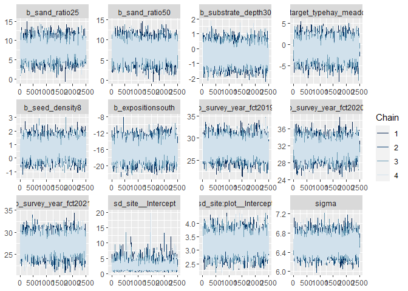<!-- -->

``` r
mcmc_trace(posterior2, np = hmc_diagnostics2)
```

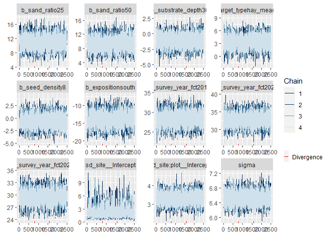<!-- -->

``` r
mcmc_parcoord(posterior1, np = hmc_diagnostics1)
```

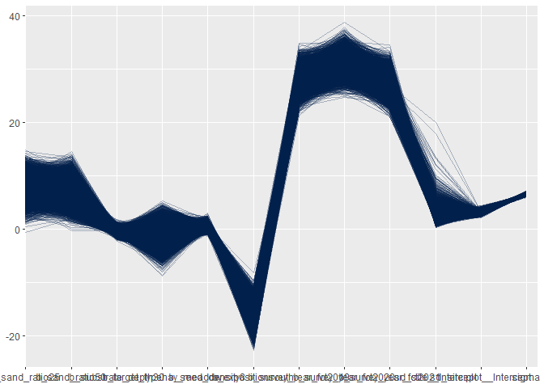<!-- -->

``` r
mcmc_parcoord(posterior2, np = hmc_diagnostics2)
```

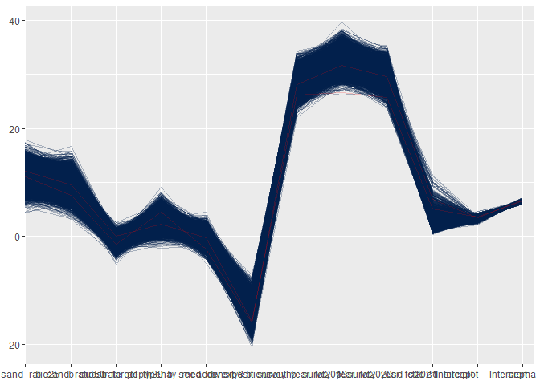<!-- -->

#### Posterior predictive check

##### Kernel density

``` r
p1 <- ppc_dens_overlay(y, yrep1[1:50, ])
p2 <- ppc_dens_overlay(y, yrep2[1:50, ])
p1 / p2
```

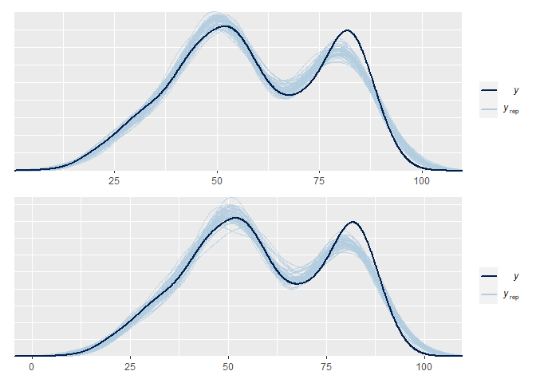<!-- -->

``` r
ppc_dens_overlay_grouped(y, yrep1[1:50, ], group = sites$site)
```

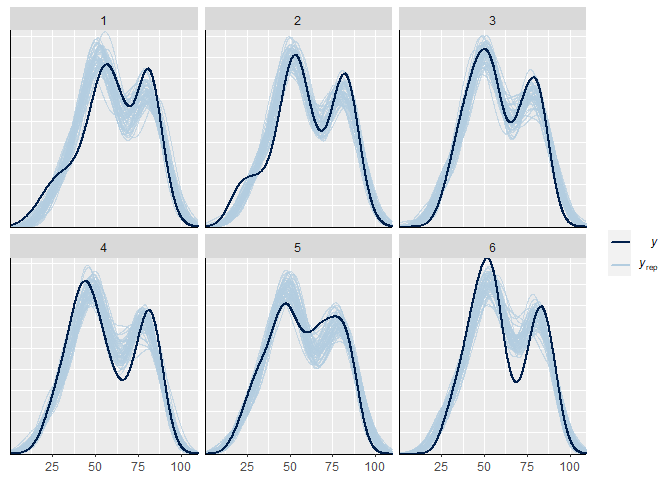<!-- -->

``` r
ppc_dens_overlay_grouped(y, yrep2[1:50, ], group = sites$site)
```

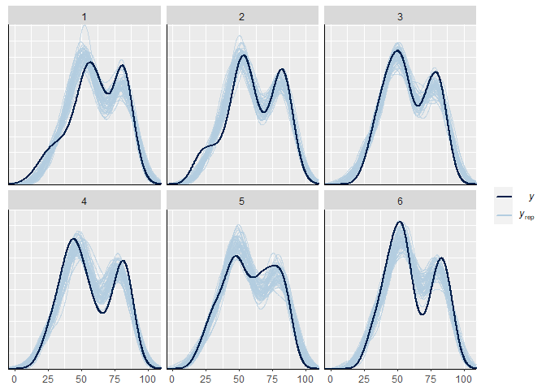<!-- -->

``` r
p1 <- ppc_dens_overlay_grouped(y, yrep1[1:50, ], group = sites$exposition)
p2 <- ppc_dens_overlay_grouped(y, yrep2[1:50, ], group = sites$exposition)
p1 / p2
```

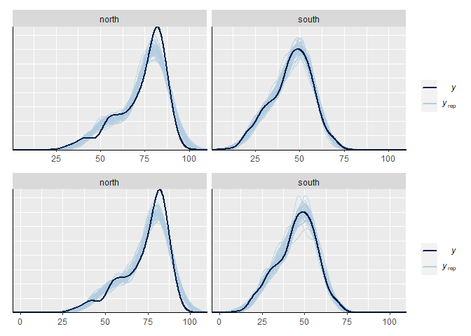<!-- -->

``` r
ppc_dens_overlay_grouped(y, yrep1[1:50, ], group = sites$survey_year_fct)
```

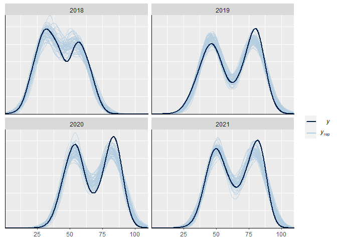<!-- -->

``` r
ppc_dens_overlay_grouped(y, yrep2[1:50, ], group = sites$survey_year_fct)
```

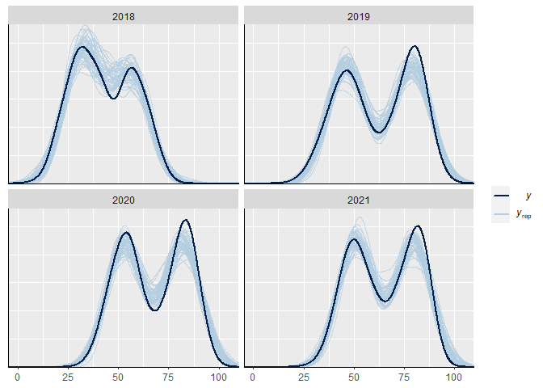<!-- -->

``` r
p1 <- ppc_dens_overlay_grouped(y, yrep1[1:50, ], group = sites$target_type)
p2 <- ppc_dens_overlay_grouped(y, yrep2[1:50, ], group = sites$target_type)
p1 / p2
```

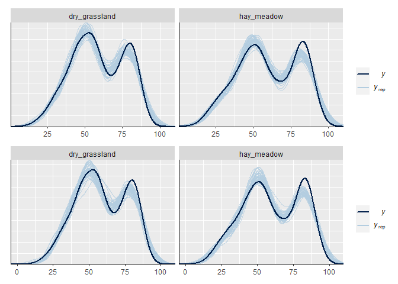<!-- -->

``` r
p1 <- ppc_dens_overlay_grouped(y, yrep1[1:50, ], group = sites$seed_density)
p2 <- ppc_dens_overlay_grouped(y, yrep2[1:50, ], group = sites$seed_density)
p1 / p2
```

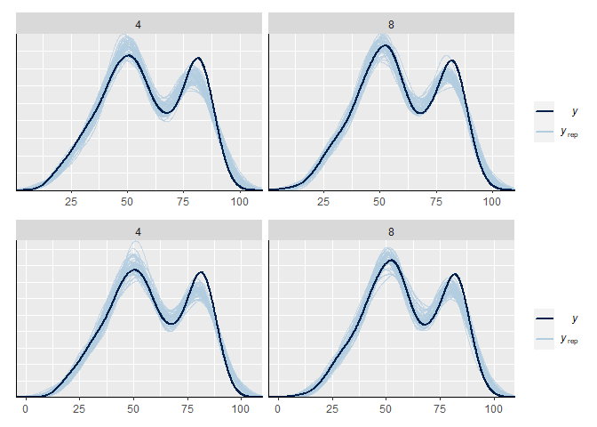<!-- -->

``` r
p1 <- ppc_dens_overlay_grouped(y, yrep1[1:50, ], group = sites$sand_ratio)
p2 <- ppc_dens_overlay_grouped(y, yrep2[1:50, ], group = sites$sand_ratio)
p1 / p2
```

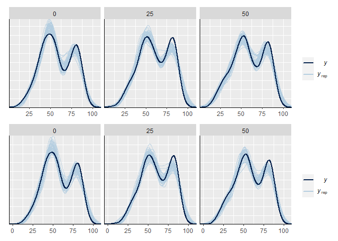<!-- -->

``` r
p1 <- ppc_dens_overlay_grouped(y, yrep1[1:50, ], group = sites$substrate_depth)
p2 <- ppc_dens_overlay_grouped(y, yrep2[1:50, ], group = sites$substrate_depth)
p1 / p2
```

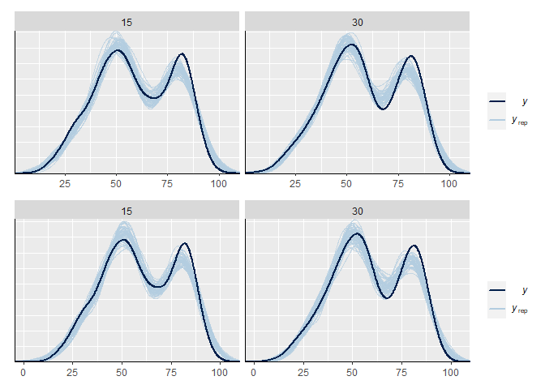<!-- -->

##### Histograms of statistics skew

``` r
p1 <- ppc_stat(y, yrep1, binwidth = 0.001)
p2 <- ppc_stat(y, yrep2, binwidth = 0.001)
p1 / p2
```

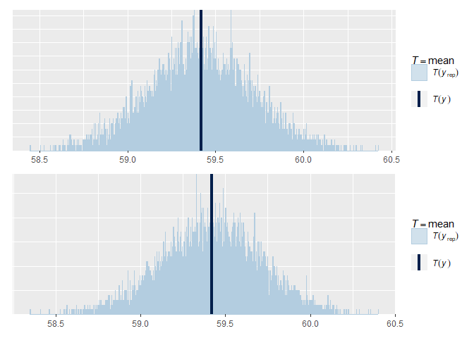<!-- -->

``` r
ppc_stat_grouped(y, yrep1, group = sites$site, binwidth = 0.001)
```

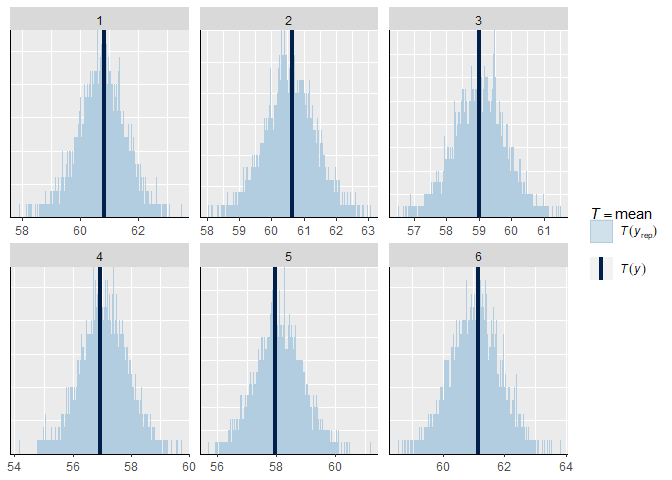<!-- -->

``` r
ppc_stat_grouped(y, yrep2, group = sites$site, binwidth = 0.001)
```

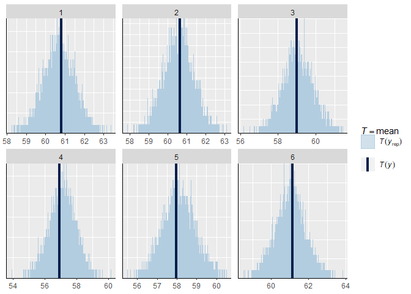<!-- -->

``` r
p1 <- ppc_stat_grouped(y, yrep1, group = sites$exposition, binwidth = 0.001)
p2 <- ppc_stat_grouped(y, yrep2, group = sites$exposition, binwidth = 0.001)
p1 / p2
```

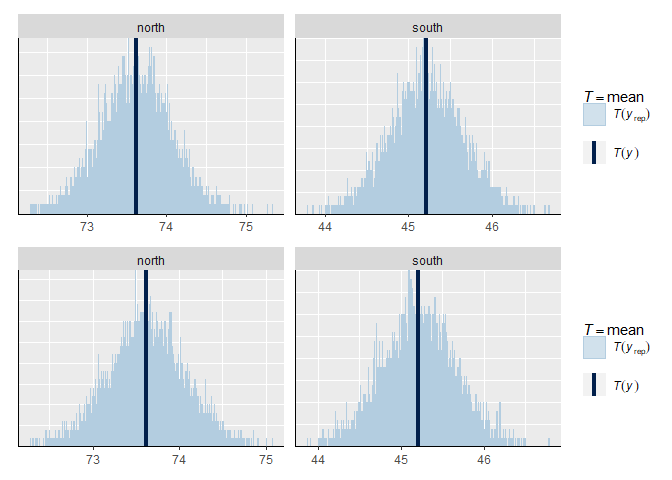<!-- -->

``` r
ppc_stat_grouped(y, yrep1, group = sites$survey_year_fct, binwidth = 0.001)
```

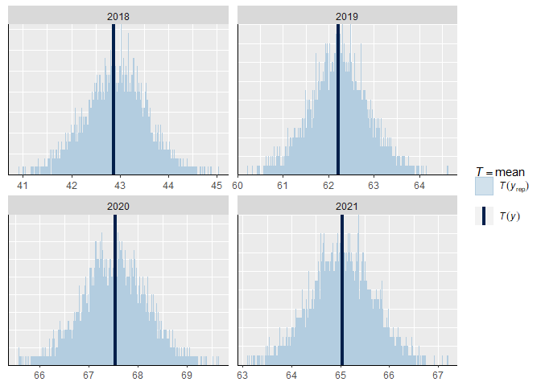<!-- -->

``` r
ppc_stat_grouped(y, yrep2, group = sites$survey_year_fct, binwidth = 0.001)
```

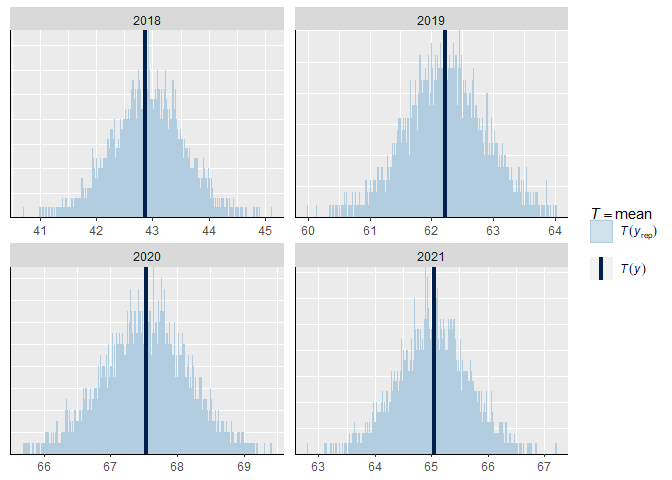<!-- -->

``` r
p1 <- ppc_stat_grouped(y, yrep1, group = sites$target_type, binwidth = 0.001)
p2 <- ppc_stat_grouped(y, yrep2, group = sites$target_type, binwidth = 0.001)
p1 / p2
```

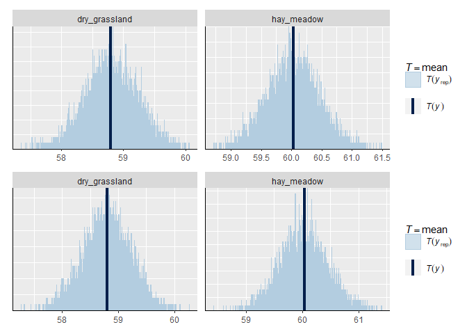<!-- -->

``` r
p1 <- ppc_stat_grouped(y, yrep1, group = sites$seed_density, binwidth = 0.001)
p2 <- ppc_stat_grouped(y, yrep2, group = sites$seed_density, binwidth = 0.001)
p1 / p2
```

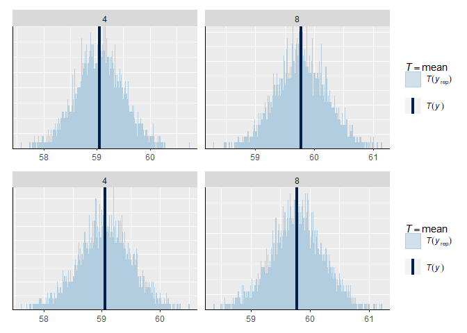<!-- -->

``` r
p1 <- ppc_stat_grouped(y, yrep1, group = sites$sand_ratio, binwidth = 0.001)
p2 <- ppc_stat_grouped(y, yrep2, group = sites$sand_ratio, binwidth = 0.001)
p1 / p2
```

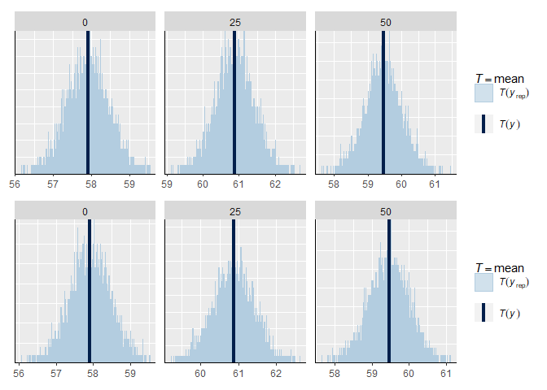<!-- -->

``` r
p1 <- ppc_stat_grouped(y, yrep1, group = sites$substrate_depth, binwidth = 0.001)
p2 <- ppc_stat_grouped(y, yrep2, group = sites$substrate_depth, binwidth = 0.001)
p1 / p2
```

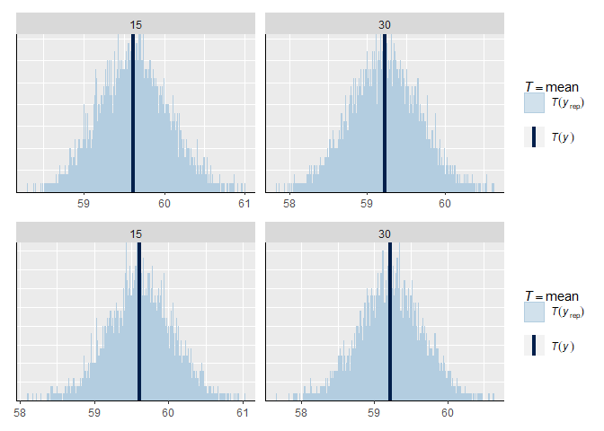<!-- -->

##### LOO-PIT plots

``` r
p1 <- ppc_loo_pit_overlay(y, yrep1, lw = weights(loo1$psis_object))
```

    ## NOTE: The kernel density estimate assumes continuous observations and is not optimal for discrete observations.

``` r
p2 <- ppc_loo_pit_overlay(y, yrep2, lw = weights(loo2$psis_object))
```

    ## NOTE: The kernel density estimate assumes continuous observations and is not optimal for discrete observations.

``` r
p1 / p2
```

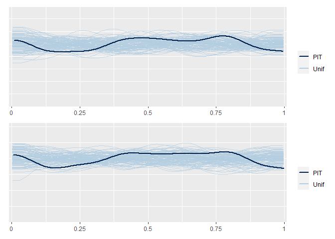<!-- -->

``` r
plot(loo1)
```

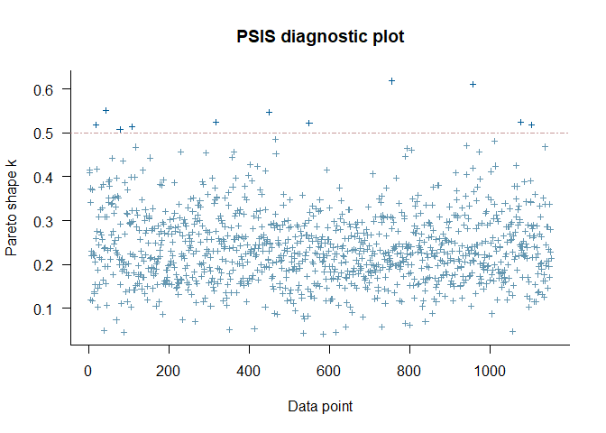<!-- -->

``` r
plot(loo2)
```

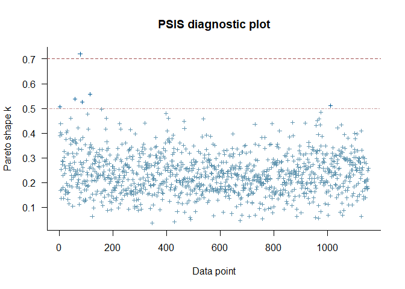<!-- -->

#### Autocorrelation check

``` r
mcmc_acf(posterior1, lags = 10)
```

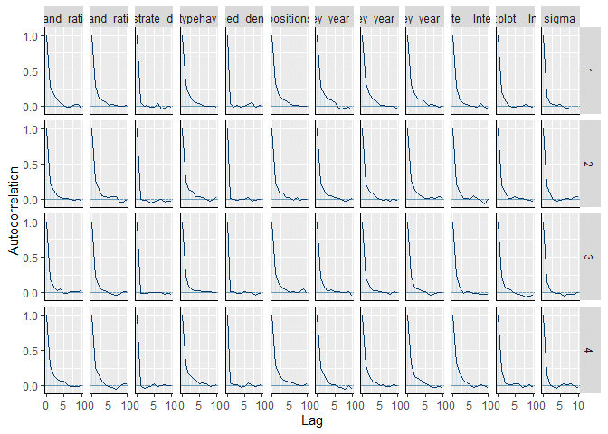<!-- -->

``` r
mcmc_acf(posterior2, lags = 10)
```

<!-- -->

## Output of choosen model

### Model output

Priors and conditional and marignal R²

``` r
prior_summary(m_1, all = FALSE)
```

    ##                     prior     class                coef group resp dpar nlpar
    ##             normal(0, 20)         b                                          
    ##             normal(5, 20)         b     expositionsouth                      
    ##          normal(-2.5, 20)         b        sand_ratio25                      
    ##            normal(-5, 20)         b        sand_ratio50                      
    ##          normal(-2.5, 20)         b survey_year_fct2019                      
    ##            normal(-5, 20)         b survey_year_fct2020                      
    ##          normal(-7.5, 20)         b survey_year_fct2021                      
    ##  student_t(3, 57.1, 23.5) Intercept                                          
    ##     student_t(3, 0, 23.5)        sd                                          
    ##             cauchy(0, 10)     sigma                                          
    ##  lb ub  source
    ##           user
    ##           user
    ##           user
    ##           user
    ##           user
    ##           user
    ##           user
    ##        default
    ##   0    default
    ##   0       user

``` r
bayes_R2(m_1, probs = c(0.05, 0.5, 0.95),
         re_formula =  ~ (1 | site/plot)) 
```

    ##     Estimate   Est.Error        Q5      Q50       Q95
    ## R2 0.8824012 0.003788493 0.8758881 0.882546 0.8883543

``` r
bayes_R2(m_1, probs = c(0.05, 0.5, 0.95),
         re_formula = 1 ~ 1)
```

    ##     Estimate   Est.Error        Q5       Q50       Q95
    ## R2 0.8485503 0.003776198 0.8419768 0.8487802 0.8542766

Posteriors

``` r
draws1
```

    ## # A tibble: 50 × 10
    ##    variable       mean  median    sd   mad      q5     q95  rhat ess_b…¹ ess_t…²
    ##    <chr>         <dbl>   <dbl> <dbl> <dbl>   <dbl>   <dbl> <dbl>   <dbl>   <dbl>
    ##  1 b_Intercept  47.9    47.9   1.75  1.70   45.1    50.8    1.00   5241.   7879.
    ##  2 b_target_t…  -1.20   -1.19  1.91  1.93   -4.37    1.92   1.00   4223.   7075.
    ##  3 b_expositi… -16.1   -16.1   1.91  1.89  -19.2   -12.9    1.00   3868.   6712.
    ##  4 b_sand_rat…   7.74    7.74  1.95  1.92    4.50   10.9    1.00   4770.   7466.
    ##  5 b_sand_rat…   7.25    7.24  1.97  1.98    3.97   10.5    1.00   4965.   7147.
    ##  6 b_survey_y…  27.9    27.9   1.78  1.76   25.0    30.8    1.00   4876.   7111.
    ##  7 b_survey_y…  31.2    31.2   1.76  1.75   28.4    34.1    1.00   4880.   7262.
    ##  8 b_survey_y…  27.3    27.3   1.76  1.76   24.4    30.2    1.00   4394.   7172.
    ##  9 b_substrat…  -0.398  -0.399 0.536 0.535  -1.29    0.485  1.00   9735.   8923.
    ## 10 b_seed_den…   0.726   0.725 0.542 0.540  -0.157   1.62   1.00   9253.   9040.
    ## # … with 40 more rows, and abbreviated variable names ¹​ess_bulk, ²​ess_tail

``` r
mcmc_intervals(
  posterior1,
  prob = 0.66,
  prob_outer = 0.95,
  point_est = "mean"
)
```

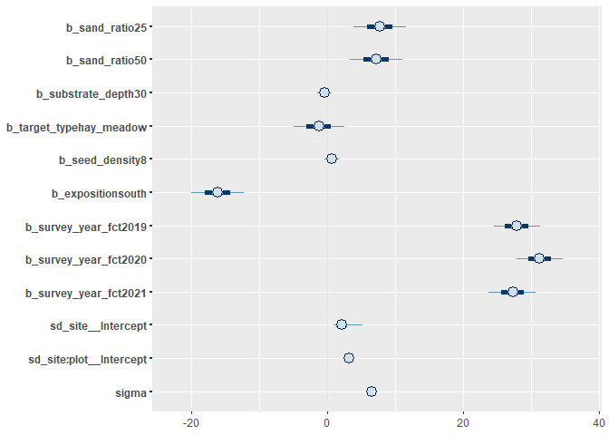<!-- -->

``` r
mcmc_intervals(
  posterior2,
  prob = 0.66,
  prob_outer = 0.95,
  point_est = "mean"
)
```

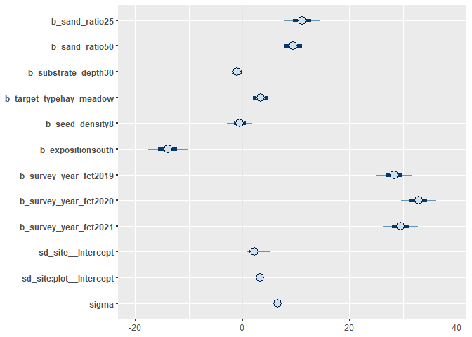<!-- -->

### Effect sizes

``` r
(emm <- emmeans(m_1, revpairwise ~ target_type + sand_ratio |
                  exposition | survey_year_fct, type = "response"))
```

    ## $emmeans
    ## exposition = north, survey_year_fct = 2018:
    ##  target_type   sand_ratio emmean lower.HPD upper.HPD
    ##  dry_grassland 0            48.1      44.8      51.5
    ##  hay_meadow    0            46.9      43.5      50.3
    ##  dry_grassland 25           55.8      52.2      59.2
    ##  hay_meadow    25           63.1      59.5      66.5
    ##  dry_grassland 50           55.3      51.8      58.8
    ##  hay_meadow    50           59.1      55.6      62.6
    ## 
    ## exposition = south, survey_year_fct = 2018:
    ##  target_type   sand_ratio emmean lower.HPD upper.HPD
    ##  dry_grassland 0            32.0      28.7      35.4
    ##  hay_meadow    0            30.0      26.5      33.5
    ##  dry_grassland 25           36.1      32.6      39.5
    ##  hay_meadow    25           30.1      26.6      33.6
    ##  dry_grassland 50           31.1      27.5      34.5
    ##  hay_meadow    50           27.1      23.7      30.7
    ## 
    ## exposition = north, survey_year_fct = 2019:
    ##  target_type   sand_ratio emmean lower.HPD upper.HPD
    ##  dry_grassland 0            76.0      72.4      79.4
    ##  hay_meadow    0            80.7      77.2      84.2
    ##  dry_grassland 25           75.5      72.0      79.0
    ##  hay_meadow    25           83.6      80.1      87.1
    ##  dry_grassland 50           76.1      72.5      79.5
    ##  hay_meadow    50           78.7      75.4      82.4
    ## 
    ## exposition = south, survey_year_fct = 2019:
    ##  target_type   sand_ratio emmean lower.HPD upper.HPD
    ##  dry_grassland 0            45.0      41.6      48.6
    ##  hay_meadow    0            47.2      43.8      50.8
    ##  dry_grassland 25           47.1      43.7      50.7
    ##  hay_meadow    25           48.1      44.7      51.7
    ##  dry_grassland 50           44.0      40.7      47.7
    ##  hay_meadow    50           44.2      40.7      47.7
    ## 
    ## exposition = north, survey_year_fct = 2020:
    ##  target_type   sand_ratio emmean lower.HPD upper.HPD
    ##  dry_grassland 0            79.3      76.0      82.8
    ##  hay_meadow    0            82.7      79.2      86.2
    ##  dry_grassland 25           80.5      76.7      83.8
    ##  hay_meadow    25           85.1      81.7      88.7
    ##  dry_grassland 50           80.0      76.5      83.5
    ##  hay_meadow    50           84.0      80.8      87.7
    ## 
    ## exposition = south, survey_year_fct = 2020:
    ##  target_type   sand_ratio emmean lower.HPD upper.HPD
    ##  dry_grassland 0            52.0      48.5      55.5
    ##  hay_meadow    0            51.7      48.2      55.2
    ##  dry_grassland 25           54.8      51.1      58.2
    ##  hay_meadow    25           54.3      50.7      57.7
    ##  dry_grassland 50           55.4      51.8      58.7
    ##  hay_meadow    50           50.1      46.4      53.5
    ## 
    ## exposition = north, survey_year_fct = 2021:
    ##  target_type   sand_ratio emmean lower.HPD upper.HPD
    ##  dry_grassland 0            75.4      72.0      79.0
    ##  hay_meadow    0            77.1      73.7      80.7
    ##  dry_grassland 25           78.5      75.1      82.2
    ##  hay_meadow    25           81.9      78.4      85.4
    ##  dry_grassland 50           80.7      77.1      84.2
    ##  hay_meadow    50           82.1      78.7      85.7
    ## 
    ## exposition = south, survey_year_fct = 2021:
    ##  target_type   sand_ratio emmean lower.HPD upper.HPD
    ##  dry_grassland 0            49.6      46.1      53.0
    ##  hay_meadow    0            52.7      49.3      56.3
    ##  dry_grassland 25           50.8      47.2      54.2
    ##  hay_meadow    25           48.5      44.8      51.9
    ##  dry_grassland 50           51.7      48.1      55.1
    ##  hay_meadow    50           51.1      47.7      54.8
    ## 
    ## Results are averaged over the levels of: substrate_depth, seed_density 
    ## Point estimate displayed: median 
    ## HPD interval probability: 0.95 
    ## 
    ## $contrasts
    ## exposition = north, survey_year_fct = 2018:
    ##  contrast                                                estimate lower.HPD
    ##  hay_meadow sand_ratio0 - dry_grassland sand_ratio0        -1.186   -4.8339
    ##  dry_grassland sand_ratio25 - dry_grassland sand_ratio0     7.742    3.9455
    ##  dry_grassland sand_ratio25 - hay_meadow sand_ratio0        8.971    4.9273
    ##  hay_meadow sand_ratio25 - dry_grassland sand_ratio0       14.993   10.8959
    ##  hay_meadow sand_ratio25 - hay_meadow sand_ratio0          16.151   12.2269
    ##  hay_meadow sand_ratio25 - dry_grassland sand_ratio25       7.204    3.2753
    ##  dry_grassland sand_ratio50 - dry_grassland sand_ratio0     7.243    3.3383
    ##  dry_grassland sand_ratio50 - hay_meadow sand_ratio0        8.439    4.6181
    ##  dry_grassland sand_ratio50 - dry_grassland sand_ratio25   -0.504   -4.5712
    ##  dry_grassland sand_ratio50 - hay_meadow sand_ratio25      -7.727  -11.7871
    ##  hay_meadow sand_ratio50 - dry_grassland sand_ratio0       11.031    6.9362
    ##  hay_meadow sand_ratio50 - hay_meadow sand_ratio0          12.242    8.4621
    ##  hay_meadow sand_ratio50 - dry_grassland sand_ratio25       3.263   -0.7713
    ##  hay_meadow sand_ratio50 - hay_meadow sand_ratio25         -3.921   -7.9810
    ##  hay_meadow sand_ratio50 - dry_grassland sand_ratio50       3.811   -0.2507
    ##  upper.HPD
    ##     2.6574
    ##    11.5766
    ##    12.9461
    ##    18.8528
    ##    20.1308
    ##    11.3501
    ##    11.0778
    ##    12.7288
    ##     3.5197
    ##    -3.6055
    ##    15.0460
    ##    16.4712
    ##     7.3361
    ##     0.1649
    ##     7.8010
    ## 
    ## exposition = south, survey_year_fct = 2018:
    ##  contrast                                                estimate lower.HPD
    ##  hay_meadow sand_ratio0 - dry_grassland sand_ratio0        -2.016   -5.9546
    ##  dry_grassland sand_ratio25 - dry_grassland sand_ratio0     4.059    0.3285
    ##  dry_grassland sand_ratio25 - hay_meadow sand_ratio0        6.076    1.9182
    ##  hay_meadow sand_ratio25 - dry_grassland sand_ratio0       -1.918   -6.0028
    ##  hay_meadow sand_ratio25 - hay_meadow sand_ratio0           0.105   -3.9079
    ##  hay_meadow sand_ratio25 - dry_grassland sand_ratio25      -5.958   -9.9600
    ##  dry_grassland sand_ratio50 - dry_grassland sand_ratio0    -0.934   -4.8829
    ##  dry_grassland sand_ratio50 - hay_meadow sand_ratio0        1.063   -3.1372
    ##  dry_grassland sand_ratio50 - dry_grassland sand_ratio25   -4.993   -9.1722
    ##  dry_grassland sand_ratio50 - hay_meadow sand_ratio25       0.936   -3.0600
    ##  hay_meadow sand_ratio50 - dry_grassland sand_ratio0       -4.879   -8.6847
    ##  hay_meadow sand_ratio50 - hay_meadow sand_ratio0          -2.900   -7.0081
    ##  hay_meadow sand_ratio50 - dry_grassland sand_ratio25      -8.971  -12.8288
    ##  hay_meadow sand_ratio50 - hay_meadow sand_ratio25         -2.985   -7.0336
    ##  hay_meadow sand_ratio50 - dry_grassland sand_ratio50      -3.949   -7.9351
    ##  upper.HPD
    ##     1.9086
    ##     8.1183
    ##    10.1155
    ##     2.0300
    ##     4.2274
    ##    -1.9340
    ##     2.9598
    ##     5.0776
    ##    -1.0636
    ##     5.0624
    ##    -0.8183
    ##     1.1230
    ##    -4.6578
    ##     1.1445
    ##     0.0728
    ## 
    ## exposition = north, survey_year_fct = 2019:
    ##  contrast                                                estimate lower.HPD
    ##  hay_meadow sand_ratio0 - dry_grassland sand_ratio0         4.757    0.6338
    ##  dry_grassland sand_ratio25 - dry_grassland sand_ratio0    -0.460   -4.7029
    ##  dry_grassland sand_ratio25 - hay_meadow sand_ratio0       -5.204   -9.2578
    ##  hay_meadow sand_ratio25 - dry_grassland sand_ratio0        7.640    3.7040
    ##  hay_meadow sand_ratio25 - hay_meadow sand_ratio0           2.906   -1.1844
    ##  hay_meadow sand_ratio25 - dry_grassland sand_ratio25       8.125    4.2282
    ##  dry_grassland sand_ratio50 - dry_grassland sand_ratio0     0.149   -3.9582
    ##  dry_grassland sand_ratio50 - hay_meadow sand_ratio0       -4.601   -8.6398
    ##  dry_grassland sand_ratio50 - dry_grassland sand_ratio25    0.620   -3.4866
    ##  dry_grassland sand_ratio50 - hay_meadow sand_ratio25      -7.538  -11.6345
    ##  hay_meadow sand_ratio50 - dry_grassland sand_ratio0        2.777   -1.3162
    ##  hay_meadow sand_ratio50 - hay_meadow sand_ratio0          -1.978   -6.1865
    ##  hay_meadow sand_ratio50 - dry_grassland sand_ratio25       3.263   -0.8978
    ##  hay_meadow sand_ratio50 - hay_meadow sand_ratio25         -4.886   -8.9969
    ##  hay_meadow sand_ratio50 - dry_grassland sand_ratio50       2.641   -1.5441
    ##  upper.HPD
    ##     8.6039
    ##     3.4211
    ##    -1.0116
    ##    11.9887
    ##     7.1839
    ##    12.4835
    ##     4.1580
    ##    -0.3722
    ##     4.7245
    ##    -3.3072
    ##     6.7584
    ##     2.1033
    ##     7.2509
    ##    -0.7801
    ##     6.5480
    ## 
    ## exposition = south, survey_year_fct = 2019:
    ##  contrast                                                estimate lower.HPD
    ##  hay_meadow sand_ratio0 - dry_grassland sand_ratio0         2.231   -1.7409
    ##  dry_grassland sand_ratio25 - dry_grassland sand_ratio0     2.050   -2.0019
    ##  dry_grassland sand_ratio25 - hay_meadow sand_ratio0       -0.165   -4.2397
    ##  hay_meadow sand_ratio25 - dry_grassland sand_ratio0        3.145   -0.9128
    ##  hay_meadow sand_ratio25 - hay_meadow sand_ratio0           0.942   -3.1175
    ##  hay_meadow sand_ratio25 - dry_grassland sand_ratio25       1.084   -3.0924
    ##  dry_grassland sand_ratio50 - dry_grassland sand_ratio0    -1.023   -5.0528
    ##  dry_grassland sand_ratio50 - hay_meadow sand_ratio0       -3.226   -7.2693
    ##  dry_grassland sand_ratio50 - dry_grassland sand_ratio25   -3.028   -6.9661
    ##  dry_grassland sand_ratio50 - hay_meadow sand_ratio25      -4.103   -8.3766
    ##  hay_meadow sand_ratio50 - dry_grassland sand_ratio0       -0.792   -4.8506
    ##  hay_meadow sand_ratio50 - hay_meadow sand_ratio0          -2.986   -7.0452
    ##  hay_meadow sand_ratio50 - dry_grassland sand_ratio25      -2.864   -6.8662
    ##  hay_meadow sand_ratio50 - hay_meadow sand_ratio25         -3.939   -8.2033
    ##  hay_meadow sand_ratio50 - dry_grassland sand_ratio50       0.203   -3.7597
    ##  upper.HPD
    ##     6.4623
    ##     6.2285
    ##     3.8767
    ##     7.2165
    ##     5.0675
    ##     5.0740
    ##     3.0405
    ##     0.9141
    ##     1.2430
    ##    -0.2161
    ##     3.2909
    ##     1.0234
    ##     1.2322
    ##    -0.0930
    ##     4.3286
    ## 
    ## exposition = north, survey_year_fct = 2020:
    ##  contrast                                                estimate lower.HPD
    ##  hay_meadow sand_ratio0 - dry_grassland sand_ratio0         3.401   -0.7190
    ##  dry_grassland sand_ratio25 - dry_grassland sand_ratio0     1.112   -2.8589
    ##  dry_grassland sand_ratio25 - hay_meadow sand_ratio0       -2.276   -6.2577
    ##  hay_meadow sand_ratio25 - dry_grassland sand_ratio0        5.766    1.9057
    ##  hay_meadow sand_ratio25 - hay_meadow sand_ratio0           2.375   -1.5797
    ##  hay_meadow sand_ratio25 - dry_grassland sand_ratio25       4.622    0.5929
    ##  dry_grassland sand_ratio50 - dry_grassland sand_ratio0     0.671   -3.3993
    ##  dry_grassland sand_ratio50 - hay_meadow sand_ratio0       -2.741   -6.8509
    ##  dry_grassland sand_ratio50 - dry_grassland sand_ratio25   -0.456   -4.6240
    ##  dry_grassland sand_ratio50 - hay_meadow sand_ratio25      -5.089   -8.9554
    ##  hay_meadow sand_ratio50 - dry_grassland sand_ratio0        4.701    0.6621
    ##  hay_meadow sand_ratio50 - hay_meadow sand_ratio0           1.309   -2.6823
    ##  hay_meadow sand_ratio50 - dry_grassland sand_ratio25       3.535   -0.6499
    ##  hay_meadow sand_ratio50 - hay_meadow sand_ratio25         -1.071   -5.1605
    ##  hay_meadow sand_ratio50 - dry_grassland sand_ratio50       4.024    0.0317
    ##  upper.HPD
    ##     7.2725
    ##     5.1723
    ##     1.9158
    ##    10.0955
    ##     6.5048
    ##     8.7600
    ##     4.5704
    ##     1.2938
    ##     3.5401
    ##    -0.7281
    ##     8.7684
    ##     5.3871
    ##     7.5394
    ##     3.1220
    ##     8.1377
    ## 
    ## exposition = south, survey_year_fct = 2020:
    ##  contrast                                                estimate lower.HPD
    ##  hay_meadow sand_ratio0 - dry_grassland sand_ratio0        -0.396   -4.5076
    ##  dry_grassland sand_ratio25 - dry_grassland sand_ratio0     2.827   -1.2297
    ##  dry_grassland sand_ratio25 - hay_meadow sand_ratio0        3.195   -0.8827
    ##  hay_meadow sand_ratio25 - dry_grassland sand_ratio0        2.252   -1.8063
    ##  hay_meadow sand_ratio25 - hay_meadow sand_ratio0           2.642   -1.3921
    ##  hay_meadow sand_ratio25 - dry_grassland sand_ratio25      -0.549   -4.5082
    ##  dry_grassland sand_ratio50 - dry_grassland sand_ratio0     3.341   -0.7466
    ##  dry_grassland sand_ratio50 - hay_meadow sand_ratio0        3.734   -0.3630
    ##  dry_grassland sand_ratio50 - dry_grassland sand_ratio25    0.534   -3.5976
    ##  dry_grassland sand_ratio50 - hay_meadow sand_ratio25       1.119   -2.9990
    ##  hay_meadow sand_ratio50 - dry_grassland sand_ratio0       -1.941   -6.0069
    ##  hay_meadow sand_ratio50 - hay_meadow sand_ratio0          -1.555   -5.7137
    ##  hay_meadow sand_ratio50 - dry_grassland sand_ratio25      -4.746   -8.8484
    ##  hay_meadow sand_ratio50 - hay_meadow sand_ratio25         -4.188   -8.3772
    ##  hay_meadow sand_ratio50 - dry_grassland sand_ratio50      -5.293   -9.2389
    ##  upper.HPD
    ##     3.7062
    ##     6.8692
    ##     7.2823
    ##     6.4120
    ##     6.6688
    ##     3.6304
    ##     7.3044
    ##     7.8866
    ##     4.5244
    ##     5.3093
    ##     2.2345
    ##     2.4791
    ##    -0.6256
    ##    -0.0720
    ##    -1.0288
    ## 
    ## exposition = north, survey_year_fct = 2021:
    ##  contrast                                                estimate lower.HPD
    ##  hay_meadow sand_ratio0 - dry_grassland sand_ratio0         1.736   -2.2844
    ##  dry_grassland sand_ratio25 - dry_grassland sand_ratio0     3.113   -1.1258
    ##  dry_grassland sand_ratio25 - hay_meadow sand_ratio0        1.325   -2.6646
    ##  hay_meadow sand_ratio25 - dry_grassland sand_ratio0        6.545    2.2549
    ##  hay_meadow sand_ratio25 - hay_meadow sand_ratio0           4.792    0.6716
    ##  hay_meadow sand_ratio25 - dry_grassland sand_ratio25       3.480   -0.6516
    ##  dry_grassland sand_ratio50 - dry_grassland sand_ratio0     5.317    1.1943
    ##  dry_grassland sand_ratio50 - hay_meadow sand_ratio0        3.561   -0.4847
    ##  dry_grassland sand_ratio50 - dry_grassland sand_ratio25    2.215   -1.7157
    ##  dry_grassland sand_ratio50 - hay_meadow sand_ratio25      -1.230   -5.3440
    ##  hay_meadow sand_ratio50 - dry_grassland sand_ratio0        6.707    2.5882
    ##  hay_meadow sand_ratio50 - hay_meadow sand_ratio0           4.936    0.8952
    ##  hay_meadow sand_ratio50 - dry_grassland sand_ratio25       3.639   -0.4628
    ##  hay_meadow sand_ratio50 - hay_meadow sand_ratio25          0.132   -3.9886
    ##  hay_meadow sand_ratio50 - dry_grassland sand_ratio50       1.400   -2.7060
    ##  upper.HPD
    ##     5.7310
    ##     6.9430
    ##     5.6721
    ##    10.3403
    ##     8.7973
    ##     7.4257
    ##     9.3382
    ##     7.8662
    ##     6.3596
    ##     2.8095
    ##    10.7786
    ##     9.0226
    ##     7.7750
    ##     4.2004
    ##     5.3783
    ## 
    ## exposition = south, survey_year_fct = 2021:
    ##  contrast                                                estimate lower.HPD
    ##  hay_meadow sand_ratio0 - dry_grassland sand_ratio0         3.182   -0.6378
    ##  dry_grassland sand_ratio25 - dry_grassland sand_ratio0     1.205   -2.7972
    ##  dry_grassland sand_ratio25 - hay_meadow sand_ratio0       -1.949   -6.2553
    ##  hay_meadow sand_ratio25 - dry_grassland sand_ratio0       -1.069   -5.0746
    ##  hay_meadow sand_ratio25 - hay_meadow sand_ratio0          -4.251   -8.5112
    ##  hay_meadow sand_ratio25 - dry_grassland sand_ratio25      -2.245   -6.4728
    ##  dry_grassland sand_ratio50 - dry_grassland sand_ratio0     2.200   -1.8773
    ##  dry_grassland sand_ratio50 - hay_meadow sand_ratio0       -0.985   -5.0115
    ##  dry_grassland sand_ratio50 - dry_grassland sand_ratio25    0.983   -3.1010
    ##  dry_grassland sand_ratio50 - hay_meadow sand_ratio25       3.264   -0.8463
    ##  hay_meadow sand_ratio50 - dry_grassland sand_ratio0        1.607   -2.5629
    ##  hay_meadow sand_ratio50 - hay_meadow sand_ratio0          -1.548   -5.6824
    ##  hay_meadow sand_ratio50 - dry_grassland sand_ratio25       0.387   -3.5574
    ##  hay_meadow sand_ratio50 - hay_meadow sand_ratio25          2.663   -1.4144
    ##  hay_meadow sand_ratio50 - dry_grassland sand_ratio50      -0.634   -4.7720
    ##  upper.HPD
    ##     7.3768
    ##     5.4037
    ##     2.0381
    ##     3.0397
    ##    -0.1512
    ##     1.7433
    ##     6.2333
    ##     3.1532
    ##     5.2719
    ##     7.4610
    ##     5.5939
    ##     2.4002
    ##     4.7021
    ##     6.7998
    ##     3.4208
    ## 
    ## Results are averaged over the levels of: substrate_depth, seed_density 
    ## Point estimate displayed: median 
    ## HPD interval probability: 0.95
