Analysis of Bauer et al. (2023) bioRxiv: <br> Persistence
================
<b>Markus Bauer</b> <br>
<b>2023-07-04</b>

- [Preparation](#preparation)
- [Statistics](#statistics)
  - [Data exploration](#data-exploration)
    - [Graphs of raw data](#graphs-of-raw-data)
    - [Outliers, zero-inflation,
      transformations?](#outliers-zero-inflation-transformations)
  - [Models](#models)
    - [Load models (BARG 6.G)](#load-models-barg-6g)
    - [Model specifications (BARG 1.D)](#model-specifications-barg-1d)
    - [Preparation for analysis](#preparation-for-analysis)
    - [Priors (BARG 1.D/E)](#priors-barg-1de)
  - [Model check](#model-check)
    - [Check computation (MCMC diagnostics, BARG
      2.B/C)](#check-computation-mcmc-diagnostics-barg-2bc)
    - [Posterior predictive check (BARG
      3.A)](#posterior-predictive-check-barg-3a)
    - [DHARMa](#dharma)
  - [Model comparison](#model-comparison)
    - [Conditional <i>R</i><sup>2</sup> values](#conditional-r2-values)
    - [Marginal <i>R</i><sup>2</sup> values](#marginal-r2-values)
    - [Bayes factor (BARG 3.C)](#bayes-factor-barg-3c)
  - [Posterior distributions (BARG
    3.B)](#posterior-distributions-barg-3b)
    - [Forest plot of effect sizes (BARG
      2.B/5.B)](#forest-plot-of-effect-sizes-barg-2b5b)
    - [Effect sizes](#effect-sizes)
- [Session info (BARG 2.A/6.A/6.B)](#session-info-barg-2a6a6b)

<br/> <br/> <b>Markus Bauer</b>

Technichal University of Munich, TUM School of Life Sciences, Chair of
Restoration Ecology, Emil-Ramann-Straße 6, 85354 Freising, Germany

<markus1.bauer@tum.de>

ORCiD ID: [0000-0001-5372-4174](https://orcid.org/0000-0001-5372-4174)
<br> [Google
Scholar](https://scholar.google.de/citations?user=oHhmOkkAAAAJ&hl=de&oi=ao)
<br> GitHub: [markus1bauer](https://github.com/markus1bauer)

To compare different models, you only have to change the models in
section `Load models`

# Preparation

Persistence sensu Wilsey (2021) Restor Ecol [DOI:
10.1111/rec.13132](https://doi.org/10.1111/rec.13132)

Bayesian analysis motivated by Applestein et al. (2021) Restor Ecol
[DOI: 10.1111/rec.13596](https://doi.org/10.1111/rec.13596)

Analysis guided by <br> <b>BARG</b> (Bayesian Analysis Reporting
Guidelines): Kruschke (2021) Nat Hum Behav [DOI:
10.1038/s41562-021-01177-7](https://doi.org/10.1038/s41562-021-01177-7)
<br> Model check: Gabry et al. (2019) J R Stat Soc A Stat [DOI:
10.1111/rssa.12378](https://doi.org/10.1111/rssa.12378) <br> Priors:
Lemoine (2019) Oikos [DOI:
10.1111/oik.05985](https://doi.org/10.1111/oik.05985) <br> Model check:
Deapoli & Schoot (2017) Psychol Methods [DOI:
10.1037/met0000065](https://doi.org/10.1037/met0000065)

#### Packages (BARG 2.A)

``` r
library(here)
library(tidyverse)
library(ggbeeswarm)
library(patchwork)
library(brms)
library(DHARMa.helpers)
library(bayesplot)
library(loo)
library(emmeans)
```

#### Load data

``` r
sites <- read_csv(
  here("data", "processed", "data_processed_sites_temporal.csv"),
  col_names = TRUE, na = c("na", "NA", ""),
  col_types = cols(
    .default = "?",
    plot = "f",
    site = "f",
    sand_ratio = "f",
    substrate_depth = col_factor(levels = c("30", "15")),
    target_type = col_factor(levels = c("hay_meadow", "dry_grassland")),
    seed_density = "f",
    exposition = col_factor(levels = c("north", "south")),
    survey_year = "c"
  )
  ) %>%
  ### Exclude data of seed mixtures
  filter(presabu == "presence") %>%
  mutate(
    survey_year_fct = factor(survey_year),
    botanist_year = str_c(survey_year, botanist, exposition, sep = " "),
    botanist_year = factor(botanist_year),
    id = factor(id),
    n = persistence / 100
  ) %>%
  select(
    id, plot, site, exposition, sand_ratio, substrate_depth, target_type,
    seed_density, survey_year_fct, survey_year, botanist_year, n
  )
sites
```

    ## # A tibble: 1,152 × 12
    ##    id        plot  site  expos…¹ sand_…² subst…³ targe…⁴ seed_…⁵ surve…⁶ surve…⁷
    ##    <fct>     <fct> <fct> <fct>   <fct>   <fct>   <fct>   <fct>   <fct>   <chr>  
    ##  1 L1_01_20… L1_01 1     south   0       15      hay_me… 4       2018    2018   
    ##  2 L1_01_20… L1_01 1     south   0       15      hay_me… 4       2019    2019   
    ##  3 L1_01_20… L1_01 1     south   0       15      hay_me… 4       2020    2020   
    ##  4 L1_01_20… L1_01 1     south   0       15      hay_me… 4       2021    2021   
    ##  5 L1_02_20… L1_02 1     south   0       15      dry_gr… 4       2018    2018   
    ##  6 L1_02_20… L1_02 1     south   0       15      dry_gr… 4       2019    2019   
    ##  7 L1_02_20… L1_02 1     south   0       15      dry_gr… 4       2020    2020   
    ##  8 L1_02_20… L1_02 1     south   0       15      dry_gr… 4       2021    2021   
    ##  9 L1_03_20… L1_03 1     south   0       15      dry_gr… 8       2018    2018   
    ## 10 L1_03_20… L1_03 1     south   0       15      dry_gr… 8       2019    2019   
    ## # … with 1,142 more rows, 2 more variables: botanist_year <fct>, n <dbl>, and
    ## #   abbreviated variable names ¹​exposition, ²​sand_ratio, ³​substrate_depth,
    ## #   ⁴​target_type, ⁵​seed_density, ⁶​survey_year_fct, ⁷​survey_year

# Statistics

## Data exploration

### Graphs of raw data

<!-- --><!-- --><!-- -->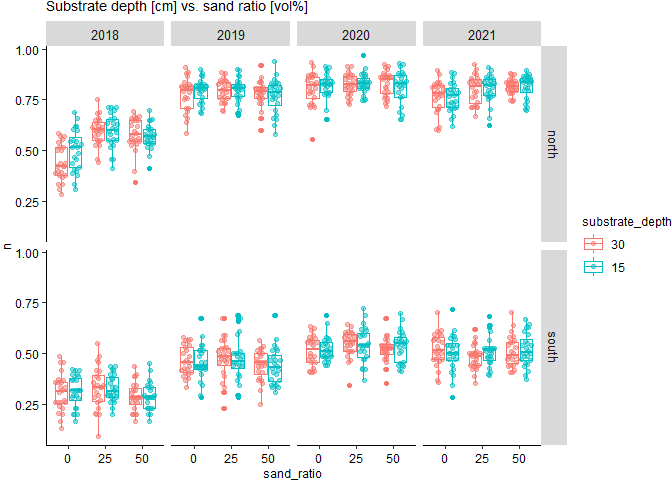<!-- --><!-- -->

### Outliers, zero-inflation, transformations?

    ## # A tibble: 12 × 3
    ## # Groups:   exposition [2]
    ##    exposition site      n
    ##    <fct>      <fct> <int>
    ##  1 north      1        96
    ##  2 north      2        96
    ##  3 north      3        96
    ##  4 north      4        96
    ##  5 north      5        96
    ##  6 north      6        96
    ##  7 south      1        96
    ##  8 south      2        96
    ##  9 south      3        96
    ## 10 south      4        96
    ## 11 south      5        96
    ## 12 south      6        96

<!-- -->

## Models

### Load models (BARG 6.G)

Only here you have to modify the script to compare other models

``` r
load(file = here("outputs", "models", "model_persistence_2.Rdata"))
load(file = here("outputs", "models", "model_persistence_full.Rdata"))
load(file = here("outputs", "models", "model_persistence_2_prior.Rdata"))
# BARG 5.A/B/C
load(file = here("outputs", "models", "model_persistence_2_flat.Rdata"))
m_1 <- m2
m_2 <- m_full
m_prior <- m2_prior
m_flat <- m2_flat
```

### Model specifications (BARG 1.D)

``` r
m_1$formula
## n ~ sand_ratio * target_type * exposition * survey_year_fct + substrate_depth + seed_density + substrate_depth:exposition + seed_density:exposition + substrate_depth:survey_year_fct + seed_density:survey_year_fct + botanist_year + (1 | site/plot)
m_2$formula
## n ~ sand_ratio * target_type * exposition * survey_year_fct + substrate_depth * seed_density + substrate_depth:exposition + seed_density:exposition + substrate_depth:survey_year_fct + seed_density:survey_year_fct + substrate_depth:exposition:survey_year_fct + seed_density:exposition:survey_year_fct + botanist_year + (1 | site/plot)
```

``` r
m_1$family
## 
## Family: gaussian 
## Link function: identity
m_2$family
## 
## Family: gaussian 
## Link function: identity
```

Markov Chain Monte Carlo (MCMC) method used with No-U-Turn Sampler
(NUTS) which is an extension of Hamiltonian Monte Carlo (HMC).

Amount of chains for MCMC

``` r
m_1$fit@sim$chains
## [1] 4
m_2$fit@sim$chains
## [1] 4
```

Total amount of iterations for MCMC

``` r
m_1$fit@sim$iter
## [1] 10000
m_2$fit@sim$iter
## [1] 10000
```

Amount of iterations before burn-in

``` r
m_1$fit@sim$warmup
## [1] 5000
m_2$fit@sim$warmup
## [1] 5000
```

Thinning rate

``` r
m_1$fit@sim$thin
## [1] 2
m_2$fit@sim$thin
## [1] 2
```

### Preparation for analysis

``` r
# Chose variables
variables <- c(
      "Intercept",
      "b_sand_ratio25",
      "b_sand_ratio50",
      "b_substrate_depth15",
      "b_target_typedry_grassland",
      "b_seed_density8",
      "b_expositionsouth",
      "b_survey_year_fct2019",
      "b_survey_year_fct2020",
      "b_survey_year_fct2021",
      "sd_site__Intercept",
      "sd_site:plot__Intercept",
      "sigma"
    )
# Subset draws
posterior1 <- m_1 %>%
  posterior::as_draws() %>%
  posterior::subset_draws(variable = variables)
posterior2 <- m_2 %>%
  posterior::as_draws() %>%
  posterior::subset_draws(variable = variables)
posterior_prior <- m_prior %>%
  posterior::as_draws() %>%
  posterior::subset_draws(variable = variables)
posterior_flat <- m_flat %>%
  posterior::as_draws() %>%
  posterior::subset_draws(variable = variables)
# Long format of draws
hmc_diagnostics1 <- m_1 %>% brms::nuts_params()
hmc_diagnostics2 <- m_2 %>% brms::nuts_params()
y <- sites$n
# Posterior predictive distribution
yrep1 <- m_1 %>% brms::posterior_predict(draws = 500)
yrep2 <- m_2 %>% brms::posterior_predict(draws = 500)
yrep_prior <- m_prior %>% brms::posterior_predict(draws = 500)
# Summary statistics
draws1 <- m_1 %>%
  posterior::as_draws() %>%
  posterior::summarize_draws() %>%
  filter(str_starts(variable, "b_"))
draws2 <- m_2 %>%
  posterior::as_draws() %>%
  posterior::summarize_draws() %>%
  filter(str_starts(variable, "b_"))
```

### Priors (BARG 1.D/E)

#### Possible prior distributions

``` r
brms::get_prior(
  n ~ target_type + sand_ratio + seed_density + substrate_depth +
    exposition + survey_year_fct + botanist_year + (1 | site / plot),
  data = sites
  ) %>%
  select(prior, class, coef, group, source)
```

    ##                   prior     class                                coef     group
    ##                  (flat)         b                                              
    ##                  (flat)         b    botanist_year2018JakobHubersouth          
    ##                  (flat)         b    botanist_year2018SimonReithnorth          
    ##                  (flat)         b    botanist_year2018SimonReithsouth          
    ##                  (flat)         b    botanist_year2019JakobHubernorth          
    ##                  (flat)         b  botanist_year2019LindaWegglersouth          
    ##                  (flat)         b   botanist_year2019MarkusBauersouth          
    ##                  (flat)         b    botanist_year2020JakobHubernorth          
    ##                  (flat)         b    botanist_year2020JakobHubersouth          
    ##                  (flat)         b botanist_year2020KatharinaBecknorth          
    ##                  (flat)         b botanist_year2020KatharinaBecksouth          
    ##                  (flat)         b   botanist_year2021MarkusBauernorth          
    ##                  (flat)         b   botanist_year2021MarkusBauersouth          
    ##                  (flat)         b                     expositionsouth          
    ##                  (flat)         b                        sand_ratio25          
    ##                  (flat)         b                        sand_ratio50          
    ##                  (flat)         b                       seed_density8          
    ##                  (flat)         b                   substrate_depth15          
    ##                  (flat)         b                 survey_year_fct2019          
    ##                  (flat)         b                 survey_year_fct2020          
    ##                  (flat)         b                 survey_year_fct2021          
    ##                  (flat)         b            target_typedry_grassland          
    ##  student_t(3, 0.6, 2.5) Intercept                                              
    ##    student_t(3, 0, 2.5)        sd                                              
    ##                  (flat)        sd                                          site
    ##                  (flat)        sd                           Intercept      site
    ##                  (flat)        sd                                     site:plot
    ##                  (flat)        sd                           Intercept site:plot
    ##    student_t(3, 0, 2.5)     sigma                                              
    ##   source
    ##  default
    ##  default
    ##  default
    ##  default
    ##  default
    ##  default
    ##  default
    ##  default
    ##  default
    ##  default
    ##  default
    ##  default
    ##  default
    ##  default
    ##  default
    ##  default
    ##  default
    ##  default
    ##  default
    ##  default
    ##  default
    ##  default
    ##  default
    ##  default
    ##  default
    ##  default
    ##  default
    ##  default
    ##  default

``` r
plot1 <- ggplot(data = data.frame(x = c(0, 1)), aes(x = x)) +
  stat_function(fun = dbeta, n = 101, args = list(shape1 = 3.5, shape2 = 2.2)) +
  expand_limits(y = 0) +
  ggtitle("Beta distribution for Intercept") + theme_mb()
data <- data.frame(x = c(-1, 1))
plot2 <- ggplot(data, aes(x = x)) +
  stat_function(fun = dnorm, n = 101, args = list(mean = 0, sd = .35)) +
  expand_limits(y = 0) +
  ggtitle("Normal distribution for treatments") + theme_mb()
# See Lemoine 2019 https://doi.org/10.1111/oik.05985
plot3 <- ggplot(data, aes(x = x)) +
  stat_function(fun = dcauchy, n = 101, args = list(location = 0, scale = 1)) +
  expand_limits(y = 0) + ggtitle("Cauchy distribution")  + theme_mb()
# Software standard
plot4 <- ggplot(data, aes(x = x)) +
  stat_function(fun = dstudent_t, args = list(df = 3, mu = 0, sigma = 2.5)) +
  expand_limits(y = 0) +
  ggtitle(expression(Student ~ italic(t) * "-distribution"))  + theme_mb()
(plot1 + plot2) / (plot3 + plot4)
```

<!-- -->

#### Prior summary (BARG 1.D)

``` r
m_1 %>%
  brms::prior_summary(all = FALSE) %>%
  select(prior, class, coef, group, source)
```

    ##                 prior     class                coef group  source
    ##        normal(0, .35)         b                              user
    ##     normal(-.05, .35)         b     expositionsouth          user
    ##     normal(.025, .35)         b        sand_ratio25          user
    ##      normal(.05, .35)         b        sand_ratio50          user
    ##     normal(.025, .35)         b survey_year_fct2019          user
    ##      normal(.05, .35)         b survey_year_fct2020          user
    ##     normal(.075, .35)         b survey_year_fct2021          user
    ##        beta(3.5, 2.2) Intercept                              user
    ##  student_t(3, 0, 2.5)        sd                           default
    ##         cauchy(0, .1)     sigma                              user

#### Prior predictive check (BARG 1.E)

The blue line (observed value) should be in the center of the
distribution of 500 simulated data sets.

``` r
bayesplot::ppc_stat(y, yrep_prior[1:500, ], binwidth = 0.2) +
  coord_cartesian(xlim = c(-1, 1)) + bayesplot::theme_default()
```

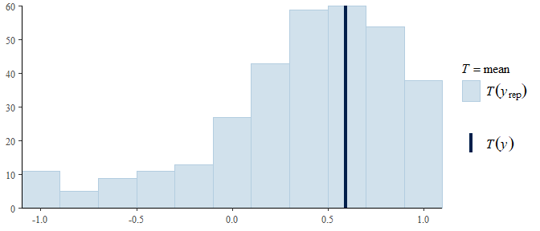<!-- -->

``` r
ppc_stat_grouped(
  y, yrep_prior[1:500, ], group = sites$site, binwidth = 0.5
  ) +
  coord_cartesian(xlim = c(-4, 4)) + bayesplot::theme_default()
```

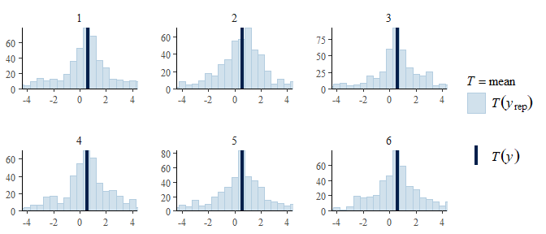<!-- -->

``` r
ppc_stat_grouped(
  y, yrep_prior[1:500, ], group = sites$exposition, binwidth = 0.2
  ) + 
  coord_cartesian(xlim = c(-1, 1)) + bayesplot::theme_default()
```

<!-- -->

``` r
ppc_stat_grouped(
  y, yrep_prior[1:500, ], group = sites$survey_year_fct, binwidth = 0.2
  ) +
  coord_cartesian(xlim = c(-1, 1)) + bayesplot::theme_default()
```

<!-- -->

``` r
ppc_stat_grouped(
  y, yrep_prior[1:500, ], group = sites$target_type, binwidth = 0.2
  ) +
  coord_cartesian(xlim = c(-1, 1)) + bayesplot::theme_default()
```

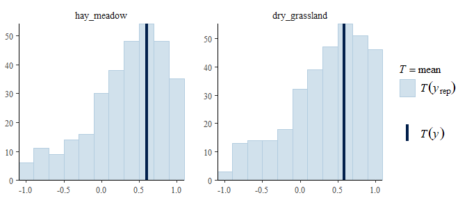<!-- -->

``` r
ppc_stat_grouped(
  y, yrep_prior[1:500, ], group = sites$seed_density, binwidth = 0.2
  ) +
  coord_cartesian(xlim = c(-1, 1)) + bayesplot::theme_default()
```

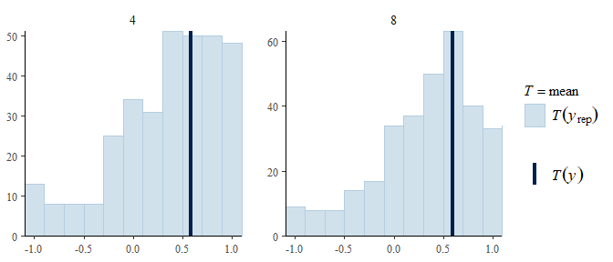<!-- -->

``` r
ppc_stat_grouped(
  y, yrep_prior[1:500, ], group = sites$sand_ratio, binwidth = 0.2
  ) +
  coord_cartesian(xlim = c(-1, 1)) + bayesplot::theme_default()
```

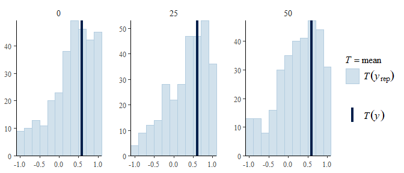<!-- -->

``` r
ppc_stat_grouped(
  y, yrep_prior[1:500, ], group = sites$substrate_depth, binwidth = 0.2
  ) +
  coord_cartesian(xlim = c(-1, 1)) + bayesplot::theme_default()
```

<!-- -->

## Model check

### Check computation (MCMC diagnostics, BARG 2.B/C)

#### Trace plots

The traces of the four chains should overlap each other.

``` r
bayesplot::mcmc_trace(
  posterior1, np = hmc_diagnostics1, facet_args = list(ncol = 2)
  ) + bayesplot::theme_default()
```

    ## No divergences to plot.

<!-- -->

``` r
bayesplot::mcmc_trace(
  posterior2, np = hmc_diagnostics2, facet_args = list(ncol = 2)
  ) + bayesplot::theme_default()
```

    ## No divergences to plot.

<!-- -->

#### Sampling efficency: R-hat (BARG 2.B)

R-hat values should be lower than 1.1.

``` r
m_1 %>% brms::rhat() %>% bayesplot::mcmc_rhat() + bayesplot::theme_default() + theme(axis.text.y = element_blank(), axis.ticks.y = element_blank())
```

<!-- -->

``` r
m_2 %>% brms::rhat() %>% bayesplot::mcmc_rhat() + bayesplot::theme_default() + theme(axis.text.y = element_blank(), axis.ticks.y = element_blank())
```

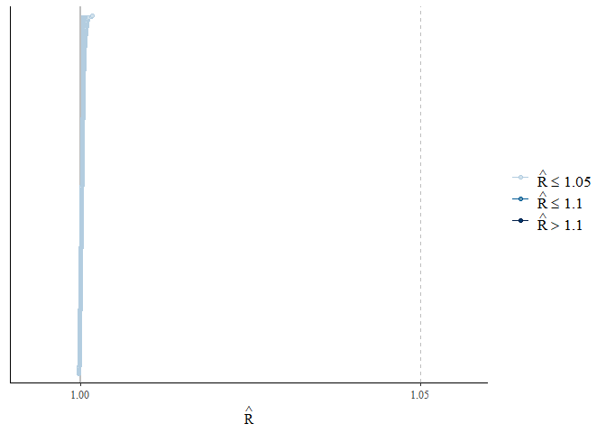<!-- -->

#### Sampling effectiveness: Effective sampling size (ESS) (BARG 2.C)

ESS should be greater than 0.1.

``` r
m_1 %>% brms::neff_ratio() %>% bayesplot::mcmc_neff() + bayesplot::theme_default() + theme(axis.text.y = element_blank(), axis.ticks.y = element_blank())
```

<!-- -->

``` r
m_2 %>% brms::neff_ratio() %>% bayesplot::mcmc_neff() + bayesplot::theme_default() + theme(axis.text.y = element_blank(), axis.ticks.y = element_blank())
```

<!-- -->

#### Pairs plot

If the technical problem of divergent transitions occurs, points would
be highlighted in green.

``` r
m_1 %>% bayesplot::mcmc_pairs(
  off_diag_args = list(size = 1.2),
  pars = c(
    "b_sand_ratio25", "b_sand_ratio50", "b_substrate_depth15",
    "b_target_typedry_grassland", "b_seed_density8",
    "b_expositionsouth", "sigma"
           )
)
```

<!-- -->

``` r
m_2 %>% bayesplot::mcmc_pairs(
  off_diag_args = list(size = 1.2),
  pars = c(
    "b_sand_ratio25", "b_sand_ratio50", "b_substrate_depth15",
    "b_target_typedry_grassland", "b_seed_density8",
    "b_expositionsouth", "sigma"
           )
)
```

<!-- -->

#### Parallel coordinate plot

If the technical problem of divergent transitions occurs, points would
be highlighted in green.

``` r
posterior1 %>% bayesplot::mcmc_parcoord(np = hmc_diagnostics1) + bayesplot::theme_default() + theme(axis.text.x = element_text(angle = 45))
```

<!-- -->

``` r
posterior2 %>% bayesplot::mcmc_parcoord(np = hmc_diagnostics2) + bayesplot::theme_default() + theme(axis.text.x = element_text(angle = 45))
```

<!-- -->

#### Autocorrelation check

Autocorrelation should go down to zero very fast.

``` r
posterior1 %>% bayesplot::mcmc_acf(lags = 10) + bayesplot::theme_default()
```

<!-- -->

``` r
posterior2 %>% bayesplot::mcmc_acf(lags = 10) + bayesplot::theme_default()
```

<!-- -->

### Posterior predictive check (BARG 3.A)

#### Kernel density

The kernel density estimate of the observed data (dark line) compared
with estimates for 50 simulated data sets drawn from the posterior
predictive distribution (thinner and lighter lines). The dark line
should be near the simulated curves.

``` r
p1 <- bayesplot::ppc_dens_overlay(y, yrep1[1:50, ]) + bayesplot::theme_default()
p2 <- bayesplot::ppc_dens_overlay(y, yrep2[1:50, ]) + bayesplot::theme_default()
p1 / p2
```

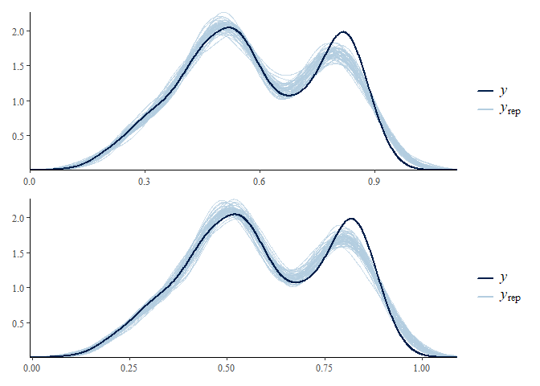<!-- -->

``` r
p1 <- ppc_dens_overlay_grouped(y, yrep1[1:50, ], group = sites$site) + bayesplot::theme_default()
p2 <- ppc_dens_overlay_grouped(y, yrep2[1:50, ], group = sites$site) + bayesplot::theme_default()
p1 / p2
```

<!-- -->

``` r
p1 <- ppc_dens_overlay_grouped(y, yrep1[1:50, ], group = sites$exposition) + bayesplot::theme_default()
p2 <- ppc_dens_overlay_grouped(y, yrep2[1:50, ], group = sites$exposition) + bayesplot::theme_default()
p1 / p2
```

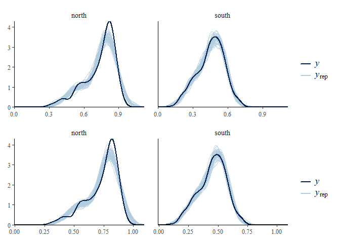<!-- -->

``` r
p1 <- ppc_dens_overlay_grouped(y, yrep1[1:50, ], group = sites$survey_year_fct) + bayesplot::theme_default()
p2 <- ppc_dens_overlay_grouped(y, yrep2[1:50, ], group = sites$survey_year_fct) + bayesplot::theme_default()
p1 / p2
```

<!-- -->

``` r
p1 <- ppc_dens_overlay_grouped(y, yrep1[1:50, ], group = sites$target_type) + bayesplot::theme_default()
p2 <- ppc_dens_overlay_grouped(y, yrep2[1:50, ], group = sites$target_type) + bayesplot::theme_default()
p1 / p2
```

<!-- -->

``` r
p1 <- ppc_dens_overlay_grouped(y, yrep1[1:50, ], group = sites$seed_density) + bayesplot::theme_default()
p2 <- ppc_dens_overlay_grouped(y, yrep2[1:50, ], group = sites$seed_density) + bayesplot::theme_default()
p1 / p2
```

<!-- -->

``` r
p1 <- ppc_dens_overlay_grouped(y, yrep1[1:50, ], group = sites$sand_ratio) + bayesplot::theme_default()
p2 <- ppc_dens_overlay_grouped(y, yrep2[1:50, ], group = sites$sand_ratio) + bayesplot::theme_default()
p1 / p2
```

<!-- -->

``` r
p1 <- ppc_dens_overlay_grouped(y, yrep1[1:50, ], group = sites$substrate_depth) + bayesplot::theme_default()
p2 <- ppc_dens_overlay_grouped(y, yrep2[1:50, ], group = sites$substrate_depth) + bayesplot::theme_default()
p1 / p2
```

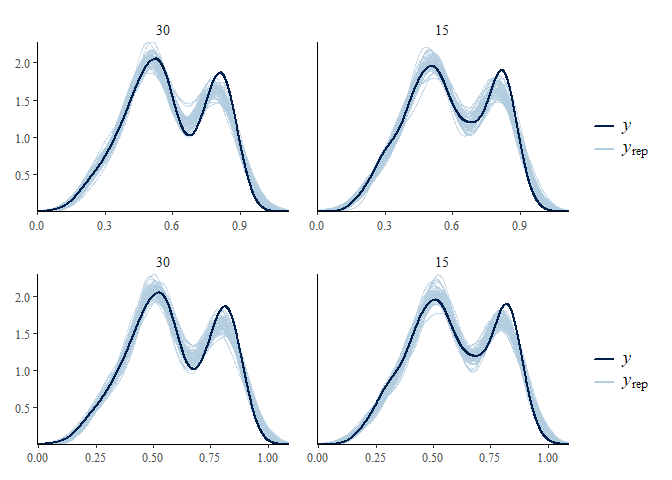<!-- -->

#### Histograms of statistics skew

The dark line (computed from the observed data) should be in the center
of the posterior predictive distribution.

``` r
p1 <- bayesplot::ppc_stat(y, yrep1, binwidth = 0.001) + bayesplot::theme_default()
p2 <- bayesplot::ppc_stat(y, yrep2, binwidth = 0.001) + bayesplot::theme_default()
p1 / p2
```

<!-- -->

``` r
p1 <- ppc_stat_grouped(y, yrep1, group = sites$site, binwidth = 0.001) + bayesplot::theme_default()
p2 <- ppc_stat_grouped(y, yrep2, group = sites$site, binwidth = 0.001) + bayesplot::theme_default()
p1 / p2
```

<!-- -->

``` r
p1 <- ppc_stat_grouped(y, yrep1, group = sites$exposition, binwidth = 0.001) + bayesplot::theme_default()
p2 <- ppc_stat_grouped(y, yrep2, group = sites$exposition, binwidth = 0.001) + bayesplot::theme_default()
p1 / p2
```

<!-- -->

``` r
p1 <- ppc_stat_grouped(y, yrep1, group = sites$survey_year_fct, binwidth = 0.001) + bayesplot::theme_default()
p2 <- ppc_stat_grouped(y, yrep2, group = sites$survey_year_fct, binwidth = 0.001) + bayesplot::theme_default()
p1 / p2
```

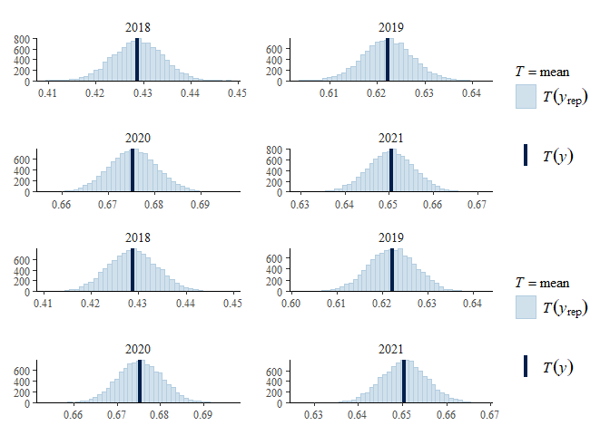<!-- -->

``` r
p1 <- ppc_stat_grouped(y, yrep1, group = sites$target_type, binwidth = 0.001) + bayesplot::theme_default()
p2 <- ppc_stat_grouped(y, yrep2, group = sites$target_type, binwidth = 0.001) + bayesplot::theme_default()
p1 / p2
```

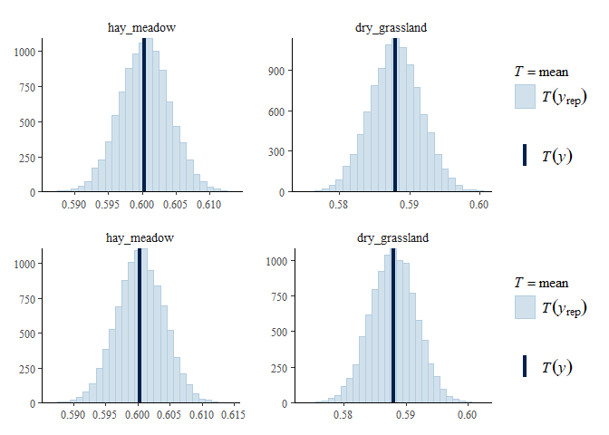<!-- -->

``` r
p1 <- ppc_stat_grouped(y, yrep1, group = sites$seed_density, binwidth = 0.001) + bayesplot::theme_default()
p2 <- ppc_stat_grouped(y, yrep2, group = sites$seed_density, binwidth = 0.001) + bayesplot::theme_default()
p1 / p2
```

<!-- -->

``` r
p1 <- ppc_stat_grouped(y, yrep1, group = sites$sand_ratio, binwidth = 0.001) + bayesplot::theme_default()
p2 <- ppc_stat_grouped(y, yrep2, group = sites$sand_ratio, binwidth = 0.001) + bayesplot::theme_default()
p1 / p2
```

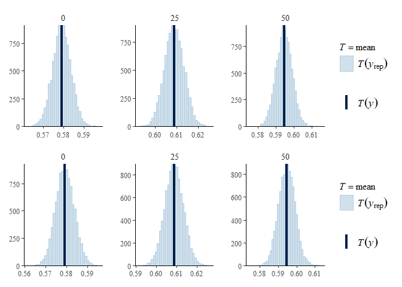<!-- -->

``` r
p1 <- ppc_stat_grouped(y, yrep1, group = sites$substrate_depth, binwidth = 0.001) + bayesplot::theme_default()
p2 <- ppc_stat_grouped(y, yrep2, group = sites$substrate_depth, binwidth = 0.001) + bayesplot::theme_default()
p1 / p2
```

<!-- -->

#### LOO cross-validation (Leave one out)

All Pareto-k estimates should be \< 0.7.

``` r
loo1 <- m_1 %>% brms::loo(save_psis = TRUE, moment_match = TRUE)
```

    ## Warning: Some Pareto k diagnostic values are slightly high. See help('pareto-k-diagnostic') for details.

``` r
loo2 <- m_2 %>% brms::loo(save_psis = TRUE, moment_match = TRUE)
```

    ## Warning: Some Pareto k diagnostic values are slightly high. See help('pareto-k-diagnostic') for details.

``` r
loo1
```

    ## 
    ## Computed from 10000 by 1152 log-likelihood matrix
    ## 
    ##          Estimate   SE
    ## elpd_loo   1450.3 25.8
    ## p_loo       200.0  8.1
    ## looic     -2900.6 51.6
    ## ------
    ## Monte Carlo SE of elpd_loo is 0.3.
    ## 
    ## Pareto k diagnostic values:
    ##                          Count Pct.    Min. n_eff
    ## (-Inf, 0.5]   (good)     1134  98.4%   727       
    ##  (0.5, 0.7]   (ok)         18   1.6%   580       
    ##    (0.7, 1]   (bad)         0   0.0%   <NA>      
    ##    (1, Inf)   (very bad)    0   0.0%   <NA>      
    ## 
    ## All Pareto k estimates are ok (k < 0.7).
    ## See help('pareto-k-diagnostic') for details.

``` r
loo2
```

    ## 
    ## Computed from 10000 by 1152 log-likelihood matrix
    ## 
    ##          Estimate   SE
    ## elpd_loo   1443.0 25.7
    ## p_loo       206.0  8.3
    ## looic     -2886.1 51.5
    ## ------
    ## Monte Carlo SE of elpd_loo is 0.3.
    ## 
    ## Pareto k diagnostic values:
    ##                          Count Pct.    Min. n_eff
    ## (-Inf, 0.5]   (good)     1131  98.2%   855       
    ##  (0.5, 0.7]   (ok)         21   1.8%   332       
    ##    (0.7, 1]   (bad)         0   0.0%   <NA>      
    ##    (1, Inf)   (very bad)    0   0.0%   <NA>      
    ## 
    ## All Pareto k estimates are ok (k < 0.7).
    ## See help('pareto-k-diagnostic') for details.

``` r
plot(loo1)
```

<!-- -->

``` r
plot(loo2)
```

<!-- -->

Computed leave one out probability integral transform (LOO PIT; dark
curve) versus the posterior predictive distribution (light curves). The
LOO PIT curve should be within the range of light curves.

``` r
p1 <- bayesplot::ppc_loo_pit_overlay(y, yrep1, lw = weights(loo1$psis_object)) + bayesplot::theme_default()
p2 <- bayesplot::ppc_loo_pit_overlay(y, yrep2, lw = weights(loo2$psis_object)) + bayesplot::theme_default()
p1 / p2
```

<!-- -->

### DHARMa

``` r
m_1 %>% DHARMa.helpers::dh_check_brms(integer = TRUE)
```

<!-- -->

``` r
m_2 %>% DHARMa.helpers::dh_check_brms(integer = TRUE)
```

<!-- -->

## Model comparison

### Conditional <i>R</i><sup>2</sup> values

``` r
m_1 %>% brms::bayes_R2(
  probs = c(0.05, 0.5, 0.95), re_formula =  ~ (1 | site / plot)
  )
##     Estimate   Est.Error        Q5       Q50       Q95
## R2 0.8946481 0.003289245 0.8890445 0.8947558 0.8998412
m_2 %>% brms::bayes_R2(
  probs = c(0.05, 0.5, 0.95), re_formula =  ~ (1 | site / plot)
  )
##     Estimate   Est.Error        Q5       Q50       Q95
## R2 0.8941931 0.003385512 0.8884302 0.8943477 0.8995537
```

### Marginal <i>R</i><sup>2</sup> values

``` r
m_1 %>% brms::bayes_R2(
  probs = c(0.05, 0.5, 0.95), re_formula = 1 ~ 1
  )
##     Estimate   Est.Error        Q5       Q50     Q95
## R2 0.8590875 0.003525482 0.8528837 0.8592907 0.86449
m_2 %>% brms::bayes_R2(
  probs = c(0.05, 0.5, 0.95), re_formula = 1 ~ 1
  )
##     Estimate   Est.Error        Q5       Q50       Q95
## R2 0.8587757 0.003514043 0.8527214 0.8589702 0.8641909
```

### Bayes factor (BARG 3.C)

``` r
bayes_factor <- brms::bayes_factor(m_1, m_2)
```

``` r
bayes_factor
```

    ## Estimated Bayes factor in favor of m_1 over m_2: 526633636.27329

## Posterior distributions (BARG 3.B)

### Forest plot of effect sizes (BARG 2.B/5.B)

``` r
combined_models <- bind_rows(
  bayesplot::mcmc_intervals_data(
    posterior1, prob = 0.66, prob_outer = 0.95
    ) %>%
    mutate(model = "m_1"),
  bayesplot::mcmc_intervals_data(
    posterior2, prob = 0.66, prob_outer = 0.95
    ) %>%
    mutate(model = "m_2"),
  bayesplot::mcmc_intervals_data(
    posterior_flat, prob = 0.66, prob_outer = 0.95
    ) %>%
    mutate(model = "m_flat"),
  bayesplot::mcmc_intervals_data(
    posterior_prior, prob = 0.66, prob_outer = 0.95
    ) %>%
    mutate(model = "m_prior")
  )

pos <- position_nudge(
  y = if_else(
    combined_models$model == "m_2", -.2, if_else(
      combined_models$model == "m_flat", -.4, if_else(
        combined_models$model == "m_prior", -.6, 0
        )
      )
    )
  )

ggplot(
  data = combined_models,
  aes(x = m, y = forcats::fct_rev(factor(parameter)), color = model)
  ) +
  geom_vline(xintercept = 0, color = "grey") +
  geom_linerange(aes(xmin = l, xmax = h), position = pos, linewidth = 2) +
  geom_linerange(aes(xmin = ll, xmax = hh), position = pos) +
  geom_point(position = pos, color = "black") +
  coord_cartesian(xlim = c(-.25, .65)) +
  bayesplot::theme_default() +
  ggtitle("Posterior distbributions (mean, CI66, CI95)")
```

<!-- -->

### Effect sizes

Effect sizes of chosen model just to get exact values of means etc. if
necessary.

``` r
posterior1 %>%
  posterior::summarize_draws() %>%
  knitr::kable()
```

| variable                   |     mean |   median |      sd |     mad |       q5 |    q95 | rhat | ess_bulk | ess_tail |
|:---------------------------|---------:|---------:|--------:|--------:|---------:|-------:|-----:|---------:|---------:|
| Intercept                  |    0.594 |    0.594 |  0.0106 | 0.00832 |    0.578 |  0.611 | 1.00 |   8228\. |   7760\. |
| b_sand_ratio25             |    0.163 |    0.163 |  0.0199 |  0.0202 |    0.130 |  0.195 | 1.00 |   5611\. |   7468\. |
| b_sand_ratio50             |    0.124 |    0.124 |  0.0198 |  0.0199 |   0.0914 |  0.156 | 1.00 |   6289\. |   7984\. |
| b_substrate_depth15        |   0.0101 |  0.00998 | 0.00987 | 0.00975 | -0.00598 | 0.0266 | 1.00 |   9754\. |   8890\. |
| b_target_typedry_grassland |  0.00698 |  0.00695 |  0.0199 |  0.0195 |  -0.0261 | 0.0398 | 1.00 |   4858\. |   7268\. |
| b_seed_density8            | -0.00353 | -0.00355 | 0.00996 | 0.00983 |  -0.0200 | 0.0127 | 1.00 |   9447\. |   8704\. |
| b_expositionsouth          |   -0.162 |   -0.163 |   0.167 |   0.168 |   -0.435 |  0.114 | 1.00 |   9152\. |   8692\. |
| b_survey_year_fct2019      |    0.148 |    0.147 |   0.220 |   0.220 |   -0.218 |  0.509 | 1.00 |   9615\. |   8491\. |
| b_survey_year_fct2020      |    0.226 |    0.226 |   0.184 |   0.183 |  -0.0752 |  0.523 | 1.00 |   8938\. |   8311\. |
| b_survey_year_fct2021      |    0.180 |    0.180 |   0.225 |   0.221 |   -0.199 |  0.550 | 1.00 |   9086\. |   7947\. |
| sd_site\_\_Intercept       |   0.0214 |   0.0185 |  0.0119 | 0.00767 |  0.00967 | 0.0428 | 1.00 |   5477\. |   6430\. |
| sd_site:plot\_\_Intercept  |   0.0338 |   0.0337 | 0.00279 | 0.00279 |   0.0292 | 0.0384 | 1.00 |   6023\. |   8686\. |
| sigma                      |   0.0621 |   0.0620 | 0.00152 | 0.00154 |   0.0596 | 0.0646 | 1.00 |   7336\. |   8681\. |

``` r
emm <- m_1 %>% emmeans(
  revpairwise ~ target_type + sand_ratio | exposition | survey_year_fct,
  type = "response"
  )
emm$emmeans
```

    ## exposition = north, survey_year_fct = 2018:
    ##  target_type   sand_ratio emmean lower.HPD upper.HPD
    ##  hay_meadow    0           0.469     0.436     0.504
    ##  dry_grassland 0           0.476     0.440     0.508
    ##  hay_meadow    25          0.631     0.597     0.665
    ##  dry_grassland 25          0.559     0.525     0.593
    ##  hay_meadow    50          0.593     0.558     0.626
    ##  dry_grassland 50          0.555     0.520     0.589
    ## 
    ## exposition = south, survey_year_fct = 2018:
    ##  target_type   sand_ratio emmean lower.HPD upper.HPD
    ##  hay_meadow    0           0.309     0.273     0.343
    ##  dry_grassland 0           0.329     0.296     0.365
    ##  hay_meadow    25          0.309     0.275     0.344
    ##  dry_grassland 25          0.369     0.336     0.405
    ##  hay_meadow    50          0.280     0.245     0.314
    ##  dry_grassland 50          0.318     0.283     0.352
    ## 
    ## exposition = north, survey_year_fct = 2019:
    ##  target_type   sand_ratio emmean lower.HPD upper.HPD
    ##  hay_meadow    0           0.808     0.773     0.842
    ##  dry_grassland 0           0.762     0.728     0.798
    ##  hay_meadow    25          0.837     0.803     0.870
    ##  dry_grassland 25          0.756     0.722     0.791
    ##  hay_meadow    50          0.788     0.753     0.822
    ##  dry_grassland 50          0.761     0.728     0.797
    ## 
    ## exposition = south, survey_year_fct = 2019:
    ##  target_type   sand_ratio emmean lower.HPD upper.HPD
    ##  hay_meadow    0           0.457     0.422     0.493
    ##  dry_grassland 0           0.433     0.399     0.469
    ##  hay_meadow    25          0.460     0.423     0.496
    ##  dry_grassland 25          0.450     0.417     0.489
    ##  hay_meadow    50          0.421     0.384     0.456
    ##  dry_grassland 50          0.419     0.385     0.457
    ## 
    ## exposition = north, survey_year_fct = 2020:
    ##  target_type   sand_ratio emmean lower.HPD upper.HPD
    ##  hay_meadow    0           0.828     0.795     0.864
    ##  dry_grassland 0           0.797     0.761     0.831
    ##  hay_meadow    25          0.851     0.816     0.884
    ##  dry_grassland 25          0.805     0.770     0.840
    ##  hay_meadow    50          0.841     0.807     0.875
    ##  dry_grassland 50          0.800     0.767     0.836
    ## 
    ## exposition = south, survey_year_fct = 2020:
    ##  target_type   sand_ratio emmean lower.HPD upper.HPD
    ##  hay_meadow    0           0.517     0.483     0.553
    ##  dry_grassland 0           0.520     0.485     0.553
    ##  hay_meadow    25          0.543     0.507     0.576
    ##  dry_grassland 25          0.548     0.513     0.583
    ##  hay_meadow    50          0.501     0.467     0.536
    ##  dry_grassland 50          0.555     0.520     0.589
    ## 
    ## exposition = north, survey_year_fct = 2021:
    ##  target_type   sand_ratio emmean lower.HPD upper.HPD
    ##  hay_meadow    0           0.772     0.737     0.806
    ##  dry_grassland 0           0.756     0.722     0.791
    ##  hay_meadow    25          0.819     0.786     0.853
    ##  dry_grassland 25          0.785     0.750     0.818
    ##  hay_meadow    50          0.821     0.785     0.854
    ##  dry_grassland 50          0.807     0.773     0.841
    ## 
    ## exposition = south, survey_year_fct = 2021:
    ##  target_type   sand_ratio emmean lower.HPD upper.HPD
    ##  hay_meadow    0           0.528     0.494     0.564
    ##  dry_grassland 0           0.495     0.462     0.529
    ##  hay_meadow    25          0.486     0.451     0.520
    ##  dry_grassland 25          0.508     0.474     0.544
    ##  hay_meadow    50          0.512     0.478     0.547
    ##  dry_grassland 50          0.518     0.484     0.552
    ## 
    ## Results are averaged over the levels of: substrate_depth, seed_density, botanist_year 
    ## Point estimate displayed: median 
    ## HPD interval probability: 0.95

# Session info (BARG 2.A/6.A/6.B)

    ## R version 4.2.3 (2023-03-15 ucrt)
    ## Platform: x86_64-w64-mingw32/x64 (64-bit)
    ## Running under: Windows 10 x64 (build 22621)
    ## 
    ## Matrix products: default
    ## 
    ## locale:
    ## [1] LC_COLLATE=German_Germany.utf8  LC_CTYPE=German_Germany.utf8   
    ## [3] LC_MONETARY=German_Germany.utf8 LC_NUMERIC=C                   
    ## [5] LC_TIME=German_Germany.utf8    
    ## 
    ## attached base packages:
    ## [1] stats     graphics  grDevices utils     datasets  methods   base     
    ## 
    ## other attached packages:
    ##  [1] emmeans_1.8.4-1           loo_2.5.1                
    ##  [3] bayesplot_1.10.0          DHARMa.helpers_0.0.0.9000
    ##  [5] brms_2.18.0               Rcpp_1.0.10              
    ##  [7] patchwork_1.1.2           ggbeeswarm_0.7.1         
    ##  [9] lubridate_1.9.2           forcats_1.0.0            
    ## [11] stringr_1.5.0             dplyr_1.1.0              
    ## [13] purrr_1.0.1               readr_2.1.4              
    ## [15] tidyr_1.3.0               tibble_3.1.8             
    ## [17] ggplot2_3.4.1             tidyverse_2.0.0          
    ## [19] here_1.0.1               
    ## 
    ## loaded via a namespace (and not attached):
    ##   [1] uuid_1.1-0           backports_1.4.1      plyr_1.8.8          
    ##   [4] igraph_1.4.1         sp_1.6-0             splines_4.2.3       
    ##   [7] crosstalk_1.2.0      gap.datasets_0.0.5   rncl_0.8.7          
    ##  [10] rstantools_2.2.0     inline_0.3.19        digest_0.6.31       
    ##  [13] foreach_1.5.2        htmltools_0.5.4      fansi_1.0.4         
    ##  [16] magrittr_2.0.3       checkmate_2.1.0      DHARMa_0.4.6        
    ##  [19] doParallel_1.0.17    cluster_2.1.4        tzdb_0.3.0          
    ##  [22] RcppParallel_5.1.7   matrixStats_0.63.0   vroom_1.6.1         
    ##  [25] xts_0.13.0           timechange_0.2.0     prettyunits_1.1.1   
    ##  [28] jpeg_0.1-10          colorspace_2.1-0     xfun_0.37           
    ##  [31] callr_3.7.3          crayon_1.5.2         jsonlite_1.8.4      
    ##  [34] lme4_1.1-31          phylobase_0.8.10     iterators_1.0.14    
    ##  [37] ape_5.7              zoo_1.8-11           glue_1.6.2          
    ##  [40] gtable_0.3.1         seqinr_4.2-23        V8_4.2.2            
    ##  [43] distributional_0.3.1 pkgbuild_1.4.0       rstan_2.26.13       
    ##  [46] adegraphics_1.0-17   abind_1.4-5          scales_1.2.1        
    ##  [49] mvtnorm_1.1-3        miniUI_0.1.1.1       progress_1.2.2      
    ##  [52] xtable_1.8-4         bit_4.0.5            stats4_4.2.3        
    ##  [55] StanHeaders_2.26.13  DT_0.27              httr_1.4.5          
    ##  [58] htmlwidgets_1.6.1    threejs_0.3.3        RColorBrewer_1.1-3  
    ##  [61] posterior_1.4.0      ellipsis_0.3.2       XML_3.99-0.13       
    ##  [64] pkgconfig_2.0.3      farver_2.1.1         qgam_1.3.4          
    ##  [67] deldir_1.0-6         utf8_1.2.3           tidyselect_1.2.0    
    ##  [70] labeling_0.4.2       rlang_1.0.6          reshape2_1.4.4      
    ##  [73] later_1.3.0          munsell_0.5.0        tools_4.2.3         
    ##  [76] cli_3.6.0            generics_0.1.3       ade4_1.7-22         
    ##  [79] evaluate_0.20        fastmap_1.1.1        yaml_2.3.7          
    ##  [82] processx_3.8.0       knitr_1.42           bit64_4.0.5         
    ##  [85] nlme_3.1-162         mime_0.12            adegenet_2.1.10     
    ##  [88] xml2_1.3.3           gap_1.5-1            compiler_4.2.3      
    ##  [91] shinythemes_1.2.0    rstudioapi_0.14      beeswarm_0.4.0      
    ##  [94] curl_5.0.0           png_0.1-8            RNeXML_2.4.11       
    ##  [97] stringi_1.7.12       highr_0.10           ps_1.7.2            
    ## [100] Brobdingnag_1.2-9    lattice_0.20-45      Matrix_1.5-3        
    ## [103] nloptr_2.0.3         markdown_1.5         permute_0.9-7       
    ## [106] vegan_2.6-4          shinyjs_2.1.0        tensorA_0.36.2      
    ## [109] vctrs_0.5.2          pillar_1.8.1         lifecycle_1.0.3     
    ## [112] bridgesampling_1.1-2 estimability_1.4.1   httpuv_1.6.9        
    ## [115] R6_2.5.1             latticeExtra_0.6-30  promises_1.2.0.1    
    ## [118] KernSmooth_2.23-20   gridExtra_2.3        vipor_0.4.5         
    ## [121] codetools_0.2-19     boot_1.3-28.1        colourpicker_1.2.0  
    ## [124] MASS_7.3-58.2        gtools_3.9.4         rprojroot_2.0.3     
    ## [127] withr_2.5.0          shinystan_2.6.0      mgcv_1.8-41         
    ## [130] parallel_4.2.3       hms_1.1.2            grid_4.2.3          
    ## [133] coda_0.19-4          minqa_1.2.5          rmarkdown_2.20      
    ## [136] shiny_1.7.4          base64enc_0.1-3      dygraphs_1.1.1.6    
    ## [139] interp_1.1-3
