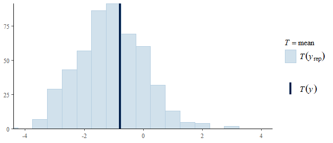
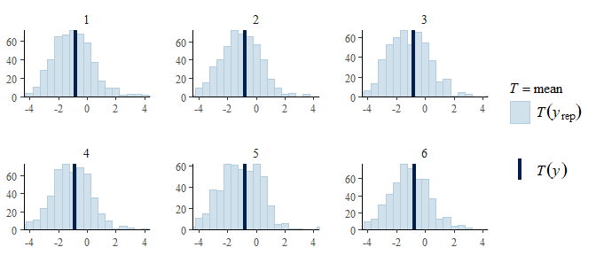
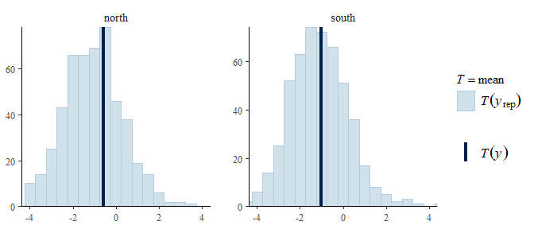
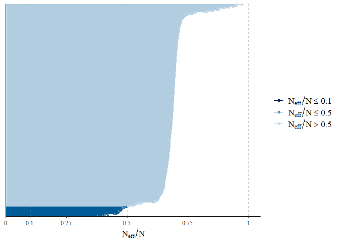
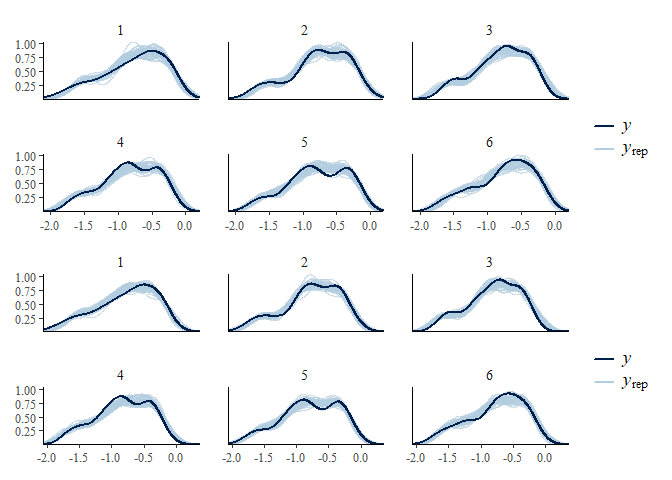
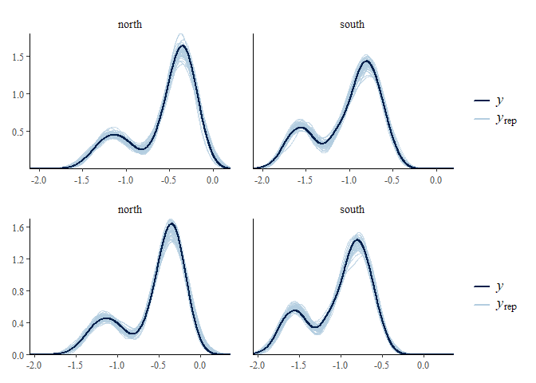
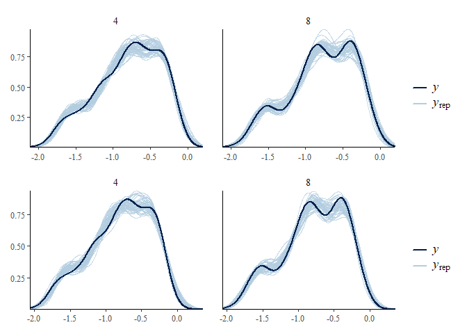
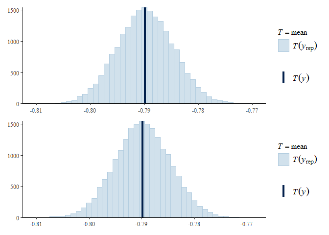
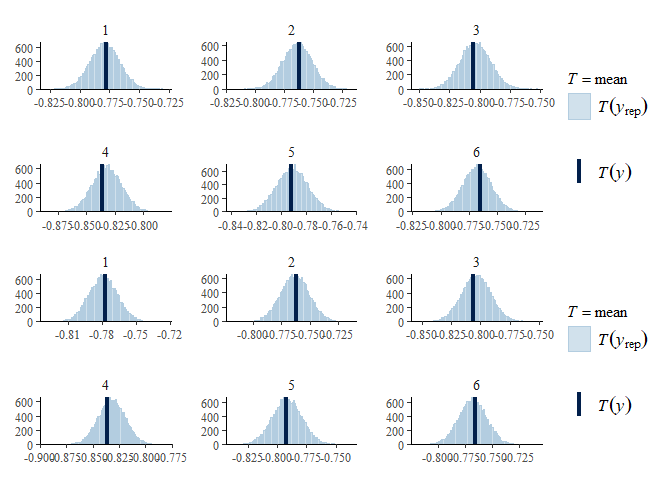
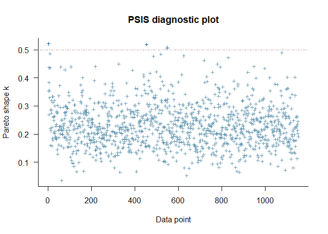

Analysis of Bauer et al. (2023) bioRxiv: <br> Recovery completeness
================
<b>Markus Bauer</b> <br>
<b>2023-03-06</b>

- <a href="#preparation" id="toc-preparation">Preparation</a>
- <a href="#statistics" id="toc-statistics">Statistics</a>
  - <a href="#data-exploration" id="toc-data-exploration">Data
    exploration</a>
    - <a href="#graphs-of-raw-data" id="toc-graphs-of-raw-data">Graphs of raw
      data</a>
    - <a href="#outliers-zero-inflation-transformations"
      id="toc-outliers-zero-inflation-transformations">Outliers,
      zero-inflation, transformations?</a>
  - <a href="#models" id="toc-models">Models</a>
    - <a href="#load-models-barg-6g" id="toc-load-models-barg-6g">Load models
      (BARG 6.G)</a>
    - <a href="#model-specifications-barg-1d"
      id="toc-model-specifications-barg-1d">Model specifications (BARG
      1.D)</a>
    - <a href="#preparation-for-analysis"
      id="toc-preparation-for-analysis">Preparation for analysis</a>
    - <a href="#priors-barg-1de" id="toc-priors-barg-1de">Priors (BARG
      1.D/E)</a>
  - <a href="#model-check" id="toc-model-check">Model check</a>
    - <a href="#check-computation-mcmc-diagnostics-barg-2bc"
      id="toc-check-computation-mcmc-diagnostics-barg-2bc">Check computation
      (MCMC diagnostics, BARG 2.B/C)</a>
    - <a href="#autocorrelation-check"
      id="toc-autocorrelation-check">Autocorrelation check</a>
    - <a href="#posterior-predictive-check-barg-3a"
      id="toc-posterior-predictive-check-barg-3a">Posterior predictive check
      (BARG 3.A)</a>
    - <a href="#dharma" id="toc-dharma">DHARMa</a>
  - <a href="#model-comparison" id="toc-model-comparison">Model
    comparison</a>
    - <a href="#conditional-r2-values"
      id="toc-conditional-r2-values">Conditional <i>R</i><sup>2</sup>
      values</a>
    - <a href="#marginal-r2-values" id="toc-marginal-r2-values">Marginal
      <i>R</i><sup>2</sup> values</a>
    - <a href="#bayes-factor-barg-3c" id="toc-bayes-factor-barg-3c">Bayes
      factor (BARG 3.C)</a>
  - <a href="#posterior-distributions-barg-3b"
    id="toc-posterior-distributions-barg-3b">Posterior distributions (BARG
    3.B)</a>
    - <a href="#forest-plot-barg-3b5b" id="toc-forest-plot-barg-3b5b">Forest
      plot (BARG 3.B/5.B)</a>
    - <a href="#effect-sizes" id="toc-effect-sizes">Effect sizes</a>
- <a href="#session-info-barg-2a6a6b"
  id="toc-session-info-barg-2a6a6b">Session info (BARG 2.A/6.A/6.B)</a>

<br/> <br/> <b>Markus Bauer</b>

Technichal University of Munich, TUM School of Life Sciences, Chair of
Restoration Ecology, Emil-Ramann-Straße 6, 85354 Freising, Germany

<markus1.bauer@tum.de>

ORCiD ID: [0000-0001-5372-4174](https://orcid.org/0000-0001-5372-4174)
<br> [Google
Scholar](https://scholar.google.de/citations?user=oHhmOkkAAAAJ&hl=de&oi=ao)
<br> GitHub: [markus1bauer](https://github.com/markus1bauer)

To compare different models, you only have to change the models in
section `Load models`

# Preparation

Recovery completeness sensu Rydgren et al. (2019) J Appl Ecol [DOI:
10.1111/1365-2664.13254](https://doi.org/10.1111/1365-2664.13254)

Bayesian analysis motivated by Applestein et al. (2021) Restor Ecol
[DOI: 10.1111/rec.13596](https://doi.org/10.1111/rec.13596)

Analysis guided by <br> <b>BARG</b> (Bayesian Analysis Reporting
Guidelines): Kruschke (2021) Nat Hum Behav [DOI:
10.1038/s41562-021-01177-7](https://doi.org/10.1038/s41562-021-01177-7)
<br> Model check: Gabry et al. (2019) J R Stat Soc A Stat [DOI:
10.1111/rssa.12378](https://doi.org/10.1111/rssa.12378) <br> Priors:
Lemoine (2019) Oikos [DOI:
10.1111/oik.05985](https://doi.org/10.1111/oik.05985) <br> Model check:
Deapoli & Schoot (2017) Psychol Methods [DOI:
10.1037/met0000065](https://doi.org/10.1037/met0000065)

#### Packages

``` r
library(here)
library(tidyverse)
library(ggbeeswarm)
library(patchwork)
library(brms)
library(DHARMa.helpers)
library(bayesplot)
library(loo)
library(emmeans)
```

#### Load data

``` r
sites <- read_csv(
  here("data", "processed", "data_processed_sites_nmds.csv"),
  col_names = TRUE, na = c("na", "NA", ""),
  col_types = cols(
    .default = "?",
    id = "f",
    plot = "f",
    site = "f",
    exposition = col_factor(levels = c("north", "south", "other")),
    sand_ratio = "f",
    substrate_depth = col_factor(levels = c("30", "15")),
    target_type = col_factor(levels = c(
      "hay_meadow", "dry_grassland", "other"
      )),
    seed_density = "f"
    )
  ) %>%
  filter(reference == "2018" | reference == "2019" | reference == "2020" |
           reference == "2021") %>%
  mutate(
    survey_year_fct = factor(survey_year),
    survey_year = as.numeric(survey_year),
    botanist_year = str_c(survey_year, botanist, exposition, sep = " "),
    botanist_year = factor(botanist_year),
    n = recovery_completeness
    )
sites
```

    ## # A tibble: 1,152 × 26
    ##    id         plot  site  esy   refere…¹ expos…² sand_…³ subst…⁴ targe…⁵ seed_…⁶
    ##    <fct>      <fct> <fct> <chr> <chr>    <fct>   <fct>   <fct>   <fct>   <fct>  
    ##  1 L1_01_2018 L1_01 1     V37   2018     south   0       15      hay_me… 4      
    ##  2 L1_01_2019 L1_01 1     V37   2019     south   0       15      hay_me… 4      
    ##  3 L1_01_2020 L1_01 1     V37   2020     south   0       15      hay_me… 4      
    ##  4 L1_01_2021 L1_01 1     R22   2021     south   0       15      hay_me… 4      
    ##  5 L1_02_2018 L1_02 1     V37   2018     south   0       15      dry_gr… 4      
    ##  6 L1_02_2019 L1_02 1     V37   2019     south   0       15      dry_gr… 4      
    ##  7 L1_02_2020 L1_02 1     V37   2020     south   0       15      dry_gr… 4      
    ##  8 L1_02_2021 L1_02 1     R22   2021     south   0       15      dry_gr… 4      
    ##  9 L1_03_2018 L1_03 1     V37   2018     south   0       15      dry_gr… 8      
    ## 10 L1_03_2019 L1_03 1     R     2019     south   0       15      dry_gr… 8      
    ## # … with 1,142 more rows, 16 more variables: survey_year <dbl>,
    ## #   longitude <dbl>, latitude <dbl>, elevation <dbl>, plot_size <dbl>,
    ## #   botanist <chr>, givd_id <chr>, source <chr>, NMDS1 <dbl>, NMDS2 <dbl>,
    ## #   mean_reference <dbl>, sd_reference <dbl>, recovery_completeness <dbl>,
    ## #   survey_year_fct <fct>, botanist_year <fct>, n <dbl>, and abbreviated
    ## #   variable names ¹​reference, ²​exposition, ³​sand_ratio, ⁴​substrate_depth,
    ## #   ⁵​target_type, ⁶​seed_density

# Statistics

## Data exploration

### Graphs of raw data

<!-- --><!-- --><!-- --><!-- --><!-- -->

### Outliers, zero-inflation, transformations?

    ## # A tibble: 12 × 3
    ## # Groups:   exposition [2]
    ##    exposition site      n
    ##    <fct>      <fct> <int>
    ##  1 north      1        96
    ##  2 north      2        96
    ##  3 north      3        96
    ##  4 north      4        96
    ##  5 north      5        96
    ##  6 north      6        96
    ##  7 south      1        96
    ##  8 south      2        96
    ##  9 south      3        96
    ## 10 south      4        96
    ## 11 south      5        96
    ## 12 south      6        96

<!-- -->

## Models

### Load models (BARG 6.G)

Only here you have to modify the script to compare other models

``` r
load(file = here("outputs", "models", "model_recovery_2.Rdata"))
load(file = here("outputs", "models", "model_recovery_full.Rdata"))
load(file = here("outputs", "models", "model_recovery_2_prior.Rdata"))
# BARG 5.A/B/C
load(file = here("outputs", "models", "model_recovery_2_flat.Rdata"))
m_1 <- m2
m_2 <- m_full
m_prior <- m2_prior
m_flat <- m2_flat
```

### Model specifications (BARG 1.D)

``` r
m_1$formula
## n ~ sand_ratio * target_type * exposition * survey_year_fct + substrate_depth + seed_density + substrate_depth:exposition + seed_density:exposition + substrate_depth:survey_year_fct + seed_density:survey_year_fct + botanist_year + (1 | site/plot)
m_2$formula
## n ~ sand_ratio * target_type * exposition * survey_year_fct + substrate_depth * seed_density + substrate_depth:exposition + seed_density:exposition + substrate_depth:survey_year_fct + seed_density:survey_year_fct + substrate_depth:exposition:survey_year_fct + seed_density:exposition:survey_year_fct + botanist_year + (1 | site/plot)
```

``` r
m_1$family
## 
## Family: gaussian 
## Link function: identity
m_2$family
## 
## Family: gaussian 
## Link function: identity
```

Markov Chain Monte Carlo (MCMC) method used with No-U-Turn Sampler
(NUTS) which is an extension of Hamiltonian Monte Carlo (HMC).

Amount of chains for MCMC

``` r
m_1$fit@sim$chains
## [1] 4
m_2$fit@sim$chains
## [1] 4
```

Total amount of iterations for MCMC

``` r
m_1$fit@sim$iter
## [1] 20000
m_2$fit@sim$iter
## [1] 20000
```

Amount of iterations before burn-in

``` r
m_1$fit@sim$warmup
## [1] 10000
m_2$fit@sim$warmup
## [1] 10000
```

Thinning rate

``` r
m_1$fit@sim$thin
## [1] 2
m_2$fit@sim$thin
## [1] 2
```

### Preparation for analysis

``` r
# Chose variables
variables <- c(
      "Intercept",
      "b_sand_ratio25",
      "b_sand_ratio50",
      "b_substrate_depth15",
      "b_target_typedry_grassland",
      "b_seed_density8",
      "b_expositionsouth",
      "b_survey_year_fct2019",
      "b_survey_year_fct2020",
      "b_survey_year_fct2021",
      "sd_site__Intercept",
      "sd_site:plot__Intercept",
      "sigma"
    )
# Subset draws
posterior1 <- m_1 %>%
  posterior::as_draws() %>%
  posterior::subset_draws(variable = variables)
posterior2 <- m_2 %>%
  posterior::as_draws() %>%
  posterior::subset_draws(variable = variables)
posterior_prior <- m_prior %>%
  posterior::as_draws() %>%
  posterior::subset_draws(variable = variables)
posterior_flat <- m_flat %>%
  posterior::as_draws() %>%
  posterior::subset_draws(variable = variables)
# Long format of draws
hmc_diagnostics1 <- m_1 %>% brms::nuts_params()
hmc_diagnostics2 <- m_2 %>% brms::nuts_params()
y <- sites$n
# Posterior predictive distribution
yrep1 <- m_1 %>% brms::posterior_predict(draws = 500)
yrep2 <- m_2 %>% brms::posterior_predict(draws = 500)
yrep_prior <- m_prior %>% brms::posterior_predict(draws = 500)
# Summary statistics
draws1 <- m_1 %>%
  posterior::as_draws() %>%
  posterior::summarize_draws() %>%
  filter(str_starts(variable, "b_"))
draws2 <- m_2 %>%
  posterior::as_draws() %>%
  posterior::summarize_draws() %>%
  filter(str_starts(variable, "b_"))
```

### Priors (BARG 1.D/E)

#### Possible prior distributions

``` r
brms::get_prior(
  n ~ target_type + sand_ratio + seed_density + substrate_depth +
    exposition + survey_year_fct + botanist_year + (1 | site / plot),
  data = sites
  ) %>%
  select(prior, class, coef, group, source)
```

    ##                    prior     class                                coef
    ##                   (flat)         b                                    
    ##                   (flat)         b    botanist_year2018JakobHubersouth
    ##                   (flat)         b    botanist_year2018SimonReithnorth
    ##                   (flat)         b    botanist_year2018SimonReithsouth
    ##                   (flat)         b    botanist_year2019JakobHubernorth
    ##                   (flat)         b  botanist_year2019LindaWegglersouth
    ##                   (flat)         b   botanist_year2019MarkusBauersouth
    ##                   (flat)         b    botanist_year2020JakobHubernorth
    ##                   (flat)         b    botanist_year2020JakobHubersouth
    ##                   (flat)         b botanist_year2020KatharinaBecknorth
    ##                   (flat)         b botanist_year2020KatharinaBecksouth
    ##                   (flat)         b   botanist_year2021MarkusBauernorth
    ##                   (flat)         b   botanist_year2021MarkusBauersouth
    ##                   (flat)         b                     expositionsouth
    ##                   (flat)         b                        sand_ratio25
    ##                   (flat)         b                        sand_ratio50
    ##                   (flat)         b                       seed_density8
    ##                   (flat)         b                   substrate_depth15
    ##                   (flat)         b                 survey_year_fct2019
    ##                   (flat)         b                 survey_year_fct2020
    ##                   (flat)         b                 survey_year_fct2021
    ##                   (flat)         b            target_typedry_grassland
    ##  student_t(3, -0.7, 2.5) Intercept                                    
    ##     student_t(3, 0, 2.5)        sd                                    
    ##                   (flat)        sd                                    
    ##                   (flat)        sd                           Intercept
    ##                   (flat)        sd                                    
    ##                   (flat)        sd                           Intercept
    ##     student_t(3, 0, 2.5)     sigma                                    
    ##      group  source
    ##            default
    ##            default
    ##            default
    ##            default
    ##            default
    ##            default
    ##            default
    ##            default
    ##            default
    ##            default
    ##            default
    ##            default
    ##            default
    ##            default
    ##            default
    ##            default
    ##            default
    ##            default
    ##            default
    ##            default
    ##            default
    ##            default
    ##            default
    ##            default
    ##       site default
    ##       site default
    ##  site:plot default
    ##  site:plot default
    ##            default

``` r
plot1 <- ggplot(data = data.frame(x = c(-2, 0)), aes(x = x)) +
  stat_function(fun = dnorm, n = 101, args = list(mean = -1, sd = 1)) +
  expand_limits(y = 0) +
  ggtitle("Normal distribution for Intecept") + theme_mb()
data <- data.frame(x = c(-2, 2))
plot2 <- ggplot(data, aes(x = x)) +
  stat_function(fun = dnorm, n = 101, args = list(mean = 0, sd = .8)) +
  expand_limits(y = 0) +
  ggtitle("Normal distribution for treatments") + theme_mb()
# See Lemoine 2019 https://doi.org/10.1111/oik.05985
plot3 <- ggplot(data, aes(x = x)) +
  stat_function(fun = dcauchy, n = 101, args = list(location = 0, scale = 1)) +
  expand_limits(y = 0) +
  ggtitle("Cauchy distribution") + theme_mb()
# Software standard
plot4 <- ggplot(data, aes(x = x)) +
  stat_function(fun = dstudent_t, args = list(df = 3, mu = 0, sigma = 2.5)) +
  expand_limits(y = 0) +
  ggtitle(expression(Student ~ italic(t) * "-distribution")) + theme_mb()
(plot1 + plot2) / (plot3 + plot4)
```

<!-- -->

#### Prior summary (BARG 1.D)

``` r
m_1 %>%
  brms::prior_summary(all = FALSE) %>%
  select(prior, class, coef, group, source)
```

    ##             prior     class                coef group source
    ##     normal(0, .8)         b                             user
    ##  normal(-0.1, .8)         b     expositionsouth         user
    ##   normal(0.1, .8)         b        sand_ratio25         user
    ##   normal(0.2, .8)         b        sand_ratio50         user
    ##   normal(0.1, .8)         b survey_year_fct2019         user
    ##   normal(0.2, .8)         b survey_year_fct2020         user
    ##   normal(0.3, .8)         b survey_year_fct2021         user
    ##     normal(-1, 1) Intercept                             user
    ##   normal(0.3, .8)        sd                             user
    ##      cauchy(0, 1)     sigma                             user

#### Prior predictive check (BARG 1.E)

``` r
bayesplot::ppc_stat(y, yrep_prior[1:500, ], binwidth = 0.5) +
  coord_cartesian(xlim = c(-4, 4)) + bayesplot::theme_default()
```

<!-- -->

``` r
ppc_stat_grouped(
  y, yrep_prior[1:500, ], group = sites$site, binwidth = 0.5
  ) +
  coord_cartesian(xlim = c(-4, 4)) + bayesplot::theme_default()
```

<!-- -->

``` r
ppc_stat_grouped(
  y, yrep_prior[1:500, ], group = sites$exposition, binwidth = 0.5
  ) +  coord_cartesian(xlim = c(-4, 4)) + bayesplot::theme_default()
```

<!-- -->

``` r
ppc_stat_grouped(
  y, yrep_prior[1:500, ], group = sites$survey_year_fct, binwidth = 0.5
  ) +
  coord_cartesian(xlim = c(-4, 4)) + bayesplot::theme_default()
```

<!-- -->

``` r
ppc_stat_grouped(
  y, yrep_prior[1:500, ], group = sites$target_type, binwidth = 0.5
  ) +
  coord_cartesian(xlim = c(-4, 4)) + bayesplot::theme_default()
```

<!-- -->

``` r
ppc_stat_grouped(
  y, yrep_prior[1:500, ], group = sites$seed_density, binwidth = 0.5
  ) +
  coord_cartesian(xlim = c(-4, 4)) + bayesplot::theme_default()
```

<!-- -->

``` r
ppc_stat_grouped(
  y, yrep_prior[1:500, ], group = sites$sand_ratio, binwidth = 0.5
  ) +
  coord_cartesian(xlim = c(-4, 4)) + bayesplot::theme_default()
```

<!-- -->

``` r
ppc_stat_grouped(
  y, yrep_prior[1:500, ], group = sites$substrate_depth, binwidth = 0.5
  ) +
  coord_cartesian(xlim = c(-4, 4)) + bayesplot::theme_default()
```

<!-- -->

## Model check

### Check computation (MCMC diagnostics, BARG 2.B/C)

#### Trace plots

``` r
bayesplot::mcmc_trace(
  posterior1, np = hmc_diagnostics1, facet_args = list(ncol = 2)
  ) + bayesplot::theme_default()
```

    ## No divergences to plot.

<!-- -->

``` r
bayesplot::mcmc_trace(
  posterior2, np = hmc_diagnostics2, facet_args = list(ncol = 2)
  ) + bayesplot::theme_default()
```

    ## No divergences to plot.

<!-- -->

#### Sampling efficency: R-hat (BARG 2.B)

``` r
m_1 %>% brms::rhat() %>% bayesplot::mcmc_rhat() + bayesplot::theme_default() + theme(axis.text.y = element_blank(), axis.ticks.y = element_blank())
```

<!-- -->

``` r
m_2 %>% brms::rhat() %>% bayesplot::mcmc_rhat() + bayesplot::theme_default() + theme(axis.text.y = element_blank(), axis.ticks.y = element_blank())
```

<!-- -->

#### Sampling effectiveness: Effective sampling size (ESS) (BARG 2.C)

``` r
m_1 %>% brms::neff_ratio() %>% bayesplot::mcmc_neff() + bayesplot::theme_default() + theme(axis.text.y = element_blank(), axis.ticks.y = element_blank())
```

<!-- -->

``` r
m_2 %>% brms::neff_ratio() %>% bayesplot::mcmc_neff() + bayesplot::theme_default() + theme(axis.text.y = element_blank(), axis.ticks.y = element_blank())
```

<!-- -->

#### Pairs plot

``` r
m_1 %>% bayesplot::mcmc_pairs(
  off_diag_args = list(size = 1.2),
  pars = c(
    "b_sand_ratio25", "b_sand_ratio50", "b_substrate_depth15",
    "b_target_typedry_grassland", "b_seed_density8",
    "b_expositionsouth", "sigma"
           )
)
```

<!-- -->

``` r
m_2 %>% bayesplot::mcmc_pairs(
  off_diag_args = list(size = 1.2),
  pars = c(
    "b_sand_ratio25", "b_sand_ratio50", "b_substrate_depth15",
    "b_target_typedry_grassland", "b_seed_density8",
    "b_expositionsouth", "sigma"
           )
)
```

<!-- -->

#### Parallel coordinate plot

``` r
posterior1 %>% bayesplot::mcmc_parcoord(np = hmc_diagnostics1) +
  bayesplot::theme_default() + theme(axis.text.x = element_text(angle = 45))
```

<!-- -->

``` r
posterior2 %>% bayesplot::mcmc_parcoord(np = hmc_diagnostics2) + 
  bayesplot::theme_default() + theme(axis.text.x = element_text(angle = 45))
```

<!-- -->

### Autocorrelation check

``` r
posterior1 %>% bayesplot::mcmc_acf(lags = 10) + bayesplot::theme_default()
```

<!-- -->

``` r
posterior2 %>% bayesplot::mcmc_acf(lags = 10) + bayesplot::theme_default()
```

<!-- -->

### Posterior predictive check (BARG 3.A)

#### Kernel density

``` r
p1 <- bayesplot::ppc_dens_overlay(y, yrep1[1:50, ]) + bayesplot::theme_default()
p2 <- bayesplot::ppc_dens_overlay(y, yrep2[1:50, ]) + bayesplot::theme_default()
p1 / p2
```

<!-- -->

``` r
p1 <- ppc_dens_overlay_grouped(y, yrep1[1:50, ], group = sites$site) + bayesplot::theme_default()
p2 <- ppc_dens_overlay_grouped(y, yrep2[1:50, ], group = sites$site) + bayesplot::theme_default()
p1 / p2
```

<!-- -->

``` r
p1 <- ppc_dens_overlay_grouped(y, yrep1[1:50, ], group = sites$exposition) + bayesplot::theme_default()
p2 <- ppc_dens_overlay_grouped(y, yrep2[1:50, ], group = sites$exposition) + bayesplot::theme_default()
p1 / p2
```

<!-- -->

``` r
p1 <- ppc_dens_overlay_grouped(y, yrep1[1:50, ], group = sites$survey_year_fct) + bayesplot::theme_default()
p2 <- ppc_dens_overlay_grouped(y, yrep2[1:50, ], group = sites$survey_year_fct) + bayesplot::theme_default()
p1 / p2
```

<!-- -->

``` r
p1 <- ppc_dens_overlay_grouped(y, yrep1[1:50, ], group = sites$target_type) + bayesplot::theme_default()
p2 <- ppc_dens_overlay_grouped(y, yrep2[1:50, ], group = sites$target_type) + bayesplot::theme_default()
p1 / p2
```

<!-- -->

``` r
p1 <- ppc_dens_overlay_grouped(y, yrep1[1:50, ], group = sites$seed_density) + bayesplot::theme_default()
p2 <- ppc_dens_overlay_grouped(y, yrep2[1:50, ], group = sites$seed_density) + bayesplot::theme_default()
p1 / p2
```

<!-- -->

``` r
p1 <- ppc_dens_overlay_grouped(y, yrep1[1:50, ], group = sites$sand_ratio) + bayesplot::theme_default()
p2 <- ppc_dens_overlay_grouped(y, yrep2[1:50, ], group = sites$sand_ratio) + bayesplot::theme_default()
p1 / p2
```

<!-- -->

``` r
p1 <- ppc_dens_overlay_grouped(y, yrep1[1:50, ], group = sites$substrate_depth) + bayesplot::theme_default()
p2 <- ppc_dens_overlay_grouped(y, yrep2[1:50, ], group = sites$substrate_depth) + bayesplot::theme_default()
p1 / p2
```

<!-- -->

#### Histograms of statistics skew

``` r
p1 <- bayesplot::ppc_stat(y, yrep1, binwidth = 0.001) + bayesplot::theme_default()
p2 <- bayesplot::ppc_stat(y, yrep2, binwidth = 0.001) + bayesplot::theme_default()
p1 / p2
```

<!-- -->

``` r
p1 <- ppc_stat_grouped(y, yrep1, group = sites$site, binwidth = 0.001) + bayesplot::theme_default()
p2 <- ppc_stat_grouped(y, yrep2, group = sites$site, binwidth = 0.001) + bayesplot::theme_default()
p1 / p2
```

<!-- -->

``` r
p1 <- ppc_stat_grouped(y, yrep1, group = sites$exposition, binwidth = 0.001) + bayesplot::theme_default()
p2 <- ppc_stat_grouped(y, yrep2, group = sites$exposition, binwidth = 0.001) + bayesplot::theme_default()
p1 / p2
```

<!-- -->

``` r
p1 <- ppc_stat_grouped(y, yrep1, group = sites$survey_year_fct, binwidth = 0.001) + bayesplot::theme_default()
p2 <- ppc_stat_grouped(y, yrep2, group = sites$survey_year_fct, binwidth = 0.001) + bayesplot::theme_default()
p1 / p2
```

<!-- -->

``` r
p1 <- ppc_stat_grouped(y, yrep1, group = sites$target_type, binwidth = 0.001) + bayesplot::theme_default()
p2 <- ppc_stat_grouped(y, yrep2, group = sites$target_type, binwidth = 0.001) + bayesplot::theme_default()
p1 / p2
```

<!-- -->

``` r
p1 <- ppc_stat_grouped(y, yrep1, group = sites$seed_density, binwidth = 0.001) + bayesplot::theme_default()
p2 <- ppc_stat_grouped(y, yrep2, group = sites$seed_density, binwidth = 0.001) + bayesplot::theme_default()
p1 / p2
```

<!-- -->

``` r
p1 <- ppc_stat_grouped(y, yrep1, group = sites$sand_ratio, binwidth = 0.001) + bayesplot::theme_default()
p2 <- ppc_stat_grouped(y, yrep2, group = sites$sand_ratio, binwidth = 0.001) + bayesplot::theme_default()
p1 / p2
```

<!-- -->

``` r
p1 <- ppc_stat_grouped(y, yrep1, group = sites$substrate_depth, binwidth = 0.001) + bayesplot::theme_default()
p2 <- ppc_stat_grouped(y, yrep2, group = sites$substrate_depth, binwidth = 0.001) + bayesplot::theme_default()
p1 / p2
```

<!-- -->

#### LOO cross-validation (Leave one out)

``` r
loo1 <- m_1 %>% brms::loo(save_psis = TRUE, moment_match = TRUE)
```

    ## Warning: Some Pareto k diagnostic values are slightly high. See help('pareto-k-diagnostic') for details.

``` r
loo2 <- m_2 %>% brms::loo(save_psis = TRUE, moment_match = TRUE)
```

    ## Warning: Some Pareto k diagnostic values are slightly high. See help('pareto-k-diagnostic') for details.

``` r
loo1
```

    ## 
    ## Computed from 20000 by 1152 log-likelihood matrix
    ## 
    ##          Estimate   SE
    ## elpd_loo    666.3 25.2
    ## p_loo       162.1  6.6
    ## looic     -1332.7 50.4
    ## ------
    ## Monte Carlo SE of elpd_loo is 0.2.
    ## 
    ## Pareto k diagnostic values:
    ##                          Count Pct.    Min. n_eff
    ## (-Inf, 0.5]   (good)     1150  99.8%   1945      
    ##  (0.5, 0.7]   (ok)          2   0.2%   1095      
    ##    (0.7, 1]   (bad)         0   0.0%   <NA>      
    ##    (1, Inf)   (very bad)    0   0.0%   <NA>      
    ## 
    ## All Pareto k estimates are ok (k < 0.7).
    ## See help('pareto-k-diagnostic') for details.

``` r
loo2
```

    ## 
    ## Computed from 20000 by 1152 log-likelihood matrix
    ## 
    ##          Estimate   SE
    ## elpd_loo    661.2 25.2
    ## p_loo       168.0  6.8
    ## looic     -1322.4 50.3
    ## ------
    ## Monte Carlo SE of elpd_loo is 0.2.
    ## 
    ## Pareto k diagnostic values:
    ##                          Count Pct.    Min. n_eff
    ## (-Inf, 0.5]   (good)     1149  99.7%   1420      
    ##  (0.5, 0.7]   (ok)          3   0.3%   1950      
    ##    (0.7, 1]   (bad)         0   0.0%   <NA>      
    ##    (1, Inf)   (very bad)    0   0.0%   <NA>      
    ## 
    ## All Pareto k estimates are ok (k < 0.7).
    ## See help('pareto-k-diagnostic') for details.

``` r
plot(loo1)
```

<!-- -->

``` r
plot(loo2)
```

<!-- -->

Leave one out probability integral transform

``` r
p1 <- bayesplot::ppc_loo_pit_overlay(y, yrep1, lw = weights(loo1$psis_object)) + bayesplot::theme_default()
```

    ## NOTE: The kernel density estimate assumes continuous observations and is not optimal for discrete observations.

``` r
p2 <- bayesplot::ppc_loo_pit_overlay(y, yrep2, lw = weights(loo2$psis_object)) + bayesplot::theme_default()
```

    ## NOTE: The kernel density estimate assumes continuous observations and is not optimal for discrete observations.

``` r
p1 / p2
```

<!-- -->

### DHARMa

``` r
m_1 %>% DHARMa.helpers::dh_check_brms(integer = TRUE)
```

<!-- -->

``` r
m_2 %>% DHARMa.helpers::dh_check_brms(integer = TRUE)
```

<!-- -->

## Model comparison

### Conditional <i>R</i><sup>2</sup> values

``` r
m_1 %>% brms::bayes_R2(
  probs = c(0.05, 0.5, 0.95), re_formula =  ~ (1 | site / plot)
  )
##     Estimate   Est.Error        Q5      Q50       Q95
## R2 0.9171839 0.002572147 0.9128085 0.917296 0.9212508
m_2 %>% brms::bayes_R2(
  probs = c(0.05, 0.5, 0.95), re_formula =  ~ (1 | site / plot)
  )
##     Estimate   Est.Error        Q5       Q50       Q95
## R2 0.9170557 0.002570573 0.9126623 0.9171523 0.9210903
```

### Marginal <i>R</i><sup>2</sup> values

``` r
m_1 %>% brms::bayes_R2(
  probs = c(0.05, 0.5, 0.95), re_formula = 1 ~ 1
  )
##     Estimate   Est.Error        Q5       Q50       Q95
## R2 0.9019556 0.001921125 0.8986288 0.9020663 0.9049322
m_2 %>% brms::bayes_R2(
  probs = c(0.05, 0.5, 0.95), re_formula = 1 ~ 1
  )
##     Estimate   Est.Error        Q5      Q50       Q95
## R2 0.9018098 0.001920836 0.8985133 0.901912 0.9047733
```

### Bayes factor (BARG 3.C)

``` r
bayes_factor <- brms::bayes_factor(m_1, m_2)
```

``` r
bayes_factor
```

    ## Estimated Bayes factor in favor of m_1 over m_2: 507435739.38073

## Posterior distributions (BARG 3.B)

### Forest plot (BARG 3.B/5.B)

``` r
combined_models <- bind_rows(
  bayesplot::mcmc_intervals_data(
    posterior1, prob = 0.66, prob_outer = 0.95
    ) %>%
    mutate(model = "m_1"),
  bayesplot::mcmc_intervals_data(
    posterior2, prob = 0.66, prob_outer = 0.95
    ) %>%
    mutate(model = "m_2"),
  bayesplot::mcmc_intervals_data(
    posterior_flat, prob = 0.66, prob_outer = 0.95
    ) %>%
    mutate(model = "m_flat"),
  bayesplot::mcmc_intervals_data(
    posterior_prior, prob = 0.66, prob_outer = 0.95
    ) %>%
    mutate(model = "m_prior")
  )

pos <- position_nudge(
  y = if_else(
    combined_models$model == "m_2", -.2, if_else(
      combined_models$model == "m_flat", -.4, if_else(
        combined_models$model == "m_prior", -.6, 0
        )
      )
    )
  )

ggplot(
  data = combined_models,
  aes(x = m, y = forcats::fct_rev(factor(parameter)), color = model)
  ) +
  geom_vline(xintercept = 0, color = "grey") +
  geom_linerange(aes(xmin = l, xmax = h), position = pos, linewidth = 2) +
  geom_linerange(aes(xmin = ll, xmax = hh), position = pos) +
  geom_point(position = pos, color = "black") +
  coord_cartesian(xlim = c(-.9, .9)) +
  bayesplot::theme_default() +
  ggtitle("Posterior distbributions (mean, CI66, CI95)")
```

<!-- -->

### Effect sizes

Effect sizes of chosen model just to get exact values of means etc. if
necessary.

``` r
posterior1 %>%
  posterior::summarize_draws() %>%
  knitr::kable()
```

| variable                   |     mean |   median |      sd |     mad |      q5 |    q95 | rhat | ess_bulk | ess_tail |
|:---------------------------|---------:|---------:|--------:|--------:|--------:|-------:|-----:|---------:|---------:|
| Intercept                  |   -0.790 |   -0.790 |  0.0171 |  0.0136 |  -0.816 | -0.764 | 1.00 |  14980\. |  14816\. |
| b_sand_ratio25             |    0.184 |    0.184 |  0.0385 |  0.0382 |   0.121 |  0.248 | 1.00 |   8409\. |  13823\. |
| b_sand_ratio50             |    0.130 |    0.130 |  0.0380 |  0.0377 |  0.0678 |  0.193 | 1.00 |   8895\. |  14156\. |
| b_substrate_depth15        | -0.00498 | -0.00482 |  0.0184 |  0.0182 | -0.0354 | 0.0253 | 1.00 |  19142\. |  18749\. |
| b_target_typedry_grassland |   -0.167 |   -0.167 |  0.0378 |  0.0381 |  -0.230 | -0.105 | 1.00 |   7396\. |  13475\. |
| b_seed_density8            |  0.00434 |  0.00431 |  0.0185 |  0.0185 | -0.0259 | 0.0348 | 1.00 |  19146\. |  18710\. |
| b_expositionsouth          |   -0.322 |   -0.324 |   0.380 |   0.376 |  -0.952 |  0.301 | 1.00 |  17052\. |  17102\. |
| b_survey_year_fct2019      |    0.397 |    0.405 |   0.501 |   0.500 |  -0.430 |   1.22 | 1.00 |  19490\. |  18824\. |
| b_survey_year_fct2020      |    0.617 |    0.615 |   0.427 |   0.427 | -0.0849 |   1.32 | 1.00 |  17887\. |  18129\. |
| b_survey_year_fct2021      |    0.596 |    0.593 |   0.510 |   0.512 |  -0.234 |   1.44 | 1.00 |  19372\. |  18565\. |
| sd_site\_\_Intercept       |   0.0351 |   0.0304 |  0.0199 |  0.0129 |  0.0153 | 0.0694 | 1.00 |  10793\. |  14315\. |
| sd_site:plot\_\_Intercept  |   0.0492 |   0.0493 | 0.00612 | 0.00599 |  0.0389 | 0.0590 | 1.00 |  10515\. |  14252\. |
| sigma                      |    0.125 |    0.125 | 0.00313 | 0.00310 |   0.120 |  0.131 | 1.00 |  13524\. |  16342\. |

``` r
emm <- m_1 %>% emmeans(
  revpairwise ~ target_type + sand_ratio | exposition | survey_year_fct,
  type = "response"
  )
emm$emmeans
```

    ## exposition = north, survey_year_fct = 2018:
    ##  target_type   sand_ratio emmean lower.HPD upper.HPD
    ##  hay_meadow    0          -1.152    -1.216    -1.092
    ##  dry_grassland 0          -1.320    -1.379    -1.256
    ##  hay_meadow    25         -0.968    -1.031    -0.906
    ##  dry_grassland 25         -1.216    -1.277    -1.153
    ##  hay_meadow    50         -1.022    -1.083    -0.958
    ##  dry_grassland 50         -1.199    -1.259    -1.133
    ## 
    ## exposition = south, survey_year_fct = 2018:
    ##  target_type   sand_ratio emmean lower.HPD upper.HPD
    ##  hay_meadow    0          -1.541    -1.603    -1.479
    ##  dry_grassland 0          -1.553    -1.615    -1.489
    ##  hay_meadow    25         -1.538    -1.600    -1.475
    ##  dry_grassland 25         -1.502    -1.564    -1.439
    ##  hay_meadow    50         -1.617    -1.681    -1.555
    ##  dry_grassland 50         -1.606    -1.667    -1.541
    ## 
    ## exposition = north, survey_year_fct = 2019:
    ##  target_type   sand_ratio emmean lower.HPD upper.HPD
    ##  hay_meadow    0          -0.361    -0.424    -0.300
    ##  dry_grassland 0          -0.537    -0.602    -0.476
    ##  hay_meadow    25         -0.410    -0.473    -0.348
    ##  dry_grassland 25         -0.606    -0.666    -0.542
    ##  hay_meadow    50         -0.359    -0.422    -0.297
    ##  dry_grassland 50         -0.478    -0.539    -0.415
    ## 
    ## exposition = south, survey_year_fct = 2019:
    ##  target_type   sand_ratio emmean lower.HPD upper.HPD
    ##  hay_meadow    0          -1.021    -1.086    -0.958
    ##  dry_grassland 0          -1.110    -1.176    -1.047
    ##  hay_meadow    25         -0.981    -1.046    -0.915
    ##  dry_grassland 25         -0.990    -1.056    -0.925
    ##  hay_meadow    50         -1.039    -1.105    -0.974
    ##  dry_grassland 50         -1.008    -1.073    -0.942
    ## 
    ## exposition = north, survey_year_fct = 2020:
    ##  target_type   sand_ratio emmean lower.HPD upper.HPD
    ##  hay_meadow    0          -0.266    -0.330    -0.204
    ##  dry_grassland 0          -0.401    -0.465    -0.339
    ##  hay_meadow    25         -0.299    -0.361    -0.236
    ##  dry_grassland 25         -0.431    -0.494    -0.369
    ##  hay_meadow    50         -0.267    -0.327    -0.201
    ##  dry_grassland 50         -0.389    -0.454    -0.328
    ## 
    ## exposition = south, survey_year_fct = 2020:
    ##  target_type   sand_ratio emmean lower.HPD upper.HPD
    ##  hay_meadow    0          -0.780    -0.843    -0.718
    ##  dry_grassland 0          -0.828    -0.892    -0.767
    ##  hay_meadow    25         -0.732    -0.793    -0.668
    ##  dry_grassland 25         -0.735    -0.797    -0.671
    ##  hay_meadow    50         -0.793    -0.856    -0.730
    ##  dry_grassland 50         -0.751    -0.812    -0.687
    ## 
    ## exposition = north, survey_year_fct = 2021:
    ##  target_type   sand_ratio emmean lower.HPD upper.HPD
    ##  hay_meadow    0          -0.269    -0.331    -0.207
    ##  dry_grassland 0          -0.357    -0.421    -0.295
    ##  hay_meadow    25         -0.268    -0.331    -0.205
    ##  dry_grassland 25         -0.394    -0.458    -0.333
    ##  hay_meadow    50         -0.250    -0.313    -0.188
    ##  dry_grassland 50         -0.327    -0.391    -0.267
    ## 
    ## exposition = south, survey_year_fct = 2021:
    ##  target_type   sand_ratio emmean lower.HPD upper.HPD
    ##  hay_meadow    0          -0.675    -0.737    -0.612
    ##  dry_grassland 0          -0.790    -0.853    -0.728
    ##  hay_meadow    25         -0.718    -0.780    -0.655
    ##  dry_grassland 25         -0.727    -0.790    -0.664
    ##  hay_meadow    50         -0.708    -0.770    -0.644
    ##  dry_grassland 50         -0.724    -0.790    -0.664
    ## 
    ## Results are averaged over the levels of: substrate_depth, seed_density, botanist_year 
    ## Point estimate displayed: median 
    ## HPD interval probability: 0.95

# Session info (BARG 2.A/6.A/6.B)

    ## R version 4.2.2 (2022-10-31 ucrt)
    ## Platform: x86_64-w64-mingw32/x64 (64-bit)
    ## Running under: Windows 10 x64 (build 22621)
    ## 
    ## Matrix products: default
    ## 
    ## locale:
    ## [1] LC_COLLATE=German_Germany.utf8  LC_CTYPE=German_Germany.utf8   
    ## [3] LC_MONETARY=German_Germany.utf8 LC_NUMERIC=C                   
    ## [5] LC_TIME=German_Germany.utf8    
    ## 
    ## attached base packages:
    ## [1] stats     graphics  grDevices utils     datasets  methods   base     
    ## 
    ## other attached packages:
    ##  [1] emmeans_1.8.4-1           loo_2.5.1                
    ##  [3] bayesplot_1.10.0          DHARMa.helpers_0.0.0.9000
    ##  [5] brms_2.18.0               Rcpp_1.0.10              
    ##  [7] patchwork_1.1.2           ggbeeswarm_0.7.1         
    ##  [9] lubridate_1.9.2           forcats_1.0.0            
    ## [11] stringr_1.5.0             dplyr_1.1.0              
    ## [13] purrr_1.0.1               readr_2.1.4              
    ## [15] tidyr_1.3.0               tibble_3.1.8             
    ## [17] ggplot2_3.4.1             tidyverse_2.0.0          
    ## [19] here_1.0.1               
    ## 
    ## loaded via a namespace (and not attached):
    ##   [1] uuid_1.1-0           backports_1.4.1      plyr_1.8.8          
    ##   [4] igraph_1.4.1         sp_1.6-0             splines_4.2.2       
    ##   [7] crosstalk_1.2.0      gap.datasets_0.0.5   rncl_0.8.7          
    ##  [10] rstantools_2.2.0     inline_0.3.19        digest_0.6.31       
    ##  [13] foreach_1.5.2        htmltools_0.5.4      fansi_1.0.4         
    ##  [16] magrittr_2.0.3       checkmate_2.1.0      DHARMa_0.4.6        
    ##  [19] doParallel_1.0.17    cluster_2.1.4        tzdb_0.3.0          
    ##  [22] RcppParallel_5.1.7   matrixStats_0.63.0   vroom_1.6.1         
    ##  [25] xts_0.13.0           timechange_0.2.0     prettyunits_1.1.1   
    ##  [28] jpeg_0.1-10          colorspace_2.1-0     xfun_0.37           
    ##  [31] callr_3.7.3          crayon_1.5.2         jsonlite_1.8.4      
    ##  [34] lme4_1.1-31          phylobase_0.8.10     iterators_1.0.14    
    ##  [37] ape_5.7              zoo_1.8-11           glue_1.6.2          
    ##  [40] gtable_0.3.1         seqinr_4.2-23        V8_4.2.2            
    ##  [43] distributional_0.3.1 pkgbuild_1.4.0       rstan_2.26.13       
    ##  [46] adegraphics_1.0-17   abind_1.4-5          scales_1.2.1        
    ##  [49] mvtnorm_1.1-3        miniUI_0.1.1.1       progress_1.2.2      
    ##  [52] xtable_1.8-4         bit_4.0.5            stats4_4.2.2        
    ##  [55] StanHeaders_2.26.13  DT_0.27              httr_1.4.5          
    ##  [58] htmlwidgets_1.6.1    threejs_0.3.3        RColorBrewer_1.1-3  
    ##  [61] posterior_1.4.0      ellipsis_0.3.2       XML_3.99-0.13       
    ##  [64] pkgconfig_2.0.3      farver_2.1.1         qgam_1.3.4          
    ##  [67] deldir_1.0-6         utf8_1.2.3           tidyselect_1.2.0    
    ##  [70] labeling_0.4.2       rlang_1.0.6          reshape2_1.4.4      
    ##  [73] later_1.3.0          munsell_0.5.0        tools_4.2.2         
    ##  [76] cli_3.6.0            generics_0.1.3       ade4_1.7-22         
    ##  [79] evaluate_0.20        fastmap_1.1.1        yaml_2.3.7          
    ##  [82] processx_3.8.0       knitr_1.42           bit64_4.0.5         
    ##  [85] nlme_3.1-162         mime_0.12            adegenet_2.1.10     
    ##  [88] xml2_1.3.3           gap_1.5-1            compiler_4.2.2      
    ##  [91] shinythemes_1.2.0    rstudioapi_0.14      beeswarm_0.4.0      
    ##  [94] curl_5.0.0           png_0.1-8            RNeXML_2.4.11       
    ##  [97] stringi_1.7.12       highr_0.10           ps_1.7.2            
    ## [100] Brobdingnag_1.2-9    lattice_0.20-45      Matrix_1.5-3        
    ## [103] nloptr_2.0.3         markdown_1.5         permute_0.9-7       
    ## [106] vegan_2.6-4          shinyjs_2.1.0        tensorA_0.36.2      
    ## [109] vctrs_0.5.2          pillar_1.8.1         lifecycle_1.0.3     
    ## [112] bridgesampling_1.1-2 estimability_1.4.1   httpuv_1.6.9        
    ## [115] R6_2.5.1             latticeExtra_0.6-30  promises_1.2.0.1    
    ## [118] KernSmooth_2.23-20   gridExtra_2.3        vipor_0.4.5         
    ## [121] codetools_0.2-18     boot_1.3-28          colourpicker_1.2.0  
    ## [124] MASS_7.3-58.2        gtools_3.9.4         rprojroot_2.0.3     
    ## [127] withr_2.5.0          shinystan_2.6.0      mgcv_1.8-41         
    ## [130] parallel_4.2.2       hms_1.1.2            grid_4.2.2          
    ## [133] coda_0.19-4          minqa_1.2.5          rmarkdown_2.20      
    ## [136] shiny_1.7.4          base64enc_0.1-3      dygraphs_1.1.1.6    
    ## [139] interp_1.1-3
