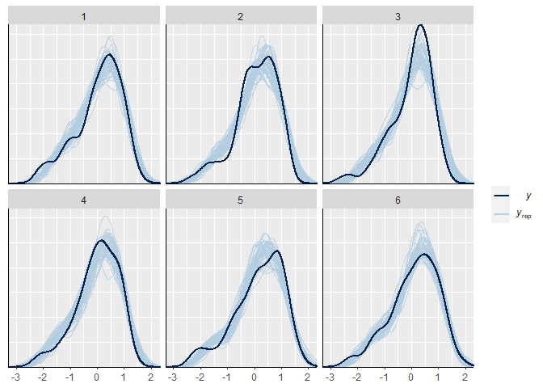
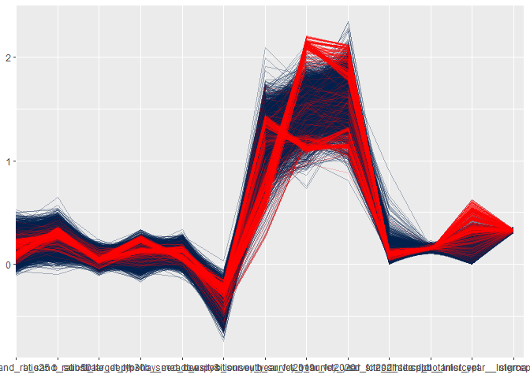

Favourable Conservation Status (FCS): <br> Analysis of Bauer et
al. (unpublished) Field experiment
================
Markus Bauer <br>
2022-11-15

# Preparation

#### Packages

``` r
library(here)
library(tidyverse)
library(ggbeeswarm)
library(patchwork)
library(brms)
library(DHARMa)
library(DHARMa.helpers)
library(bayesplot)
library(loo)
library(tidybayes)
library(emmeans)
```

#### Load data

``` r
sites <- read_csv(here("data", "processed", "data_processed_sites.csv"),
                  col_names = TRUE, na = c("na", "NA", ""), col_types =
                    cols(
                      .default = "?",
                      plot = "f",
                      site = "f",
                      sand_ratio = "f",
                      substrate_depth = "f",
                      target_type = col_factor(levels = c(
                        "dry_grassland", "hay_meadow"
                        )),
                      seed_density = "f",
                      exposition = col_factor(levels = c(
                        "north", "south"
                      )),
                      survey_year = "d"
                    )) %>%
  ### Exclude data of seed mixtures
  filter(survey_year != "seeded") %>%
  mutate(
    survey_year_fct = factor(survey_year),
    botanist_year = str_c(survey_year, botanist, sep = " "),
    botanist_year = factor(botanist_year),
    n = fcs_target,
    id = factor(id)
    ) %>%
  select(
    id, plot, site, exposition, sand_ratio, substrate_depth, target_type,
    seed_density, survey_year_fct, survey_year, botanist_year, n
    )
```

    ## Warning: One or more parsing issues, call `problems()` on your data frame for details,
    ## e.g.:
    ##   dat <- vroom(...)
    ##   problems(dat)

# Statistics

## Data exploration

### Graphs of raw data

<!-- --><!-- --><!-- --><!-- --><!-- -->

### Outliers, zero-inflation, transformations?

``` r
sites %>% group_by(exposition) %>% count(site)
```

    ## # A tibble: 12 × 3
    ## # Groups:   exposition [2]
    ##    exposition site      n
    ##    <fct>      <fct> <int>
    ##  1 north      1        96
    ##  2 north      2        96
    ##  3 north      3        96
    ##  4 north      4        96
    ##  5 north      5        96
    ##  6 north      6        96
    ##  7 south      1        96
    ##  8 south      2        96
    ##  9 south      3        96
    ## 10 south      4        96
    ## 11 south      5        96
    ## 12 south      6        96

``` r
boxplot(sites$n)
```

<!-- -->

``` r
ggplot(sites, aes(x = exposition, y = n)) + geom_quasirandom()
```

<!-- -->

``` r
ggplot(sites, aes(x = n)) + geom_histogram(binwidth = 0.03)
```

<!-- -->

``` r
ggplot(sites, aes(x = n)) + geom_density()
```

<!-- -->

## Model building

### Models

Specifications for the models

``` r
iter = 10000
chains = 4
thin = 2
priors <- c(
  set_prior("normal(0, 1)", class = "b"),
  set_prior("normal(0.1, 1)", class = "b", coef = "sand_ratio25"),
  set_prior("normal(0.2, 1)", class = "b", coef = "sand_ratio50"),
  set_prior("normal(0.1, 1)", class = "b", coef = "expositionsouth"),
  set_prior("normal(0.1, 1)", class = "b", coef = "survey_year_fct2019"),
  set_prior("normal(0.2, 1)", class = "b", coef = "survey_year_fct2020"),
  set_prior("normal(0.3, 1)", class = "b",coef = "survey_year_fct2021"),
  set_prior("cauchy(0, 1)", class = "sigma")
)
```

Model caluclations

``` r
load(file = here("outputs", "models", "model_fcs_1.Rdata"))
load(file = here("outputs", "models", "model_fcs_2.Rdata"))
load(file = here("outputs", "models", "model_fcs_3.Rdata"))
```

### Model comparison

``` r
m_1 <- m1
m_2 <- m3
m_1$formula
```

    ## n ~ (target_type + exposition + sand_ratio + survey_year_fct)^4 + substrate_depth + seed_density + (1 | site/plot) + (1 | botanist_year)

``` r
m_2$formula
```

    ## n ~ (target_type + exposition + sand_ratio + survey_year_fct)^2 + substrate_depth + seed_density + substrate_depth:sand_ratio + seed_density:exposition + target_type:exposition:survey_year_fct + sand_ratio:exposition:survey_year_fct + seed_density:exposition:survey_year_fct + (1 | site/plot) + (1 | botanist_year)

Conditional R² values

``` r
bayes_R2(m_1, probs = c(0.05, 0.5, 0.95),
         re_formula =  ~ (1 | site/plot) + (1 | botanist_year)) 
```

    ##     Estimate   Est.Error        Q5       Q50       Q95
    ## R2 0.8450271 0.005110434 0.8362782 0.8452897 0.8530061

``` r
bayes_R2(m_2, probs = c(0.05, 0.5, 0.95),
         re_formula =  ~ (1 | site/plot) + (1 | botanist_year))
```

    ##     Estimate   Est.Error        Q5    Q50      Q95
    ## R2 0.8456819 0.005090774 0.8368909 0.8459 0.853599

Marginal R² values

``` r
bayes_R2(m_1, probs = c(0.05, 0.5, 0.95),
         re_formula = 1 ~ 1)
```

    ##     Estimate  Est.Error        Q5       Q50       Q95
    ## R2 0.7895966 0.03725092 0.6974295 0.8018748 0.8179185

``` r
bayes_R2(m_2, probs = c(0.05, 0.5, 0.95),
         re_formula = 1 ~ 1)
```

    ##     Estimate  Est.Error        Q5       Q50       Q95
    ## R2 0.7896167 0.03690937 0.7144656 0.8015481 0.8174254

### Model check

#### DHARMa

``` r
DHARMa.helpers::dh_check_brms(m_1, integer = TRUE)
```

<!-- -->

``` r
DHARMa.helpers::dh_check_brms(m_2, integer = TRUE)
```

    ## Warning in newton(lsp = lsp, X = G$X, y = G$y, Eb = G$Eb, UrS = G$UrS, L =
    ## G$L, : Anpassung beendet mit Schrittweitenfehler - Ergebnisse sorgfältig prüfen

<!-- -->

#### Preparation

``` r
posterior1 <- m_1 %>%
  posterior::as_draws() %>%
  posterior::subset_draws(
    variable = c(
      "b_sand_ratio25",
      "b_sand_ratio50",
      "b_substrate_depth30",
      "b_target_typehay_meadow",
      "b_seed_density8",
      "b_expositionsouth",
      "b_survey_year_fct2019",
      "b_survey_year_fct2020",
      "b_survey_year_fct2021",
      "sd_site__Intercept",
      "sd_site:plot__Intercept",
      "sd_botanist_year__Intercept",
      "sigma"
    )
  )
posterior2 <- m_2 %>%
  posterior::as_draws() %>%
  posterior::subset_draws(
    variable = c(
      "b_sand_ratio25",
      "b_sand_ratio50",
      "b_substrate_depth30",
      "b_target_typehay_meadow",
      "b_seed_density8",
      "b_expositionsouth",
      "b_survey_year_fct2019",
      "b_survey_year_fct2020",
      "b_survey_year_fct2021",
      "sd_site__Intercept",
      "sd_site:plot__Intercept",
      "sd_botanist_year__Intercept",
      "sigma"
    )
  )
hmc_diagnostics1 <- nuts_params(m_1)
hmc_diagnostics2 <- nuts_params(m_2)
y <- sites$n
yrep1 <- posterior_predict(m_1, draws = 500)
yrep2 <- posterior_predict(m_2, draws = 500)
loo1 <- loo(m_1, save_psis = TRUE, moment_match = FALSE)
loo2 <- loo(m_2, save_psis = TRUE, moment_match = FALSE)
draws1 <- m_1 %>%
  posterior::as_draws() %>%
  posterior::summarize_draws() %>%
  filter(str_starts(variable, "b_"))
draws2 <- m_2 %>%
  posterior::as_draws() %>%
  posterior::summarize_draws() %>%
  filter(str_starts(variable, "b_"))
```

#### Samling efficency/effectiveness (Rhat and EFF)

``` r
range(draws1$rhat)
```

    ## [1] 1.000989 1.036745

``` r
range(draws2$rhat)
```

    ## [1] 1.000632 1.029715

``` r
range(draws1$ess_bulk)
```

    ## [1]  152.7467 7615.8453

``` r
range(draws2$ess_bulk)
```

    ## [1]  132.730 6380.986

``` r
range(draws1$ess_tail)
```

    ## [1]   36.30687 8931.53449

``` r
range(draws2$ess_tail)
```

    ## [1]   32.26756 9111.76550

#### MCMC diagnostics

``` r
mcmc_trace(posterior1, np = hmc_diagnostics1)
```

<!-- -->

``` r
mcmc_trace(posterior2, np = hmc_diagnostics2)
```

<!-- -->

``` r
mcmc_parcoord(posterior1, np = hmc_diagnostics1)
```

<!-- -->

``` r
mcmc_parcoord(posterior2, np = hmc_diagnostics2)
```

<!-- -->

#### Posterior predictive check

##### Kernel density

``` r
p1 <- ppc_dens_overlay(y, yrep1[1:50, ])
p2 <- ppc_dens_overlay(y, yrep2[1:50, ])
p1 / p2
```

<!-- -->

``` r
ppc_dens_overlay_grouped(y, yrep1[1:50, ], group = sites$site)
```

<!-- -->

``` r
ppc_dens_overlay_grouped(y, yrep2[1:50, ], group = sites$site)
```

<!-- -->

``` r
p1 <- ppc_dens_overlay_grouped(y, yrep1[1:50, ], group = sites$exposition)
p2 <- ppc_dens_overlay_grouped(y, yrep2[1:50, ], group = sites$exposition)
p1 / p2
```

<!-- -->

``` r
ppc_dens_overlay_grouped(y, yrep1[1:50, ], group = sites$survey_year_fct)
```

<!-- -->

``` r
ppc_dens_overlay_grouped(y, yrep2[1:50, ], group = sites$survey_year_fct)
```

<!-- -->

``` r
p1 <- ppc_dens_overlay_grouped(y, yrep1[1:50, ], group = sites$target_type)
p2 <- ppc_dens_overlay_grouped(y, yrep2[1:50, ], group = sites$target_type)
p1 / p2
```

<!-- -->

``` r
p1 <- ppc_dens_overlay_grouped(y, yrep1[1:50, ], group = sites$seed_density)
p2 <- ppc_dens_overlay_grouped(y, yrep2[1:50, ], group = sites$seed_density)
p1 / p2
```

<!-- -->

``` r
p1 <- ppc_dens_overlay_grouped(y, yrep1[1:50, ], group = sites$sand_ratio)
p2 <- ppc_dens_overlay_grouped(y, yrep2[1:50, ], group = sites$sand_ratio)
p1 / p2
```

<!-- -->

``` r
p1 <- ppc_dens_overlay_grouped(y, yrep1[1:50, ], group = sites$substrate_depth)
p2 <- ppc_dens_overlay_grouped(y, yrep2[1:50, ], group = sites$substrate_depth)
p1 / p2
```

<!-- -->

##### Histograms of statistics skew

``` r
p1 <- ppc_stat(y, yrep1, binwidth = 0.001)
p2 <- ppc_stat(y, yrep2, binwidth = 0.001)
p1 / p2
```

<!-- -->

``` r
ppc_stat_grouped(y, yrep1, group = sites$site, binwidth = 0.001)
```

<!-- -->

``` r
ppc_stat_grouped(y, yrep2, group = sites$site, binwidth = 0.001)
```

<!-- -->

``` r
p1 <- ppc_stat_grouped(y, yrep1, group = sites$exposition, binwidth = 0.001)
p2 <- ppc_stat_grouped(y, yrep2, group = sites$exposition, binwidth = 0.001)
p1 / p2
```

<!-- -->

``` r
ppc_stat_grouped(y, yrep1, group = sites$survey_year_fct, binwidth = 0.001)
```

<!-- -->

``` r
ppc_stat_grouped(y, yrep2, group = sites$survey_year_fct, binwidth = 0.001)
```

<!-- -->

``` r
p1 <- ppc_stat_grouped(y, yrep1, group = sites$target_type, binwidth = 0.001)
p2 <- ppc_stat_grouped(y, yrep2, group = sites$target_type, binwidth = 0.001)
p1 / p2
```

<!-- -->

``` r
p1 <- ppc_stat_grouped(y, yrep1, group = sites$seed_density, binwidth = 0.001)
p2 <- ppc_stat_grouped(y, yrep2, group = sites$seed_density, binwidth = 0.001)
p1 / p2
```

<!-- -->

``` r
p1 <- ppc_stat_grouped(y, yrep1, group = sites$sand_ratio, binwidth = 0.001)
p2 <- ppc_stat_grouped(y, yrep2, group = sites$sand_ratio, binwidth = 0.001)
p1 / p2
```

<!-- -->

``` r
p1 <- ppc_stat_grouped(y, yrep1, group = sites$substrate_depth, binwidth = 0.001)
p2 <- ppc_stat_grouped(y, yrep2, group = sites$substrate_depth, binwidth = 0.001)
p1 / p2
```

<!-- -->

##### LOO-PIT plots

``` r
p1 <- ppc_loo_pit_overlay(y, yrep1, lw = weights(loo1$psis_object))
```

    ## NOTE: The kernel density estimate assumes continuous observations and is not optimal for discrete observations.

``` r
p2 <- ppc_loo_pit_overlay(y, yrep2, lw = weights(loo2$psis_object))
```

    ## NOTE: The kernel density estimate assumes continuous observations and is not optimal for discrete observations.

``` r
p1 / p2
```

<!-- -->

``` r
plot(loo1)
```

<!-- -->

``` r
plot(loo2)
```

<!-- -->

#### Autocorrelation check

``` r
mcmc_acf(posterior1, lags = 10)
```

<!-- -->

``` r
mcmc_acf(posterior2, lags = 10)
```

<!-- -->

## Output of choosen model

### Model output

Priors and conditional and marignal R²

``` r
prior_summary(m_2, all = FALSE)
```

    ##                   prior     class                coef group resp dpar nlpar lb
    ##            normal(0, 1)         b                                             
    ##          normal(0.1, 1)         b     expositionsouth                         
    ##          normal(0.1, 1)         b        sand_ratio25                         
    ##          normal(0.2, 1)         b        sand_ratio50                         
    ##          normal(0.1, 1)         b survey_year_fct2019                         
    ##          normal(0.2, 1)         b survey_year_fct2020                         
    ##          normal(0.3, 1)         b survey_year_fct2021                         
    ##  student_t(3, 0.2, 2.5) Intercept                                             
    ##    student_t(3, 0, 2.5)        sd                                            0
    ##            cauchy(0, 1)     sigma                                            0
    ##  ub  source
    ##        user
    ##        user
    ##        user
    ##        user
    ##        user
    ##        user
    ##        user
    ##     default
    ##     default
    ##        user

``` r
bayes_R2(m_2, probs = c(0.05, 0.5, 0.95),
         re_formula =  ~ (1 | site/plot) + (1 | botanist_year)) 
```

    ##     Estimate   Est.Error        Q5    Q50      Q95
    ## R2 0.8456819 0.005090774 0.8368909 0.8459 0.853599

``` r
bayes_R2(m_2, probs = c(0.05, 0.5, 0.95),
         re_formula = 1 ~ 1)
```

    ##     Estimate  Est.Error        Q5       Q50       Q95
    ## R2 0.7896167 0.03690937 0.7144656 0.8015481 0.8174254

Posteriors

``` r
draws2
```

    ## # A tibble: 45 × 10
    ##    variable     mean  median     sd    mad       q5    q95  rhat ess_b…¹ ess_t…²
    ##    <chr>       <dbl>   <dbl>  <dbl>  <dbl>    <dbl>  <dbl> <dbl>   <dbl>   <dbl>
    ##  1 b_Interc… -0.831  -0.835  0.112  0.101  -1.00    -0.637  1.00   3467.  2954. 
    ##  2 b_target…  0.103   0.102  0.0740 0.0722 -0.0153   0.232  1.02    290.    65.5
    ##  3 b_exposi… -0.367  -0.366  0.0964 0.100  -0.528   -0.211  1.01    560.  1005. 
    ##  4 b_sand_r…  0.183   0.184  0.0861 0.0851  0.0441   0.325  1.00   2222.  5335. 
    ##  5 b_sand_r…  0.258   0.258  0.0840 0.0850  0.119    0.394  1.00   3756.  7229. 
    ##  6 b_survey…  1.23    1.26   0.186  0.137   0.852    1.47   1.02    165.    40.8
    ##  7 b_survey…  1.53    1.53   0.177  0.127   1.24     1.78   1.03    133.    34.2
    ##  8 b_survey…  1.65    1.66   0.174  0.142   1.31     1.89   1.02    207.   125. 
    ##  9 b_substr…  0.0592  0.0580 0.0457 0.0449 -0.0152   0.135  1.00   5583.  5825. 
    ## 10 b_seed_d…  0.101   0.100  0.0599 0.0625  0.00301  0.200  1.01   2144.  9112. 
    ## # … with 35 more rows, and abbreviated variable names ¹​ess_bulk, ²​ess_tail

``` r
mcmc_intervals(
  posterior1,
  prob = 0.66,
  prob_outer = 0.95,
  point_est = "mean"
)
```

<!-- -->

``` r
mcmc_intervals(
  posterior2,
  prob = 0.66,
  prob_outer = 0.95,
  point_est = "mean"
)
```

<!-- -->

### Effect sizes

``` r
(emm <- emmeans(m_2, revpairwise ~ target_type + sand_ratio |
                  exposition | survey_year_fct, type = "response"))
```

    ## $emmeans
    ## exposition = north, survey_year_fct = 2018:
    ##  target_type   sand_ratio   emmean lower.HPD upper.HPD
    ##  dry_grassland 0          -0.75626   -0.9532    -0.528
    ##  hay_meadow    0          -0.65306   -0.8637    -0.437
    ##  dry_grassland 25         -0.64506   -0.8572    -0.422
    ##  hay_meadow    25         -0.61679   -0.8294    -0.399
    ##  dry_grassland 50         -0.52955   -0.7390    -0.313
    ##  hay_meadow    50         -0.57587   -0.7854    -0.363
    ## 
    ## exposition = south, survey_year_fct = 2018:
    ##  target_type   sand_ratio   emmean lower.HPD upper.HPD
    ##  dry_grassland 0          -1.11820   -1.3408    -0.909
    ##  hay_meadow    0          -1.34876   -1.5596    -1.136
    ##  dry_grassland 25         -1.23426   -1.4591    -1.028
    ##  hay_meadow    25         -1.54007   -1.7517    -1.324
    ##  dry_grassland 50         -1.46166   -1.6739    -1.249
    ##  hay_meadow    50         -1.84252   -2.0365    -1.611
    ## 
    ## exposition = north, survey_year_fct = 2019:
    ##  target_type   sand_ratio   emmean lower.HPD upper.HPD
    ##  dry_grassland 0           0.51063    0.1408     0.830
    ##  hay_meadow    0           0.62429    0.2506     0.938
    ##  dry_grassland 25          0.40437    0.0437     0.744
    ##  hay_meadow    25          0.44409    0.0969     0.787
    ##  dry_grassland 50          0.70527    0.3285     1.022
    ##  hay_meadow    50          0.66932    0.2956     0.992
    ## 
    ## exposition = south, survey_year_fct = 2019:
    ##  target_type   sand_ratio   emmean lower.HPD upper.HPD
    ##  dry_grassland 0          -0.13794   -0.3617     0.245
    ##  hay_meadow    0          -0.10107   -0.3544     0.262
    ##  dry_grassland 25         -0.05069   -0.2891     0.341
    ##  hay_meadow    25         -0.09212   -0.3567     0.284
    ##  dry_grassland 50          0.01617   -0.2583     0.381
    ##  hay_meadow    50         -0.09593   -0.3730     0.276
    ## 
    ## exposition = north, survey_year_fct = 2020:
    ##  target_type   sand_ratio   emmean lower.HPD upper.HPD
    ##  dry_grassland 0           0.78380    0.3880     1.037
    ##  hay_meadow    0           0.86200    0.4481     1.128
    ##  dry_grassland 25          0.78347    0.3357     1.036
    ##  hay_meadow    25          0.78330    0.4060     1.047
    ##  dry_grassland 50          0.91346    0.5835     1.157
    ##  hay_meadow    50          0.84229    0.4842     1.113
    ## 
    ## exposition = south, survey_year_fct = 2020:
    ##  target_type   sand_ratio   emmean lower.HPD upper.HPD
    ##  dry_grassland 0          -0.01125   -0.2349     0.464
    ##  hay_meadow    0          -0.00482   -0.4931     0.254
    ##  dry_grassland 25          0.23437   -0.1893     0.483
    ##  hay_meadow    25          0.16341   -0.2360     0.410
    ##  dry_grassland 50          0.24433   -0.0925     0.485
    ##  hay_meadow    50          0.10195   -0.2342     0.414
    ## 
    ## exposition = north, survey_year_fct = 2021:
    ##  target_type   sand_ratio   emmean lower.HPD upper.HPD
    ##  dry_grassland 0           0.85919    0.5811     1.217
    ##  hay_meadow    0           0.93316    0.6476     1.250
    ##  dry_grassland 25          0.91685    0.6214     1.217
    ##  hay_meadow    25          0.91242    0.6114     1.194
    ##  dry_grassland 50          1.02852    0.7414     1.325
    ##  hay_meadow    50          0.95509    0.6349     1.223
    ## 
    ## exposition = south, survey_year_fct = 2021:
    ##  target_type   sand_ratio   emmean lower.HPD upper.HPD
    ##  dry_grassland 0           0.17411   -0.1511     0.445
    ##  hay_meadow    0           0.21293   -0.0877     0.503
    ##  dry_grassland 25          0.23044   -0.0904     0.526
    ##  hay_meadow    25          0.19306   -0.1194     0.485
    ##  dry_grassland 50          0.23302   -0.0717     0.503
    ##  hay_meadow    50          0.12648   -0.1696     0.433
    ## 
    ## Results are averaged over the levels of: substrate_depth, seed_density 
    ## Point estimate displayed: median 
    ## HPD interval probability: 0.95 
    ## 
    ## $contrasts
    ## exposition = north, survey_year_fct = 2018:
    ##  contrast                                                 estimate lower.HPD
    ##  hay_meadow sand_ratio0 - dry_grassland sand_ratio0       0.102054  -0.03026
    ##  dry_grassland sand_ratio25 - dry_grassland sand_ratio0   0.112209  -0.04254
    ##  dry_grassland sand_ratio25 - hay_meadow sand_ratio0      0.006715  -0.16500
    ##  hay_meadow sand_ratio25 - dry_grassland sand_ratio0      0.136980  -0.04596
    ##  hay_meadow sand_ratio25 - hay_meadow sand_ratio0         0.036980  -0.13030
    ##  hay_meadow sand_ratio25 - dry_grassland sand_ratio25     0.025810  -0.10918
    ##  dry_grassland sand_ratio50 - dry_grassland sand_ratio0   0.227505   0.06957
    ##  dry_grassland sand_ratio50 - hay_meadow sand_ratio0      0.123896  -0.05831
    ##  dry_grassland sand_ratio50 - dry_grassland sand_ratio25  0.113468  -0.03985
    ##  dry_grassland sand_ratio50 - hay_meadow sand_ratio25     0.088079  -0.10527
    ##  hay_meadow sand_ratio50 - dry_grassland sand_ratio0      0.178489  -0.00229
    ##  hay_meadow sand_ratio50 - hay_meadow sand_ratio0         0.075905  -0.08235
    ##  hay_meadow sand_ratio50 - dry_grassland sand_ratio25     0.065705  -0.12103
    ##  hay_meadow sand_ratio50 - hay_meadow sand_ratio25        0.040495  -0.10595
    ##  hay_meadow sand_ratio50 - dry_grassland sand_ratio50    -0.047910  -0.18938
    ##  upper.HPD
    ##    0.25812
    ##    0.26719
    ##    0.21090
    ##    0.33773
    ##    0.18175
    ##    0.18121
    ##    0.37360
    ##    0.31341
    ##    0.27862
    ##    0.27151
    ##    0.38132
    ##    0.22874
    ##    0.25901
    ##    0.20707
    ##    0.09077
    ## 
    ## exposition = south, survey_year_fct = 2018:
    ##  contrast                                                 estimate lower.HPD
    ##  hay_meadow sand_ratio0 - dry_grassland sand_ratio0      -0.231425  -0.36824
    ##  dry_grassland sand_ratio25 - dry_grassland sand_ratio0  -0.114603  -0.27646
    ##  dry_grassland sand_ratio25 - hay_meadow sand_ratio0      0.114375  -0.07898
    ##  hay_meadow sand_ratio25 - dry_grassland sand_ratio0     -0.424858  -0.61409
    ##  hay_meadow sand_ratio25 - hay_meadow sand_ratio0        -0.192104  -0.34225
    ##  hay_meadow sand_ratio25 - dry_grassland sand_ratio25    -0.306642  -0.44805
    ##  dry_grassland sand_ratio50 - dry_grassland sand_ratio0  -0.341398  -0.49606
    ##  dry_grassland sand_ratio50 - hay_meadow sand_ratio0     -0.109946  -0.29555
    ##  dry_grassland sand_ratio50 - dry_grassland sand_ratio25 -0.226922  -0.38629
    ##  dry_grassland sand_ratio50 - hay_meadow sand_ratio25     0.082610  -0.11054
    ##  hay_meadow sand_ratio50 - dry_grassland sand_ratio0     -0.724604  -0.91535
    ##  hay_meadow sand_ratio50 - hay_meadow sand_ratio0        -0.492659  -0.65781
    ##  hay_meadow sand_ratio50 - dry_grassland sand_ratio25    -0.608620  -0.80340
    ##  hay_meadow sand_ratio50 - hay_meadow sand_ratio25       -0.299525  -0.46819
    ##  hay_meadow sand_ratio50 - dry_grassland sand_ratio50    -0.381893  -0.51321
    ##  upper.HPD
    ##   -0.09441
    ##    0.03833
    ##    0.30234
    ##   -0.23722
    ##   -0.03019
    ##   -0.17163
    ##   -0.18618
    ##    0.07976
    ##   -0.06845
    ##    0.26601
    ##   -0.53089
    ##   -0.33741
    ##   -0.41632
    ##   -0.14660
    ##   -0.22720
    ## 
    ## exposition = north, survey_year_fct = 2019:
    ##  contrast                                                 estimate lower.HPD
    ##  hay_meadow sand_ratio0 - dry_grassland sand_ratio0       0.110816  -0.01911
    ##  dry_grassland sand_ratio25 - dry_grassland sand_ratio0  -0.104010  -0.26849
    ##  dry_grassland sand_ratio25 - hay_meadow sand_ratio0     -0.216622  -0.40419
    ##  hay_meadow sand_ratio25 - dry_grassland sand_ratio0     -0.069719  -0.26354
    ##  hay_meadow sand_ratio25 - hay_meadow sand_ratio0        -0.180335  -0.33420
    ##  hay_meadow sand_ratio25 - dry_grassland sand_ratio25     0.036533  -0.10463
    ##  dry_grassland sand_ratio50 - dry_grassland sand_ratio0   0.194349   0.03560
    ##  dry_grassland sand_ratio50 - hay_meadow sand_ratio0      0.083856  -0.11009
    ##  dry_grassland sand_ratio50 - dry_grassland sand_ratio25  0.297401   0.13935
    ##  dry_grassland sand_ratio50 - hay_meadow sand_ratio25     0.262451   0.06363
    ##  hay_meadow sand_ratio50 - dry_grassland sand_ratio0      0.154572  -0.03466
    ##  hay_meadow sand_ratio50 - hay_meadow sand_ratio0         0.043372  -0.12094
    ##  hay_meadow sand_ratio50 - dry_grassland sand_ratio25     0.262116   0.06097
    ##  hay_meadow sand_ratio50 - hay_meadow sand_ratio25        0.225891   0.06767
    ##  hay_meadow sand_ratio50 - dry_grassland sand_ratio50    -0.037963  -0.17638
    ##  upper.HPD
    ##    0.25477
    ##    0.05716
    ##   -0.02678
    ##    0.11909
    ##   -0.02179
    ##    0.17446
    ##    0.35310
    ##    0.26808
    ##    0.46259
    ##    0.44576
    ##    0.34395
    ##    0.19398
    ##    0.44613
    ##    0.38690
    ##    0.10765
    ## 
    ## exposition = south, survey_year_fct = 2019:
    ##  contrast                                                 estimate lower.HPD
    ##  hay_meadow sand_ratio0 - dry_grassland sand_ratio0       0.036220  -0.10265
    ##  dry_grassland sand_ratio25 - dry_grassland sand_ratio0   0.086716  -0.07003
    ##  dry_grassland sand_ratio25 - hay_meadow sand_ratio0      0.051435  -0.14383
    ##  hay_meadow sand_ratio25 - dry_grassland sand_ratio0      0.046530  -0.14537
    ##  hay_meadow sand_ratio25 - hay_meadow sand_ratio0         0.012916  -0.14717
    ##  hay_meadow sand_ratio25 - dry_grassland sand_ratio25    -0.038315  -0.18153
    ##  dry_grassland sand_ratio50 - dry_grassland sand_ratio0   0.155122  -0.00769
    ##  dry_grassland sand_ratio50 - hay_meadow sand_ratio0      0.118860  -0.07437
    ##  dry_grassland sand_ratio50 - dry_grassland sand_ratio25  0.066201  -0.09748
    ##  dry_grassland sand_ratio50 - hay_meadow sand_ratio25     0.107280  -0.09353
    ##  hay_meadow sand_ratio50 - dry_grassland sand_ratio0      0.040078  -0.14642
    ##  hay_meadow sand_ratio50 - hay_meadow sand_ratio0         0.003802  -0.15872
    ##  hay_meadow sand_ratio50 - dry_grassland sand_ratio25    -0.047199  -0.23126
    ##  hay_meadow sand_ratio50 - hay_meadow sand_ratio25       -0.006566  -0.17029
    ##  hay_meadow sand_ratio50 - dry_grassland sand_ratio50    -0.112330  -0.25846
    ##  upper.HPD
    ##    0.17546
    ##    0.25815
    ##    0.24142
    ##    0.24555
    ##    0.17370
    ##    0.09454
    ##    0.30668
    ##    0.30658
    ##    0.22535
    ##    0.28846
    ##    0.24014
    ##    0.15942
    ##    0.16106
    ##    0.15904
    ##    0.02587
    ## 
    ## exposition = north, survey_year_fct = 2020:
    ##  contrast                                                 estimate lower.HPD
    ##  hay_meadow sand_ratio0 - dry_grassland sand_ratio0       0.074574  -0.06202
    ##  dry_grassland sand_ratio25 - dry_grassland sand_ratio0  -0.004961  -0.15130
    ##  dry_grassland sand_ratio25 - hay_meadow sand_ratio0     -0.079101  -0.27588
    ##  hay_meadow sand_ratio25 - dry_grassland sand_ratio0     -0.003320  -0.19268
    ##  hay_meadow sand_ratio25 - hay_meadow sand_ratio0        -0.078778  -0.23115
    ##  hay_meadow sand_ratio25 - dry_grassland sand_ratio25     0.000526  -0.14121
    ##  dry_grassland sand_ratio50 - dry_grassland sand_ratio0   0.127243  -0.02639
    ##  dry_grassland sand_ratio50 - hay_meadow sand_ratio0      0.050711  -0.12602
    ##  dry_grassland sand_ratio50 - dry_grassland sand_ratio25  0.130100  -0.03259
    ##  dry_grassland sand_ratio50 - hay_meadow sand_ratio25     0.133859  -0.06324
    ##  hay_meadow sand_ratio50 - dry_grassland sand_ratio0      0.056706  -0.14417
    ##  hay_meadow sand_ratio50 - hay_meadow sand_ratio0        -0.021441  -0.18612
    ##  hay_meadow sand_ratio50 - dry_grassland sand_ratio25     0.058211  -0.13886
    ##  hay_meadow sand_ratio50 - hay_meadow sand_ratio25        0.058084  -0.09808
    ##  hay_meadow sand_ratio50 - dry_grassland sand_ratio50    -0.075063  -0.21302
    ##  upper.HPD
    ##    0.21745
    ##    0.16166
    ##    0.10818
    ##    0.18743
    ##    0.08834
    ##    0.13847
    ##    0.28588
    ##    0.24972
    ##    0.29791
    ##    0.31804
    ##    0.24067
    ##    0.13333
    ##    0.24884
    ##    0.22502
    ##    0.07023
    ## 
    ## exposition = south, survey_year_fct = 2020:
    ##  contrast                                                 estimate lower.HPD
    ##  hay_meadow sand_ratio0 - dry_grassland sand_ratio0       0.005672  -0.13332
    ##  dry_grassland sand_ratio25 - dry_grassland sand_ratio0   0.247478   0.08515
    ##  dry_grassland sand_ratio25 - hay_meadow sand_ratio0      0.241687   0.05668
    ##  hay_meadow sand_ratio25 - dry_grassland sand_ratio0      0.177908  -0.01837
    ##  hay_meadow sand_ratio25 - hay_meadow sand_ratio0         0.171427   0.00712
    ##  hay_meadow sand_ratio25 - dry_grassland sand_ratio25    -0.068622  -0.21710
    ##  dry_grassland sand_ratio50 - dry_grassland sand_ratio0   0.259663   0.09074
    ##  dry_grassland sand_ratio50 - hay_meadow sand_ratio0      0.252164   0.04389
    ##  dry_grassland sand_ratio50 - dry_grassland sand_ratio25  0.012912  -0.14558
    ##  dry_grassland sand_ratio50 - hay_meadow sand_ratio25     0.082580  -0.10700
    ##  hay_meadow sand_ratio50 - dry_grassland sand_ratio0      0.118019  -0.08315
    ##  hay_meadow sand_ratio50 - hay_meadow sand_ratio0         0.110712  -0.05578
    ##  hay_meadow sand_ratio50 - dry_grassland sand_ratio25    -0.131522  -0.32781
    ##  hay_meadow sand_ratio50 - hay_meadow sand_ratio25       -0.061937  -0.22500
    ##  hay_meadow sand_ratio50 - dry_grassland sand_ratio50    -0.144264  -0.28481
    ##  upper.HPD
    ##    0.14492
    ##    0.40287
    ##    0.43615
    ##    0.36423
    ##    0.32783
    ##    0.06519
    ##    0.41867
    ##    0.44944
    ##    0.17734
    ##    0.27275
    ##    0.30388
    ##    0.26932
    ##    0.05093
    ##    0.09150
    ##   -0.00347
    ## 
    ## exposition = north, survey_year_fct = 2021:
    ##  contrast                                                 estimate lower.HPD
    ##  hay_meadow sand_ratio0 - dry_grassland sand_ratio0       0.072516  -0.06472
    ##  dry_grassland sand_ratio25 - dry_grassland sand_ratio0   0.052197  -0.10017
    ##  dry_grassland sand_ratio25 - hay_meadow sand_ratio0     -0.021790  -0.20907
    ##  hay_meadow sand_ratio25 - dry_grassland sand_ratio0      0.050258  -0.13520
    ##  hay_meadow sand_ratio25 - hay_meadow sand_ratio0        -0.023254  -0.17445
    ##  hay_meadow sand_ratio25 - dry_grassland sand_ratio25    -0.001857  -0.14116
    ##  dry_grassland sand_ratio50 - dry_grassland sand_ratio0   0.169906   0.00771
    ##  dry_grassland sand_ratio50 - hay_meadow sand_ratio0      0.095918  -0.09350
    ##  dry_grassland sand_ratio50 - dry_grassland sand_ratio25  0.114509  -0.03825
    ##  dry_grassland sand_ratio50 - hay_meadow sand_ratio25     0.119549  -0.07588
    ##  hay_meadow sand_ratio50 - dry_grassland sand_ratio0      0.096494  -0.10291
    ##  hay_meadow sand_ratio50 - hay_meadow sand_ratio0         0.022379  -0.14555
    ##  hay_meadow sand_ratio50 - dry_grassland sand_ratio25     0.042562  -0.15380
    ##  hay_meadow sand_ratio50 - hay_meadow sand_ratio25        0.044167  -0.10940
    ##  hay_meadow sand_ratio50 - dry_grassland sand_ratio50    -0.074541  -0.21929
    ##  upper.HPD
    ##    0.21107
    ##    0.21950
    ##    0.17288
    ##    0.24588
    ##    0.13961
    ##    0.13802
    ##    0.32590
    ##    0.28302
    ##    0.28760
    ##    0.30145
    ##    0.29283
    ##    0.17748
    ##    0.23383
    ##    0.20470
    ##    0.05798
    ## 
    ## exposition = south, survey_year_fct = 2021:
    ##  contrast                                                 estimate lower.HPD
    ##  hay_meadow sand_ratio0 - dry_grassland sand_ratio0       0.040733  -0.09424
    ##  dry_grassland sand_ratio25 - dry_grassland sand_ratio0   0.059961  -0.09923
    ##  dry_grassland sand_ratio25 - hay_meadow sand_ratio0      0.019067  -0.17778
    ##  hay_meadow sand_ratio25 - dry_grassland sand_ratio0      0.024381  -0.17051
    ##  hay_meadow sand_ratio25 - hay_meadow sand_ratio0        -0.016291  -0.17409
    ##  hay_meadow sand_ratio25 - dry_grassland sand_ratio25    -0.034711  -0.17639
    ##  dry_grassland sand_ratio50 - dry_grassland sand_ratio0   0.062827  -0.09929
    ##  dry_grassland sand_ratio50 - hay_meadow sand_ratio0      0.022756  -0.17633
    ##  dry_grassland sand_ratio50 - dry_grassland sand_ratio25  0.003548  -0.14694
    ##  dry_grassland sand_ratio50 - hay_meadow sand_ratio25     0.038351  -0.14070
    ##  hay_meadow sand_ratio50 - dry_grassland sand_ratio0     -0.044713  -0.23111
    ##  hay_meadow sand_ratio50 - hay_meadow sand_ratio0        -0.087426  -0.24518
    ##  hay_meadow sand_ratio50 - dry_grassland sand_ratio25    -0.103870  -0.29293
    ##  hay_meadow sand_ratio50 - hay_meadow sand_ratio25       -0.070965  -0.22426
    ##  hay_meadow sand_ratio50 - dry_grassland sand_ratio50    -0.109374  -0.26127
    ##  upper.HPD
    ##    0.18209
    ##    0.21628
    ##    0.20294
    ##    0.20894
    ##    0.14122
    ##    0.10389
    ##    0.22432
    ##    0.21322
    ##    0.17185
    ##    0.23689
    ##    0.14948
    ##    0.07055
    ##    0.09235
    ##    0.09174
    ##    0.02159
    ## 
    ## Results are averaged over the levels of: substrate_depth, seed_density 
    ## Point estimate displayed: median 
    ## HPD interval probability: 0.95
