Favourable Conservation Status (FCS): <br> Analysis of Bauer et
al. (unpublished) Field experiment
================
Markus Bauer <br>
2022-11-18

FCS sensu Helm et al. (2015) <https://doi.org/10.1111/ddi.12285>

# Preparation

#### Packages

``` r
library(here)
library(tidyverse)
library(ggbeeswarm)
library(patchwork)
library(brms)
library(DHARMa)
library(DHARMa.helpers)
library(bayesplot)
library(loo)
library(tidybayes)
library(emmeans)
```

#### Load data

``` r
sites <- read_csv(
  here("data", "processed", "data_processed_sites.csv"),
  col_names = TRUE, na = c("na", "NA", ""), col_types =
    cols(
      .default = "?",
      plot = "f",
      site = "f",
      sand_ratio = "f",
      substrate_depth = col_factor(levels = c("30", "15")),
      target_type = col_factor(levels = c(
        "hay_meadow", "dry_grassland"
        )),
      seed_density = "f",
      exposition = col_factor(levels = c("north", "south")),
      survey_year = "c"
      )
  ) %>%
  ### Exclude data of seed mixtures
  filter(survey_year != "seeded") %>%
  mutate(
    survey_year_fct = factor(survey_year),
    botanist_year = str_c(survey_year, botanist, sep = " "),
    botanist_year = factor(botanist_year),
    n = fcs_target,
    id = factor(id)
    ) %>%
  select(
    id, plot, site, exposition, sand_ratio, substrate_depth, target_type,
    seed_density, survey_year_fct, survey_year, botanist_year, n
    )
```

# Statistics

## Data exploration

### Graphs of raw data

<!-- --><!-- --><!-- --><!-- --><!-- -->

### Outliers, zero-inflation, transformations?

    ## # A tibble: 12 × 3
    ## # Groups:   exposition [2]
    ##    exposition site      n
    ##    <fct>      <fct> <int>
    ##  1 north      1        96
    ##  2 north      2        96
    ##  3 north      3        96
    ##  4 north      4        96
    ##  5 north      5        96
    ##  6 north      6        96
    ##  7 south      1        96
    ##  8 south      2        96
    ##  9 south      3        96
    ## 10 south      4        96
    ## 11 south      5        96
    ## 12 south      6        96

<!-- --><!-- --><!-- --><!-- -->

## Model building

### Models

Possible prior distributions

``` r
ggplot(data = data.frame(x = c(-1, 1)), aes(x = x)) +
  stat_function(fun = dnorm, n = 101, args = list(mean = 0.1, sd = 1)) +
  expand_limits(y = 0) + ggtitle("Normal distribution")
```

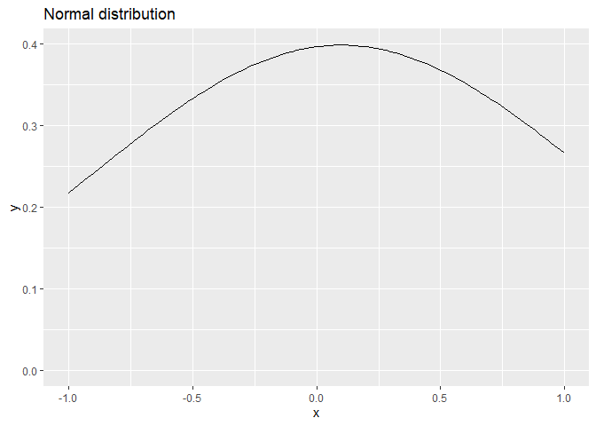<!-- -->

``` r
ggplot(data = data.frame(x = c(-1, 1)), aes(x = x)) +
  stat_function(fun = dcauchy, n = 101, args = list(location = 0, scale = 1)) +
  expand_limits(y = 0) + ggtitle("Cauchy distribution")
```

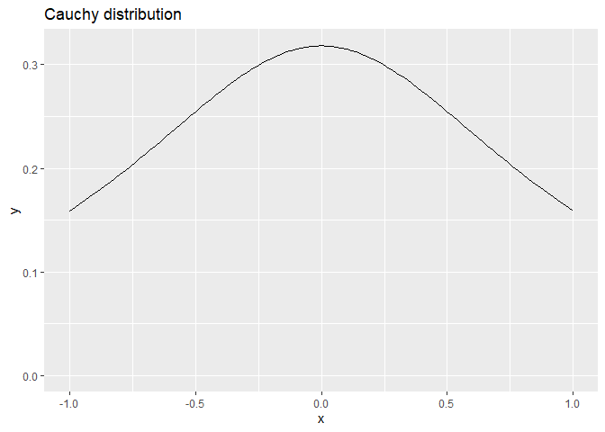<!-- -->

``` r
ggplot(data.frame(x = c(-1, 1)), aes(x = x)) +
  stat_function(fun = dstudent_t, args = list(df = 3, mu = 0, sigma = 2.5)) +
  expand_limits(y = 0) + ggtitle(expression(Student~italic(t)*"-distribution"))
```

<!-- -->

Specifications for the models

``` r
iter = 10000
chains = 4
thin = 2
seed = 123
warmup = floor(iter / 2)
priors <- c(
  set_prior("normal(0, 1)", class = "b"),
  set_prior("normal(0.1, 1)", class = "b", coef = "sand_ratio25"),
  set_prior("normal(0.2, 1)", class = "b", coef = "sand_ratio50"),
  set_prior("normal(0.1, 1)", class = "b", coef = "survey_year_fct2019"),
  set_prior("normal(0.2, 1)", class = "b", coef = "survey_year_fct2020"),
  set_prior("normal(0.3, 1)", class = "b",coef = "survey_year_fct2021"),
  set_prior("cauchy(0, 1)", class = "sigma")
)
```

Model caluclations

``` r
load(file = here("outputs", "models", "model_fcs_2.Rdata"))
load(file = here("outputs", "models", "model_fcs_full.Rdata"))
```

### Model comparison

``` r
m_1 <- m2
m_2 <- m_full
m_1$formula
```

    ## n ~ sand_ratio * target_type * exposition * survey_year_fct + substrate_depth + seed_density + substrate_depth:exposition + seed_density:exposition + substrate_depth:survey_year_fct + seed_density:survey_year_fct + botanist_year + (1 | site/plot)

``` r
m_2$formula
```

    ## n ~ sand_ratio * target_type * exposition * survey_year_fct + substrate_depth * seed_density + substrate_depth:exposition + seed_density:exposition + substrate_depth:survey_year_fct + seed_density:survey_year_fct + substrate_depth:exposition:survey_year_fct + seed_density:exposition:survey_year_fct + botanist_year + (1 | site/plot)

Conditional italic(R)² values

``` r
bayes_R2(m_1, probs = c(0.05, 0.5, 0.95),
         re_formula =  ~ (1 | site/plot) + (1 | botanist_year)) 
```

    ##     Estimate   Est.Error        Q5       Q50       Q95
    ## R2 0.8462696 0.005180763 0.8374346 0.8464422 0.8545334

``` r
bayes_R2(m_2, probs = c(0.05, 0.5, 0.95),
         re_formula =  ~ (1 | site/plot) + (1 | botanist_year))
```

    ##     Estimate   Est.Error        Q5       Q50       Q95
    ## R2 0.8455807 0.005138392 0.8367879 0.8457527 0.8536987

Marginal italic(R)² values

``` r
bayes_R2(m_1, probs = c(0.05, 0.5, 0.95),
         re_formula = 1 ~ 1)
```

    ##     Estimate   Est.Error        Q5       Q50       Q95
    ## R2 0.8080089 0.004623596 0.8000911 0.8082291 0.8151562

``` r
bayes_R2(m_2, probs = c(0.05, 0.5, 0.95),
         re_formula = 1 ~ 1)
```

    ##     Estimate   Est.Error        Q5       Q50       Q95
    ## R2 0.8077646 0.004572131 0.8000053 0.8079031 0.8148681

### Model check

#### DHARMa

``` r
DHARMa.helpers::dh_check_brms(m_1, integer = TRUE)
```

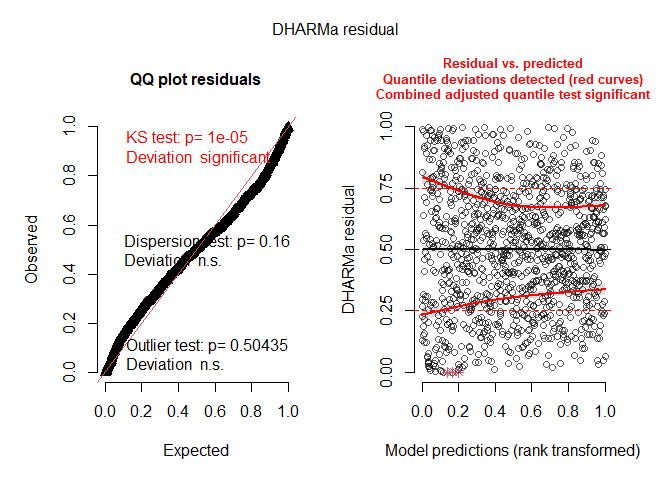<!-- -->

``` r
DHARMa.helpers::dh_check_brms(m_2, integer = TRUE)
```

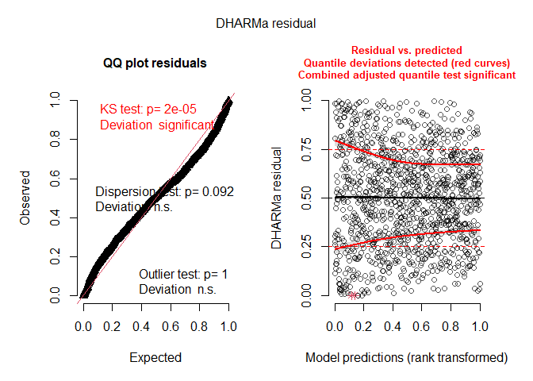<!-- -->

#### Preparation

``` r
posterior1 <- m_1 %>%
  posterior::as_draws() %>%
  posterior::subset_draws(
    variable = c(
      "b_sand_ratio25",
      "b_sand_ratio50",
      "b_substrate_depth15",
      "b_target_typedry_grassland",
      "b_seed_density8",
      "b_expositionsouth",
      "b_survey_year_fct2019",
      "b_survey_year_fct2020",
      "b_survey_year_fct2021",
      "sd_site__Intercept",
      "sd_site:plot__Intercept",
      "sigma"
    )
  )
posterior2 <- m_2 %>%
  posterior::as_draws() %>%
  posterior::subset_draws(
    variable = c(
      "b_sand_ratio25",
      "b_sand_ratio50",
      "b_substrate_depth15",
      "b_target_typedry_grassland",
      "b_seed_density8",
      "b_expositionsouth",
      "b_survey_year_fct2019",
      "b_survey_year_fct2020",
      "b_survey_year_fct2021",
      "sd_site__Intercept",
      "sd_site:plot__Intercept",
      "sigma"
    )
  )
hmc_diagnostics1 <- nuts_params(m_1)
hmc_diagnostics2 <- nuts_params(m_2)
y <- sites$n
yrep1 <- posterior_predict(m_1, draws = 500)
yrep2 <- posterior_predict(m_2, draws = 500)
loo1 <- loo(m_1, save_psis = TRUE, moment_match = FALSE)
loo2 <- loo(m_2, save_psis = TRUE, moment_match = FALSE)
draws1 <- m_1 %>%
  posterior::as_draws() %>%
  posterior::summarize_draws() %>%
  filter(str_starts(variable, "b_"))
draws2 <- m_2 %>%
  posterior::as_draws() %>%
  posterior::summarize_draws() %>%
  filter(str_starts(variable, "b_"))
```

#### Samling efficency/effectiveness (Rhat and EFF)

``` r
range(draws1$rhat)
```

    ## [1] 0.9999311 1.0022577

``` r
range(draws2$rhat)
```

    ## [1] 0.9997943 1.0009477

``` r
range(draws1$ess_bulk)
```

    ## [1]  5012.424 10052.536

``` r
range(draws2$ess_bulk)
```

    ## [1] 4342.509 9829.689

``` r
range(draws1$ess_tail)
```

    ## [1] 7142.606 9570.239

``` r
range(draws2$ess_tail)
```

    ## [1] 6940.507 9577.830

#### MCMC diagnostics

``` r
mcmc_trace(posterior1, np = hmc_diagnostics1)
```

    ## No divergences to plot.

<!-- -->

``` r
mcmc_trace(posterior2, np = hmc_diagnostics2)
```

    ## No divergences to plot.

<!-- -->

``` r
mcmc_pairs(m_1, off_diag_args = list(size = 1.2),
           pars = c(
             "b_sand_ratio25", "b_sand_ratio50", "b_substrate_depth15",
             "b_target_typedry_grassland", "b_seed_density8",
             "b_expositionsouth", "sigma"
           ))
```

<!-- -->

``` r
mcmc_pairs(m_2, off_diag_args = list(size = 1.2),
           pars = c(
             "b_sand_ratio25", "b_sand_ratio50", "b_substrate_depth15",
             "b_target_typedry_grassland", "b_seed_density8",
             "b_expositionsouth", "sigma"
           ))
```

<!-- -->

``` r
mcmc_parcoord(posterior1, np = hmc_diagnostics1)
```

<!-- -->

``` r
mcmc_parcoord(posterior2, np = hmc_diagnostics2)
```

<!-- -->

#### Posterior predictive check

##### Kernel density

``` r
p1 <- ppc_dens_overlay(y, yrep1[1:50, ])
p2 <- ppc_dens_overlay(y, yrep2[1:50, ])
p1 / p2
```

<!-- -->

``` r
ppc_dens_overlay_grouped(y, yrep1[1:50, ], group = sites$site)
```

<!-- -->

``` r
ppc_dens_overlay_grouped(y, yrep2[1:50, ], group = sites$site)
```

<!-- -->

``` r
p1 <- ppc_dens_overlay_grouped(y, yrep1[1:50, ], group = sites$exposition)
p2 <- ppc_dens_overlay_grouped(y, yrep2[1:50, ], group = sites$exposition)
p1 / p2
```

<!-- -->

``` r
ppc_dens_overlay_grouped(y, yrep1[1:50, ], group = sites$survey_year_fct)
```

<!-- -->

``` r
ppc_dens_overlay_grouped(y, yrep2[1:50, ], group = sites$survey_year_fct)
```

<!-- -->

``` r
p1 <- ppc_dens_overlay_grouped(y, yrep1[1:50, ], group = sites$target_type)
p2 <- ppc_dens_overlay_grouped(y, yrep2[1:50, ], group = sites$target_type)
p1 / p2
```

<!-- -->

``` r
p1 <- ppc_dens_overlay_grouped(y, yrep1[1:50, ], group = sites$seed_density)
p2 <- ppc_dens_overlay_grouped(y, yrep2[1:50, ], group = sites$seed_density)
p1 / p2
```

<!-- -->

``` r
p1 <- ppc_dens_overlay_grouped(y, yrep1[1:50, ], group = sites$sand_ratio)
p2 <- ppc_dens_overlay_grouped(y, yrep2[1:50, ], group = sites$sand_ratio)
p1 / p2
```

<!-- -->

``` r
p1 <- ppc_dens_overlay_grouped(y, yrep1[1:50, ], group = sites$substrate_depth)
p2 <- ppc_dens_overlay_grouped(y, yrep2[1:50, ], group = sites$substrate_depth)
p1 / p2
```

<!-- -->

##### Histograms of statistics skew

``` r
p1 <- ppc_stat(y, yrep1, binwidth = 0.001)
p2 <- ppc_stat(y, yrep2, binwidth = 0.001)
p1 / p2
```

<!-- -->

``` r
ppc_stat_grouped(y, yrep1, group = sites$site, binwidth = 0.001)
```

<!-- -->

``` r
ppc_stat_grouped(y, yrep2, group = sites$site, binwidth = 0.001)
```

<!-- -->

``` r
p1 <- ppc_stat_grouped(y, yrep1, group = sites$exposition, binwidth = 0.001)
p2 <- ppc_stat_grouped(y, yrep2, group = sites$exposition, binwidth = 0.001)
p1 / p2
```

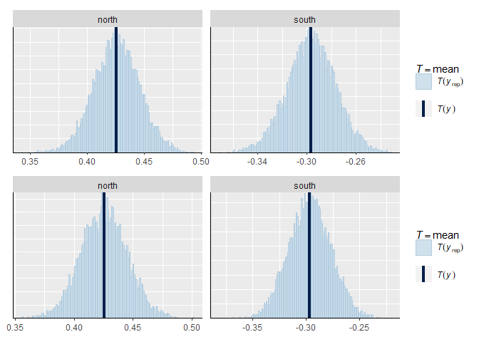<!-- -->

``` r
ppc_stat_grouped(y, yrep1, group = sites$survey_year_fct, binwidth = 0.001)
```

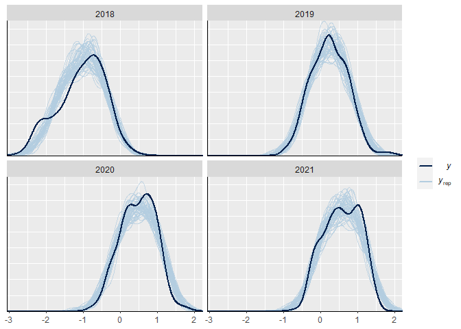<!-- -->

``` r
ppc_stat_grouped(y, yrep2, group = sites$survey_year_fct, binwidth = 0.001)
```

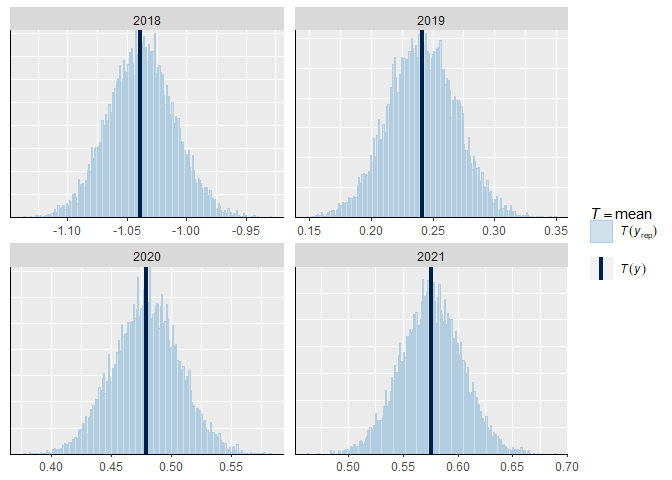<!-- -->

``` r
p1 <- ppc_stat_grouped(y, yrep1, group = sites$target_type, binwidth = 0.001)
p2 <- ppc_stat_grouped(y, yrep2, group = sites$target_type, binwidth = 0.001)
p1 / p2
```

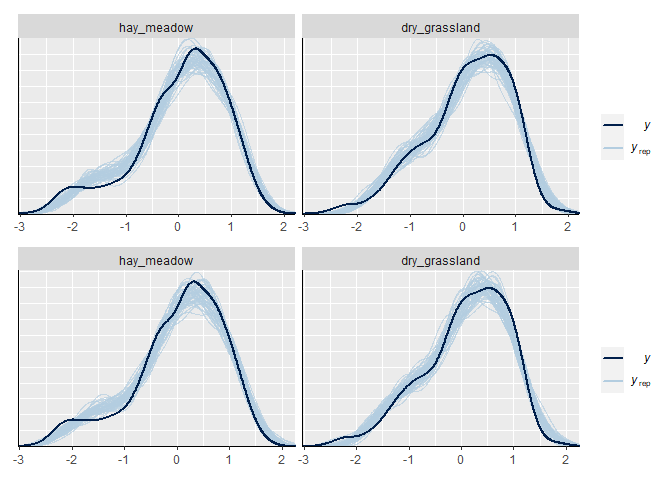<!-- -->

``` r
p1 <- ppc_stat_grouped(y, yrep1, group = sites$seed_density, binwidth = 0.001)
p2 <- ppc_stat_grouped(y, yrep2, group = sites$seed_density, binwidth = 0.001)
p1 / p2
```

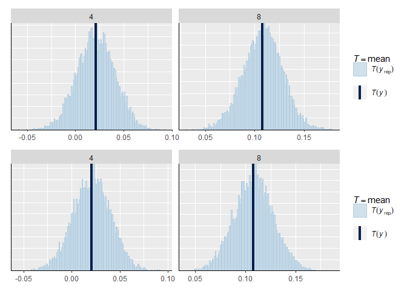<!-- -->

``` r
p1 <- ppc_stat_grouped(y, yrep1, group = sites$sand_ratio, binwidth = 0.001)
p2 <- ppc_stat_grouped(y, yrep2, group = sites$sand_ratio, binwidth = 0.001)
p1 / p2
```

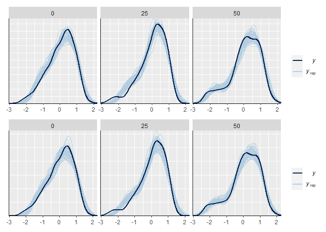<!-- -->

``` r
p1 <- ppc_stat_grouped(y, yrep1, group = sites$substrate_depth, binwidth = 0.001)
p2 <- ppc_stat_grouped(y, yrep2, group = sites$substrate_depth, binwidth = 0.001)
p1 / p2
```

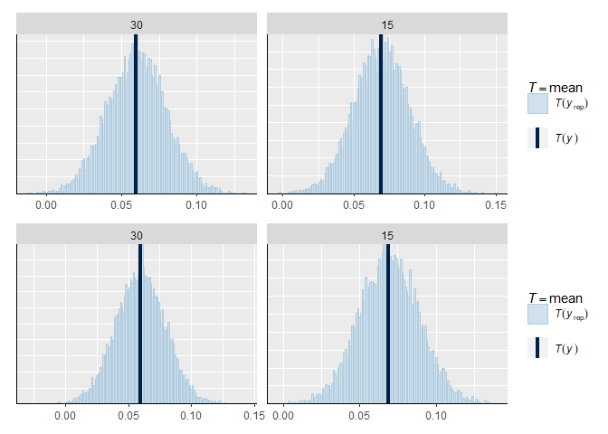<!-- -->

##### LOO (Leave one out)

``` r
loo1
```

    ## 
    ## Computed from 10000 by 1152 log-likelihood matrix
    ## 
    ##          Estimate   SE
    ## elpd_loo   -464.8 30.4
    ## p_loo       182.4  8.8
    ## looic       929.6 60.7
    ## ------
    ## Monte Carlo SE of elpd_loo is 0.3.
    ## 
    ## Pareto k diagnostic values:
    ##                          Count Pct.    Min. n_eff
    ## (-Inf, 0.5]   (good)     1136  98.6%   909       
    ##  (0.5, 0.7]   (ok)         16   1.4%   187       
    ##    (0.7, 1]   (bad)         0   0.0%   <NA>      
    ##    (1, Inf)   (very bad)    0   0.0%   <NA>      
    ## 
    ## All Pareto k estimates are ok (k < 0.7).
    ## See help('pareto-k-diagnostic') for details.

``` r
loo2
```

    ## 
    ## Computed from 10000 by 1152 log-likelihood matrix
    ## 
    ##          Estimate   SE
    ## elpd_loo   -471.3 30.4
    ## p_loo       187.0  9.0
    ## looic       942.5 60.8
    ## ------
    ## Monte Carlo SE of elpd_loo is 0.3.
    ## 
    ## Pareto k diagnostic values:
    ##                          Count Pct.    Min. n_eff
    ## (-Inf, 0.5]   (good)     1136  98.6%   650       
    ##  (0.5, 0.7]   (ok)         16   1.4%   171       
    ##    (0.7, 1]   (bad)         0   0.0%   <NA>      
    ##    (1, Inf)   (very bad)    0   0.0%   <NA>      
    ## 
    ## All Pareto k estimates are ok (k < 0.7).
    ## See help('pareto-k-diagnostic') for details.

``` r
plot(loo1)
```

<!-- -->

``` r
plot(loo2)
```

<!-- -->

Leave one out probability integral transform

``` r
p1 <- ppc_loo_pit_overlay(y, yrep1, lw = weights(loo1$psis_object))
```

    ## NOTE: The kernel density estimate assumes continuous observations and is not optimal for discrete observations.

``` r
p2 <- ppc_loo_pit_overlay(y, yrep2, lw = weights(loo2$psis_object))
```

    ## NOTE: The kernel density estimate assumes continuous observations and is not optimal for discrete observations.

``` r
p1 / p2
```

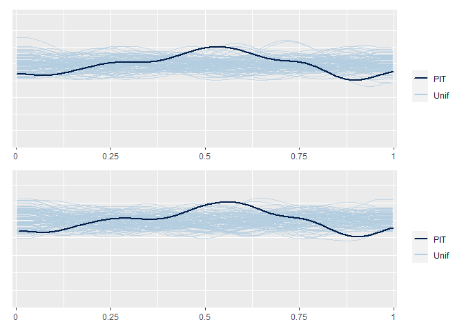<!-- -->

#### Autocorrelation check

``` r
mcmc_acf(posterior1, lags = 10)
```

<!-- -->

``` r
mcmc_acf(posterior2, lags = 10)
```

<!-- -->

## Output of choosen model

### Model output

Prior summary

``` r
prior_summary(m_1, all = FALSE)
```

    ##                   prior     class                coef group resp dpar nlpar lb
    ##            normal(0, 1)         b                                             
    ##          normal(0.1, 1)         b     expositionsouth                         
    ##          normal(0.1, 1)         b        sand_ratio25                         
    ##          normal(0.2, 1)         b        sand_ratio50                         
    ##          normal(0.1, 1)         b survey_year_fct2019                         
    ##          normal(0.2, 1)         b survey_year_fct2020                         
    ##          normal(0.3, 1)         b survey_year_fct2021                         
    ##  student_t(3, 0.2, 2.5) Intercept                                             
    ##    student_t(3, 0, 2.5)        sd                                            0
    ##            cauchy(0, 1)     sigma                                            0
    ##  ub  source
    ##        user
    ##        user
    ##        user
    ##        user
    ##        user
    ##        user
    ##        user
    ##     default
    ##     default
    ##        user

Conditional and marignal italic(R)²

``` r
bayes_R2(m_1, probs = c(0.05, 0.5, 0.95),
         re_formula =  ~ (1 | site/plot) + (1 | botanist_year)) 
```

    ##     Estimate   Est.Error        Q5       Q50       Q95
    ## R2 0.8462696 0.005180763 0.8374346 0.8464422 0.8545334

``` r
bayes_R2(m_1, probs = c(0.05, 0.5, 0.95),
         re_formula = 1 ~ 1)
```

    ##     Estimate   Est.Error        Q5       Q50       Q95
    ## R2 0.8080089 0.004623596 0.8000911 0.8082291 0.8151562

Posteriors

``` r
draws2
```

    ## # A tibble: 72 × 10
    ##    varia…¹     mean   median     sd    mad      q5     q95  rhat ess_b…² ess_t…³
    ##    <chr>      <dbl>    <dbl>  <dbl>  <dbl>   <dbl>   <dbl> <dbl>   <dbl>   <dbl>
    ##  1 b_Inte… -0.671   -0.671   0.0964 0.0919 -0.830  -0.515   1.00   5393.   7252.
    ##  2 b_sand…  0.153    0.154   0.0981 0.0982 -0.0103  0.312   1.00   4754.   6941.
    ##  3 b_sand…  0.139    0.139   0.0984 0.0978 -0.0215  0.305   1.00   5261.   7741.
    ##  4 b_targ…  0.00572  0.00509 0.0973 0.0977 -0.154   0.167   1.00   4343.   7133.
    ##  5 b_expo… -0.638   -0.638   0.113  0.114  -0.825  -0.453   1.00   4694.   7528.
    ##  6 b_surv…  0.819    0.806   0.607  0.609  -0.162   1.83    1.00   9830.   9415.
    ##  7 b_surv…  1.04     1.05    0.582  0.575   0.0991  2.00    1.00   9118.   8897.
    ##  8 b_surv…  0.911    0.914   0.718  0.726  -0.268   2.09    1.00   8838.   8496.
    ##  9 b_subs… -0.0982  -0.0983  0.0662 0.0658 -0.206   0.0116  1.00   8158.   9023.
    ## 10 b_seed…  0.0766   0.0761  0.0658 0.0657 -0.0307  0.186   1.00   7470.   8801.
    ## # … with 62 more rows, and abbreviated variable names ¹​variable, ²​ess_bulk,
    ## #   ³​ess_tail

``` r
mcmc_intervals(
  posterior1,
  prob = 0.66,
  prob_outer = 0.95,
  point_est = "mean"
  ) +
  theme_classic()
```

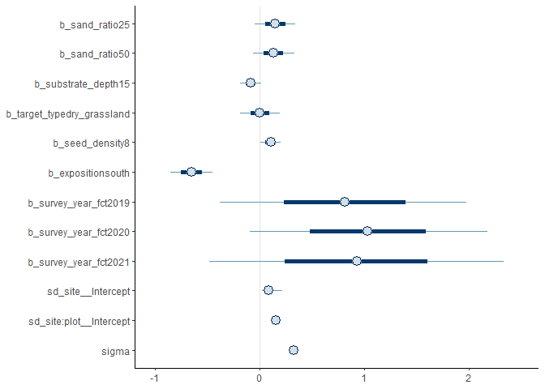<!-- -->

``` r
mcmc_intervals(
  posterior2,
  prob = 0.66,
  prob_outer = 0.95,
  point_est = "mean"
  ) +
  theme_classic()
```

<!-- -->

### Effect sizes

``` r
(emm <- emmeans(m_1, revpairwise ~ target_type + sand_ratio |
                  exposition | survey_year_fct, type = "response"))
```

    ## NOTE: A nesting structure was detected in the fitted model:
    ##     botanist_year %in% survey_year_fct

    ## $emmeans
    ## exposition = north, survey_year_fct = 2018:
    ##  target_type   sand_ratio  emmean lower.HPD upper.HPD
    ##  hay_meadow    0          -0.7311   -0.8998    -0.580
    ##  dry_grassland 0          -0.7263   -0.8806    -0.557
    ##  hay_meadow    25         -0.5795   -0.7382    -0.416
    ##  dry_grassland 25         -0.7223   -0.8910    -0.557
    ##  hay_meadow    50         -0.5956   -0.7567    -0.426
    ##  dry_grassland 50         -0.5480   -0.7188    -0.387
    ## 
    ## exposition = south, survey_year_fct = 2018:
    ##  target_type   sand_ratio  emmean lower.HPD upper.HPD
    ##  hay_meadow    0          -1.3409   -1.4999    -1.172
    ##  dry_grassland 0          -1.1748   -1.3353    -1.007
    ##  hay_meadow    25         -1.6047   -1.7717    -1.441
    ##  dry_grassland 25         -1.2178   -1.3890    -1.053
    ##  hay_meadow    50         -1.8562   -2.0179    -1.687
    ##  dry_grassland 50         -1.4943   -1.6678    -1.332
    ## 
    ## exposition = north, survey_year_fct = 2019:
    ##  target_type   sand_ratio  emmean lower.HPD upper.HPD
    ##  hay_meadow    0           0.3941   -0.5157     1.323
    ##  dry_grassland 0           0.3126   -0.6637     1.191
    ##  hay_meadow    25          0.2425   -0.6717     1.175
    ##  dry_grassland 25          0.1792   -0.7971     1.058
    ##  hay_meadow    50          0.4619   -0.5072     1.349
    ##  dry_grassland 50          0.4866   -0.4693     1.380
    ## 
    ## exposition = south, survey_year_fct = 2019:
    ##  target_type   sand_ratio  emmean lower.HPD upper.HPD
    ##  hay_meadow    0           0.0437   -0.4404     0.527
    ##  dry_grassland 0          -0.0654   -0.5374     0.438
    ##  hay_meadow    25          0.0245   -0.4803     0.492
    ##  dry_grassland 25          0.0498   -0.4229     0.560
    ##  hay_meadow    50         -0.0278   -0.4921     0.477
    ##  dry_grassland 50          0.1692   -0.2952     0.667
    ## 
    ## exposition = north, survey_year_fct = 2020:
    ##  target_type   sand_ratio  emmean lower.HPD upper.HPD
    ##  hay_meadow    0           0.7968    0.6315     0.964
    ##  dry_grassland 0           0.8605    0.7026     1.033
    ##  hay_meadow    25          0.8028    0.6356     0.968
    ##  dry_grassland 25          0.7699    0.5974     0.937
    ##  hay_meadow    50          0.8955    0.7226     1.054
    ##  dry_grassland 50          0.8679    0.7042     1.037
    ## 
    ## exposition = south, survey_year_fct = 2020:
    ##  target_type   sand_ratio  emmean lower.HPD upper.HPD
    ##  hay_meadow    0           0.0700   -0.0969     0.237
    ##  dry_grassland 0          -0.0799   -0.2474     0.089
    ##  hay_meadow    25          0.1472   -0.0222     0.312
    ##  dry_grassland 25          0.2573    0.0887     0.426
    ##  hay_meadow    50          0.0533   -0.1193     0.220
    ##  dry_grassland 50          0.3048    0.1344     0.475
    ## 
    ## exposition = north, survey_year_fct = 2021:
    ##  target_type   sand_ratio  emmean lower.HPD upper.HPD
    ##  hay_meadow    0           0.8979    0.7358     1.066
    ##  dry_grassland 0           0.9188    0.7516     1.083
    ##  hay_meadow    25          0.9451    0.7806     1.113
    ##  dry_grassland 25          0.9055    0.7364     1.073
    ##  hay_meadow    50          0.9915    0.8255     1.164
    ##  dry_grassland 50          1.0174    0.8436     1.179
    ## 
    ## exposition = south, survey_year_fct = 2021:
    ##  target_type   sand_ratio  emmean lower.HPD upper.HPD
    ##  hay_meadow    0           0.2735    0.1075     0.434
    ##  dry_grassland 0           0.1340   -0.0267     0.304
    ##  hay_meadow    25          0.1467   -0.0168     0.313
    ##  dry_grassland 25          0.2968    0.1331     0.473
    ##  hay_meadow    50          0.1468   -0.0167     0.321
    ##  dry_grassland 50          0.2364    0.0676     0.400
    ## 
    ## Results are averaged over the levels of: substrate_depth, seed_density, botanist_year 
    ## Point estimate displayed: median 
    ## HPD interval probability: 0.95 
    ## 
    ## $contrasts
    ## exposition = north, survey_year_fct = 2018:
    ##  contrast                                                estimate lower.HPD
    ##  dry_grassland sand_ratio0 - hay_meadow sand_ratio0       0.00603  -0.18366
    ##  hay_meadow sand_ratio25 - hay_meadow sand_ratio0         0.15270  -0.04284
    ##  hay_meadow sand_ratio25 - dry_grassland sand_ratio0      0.14640  -0.04866
    ##  dry_grassland sand_ratio25 - hay_meadow sand_ratio0      0.01067  -0.19146
    ##  dry_grassland sand_ratio25 - dry_grassland sand_ratio0   0.00357  -0.18896
    ##  dry_grassland sand_ratio25 - hay_meadow sand_ratio25    -0.14255  -0.34317
    ##  hay_meadow sand_ratio50 - hay_meadow sand_ratio0         0.13620  -0.05047
    ##  hay_meadow sand_ratio50 - dry_grassland sand_ratio0      0.13108  -0.07181
    ##  hay_meadow sand_ratio50 - hay_meadow sand_ratio25       -0.01547  -0.20979
    ##  hay_meadow sand_ratio50 - dry_grassland sand_ratio25     0.12712  -0.08055
    ##  dry_grassland sand_ratio50 - hay_meadow sand_ratio0      0.18306  -0.01535
    ##  dry_grassland sand_ratio50 - dry_grassland sand_ratio0   0.17770  -0.01808
    ##  dry_grassland sand_ratio50 - hay_meadow sand_ratio25     0.02900  -0.16210
    ##  dry_grassland sand_ratio50 - dry_grassland sand_ratio25  0.17417  -0.03053
    ##  dry_grassland sand_ratio50 - hay_meadow sand_ratio50     0.04742  -0.14738
    ##  upper.HPD
    ##    0.19254
    ##    0.34652
    ##    0.35043
    ##    0.21349
    ##    0.20057
    ##    0.05831
    ##    0.33897
    ##    0.32828
    ##    0.19182
    ##    0.32283
    ##    0.38664
    ##    0.37996
    ##    0.24230
    ##    0.37091
    ##    0.24674
    ## 
    ## exposition = south, survey_year_fct = 2018:
    ##  contrast                                                estimate lower.HPD
    ##  dry_grassland sand_ratio0 - hay_meadow sand_ratio0       0.16520  -0.03114
    ##  hay_meadow sand_ratio25 - hay_meadow sand_ratio0        -0.26457  -0.45876
    ##  hay_meadow sand_ratio25 - dry_grassland sand_ratio0     -0.42974  -0.63118
    ##  dry_grassland sand_ratio25 - hay_meadow sand_ratio0      0.12156  -0.08952
    ##  dry_grassland sand_ratio25 - dry_grassland sand_ratio0  -0.04408  -0.24998
    ##  dry_grassland sand_ratio25 - hay_meadow sand_ratio25     0.38893   0.18458
    ##  hay_meadow sand_ratio50 - hay_meadow sand_ratio0        -0.51657  -0.70647
    ##  hay_meadow sand_ratio50 - dry_grassland sand_ratio0     -0.68012  -0.88543
    ##  hay_meadow sand_ratio50 - hay_meadow sand_ratio25       -0.25114  -0.45360
    ##  hay_meadow sand_ratio50 - dry_grassland sand_ratio25    -0.63807  -0.84507
    ##  dry_grassland sand_ratio50 - hay_meadow sand_ratio0     -0.15369  -0.36010
    ##  dry_grassland sand_ratio50 - dry_grassland sand_ratio0  -0.32034  -0.52714
    ##  dry_grassland sand_ratio50 - hay_meadow sand_ratio25     0.10958  -0.09958
    ##  dry_grassland sand_ratio50 - dry_grassland sand_ratio25 -0.27767  -0.48595
    ##  dry_grassland sand_ratio50 - hay_meadow sand_ratio50     0.36238   0.15760
    ##  upper.HPD
    ##    0.36282
    ##   -0.06430
    ##   -0.22434
    ##    0.31859
    ##    0.16299
    ##    0.58620
    ##   -0.31382
    ##   -0.47502
    ##   -0.04266
    ##   -0.43225
    ##    0.05225
    ##   -0.12210
    ##    0.31020
    ##   -0.06860
    ##    0.56483
    ## 
    ## exposition = north, survey_year_fct = 2019:
    ##  contrast                                                estimate lower.HPD
    ##  dry_grassland sand_ratio0 - hay_meadow sand_ratio0      -0.08653  -0.29040
    ##  hay_meadow sand_ratio25 - hay_meadow sand_ratio0        -0.15952  -0.36061
    ##  hay_meadow sand_ratio25 - dry_grassland sand_ratio0     -0.07156  -0.28075
    ##  dry_grassland sand_ratio25 - hay_meadow sand_ratio0     -0.21555  -0.41232
    ##  dry_grassland sand_ratio25 - dry_grassland sand_ratio0  -0.12871  -0.33377
    ##  dry_grassland sand_ratio25 - hay_meadow sand_ratio25    -0.05827  -0.27187
    ##  hay_meadow sand_ratio50 - hay_meadow sand_ratio0         0.06026  -0.14964
    ##  hay_meadow sand_ratio50 - dry_grassland sand_ratio0      0.14589  -0.05694
    ##  hay_meadow sand_ratio50 - hay_meadow sand_ratio25        0.21947   0.02125
    ##  hay_meadow sand_ratio50 - dry_grassland sand_ratio25     0.27477   0.07571
    ##  dry_grassland sand_ratio50 - hay_meadow sand_ratio0      0.08963  -0.12005
    ##  dry_grassland sand_ratio50 - dry_grassland sand_ratio0   0.17676  -0.03668
    ##  dry_grassland sand_ratio50 - hay_meadow sand_ratio25     0.24855   0.05454
    ##  dry_grassland sand_ratio50 - dry_grassland sand_ratio25  0.30563   0.10150
    ##  dry_grassland sand_ratio50 - hay_meadow sand_ratio50     0.03159  -0.19006
    ##  upper.HPD
    ##    0.11476
    ##    0.04961
    ##    0.12905
    ##   -0.00443
    ##    0.07921
    ##    0.14011
    ##    0.25759
    ##    0.35998
    ##    0.42968
    ##    0.47966
    ##    0.29468
    ##    0.37594
    ##    0.47136
    ##    0.51490
    ##    0.23006
    ## 
    ## exposition = south, survey_year_fct = 2019:
    ##  contrast                                                estimate lower.HPD
    ##  dry_grassland sand_ratio0 - hay_meadow sand_ratio0      -0.10981  -0.32054
    ##  hay_meadow sand_ratio25 - hay_meadow sand_ratio0        -0.01867  -0.22149
    ##  hay_meadow sand_ratio25 - dry_grassland sand_ratio0      0.09303  -0.12463
    ##  dry_grassland sand_ratio25 - hay_meadow sand_ratio0      0.00729  -0.20036
    ##  dry_grassland sand_ratio25 - dry_grassland sand_ratio0   0.11731  -0.09202
    ##  dry_grassland sand_ratio25 - hay_meadow sand_ratio25     0.02483  -0.17960
    ##  hay_meadow sand_ratio50 - hay_meadow sand_ratio0        -0.07339  -0.26925
    ##  hay_meadow sand_ratio50 - dry_grassland sand_ratio0      0.03588  -0.17222
    ##  hay_meadow sand_ratio50 - hay_meadow sand_ratio25       -0.05535  -0.25104
    ##  hay_meadow sand_ratio50 - dry_grassland sand_ratio25    -0.08013  -0.29122
    ##  dry_grassland sand_ratio50 - hay_meadow sand_ratio0      0.12495  -0.08863
    ##  dry_grassland sand_ratio50 - dry_grassland sand_ratio0   0.23511   0.02751
    ##  dry_grassland sand_ratio50 - hay_meadow sand_ratio25     0.14250  -0.06688
    ##  dry_grassland sand_ratio50 - dry_grassland sand_ratio25  0.11655  -0.07777
    ##  dry_grassland sand_ratio50 - hay_meadow sand_ratio50     0.19780  -0.00775
    ##  upper.HPD
    ##    0.09650
    ##    0.18908
    ##    0.29141
    ##    0.21308
    ##    0.32905
    ##    0.22930
    ##    0.14213
    ##    0.23673
    ##    0.15257
    ##    0.12055
    ##    0.32650
    ##    0.44870
    ##    0.34692
    ##    0.33543
    ##    0.40042
    ## 
    ## exposition = north, survey_year_fct = 2020:
    ##  contrast                                                estimate lower.HPD
    ##  dry_grassland sand_ratio0 - hay_meadow sand_ratio0       0.06302  -0.13643
    ##  hay_meadow sand_ratio25 - hay_meadow sand_ratio0         0.00567  -0.19515
    ##  hay_meadow sand_ratio25 - dry_grassland sand_ratio0     -0.05695  -0.27085
    ##  dry_grassland sand_ratio25 - hay_meadow sand_ratio0     -0.02752  -0.23304
    ##  dry_grassland sand_ratio25 - dry_grassland sand_ratio0  -0.09120  -0.29650
    ##  dry_grassland sand_ratio25 - hay_meadow sand_ratio25    -0.03324  -0.23464
    ##  hay_meadow sand_ratio50 - hay_meadow sand_ratio0         0.09900  -0.10249
    ##  hay_meadow sand_ratio50 - dry_grassland sand_ratio0      0.03513  -0.17219
    ##  hay_meadow sand_ratio50 - hay_meadow sand_ratio25        0.09226  -0.11481
    ##  hay_meadow sand_ratio50 - dry_grassland sand_ratio25     0.12606  -0.06822
    ##  dry_grassland sand_ratio50 - hay_meadow sand_ratio0      0.07139  -0.13800
    ##  dry_grassland sand_ratio50 - dry_grassland sand_ratio0   0.00712  -0.19864
    ##  dry_grassland sand_ratio50 - hay_meadow sand_ratio25     0.06503  -0.14804
    ##  dry_grassland sand_ratio50 - dry_grassland sand_ratio25  0.09690  -0.10744
    ##  dry_grassland sand_ratio50 - hay_meadow sand_ratio50    -0.02861  -0.23333
    ##  upper.HPD
    ##    0.26913
    ##    0.21047
    ##    0.13910
    ##    0.17773
    ##    0.11621
    ##    0.17490
    ##    0.30536
    ##    0.23689
    ##    0.29979
    ##    0.33715
    ##    0.27278
    ##    0.21292
    ##    0.26218
    ##    0.29964
    ##    0.16967
    ## 
    ## exposition = south, survey_year_fct = 2020:
    ##  contrast                                                estimate lower.HPD
    ##  dry_grassland sand_ratio0 - hay_meadow sand_ratio0      -0.15095  -0.35188
    ##  hay_meadow sand_ratio25 - hay_meadow sand_ratio0         0.07797  -0.12405
    ##  hay_meadow sand_ratio25 - dry_grassland sand_ratio0      0.22803   0.01483
    ##  dry_grassland sand_ratio25 - hay_meadow sand_ratio0      0.18744  -0.02048
    ##  dry_grassland sand_ratio25 - dry_grassland sand_ratio0   0.33937   0.13061
    ##  dry_grassland sand_ratio25 - hay_meadow sand_ratio25     0.11081  -0.09719
    ##  hay_meadow sand_ratio50 - hay_meadow sand_ratio0        -0.01638  -0.22307
    ##  hay_meadow sand_ratio50 - dry_grassland sand_ratio0      0.13536  -0.07109
    ##  hay_meadow sand_ratio50 - hay_meadow sand_ratio25       -0.09322  -0.29686
    ##  hay_meadow sand_ratio50 - dry_grassland sand_ratio25    -0.20494  -0.41766
    ##  dry_grassland sand_ratio50 - hay_meadow sand_ratio0      0.23427   0.03174
    ##  dry_grassland sand_ratio50 - dry_grassland sand_ratio0   0.38402   0.18362
    ##  dry_grassland sand_ratio50 - hay_meadow sand_ratio25     0.15710  -0.04840
    ##  dry_grassland sand_ratio50 - dry_grassland sand_ratio25  0.04709  -0.16176
    ##  dry_grassland sand_ratio50 - hay_meadow sand_ratio50     0.25127   0.04071
    ##  upper.HPD
    ##    0.06210
    ##    0.28168
    ##    0.43284
    ##    0.39313
    ##    0.54943
    ##    0.31112
    ##    0.18441
    ##    0.33790
    ##    0.11372
    ##   -0.00414
    ##    0.43947
    ##    0.59257
    ##    0.36368
    ##    0.24520
    ##    0.45601
    ## 
    ## exposition = north, survey_year_fct = 2021:
    ##  contrast                                                estimate lower.HPD
    ##  dry_grassland sand_ratio0 - hay_meadow sand_ratio0       0.02181  -0.18510
    ##  hay_meadow sand_ratio25 - hay_meadow sand_ratio0         0.04836  -0.15458
    ##  hay_meadow sand_ratio25 - dry_grassland sand_ratio0      0.02752  -0.18549
    ##  dry_grassland sand_ratio25 - hay_meadow sand_ratio0      0.00543  -0.20143
    ##  dry_grassland sand_ratio25 - dry_grassland sand_ratio0  -0.01468  -0.21643
    ##  dry_grassland sand_ratio25 - hay_meadow sand_ratio25    -0.04019  -0.23644
    ##  hay_meadow sand_ratio50 - hay_meadow sand_ratio0         0.09266  -0.12233
    ##  hay_meadow sand_ratio50 - dry_grassland sand_ratio0      0.07272  -0.13819
    ##  hay_meadow sand_ratio50 - hay_meadow sand_ratio25        0.04566  -0.15478
    ##  hay_meadow sand_ratio50 - dry_grassland sand_ratio25     0.08495  -0.11556
    ##  dry_grassland sand_ratio50 - hay_meadow sand_ratio0      0.11843  -0.09013
    ##  dry_grassland sand_ratio50 - dry_grassland sand_ratio0   0.09789  -0.11116
    ##  dry_grassland sand_ratio50 - hay_meadow sand_ratio25     0.07011  -0.13198
    ##  dry_grassland sand_ratio50 - dry_grassland sand_ratio25  0.11272  -0.09793
    ##  dry_grassland sand_ratio50 - hay_meadow sand_ratio50     0.02634  -0.17757
    ##  upper.HPD
    ##    0.22266
    ##    0.25454
    ##    0.22701
    ##    0.21322
    ##    0.19769
    ##    0.17676
    ##    0.29051
    ##    0.27226
    ##    0.26129
    ##    0.29953
    ##    0.32293
    ##    0.30298
    ##    0.28348
    ##    0.31551
    ##    0.23851
    ## 
    ## exposition = south, survey_year_fct = 2021:
    ##  contrast                                                estimate lower.HPD
    ##  dry_grassland sand_ratio0 - hay_meadow sand_ratio0      -0.14033  -0.35310
    ##  hay_meadow sand_ratio25 - hay_meadow sand_ratio0        -0.12683  -0.33299
    ##  hay_meadow sand_ratio25 - dry_grassland sand_ratio0      0.01293  -0.19055
    ##  dry_grassland sand_ratio25 - hay_meadow sand_ratio0      0.02454  -0.18954
    ##  dry_grassland sand_ratio25 - dry_grassland sand_ratio0   0.16378  -0.04165
    ##  dry_grassland sand_ratio25 - hay_meadow sand_ratio25     0.15068  -0.05834
    ##  hay_meadow sand_ratio50 - hay_meadow sand_ratio0        -0.12646  -0.33382
    ##  hay_meadow sand_ratio50 - dry_grassland sand_ratio0      0.01363  -0.19097
    ##  hay_meadow sand_ratio50 - hay_meadow sand_ratio25       -0.00183  -0.19322
    ##  hay_meadow sand_ratio50 - dry_grassland sand_ratio25    -0.15124  -0.36036
    ##  dry_grassland sand_ratio50 - hay_meadow sand_ratio0     -0.04005  -0.24267
    ##  dry_grassland sand_ratio50 - dry_grassland sand_ratio0   0.10129  -0.10533
    ##  dry_grassland sand_ratio50 - hay_meadow sand_ratio25     0.08778  -0.12105
    ##  dry_grassland sand_ratio50 - dry_grassland sand_ratio25 -0.06097  -0.26651
    ##  dry_grassland sand_ratio50 - hay_meadow sand_ratio50     0.08740  -0.11410
    ##  upper.HPD
    ##    0.05219
    ##    0.07728
    ##    0.21701
    ##    0.22673
    ##    0.36780
    ##    0.35838
    ##    0.07403
    ##    0.21814
    ##    0.21249
    ##    0.05643
    ##    0.17257
    ##    0.30143
    ##    0.29165
    ##    0.15161
    ##    0.29808
    ## 
    ## Results are averaged over the levels of: substrate_depth, seed_density, botanist_year 
    ## Point estimate displayed: median 
    ## HPD interval probability: 0.95
