Favourable Conservation Status (FCS): <br> Analysis of Bauer et
al. (unpublished) Field experiment
================
Markus Bauer <br>
2022-11-11

# Preparation

#### Packages

``` r
library(here)
library(tidyverse)
library(ggbeeswarm)
library(patchwork)
library(brms)
library(DHARMa)
library(bayesplot)
library(loo)
library(tidybayes)
library(emmeans)
```

#### Load data

``` r
sites <- read_csv(here("data", "processed", "data_processed_sites.csv"),
                  col_names = TRUE, na = c("na", "NA", ""), col_types =
                    cols(
                      .default = "?",
                      plot = "f",
                      site = "f",
                      sand_ratio = "f",
                      substrate_depth = "f",
                      target_type = col_factor(levels = c(
                        "dry_grassland", "hay_meadow"
                        )),
                      seed_density = "f",
                      exposition = col_factor(levels = c(
                        "north", "south"
                      )),
                      survey_year = "d"
                    )) %>%
  ### Exclude data of seed mixtures
  filter(survey_year != "seeded") %>%
  mutate(
    survey_year_fct = factor(survey_year),
    botanist_year = str_c(survey_year, botanist, sep = " "),
    botanist_year = factor(botanist_year),
    n = fcs_target,
    id = factor(id)
    ) %>%
  select(
    id, plot, site, exposition, sand_ratio, substrate_depth, target_type,
    seed_density, survey_year_fct, survey_year, botanist_year, n
    )
```

    ## Warning: One or more parsing issues, call `problems()` on your data frame for details,
    ## e.g.:
    ##   dat <- vroom(...)
    ##   problems(dat)

# Statistics

## Data exploration

### Graphs of raw data

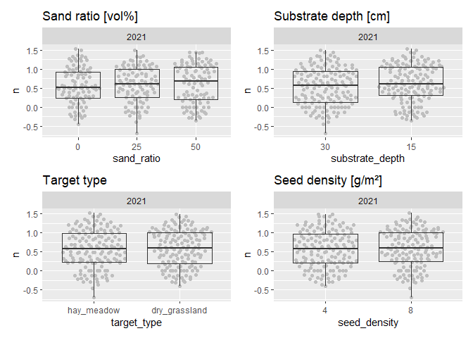<!-- -->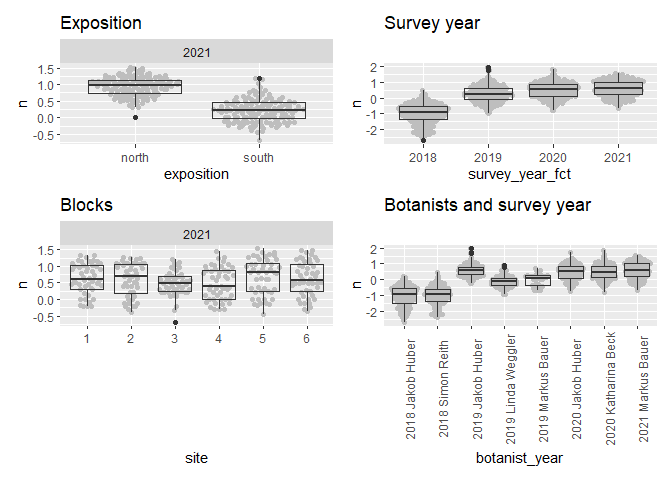<!-- --><!-- -->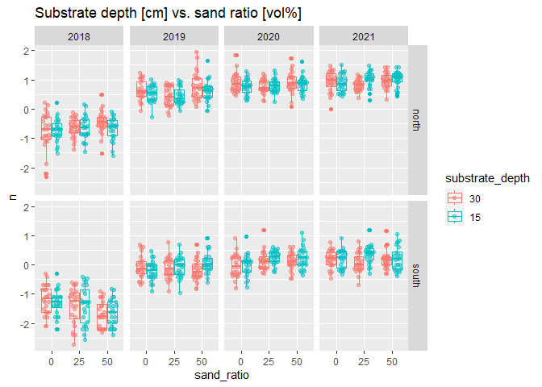<!-- -->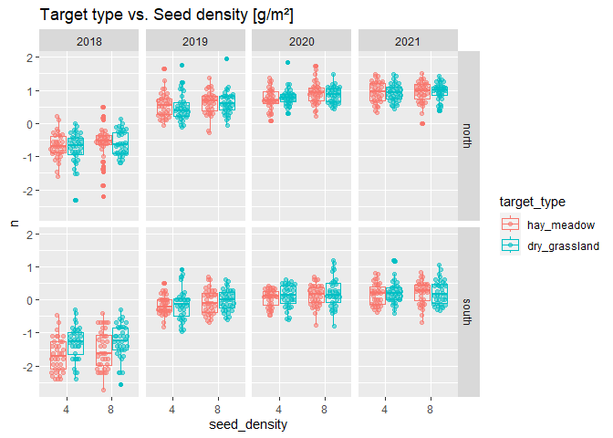<!-- -->

### Outliers, zero-inflation, transformations?

``` r
sites %>% group_by(exposition) %>% count(site)
```

    ## # A tibble: 12 × 3
    ## # Groups:   exposition [2]
    ##    exposition site      n
    ##    <fct>      <fct> <int>
    ##  1 north      1        96
    ##  2 north      2        96
    ##  3 north      3        96
    ##  4 north      4        96
    ##  5 north      5        96
    ##  6 north      6        96
    ##  7 south      1        96
    ##  8 south      2        96
    ##  9 south      3        96
    ## 10 south      4        96
    ## 11 south      5        96
    ## 12 south      6        96

``` r
boxplot(sites$n)
```

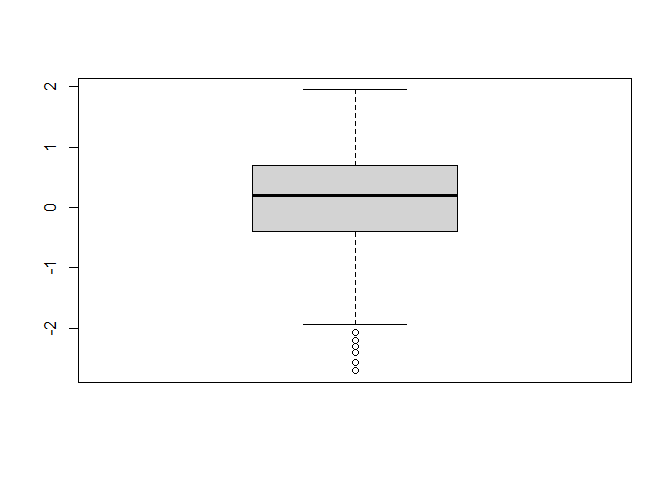<!-- -->

``` r
ggplot(sites, aes(x = exposition, y = n)) + geom_quasirandom()
```

<!-- -->

``` r
ggplot(sites, aes(x = n)) + geom_histogram(binwidth = 0.03)
```

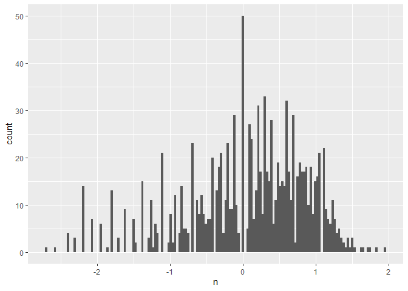<!-- -->

``` r
ggplot(sites, aes(x = n)) + geom_density()
```

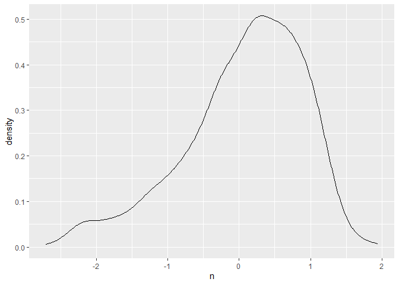<!-- -->

## Model building

### Models

Specifications for the models

``` r
iter = 10000
chains = 4
thin = 2
priors <- c(
  set_prior("normal(0, 1)", class = "b"),
  set_prior("normal(0.1, 1)", class = "b", coef = "sand_ratio25"),
  set_prior("normal(0.2, 1)", class = "b", coef = "sand_ratio50"),
  set_prior("normal(0.1, 1)", class = "b", coef = "expositionsouth"),
  set_prior("normal(0.1, 1)", class = "b", coef = "survey_year_fct2019"),
  set_prior("normal(0.2, 1)", class = "b", coef = "survey_year_fct2020"),
  set_prior("normal(0.3, 1)", class = "b",coef = "survey_year_fct2021"),
  set_prior("cauchy(0, 1)", class = "sigma")
)
```

Model caluclations

``` r
load(file = here("data", "processed", "model_fcs_1.Rdata"))
load(file = here("data", "processed", "model_fcs_2.Rdata"))
load(file = here("data", "processed", "model_fcs_3.Rdata"))
```

### Model comparison

``` r
m_1 <- m1
m_2 <- m3
m_1$formula
```

    ## n ~ (target_type + exposition + sand_ratio + survey_year_fct)^4 + substrate_depth + seed_density + (1 | site/plot) + (1 | botanist_year)

``` r
m_2$formula
```

    ## n ~ (target_type + exposition + sand_ratio + survey_year_fct)^2 + substrate_depth + seed_density + substrate_depth:sand_ratio + seed_density:exposition + target_type:exposition:survey_year_fct + sand_ratio:exposition:survey_year_fct + seed_density:exposition:survey_year_fct + (1 | site/plot) + (1 | botanist_year)

Conditional R² values

``` r
bayes_R2(m_1, probs = c(0.05, 0.5, 0.95),
         re_formula =  ~ (1 | site/plot) + (1 | botanist_year)) 
```

    ##     Estimate   Est.Error        Q5       Q50       Q95
    ## R2 0.8450271 0.005110434 0.8362782 0.8452897 0.8530061

``` r
bayes_R2(m_2, probs = c(0.05, 0.5, 0.95),
         re_formula =  ~ (1 | site/plot) + (1 | botanist_year))
```

    ##     Estimate   Est.Error        Q5    Q50      Q95
    ## R2 0.8456819 0.005090774 0.8368909 0.8459 0.853599

Marginal R² values

``` r
bayes_R2(m_1, probs = c(0.05, 0.5, 0.95),
         re_formula = 1 ~ 1)
```

    ##     Estimate  Est.Error        Q5       Q50       Q95
    ## R2 0.7895966 0.03725092 0.6974295 0.8018748 0.8179185

``` r
bayes_R2(m_2, probs = c(0.05, 0.5, 0.95),
         re_formula = 1 ~ 1)
```

    ##     Estimate  Est.Error        Q5       Q50       Q95
    ## R2 0.7896167 0.03690937 0.7144656 0.8015481 0.8174254

### Model check

#### DHARMa

``` r
createDHARMa(
  simulatedResponse = t(posterior_predict(m_1)),
  observedResponse = sites$n,
  fittedPredictedResponse = apply(t(posterior_epred(m_1)), 1, mean),
  integerResponse = TRUE
  ) %>%
  plot()
```

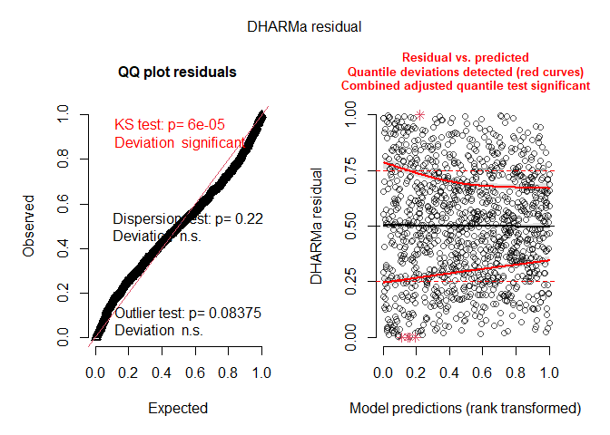<!-- -->

``` r
createDHARMa(
  simulatedResponse = t(posterior_predict(m_2)),
  observedResponse = sites$n,
  fittedPredictedResponse = apply(t(posterior_epred(m_2)), 1, mean),
  integerResponse = TRUE
  ) %>%
  plot()
```

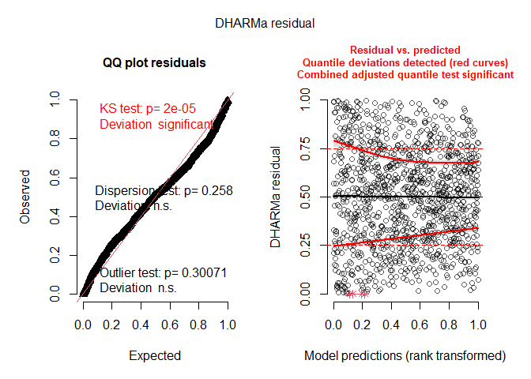<!-- -->

#### Preparation

``` r
posterior1 <- m_1 %>%
  posterior::as_draws() %>%
  posterior::subset_draws(
    variable = c(
      "b_sand_ratio25",
      "b_sand_ratio50",
      "b_substrate_depth30",
      "b_target_typehay_meadow",
      "b_seed_density8",
      "b_expositionsouth",
      "b_survey_year_fct2019",
      "b_survey_year_fct2020",
      "b_survey_year_fct2021",
      "sd_site__Intercept",
      "sd_site:plot__Intercept",
      "sd_botanist_year__Intercept",
      "sigma"
    )
  )
posterior2 <- m_2 %>%
  posterior::as_draws() %>%
  posterior::subset_draws(
    variable = c(
      "b_sand_ratio25",
      "b_sand_ratio50",
      "b_substrate_depth30",
      "b_target_typehay_meadow",
      "b_seed_density8",
      "b_expositionsouth",
      "b_survey_year_fct2019",
      "b_survey_year_fct2020",
      "b_survey_year_fct2021",
      "sd_site__Intercept",
      "sd_site:plot__Intercept",
      "sd_botanist_year__Intercept",
      "sigma"
    )
  )
hmc_diagnostics1 <- nuts_params(m_1)
hmc_diagnostics2 <- nuts_params(m_2)
y <- sites$n
yrep1 <- posterior_predict(m_1, draws = 500)
yrep2 <- posterior_predict(m_2, draws = 500)
loo1 <- loo(m_1, save_psis = TRUE, moment_match = FALSE)
loo2 <- loo(m_2, save_psis = TRUE, moment_match = FALSE)
draws1 <- m_1 %>%
  posterior::as_draws() %>%
  posterior::summarize_draws() %>%
  filter(str_starts(variable, "b_"))
draws2 <- m_2 %>%
  posterior::as_draws() %>%
  posterior::summarize_draws() %>%
  filter(str_starts(variable, "b_"))
```

#### Samling efficency/effectiveness (Rhat and EFF)

``` r
range(draws1$rhat)
```

    ## [1] 1.000989 1.036745

``` r
range(draws2$rhat)
```

    ## [1] 1.000632 1.029715

``` r
range(draws1$ess_bulk)
```

    ## [1]  152.7467 7615.8453

``` r
range(draws2$ess_bulk)
```

    ## [1]  132.730 6380.986

``` r
range(draws1$ess_tail)
```

    ## [1]   36.30687 8931.53449

``` r
range(draws2$ess_tail)
```

    ## [1]   32.26756 9111.76550

#### MCMC diagnostics

``` r
mcmc_trace(posterior1, np = hmc_diagnostics1)
```

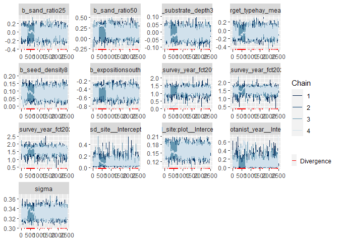<!-- -->

``` r
mcmc_trace(posterior2, np = hmc_diagnostics2)
```

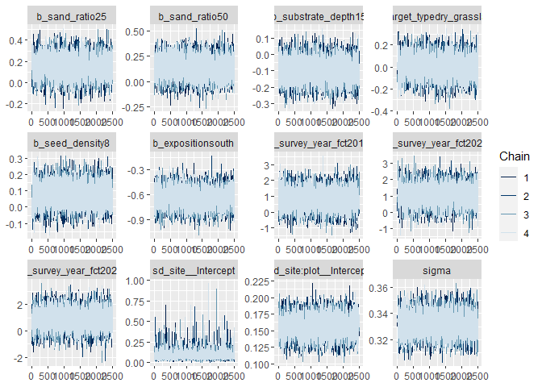<!-- -->

#### Posterior predictive check

##### Kernel density

``` r
p1 <- ppc_dens_overlay(y, yrep1[1:50, ])
p2 <- ppc_dens_overlay(y, yrep2[1:50, ])
p1 / p2
```

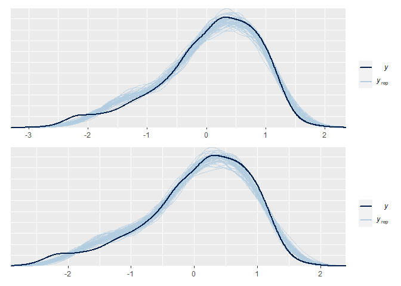<!-- -->

``` r
ppc_dens_overlay_grouped(y, yrep1[1:50, ], group = sites$site)
```

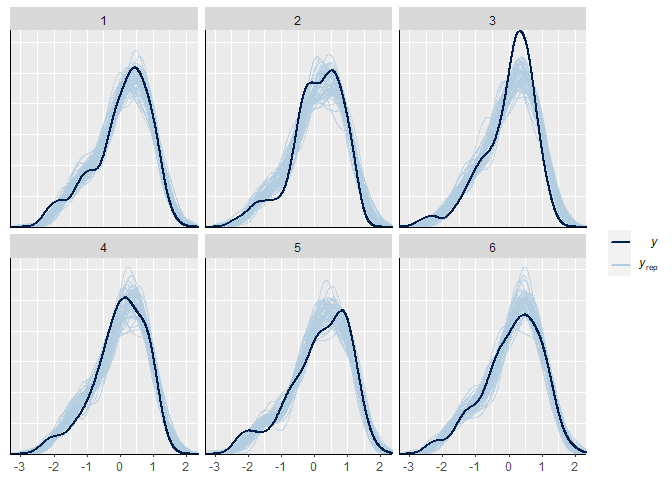<!-- -->

``` r
ppc_dens_overlay_grouped(y, yrep2[1:50, ], group = sites$site)
```

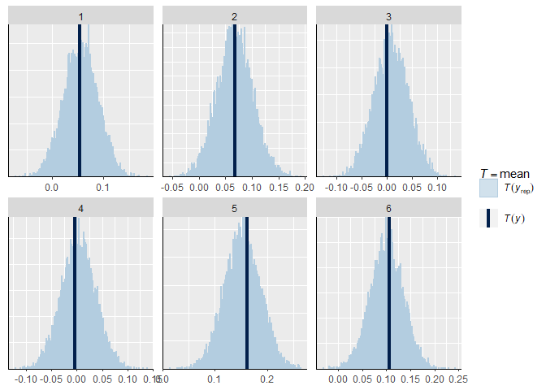<!-- -->

``` r
p1 <- ppc_dens_overlay_grouped(y, yrep1[1:50, ], group = sites$exposition)
p2 <- ppc_dens_overlay_grouped(y, yrep2[1:50, ], group = sites$exposition)
p1 / p2
```

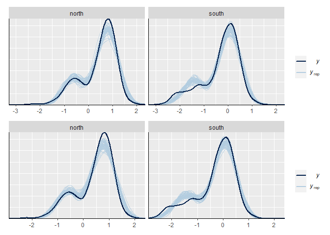<!-- -->

``` r
ppc_dens_overlay_grouped(y, yrep1[1:50, ], group = sites$survey_year_fct)
```

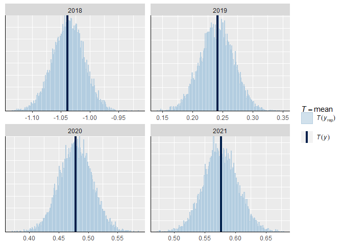<!-- -->

``` r
ppc_dens_overlay_grouped(y, yrep2[1:50, ], group = sites$survey_year_fct)
```

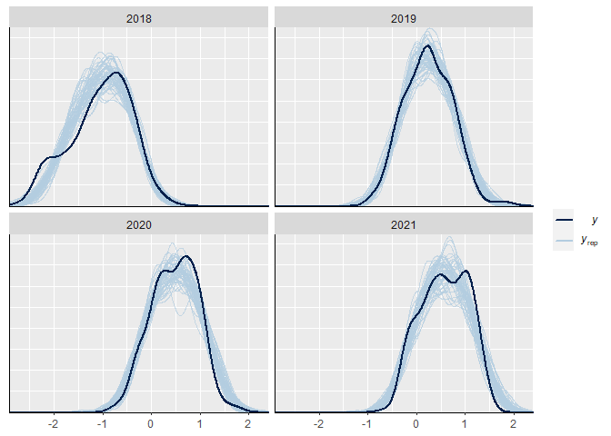<!-- -->

``` r
p1 <- ppc_dens_overlay_grouped(y, yrep1[1:50, ], group = sites$target_type)
p2 <- ppc_dens_overlay_grouped(y, yrep2[1:50, ], group = sites$target_type)
p1 / p2
```

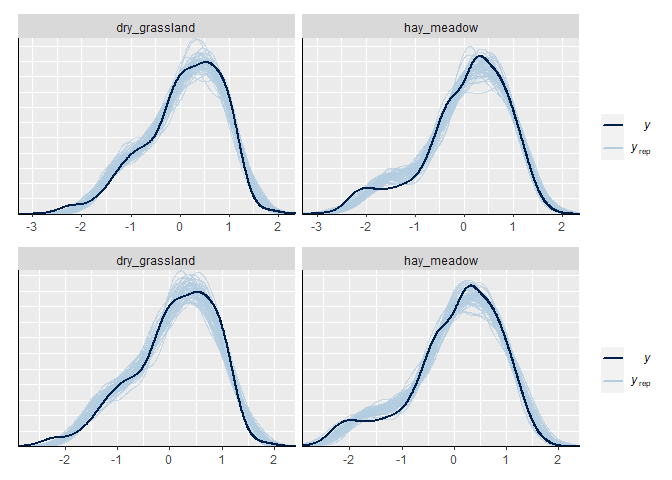<!-- -->

``` r
p1 <- ppc_dens_overlay_grouped(y, yrep1[1:50, ], group = sites$seed_density)
p2 <- ppc_dens_overlay_grouped(y, yrep2[1:50, ], group = sites$seed_density)
p1 / p2
```

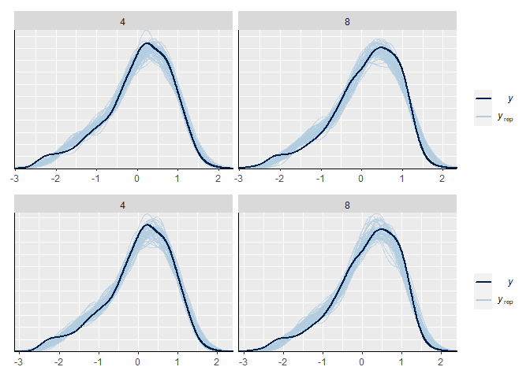<!-- -->

``` r
p1 <- ppc_dens_overlay_grouped(y, yrep1[1:50, ], group = sites$sand_ratio)
p2 <- ppc_dens_overlay_grouped(y, yrep2[1:50, ], group = sites$sand_ratio)
p1 / p2
```

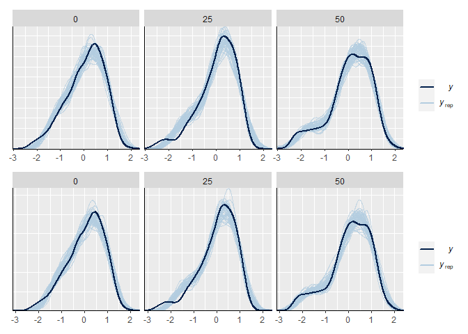<!-- -->

``` r
p1 <- ppc_dens_overlay_grouped(y, yrep1[1:50, ], group = sites$substrate_depth)
p2 <- ppc_dens_overlay_grouped(y, yrep2[1:50, ], group = sites$substrate_depth)
p1 / p2
```

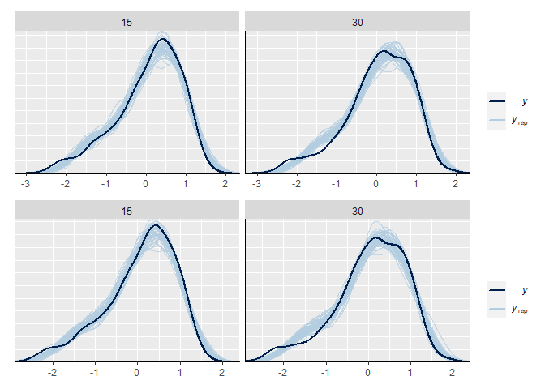<!-- -->

##### Histograms of statistics skew

``` r
p1 <- ppc_stat(y, yrep1, binwidth = 0.001)
p2 <- ppc_stat(y, yrep2, binwidth = 0.001)
p1 / p2
```

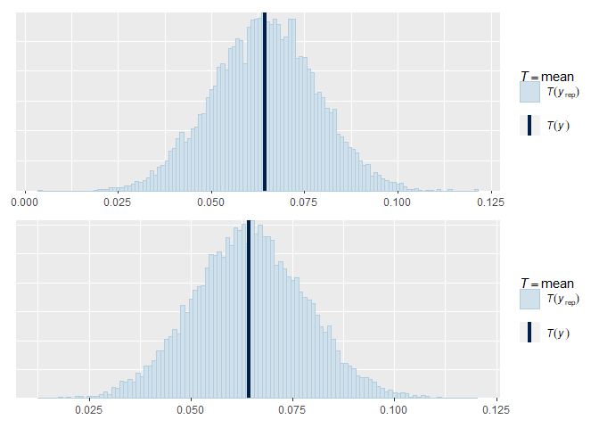<!-- -->

``` r
ppc_stat_grouped(y, yrep1, group = sites$site, binwidth = 0.001)
```

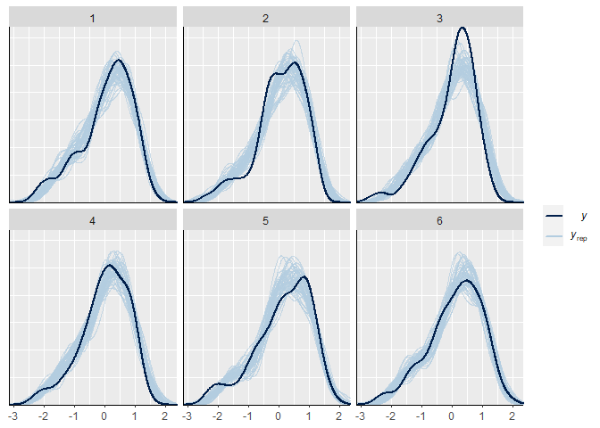<!-- -->

``` r
ppc_stat_grouped(y, yrep2, group = sites$site, binwidth = 0.001)
```

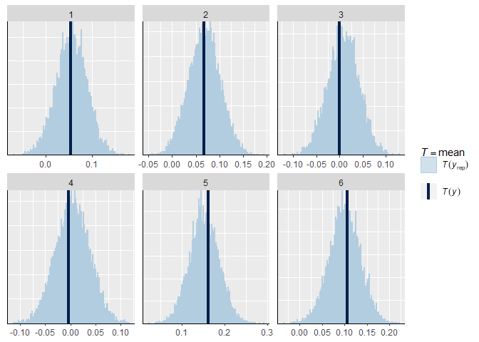<!-- -->

``` r
p1 <- ppc_stat_grouped(y, yrep1, group = sites$exposition, binwidth = 0.001)
p2 <- ppc_stat_grouped(y, yrep2, group = sites$exposition, binwidth = 0.001)
p1 / p2
```

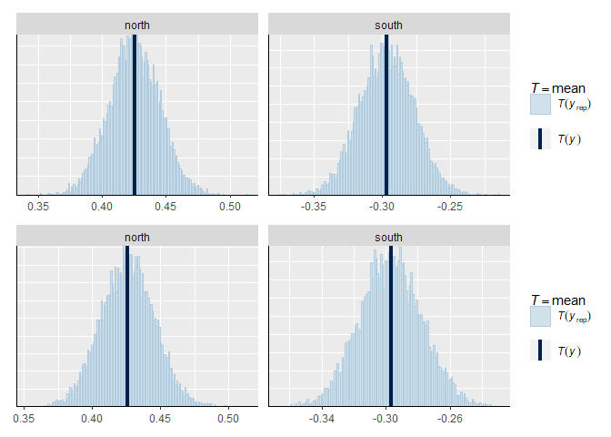<!-- -->

``` r
ppc_stat_grouped(y, yrep1, group = sites$survey_year_fct, binwidth = 0.001)
```

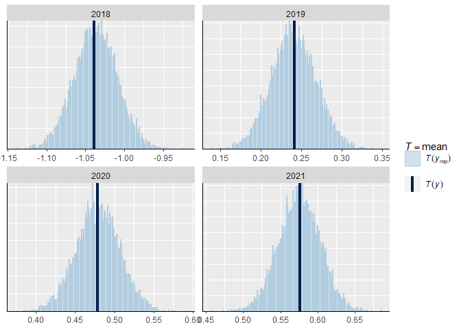<!-- -->

``` r
ppc_stat_grouped(y, yrep2, group = sites$survey_year_fct, binwidth = 0.001)
```

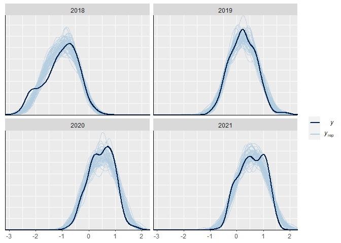<!-- -->

``` r
p1 <- ppc_stat_grouped(y, yrep1, group = sites$target_type, binwidth = 0.001)
p2 <- ppc_stat_grouped(y, yrep2, group = sites$target_type, binwidth = 0.001)
p1 / p2
```

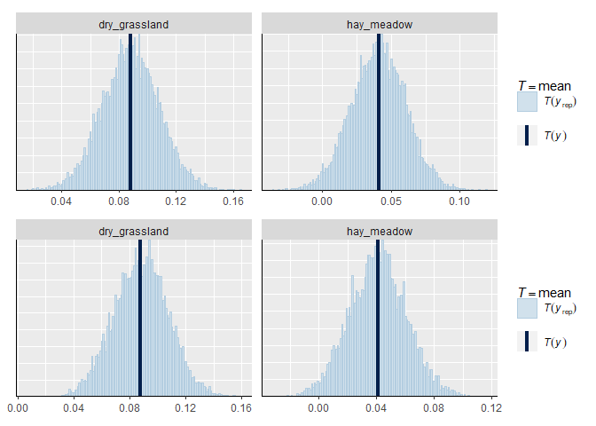<!-- -->

``` r
p1 <- ppc_stat_grouped(y, yrep1, group = sites$seed_density, binwidth = 0.001)
p2 <- ppc_stat_grouped(y, yrep2, group = sites$seed_density, binwidth = 0.001)
p1 / p2
```

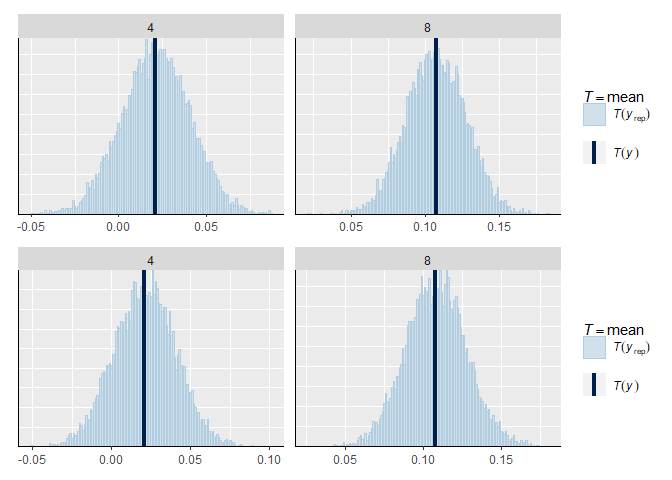<!-- -->

``` r
p1 <- ppc_stat_grouped(y, yrep1, group = sites$sand_ratio, binwidth = 0.001)
p2 <- ppc_stat_grouped(y, yrep2, group = sites$sand_ratio, binwidth = 0.001)
p1 / p2
```

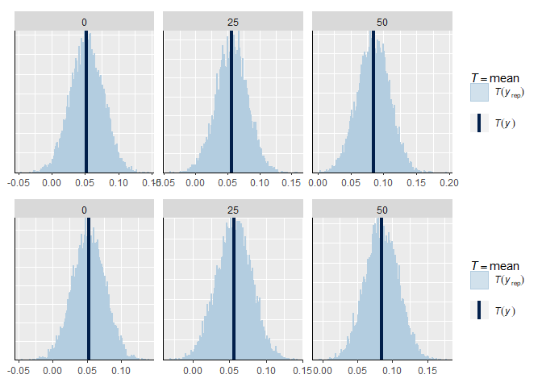<!-- -->

``` r
p1 <- ppc_stat_grouped(y, yrep1, group = sites$substrate_depth, binwidth = 0.001)
p2 <- ppc_stat_grouped(y, yrep2, group = sites$substrate_depth, binwidth = 0.001)
p1 / p2
```

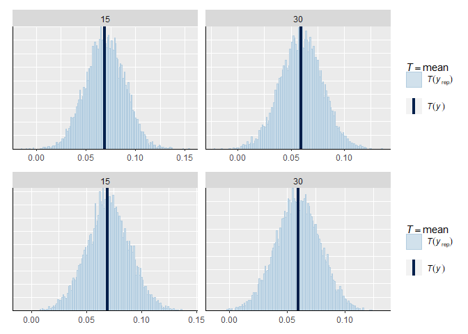<!-- -->

##### LOO-PIT plots

``` r
p1 <- ppc_loo_pit_overlay(y, yrep1, lw = weights(loo1$psis_object))
```

    ## NOTE: The kernel density estimate assumes continuous observations and is not optimal for discrete observations.

``` r
p2 <- ppc_loo_pit_overlay(y, yrep2, lw = weights(loo2$psis_object))
```

    ## NOTE: The kernel density estimate assumes continuous observations and is not optimal for discrete observations.

``` r
p1 / p2
```

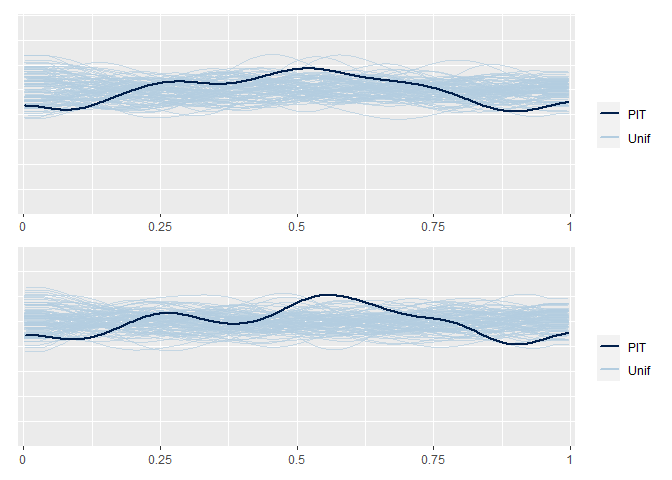<!-- -->

``` r
plot(loo1)
```

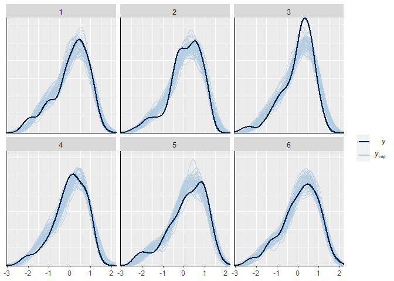<!-- -->

``` r
plot(loo2)
```

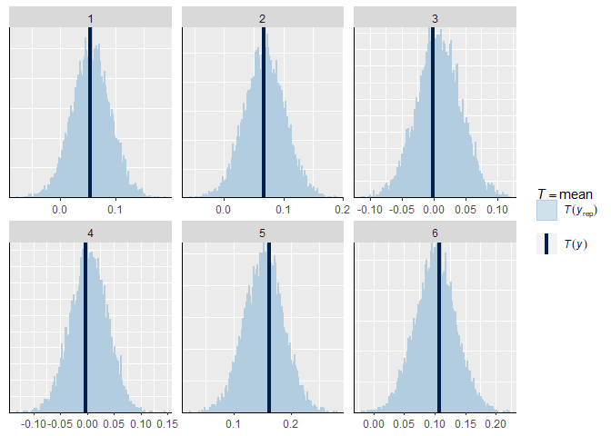<!-- -->

#### Autocorrelation check

``` r
mcmc_acf(posterior1, lags = 10)
```

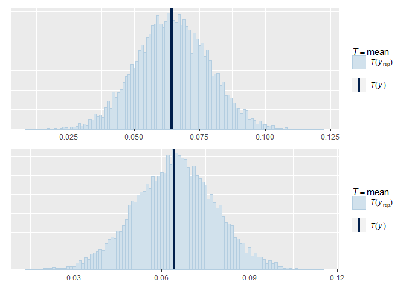<!-- -->

``` r
mcmc_acf(posterior2, lags = 10)
```

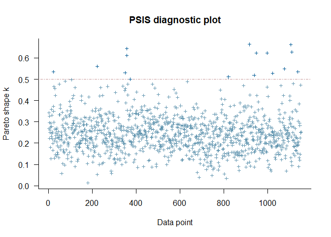<!-- -->

## Output of choosen model

### Model output

Priors and conditional and marignal R²

``` r
prior_summary(m_2, all = FALSE)
```

    ##                   prior     class                coef group resp dpar nlpar lb
    ##            normal(0, 1)         b                                             
    ##          normal(0.1, 1)         b     expositionsouth                         
    ##          normal(0.1, 1)         b        sand_ratio25                         
    ##          normal(0.2, 1)         b        sand_ratio50                         
    ##          normal(0.1, 1)         b survey_year_fct2019                         
    ##          normal(0.2, 1)         b survey_year_fct2020                         
    ##          normal(0.3, 1)         b survey_year_fct2021                         
    ##  student_t(3, 0.2, 2.5) Intercept                                             
    ##    student_t(3, 0, 2.5)        sd                                            0
    ##            cauchy(0, 1)     sigma                                            0
    ##  ub  source
    ##        user
    ##        user
    ##        user
    ##        user
    ##        user
    ##        user
    ##        user
    ##     default
    ##     default
    ##        user

``` r
bayes_R2(m_2, probs = c(0.05, 0.5, 0.95),
         re_formula =  ~ (1 | site/plot) + (1 | botanist_year)) 
```

    ##     Estimate   Est.Error        Q5    Q50      Q95
    ## R2 0.8456819 0.005090774 0.8368909 0.8459 0.853599

``` r
bayes_R2(m_2, probs = c(0.05, 0.5, 0.95),
         re_formula = 1 ~ 1)
```

    ##     Estimate  Est.Error        Q5       Q50       Q95
    ## R2 0.7896167 0.03690937 0.7144656 0.8015481 0.8174254

Posteriors

``` r
draws2
```

    ## # A tibble: 45 × 10
    ##    variable     mean  median     sd    mad       q5    q95  rhat ess_b…¹ ess_t…²
    ##    <chr>       <dbl>   <dbl>  <dbl>  <dbl>    <dbl>  <dbl> <dbl>   <dbl>   <dbl>
    ##  1 b_Interc… -0.831  -0.835  0.112  0.101  -1.00    -0.637  1.00   3467.  2954. 
    ##  2 b_target…  0.103   0.102  0.0740 0.0722 -0.0153   0.232  1.02    290.    65.5
    ##  3 b_exposi… -0.367  -0.366  0.0964 0.100  -0.528   -0.211  1.01    560.  1005. 
    ##  4 b_sand_r…  0.183   0.184  0.0861 0.0851  0.0441   0.325  1.00   2222.  5335. 
    ##  5 b_sand_r…  0.258   0.258  0.0840 0.0850  0.119    0.394  1.00   3756.  7229. 
    ##  6 b_survey…  1.23    1.26   0.186  0.137   0.852    1.47   1.02    165.    40.8
    ##  7 b_survey…  1.53    1.53   0.177  0.127   1.24     1.78   1.03    133.    34.2
    ##  8 b_survey…  1.65    1.66   0.174  0.142   1.31     1.89   1.02    207.   125. 
    ##  9 b_substr…  0.0592  0.0580 0.0457 0.0449 -0.0152   0.135  1.00   5583.  5825. 
    ## 10 b_seed_d…  0.101   0.100  0.0599 0.0625  0.00301  0.200  1.01   2144.  9112. 
    ## # … with 35 more rows, and abbreviated variable names ¹​ess_bulk, ²​ess_tail

``` r
mcmc_intervals(
  posterior1,
  prob = 0.66,
  prob_outer = 0.95,
  point_est = "mean"
)
```

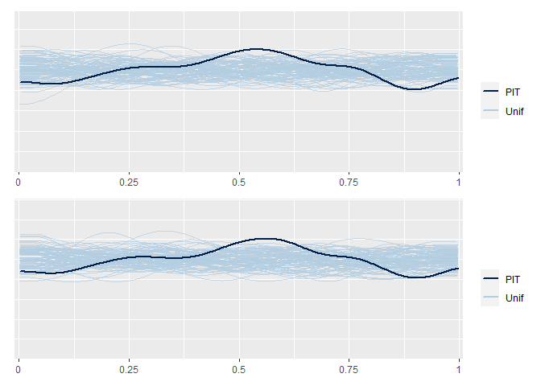<!-- -->

``` r
mcmc_intervals(
  posterior2,
  prob = 0.66,
  prob_outer = 0.95,
  point_est = "mean"
)
```

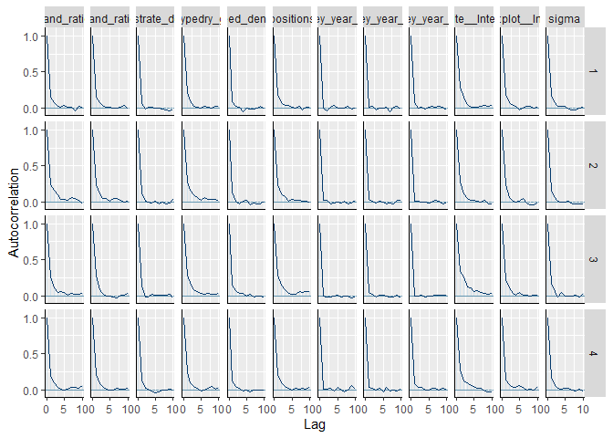<!-- -->

### Effect sizes

``` r
(emm <- emmeans(m_1, revpairwise ~ target_type + sand_ratio |
                  exposition | survey_year_fct, type = "response"))
```

    ## $emmeans
    ## exposition = north, survey_year_fct = 2018:
    ##  target_type   sand_ratio  emmean lower.HPD upper.HPD
    ##  dry_grassland 0          -0.6826 -0.882613    -0.348
    ##  hay_meadow    0          -0.7281 -0.936978    -0.434
    ##  dry_grassland 25         -0.7006 -0.920192    -0.357
    ##  hay_meadow    25         -0.5487 -0.788756    -0.185
    ##  dry_grassland 50         -0.5336 -0.803562    -0.167
    ##  hay_meadow    50         -0.5671 -0.808807    -0.209
    ## 
    ## exposition = south, survey_year_fct = 2018:
    ##  target_type   sand_ratio  emmean lower.HPD upper.HPD
    ##  dry_grassland 0          -1.1571 -1.363241    -0.702
    ##  hay_meadow    0          -1.3028 -1.515144    -0.965
    ##  dry_grassland 25         -1.1880 -1.414569    -0.802
    ##  hay_meadow    25         -1.5820 -1.799341    -1.240
    ##  dry_grassland 50         -1.4573 -1.707257    -1.115
    ##  hay_meadow    50         -1.8343 -2.063289    -1.524
    ## 
    ## exposition = north, survey_year_fct = 2019:
    ##  target_type   sand_ratio  emmean lower.HPD upper.HPD
    ##  dry_grassland 0           0.5128  0.058591     0.885
    ##  hay_meadow    0           0.6134  0.184636     0.933
    ##  dry_grassland 25          0.3969 -0.012672     0.704
    ##  hay_meadow    25          0.4447 -0.001715     0.786
    ##  dry_grassland 50          0.6972  0.260862     1.028
    ##  hay_meadow    50          0.6633  0.215108     0.990
    ## 
    ## exposition = south, survey_year_fct = 2019:
    ##  target_type   sand_ratio  emmean lower.HPD upper.HPD
    ##  dry_grassland 0          -0.1713 -0.514922     0.152
    ##  hay_meadow    0          -0.0655 -0.426103     0.249
    ##  dry_grassland 25         -0.0599 -0.408984     0.262
    ##  hay_meadow    25         -0.0844 -0.414146     0.254
    ##  dry_grassland 50          0.0574 -0.260412     0.421
    ##  hay_meadow    50         -0.1385 -0.457574     0.229
    ## 
    ## exposition = north, survey_year_fct = 2020:
    ##  target_type   sand_ratio  emmean lower.HPD upper.HPD
    ##  dry_grassland 0           0.8465  0.600432     1.124
    ##  hay_meadow    0           0.8054  0.581790     1.146
    ##  dry_grassland 25          0.7752  0.515467     1.083
    ##  hay_meadow    25          0.8024  0.502249     1.099
    ##  dry_grassland 50          0.8686  0.572155     1.204
    ##  hay_meadow    50          0.8935  0.568627     1.206
    ## 
    ## exposition = south, survey_year_fct = 2020:
    ##  target_type   sand_ratio  emmean lower.HPD upper.HPD
    ##  dry_grassland 0          -0.0741 -0.395141     0.258
    ##  hay_meadow    0           0.0681 -0.215590     0.371
    ##  dry_grassland 25          0.2566 -0.083162     0.561
    ##  hay_meadow    25          0.1500 -0.129384     0.437
    ##  dry_grassland 50          0.3000 -0.000398     0.619
    ##  hay_meadow    50          0.0558 -0.216775     0.351
    ## 
    ## exposition = north, survey_year_fct = 2021:
    ##  target_type   sand_ratio  emmean lower.HPD upper.HPD
    ##  dry_grassland 0           0.9059  0.611039     1.357
    ##  hay_meadow    0           0.8974  0.636541     1.338
    ##  dry_grassland 25          0.9031  0.627166     1.318
    ##  hay_meadow    25          0.9404  0.638225     1.293
    ##  dry_grassland 50          1.0147  0.742015     1.498
    ##  hay_meadow    50          0.9856  0.710479     1.385
    ## 
    ## exposition = south, survey_year_fct = 2021:
    ##  target_type   sand_ratio  emmean lower.HPD upper.HPD
    ##  dry_grassland 0           0.1346 -0.138292     0.617
    ##  hay_meadow    0           0.2683 -0.027731     0.611
    ##  dry_grassland 25          0.2930  0.019684     0.746
    ##  hay_meadow    25          0.1445 -0.129673     0.617
    ##  dry_grassland 50          0.2299 -0.047521     0.655
    ##  hay_meadow    50          0.1438 -0.165836     0.539
    ## 
    ## Results are averaged over the levels of: substrate_depth, seed_density 
    ## Point estimate displayed: median 
    ## HPD interval probability: 0.95 
    ## 
    ## $contrasts
    ## exposition = north, survey_year_fct = 2018:
    ##  contrast                                                estimate lower.HPD
    ##  hay_meadow sand_ratio0 - dry_grassland sand_ratio0      -0.04826  -0.22728
    ##  dry_grassland sand_ratio25 - dry_grassland sand_ratio0  -0.01483  -0.21159
    ##  dry_grassland sand_ratio25 - hay_meadow sand_ratio0      0.03001  -0.16340
    ##  hay_meadow sand_ratio25 - dry_grassland sand_ratio0      0.13792  -0.06407
    ##  hay_meadow sand_ratio25 - hay_meadow sand_ratio0         0.18306  -0.02541
    ##  hay_meadow sand_ratio25 - dry_grassland sand_ratio25     0.15449  -0.05414
    ##  dry_grassland sand_ratio50 - dry_grassland sand_ratio0   0.15345  -0.03484
    ##  dry_grassland sand_ratio50 - hay_meadow sand_ratio0      0.19937  -0.01596
    ##  dry_grassland sand_ratio50 - dry_grassland sand_ratio25  0.17384  -0.02915
    ##  dry_grassland sand_ratio50 - hay_meadow sand_ratio25     0.02085  -0.18929
    ##  hay_meadow sand_ratio50 - dry_grassland sand_ratio0      0.12035  -0.07423
    ##  hay_meadow sand_ratio50 - hay_meadow sand_ratio0         0.16634  -0.02895
    ##  hay_meadow sand_ratio50 - dry_grassland sand_ratio25     0.13762  -0.06145
    ##  hay_meadow sand_ratio50 - hay_meadow sand_ratio25       -0.01573  -0.21262
    ##  hay_meadow sand_ratio50 - dry_grassland sand_ratio50    -0.03702  -0.22713
    ##  upper.HPD
    ##    0.14512
    ##    0.16283
    ##    0.24656
    ##    0.33239
    ##    0.38154
    ##    0.34650
    ##    0.34243
    ##    0.41926
    ##    0.36564
    ##    0.21299
    ##    0.31949
    ##    0.37144
    ##    0.33907
    ##    0.19402
    ##    0.17163
    ## 
    ## exposition = south, survey_year_fct = 2018:
    ##  contrast                                                estimate lower.HPD
    ##  hay_meadow sand_ratio0 - dry_grassland sand_ratio0      -0.14935  -0.34608
    ##  dry_grassland sand_ratio25 - dry_grassland sand_ratio0  -0.03463  -0.23099
    ##  dry_grassland sand_ratio25 - hay_meadow sand_ratio0      0.11999  -0.08269
    ##  hay_meadow sand_ratio25 - dry_grassland sand_ratio0     -0.42802  -0.63596
    ##  hay_meadow sand_ratio25 - hay_meadow sand_ratio0        -0.27627  -0.47896
    ##  hay_meadow sand_ratio25 - dry_grassland sand_ratio25    -0.39657  -0.60847
    ##  dry_grassland sand_ratio50 - dry_grassland sand_ratio0  -0.30434  -0.50811
    ##  dry_grassland sand_ratio50 - hay_meadow sand_ratio0     -0.15057  -0.36237
    ##  dry_grassland sand_ratio50 - dry_grassland sand_ratio25 -0.27044  -0.47567
    ##  dry_grassland sand_ratio50 - hay_meadow sand_ratio25     0.12765  -0.08080
    ##  hay_meadow sand_ratio50 - dry_grassland sand_ratio0     -0.68005  -0.89262
    ##  hay_meadow sand_ratio50 - hay_meadow sand_ratio0        -0.53203  -0.72992
    ##  hay_meadow sand_ratio50 - dry_grassland sand_ratio25    -0.65028  -0.86621
    ##  hay_meadow sand_ratio50 - hay_meadow sand_ratio25       -0.25397  -0.45109
    ##  hay_meadow sand_ratio50 - dry_grassland sand_ratio50    -0.37921  -0.57387
    ##  upper.HPD
    ##    0.04627
    ##    0.16688
    ##    0.32617
    ##   -0.22362
    ##   -0.07867
    ##   -0.20102
    ##   -0.10187
    ##    0.04756
    ##   -0.06194
    ##    0.33304
    ##   -0.47634
    ##   -0.32837
    ##   -0.45321
    ##   -0.04317
    ##   -0.16267
    ## 
    ## exposition = north, survey_year_fct = 2019:
    ##  contrast                                                estimate lower.HPD
    ##  hay_meadow sand_ratio0 - dry_grassland sand_ratio0       0.10322  -0.09949
    ##  dry_grassland sand_ratio25 - dry_grassland sand_ratio0  -0.11426  -0.30982
    ##  dry_grassland sand_ratio25 - hay_meadow sand_ratio0     -0.21474  -0.42479
    ##  hay_meadow sand_ratio25 - dry_grassland sand_ratio0     -0.06713  -0.27153
    ##  hay_meadow sand_ratio25 - hay_meadow sand_ratio0        -0.17084  -0.36552
    ##  hay_meadow sand_ratio25 - dry_grassland sand_ratio25     0.04504  -0.17166
    ##  dry_grassland sand_ratio50 - dry_grassland sand_ratio0   0.18981  -0.02540
    ##  dry_grassland sand_ratio50 - hay_meadow sand_ratio0      0.08282  -0.12927
    ##  dry_grassland sand_ratio50 - dry_grassland sand_ratio25  0.29714   0.09610
    ##  dry_grassland sand_ratio50 - hay_meadow sand_ratio25     0.25593   0.04318
    ##  hay_meadow sand_ratio50 - dry_grassland sand_ratio0      0.15495  -0.06055
    ##  hay_meadow sand_ratio50 - hay_meadow sand_ratio0         0.04951  -0.15963
    ##  hay_meadow sand_ratio50 - dry_grassland sand_ratio25     0.26466   0.05480
    ##  hay_meadow sand_ratio50 - hay_meadow sand_ratio25        0.22067   0.00337
    ##  hay_meadow sand_ratio50 - dry_grassland sand_ratio50    -0.03364  -0.23498
    ##  upper.HPD
    ##    0.30448
    ##    0.11034
    ##   -0.01708
    ##    0.13942
    ##    0.04065
    ##    0.25690
    ##    0.38758
    ##    0.28415
    ##    0.50944
    ##    0.45579
    ##    0.35837
    ##    0.25067
    ##    0.47158
    ##    0.43434
    ##    0.16555
    ## 
    ## exposition = south, survey_year_fct = 2019:
    ##  contrast                                                estimate lower.HPD
    ##  hay_meadow sand_ratio0 - dry_grassland sand_ratio0       0.10414  -0.09832
    ##  dry_grassland sand_ratio25 - dry_grassland sand_ratio0   0.11137  -0.09422
    ##  dry_grassland sand_ratio25 - hay_meadow sand_ratio0      0.00508  -0.20473
    ##  hay_meadow sand_ratio25 - dry_grassland sand_ratio0      0.08666  -0.11721
    ##  hay_meadow sand_ratio25 - hay_meadow sand_ratio0        -0.01869  -0.22562
    ##  hay_meadow sand_ratio25 - dry_grassland sand_ratio25    -0.02458  -0.23507
    ##  dry_grassland sand_ratio50 - dry_grassland sand_ratio0   0.22927   0.02886
    ##  dry_grassland sand_ratio50 - hay_meadow sand_ratio0      0.12376  -0.08342
    ##  dry_grassland sand_ratio50 - dry_grassland sand_ratio25  0.11807  -0.07581
    ##  dry_grassland sand_ratio50 - hay_meadow sand_ratio25     0.14160  -0.07062
    ##  hay_meadow sand_ratio50 - dry_grassland sand_ratio0      0.02859  -0.18331
    ##  hay_meadow sand_ratio50 - hay_meadow sand_ratio0        -0.07603  -0.28076
    ##  hay_meadow sand_ratio50 - dry_grassland sand_ratio25    -0.08280  -0.29470
    ##  hay_meadow sand_ratio50 - hay_meadow sand_ratio25       -0.05651  -0.26909
    ##  hay_meadow sand_ratio50 - dry_grassland sand_ratio50    -0.19975  -0.40253
    ##  upper.HPD
    ##    0.30816
    ##    0.31243
    ##    0.21071
    ##    0.29870
    ##    0.18682
    ##    0.17677
    ##    0.43650
    ##    0.33066
    ##    0.33379
    ##    0.34059
    ##    0.23797
    ##    0.13584
    ##    0.11971
    ##    0.14573
    ##    0.01235
    ## 
    ## exposition = north, survey_year_fct = 2020:
    ##  contrast                                                estimate lower.HPD
    ##  hay_meadow sand_ratio0 - dry_grassland sand_ratio0      -0.03500  -0.24500
    ##  dry_grassland sand_ratio25 - dry_grassland sand_ratio0  -0.06664  -0.26429
    ##  dry_grassland sand_ratio25 - hay_meadow sand_ratio0     -0.03168  -0.23346
    ##  hay_meadow sand_ratio25 - dry_grassland sand_ratio0     -0.04073  -0.24549
    ##  hay_meadow sand_ratio25 - hay_meadow sand_ratio0        -0.00345  -0.19871
    ##  hay_meadow sand_ratio25 - dry_grassland sand_ratio25     0.02726  -0.17489
    ##  dry_grassland sand_ratio50 - dry_grassland sand_ratio0   0.02878  -0.17339
    ##  dry_grassland sand_ratio50 - hay_meadow sand_ratio0      0.06904  -0.13125
    ##  dry_grassland sand_ratio50 - dry_grassland sand_ratio25  0.10001  -0.11038
    ##  dry_grassland sand_ratio50 - hay_meadow sand_ratio25     0.06833  -0.13675
    ##  hay_meadow sand_ratio50 - dry_grassland sand_ratio0      0.05025  -0.16151
    ##  hay_meadow sand_ratio50 - hay_meadow sand_ratio0         0.08816  -0.11897
    ##  hay_meadow sand_ratio50 - dry_grassland sand_ratio25     0.12143  -0.09018
    ##  hay_meadow sand_ratio50 - hay_meadow sand_ratio25        0.09294  -0.11955
    ##  hay_meadow sand_ratio50 - dry_grassland sand_ratio50     0.02014  -0.18257
    ##  upper.HPD
    ##    0.15206
    ##    0.13535
    ##    0.17499
    ##    0.15941
    ##    0.20069
    ##    0.22568
    ##    0.23783
    ##    0.27349
    ##    0.29814
    ##    0.28025
    ##    0.26048
    ##    0.28974
    ##    0.31722
    ##    0.28608
    ##    0.23182
    ## 
    ## exposition = south, survey_year_fct = 2020:
    ##  contrast                                                estimate lower.HPD
    ##  hay_meadow sand_ratio0 - dry_grassland sand_ratio0       0.13439  -0.06102
    ##  dry_grassland sand_ratio25 - dry_grassland sand_ratio0   0.33003   0.12297
    ##  dry_grassland sand_ratio25 - hay_meadow sand_ratio0      0.19148  -0.00667
    ##  hay_meadow sand_ratio25 - dry_grassland sand_ratio0      0.21767   0.01122
    ##  hay_meadow sand_ratio25 - hay_meadow sand_ratio0         0.08266  -0.12245
    ##  hay_meadow sand_ratio25 - dry_grassland sand_ratio25    -0.11183  -0.31995
    ##  dry_grassland sand_ratio50 - dry_grassland sand_ratio0   0.36846   0.16340
    ##  dry_grassland sand_ratio50 - hay_meadow sand_ratio0      0.23416   0.02995
    ##  dry_grassland sand_ratio50 - dry_grassland sand_ratio25  0.04062  -0.15902
    ##  dry_grassland sand_ratio50 - hay_meadow sand_ratio25     0.15420  -0.05568
    ##  hay_meadow sand_ratio50 - dry_grassland sand_ratio0      0.12316  -0.08840
    ##  hay_meadow sand_ratio50 - hay_meadow sand_ratio0        -0.01246  -0.20880
    ##  hay_meadow sand_ratio50 - dry_grassland sand_ratio25    -0.20404  -0.41480
    ##  hay_meadow sand_ratio50 - hay_meadow sand_ratio25       -0.09340  -0.30493
    ##  hay_meadow sand_ratio50 - dry_grassland sand_ratio50    -0.24653  -0.45439
    ##  upper.HPD
    ##    0.35146
    ##    0.53250
    ##    0.40215
    ##    0.43090
    ##    0.28929
    ##    0.09518
    ##    0.57133
    ##    0.44976
    ##    0.24956
    ##    0.35318
    ##    0.32427
    ##    0.20778
    ##    0.00248
    ##    0.10561
    ##   -0.03515
    ## 
    ## exposition = north, survey_year_fct = 2021:
    ##  contrast                                                estimate lower.HPD
    ##  hay_meadow sand_ratio0 - dry_grassland sand_ratio0      -0.00981  -0.20699
    ##  dry_grassland sand_ratio25 - dry_grassland sand_ratio0  -0.00544  -0.19838
    ##  dry_grassland sand_ratio25 - hay_meadow sand_ratio0      0.00368  -0.19811
    ##  hay_meadow sand_ratio25 - dry_grassland sand_ratio0      0.03174  -0.17198
    ##  hay_meadow sand_ratio25 - hay_meadow sand_ratio0         0.04062  -0.16571
    ##  hay_meadow sand_ratio25 - dry_grassland sand_ratio25     0.03620  -0.17854
    ##  dry_grassland sand_ratio50 - dry_grassland sand_ratio0   0.10919  -0.08693
    ##  dry_grassland sand_ratio50 - hay_meadow sand_ratio0      0.12068  -0.08877
    ##  dry_grassland sand_ratio50 - dry_grassland sand_ratio25  0.11527  -0.08816
    ##  dry_grassland sand_ratio50 - hay_meadow sand_ratio25     0.07844  -0.13042
    ##  hay_meadow sand_ratio50 - dry_grassland sand_ratio0      0.07978  -0.12756
    ##  hay_meadow sand_ratio50 - hay_meadow sand_ratio0         0.08864  -0.12511
    ##  hay_meadow sand_ratio50 - dry_grassland sand_ratio25     0.08185  -0.12540
    ##  hay_meadow sand_ratio50 - hay_meadow sand_ratio25        0.04864  -0.16235
    ##  hay_meadow sand_ratio50 - dry_grassland sand_ratio50    -0.03134  -0.23698
    ##  upper.HPD
    ##    0.19360
    ##    0.20472
    ##    0.21573
    ##    0.24692
    ##    0.25081
    ##    0.23511
    ##    0.31699
    ##    0.32241
    ##    0.31670
    ##    0.28989
    ##    0.28088
    ##    0.29239
    ##    0.28907
    ##    0.25462
    ##    0.18032
    ## 
    ## exposition = south, survey_year_fct = 2021:
    ##  contrast                                                estimate lower.HPD
    ##  hay_meadow sand_ratio0 - dry_grassland sand_ratio0       0.12949  -0.07495
    ##  dry_grassland sand_ratio25 - dry_grassland sand_ratio0   0.15792  -0.03936
    ##  dry_grassland sand_ratio25 - hay_meadow sand_ratio0      0.02989  -0.17813
    ##  hay_meadow sand_ratio25 - dry_grassland sand_ratio0      0.00863  -0.20068
    ##  hay_meadow sand_ratio25 - hay_meadow sand_ratio0        -0.11951  -0.32441
    ##  hay_meadow sand_ratio25 - dry_grassland sand_ratio25    -0.15037  -0.36600
    ##  dry_grassland sand_ratio50 - dry_grassland sand_ratio0   0.09425  -0.11284
    ##  dry_grassland sand_ratio50 - hay_meadow sand_ratio0     -0.03378  -0.25125
    ##  dry_grassland sand_ratio50 - dry_grassland sand_ratio25 -0.06388  -0.27640
    ##  dry_grassland sand_ratio50 - hay_meadow sand_ratio25     0.08425  -0.12653
    ##  hay_meadow sand_ratio50 - dry_grassland sand_ratio0      0.00687  -0.19960
    ##  hay_meadow sand_ratio50 - hay_meadow sand_ratio0        -0.12245  -0.32155
    ##  hay_meadow sand_ratio50 - dry_grassland sand_ratio25    -0.15210  -0.35694
    ##  hay_meadow sand_ratio50 - hay_meadow sand_ratio25       -0.00220  -0.22085
    ##  hay_meadow sand_ratio50 - dry_grassland sand_ratio50    -0.08689  -0.28235
    ##  upper.HPD
    ##    0.33045
    ##    0.37045
    ##    0.23767
    ##    0.20991
    ##    0.09658
    ##    0.04706
    ##    0.29618
    ##    0.16425
    ##    0.13215
    ##    0.28973
    ##    0.21316
    ##    0.08064
    ##    0.05508
    ##    0.20079
    ##    0.12388
    ## 
    ## Results are averaged over the levels of: substrate_depth, seed_density 
    ## Point estimate displayed: median 
    ## HPD interval probability: 0.95
