Analysis of Bauer et al. (unpublished) Field experiment: <br>
Persistence
================
<b>Markus Bauer\*</b> <br>
<b>2022-12-05</b>

- <a href="#preparation" id="toc-preparation">Preparation</a>
- <a href="#statistics" id="toc-statistics">Statistics</a>
  - <a href="#data-exploration" id="toc-data-exploration">Data
    exploration</a>
    - <a href="#graphs-of-raw-data" id="toc-graphs-of-raw-data">Graphs of raw
      data</a>
    - <a href="#outliers-zero-inflation-transformations"
      id="toc-outliers-zero-inflation-transformations">Outliers,
      zero-inflation, transformations?</a>
  - <a href="#models" id="toc-models">Models</a>
    - <a href="#priors" id="toc-priors">Priors</a>
  - <a href="#model-check" id="toc-model-check">Model check</a>
    - <a href="#dharma" id="toc-dharma">DHARMa</a>
    - <a href="#preparation-1" id="toc-preparation-1">Preparation</a>
    - <a href="#sampling-efficency-and-effectiveness"
      id="toc-sampling-efficency-and-effectiveness">Sampling efficency and
      effectiveness</a>
    - <a href="#mcmc-diagnostics" id="toc-mcmc-diagnostics">MCMC
      diagnostics</a>
    - <a href="#posterior-predictive-check"
      id="toc-posterior-predictive-check">Posterior predictive check</a>
    - <a href="#autocorrelation-check"
      id="toc-autocorrelation-check">Autocorrelation check</a>
  - <a href="#output-of-choosen-model"
    id="toc-output-of-choosen-model">Output of choosen model</a>
    - <a href="#model-output" id="toc-model-output">Model output</a>
    - <a href="#effect-sizes" id="toc-effect-sizes">Effect sizes</a>
- <a href="#session-info" id="toc-session-info">Session info</a>

Technichal University of Munich, TUM School of Life Sciences, Chair of
Restoration Ecology, Emil-Ramann-Straße 6, 85354 Freising, Germany

\* Corresponding author: <markus1.bauer@tum.de> <br> ORCiD ID:
[0000-0001-5372-4174](https://orcid.org/0000-0001-5372-4174) <br>
[Google
Scholar](https://scholar.google.de/citations?user=oHhmOkkAAAAJ&hl=de&oi=ao)
<br> GitHub: [markus1bauer](https://github.com/markus1bauer)

Persistence sensu Wilsey (2021) Restor Ecol [DOI:
10.1111/rec.13132](https://doi.org/10.1111/rec.13132)

# Preparation

#### Packages

``` r
library(here)
library(tidyverse)
library(ggbeeswarm)
library(patchwork)
library(brms)
library(DHARMa)
library(DHARMa.helpers)
library(bayesplot)
library(loo)
library(tidybayes)
library(emmeans)
```

#### Load data

``` r
sites <- read_csv(
  here("data", "processed", "data_processed_sites_temporal.csv"),
  col_names = TRUE, na = c("na", "NA", ""),
  col_types = cols(
    .default = "?",
    plot = "f",
    site = "f",
    sand_ratio = "f",
    substrate_depth = col_factor(levels = c("30", "15")),
    target_type = col_factor(levels = c("hay_meadow", "dry_grassland")),
    seed_density = "f",
    exposition = col_factor(levels = c("north", "south")),
    survey_year = "c"
  )
  ) %>%
  ### Exclude data of seed mixtures
  filter(presabu == "presence") %>%
  mutate(
    survey_year_fct = factor(survey_year),
    botanist_year = str_c(survey_year, botanist, exposition, sep = " "),
    botanist_year = factor(botanist_year),
    id = factor(id),
    n = persistence
  ) %>%
  select(
    id, plot, site, exposition, sand_ratio, substrate_depth, target_type,
    seed_density, survey_year_fct, survey_year, botanist_year, n
  )
```

# Statistics

## Data exploration

### Graphs of raw data

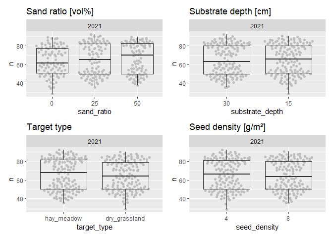<!-- -->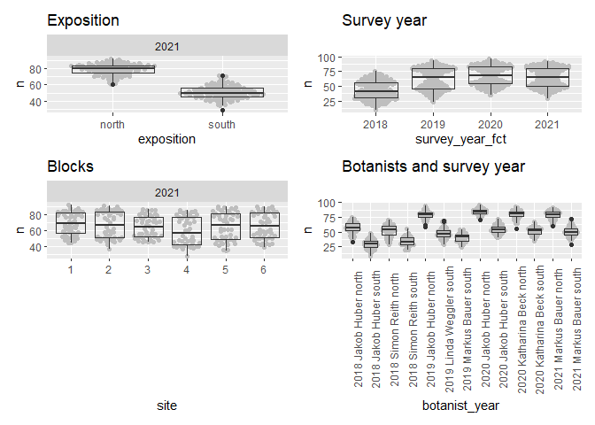<!-- -->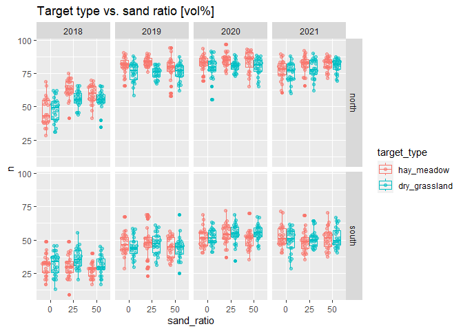<!-- -->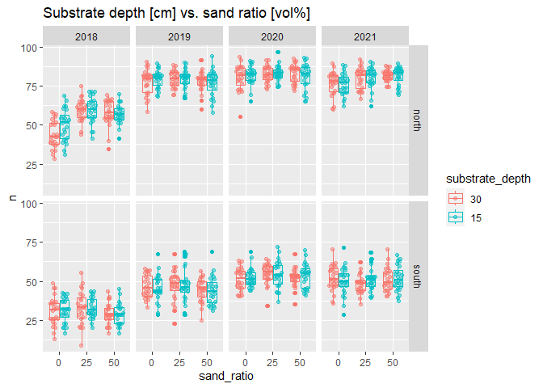<!-- -->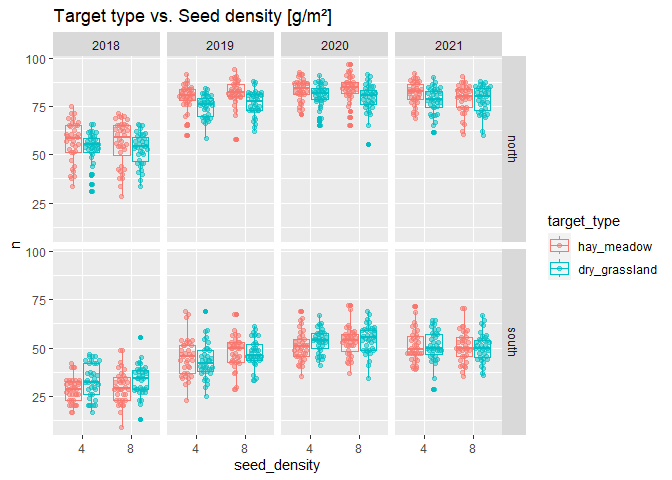<!-- -->

### Outliers, zero-inflation, transformations?

    ## # A tibble: 12 × 3
    ## # Groups:   exposition [2]
    ##    exposition site      n
    ##    <fct>      <fct> <int>
    ##  1 north      1        96
    ##  2 north      2        96
    ##  3 north      3        96
    ##  4 north      4        96
    ##  5 north      5        96
    ##  6 north      6        96
    ##  7 south      1        96
    ##  8 south      2        96
    ##  9 south      3        96
    ## 10 south      4        96
    ## 11 south      5        96
    ## 12 south      6        96

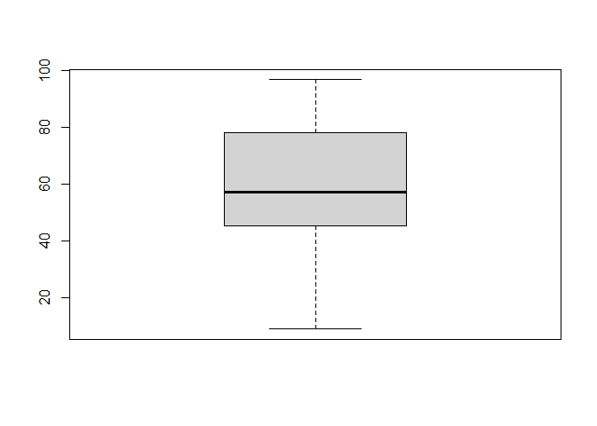<!-- -->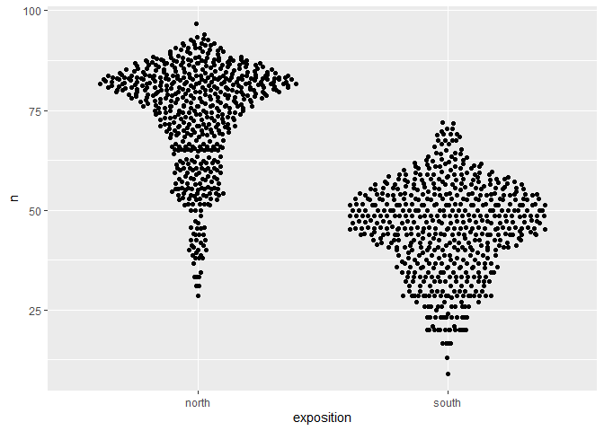<!-- --><!-- --><!-- -->

## Models

``` r
load(file = here("outputs", "models", "model_persistence_2.Rdata"))
load(file = here("outputs", "models", "model_persistence_full.Rdata"))
m_1 <- m2
m_2 <- m_full
```

``` r
m_1$formula
## n ~ sand_ratio * target_type * exposition * survey_year_fct + substrate_depth + seed_density + substrate_depth:exposition + seed_density:exposition + substrate_depth:survey_year_fct + seed_density:survey_year_fct + botanist_year + (1 | site/plot)
m_2$formula
## n ~ sand_ratio * target_type * exposition * survey_year_fct + substrate_depth * seed_density + substrate_depth:exposition + seed_density:exposition + substrate_depth:survey_year_fct + seed_density:survey_year_fct + substrate_depth:exposition:survey_year_fct + seed_density:exposition:survey_year_fct + botanist_year + (1 | site/plot)
```

``` r
m_1$family
## 
## Family: gaussian 
## Link function: identity
m_2$family
## 
## Family: gaussian 
## Link function: identity
```

### Priors

#### Possible prior distributions

``` r
get_prior(n ~ target_type + exposition + sand_ratio + survey_year_fct +
            seed_density + substrate_depth +
            (1 | site/plot),
          data = sites)
```

    ##                     prior     class                     coef     group resp
    ##                    (flat)         b                                        
    ##                    (flat)         b          expositionsouth               
    ##                    (flat)         b             sand_ratio25               
    ##                    (flat)         b             sand_ratio50               
    ##                    (flat)         b            seed_density8               
    ##                    (flat)         b        substrate_depth15               
    ##                    (flat)         b      survey_year_fct2019               
    ##                    (flat)         b      survey_year_fct2020               
    ##                    (flat)         b      survey_year_fct2021               
    ##                    (flat)         b target_typedry_grassland               
    ##  student_t(3, 57.1, 23.5) Intercept                                        
    ##     student_t(3, 0, 23.5)        sd                                        
    ##     student_t(3, 0, 23.5)        sd                               site     
    ##     student_t(3, 0, 23.5)        sd                Intercept      site     
    ##     student_t(3, 0, 23.5)        sd                          site:plot     
    ##     student_t(3, 0, 23.5)        sd                Intercept site:plot     
    ##     student_t(3, 0, 23.5)     sigma                                        
    ##  dpar nlpar lb ub       source
    ##                        default
    ##                   (vectorized)
    ##                   (vectorized)
    ##                   (vectorized)
    ##                   (vectorized)
    ##                   (vectorized)
    ##                   (vectorized)
    ##                   (vectorized)
    ##                   (vectorized)
    ##                   (vectorized)
    ##                        default
    ##              0         default
    ##              0    (vectorized)
    ##              0    (vectorized)
    ##              0    (vectorized)
    ##              0    (vectorized)
    ##              0         default

``` r
ggplot(data = data.frame(x = c(-40, 40)), aes(x = x)) +
  stat_function(fun = dnorm, n = 101, args = list(mean = 0, sd = 10)) +
  expand_limits(y = 0) + ggtitle("Normal distribution")
```

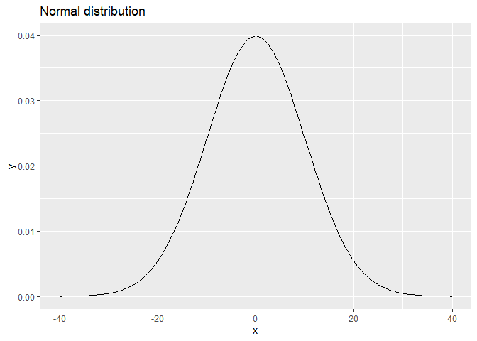<!-- -->

``` r
ggplot(data = data.frame(x = c(-40, 40)), aes(x = x)) +
  stat_function(fun = dcauchy, n = 101, args = list(location = 0, scale = 10)) +
  expand_limits(y = 0) + ggtitle("Cauchy distribution")
```

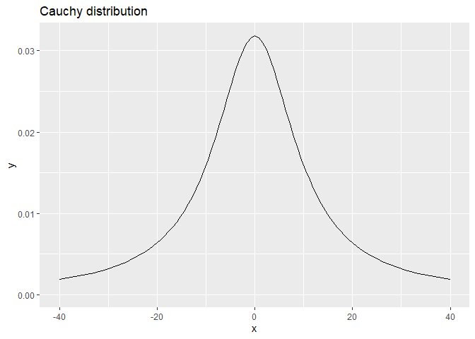<!-- -->

``` r
ggplot(data.frame(x = c(-40, 40)), aes(x = x)) +
  stat_function(fun = dstudent_t, args = list(df = 3, mu = 0, sigma = 10)) +
  expand_limits(y = 0) + ggtitle(expression(Student~italic(t)*"-distribution"))
```

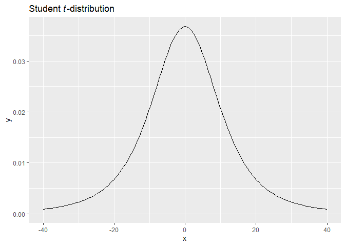<!-- -->

#### Prior summary

``` r
prior_summary(m_1, all = FALSE)
```

    ##                  prior     class                coef group resp dpar nlpar lb
    ##          normal(0, 20)         b                                             
    ##         normal(-5, 20)         b     expositionsouth                         
    ##        normal(2.5, 20)         b        sand_ratio25                         
    ##          normal(5, 20)         b        sand_ratio50                         
    ##        normal(2.5, 20)         b survey_year_fct2019                         
    ##          normal(5, 20)         b survey_year_fct2020                         
    ##        normal(7.5, 20)         b survey_year_fct2021                         
    ##          normal(0, 20) Intercept                                             
    ##  student_t(3, 0, 23.5)        sd                                            0
    ##          cauchy(0, 10)     sigma                                            0
    ##  ub  source
    ##        user
    ##        user
    ##        user
    ##        user
    ##        user
    ##        user
    ##        user
    ##        user
    ##     default
    ##        user

Conditional <i>R</i>² values

``` r
bayes_R2(m_1, probs = c(0.05, 0.5, 0.95),
         re_formula =  ~ (1 | site/plot) + (1 | botanist_year)) 
##     Estimate  Est.Error        Q5       Q50       Q95
## R2 0.8944769 0.00336097 0.8887784 0.8946214 0.8997545
bayes_R2(m_2, probs = c(0.05, 0.5, 0.95),
         re_formula =  ~ (1 | site/plot) + (1 | botanist_year))
##     Estimate   Est.Error        Q5       Q50       Q95
## R2 0.8940185 0.003336802 0.8883183 0.8941352 0.8992336
```

Marginal <i>R</i>² values

``` r
bayes_R2(m_1, probs = c(0.05, 0.5, 0.95),
         re_formula = 1 ~ 1)
##     Estimate   Est.Error        Q5       Q50       Q95
## R2 0.8587825 0.003575485 0.8526128 0.8589943 0.8643421
bayes_R2(m_2, probs = c(0.05, 0.5, 0.95),
         re_formula = 1 ~ 1)
##     Estimate   Est.Error        Q5       Q50       Q95
## R2 0.8585192 0.003539931 0.8524192 0.8587055 0.8639556
```

## Model check

### DHARMa

``` r
DHARMa.helpers::dh_check_brms(m_1, integer = TRUE)
```

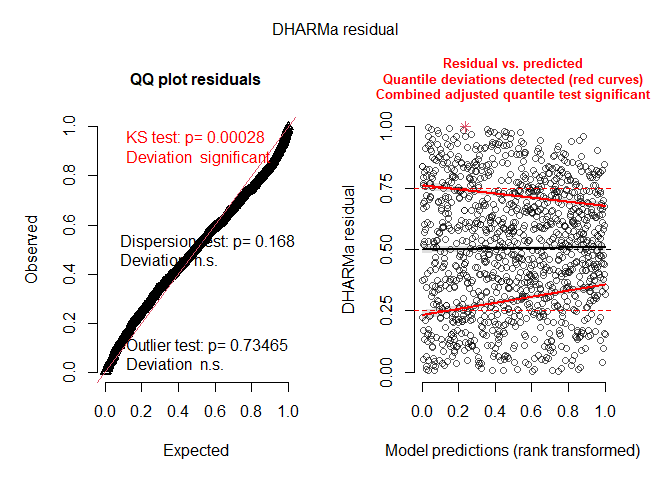<!-- -->

``` r
DHARMa.helpers::dh_check_brms(m_2, integer = TRUE)
```

<!-- -->

### Preparation

``` r
posterior1 <- m_1 %>%
  posterior::as_draws() %>%
  posterior::subset_draws(
    variable = c(
      "b_sand_ratio25",
      "b_sand_ratio50",
      "b_substrate_depth15",
      "b_target_typedry_grassland",
      "b_seed_density8",
      "b_expositionsouth",
      "b_survey_year_fct2019",
      "b_survey_year_fct2020",
      "b_survey_year_fct2021",
      "sd_site__Intercept",
      "sd_site:plot__Intercept",
      "sigma"
    )
  )
posterior2 <- m_2 %>%
  posterior::as_draws() %>%
  posterior::subset_draws(
    variable = c(
      "b_sand_ratio25",
      "b_sand_ratio50",
      "b_substrate_depth15",
      "b_target_typedry_grassland",
      "b_seed_density8",
      "b_expositionsouth",
      "b_survey_year_fct2019",
      "b_survey_year_fct2020",
      "b_survey_year_fct2021",
      "sd_site__Intercept",
      "sd_site:plot__Intercept",
      "sigma"
    )
  )
hmc_diagnostics1 <- nuts_params(m_1)
hmc_diagnostics2 <- nuts_params(m_2)
y <- sites$n
yrep1 <- posterior_predict(m_1, draws = 500)
yrep2 <- posterior_predict(m_2, draws = 500)
loo1 <- loo(m_1, save_psis = TRUE, moment_match = FALSE)
loo2 <- loo(m_2, save_psis = TRUE, moment_match = FALSE)
draws1 <- m_1 %>%
  posterior::as_draws() %>%
  posterior::summarize_draws() %>%
  filter(str_starts(variable, "b_"))
draws2 <- m_2 %>%
  posterior::as_draws() %>%
  posterior::summarize_draws() %>%
  filter(str_starts(variable, "b_"))
```

### Sampling efficency and effectiveness

#### Rhat

``` r
mcmc_rhat(draws1$rhat)
```

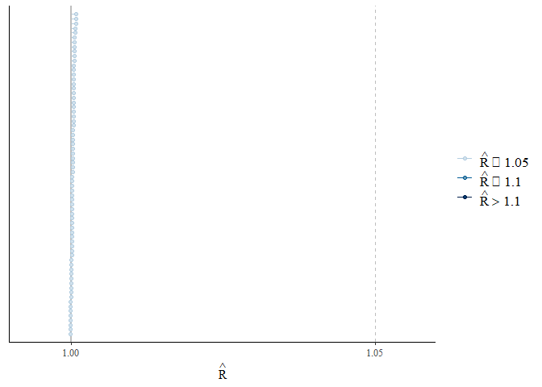<!-- -->

``` r
mcmc_rhat(draws2$rhat)
```

<!-- -->

#### Effective sampling size (ESS)

``` r
mcmc_neff(neff_ratio(m_1))
```

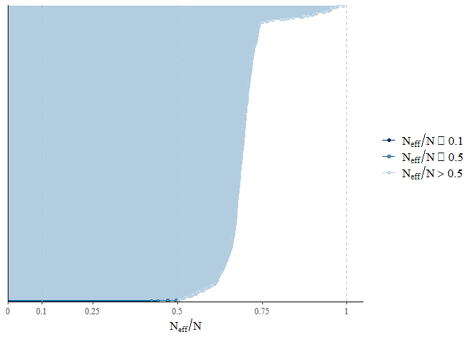<!-- -->

``` r
mcmc_neff(neff_ratio(m_2))
```

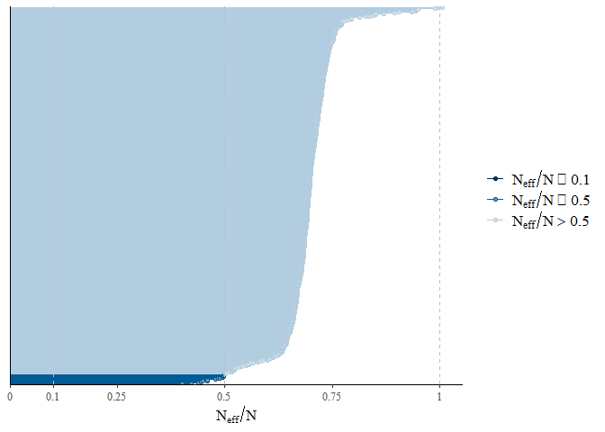<!-- -->

### MCMC diagnostics

``` r
mcmc_trace(posterior1, np = hmc_diagnostics1)
```

    ## No divergences to plot.

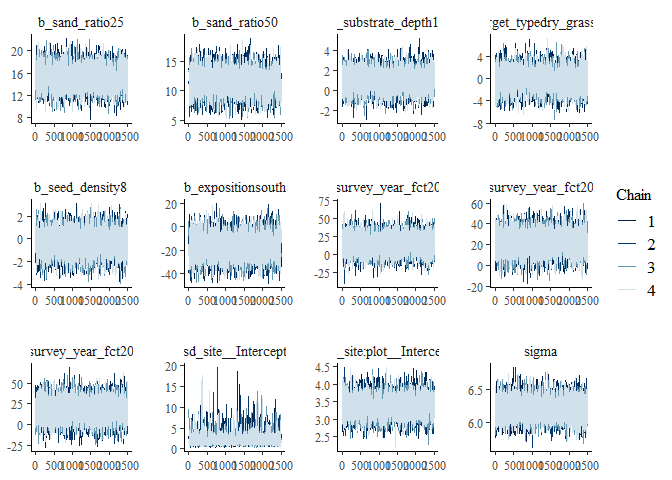<!-- -->

``` r
mcmc_trace(posterior2, np = hmc_diagnostics2)
```

    ## No divergences to plot.

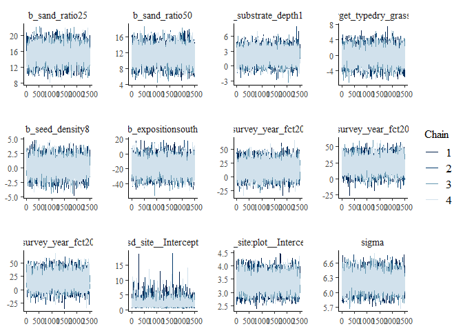<!-- -->

``` r
mcmc_pairs(m_1, off_diag_args = list(size = 1.2),
           pars = c(
             "b_sand_ratio25", "b_sand_ratio50", "b_substrate_depth15",
             "b_target_typedry_grassland", "b_seed_density8",
             "b_expositionsouth", "sigma"
           ))
```

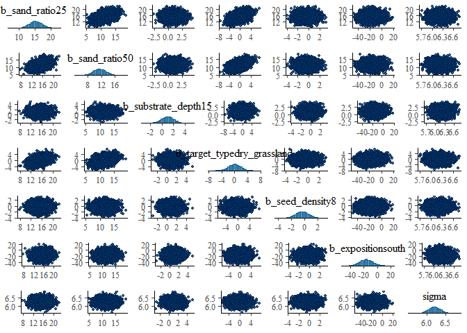<!-- -->

``` r
mcmc_pairs(m_2, off_diag_args = list(size = 1.2),
           pars = c(
             "b_sand_ratio25", "b_sand_ratio50", "b_substrate_depth15",
             "b_target_typedry_grassland", "b_seed_density8",
             "b_expositionsouth", "sigma"
           ))
```

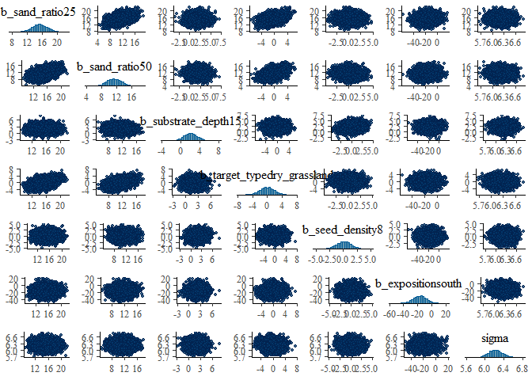<!-- -->

``` r
mcmc_parcoord(posterior1, np = hmc_diagnostics1)
```

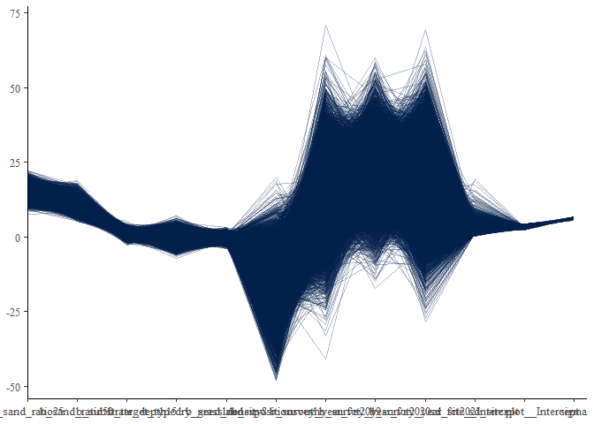<!-- -->

``` r
mcmc_parcoord(posterior2, np = hmc_diagnostics2)
```

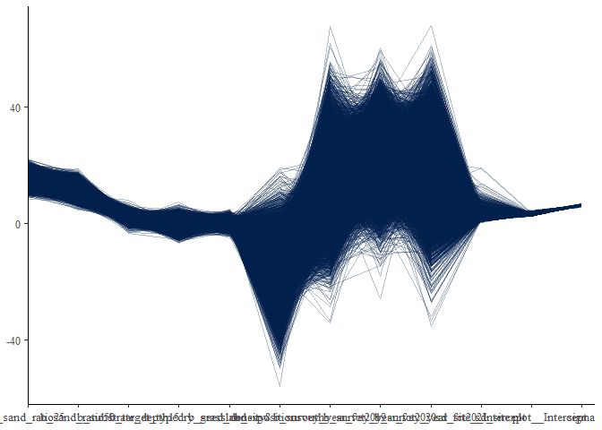<!-- -->

### Posterior predictive check

#### Kernel density

``` r
p1 <- ppc_dens_overlay(y, yrep1[1:50, ])
p2 <- ppc_dens_overlay(y, yrep2[1:50, ])
p1 / p2
```

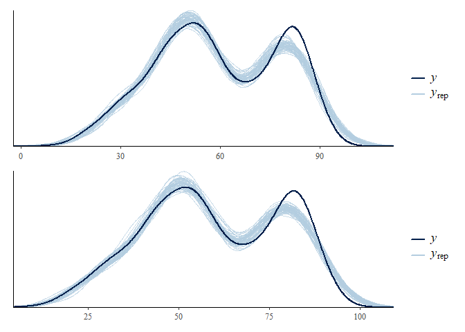<!-- -->

``` r
ppc_dens_overlay_grouped(y, yrep1[1:50, ], group = sites$site)
```

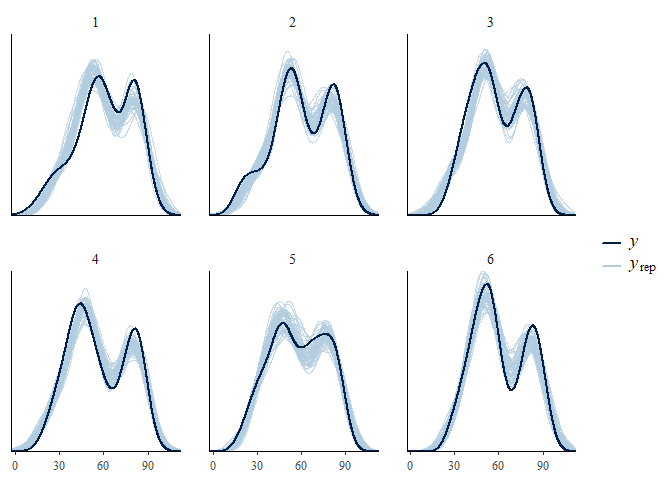<!-- -->

``` r
ppc_dens_overlay_grouped(y, yrep2[1:50, ], group = sites$site)
```

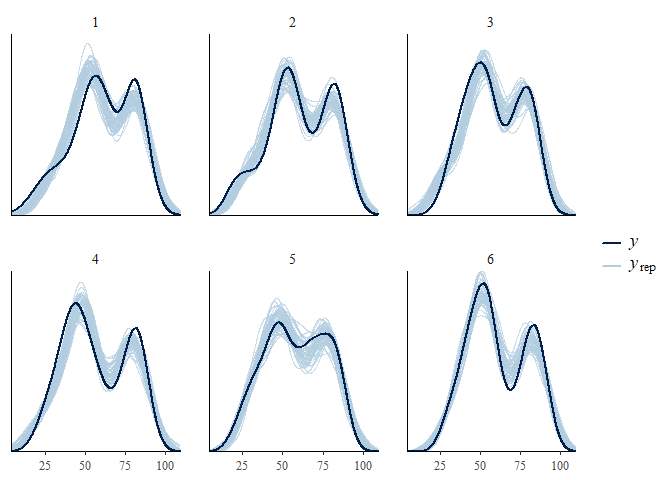<!-- -->

``` r
p1 <- ppc_dens_overlay_grouped(y, yrep1[1:50, ], group = sites$exposition)
p2 <- ppc_dens_overlay_grouped(y, yrep2[1:50, ], group = sites$exposition)
p1 / p2
```

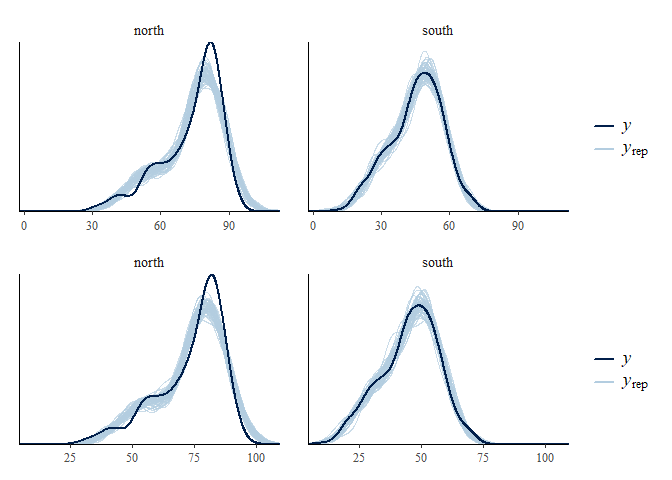<!-- -->

``` r
ppc_dens_overlay_grouped(y, yrep1[1:50, ], group = sites$survey_year_fct)
```

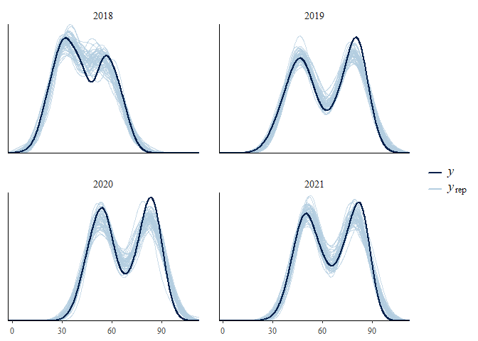<!-- -->

``` r
ppc_dens_overlay_grouped(y, yrep2[1:50, ], group = sites$survey_year_fct)
```

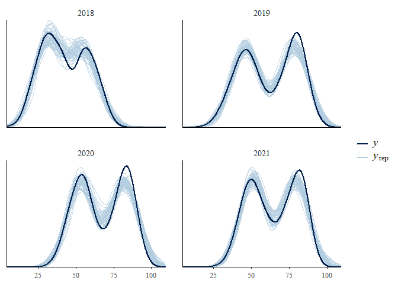<!-- -->

``` r
p1 <- ppc_dens_overlay_grouped(y, yrep1[1:50, ], group = sites$target_type)
p2 <- ppc_dens_overlay_grouped(y, yrep2[1:50, ], group = sites$target_type)
p1 / p2
```

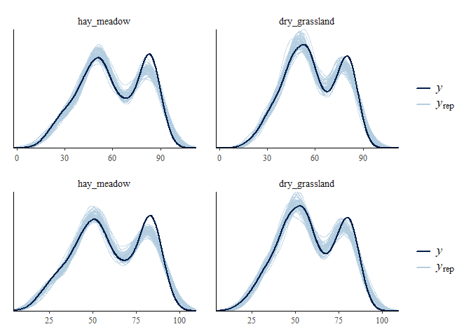<!-- -->

``` r
p1 <- ppc_dens_overlay_grouped(y, yrep1[1:50, ], group = sites$seed_density)
p2 <- ppc_dens_overlay_grouped(y, yrep2[1:50, ], group = sites$seed_density)
p1 / p2
```

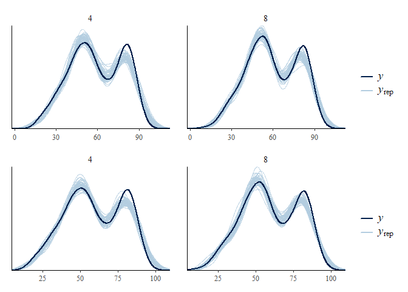<!-- -->

``` r
p1 <- ppc_dens_overlay_grouped(y, yrep1[1:50, ], group = sites$sand_ratio)
p2 <- ppc_dens_overlay_grouped(y, yrep2[1:50, ], group = sites$sand_ratio)
p1 / p2
```

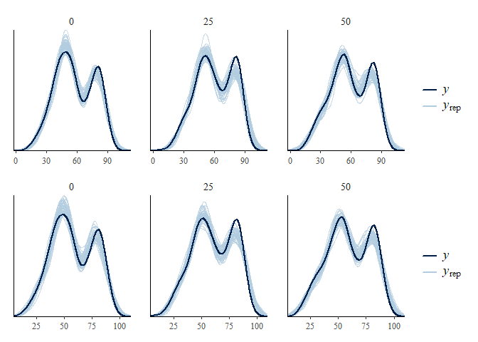<!-- -->

``` r
p1 <- ppc_dens_overlay_grouped(y, yrep1[1:50, ], group = sites$substrate_depth)
p2 <- ppc_dens_overlay_grouped(y, yrep2[1:50, ], group = sites$substrate_depth)
p1 / p2
```

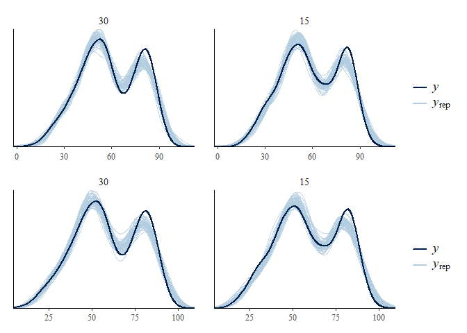<!-- -->

#### Histograms of statistics skew

``` r
p1 <- ppc_stat(y, yrep1, binwidth = 0.001)
p2 <- ppc_stat(y, yrep2, binwidth = 0.001)
p1 / p2
```

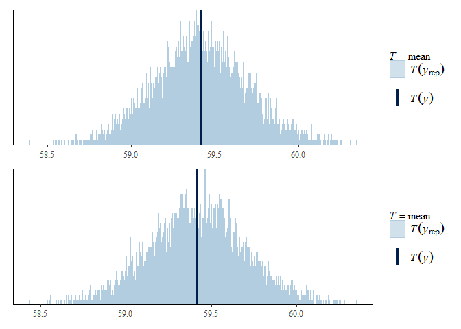<!-- -->

``` r
ppc_stat_grouped(y, yrep1, group = sites$site, binwidth = 0.001)
```

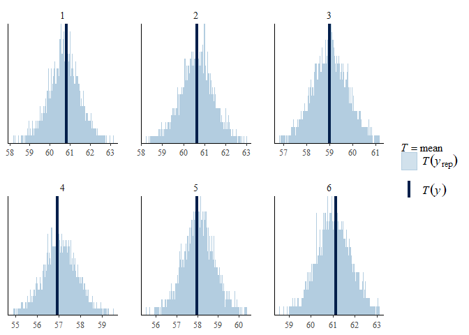<!-- -->

``` r
ppc_stat_grouped(y, yrep2, group = sites$site, binwidth = 0.001)
```

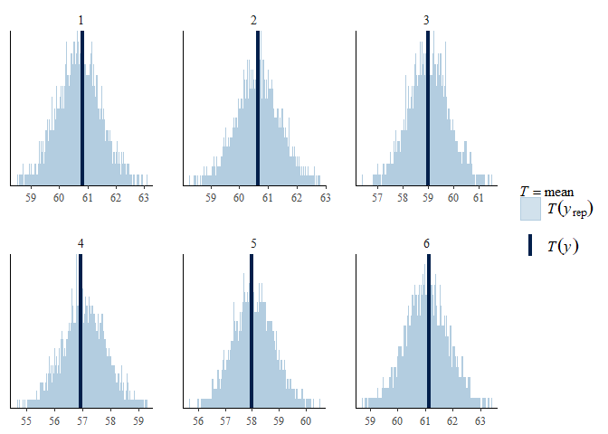<!-- -->

``` r
p1 <- ppc_stat_grouped(y, yrep1, group = sites$exposition, binwidth = 0.001)
p2 <- ppc_stat_grouped(y, yrep2, group = sites$exposition, binwidth = 0.001)
p1 / p2
```

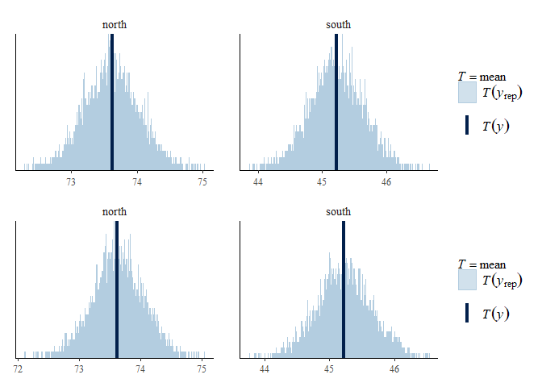<!-- -->

``` r
ppc_stat_grouped(y, yrep1, group = sites$survey_year_fct, binwidth = 0.001)
```

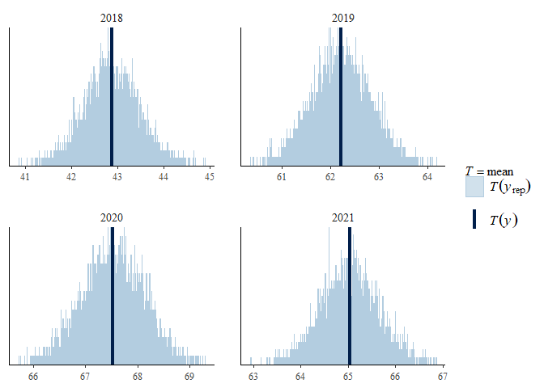<!-- -->

``` r
ppc_stat_grouped(y, yrep2, group = sites$survey_year_fct, binwidth = 0.001)
```

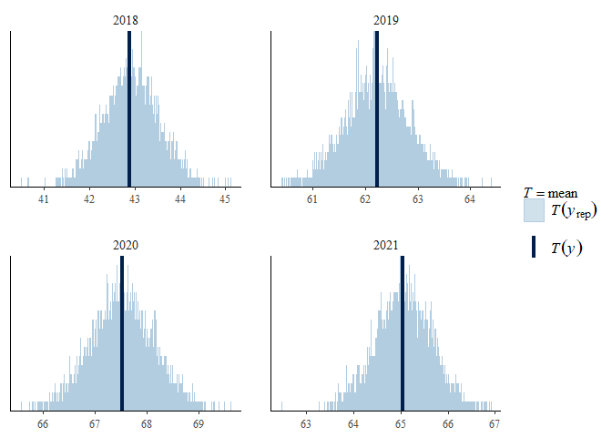<!-- -->

``` r
p1 <- ppc_stat_grouped(y, yrep1, group = sites$target_type, binwidth = 0.001)
p2 <- ppc_stat_grouped(y, yrep2, group = sites$target_type, binwidth = 0.001)
p1 / p2
```

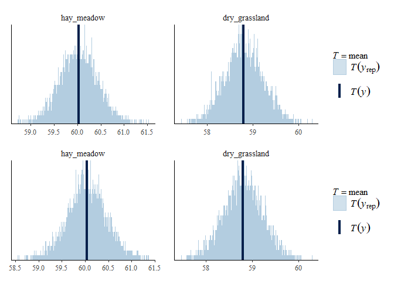<!-- -->

``` r
p1 <- ppc_stat_grouped(y, yrep1, group = sites$seed_density, binwidth = 0.001)
p2 <- ppc_stat_grouped(y, yrep2, group = sites$seed_density, binwidth = 0.001)
p1 / p2
```

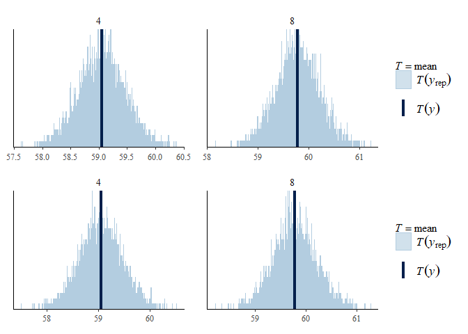<!-- -->

``` r
p1 <- ppc_stat_grouped(y, yrep1, group = sites$sand_ratio, binwidth = 0.001)
p2 <- ppc_stat_grouped(y, yrep2, group = sites$sand_ratio, binwidth = 0.001)
p1 / p2
```

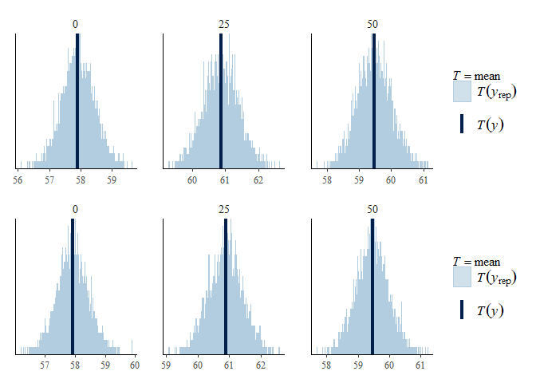<!-- -->

``` r
p1 <- ppc_stat_grouped(y, yrep1, group = sites$substrate_depth, binwidth = 0.001)
p2 <- ppc_stat_grouped(y, yrep2, group = sites$substrate_depth, binwidth = 0.001)
p1 / p2
```

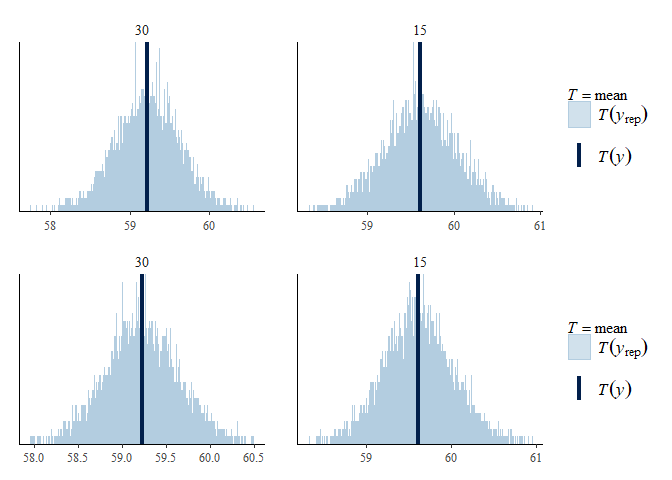<!-- -->

#### LOO (Leave one out)

``` r
loo1
```

    ## 
    ## Computed from 10000 by 1152 log-likelihood matrix
    ## 
    ##          Estimate   SE
    ## elpd_loo  -3854.8 25.7
    ## p_loo       199.3  8.0
    ## looic      7709.6 51.4
    ## ------
    ## Monte Carlo SE of elpd_loo is 0.3.
    ## 
    ## Pareto k diagnostic values:
    ##                          Count Pct.    Min. n_eff
    ## (-Inf, 0.5]   (good)     1130  98.1%   568       
    ##  (0.5, 0.7]   (ok)         22   1.9%   404       
    ##    (0.7, 1]   (bad)         0   0.0%   <NA>      
    ##    (1, Inf)   (very bad)    0   0.0%   <NA>      
    ## 
    ## All Pareto k estimates are ok (k < 0.7).
    ## See help('pareto-k-diagnostic') for details.

``` r
loo2
```

    ## 
    ## Computed from 10000 by 1152 log-likelihood matrix
    ## 
    ##          Estimate   SE
    ## elpd_loo  -3861.7 25.6
    ## p_loo       204.8  8.2
    ## looic      7723.3 51.3
    ## ------
    ## Monte Carlo SE of elpd_loo is 0.3.
    ## 
    ## Pareto k diagnostic values:
    ##                          Count Pct.    Min. n_eff
    ## (-Inf, 0.5]   (good)     1133  98.4%   666       
    ##  (0.5, 0.7]   (ok)         19   1.6%   315       
    ##    (0.7, 1]   (bad)         0   0.0%   <NA>      
    ##    (1, Inf)   (very bad)    0   0.0%   <NA>      
    ## 
    ## All Pareto k estimates are ok (k < 0.7).
    ## See help('pareto-k-diagnostic') for details.

``` r
plot(loo1)
```

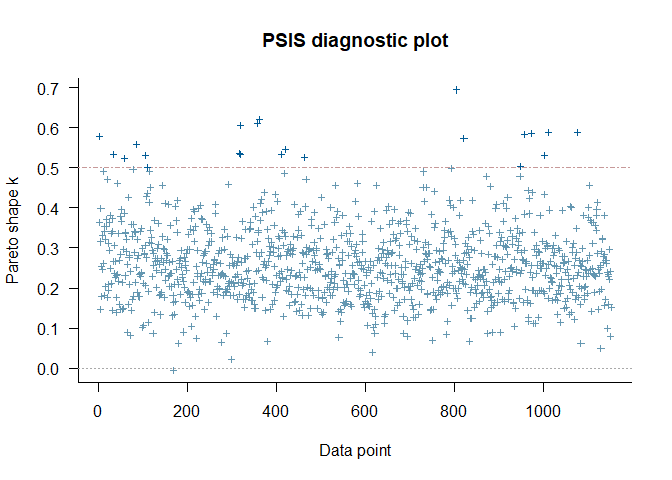<!-- -->

``` r
plot(loo2)
```

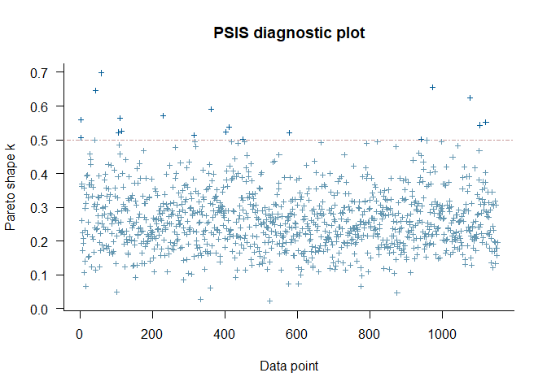<!-- -->

Leave one out probability integral transform

``` r
p1 <- ppc_loo_pit_overlay(y, yrep1, lw = weights(loo1$psis_object))
```

    ## NOTE: The kernel density estimate assumes continuous observations and is not optimal for discrete observations.

``` r
p2 <- ppc_loo_pit_overlay(y, yrep2, lw = weights(loo2$psis_object))
```

    ## NOTE: The kernel density estimate assumes continuous observations and is not optimal for discrete observations.

``` r
p1 / p2
```

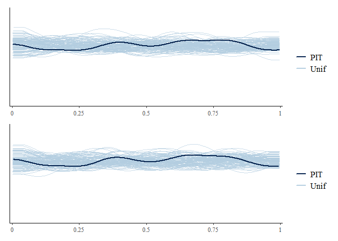<!-- -->

### Autocorrelation check

``` r
mcmc_acf(posterior1, lags = 10)
```

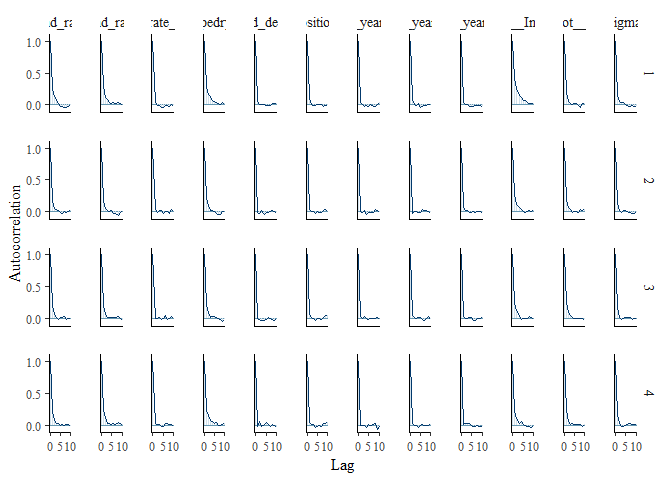<!-- -->

``` r
mcmc_acf(posterior2, lags = 10)
```

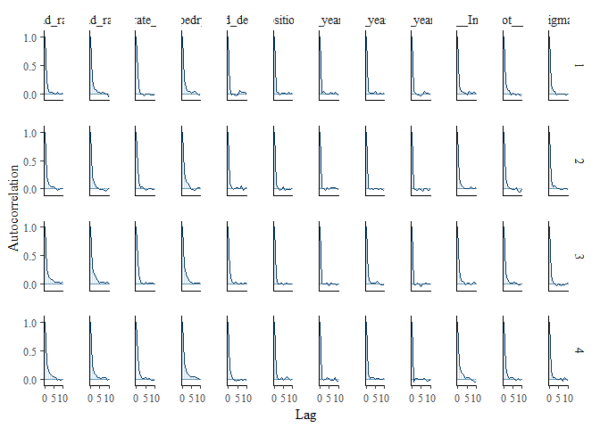<!-- -->

## Output of choosen model

### Model output

Conditional and marignal <i>R</i>²

``` r
bayes_R2(m_1, probs = c(0.05, 0.5, 0.95),
         re_formula =  ~ (1 | site/plot) + (1 | botanist_year)) 
##     Estimate  Est.Error        Q5       Q50       Q95
## R2 0.8944769 0.00336097 0.8887784 0.8946214 0.8997545
bayes_R2(m_1, probs = c(0.05, 0.5, 0.95),
         re_formula = 1 ~ 1)
##     Estimate   Est.Error        Q5       Q50       Q95
## R2 0.8587825 0.003575485 0.8526128 0.8589943 0.8643421
```

Posteriors of chosen model

``` r
draws1
```

    ## # A tibble: 70 × 10
    ##    variable      mean  median     sd    mad      q5    q95  rhat ess_b…¹ ess_t…²
    ##    <chr>        <dbl>   <dbl>  <dbl>  <dbl>   <dbl>  <dbl> <dbl>   <dbl>   <dbl>
    ##  1 b_Interce…  50.0    50.0    1.95   1.87   46.8   53.1    1.00   6244.   6831.
    ##  2 b_sand_ra…  15.2    15.2    1.90   1.90   12.1   18.4    1.00   5964.   8005.
    ##  3 b_sand_ra…  11.4    11.4    1.93   1.94    8.28  14.7    1.00   5439.   7820.
    ##  4 b_target_…  -0.124  -0.102  1.86   1.86   -3.25   2.92   1.00   5060.   7249.
    ##  5 b_exposit… -16.8   -16.8    9.53   9.46  -32.6   -0.894  1.00   8754.   8549.
    ##  6 b_survey_…  14.5    14.5   12.6   12.5    -6.34  35.3    1.00   9667.   8937.
    ##  7 b_survey_…  22.2    22.1   10.6   10.5     4.96  39.7    1.00   9337.   9548.
    ##  8 b_survey_…  18.0    18.1   12.8   12.8    -3.20  38.7    1.00   8857.   8351.
    ##  9 b_substra…   1.01    1.01   0.987  0.982  -0.605  2.64   1.00   9546.   9093.
    ## 10 b_seed_de…  -0.350  -0.354  0.993  1.00   -1.96   1.28   1.00   9837.   9408.
    ## # … with 60 more rows, and abbreviated variable names ¹​ess_bulk, ²​ess_tail

``` r
mcmc_intervals(
  posterior1,
  prob = 0.66,
  prob_outer = 0.95,
  point_est = "mean"
  ) +
  theme_classic()
```

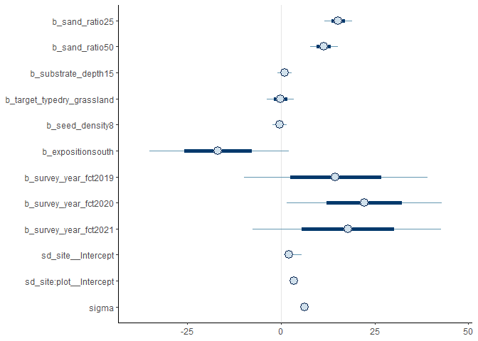<!-- -->

Posteriors of second model:

``` r
mcmc_intervals(
  posterior2,
  prob = 0.66,
  prob_outer = 0.95,
  point_est = "mean"
  ) +
  theme_classic()
```

<!-- -->

### Effect sizes

Just, to get exact values if necessary, which is not possible from the
figure

``` r
(emm <- emmeans(m_1, revpairwise ~ target_type + sand_ratio |
                  exposition | survey_year_fct, type = "response"))
```

    ## NOTE: A nesting structure was detected in the fitted model:
    ##     botanist_year %in% (exposition*survey_year_fct)

    ## $emmeans
    ## exposition = north, survey_year_fct = 2018:
    ##  target_type   sand_ratio emmean lower.HPD upper.HPD
    ##  hay_meadow    0            47.4      44.0      50.8
    ##  dry_grassland 0            47.3      43.8      50.6
    ##  hay_meadow    25           62.6      59.2      66.1
    ##  dry_grassland 25           55.8      52.6      59.6
    ##  hay_meadow    50           58.8      55.4      62.3
    ##  dry_grassland 50           55.4      51.8      58.8
    ## 
    ## exposition = south, survey_year_fct = 2018:
    ##  target_type   sand_ratio emmean lower.HPD upper.HPD
    ##  hay_meadow    0            30.5      27.0      34.0
    ##  dry_grassland 0            32.8      29.3      36.3
    ##  hay_meadow    25           30.9      27.5      34.5
    ##  dry_grassland 25           36.7      33.0      40.1
    ##  hay_meadow    50           27.9      24.4      31.4
    ##  dry_grassland 50           31.6      28.0      35.0
    ## 
    ## exposition = north, survey_year_fct = 2019:
    ##  target_type   sand_ratio emmean lower.HPD upper.HPD
    ##  hay_meadow    0            80.4      76.8      83.9
    ##  dry_grassland 0            76.1      72.6      79.7
    ##  hay_meadow    25           83.5      80.1      87.0
    ##  dry_grassland 25           75.4      71.8      78.8
    ##  hay_meadow    50           78.7      75.2      82.2
    ##  dry_grassland 50           76.0      72.5      79.5
    ## 
    ## exposition = south, survey_year_fct = 2019:
    ##  target_type   sand_ratio emmean lower.HPD upper.HPD
    ##  hay_meadow    0            45.6      41.8      49.0
    ##  dry_grassland 0            43.2      39.5      46.8
    ##  hay_meadow    25           45.9      42.2      49.5
    ##  dry_grassland 25           44.8      41.3      48.6
    ##  hay_meadow    50           41.9      38.4      45.6
    ##  dry_grassland 50           41.8      38.1      45.3
    ## 
    ## exposition = north, survey_year_fct = 2020:
    ##  target_type   sand_ratio emmean lower.HPD upper.HPD
    ##  hay_meadow    0            82.5      79.0      86.0
    ##  dry_grassland 0            79.5      76.0      83.0
    ##  hay_meadow    25           85.0      81.4      88.5
    ##  dry_grassland 25           80.4      76.9      83.9
    ##  hay_meadow    50           84.0      80.5      87.6
    ##  dry_grassland 50           79.9      76.6      83.5
    ## 
    ## exposition = south, survey_year_fct = 2020:
    ##  target_type   sand_ratio emmean lower.HPD upper.HPD
    ##  hay_meadow    0            51.6      48.2      55.2
    ##  dry_grassland 0            51.8      48.3      55.3
    ##  hay_meadow    25           54.1      50.7      57.7
    ##  dry_grassland 25           54.7      51.1      58.2
    ##  hay_meadow    50           50.0      46.4      53.5
    ##  dry_grassland 50           55.3      51.8      58.9
    ## 
    ## exposition = north, survey_year_fct = 2021:
    ##  target_type   sand_ratio emmean lower.HPD upper.HPD
    ##  hay_meadow    0            77.0      73.5      80.5
    ##  dry_grassland 0            75.4      71.9      78.9
    ##  hay_meadow    25           81.8      78.3      85.4
    ##  dry_grassland 25           78.4      75.0      82.0
    ##  hay_meadow    50           81.9      78.4      85.4
    ##  dry_grassland 50           80.6      77.3      84.3
    ## 
    ## exposition = south, survey_year_fct = 2021:
    ##  target_type   sand_ratio emmean lower.HPD upper.HPD
    ##  hay_meadow    0            52.6      49.1      56.2
    ##  dry_grassland 0            49.4      46.0      53.0
    ##  hay_meadow    25           48.4      44.8      51.8
    ##  dry_grassland 25           50.7      47.0      54.0
    ##  hay_meadow    50           51.0      47.4      54.4
    ##  dry_grassland 50           51.7      48.1      55.2
    ## 
    ## Results are averaged over the levels of: substrate_depth, seed_density, botanist_year 
    ## Point estimate displayed: median 
    ## HPD interval probability: 0.95 
    ## 
    ## $contrasts
    ## exposition = north, survey_year_fct = 2018:
    ##  contrast                                                estimate lower.HPD
    ##  dry_grassland sand_ratio0 - hay_meadow sand_ratio0        -0.102  -3.94761
    ##  hay_meadow sand_ratio25 - hay_meadow sand_ratio0          15.220  11.46424
    ##  hay_meadow sand_ratio25 - dry_grassland sand_ratio0       15.380  11.56729
    ##  dry_grassland sand_ratio25 - hay_meadow sand_ratio0        8.426   4.75619
    ##  dry_grassland sand_ratio25 - dry_grassland sand_ratio0     8.564   4.76090
    ##  dry_grassland sand_ratio25 - hay_meadow sand_ratio25      -6.762 -10.68313
    ##  hay_meadow sand_ratio50 - hay_meadow sand_ratio0          11.401   7.60268
    ##  hay_meadow sand_ratio50 - dry_grassland sand_ratio0       11.523   7.59152
    ##  hay_meadow sand_ratio50 - hay_meadow sand_ratio25         -3.812  -7.61106
    ##  hay_meadow sand_ratio50 - dry_grassland sand_ratio25       2.976  -0.99515
    ##  dry_grassland sand_ratio50 - hay_meadow sand_ratio0        8.001   4.14689
    ##  dry_grassland sand_ratio50 - dry_grassland sand_ratio0     8.138   4.19042
    ##  dry_grassland sand_ratio50 - hay_meadow sand_ratio25      -7.259 -11.22055
    ##  dry_grassland sand_ratio50 - dry_grassland sand_ratio25   -0.429  -4.61796
    ##  dry_grassland sand_ratio50 - hay_meadow sand_ratio50      -3.402  -7.57230
    ##  upper.HPD
    ##    3.32155
    ##   18.90104
    ##   19.41742
    ##   12.41211
    ##   12.39221
    ##   -3.05578
    ##   15.12607
    ##   15.37757
    ##    0.23661
    ##    6.82857
    ##   11.92903
    ##   12.00546
    ##   -3.25404
    ##    3.20477
    ##    0.24863
    ## 
    ## exposition = south, survey_year_fct = 2018:
    ##  contrast                                                estimate lower.HPD
    ##  dry_grassland sand_ratio0 - hay_meadow sand_ratio0         2.331  -1.65366
    ##  hay_meadow sand_ratio25 - hay_meadow sand_ratio0           0.457  -3.46316
    ##  hay_meadow sand_ratio25 - dry_grassland sand_ratio0       -1.860  -5.74993
    ##  dry_grassland sand_ratio25 - hay_meadow sand_ratio0        6.180   2.25157
    ##  dry_grassland sand_ratio25 - dry_grassland sand_ratio0     3.893   0.00419
    ##  dry_grassland sand_ratio25 - hay_meadow sand_ratio25       5.755   1.92949
    ##  hay_meadow sand_ratio50 - hay_meadow sand_ratio0          -2.529  -6.44047
    ##  hay_meadow sand_ratio50 - dry_grassland sand_ratio0       -4.881  -8.67942
    ##  hay_meadow sand_ratio50 - hay_meadow sand_ratio25         -3.018  -6.90615
    ##  hay_meadow sand_ratio50 - dry_grassland sand_ratio25      -8.737 -12.67325
    ##  dry_grassland sand_ratio50 - hay_meadow sand_ratio0        1.159  -2.82112
    ##  dry_grassland sand_ratio50 - dry_grassland sand_ratio0    -1.156  -5.10963
    ##  dry_grassland sand_ratio50 - hay_meadow sand_ratio25       0.731  -3.38374
    ##  dry_grassland sand_ratio50 - dry_grassland sand_ratio25   -5.024  -9.16533
    ##  dry_grassland sand_ratio50 - hay_meadow sand_ratio50       3.706  -0.25168
    ##  upper.HPD
    ##    5.98008
    ##    4.26286
    ##    2.22265
    ##   10.16516
    ##    7.95325
    ##    9.85572
    ##    1.23412
    ##   -0.84307
    ##    0.97113
    ##   -4.75983
    ##    5.08801
    ##    2.73054
    ##    4.59908
    ##   -1.09411
    ##    7.64175
    ## 
    ## exposition = north, survey_year_fct = 2019:
    ##  contrast                                                estimate lower.HPD
    ##  dry_grassland sand_ratio0 - hay_meadow sand_ratio0        -4.328  -8.22216
    ##  hay_meadow sand_ratio25 - hay_meadow sand_ratio0           3.125  -0.65547
    ##  hay_meadow sand_ratio25 - dry_grassland sand_ratio0        7.461   3.56344
    ##  dry_grassland sand_ratio25 - hay_meadow sand_ratio0       -5.082  -9.09001
    ##  dry_grassland sand_ratio25 - dry_grassland sand_ratio0    -0.780  -4.79164
    ##  dry_grassland sand_ratio25 - hay_meadow sand_ratio25      -8.219 -12.32187
    ##  hay_meadow sand_ratio50 - hay_meadow sand_ratio0          -1.753  -5.79049
    ##  hay_meadow sand_ratio50 - dry_grassland sand_ratio0        2.563  -1.30712
    ##  hay_meadow sand_ratio50 - hay_meadow sand_ratio25         -4.884  -8.99753
    ##  hay_meadow sand_ratio50 - dry_grassland sand_ratio25       3.348  -0.56073
    ##  dry_grassland sand_ratio50 - hay_meadow sand_ratio0       -4.452  -8.42009
    ##  dry_grassland sand_ratio50 - dry_grassland sand_ratio0    -0.139  -3.98628
    ##  dry_grassland sand_ratio50 - hay_meadow sand_ratio25      -7.580 -11.60087
    ##  dry_grassland sand_ratio50 - dry_grassland sand_ratio25    0.627  -3.28254
    ##  dry_grassland sand_ratio50 - hay_meadow sand_ratio50      -2.713  -6.67056
    ##  upper.HPD
    ##   -0.37944
    ##    7.17864
    ##   11.35442
    ##   -1.09955
    ##    3.15250
    ##   -4.23788
    ##    2.19094
    ##    6.62232
    ##   -1.02557
    ##    7.41349
    ##   -0.36217
    ##    3.92773
    ##   -3.78350
    ##    4.74329
    ##    1.30851
    ## 
    ## exposition = south, survey_year_fct = 2019:
    ##  contrast                                                estimate lower.HPD
    ##  dry_grassland sand_ratio0 - hay_meadow sand_ratio0        -2.379  -6.32764
    ##  hay_meadow sand_ratio25 - hay_meadow sand_ratio0           0.336  -3.71741
    ##  hay_meadow sand_ratio25 - dry_grassland sand_ratio0        2.669  -1.33542
    ##  dry_grassland sand_ratio25 - hay_meadow sand_ratio0       -0.702  -4.74043
    ##  dry_grassland sand_ratio25 - dry_grassland sand_ratio0     1.621  -2.54137
    ##  dry_grassland sand_ratio25 - hay_meadow sand_ratio25      -1.054  -5.00080
    ##  hay_meadow sand_ratio50 - hay_meadow sand_ratio0          -3.618  -7.58551
    ##  hay_meadow sand_ratio50 - dry_grassland sand_ratio0       -1.261  -5.29306
    ##  hay_meadow sand_ratio50 - hay_meadow sand_ratio25         -3.922  -7.89765
    ##  hay_meadow sand_ratio50 - dry_grassland sand_ratio25      -2.879  -6.80423
    ##  dry_grassland sand_ratio50 - hay_meadow sand_ratio0       -3.806  -7.84252
    ##  dry_grassland sand_ratio50 - dry_grassland sand_ratio0    -1.418  -5.33951
    ##  dry_grassland sand_ratio50 - hay_meadow sand_ratio25      -4.100  -7.91187
    ##  dry_grassland sand_ratio50 - dry_grassland sand_ratio25   -3.075  -6.95885
    ##  dry_grassland sand_ratio50 - hay_meadow sand_ratio50      -0.167  -3.97627
    ##  upper.HPD
    ##    1.58555
    ##    4.19240
    ##    6.64427
    ##    3.19976
    ##    5.47995
    ##    2.88576
    ##    0.28423
    ##    2.56878
    ##    0.00461
    ##    1.15259
    ##   -0.05158
    ##    2.53942
    ##    0.01955
    ##    1.02708
    ##    3.77580
    ## 
    ## exposition = north, survey_year_fct = 2020:
    ##  contrast                                                estimate lower.HPD
    ##  dry_grassland sand_ratio0 - hay_meadow sand_ratio0        -3.010  -6.90382
    ##  hay_meadow sand_ratio25 - hay_meadow sand_ratio0           2.529  -1.54968
    ##  hay_meadow sand_ratio25 - dry_grassland sand_ratio0        5.525   1.41486
    ##  dry_grassland sand_ratio25 - hay_meadow sand_ratio0       -2.137  -5.98869
    ##  dry_grassland sand_ratio25 - dry_grassland sand_ratio0     0.870  -3.03282
    ##  dry_grassland sand_ratio25 - hay_meadow sand_ratio25      -4.646  -8.47647
    ##  hay_meadow sand_ratio50 - hay_meadow sand_ratio0           1.495  -2.45925
    ##  hay_meadow sand_ratio50 - dry_grassland sand_ratio0        4.471   0.52451
    ##  hay_meadow sand_ratio50 - hay_meadow sand_ratio25         -1.039  -5.05807
    ##  hay_meadow sand_ratio50 - dry_grassland sand_ratio25       3.616  -0.39404
    ##  dry_grassland sand_ratio50 - hay_meadow sand_ratio0       -2.627  -6.63501
    ##  dry_grassland sand_ratio50 - dry_grassland sand_ratio0     0.364  -3.55183
    ##  dry_grassland sand_ratio50 - hay_meadow sand_ratio25      -5.145  -9.23512
    ##  dry_grassland sand_ratio50 - dry_grassland sand_ratio25   -0.465  -4.40309
    ##  dry_grassland sand_ratio50 - hay_meadow sand_ratio50      -4.112  -8.04513
    ##  upper.HPD
    ##    0.85421
    ##    6.34355
    ##    9.34264
    ##    1.93756
    ##    4.95802
    ##   -0.48454
    ##    5.39503
    ##    8.40902
    ##    2.85304
    ##    7.42142
    ##    1.35160
    ##    4.46420
    ##   -1.24894
    ##    3.44734
    ##   -0.13575
    ## 
    ## exposition = south, survey_year_fct = 2020:
    ##  contrast                                                estimate lower.HPD
    ##  dry_grassland sand_ratio0 - hay_meadow sand_ratio0         0.236  -3.64319
    ##  hay_meadow sand_ratio25 - hay_meadow sand_ratio0           2.551  -1.41871
    ##  hay_meadow sand_ratio25 - dry_grassland sand_ratio0        2.320  -1.59909
    ##  dry_grassland sand_ratio25 - hay_meadow sand_ratio0        3.110  -0.93150
    ##  dry_grassland sand_ratio25 - dry_grassland sand_ratio0     2.894  -1.00014
    ##  dry_grassland sand_ratio25 - hay_meadow sand_ratio25       0.559  -3.26229
    ##  hay_meadow sand_ratio50 - hay_meadow sand_ratio0          -1.567  -5.45114
    ##  hay_meadow sand_ratio50 - dry_grassland sand_ratio0       -1.826  -5.93720
    ##  hay_meadow sand_ratio50 - hay_meadow sand_ratio25         -4.160  -8.15322
    ##  hay_meadow sand_ratio50 - dry_grassland sand_ratio25      -4.761  -8.62096
    ##  dry_grassland sand_ratio50 - hay_meadow sand_ratio0        3.731  -0.09129
    ##  dry_grassland sand_ratio50 - dry_grassland sand_ratio0     3.535  -0.63210
    ##  dry_grassland sand_ratio50 - hay_meadow sand_ratio25       1.185  -2.79990
    ##  dry_grassland sand_ratio50 - dry_grassland sand_ratio25    0.632  -3.36110
    ##  dry_grassland sand_ratio50 - hay_meadow sand_ratio50       5.331   1.39744
    ##  upper.HPD
    ##    4.23273
    ##    6.55359
    ##    6.37356
    ##    7.09837
    ##    6.89397
    ##    4.66551
    ##    2.62666
    ##    1.98202
    ##   -0.12668
    ##   -0.77842
    ##    7.87808
    ##    7.25856
    ##    5.14685
    ##    4.64769
    ##    9.30476
    ## 
    ## exposition = north, survey_year_fct = 2021:
    ##  contrast                                                estimate lower.HPD
    ##  dry_grassland sand_ratio0 - hay_meadow sand_ratio0        -1.546  -5.48095
    ##  hay_meadow sand_ratio25 - hay_meadow sand_ratio0           4.823   0.89155
    ##  hay_meadow sand_ratio25 - dry_grassland sand_ratio0        6.358   2.31569
    ##  dry_grassland sand_ratio25 - hay_meadow sand_ratio0        1.361  -2.61448
    ##  dry_grassland sand_ratio25 - dry_grassland sand_ratio0     2.905  -0.89245
    ##  dry_grassland sand_ratio25 - hay_meadow sand_ratio25      -3.481  -7.32179
    ##  hay_meadow sand_ratio50 - hay_meadow sand_ratio0           4.958   0.82660
    ##  hay_meadow sand_ratio50 - dry_grassland sand_ratio0        6.526   2.67595
    ##  hay_meadow sand_ratio50 - hay_meadow sand_ratio25          0.133  -3.68171
    ##  hay_meadow sand_ratio50 - dry_grassland sand_ratio25       3.605  -0.43030
    ##  dry_grassland sand_ratio50 - hay_meadow sand_ratio0        3.615  -0.42663
    ##  dry_grassland sand_ratio50 - dry_grassland sand_ratio0     5.167   1.09883
    ##  dry_grassland sand_ratio50 - hay_meadow sand_ratio25      -1.186  -5.07506
    ##  dry_grassland sand_ratio50 - dry_grassland sand_ratio25    2.267  -1.79387
    ##  dry_grassland sand_ratio50 - hay_meadow sand_ratio50      -1.344  -5.18588
    ##  upper.HPD
    ##    2.34828
    ##    8.78205
    ##   10.38846
    ##    5.23302
    ##    7.04396
    ##    0.57174
    ##    8.74647
    ##   10.66019
    ##    4.33777
    ##    7.46239
    ##    7.56133
    ##    8.99179
    ##    2.80401
    ##    6.18142
    ##    2.74929
    ## 
    ## exposition = south, survey_year_fct = 2021:
    ##  contrast                                                estimate lower.HPD
    ##  dry_grassland sand_ratio0 - hay_meadow sand_ratio0        -3.193  -7.29347
    ##  hay_meadow sand_ratio25 - hay_meadow sand_ratio0          -4.222  -8.17146
    ##  hay_meadow sand_ratio25 - dry_grassland sand_ratio0       -0.999  -5.07531
    ##  dry_grassland sand_ratio25 - hay_meadow sand_ratio0       -1.941  -6.10138
    ##  dry_grassland sand_ratio25 - dry_grassland sand_ratio0     1.234  -2.64438
    ##  dry_grassland sand_ratio25 - hay_meadow sand_ratio25       2.281  -1.78616
    ##  hay_meadow sand_ratio50 - hay_meadow sand_ratio0          -1.578  -5.66846
    ##  hay_meadow sand_ratio50 - dry_grassland sand_ratio0        1.603  -2.18288
    ##  hay_meadow sand_ratio50 - hay_meadow sand_ratio25          2.629  -1.17573
    ##  hay_meadow sand_ratio50 - dry_grassland sand_ratio25       0.370  -3.52279
    ##  dry_grassland sand_ratio50 - hay_meadow sand_ratio0       -0.959  -4.90147
    ##  dry_grassland sand_ratio50 - dry_grassland sand_ratio0     2.225  -1.60826
    ##  dry_grassland sand_ratio50 - hay_meadow sand_ratio25       3.253  -0.50123
    ##  dry_grassland sand_ratio50 - dry_grassland sand_ratio25    0.976  -2.90933
    ##  dry_grassland sand_ratio50 - hay_meadow sand_ratio50       0.631  -3.39109
    ##  upper.HPD
    ##    0.65651
    ##   -0.28111
    ##    2.77205
    ##    1.88116
    ##    5.26500
    ##    6.13787
    ##    2.26291
    ##    5.73252
    ##    6.72738
    ##    4.41452
    ##    3.02597
    ##    6.24588
    ##    7.41299
    ##    5.08383
    ##    4.53325
    ## 
    ## Results are averaged over the levels of: substrate_depth, seed_density, botanist_year 
    ## Point estimate displayed: median 
    ## HPD interval probability: 0.95

# Session info

    ## R version 4.2.2 (2022-10-31 ucrt)
    ## Platform: x86_64-w64-mingw32/x64 (64-bit)
    ## Running under: Windows 10 x64 (build 22621)
    ## 
    ## Matrix products: default
    ## 
    ## locale:
    ## [1] LC_COLLATE=German_Germany.utf8  LC_CTYPE=German_Germany.utf8   
    ## [3] LC_MONETARY=German_Germany.utf8 LC_NUMERIC=C                   
    ## [5] LC_TIME=German_Germany.utf8    
    ## 
    ## attached base packages:
    ## [1] stats     graphics  grDevices utils     datasets  methods   base     
    ## 
    ## other attached packages:
    ##  [1] emmeans_1.8.2             tidybayes_3.0.2          
    ##  [3] loo_2.5.1                 bayesplot_1.10.0         
    ##  [5] DHARMa.helpers_0.0.0.9000 DHARMa_0.4.6             
    ##  [7] brms_2.18.0               Rcpp_1.0.9               
    ##  [9] patchwork_1.1.2           ggbeeswarm_0.6.0         
    ## [11] forcats_0.5.2             stringr_1.4.1            
    ## [13] dplyr_1.0.10              purrr_0.3.5              
    ## [15] readr_2.1.3               tidyr_1.2.1              
    ## [17] tibble_3.1.8              ggplot2_3.4.0            
    ## [19] tidyverse_1.3.2           here_1.0.1               
    ## 
    ## loaded via a namespace (and not attached):
    ##   [1] utf8_1.2.2           tidyselect_1.2.0     lme4_1.1-31         
    ##   [4] htmlwidgets_1.5.4    grid_4.2.2           RNeXML_2.4.8        
    ##   [7] munsell_0.5.0        codetools_0.2-18     interp_1.1-3        
    ##  [10] DT_0.26              miniUI_0.1.1.1       withr_2.5.0         
    ##  [13] Brobdingnag_1.2-9    colorspace_2.0-3     qgam_1.3.4          
    ##  [16] uuid_1.1-0           highr_0.9            knitr_1.41          
    ##  [19] rstudioapi_0.14      stats4_4.2.2         labeling_0.4.2      
    ##  [22] rstan_2.26.13        bit64_4.0.5          farver_2.1.1        
    ##  [25] gap.datasets_0.0.5   bridgesampling_1.1-2 rprojroot_2.0.3     
    ##  [28] coda_0.19-4          vctrs_0.5.1          generics_0.1.3      
    ##  [31] xfun_0.35            timechange_0.1.1     adegenet_2.1.8      
    ##  [34] doParallel_1.0.17    R6_2.5.1             markdown_1.4        
    ##  [37] assertthat_0.2.1     promises_1.2.0.1     scales_1.2.1        
    ##  [40] vroom_1.6.0          googlesheets4_1.0.1  phylobase_0.8.10    
    ##  [43] beeswarm_0.4.0       gtable_0.3.1         processx_3.8.0      
    ##  [46] rlang_1.0.6          splines_4.2.2        gargle_1.2.1        
    ##  [49] broom_1.0.1          checkmate_2.1.0      inline_0.3.19       
    ##  [52] yaml_2.3.6           reshape2_1.4.4       abind_1.4-5         
    ##  [55] modelr_0.1.10        threejs_0.3.3        crosstalk_1.2.0     
    ##  [58] backports_1.4.1      httpuv_1.6.6         tensorA_0.36.2      
    ##  [61] tools_4.2.2          ellipsis_0.3.2       posterior_1.3.1     
    ##  [64] RColorBrewer_1.1-3   plyr_1.8.8           progress_1.2.2      
    ##  [67] base64enc_0.1-3      ps_1.7.2             prettyunits_1.1.1   
    ##  [70] deldir_1.0-6         zoo_1.8-11           haven_2.5.1         
    ##  [73] cluster_2.1.4        fs_1.5.2             magrittr_2.0.3      
    ##  [76] ggdist_3.2.0         colourpicker_1.2.0   reprex_2.0.2        
    ##  [79] googledrive_2.0.0    mvtnorm_1.1-3        matrixStats_0.63.0  
    ##  [82] hms_1.1.2            shinyjs_2.1.0        mime_0.12           
    ##  [85] evaluate_0.18        arrayhelpers_1.1-0   xtable_1.8-4        
    ##  [88] XML_3.99-0.12        shinystan_2.6.0      jpeg_0.1-10         
    ##  [91] readxl_1.4.1         gridExtra_2.3        rstantools_2.2.0    
    ##  [94] compiler_4.2.2       KernSmooth_2.23-20   V8_4.2.2            
    ##  [97] crayon_1.5.2         minqa_1.2.5          StanHeaders_2.26.13 
    ## [100] htmltools_0.5.3      mgcv_1.8-41          later_1.3.0         
    ## [103] tzdb_0.3.0           RcppParallel_5.1.5   lubridate_1.9.0     
    ## [106] DBI_1.1.3            dbplyr_2.2.1         MASS_7.3-58.1       
    ## [109] boot_1.3-28          Matrix_1.5-3         ade4_1.7-20         
    ## [112] permute_0.9-7        cli_3.4.1            adegraphics_1.0-16  
    ## [115] parallel_4.2.2       igraph_1.3.5         pkgconfig_2.0.3     
    ## [118] rncl_0.8.6           sp_1.5-1             foreach_1.5.2       
    ## [121] xml2_1.3.3           svUnit_1.0.6         dygraphs_1.1.1.6    
    ## [124] vipor_0.4.5          estimability_1.4.1   rvest_1.0.3         
    ## [127] distributional_0.3.1 callr_3.7.3          digest_0.6.30       
    ## [130] vegan_2.6-4          rmarkdown_2.18       cellranger_1.1.0    
    ## [133] gap_1.3-1            curl_4.3.3           shiny_1.7.3         
    ## [136] gtools_3.9.4         nloptr_2.0.3         lifecycle_1.0.3     
    ## [139] nlme_3.1-160         jsonlite_1.8.3       seqinr_4.2-23       
    ## [142] fansi_1.0.3          pillar_1.8.1         lattice_0.20-45     
    ## [145] fastmap_1.1.0        httr_1.4.4           pkgbuild_1.4.0      
    ## [148] glue_1.6.2           xts_0.12.2           iterators_1.0.14    
    ## [151] png_0.1-8            shinythemes_1.2.0    bit_4.0.5           
    ## [154] stringi_1.7.8        latticeExtra_0.6-30  ape_5.6-2
