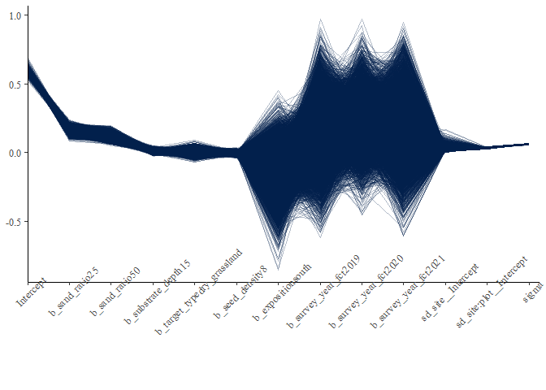
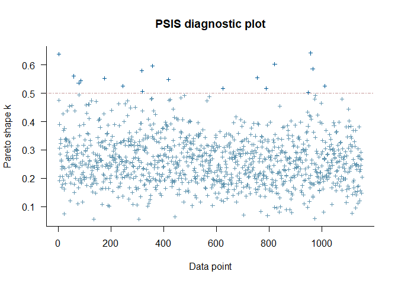

Analysis of Bauer et al. (unpublished) Field experiment: <br>
Persistence
================
<b>Markus Bauer</b> <br>
<b>2022-12-16</b>

- <a href="#preparation" id="toc-preparation">Preparation</a>
- <a href="#statistics" id="toc-statistics">Statistics</a>
  - <a href="#data-exploration" id="toc-data-exploration">Data
    exploration</a>
    - <a href="#graphs-of-raw-data" id="toc-graphs-of-raw-data">Graphs of raw
      data</a>
    - <a href="#outliers-zero-inflation-transformations"
      id="toc-outliers-zero-inflation-transformations">Outliers,
      zero-inflation, transformations?</a>
  - <a href="#models" id="toc-models">Models</a>
    - <a href="#load-models-barg-6g" id="toc-load-models-barg-6g">Load models
      (BARG 6.G)</a>
    - <a href="#model-specifications-barg-1d"
      id="toc-model-specifications-barg-1d">Model specifications (BARG
      1.D)</a>
    - <a href="#preparation-for-analysis"
      id="toc-preparation-for-analysis">Preparation for analysis</a>
    - <a href="#priors-barg-1de" id="toc-priors-barg-1de">Priors (BARG
      1.D/E)</a>
  - <a href="#model-check" id="toc-model-check">Model check</a>
    - <a href="#dharma" id="toc-dharma">DHARMa</a>
    - <a href="#sampling-efficency-and-effectiveness-barg-2bc"
      id="toc-sampling-efficency-and-effectiveness-barg-2bc">Sampling
      efficency and effectiveness (BARG 2.B/C)</a>
    - <a href="#mcmc-diagnostics" id="toc-mcmc-diagnostics">MCMC
      diagnostics</a>
    - <a href="#posterior-predictive-check-barg-3a"
      id="toc-posterior-predictive-check-barg-3a">Posterior predictive check
      (BARG 3.A)</a>
    - <a href="#autocorrelation-check"
      id="toc-autocorrelation-check">Autocorrelation check</a>
  - <a href="#model-comparison" id="toc-model-comparison">Model
    comparison</a>
    - <a href="#conditional-r2-values"
      id="toc-conditional-r2-values">Conditional <i>R</i><sup>2</sup>
      values</a>
    - <a href="#marginal-r2-values" id="toc-marginal-r2-values">Marginal
      <i>R</i><sup>2</sup> values</a>
    - <a href="#bayes-factor-barg-3c" id="toc-bayes-factor-barg-3c">Bayes
      factor (BARG 3.C)</a>
  - <a href="#posterior-distributions-barg-3b"
    id="toc-posterior-distributions-barg-3b">Posterior distributions (BARG
    3.B)</a>
    - <a href="#forest-plot-barg-2b5b" id="toc-forest-plot-barg-2b5b">Forest
      plot (BARG 2.B/5.B)</a>
    - <a href="#effect-sizes" id="toc-effect-sizes">Effect sizes</a>
- <a href="#session-info-barg-2a6a6b"
  id="toc-session-info-barg-2a6a6b">Session info (BARG 2.A/6.A/6.B)</a>

<br/> <br/> <b>Markus Bauer</b>

Technichal University of Munich, TUM School of Life Sciences, Chair of
Restoration Ecology, Emil-Ramann-Straße 6, 85354 Freising, Germany

<markus1.bauer@tum.de>

ORCiD ID: [0000-0001-5372-4174](https://orcid.org/0000-0001-5372-4174)
<br> [Google
Scholar](https://scholar.google.de/citations?user=oHhmOkkAAAAJ&hl=de&oi=ao)
<br> GitHub: [markus1bauer](https://github.com/markus1bauer)

To compare different models, you only have to change the models in
section ‘Load models’

# Preparation

Persistence sensu Wilsey (2021) Restor Ecol [DOI:
10.1111/rec.13132](https://doi.org/10.1111/rec.13132)

Bayesian analysis motivated by Applestein et al. (2021) Restor Ecol
[DOI: 10.1111/rec.13596](https://doi.org/10.1111/rec.13596)

Analysis guided by <br> <b>BARG</b> (Bayesian Analysis Reporting
Guidelines): Kruschke (2021) Nat Hum Behav [DOI:
10.1038/s41562-021-01177-7](https://doi.org/10.1038/s41562-021-01177-7)
<br> Model check: Gabry et al. (2019) J R Stat Soc A Stat [DOI:
10.1111/rssa.12378](https://doi.org/10.1111/rssa.12378) <br> Priors:
Lemoine (2019) Oikos [DOI:
10.1111/oik.05985](https://doi.org/10.1111/oik.05985) <br> Model check:
Deapoli & Schoot (2017) Psychol Methods [DOI:
10.1037/met0000065](https://doi.org/10.1037/met0000065)

#### Packages (BARG 2.A)

``` r
library(here)
library(tidyverse)
library(ggbeeswarm)
library(patchwork)
library(brms)
library(DHARMa.helpers)
library(bayesplot)
library(loo)
library(tidybayes)
library(emmeans)
```

#### Load data

``` r
sites <- read_csv(
  here("data", "processed", "data_processed_sites_temporal.csv"),
  col_names = TRUE, na = c("na", "NA", ""),
  col_types = cols(
    .default = "?",
    plot = "f",
    site = "f",
    sand_ratio = "f",
    substrate_depth = col_factor(levels = c("30", "15")),
    target_type = col_factor(levels = c("hay_meadow", "dry_grassland")),
    seed_density = "f",
    exposition = col_factor(levels = c("north", "south")),
    survey_year = "c"
  )
  ) %>%
  ### Exclude data of seed mixtures
  filter(presabu == "presence") %>%
  mutate(
    survey_year_fct = factor(survey_year),
    botanist_year = str_c(survey_year, botanist, exposition, sep = " "),
    botanist_year = factor(botanist_year),
    id = factor(id),
    n = persistence / 100
  ) %>%
  select(
    id, plot, site, exposition, sand_ratio, substrate_depth, target_type,
    seed_density, survey_year_fct, survey_year, botanist_year, n
  )
sites
```

    ## # A tibble: 1,152 × 12
    ##    id        plot  site  expos…¹ sand_…² subst…³ targe…⁴ seed_…⁵ surve…⁶ surve…⁷
    ##    <fct>     <fct> <fct> <fct>   <fct>   <fct>   <fct>   <fct>   <fct>   <chr>  
    ##  1 L1_01_20… L1_01 1     south   0       15      hay_me… 4       2018    2018   
    ##  2 L1_01_20… L1_01 1     south   0       15      hay_me… 4       2019    2019   
    ##  3 L1_01_20… L1_01 1     south   0       15      hay_me… 4       2020    2020   
    ##  4 L1_01_20… L1_01 1     south   0       15      hay_me… 4       2021    2021   
    ##  5 L1_02_20… L1_02 1     south   0       15      dry_gr… 4       2018    2018   
    ##  6 L1_02_20… L1_02 1     south   0       15      dry_gr… 4       2019    2019   
    ##  7 L1_02_20… L1_02 1     south   0       15      dry_gr… 4       2020    2020   
    ##  8 L1_02_20… L1_02 1     south   0       15      dry_gr… 4       2021    2021   
    ##  9 L1_03_20… L1_03 1     south   0       15      dry_gr… 8       2018    2018   
    ## 10 L1_03_20… L1_03 1     south   0       15      dry_gr… 8       2019    2019   
    ## # … with 1,142 more rows, 2 more variables: botanist_year <fct>, n <dbl>, and
    ## #   abbreviated variable names ¹​exposition, ²​sand_ratio, ³​substrate_depth,
    ## #   ⁴​target_type, ⁵​seed_density, ⁶​survey_year_fct, ⁷​survey_year

# Statistics

## Data exploration

### Graphs of raw data

<!-- --><!-- --><!-- --><!-- --><!-- -->

### Outliers, zero-inflation, transformations?

    ## # A tibble: 12 × 3
    ## # Groups:   exposition [2]
    ##    exposition site      n
    ##    <fct>      <fct> <int>
    ##  1 north      1        96
    ##  2 north      2        96
    ##  3 north      3        96
    ##  4 north      4        96
    ##  5 north      5        96
    ##  6 north      6        96
    ##  7 south      1        96
    ##  8 south      2        96
    ##  9 south      3        96
    ## 10 south      4        96
    ## 11 south      5        96
    ## 12 south      6        96

<!-- --><!-- --><!-- --><!-- -->

## Models

### Load models (BARG 6.G)

Only here you have to modify the script to compare other models

``` r
load(file = here("outputs", "models", "model_persistence_2.Rdata"))
load(file = here("outputs", "models", "model_persistence_full.Rdata"))
load(file = here("outputs", "models", "model_persistence_2_prior.Rdata"))
# BARG 5.A/B/C
load(file = here("outputs", "models", "model_persistence_2_flat.Rdata"))
m_1 <- m2
m_2 <- m_full
m_prior <- m2_prior
m_flat <- m2_flat
```

### Model specifications (BARG 1.D)

``` r
m_1$formula
## n ~ sand_ratio * target_type * exposition * survey_year_fct + substrate_depth + seed_density + substrate_depth:exposition + seed_density:exposition + substrate_depth:survey_year_fct + seed_density:survey_year_fct + botanist_year + (1 | site/plot)
m_2$formula
## n ~ sand_ratio * target_type * exposition * survey_year_fct + substrate_depth * seed_density + substrate_depth:exposition + seed_density:exposition + substrate_depth:survey_year_fct + seed_density:survey_year_fct + substrate_depth:exposition:survey_year_fct + seed_density:exposition:survey_year_fct + botanist_year + (1 | site/plot)
```

``` r
m_1$family
## 
## Family: gaussian 
## Link function: identity
m_2$family
## 
## Family: gaussian 
## Link function: identity
```

NUTS sampler is used.

Amount of chains for MCMC

``` r
m_1$fit@sim$chains
## [1] 4
m_2$fit@sim$chains
## [1] 4
```

Total amount of iterations for MCMC

``` r
m_1$fit@sim$iter
## [1] 10000
m_2$fit@sim$iter
## [1] 10000
```

Amount of iterations before burn-in

``` r
m_1$fit@sim$warmup
## [1] 5000
m_2$fit@sim$warmup
## [1] 5000
```

Thinning rate

``` r
m_1$fit@sim$thin
## [1] 2
m_2$fit@sim$thin
## [1] 2
```

### Preparation for analysis

``` r
# Chose variables
variables <- c(
      "Intercept",
      "b_sand_ratio25",
      "b_sand_ratio50",
      "b_substrate_depth15",
      "b_target_typedry_grassland",
      "b_seed_density8",
      "b_expositionsouth",
      "b_survey_year_fct2019",
      "b_survey_year_fct2020",
      "b_survey_year_fct2021",
      "sd_site__Intercept",
      "sd_site:plot__Intercept",
      "sigma"
    )
# Subset draws
posterior1 <- m_1 %>%
  posterior::as_draws() %>%
  posterior::subset_draws(variable = variables)
posterior2 <- m_2 %>%
  posterior::as_draws() %>%
  posterior::subset_draws(variable = variables)
posterior_prior <- m_prior %>%
  posterior::as_draws() %>%
  posterior::subset_draws(variable = variables)
posterior_flat <- m_flat %>%
  posterior::as_draws() %>%
  posterior::subset_draws(variable = variables)
# R hat
rhat1 <- rhat(m_1)
rhat2 <- rhat(m_2)
# NEFF ratio
neff1 <- neff_ratio(m_1)
neff2 <- neff_ratio(m_2)
# Long format of draws
hmc_diagnostics1 <- brms::nuts_params(m_1)
hmc_diagnostics2 <- brms::nuts_params(m_2)
y <- sites$n
# Posterior predictive distribution
yrep1 <- brms::posterior_predict(m_1, draws = 500)
yrep2 <- brms::posterior_predict(m_2, draws = 500)
yrep_prior <- brms::posterior_predict(m_prior, draws = 500)
# Leave-one-out cross validation based on posterior likelihood
loo1 <- brms::loo(m_1, save_psis = TRUE, moment_match = FALSE)
loo2 <- brms::loo(m_2, save_psis = TRUE, moment_match = FALSE)
# Summary statistics
draws1 <- m_1 %>%
  posterior::as_draws() %>%
  posterior::subset_draws(variable = variables) %>%
  posterior::summarize_draws()
draws2 <- m_2 %>%
  posterior::as_draws() %>%
  posterior::subset_draws(variable = variables) %>%
  posterior::summarize_draws()
```

### Priors (BARG 1.D/E)

#### Possible prior distributions

``` r
get_prior(n ~ target_type + exposition + sand_ratio + survey_year_fct +
            seed_density + substrate_depth +
            (1 | site/plot) + (1|botanist_year),
          data = sites)
```

    ##                   prior     class                     coef         group resp
    ##                  (flat)         b                                            
    ##                  (flat)         b          expositionsouth                   
    ##                  (flat)         b             sand_ratio25                   
    ##                  (flat)         b             sand_ratio50                   
    ##                  (flat)         b            seed_density8                   
    ##                  (flat)         b        substrate_depth15                   
    ##                  (flat)         b      survey_year_fct2019                   
    ##                  (flat)         b      survey_year_fct2020                   
    ##                  (flat)         b      survey_year_fct2021                   
    ##                  (flat)         b target_typedry_grassland                   
    ##  student_t(3, 0.6, 2.5) Intercept                                            
    ##    student_t(3, 0, 2.5)        sd                                            
    ##    student_t(3, 0, 2.5)        sd                          botanist_year     
    ##    student_t(3, 0, 2.5)        sd                Intercept botanist_year     
    ##    student_t(3, 0, 2.5)        sd                                   site     
    ##    student_t(3, 0, 2.5)        sd                Intercept          site     
    ##    student_t(3, 0, 2.5)        sd                              site:plot     
    ##    student_t(3, 0, 2.5)        sd                Intercept     site:plot     
    ##    student_t(3, 0, 2.5)     sigma                                            
    ##  dpar nlpar lb ub       source
    ##                        default
    ##                   (vectorized)
    ##                   (vectorized)
    ##                   (vectorized)
    ##                   (vectorized)
    ##                   (vectorized)
    ##                   (vectorized)
    ##                   (vectorized)
    ##                   (vectorized)
    ##                   (vectorized)
    ##                        default
    ##              0         default
    ##              0    (vectorized)
    ##              0    (vectorized)
    ##              0    (vectorized)
    ##              0    (vectorized)
    ##              0    (vectorized)
    ##              0    (vectorized)
    ##              0         default

``` r
ggplot(data = data.frame(x = c(0, 1)), aes(x = x)) +
  stat_function(fun = dbeta, n = 101, args = list(shape1 = 3.5, shape2 = 2.2)) +
  expand_limits(y = 0) +
  ggtitle("Beta distribution for Intercept")
```

<!-- -->

``` r
data <- data.frame(x = c(-1, 1))
ggplot(data, aes(x = x)) +
  stat_function(fun = dnorm, n = 101, args = list(mean = 0, sd = .35)) +
  expand_limits(y = 0) +
  ggtitle("Normal distribution for treatments")
```

<!-- -->

``` r
ggplot(data, aes(x = x)) +
  stat_function(fun = dcauchy, n = 101, args = list(location = 0, scale = 1)) +
  expand_limits(y = 0) + ggtitle("Cauchy distribution") # See Lemoine 2019 https://doi.org/10.1111/oik.05985
```

<!-- -->

``` r
ggplot(data, aes(x = x)) +
  stat_function(fun = dstudent_t, args = list(df = 3, mu = 0, sigma = 2.5)) +
  expand_limits(y = 0) +
  ggtitle(expression(Student~italic(t)*"-distribution")) # Software standard
```

<!-- -->

#### Prior summary (BARG 1.D)

``` r
brms::prior_summary(m_1, all = FALSE)
```

    ##                 prior     class                coef group resp dpar nlpar lb ub
    ##        normal(0, .35)         b                                           -1  1
    ##     normal(-.05, .35)         b     expositionsouth                       -1  1
    ##     normal(.025, .35)         b        sand_ratio25                       -1  1
    ##      normal(.05, .35)         b        sand_ratio50                       -1  1
    ##     normal(.025, .35)         b survey_year_fct2019                       -1  1
    ##      normal(.05, .35)         b survey_year_fct2020                       -1  1
    ##     normal(.075, .35)         b survey_year_fct2021                       -1  1
    ##        beta(3.5, 2.2) Intercept                                            0  1
    ##  student_t(3, 0, 2.5)        sd                                            0   
    ##         cauchy(0, .1)     sigma                                            0   
    ##   source
    ##     user
    ##     user
    ##     user
    ##     user
    ##     user
    ##     user
    ##     user
    ##     user
    ##  default
    ##     user

#### Prior predictive check (BARG 1.E)

``` r
ppd_stat(yrep_prior[1:500, ], binwidth = 0.2) +
  coord_cartesian(xlim = c(-1, 1))
```

<!-- -->

``` r
ppd_stat_grouped(yrep_prior[1:500, ], group = sites$site,
                 binwidth = 0.2) +
  coord_cartesian(xlim = c(-1, 1))
```

<!-- -->

``` r
ppd_stat_grouped(yrep_prior[1:500, ], group = sites$exposition,
                 binwidth = 0.2) +
  coord_cartesian(xlim = c(-1, 1))
```

<!-- -->

``` r
ppd_stat_grouped(yrep_prior[1:500, ], group = sites$survey_year_fct,
                 binwidth = 0.2) +
  coord_cartesian(xlim = c(-1, 1))
```

<!-- -->

``` r
ppd_stat_grouped(yrep_prior[1:500, ], group = sites$target_type,
                 binwidth = 0.2) +
  coord_cartesian(xlim = c(-1, 1))
```

<!-- -->

``` r
ppd_stat_grouped(yrep_prior[1:500, ], group = sites$seed_density,
                 binwidth = 0.1) +
  coord_cartesian(xlim = c(-1, 1))
```

<!-- -->

``` r
ppd_stat_grouped(yrep_prior[1:500, ], group = sites$sand_ratio,
                 binwidth = 0.2) +
  coord_cartesian(xlim = c(-1, 1))
```

<!-- -->

``` r
ppd_stat_grouped(yrep_prior[1:500, ], group = sites$substrate_depth,
                 binwidth = 0.2) +
  coord_cartesian(xlim = c(-1, 1))
```

<!-- -->

## Model check

### DHARMa

``` r
DHARMa.helpers::dh_check_brms(m_1, integer = TRUE)
```

<!-- -->

``` r
DHARMa.helpers::dh_check_brms(m_2, integer = TRUE)
```

<!-- -->

### Sampling efficency and effectiveness (BARG 2.B/C)

#### Rhat (BARG 2.B)

``` r
mcmc_rhat(rhat1)
```

<!-- -->

``` r
mcmc_rhat(rhat1)
```

<!-- -->

#### Effective sampling size (ESS) (BARG 2.C)

``` r
mcmc_neff(neff1)
```

<!-- -->

``` r
mcmc_neff(neff2)
```

<!-- -->

### MCMC diagnostics

#### Trace plots

``` r
mcmc_trace(posterior1, np = hmc_diagnostics1, facet_args = list(ncol = 2))
```

    ## No divergences to plot.

<!-- -->

``` r
mcmc_trace(posterior2, np = hmc_diagnostics2, facet_args = list(ncol = 2))
```

    ## No divergences to plot.

<!-- -->

#### Pairs plot

``` r
mcmc_pairs(m_1, off_diag_args = list(size = 1.2),
           pars = c(
             "b_sand_ratio25", "b_sand_ratio50", "b_substrate_depth15",
             "b_target_typedry_grassland", "b_seed_density8",
             "b_expositionsouth", "sigma"
           ))
```

<!-- -->

``` r
mcmc_pairs(m_2, off_diag_args = list(size = 1.2),
           pars = c(
             "b_sand_ratio25", "b_sand_ratio50", "b_substrate_depth15",
             "b_target_typedry_grassland", "b_seed_density8",
             "b_expositionsouth", "sigma"
           ))
```

<!-- -->

#### Parallel coordinate plot

``` r
mcmc_parcoord(posterior1, np = hmc_diagnostics1) +
  theme(axis.text.x = element_text(angle = 45))
```

<!-- -->

``` r
mcmc_parcoord(posterior2, np = hmc_diagnostics2) +
  theme(axis.text.x = element_text(angle = 45))
```

<!-- -->

### Posterior predictive check (BARG 3.A)

#### Kernel density

``` r
p1 <- ppc_dens_overlay(y, yrep1[1:50, ])
p2 <- ppc_dens_overlay(y, yrep2[1:50, ])
p1 / p2
```

<!-- -->

``` r
ppc_dens_overlay_grouped(y, yrep1[1:50, ], group = sites$site)
```

<!-- -->

``` r
ppc_dens_overlay_grouped(y, yrep2[1:50, ], group = sites$site)
```

<!-- -->

``` r
p1 <- ppc_dens_overlay_grouped(y, yrep1[1:50, ], group = sites$exposition)
p2 <- ppc_dens_overlay_grouped(y, yrep2[1:50, ], group = sites$exposition)
p1 / p2
```

<!-- -->

``` r
ppc_dens_overlay_grouped(y, yrep1[1:50, ], group = sites$survey_year_fct)
```

<!-- -->

``` r
ppc_dens_overlay_grouped(y, yrep2[1:50, ], group = sites$survey_year_fct)
```

<!-- -->

``` r
p1 <- ppc_dens_overlay_grouped(y, yrep1[1:50, ], group = sites$target_type)
p2 <- ppc_dens_overlay_grouped(y, yrep2[1:50, ], group = sites$target_type)
p1 / p2
```

<!-- -->

``` r
p1 <- ppc_dens_overlay_grouped(y, yrep1[1:50, ], group = sites$seed_density)
p2 <- ppc_dens_overlay_grouped(y, yrep2[1:50, ], group = sites$seed_density)
p1 / p2
```

<!-- -->

``` r
p1 <- ppc_dens_overlay_grouped(y, yrep1[1:50, ], group = sites$sand_ratio)
p2 <- ppc_dens_overlay_grouped(y, yrep2[1:50, ], group = sites$sand_ratio)
p1 / p2
```

<!-- -->

``` r
p1 <- ppc_dens_overlay_grouped(y, yrep1[1:50, ], group = sites$substrate_depth)
p2 <- ppc_dens_overlay_grouped(y, yrep2[1:50, ], group = sites$substrate_depth)
p1 / p2
```

<!-- -->

#### Histograms of statistics skew

``` r
p1 <- ppc_stat(y, yrep1, binwidth = 0.001)
p2 <- ppc_stat(y, yrep2, binwidth = 0.001)
p1 / p2
```

<!-- -->

``` r
ppc_stat_grouped(y, yrep1, group = sites$site, binwidth = 0.001)
```

<!-- -->

``` r
ppc_stat_grouped(y, yrep2, group = sites$site, binwidth = 0.001)
```

<!-- -->

``` r
p1 <- ppc_stat_grouped(y, yrep1, group = sites$exposition, binwidth = 0.001)
p2 <- ppc_stat_grouped(y, yrep2, group = sites$exposition, binwidth = 0.001)
p1 / p2
```

<!-- -->

``` r
ppc_stat_grouped(y, yrep1, group = sites$survey_year_fct, binwidth = 0.001)
```

<!-- -->

``` r
ppc_stat_grouped(y, yrep2, group = sites$survey_year_fct, binwidth = 0.001)
```

<!-- -->

``` r
p1 <- ppc_stat_grouped(y, yrep1, group = sites$target_type, binwidth = 0.001)
p2 <- ppc_stat_grouped(y, yrep2, group = sites$target_type, binwidth = 0.001)
p1 / p2
```

<!-- -->

``` r
p1 <- ppc_stat_grouped(y, yrep1, group = sites$seed_density, binwidth = 0.001)
p2 <- ppc_stat_grouped(y, yrep2, group = sites$seed_density, binwidth = 0.001)
p1 / p2
```

<!-- -->

``` r
p1 <- ppc_stat_grouped(y, yrep1, group = sites$sand_ratio, binwidth = 0.001)
p2 <- ppc_stat_grouped(y, yrep2, group = sites$sand_ratio, binwidth = 0.001)
p1 / p2
```

<!-- -->

``` r
p1 <- ppc_stat_grouped(y, yrep1, group = sites$substrate_depth, binwidth = 0.001)
p2 <- ppc_stat_grouped(y, yrep2, group = sites$substrate_depth, binwidth = 0.001)
p1 / p2
```

<!-- -->

#### LOO (Leave one out)

``` r
loo1
```

    ## 
    ## Computed from 10000 by 1152 log-likelihood matrix
    ## 
    ##          Estimate   SE
    ## elpd_loo   1450.3 25.8
    ## p_loo       200.0  8.1
    ## looic     -2900.6 51.6
    ## ------
    ## Monte Carlo SE of elpd_loo is 0.3.
    ## 
    ## Pareto k diagnostic values:
    ##                          Count Pct.    Min. n_eff
    ## (-Inf, 0.5]   (good)     1134  98.4%   727       
    ##  (0.5, 0.7]   (ok)         18   1.6%   580       
    ##    (0.7, 1]   (bad)         0   0.0%   <NA>      
    ##    (1, Inf)   (very bad)    0   0.0%   <NA>      
    ## 
    ## All Pareto k estimates are ok (k < 0.7).
    ## See help('pareto-k-diagnostic') for details.

``` r
loo2
```

    ## 
    ## Computed from 10000 by 1152 log-likelihood matrix
    ## 
    ##          Estimate   SE
    ## elpd_loo   1443.0 25.7
    ## p_loo       206.0  8.3
    ## looic     -2886.1 51.5
    ## ------
    ## Monte Carlo SE of elpd_loo is 0.3.
    ## 
    ## Pareto k diagnostic values:
    ##                          Count Pct.    Min. n_eff
    ## (-Inf, 0.5]   (good)     1131  98.2%   855       
    ##  (0.5, 0.7]   (ok)         21   1.8%   332       
    ##    (0.7, 1]   (bad)         0   0.0%   <NA>      
    ##    (1, Inf)   (very bad)    0   0.0%   <NA>      
    ## 
    ## All Pareto k estimates are ok (k < 0.7).
    ## See help('pareto-k-diagnostic') for details.

``` r
plot(loo1)
```

<!-- -->

``` r
plot(loo2)
```

<!-- -->

Leave one out probability integral transform

``` r
p1 <- bayesplot::ppc_loo_pit_overlay(y, yrep1, lw = weights(loo1$psis_object))
```

    ## NOTE: The kernel density estimate assumes continuous observations and is not optimal for discrete observations.

``` r
p2 <- bayesplot::ppc_loo_pit_overlay(y, yrep2, lw = weights(loo2$psis_object))
```

    ## NOTE: The kernel density estimate assumes continuous observations and is not optimal for discrete observations.

``` r
p1 / p2
```

<!-- -->

### Autocorrelation check

``` r
mcmc_acf(posterior1, lags = 10)
```

<!-- -->

``` r
mcmc_acf(posterior2, lags = 10)
```

<!-- -->

## Model comparison

### Conditional <i>R</i><sup>2</sup> values

``` r
brms::bayes_R2(m_1, probs = c(0.05, 0.5, 0.95),
         re_formula =  ~ (1 | site/plot)) 
##     Estimate   Est.Error        Q5       Q50       Q95
## R2 0.8946481 0.003289245 0.8890445 0.8947558 0.8998412
brms::bayes_R2(m_2, probs = c(0.05, 0.5, 0.95),
         re_formula =  ~ (1 | site/plot))
##     Estimate   Est.Error        Q5       Q50       Q95
## R2 0.8941931 0.003385512 0.8884302 0.8943477 0.8995537
```

### Marginal <i>R</i><sup>2</sup> values

``` r
brms::bayes_R2(m_1, probs = c(0.05, 0.5, 0.95),
         re_formula = 1 ~ 1)
##     Estimate   Est.Error        Q5       Q50     Q95
## R2 0.8590875 0.003525482 0.8528837 0.8592907 0.86449
brms::bayes_R2(m_2, probs = c(0.05, 0.5, 0.95),
         re_formula = 1 ~ 1)
##     Estimate   Est.Error        Q5       Q50       Q95
## R2 0.8587757 0.003514043 0.8527214 0.8589702 0.8641909
```

### Bayes factor (BARG 3.C)

``` r
bayes_factor <- brms::bayes_factor(m_1, m_2)
```

``` r
bayes_factor
```

    ## Estimated Bayes factor in favor of m_1 over m_2: 2600391805.13329

## Posterior distributions (BARG 3.B)

### Forest plot (BARG 2.B/5.B)

``` r
combined <- bind_rows(
  bayesplot::mcmc_intervals_data(posterior1, prob = 0.66, prob_outer = 0.95) %>%
    mutate(model = "m_1"),
  bayesplot::mcmc_intervals_data(posterior2, prob = 0.66, prob_outer = 0.95) %>%
    mutate(model = "m_2"),
  bayesplot::mcmc_intervals_data(posterior_flat, prob = 0.66, prob_outer = 0.95) %>%
    mutate(model = "m_flat"),
  bayesplot::mcmc_intervals_data(posterior_prior, prob = 0.66, prob_outer = 0.95) %>%
    mutate(model = "m_prior")
  )

pos <- position_nudge(
  y = if_else(
    combined$model == "m_2", -.2, if_else(
      combined$model == "m_flat", -.4, if_else(
        combined$model == "m_prior", -.6, 0
        )
      )
    )
  )

ggplot(data = combined, aes(x = m, y = forcats::fct_rev(factor(parameter)), color = model)) + 
  geom_vline(xintercept = 0, color = "grey") +
  geom_linerange(aes(xmin = l, xmax = h), position = pos, linewidth = 2) +
  geom_linerange(aes(xmin = ll, xmax = hh), position = pos) +
  geom_point(position = pos, color = "black") +
  coord_cartesian(xlim = c(-.25, .65)) +
  bayesplot::theme_default() +
  ggtitle("Posterior distbributions (mean, CI66, CI95)")
```

<!-- -->

### Effect sizes

Effect sizes of chosen model just to get exact values of means etc. if
necessary.

``` r
draws1 %>%
  knitr::kable()
```

| variable                   |       mean |     median |        sd |       mad |         q5 |       q95 |      rhat | ess_bulk | ess_tail |
|:---------------------------|-----------:|-----------:|----------:|----------:|-----------:|----------:|----------:|---------:|---------:|
| Intercept                  |  0.5944691 |  0.5944148 | 0.0105651 | 0.0083161 |  0.5783117 | 0.6108637 | 0.9999924 | 8228.161 | 7759.707 |
| b_sand_ratio25             |  0.1629138 |  0.1627834 | 0.0198663 | 0.0201759 |  0.1304551 | 0.1951647 | 1.0003440 | 5611.360 | 7468.423 |
| b_sand_ratio50             |  0.1239641 |  0.1241038 | 0.0198153 | 0.0198744 |  0.0913716 | 0.1559511 | 0.9998823 | 6289.196 | 7983.976 |
| b_substrate_depth15        |  0.0101416 |  0.0099812 | 0.0098659 | 0.0097535 | -0.0059755 | 0.0266390 | 1.0007889 | 9753.914 | 8890.196 |
| b_target_typedry_grassland |  0.0069816 |  0.0069519 | 0.0199225 | 0.0194931 | -0.0261071 | 0.0397884 | 1.0001588 | 4858.414 | 7268.457 |
| b_seed_density8            | -0.0035258 | -0.0035464 | 0.0099620 | 0.0098253 | -0.0200419 | 0.0127137 | 1.0005525 | 9446.772 | 8704.235 |
| b_expositionsouth          | -0.1623368 | -0.1631068 | 0.1668115 | 0.1677477 | -0.4345318 | 0.1138825 | 0.9998916 | 9151.530 | 8691.794 |
| b_survey_year_fct2019      |  0.1477288 |  0.1472272 | 0.2203043 | 0.2198598 | -0.2176602 | 0.5085812 | 1.0001857 | 9614.605 | 8491.399 |
| b_survey_year_fct2020      |  0.2261840 |  0.2262132 | 0.1836348 | 0.1829072 | -0.0752112 | 0.5230531 | 0.9999417 | 8938.285 | 8311.033 |
| b_survey_year_fct2021      |  0.1796636 |  0.1800636 | 0.2245523 | 0.2214183 | -0.1987946 | 0.5498593 | 1.0002732 | 9085.575 | 7946.737 |
| sd_site\_\_Intercept       |  0.0214049 |  0.0184556 | 0.0119059 | 0.0076674 |  0.0096681 | 0.0428464 | 1.0001555 | 5477.219 | 6429.565 |
| sd_site:plot\_\_Intercept  |  0.0337731 |  0.0337479 | 0.0027881 | 0.0027855 |  0.0292011 | 0.0384400 | 1.0002648 | 6023.220 | 8685.868 |
| sigma                      |  0.0620646 |  0.0620346 | 0.0015170 | 0.0015379 |  0.0596365 | 0.0645971 | 0.9999730 | 7336.198 | 8681.113 |

``` r
emmeans(m_1, revpairwise ~ target_type + sand_ratio | exposition |
          survey_year_fct, type = "response")
```

    ## NOTE: A nesting structure was detected in the fitted model:
    ##     botanist_year %in% (exposition*survey_year_fct)

    ## $emmeans
    ## exposition = north, survey_year_fct = 2018:
    ##  target_type   sand_ratio emmean lower.HPD upper.HPD
    ##  hay_meadow    0           0.469     0.436     0.504
    ##  dry_grassland 0           0.476     0.440     0.508
    ##  hay_meadow    25          0.631     0.597     0.665
    ##  dry_grassland 25          0.559     0.525     0.593
    ##  hay_meadow    50          0.593     0.558     0.626
    ##  dry_grassland 50          0.555     0.520     0.589
    ## 
    ## exposition = south, survey_year_fct = 2018:
    ##  target_type   sand_ratio emmean lower.HPD upper.HPD
    ##  hay_meadow    0           0.309     0.273     0.343
    ##  dry_grassland 0           0.329     0.296     0.365
    ##  hay_meadow    25          0.309     0.275     0.344
    ##  dry_grassland 25          0.369     0.336     0.405
    ##  hay_meadow    50          0.280     0.245     0.314
    ##  dry_grassland 50          0.318     0.283     0.352
    ## 
    ## exposition = north, survey_year_fct = 2019:
    ##  target_type   sand_ratio emmean lower.HPD upper.HPD
    ##  hay_meadow    0           0.808     0.773     0.842
    ##  dry_grassland 0           0.762     0.728     0.798
    ##  hay_meadow    25          0.837     0.803     0.870
    ##  dry_grassland 25          0.756     0.722     0.791
    ##  hay_meadow    50          0.788     0.753     0.822
    ##  dry_grassland 50          0.761     0.728     0.797
    ## 
    ## exposition = south, survey_year_fct = 2019:
    ##  target_type   sand_ratio emmean lower.HPD upper.HPD
    ##  hay_meadow    0           0.457     0.422     0.493
    ##  dry_grassland 0           0.433     0.399     0.469
    ##  hay_meadow    25          0.460     0.423     0.496
    ##  dry_grassland 25          0.450     0.417     0.489
    ##  hay_meadow    50          0.421     0.384     0.456
    ##  dry_grassland 50          0.419     0.385     0.457
    ## 
    ## exposition = north, survey_year_fct = 2020:
    ##  target_type   sand_ratio emmean lower.HPD upper.HPD
    ##  hay_meadow    0           0.828     0.795     0.864
    ##  dry_grassland 0           0.797     0.761     0.831
    ##  hay_meadow    25          0.851     0.816     0.884
    ##  dry_grassland 25          0.805     0.770     0.840
    ##  hay_meadow    50          0.841     0.807     0.875
    ##  dry_grassland 50          0.800     0.767     0.836
    ## 
    ## exposition = south, survey_year_fct = 2020:
    ##  target_type   sand_ratio emmean lower.HPD upper.HPD
    ##  hay_meadow    0           0.517     0.483     0.553
    ##  dry_grassland 0           0.520     0.485     0.553
    ##  hay_meadow    25          0.543     0.507     0.576
    ##  dry_grassland 25          0.548     0.513     0.583
    ##  hay_meadow    50          0.501     0.467     0.536
    ##  dry_grassland 50          0.555     0.520     0.589
    ## 
    ## exposition = north, survey_year_fct = 2021:
    ##  target_type   sand_ratio emmean lower.HPD upper.HPD
    ##  hay_meadow    0           0.772     0.737     0.806
    ##  dry_grassland 0           0.756     0.722     0.791
    ##  hay_meadow    25          0.819     0.786     0.853
    ##  dry_grassland 25          0.785     0.750     0.818
    ##  hay_meadow    50          0.821     0.785     0.854
    ##  dry_grassland 50          0.807     0.773     0.841
    ## 
    ## exposition = south, survey_year_fct = 2021:
    ##  target_type   sand_ratio emmean lower.HPD upper.HPD
    ##  hay_meadow    0           0.528     0.494     0.564
    ##  dry_grassland 0           0.495     0.462     0.529
    ##  hay_meadow    25          0.486     0.451     0.520
    ##  dry_grassland 25          0.508     0.474     0.544
    ##  hay_meadow    50          0.512     0.478     0.547
    ##  dry_grassland 50          0.518     0.484     0.552
    ## 
    ## Results are averaged over the levels of: substrate_depth, seed_density, botanist_year 
    ## Point estimate displayed: median 
    ## HPD interval probability: 0.95 
    ## 
    ## $contrasts
    ## exposition = north, survey_year_fct = 2018:
    ##  contrast                                                 estimate lower.HPD
    ##  dry_grassland sand_ratio0 - hay_meadow sand_ratio0       0.006952 -0.031702
    ##  hay_meadow sand_ratio25 - hay_meadow sand_ratio0         0.162783  0.124638
    ##  hay_meadow sand_ratio25 - dry_grassland sand_ratio0      0.155771  0.116945
    ##  dry_grassland sand_ratio25 - hay_meadow sand_ratio0      0.090222  0.050649
    ##  dry_grassland sand_ratio25 - dry_grassland sand_ratio0   0.083237  0.043378
    ##  dry_grassland sand_ratio25 - hay_meadow sand_ratio25    -0.073066 -0.111656
    ##  hay_meadow sand_ratio50 - hay_meadow sand_ratio0         0.124104  0.084419
    ##  hay_meadow sand_ratio50 - dry_grassland sand_ratio0      0.117073  0.076552
    ##  hay_meadow sand_ratio50 - hay_meadow sand_ratio25       -0.038787 -0.080084
    ##  hay_meadow sand_ratio50 - dry_grassland sand_ratio25     0.034068 -0.004908
    ##  dry_grassland sand_ratio50 - hay_meadow sand_ratio0      0.086543  0.046915
    ##  dry_grassland sand_ratio50 - dry_grassland sand_ratio0   0.079711  0.040851
    ##  dry_grassland sand_ratio50 - hay_meadow sand_ratio25    -0.076423 -0.114410
    ##  dry_grassland sand_ratio50 - dry_grassland sand_ratio25 -0.003673 -0.043422
    ##  dry_grassland sand_ratio50 - hay_meadow sand_ratio50    -0.037436 -0.080460
    ##  upper.HPD
    ##   0.046998
    ##   0.201456
    ##   0.195961
    ##   0.129818
    ##   0.122663
    ##  -0.033324
    ##   0.161936
    ##   0.155523
    ##  -0.000893
    ##   0.073338
    ##   0.126385
    ##   0.121894
    ##  -0.034237
    ##   0.036557
    ##   0.000446
    ## 
    ## exposition = south, survey_year_fct = 2018:
    ##  contrast                                                 estimate lower.HPD
    ##  dry_grassland sand_ratio0 - hay_meadow sand_ratio0       0.020015 -0.020063
    ##  hay_meadow sand_ratio25 - hay_meadow sand_ratio0        -0.000237 -0.038914
    ##  hay_meadow sand_ratio25 - dry_grassland sand_ratio0     -0.019918 -0.061484
    ##  dry_grassland sand_ratio25 - hay_meadow sand_ratio0      0.059801  0.020205
    ##  dry_grassland sand_ratio25 - dry_grassland sand_ratio0   0.040144  0.000477
    ##  dry_grassland sand_ratio25 - hay_meadow sand_ratio25     0.060170  0.019921
    ##  hay_meadow sand_ratio50 - hay_meadow sand_ratio0        -0.029540 -0.068880
    ##  hay_meadow sand_ratio50 - dry_grassland sand_ratio0     -0.049586 -0.087101
    ##  hay_meadow sand_ratio50 - hay_meadow sand_ratio25       -0.029324 -0.069534
    ##  hay_meadow sand_ratio50 - dry_grassland sand_ratio25    -0.089446 -0.129970
    ##  dry_grassland sand_ratio50 - hay_meadow sand_ratio0      0.008751 -0.028046
    ##  dry_grassland sand_ratio50 - dry_grassland sand_ratio0  -0.010976 -0.049833
    ##  dry_grassland sand_ratio50 - hay_meadow sand_ratio25     0.009179 -0.029295
    ##  dry_grassland sand_ratio50 - dry_grassland sand_ratio25 -0.050982 -0.090305
    ##  dry_grassland sand_ratio50 - hay_meadow sand_ratio50     0.038506 -0.000739
    ##  upper.HPD
    ##   0.058088
    ##   0.040460
    ##   0.018992
    ##   0.099567
    ##   0.080042
    ##   0.099737
    ##   0.010335
    ##  -0.009510
    ##   0.010852
    ##  -0.050742
    ##   0.050316
    ##   0.028092
    ##   0.050541
    ##  -0.011582
    ##   0.076900
    ## 
    ## exposition = north, survey_year_fct = 2019:
    ##  contrast                                                 estimate lower.HPD
    ##  dry_grassland sand_ratio0 - hay_meadow sand_ratio0      -0.045223 -0.086366
    ##  hay_meadow sand_ratio25 - hay_meadow sand_ratio0         0.029003 -0.009110
    ##  hay_meadow sand_ratio25 - dry_grassland sand_ratio0      0.074694  0.034893
    ##  dry_grassland sand_ratio25 - hay_meadow sand_ratio0     -0.052045 -0.092684
    ##  dry_grassland sand_ratio25 - dry_grassland sand_ratio0  -0.006600 -0.047083
    ##  dry_grassland sand_ratio25 - hay_meadow sand_ratio25    -0.081476 -0.120657
    ##  hay_meadow sand_ratio50 - hay_meadow sand_ratio0        -0.019536 -0.059392
    ##  hay_meadow sand_ratio50 - dry_grassland sand_ratio0      0.025495 -0.014189
    ##  hay_meadow sand_ratio50 - hay_meadow sand_ratio25       -0.049093 -0.088330
    ##  hay_meadow sand_ratio50 - dry_grassland sand_ratio25     0.032194 -0.008273
    ##  dry_grassland sand_ratio50 - hay_meadow sand_ratio0     -0.046181 -0.086016
    ##  dry_grassland sand_ratio50 - dry_grassland sand_ratio0  -0.000527 -0.041519
    ##  dry_grassland sand_ratio50 - hay_meadow sand_ratio25    -0.075157 -0.114595
    ##  dry_grassland sand_ratio50 - dry_grassland sand_ratio25  0.005705 -0.034847
    ##  dry_grassland sand_ratio50 - hay_meadow sand_ratio50    -0.026735 -0.066406
    ##  upper.HPD
    ##  -0.007128
    ##   0.070379
    ##   0.113340
    ##  -0.013537
    ##   0.032772
    ##  -0.041393
    ##   0.020566
    ##   0.065413
    ##  -0.010375
    ##   0.071314
    ##  -0.006317
    ##   0.038000
    ##  -0.034676
    ##   0.045853
    ##   0.014248
    ## 
    ## exposition = south, survey_year_fct = 2019:
    ##  contrast                                                 estimate lower.HPD
    ##  dry_grassland sand_ratio0 - hay_meadow sand_ratio0      -0.023263 -0.062254
    ##  hay_meadow sand_ratio25 - hay_meadow sand_ratio0         0.003531 -0.035085
    ##  hay_meadow sand_ratio25 - dry_grassland sand_ratio0      0.026607 -0.014176
    ##  dry_grassland sand_ratio25 - hay_meadow sand_ratio0     -0.006624 -0.048758
    ##  dry_grassland sand_ratio25 - dry_grassland sand_ratio0   0.016345 -0.023353
    ##  dry_grassland sand_ratio25 - hay_meadow sand_ratio25    -0.010332 -0.048297
    ##  hay_meadow sand_ratio50 - hay_meadow sand_ratio0        -0.035290 -0.075114
    ##  hay_meadow sand_ratio50 - dry_grassland sand_ratio0     -0.012421 -0.051253
    ##  hay_meadow sand_ratio50 - hay_meadow sand_ratio25       -0.038780 -0.077499
    ##  hay_meadow sand_ratio50 - dry_grassland sand_ratio25    -0.028416 -0.068144
    ##  dry_grassland sand_ratio50 - hay_meadow sand_ratio0     -0.037302 -0.079646
    ##  dry_grassland sand_ratio50 - dry_grassland sand_ratio0  -0.014493 -0.054531
    ##  dry_grassland sand_ratio50 - hay_meadow sand_ratio25    -0.040657 -0.080530
    ##  dry_grassland sand_ratio50 - dry_grassland sand_ratio25 -0.030611 -0.070681
    ##  dry_grassland sand_ratio50 - hay_meadow sand_ratio50    -0.002130 -0.043084
    ##  upper.HPD
    ##   0.017476
    ##   0.043672
    ##   0.064661
    ##   0.031856
    ##   0.056523
    ##   0.030882
    ##   0.004518
    ##   0.028744
    ##   0.001445
    ##   0.012403
    ##   0.000835
    ##   0.023670
    ##  -0.002274
    ##   0.009509
    ##   0.037840
    ## 
    ## exposition = north, survey_year_fct = 2020:
    ##  contrast                                                 estimate lower.HPD
    ##  dry_grassland sand_ratio0 - hay_meadow sand_ratio0      -0.031051 -0.070252
    ##  hay_meadow sand_ratio25 - hay_meadow sand_ratio0         0.023268 -0.015252
    ##  hay_meadow sand_ratio25 - dry_grassland sand_ratio0      0.054471  0.014007
    ##  dry_grassland sand_ratio25 - hay_meadow sand_ratio0     -0.022475 -0.060696
    ##  dry_grassland sand_ratio25 - dry_grassland sand_ratio0   0.009038 -0.031324
    ##  dry_grassland sand_ratio25 - hay_meadow sand_ratio25    -0.045675 -0.083746
    ##  hay_meadow sand_ratio50 - hay_meadow sand_ratio0         0.013332 -0.025222
    ##  hay_meadow sand_ratio50 - dry_grassland sand_ratio0      0.044497  0.005003
    ##  hay_meadow sand_ratio50 - hay_meadow sand_ratio25       -0.009748 -0.049203
    ##  hay_meadow sand_ratio50 - dry_grassland sand_ratio25     0.035628 -0.004971
    ##  dry_grassland sand_ratio50 - hay_meadow sand_ratio0     -0.027559 -0.066170
    ##  dry_grassland sand_ratio50 - dry_grassland sand_ratio0   0.003708 -0.034783
    ##  dry_grassland sand_ratio50 - hay_meadow sand_ratio25    -0.051062 -0.091641
    ##  dry_grassland sand_ratio50 - dry_grassland sand_ratio25 -0.005484 -0.043993
    ##  dry_grassland sand_ratio50 - hay_meadow sand_ratio50    -0.041000 -0.080487
    ##  upper.HPD
    ##   0.009570
    ##   0.063132
    ##   0.093406
    ##   0.019101
    ##   0.048336
    ##  -0.004331
    ##   0.053806
    ##   0.084533
    ##   0.030025
    ##   0.075252
    ##   0.014578
    ##   0.044894
    ##  -0.010914
    ##   0.035407
    ##  -0.000718
    ## 
    ## exposition = south, survey_year_fct = 2020:
    ##  contrast                                                 estimate lower.HPD
    ##  dry_grassland sand_ratio0 - hay_meadow sand_ratio0       0.002734 -0.036719
    ##  hay_meadow sand_ratio25 - hay_meadow sand_ratio0         0.025983 -0.013252
    ##  hay_meadow sand_ratio25 - dry_grassland sand_ratio0      0.023257 -0.016074
    ##  dry_grassland sand_ratio25 - hay_meadow sand_ratio0      0.031293 -0.009385
    ##  dry_grassland sand_ratio25 - dry_grassland sand_ratio0   0.028589 -0.011905
    ##  dry_grassland sand_ratio25 - hay_meadow sand_ratio25     0.005126 -0.034790
    ##  hay_meadow sand_ratio50 - hay_meadow sand_ratio0        -0.015422 -0.056917
    ##  hay_meadow sand_ratio50 - dry_grassland sand_ratio0     -0.018179 -0.058392
    ##  hay_meadow sand_ratio50 - hay_meadow sand_ratio25       -0.041580 -0.081428
    ##  hay_meadow sand_ratio50 - dry_grassland sand_ratio25    -0.046857 -0.085781
    ##  dry_grassland sand_ratio50 - hay_meadow sand_ratio0      0.037772 -0.002349
    ##  dry_grassland sand_ratio50 - dry_grassland sand_ratio0   0.035114 -0.004709
    ##  dry_grassland sand_ratio50 - hay_meadow sand_ratio25     0.011935 -0.029714
    ##  dry_grassland sand_ratio50 - dry_grassland sand_ratio25  0.006598 -0.033797
    ##  dry_grassland sand_ratio50 - hay_meadow sand_ratio50     0.053072  0.012118
    ##  upper.HPD
    ##   0.042584
    ##   0.065696
    ##   0.062952
    ##   0.070462
    ##   0.068523
    ##   0.043904
    ##   0.022733
    ##   0.021254
    ##  -0.001098
    ##  -0.006266
    ##   0.077355
    ##   0.074588
    ##   0.050335
    ##   0.046783
    ##   0.092413
    ## 
    ## exposition = north, survey_year_fct = 2021:
    ##  contrast                                                 estimate lower.HPD
    ##  dry_grassland sand_ratio0 - hay_meadow sand_ratio0      -0.016296 -0.054863
    ##  hay_meadow sand_ratio25 - hay_meadow sand_ratio0         0.047421  0.009623
    ##  hay_meadow sand_ratio25 - dry_grassland sand_ratio0      0.063717  0.022020
    ##  dry_grassland sand_ratio25 - hay_meadow sand_ratio0      0.012605 -0.025798
    ##  dry_grassland sand_ratio25 - dry_grassland sand_ratio0   0.029071 -0.010977
    ##  dry_grassland sand_ratio25 - hay_meadow sand_ratio25    -0.034432 -0.072684
    ##  hay_meadow sand_ratio50 - hay_meadow sand_ratio0         0.048528  0.008871
    ##  hay_meadow sand_ratio50 - dry_grassland sand_ratio0      0.064725  0.023915
    ##  hay_meadow sand_ratio50 - hay_meadow sand_ratio25        0.001112 -0.039751
    ##  hay_meadow sand_ratio50 - dry_grassland sand_ratio25     0.036017 -0.005007
    ##  dry_grassland sand_ratio50 - hay_meadow sand_ratio0      0.035382 -0.002458
    ##  dry_grassland sand_ratio50 - dry_grassland sand_ratio0   0.051734  0.013710
    ##  dry_grassland sand_ratio50 - hay_meadow sand_ratio25    -0.011759 -0.052133
    ##  dry_grassland sand_ratio50 - dry_grassland sand_ratio25  0.022656 -0.016965
    ##  dry_grassland sand_ratio50 - hay_meadow sand_ratio50    -0.013291 -0.051524
    ##  upper.HPD
    ##   0.023506
    ##   0.088036
    ##   0.101192
    ##   0.052943
    ##   0.068913
    ##   0.006407
    ##   0.087891
    ##   0.103823
    ##   0.040497
    ##   0.074944
    ##   0.077086
    ##   0.092744
    ##   0.027162
    ##   0.062105
    ##   0.027464
    ## 
    ## exposition = south, survey_year_fct = 2021:
    ##  contrast                                                 estimate lower.HPD
    ##  dry_grassland sand_ratio0 - hay_meadow sand_ratio0      -0.032576 -0.072210
    ##  hay_meadow sand_ratio25 - hay_meadow sand_ratio0        -0.042260 -0.080694
    ##  hay_meadow sand_ratio25 - dry_grassland sand_ratio0     -0.009952 -0.048114
    ##  dry_grassland sand_ratio25 - hay_meadow sand_ratio0     -0.019626 -0.058695
    ##  dry_grassland sand_ratio25 - dry_grassland sand_ratio0   0.012915 -0.028475
    ##  dry_grassland sand_ratio25 - hay_meadow sand_ratio25     0.022903 -0.016454
    ##  hay_meadow sand_ratio50 - hay_meadow sand_ratio0        -0.016094 -0.057061
    ##  hay_meadow sand_ratio50 - dry_grassland sand_ratio0      0.016376 -0.022977
    ##  hay_meadow sand_ratio50 - hay_meadow sand_ratio25        0.026290 -0.014152
    ##  hay_meadow sand_ratio50 - dry_grassland sand_ratio25     0.003760 -0.037131
    ##  dry_grassland sand_ratio50 - hay_meadow sand_ratio0     -0.010146 -0.049270
    ##  dry_grassland sand_ratio50 - dry_grassland sand_ratio0   0.022506 -0.014726
    ##  dry_grassland sand_ratio50 - hay_meadow sand_ratio25     0.032325 -0.008361
    ##  dry_grassland sand_ratio50 - dry_grassland sand_ratio25  0.009552 -0.032335
    ##  dry_grassland sand_ratio50 - hay_meadow sand_ratio50     0.006058 -0.033029
    ##  upper.HPD
    ##   0.006868
    ##  -0.000785
    ##   0.030599
    ##   0.020645
    ##   0.052295
    ##   0.062644
    ##   0.022701
    ##   0.055689
    ##   0.065329
    ##   0.043175
    ##   0.030311
    ##   0.063662
    ##   0.071736
    ##   0.047848
    ##   0.046463
    ## 
    ## Results are averaged over the levels of: substrate_depth, seed_density, botanist_year 
    ## Point estimate displayed: median 
    ## HPD interval probability: 0.95

# Session info (BARG 2.A/6.A/6.B)

    ## R version 4.2.2 (2022-10-31 ucrt)
    ## Platform: x86_64-w64-mingw32/x64 (64-bit)
    ## Running under: Windows 10 x64 (build 22621)
    ## 
    ## Matrix products: default
    ## 
    ## locale:
    ## [1] LC_COLLATE=German_Germany.utf8  LC_CTYPE=German_Germany.utf8   
    ## [3] LC_MONETARY=German_Germany.utf8 LC_NUMERIC=C                   
    ## [5] LC_TIME=German_Germany.utf8    
    ## 
    ## attached base packages:
    ## [1] stats     graphics  grDevices utils     datasets  methods   base     
    ## 
    ## other attached packages:
    ##  [1] emmeans_1.8.3             tidybayes_3.0.2          
    ##  [3] loo_2.5.1                 bayesplot_1.10.0         
    ##  [5] DHARMa.helpers_0.0.0.9000 brms_2.18.0              
    ##  [7] Rcpp_1.0.9                patchwork_1.1.2          
    ##  [9] ggbeeswarm_0.6.0          forcats_0.5.2            
    ## [11] stringr_1.5.0             dplyr_1.0.10             
    ## [13] purrr_0.3.5               readr_2.1.3              
    ## [15] tidyr_1.2.1               tibble_3.1.8             
    ## [17] ggplot2_3.4.0             tidyverse_1.3.2          
    ## [19] here_1.0.1               
    ## 
    ## loaded via a namespace (and not attached):
    ##   [1] utf8_1.2.2           tidyselect_1.2.0     lme4_1.1-31         
    ##   [4] htmlwidgets_1.5.4    grid_4.2.2           RNeXML_2.4.8        
    ##   [7] munsell_0.5.0        codetools_0.2-18     interp_1.1-3        
    ##  [10] DT_0.26              miniUI_0.1.1.1       withr_2.5.0         
    ##  [13] Brobdingnag_1.2-9    colorspace_2.0-3     qgam_1.3.4          
    ##  [16] uuid_1.1-0           highr_0.9            knitr_1.41          
    ##  [19] rstudioapi_0.14      stats4_4.2.2         labeling_0.4.2      
    ##  [22] rstan_2.26.13        bit64_4.0.5          farver_2.1.1        
    ##  [25] gap.datasets_0.0.5   bridgesampling_1.1-2 rprojroot_2.0.3     
    ##  [28] coda_0.19-4          vctrs_0.5.1          generics_0.1.3      
    ##  [31] xfun_0.35            timechange_0.1.1     adegenet_2.1.8      
    ##  [34] doParallel_1.0.17    R6_2.5.1             markdown_1.4        
    ##  [37] assertthat_0.2.1     promises_1.2.0.1     scales_1.2.1        
    ##  [40] vroom_1.6.0          googlesheets4_1.0.1  phylobase_0.8.10    
    ##  [43] beeswarm_0.4.0       gtable_0.3.1         processx_3.8.0      
    ##  [46] rlang_1.0.6          splines_4.2.2        gargle_1.2.1        
    ##  [49] broom_1.0.1          checkmate_2.1.0      inline_0.3.19       
    ##  [52] yaml_2.3.6           reshape2_1.4.4       abind_1.4-5         
    ##  [55] modelr_0.1.10        threejs_0.3.3        crosstalk_1.2.0     
    ##  [58] backports_1.4.1      httpuv_1.6.6         tensorA_0.36.2      
    ##  [61] tools_4.2.2          ellipsis_0.3.2       posterior_1.3.1     
    ##  [64] RColorBrewer_1.1-3   plyr_1.8.8           progress_1.2.2      
    ##  [67] base64enc_0.1-3      ps_1.7.2             prettyunits_1.1.1   
    ##  [70] deldir_1.0-6         zoo_1.8-11           cluster_2.1.4       
    ##  [73] haven_2.5.1          fs_1.5.2             magrittr_2.0.3      
    ##  [76] ggdist_3.2.0         colourpicker_1.2.0   reprex_2.0.2        
    ##  [79] googledrive_2.0.0    mvtnorm_1.1-3        matrixStats_0.63.0  
    ##  [82] hms_1.1.2            shinyjs_2.1.0        mime_0.12           
    ##  [85] evaluate_0.19        arrayhelpers_1.1-0   xtable_1.8-4        
    ##  [88] XML_3.99-0.13        shinystan_2.6.0      jpeg_0.1-10         
    ##  [91] readxl_1.4.1         gridExtra_2.3        rstantools_2.2.0    
    ##  [94] compiler_4.2.2       KernSmooth_2.23-20   V8_4.2.2            
    ##  [97] crayon_1.5.2         minqa_1.2.5          StanHeaders_2.26.13 
    ## [100] htmltools_0.5.3      mgcv_1.8-41          later_1.3.0         
    ## [103] tzdb_0.3.0           RcppParallel_5.1.5   lubridate_1.9.0     
    ## [106] DBI_1.1.3            dbplyr_2.2.1         MASS_7.3-58.1       
    ## [109] boot_1.3-28          Matrix_1.5-3         ade4_1.7-20         
    ## [112] permute_0.9-7        cli_3.4.1            adegraphics_1.0-16  
    ## [115] DHARMa_0.4.6         parallel_4.2.2       igraph_1.3.5        
    ## [118] pkgconfig_2.0.3      rncl_0.8.6           sp_1.5-1            
    ## [121] foreach_1.5.2        xml2_1.3.3           svUnit_1.0.6        
    ## [124] dygraphs_1.1.1.6     vipor_0.4.5          estimability_1.4.1  
    ## [127] rvest_1.0.3          distributional_0.3.1 callr_3.7.3         
    ## [130] digest_0.6.30        vegan_2.6-4          rmarkdown_2.19      
    ## [133] cellranger_1.1.0     gap_1.3-1            curl_4.3.3          
    ## [136] shiny_1.7.3          gtools_3.9.4         nloptr_2.0.3        
    ## [139] lifecycle_1.0.3      nlme_3.1-160         jsonlite_1.8.4      
    ## [142] seqinr_4.2-23        fansi_1.0.3          pillar_1.8.1        
    ## [145] lattice_0.20-45      fastmap_1.1.0        httr_1.4.4          
    ## [148] pkgbuild_1.4.0       glue_1.6.2           xts_0.12.2          
    ## [151] iterators_1.0.14     png_0.1-8            shinythemes_1.2.0   
    ## [154] bit_4.0.5            stringi_1.7.8        latticeExtra_0.6-30 
    ## [157] ape_5.6-2
