Analysis of Bauer et al. (unpublished) Field experiment: <br> Recovery
completeness
================
<b>Markus Bauer</b> <br>
<b>2022-12-09</b>

- <a href="#preparation" id="toc-preparation">Preparation</a>
- <a href="#statistics" id="toc-statistics">Statistics</a>
  - <a href="#data-exploration" id="toc-data-exploration">Data
    exploration</a>
    - <a href="#graphs-of-raw-data" id="toc-graphs-of-raw-data">Graphs of raw
      data</a>
    - <a href="#outliers-zero-inflation-transformations"
      id="toc-outliers-zero-inflation-transformations">Outliers,
      zero-inflation, transformations?</a>
  - <a href="#models" id="toc-models">Models</a>
    - <a href="#load-models-barg-6g" id="toc-load-models-barg-6g">Load models
      (BARG 6.G)</a>
    - <a href="#model-specifications-barg-1d"
      id="toc-model-specifications-barg-1d">Model specifications (BARG
      1.D)</a>
    - <a href="#preparation-for-analysis"
      id="toc-preparation-for-analysis">Preparation for analysis</a>
    - <a href="#priors-barg-1de" id="toc-priors-barg-1de">Priors (BARG
      1.D/E)</a>
  - <a href="#model-check" id="toc-model-check">Model check</a>
    - <a href="#dharma" id="toc-dharma">DHARMa</a>
    - <a href="#sampling-efficency-and-effectiveness-barg-2bc"
      id="toc-sampling-efficency-and-effectiveness-barg-2bc">Sampling
      efficency and effectiveness (BARG 2.B/C)</a>
    - <a href="#mcmc-diagnostics" id="toc-mcmc-diagnostics">MCMC
      diagnostics</a>
    - <a href="#posterior-predictive-check-barg-3a"
      id="toc-posterior-predictive-check-barg-3a">Posterior predictive check
      (BARG 3.A)</a>
    - <a href="#autocorrelation-check"
      id="toc-autocorrelation-check">Autocorrelation check</a>
  - <a href="#model-comparison" id="toc-model-comparison">Model
    comparison</a>
    - <a href="#conditional-r2-values"
      id="toc-conditional-r2-values">Conditional <i>R</i><sup>2</sup>
      values</a>
    - <a href="#marginal-r2-values" id="toc-marginal-r2-values">Marginal
      <i>R</i><sup>2</sup> values</a>
    - <a href="#bayes-factor-barg-3c" id="toc-bayes-factor-barg-3c">Bayes
      factor (BARG 3.C)</a>
  - <a href="#posterior-distributions-barg-3b"
    id="toc-posterior-distributions-barg-3b">Posterior distributions (BARG
    3.B)</a>
    - <a href="#forest-plot-barg-3b5b" id="toc-forest-plot-barg-3b5b">Forest
      plot (BARG 3.B/5.B)</a>
    - <a href="#effect-sizes" id="toc-effect-sizes">Effect sizes</a>
- <a href="#session-info-barg-2a6a6b"
  id="toc-session-info-barg-2a6a6b">Session info (BARG 2.A/6.A/6.B)</a>

<br/> <br/> <b>Markus Bauer</b>

Technichal University of Munich, TUM School of Life Sciences, Chair of
Restoration Ecology, Emil-Ramann-Straße 6, 85354 Freising, Germany

<markus1.bauer@tum.de>

ORCiD ID: [0000-0001-5372-4174](https://orcid.org/0000-0001-5372-4174)
<br> [Google
Scholar](https://scholar.google.de/citations?user=oHhmOkkAAAAJ&hl=de&oi=ao)
<br> GitHub: [markus1bauer](https://github.com/markus1bauer)

To compare different models, you only have to change the models in
section ‘Load models’

# Preparation

Recovery completeness sensu Rydgren et al. (2019) J Appl Ecol [DOI:
10.1111/1365-2664.13254](https://doi.org/10.1111/1365-2664.13254)

Bayesian analysis motivated by Applestein et al. (2021) Restor Ecol
[DOI: 10.1111/rec.13596](https://doi.org/10.1111/rec.13596)

Analysis guided by <br> <b>BARG</b> (Bayesian Analysis Reporting
Guidelines): Kruschke (2021) Nat Hum Behav [DOI:
10.1038/s41562-021-01177-7](https://doi.org/10.1038/s41562-021-01177-7)
<br> Model check: Gabry et al. (2019) J R Stat Soc A Stat [DOI:
10.1111/rssa.12378](https://doi.org/10.1111/rssa.12378) <br> Priors:
Lemoine (2019) Oikos [DOI:
10.1111/oik.05985](https://doi.org/10.1111/oik.05985) <br> Model check:
Deapoli & Schoot (2017) Psychol Methods [DOI:
10.1037/met0000065](https://doi.org/10.1037/met0000065)

#### Packages

``` r
library(here)
library(tidyverse)
library(ggbeeswarm)
library(patchwork)
library(brms)
library(DHARMa.helpers)
library(bayesplot)
library(loo)
library(tidybayes)
library(emmeans)
```

#### Load data

``` r
sites <- read_csv(
  here("data", "processed", "data_processed_sites_nmds.csv"),
  col_names = TRUE, na = c("na", "NA", ""),
  col_types = cols(
    .default = "?",
    id = "f",
    plot = "f",
    site = "f",
    exposition = col_factor(levels = c("north", "south", "other")),
    sand_ratio = "f",
    substrate_depth = col_factor(levels = c("30", "15")),
    target_type = col_factor(levels = c(
      "hay_meadow", "dry_grassland", "other"
      )),
    seed_density = "f"
    )
  ) %>%
  filter(reference == "2018" | reference == "2019" | reference == "2020" |
           reference == "2021") %>%
  mutate(
    survey_year_fct = factor(survey_year),
    survey_year = as.numeric(survey_year),
    botanist_year = str_c(survey_year, botanist, exposition, sep = " "),
    botanist_year = factor(botanist_year),
    n = recovery_time
    )
```

# Statistics

## Data exploration

### Graphs of raw data

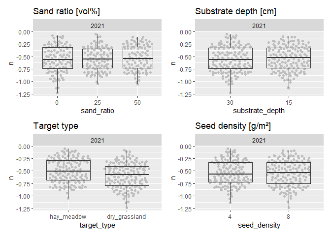<!-- -->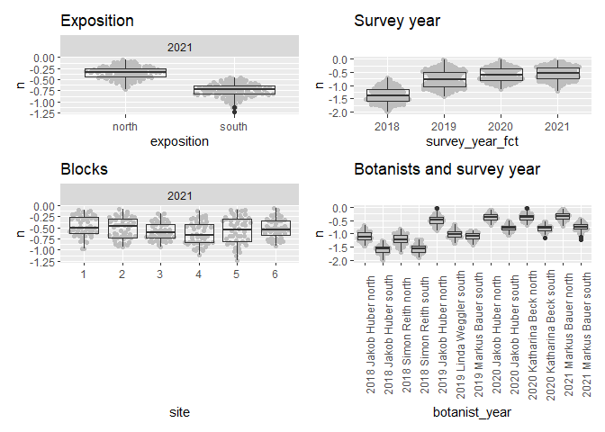<!-- --><!-- -->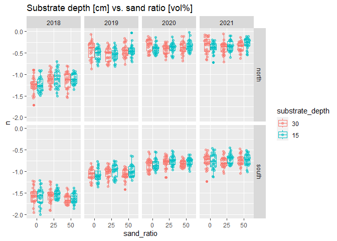<!-- -->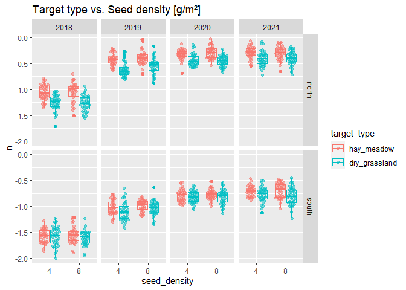<!-- -->

### Outliers, zero-inflation, transformations?

    ## # A tibble: 12 × 3
    ## # Groups:   exposition [2]
    ##    exposition site      n
    ##    <fct>      <fct> <int>
    ##  1 north      1        96
    ##  2 north      2        96
    ##  3 north      3        96
    ##  4 north      4        96
    ##  5 north      5        96
    ##  6 north      6        96
    ##  7 south      1        96
    ##  8 south      2        96
    ##  9 south      3        96
    ## 10 south      4        96
    ## 11 south      5        96
    ## 12 south      6        96

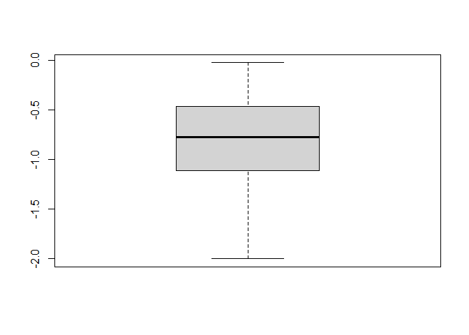<!-- -->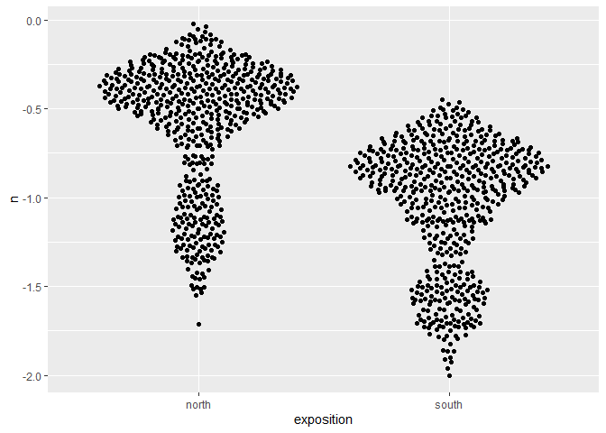<!-- -->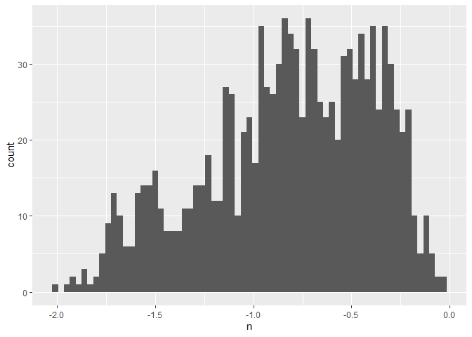<!-- -->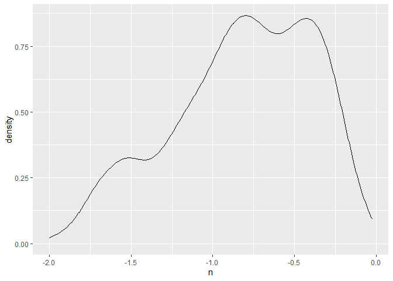<!-- -->

## Models

### Load models (BARG 6.G)

Only here you have to modify the script to compare other models

``` r
load(file = here("outputs", "models", "model_recovery_2.Rdata"))
load(file = here("outputs", "models", "model_recovery_full.Rdata"))
load(file = here("outputs", "models", "model_recovery_2_prior.Rdata"))
# BARG 5.A/B/C
load(file = here("outputs", "models", "model_recovery_2_flat.Rdata"))
m_1 <- m2
m_2 <- m_full
m_prior <- m2_prior
m_flat <- m2_flat
```

### Model specifications (BARG 1.D)

``` r
m_1$formula
## n ~ sand_ratio * target_type * exposition * survey_year_fct + substrate_depth + seed_density + substrate_depth:exposition + seed_density:exposition + substrate_depth:survey_year_fct + seed_density:survey_year_fct + botanist_year + (1 | site/plot)
m_2$formula
## n ~ sand_ratio * target_type * exposition * survey_year_fct + substrate_depth * seed_density + substrate_depth:exposition + seed_density:exposition + substrate_depth:survey_year_fct + seed_density:survey_year_fct + substrate_depth:exposition:survey_year_fct + seed_density:exposition:survey_year_fct + botanist_year + (1 | site/plot)
```

``` r
m_1$family
## 
## Family: gaussian 
## Link function: identity
m_2$family
## 
## Family: gaussian 
## Link function: identity
```

NUTS sampler is used.

Amount of chains for MCMC

``` r
m_1$fit@sim$chains
## [1] 4
m_2$fit@sim$chains
## [1] 4
```

Total amount of iterations for MCMC

``` r
m_1$fit@sim$iter
## [1] 20000
m_2$fit@sim$iter
## [1] 20000
```

Amount of iterations before burn-in

``` r
m_1$fit@sim$warmup
## [1] 10000
m_2$fit@sim$warmup
## [1] 10000
```

Thinning rate

``` r
m_1$fit@sim$thin
## [1] 2
m_2$fit@sim$thin
## [1] 2
```

### Preparation for analysis

``` r
# Chose variables
variables <- c(
      "Intercept",
      "b_sand_ratio25",
      "b_sand_ratio50",
      "b_substrate_depth15",
      "b_target_typedry_grassland",
      "b_seed_density8",
      "b_expositionsouth",
      "b_survey_year_fct2019",
      "b_survey_year_fct2020",
      "b_survey_year_fct2021",
      "sd_site__Intercept",
      "sd_site:plot__Intercept",
      "sigma"
    )
# Subset draws
posterior1 <- m_1 %>%
  posterior::as_draws() %>%
  posterior::subset_draws(variable = variables)
posterior2 <- m_2 %>%
  posterior::as_draws() %>%
  posterior::subset_draws(variable = variables)
posterior_prior <- m_prior %>%
  posterior::as_draws() %>%
  posterior::subset_draws(variable = variables)
posterior_flat <- m_flat %>%
  posterior::as_draws() %>%
  posterior::subset_draws(variable = variables)
# R hat
rhat1 <- rhat(m_1)
rhat2 <- rhat(m_2)
# NEFF ratio
neff1 <- neff_ratio(m_1)
neff2 <- neff_ratio(m_2)
# Long format of draws
hmc_diagnostics1 <- brms::nuts_params(m_1)
hmc_diagnostics2 <- brms::nuts_params(m_2)
y <- sites$n
# Posterior predictive distribution
yrep1 <- brms::posterior_predict(m_1, draws = 500)
yrep2 <- brms::posterior_predict(m_2, draws = 500)
yrep_prior <- brms::posterior_predict(m_prior, draws = 500)
# Leave-one-out cross validation based on posterior likelihood
loo1 <- brms::loo(m_1, save_psis = TRUE, moment_match = FALSE)
loo2 <- brms::loo(m_2, save_psis = TRUE, moment_match = FALSE)
# Summary statistics
draws1 <- m_1 %>%
  posterior::as_draws() %>%
  posterior::summarize_draws() %>%
  filter(str_starts(variable, "b_"))
draws2 <- m_2 %>%
  posterior::as_draws() %>%
  posterior::summarize_draws() %>%
  filter(str_starts(variable, "b_"))
```

### Priors (BARG 1.D/E)

#### Possible prior distributions

``` r
get_prior(n ~ target_type + exposition + sand_ratio + survey_year_fct +
            seed_density + substrate_depth +
            (1 | site/plot) + (1|botanist_year),
          data = sites)
```

    ##                    prior     class                     coef         group resp
    ##                   (flat)         b                                            
    ##                   (flat)         b          expositionsouth                   
    ##                   (flat)         b             sand_ratio25                   
    ##                   (flat)         b             sand_ratio50                   
    ##                   (flat)         b            seed_density8                   
    ##                   (flat)         b        substrate_depth15                   
    ##                   (flat)         b      survey_year_fct2019                   
    ##                   (flat)         b      survey_year_fct2020                   
    ##                   (flat)         b      survey_year_fct2021                   
    ##                   (flat)         b target_typedry_grassland                   
    ##  student_t(3, -0.8, 2.5) Intercept                                            
    ##     student_t(3, 0, 2.5)        sd                                            
    ##     student_t(3, 0, 2.5)        sd                          botanist_year     
    ##     student_t(3, 0, 2.5)        sd                Intercept botanist_year     
    ##     student_t(3, 0, 2.5)        sd                                   site     
    ##     student_t(3, 0, 2.5)        sd                Intercept          site     
    ##     student_t(3, 0, 2.5)        sd                              site:plot     
    ##     student_t(3, 0, 2.5)        sd                Intercept     site:plot     
    ##     student_t(3, 0, 2.5)     sigma                                            
    ##  dpar nlpar lb ub       source
    ##                        default
    ##                   (vectorized)
    ##                   (vectorized)
    ##                   (vectorized)
    ##                   (vectorized)
    ##                   (vectorized)
    ##                   (vectorized)
    ##                   (vectorized)
    ##                   (vectorized)
    ##                   (vectorized)
    ##                        default
    ##              0         default
    ##              0    (vectorized)
    ##              0    (vectorized)
    ##              0    (vectorized)
    ##              0    (vectorized)
    ##              0    (vectorized)
    ##              0    (vectorized)
    ##              0         default

``` r
ggplot(data = data.frame(x = c(-2, 0)), aes(x = x)) +
  stat_function(fun = dnorm, n = 101, args = list(mean = -1, sd = 1)) +
  expand_limits(y = 0) +
  ggtitle("Normal distribution for Intecept")
```

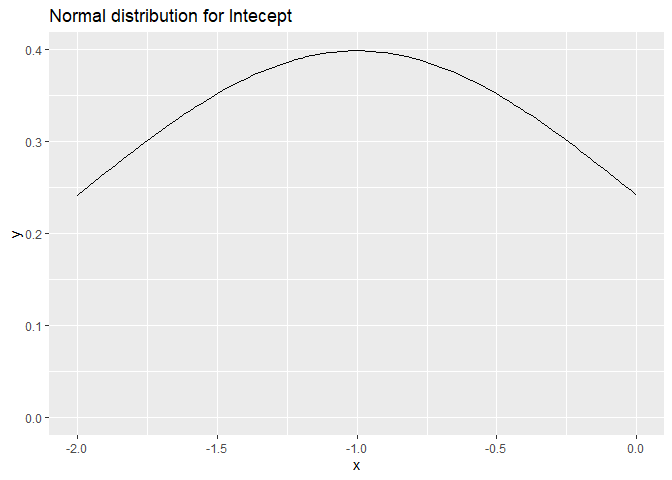<!-- -->

``` r
ggplot(data = data.frame(x = c(-2, 2)), aes(x = x)) +
  stat_function(fun = dnorm, n = 101, args = list(mean = 0, sd = .8)) +
  expand_limits(y = 0) +
  ggtitle("Normal distribution for treatments")
```

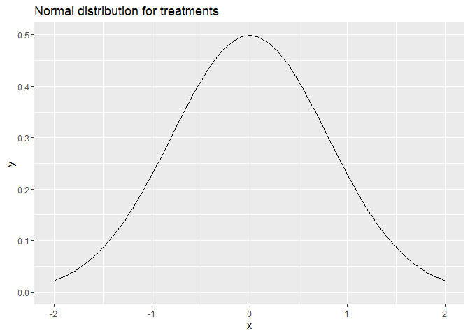<!-- -->

``` r
ggplot(data = data.frame(x = c(-2, 2)), aes(x = x)) +
  stat_function(fun = dcauchy, n = 101, args = list(location = 0, scale = 1)) +
  expand_limits(y = 0) +
  ggtitle("Cauchy distribution") # See Lemoine 2019 https://doi.org/10.1111/oik.05985
```

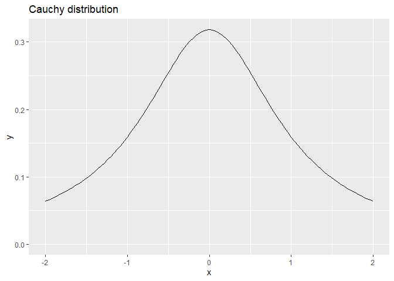<!-- -->

``` r
ggplot(data.frame(x = c(-2, 2)), aes(x = x)) +
  stat_function(fun = dstudent_t, args = list(df = 3, mu = 0, sigma = 2.5)) +
  expand_limits(y = 0) +
  ggtitle(expression(Student~italic(t)*"-distribution")) # Software standard
```

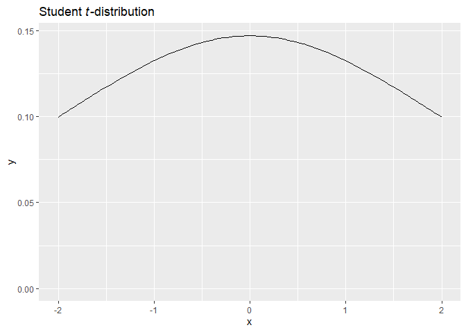<!-- -->

#### Prior summary (BARG 1.D)

``` r
brms::prior_summary(m_1, all = FALSE)
```

    ##             prior     class                coef group resp dpar nlpar lb ub
    ##     normal(0, .8)         b                                                
    ##  normal(-0.1, .8)         b     expositionsouth                            
    ##   normal(0.1, .8)         b        sand_ratio25                            
    ##   normal(0.2, .8)         b        sand_ratio50                            
    ##   normal(0.1, .8)         b survey_year_fct2019                            
    ##   normal(0.2, .8)         b survey_year_fct2020                            
    ##   normal(0.3, .8)         b survey_year_fct2021                            
    ##     normal(-1, 1) Intercept                                                
    ##   normal(0.3, .8)        sd                                            0   
    ##      cauchy(0, 1)     sigma                                            0   
    ##  source
    ##    user
    ##    user
    ##    user
    ##    user
    ##    user
    ##    user
    ##    user
    ##    user
    ##    user
    ##    user

#### Prior predictive check (BARG 1.E)

``` r
ppd_stat(yrep_prior[1:500, ], binwidth = 0.2) +
  coord_cartesian(xlim = c(-2, 2))
```

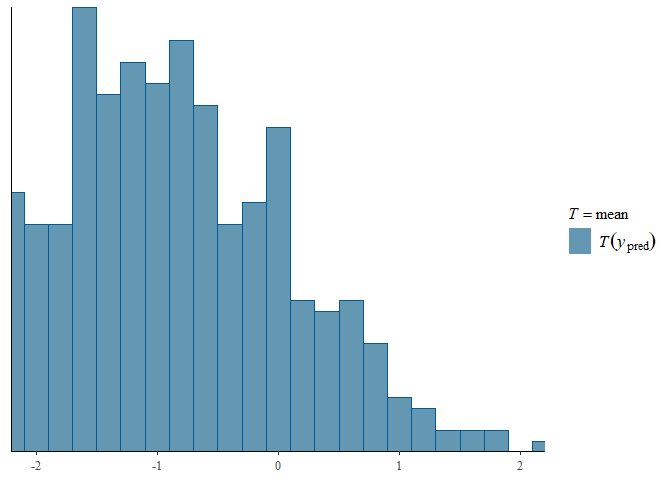<!-- -->

``` r
ppd_stat_grouped(yrep_prior[1:500, ], group = sites$site,
                 binwidth = 0.2) +
  coord_cartesian(xlim = c(-2, 2))
```

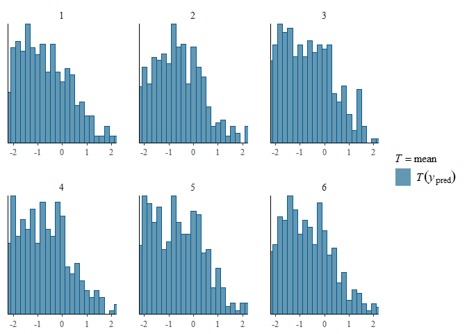<!-- -->

``` r
ppd_stat_grouped(yrep_prior[1:500, ], group = sites$exposition,
                 binwidth = 0.2) +
  coord_cartesian(xlim = c(-2, 2))
```

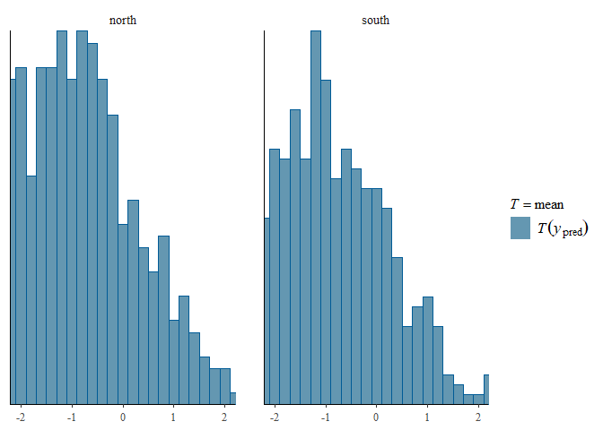<!-- -->

``` r
ppd_stat_grouped(yrep_prior[1:500, ], group = sites$survey_year_fct,
                 binwidth = 0.2) +
  coord_cartesian(xlim = c(-2, 2))
```

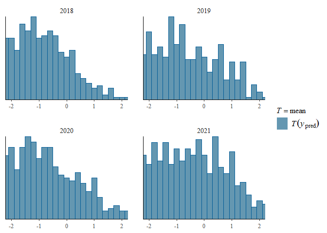<!-- -->

``` r
ppd_stat_grouped(yrep_prior[1:500, ], group = sites$target_type,
                 binwidth = 0.2) +
  coord_cartesian(xlim = c(-2, 2))
```

<!-- -->

``` r
ppd_stat_grouped(yrep_prior[1:500, ], group = sites$seed_density,
                 binwidth = 0.1) +
  coord_cartesian(xlim = c(-2, 2))
```

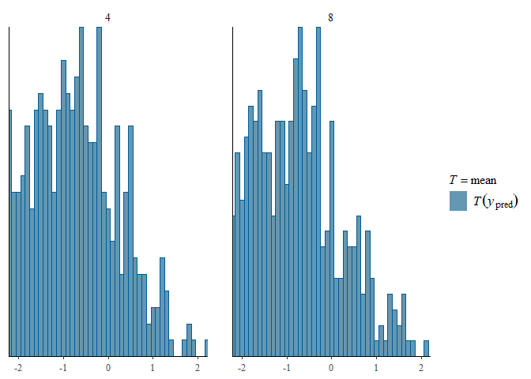<!-- -->

``` r
ppd_stat_grouped(yrep_prior[1:500, ], group = sites$sand_ratio,
                 binwidth = 0.2) +
  coord_cartesian(xlim = c(-2, 2))
```

<!-- -->

``` r
ppd_stat_grouped(yrep_prior[1:500, ], group = sites$substrate_depth,
                 binwidth = 0.2) +
  coord_cartesian(xlim = c(-2, 2))
```

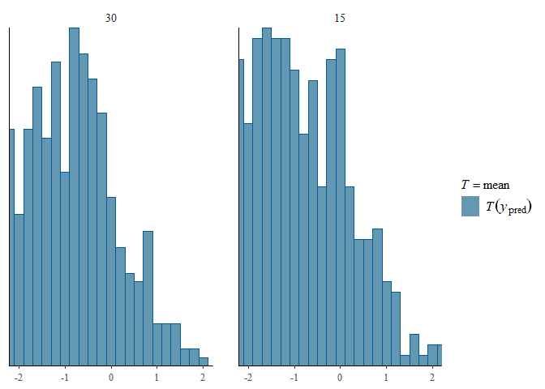<!-- -->

## Model check

### DHARMa

``` r
DHARMa.helpers::dh_check_brms(m_1, integer = TRUE)
```

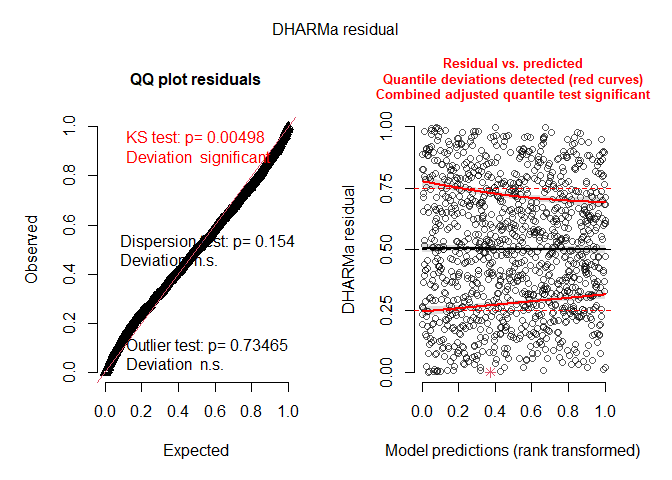<!-- -->

``` r
DHARMa.helpers::dh_check_brms(m_2, integer = TRUE)
```

<!-- -->

### Sampling efficency and effectiveness (BARG 2.B/C)

#### Rhat (BARG 2.B)

``` r
mcmc_rhat(rhat1)
```

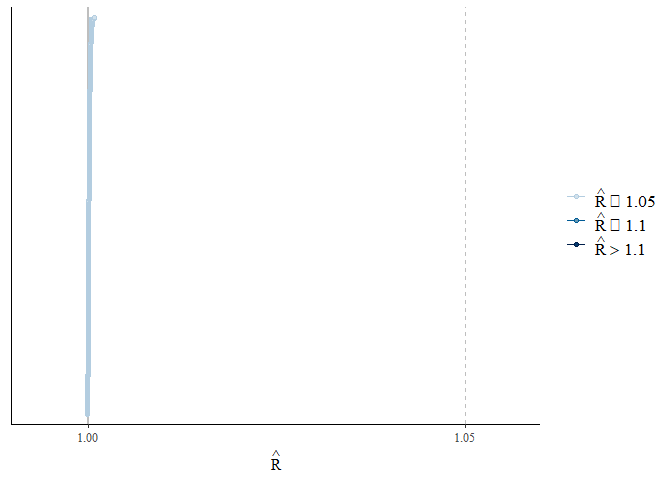<!-- -->

``` r
mcmc_rhat(rhat2)
```

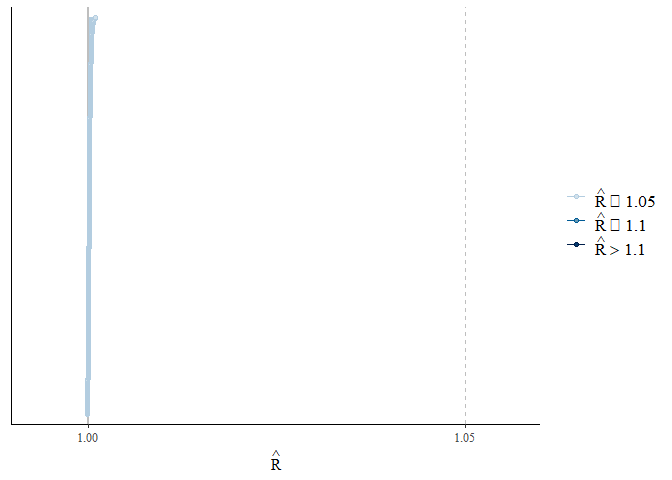<!-- -->

#### Effective sampling size (ESS) (BARG 2.C)

``` r
mcmc_neff(neff1)
```

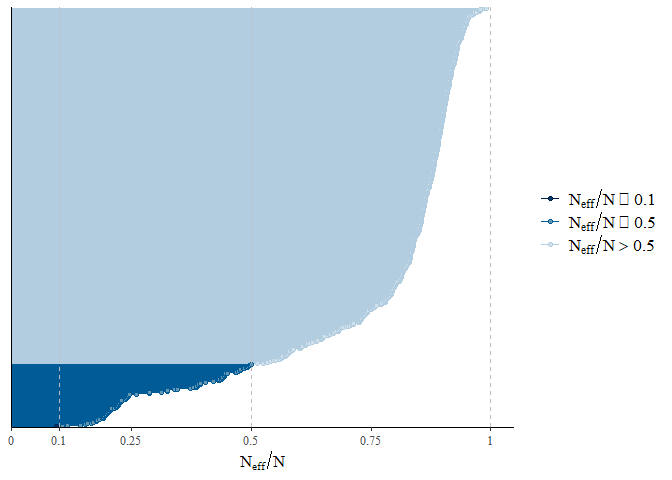<!-- -->

``` r
mcmc_neff(neff2)
```

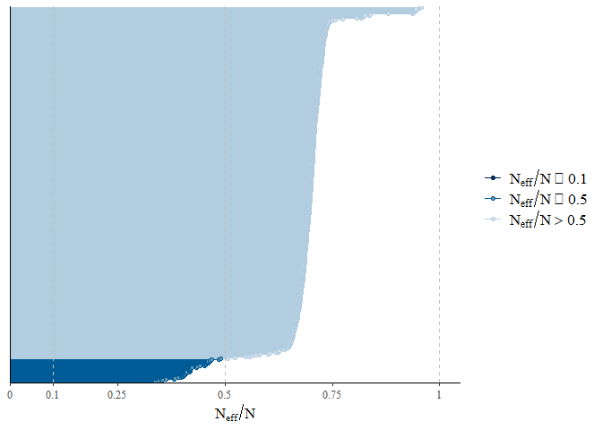<!-- -->

### MCMC diagnostics

#### Trace plots

``` r
mcmc_trace(posterior1, np = hmc_diagnostics1, facet_args = list(ncol = 2))
```

    ## No divergences to plot.

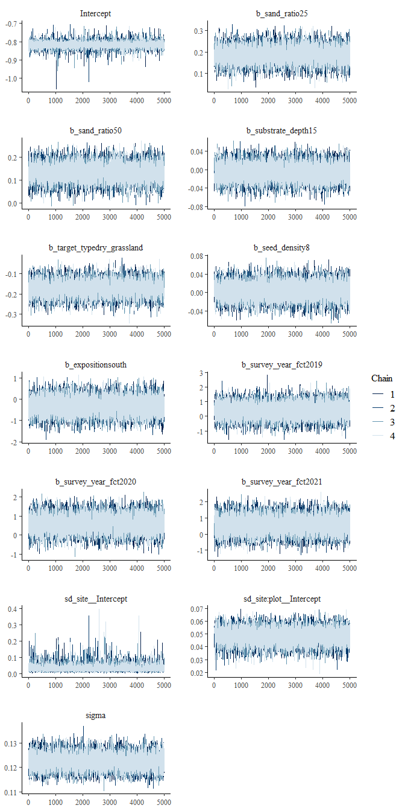<!-- -->

``` r
mcmc_trace(posterior2, np = hmc_diagnostics2, facet_args = list(ncol = 2))
```

    ## No divergences to plot.

<!-- -->

#### Pairs plot

``` r
mcmc_pairs(m_1, off_diag_args = list(size = 1.2),
           pars = c(
             "b_sand_ratio25", "b_sand_ratio50", "b_substrate_depth15",
             "b_target_typedry_grassland", "b_seed_density8",
             "b_expositionsouth", "sigma"
           ))
```

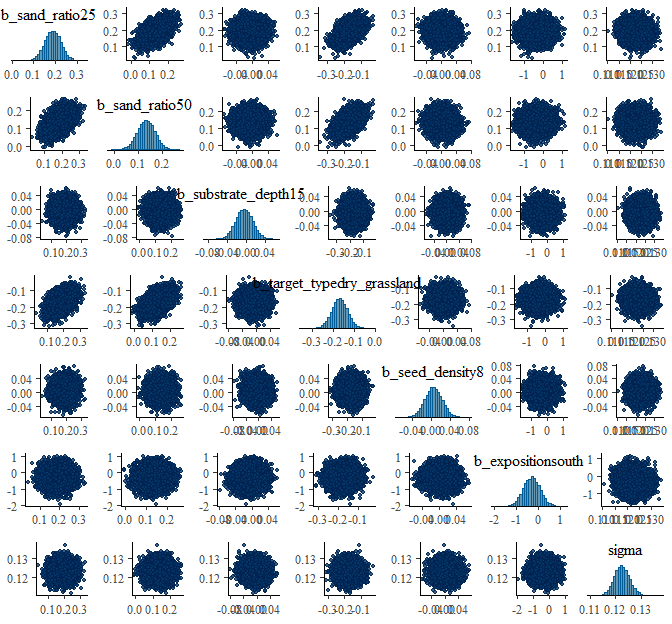<!-- -->

``` r
mcmc_pairs(m_2, off_diag_args = list(size = 1.2),
           pars = c(
             "b_sand_ratio25", "b_sand_ratio50", "b_substrate_depth15",
             "b_target_typedry_grassland", "b_seed_density8",
             "b_expositionsouth", "sigma"
           ))
```

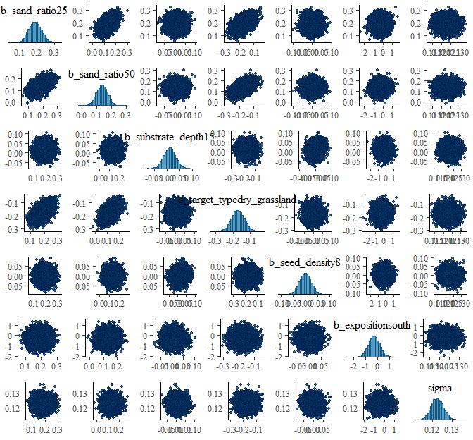<!-- -->

#### Parallel coordinate plot

``` r
mcmc_parcoord(posterior1, np = hmc_diagnostics1) +
  theme(axis.text.x = element_text(angle = 45))
```

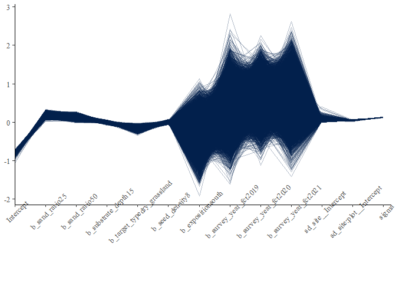<!-- -->

``` r
mcmc_parcoord(posterior2, np = hmc_diagnostics2) +
  theme(axis.text.x = element_text(angle = 45))
```

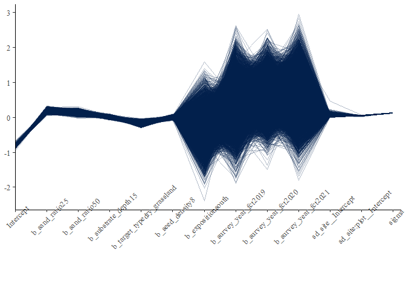<!-- -->

### Posterior predictive check (BARG 3.A)

#### Kernel density

``` r
p1 <- ppc_dens_overlay(y, yrep1[1:50, ])
p2 <- ppc_dens_overlay(y, yrep2[1:50, ])
p1 / p2
```

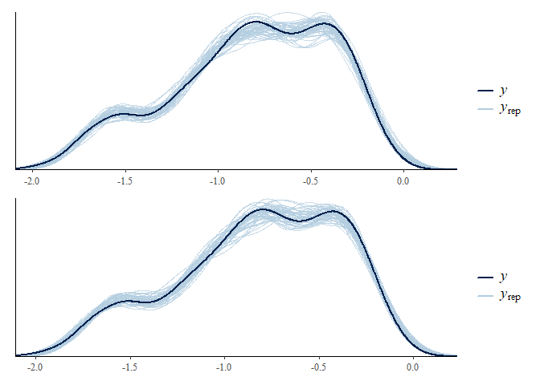<!-- -->

``` r
ppc_dens_overlay_grouped(y, yrep1[1:50, ], group = sites$site)
```

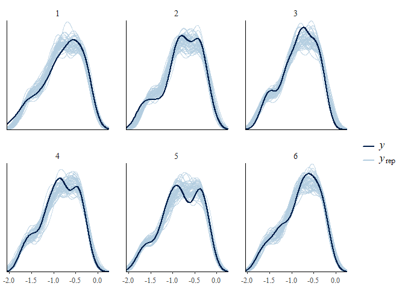<!-- -->

``` r
ppc_dens_overlay_grouped(y, yrep2[1:50, ], group = sites$site)
```

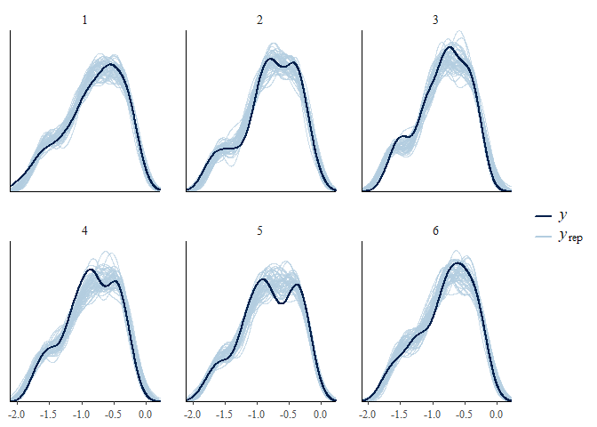<!-- -->

``` r
p1 <- ppc_dens_overlay_grouped(y, yrep1[1:50, ], group = sites$exposition)
p2 <- ppc_dens_overlay_grouped(y, yrep2[1:50, ], group = sites$exposition)
p1 / p2
```

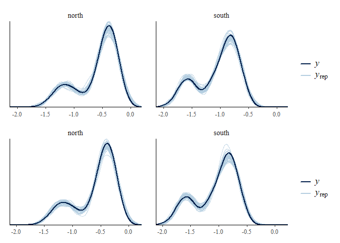<!-- -->

``` r
ppc_dens_overlay_grouped(y, yrep1[1:50, ], group = sites$survey_year_fct)
```

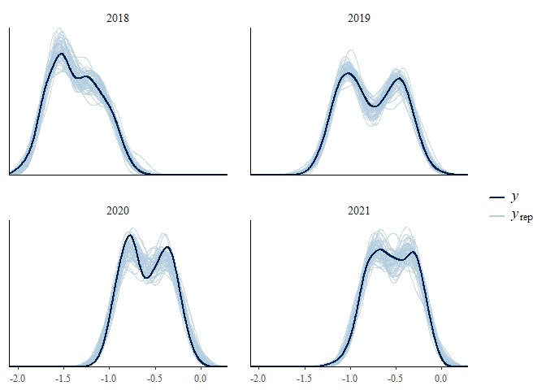<!-- -->

``` r
ppc_dens_overlay_grouped(y, yrep2[1:50, ], group = sites$survey_year_fct)
```

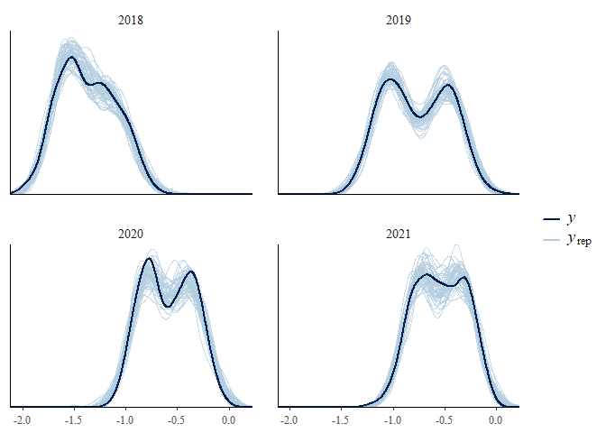<!-- -->

``` r
p1 <- ppc_dens_overlay_grouped(y, yrep1[1:50, ], group = sites$target_type)
p2 <- ppc_dens_overlay_grouped(y, yrep2[1:50, ], group = sites$target_type)
p1 / p2
```

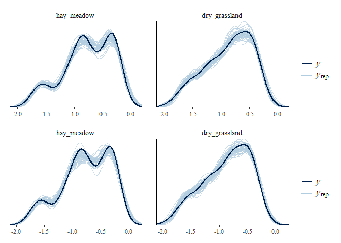<!-- -->

``` r
p1 <- ppc_dens_overlay_grouped(y, yrep1[1:50, ], group = sites$seed_density)
p2 <- ppc_dens_overlay_grouped(y, yrep2[1:50, ], group = sites$seed_density)
p1 / p2
```

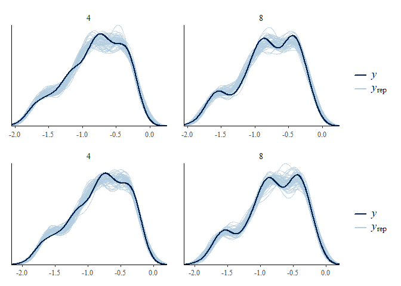<!-- -->

``` r
p1 <- ppc_dens_overlay_grouped(y, yrep1[1:50, ], group = sites$sand_ratio)
p2 <- ppc_dens_overlay_grouped(y, yrep2[1:50, ], group = sites$sand_ratio)
p1 / p2
```

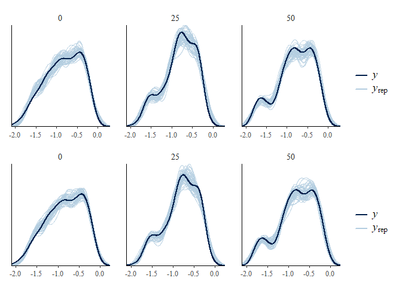<!-- -->

``` r
p1 <- ppc_dens_overlay_grouped(y, yrep1[1:50, ], group = sites$substrate_depth)
p2 <- ppc_dens_overlay_grouped(y, yrep2[1:50, ], group = sites$substrate_depth)
p1 / p2
```

<!-- -->

#### Histograms of statistics skew

``` r
p1 <- ppc_stat(y, yrep1, binwidth = 0.001)
p2 <- ppc_stat(y, yrep2, binwidth = 0.001)
p1 / p2
```

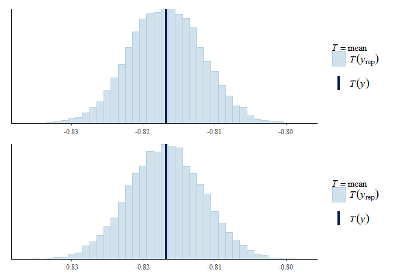<!-- -->

``` r
ppc_stat_grouped(y, yrep1, group = sites$site, binwidth = 0.001)
```

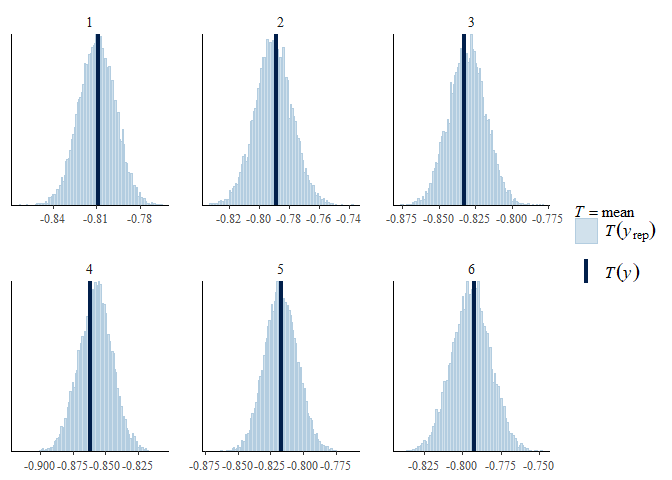<!-- -->

``` r
ppc_stat_grouped(y, yrep2, group = sites$site, binwidth = 0.001)
```

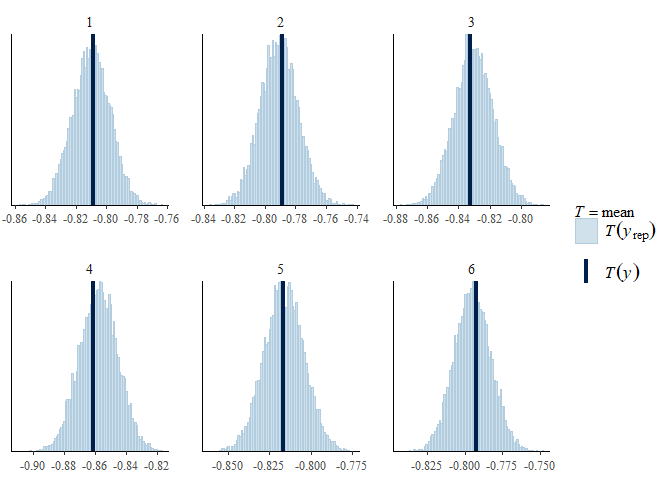<!-- -->

``` r
p1 <- ppc_stat_grouped(y, yrep1, group = sites$exposition, binwidth = 0.001)
p2 <- ppc_stat_grouped(y, yrep2, group = sites$exposition, binwidth = 0.001)
p1 / p2
```

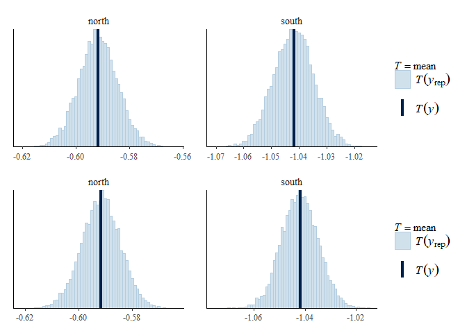<!-- -->

``` r
ppc_stat_grouped(y, yrep1, group = sites$survey_year_fct, binwidth = 0.001)
```

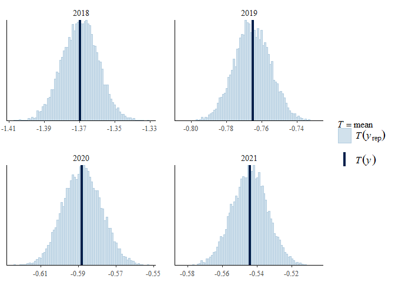<!-- -->

``` r
ppc_stat_grouped(y, yrep2, group = sites$survey_year_fct, binwidth = 0.001)
```

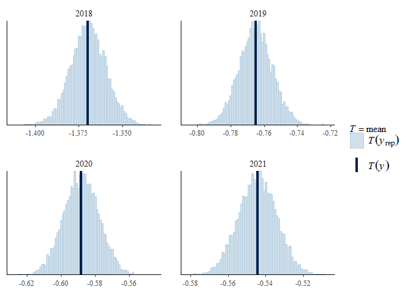<!-- -->

``` r
p1 <- ppc_stat_grouped(y, yrep1, group = sites$target_type, binwidth = 0.001)
p2 <- ppc_stat_grouped(y, yrep2, group = sites$target_type, binwidth = 0.001)
p1 / p2
```

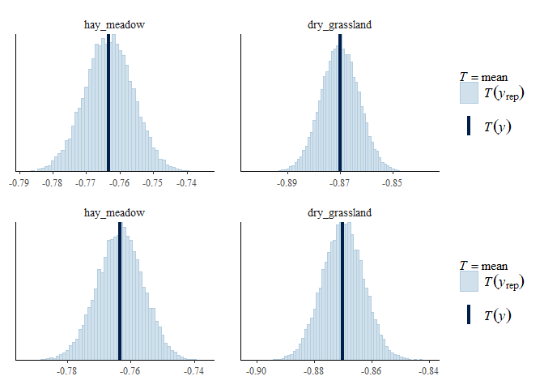<!-- -->

``` r
p1 <- ppc_stat_grouped(y, yrep1, group = sites$seed_density, binwidth = 0.001)
p2 <- ppc_stat_grouped(y, yrep2, group = sites$seed_density, binwidth = 0.001)
p1 / p2
```

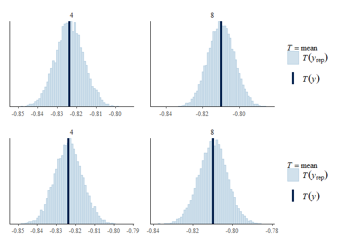<!-- -->

``` r
p1 <- ppc_stat_grouped(y, yrep1, group = sites$sand_ratio, binwidth = 0.001)
p2 <- ppc_stat_grouped(y, yrep2, group = sites$sand_ratio, binwidth = 0.001)
p1 / p2
```

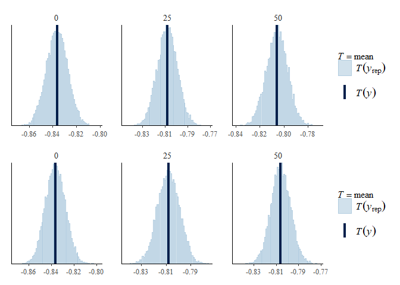<!-- -->

``` r
p1 <- ppc_stat_grouped(y, yrep1, group = sites$substrate_depth, binwidth = 0.001)
p2 <- ppc_stat_grouped(y, yrep2, group = sites$substrate_depth, binwidth = 0.001)
p1 / p2
```

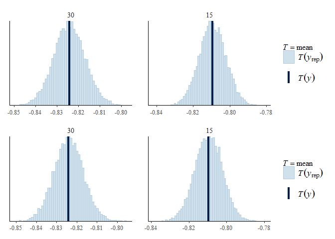<!-- -->

#### LOO (Leave one out)

``` r
loo1
```

    ## 
    ## Computed from 20000 by 1152 log-likelihood matrix
    ## 
    ##          Estimate   SE
    ## elpd_loo    692.1 25.5
    ## p_loo       162.3  6.7
    ## looic     -1384.2 51.0
    ## ------
    ## Monte Carlo SE of elpd_loo is 0.2.
    ## 
    ## Pareto k diagnostic values:
    ##                          Count Pct.    Min. n_eff
    ## (-Inf, 0.5]   (good)     1148  99.7%   1214      
    ##  (0.5, 0.7]   (ok)          4   0.3%   1437      
    ##    (0.7, 1]   (bad)         0   0.0%   <NA>      
    ##    (1, Inf)   (very bad)    0   0.0%   <NA>      
    ## 
    ## All Pareto k estimates are ok (k < 0.7).
    ## See help('pareto-k-diagnostic') for details.

``` r
loo2
```

    ## 
    ## Computed from 20000 by 1152 log-likelihood matrix
    ## 
    ##          Estimate   SE
    ## elpd_loo    687.4 25.5
    ## p_loo       168.1  6.9
    ## looic     -1374.8 51.0
    ## ------
    ## Monte Carlo SE of elpd_loo is 0.2.
    ## 
    ## Pareto k diagnostic values:
    ##                          Count Pct.    Min. n_eff
    ## (-Inf, 0.5]   (good)     1151  99.9%   1530      
    ##  (0.5, 0.7]   (ok)          1   0.1%   1874      
    ##    (0.7, 1]   (bad)         0   0.0%   <NA>      
    ##    (1, Inf)   (very bad)    0   0.0%   <NA>      
    ## 
    ## All Pareto k estimates are ok (k < 0.7).
    ## See help('pareto-k-diagnostic') for details.

``` r
plot(loo1)
```

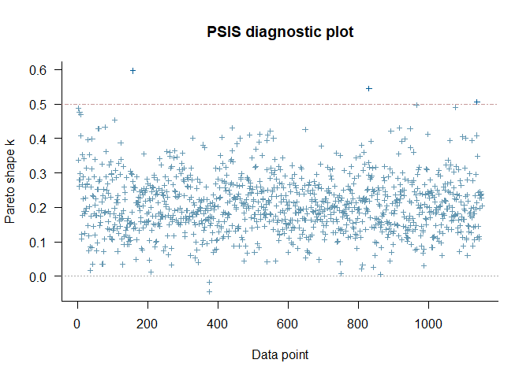<!-- -->

``` r
plot(loo2)
```

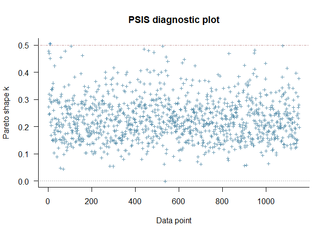<!-- -->

Leave one out probability integral transform

``` r
p1 <- bayesplot::ppc_loo_pit_overlay(y, yrep1, lw = weights(loo1$psis_object))
```

    ## NOTE: The kernel density estimate assumes continuous observations and is not optimal for discrete observations.

``` r
p2 <- bayesplot::ppc_loo_pit_overlay(y, yrep2, lw = weights(loo2$psis_object))
```

    ## NOTE: The kernel density estimate assumes continuous observations and is not optimal for discrete observations.

``` r
p1 / p2
```

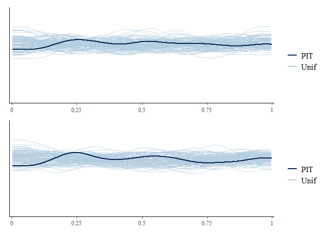<!-- -->

### Autocorrelation check

``` r
mcmc_acf(posterior1, lags = 10)
```

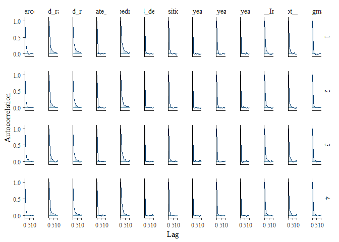<!-- -->

``` r
mcmc_acf(posterior2, lags = 10)
```

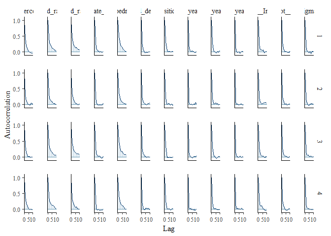<!-- -->

## Model comparison

### Conditional <i>R</i><sup>2</sup> values

``` r
brms::bayes_R2(m_1, probs = c(0.05, 0.5, 0.95),
         re_formula =  ~ (1 | site/plot)) 
##    Estimate   Est.Error        Q5       Q50       Q95
## R2 0.918969 0.002519917 0.9146968 0.9190845 0.9229334
brms::bayes_R2(m_2, probs = c(0.05, 0.5, 0.95),
         re_formula =  ~ (1 | site/plot))
##     Estimate   Est.Error        Q5      Q50       Q95
## R2 0.9189172 0.002532897 0.9145983 0.919005 0.9229029
```

### Marginal <i>R</i><sup>2</sup> values

``` r
brms::bayes_R2(m_1, probs = c(0.05, 0.5, 0.95),
         re_formula = 1 ~ 1)
##     Estimate  Est.Error        Q5       Q50       Q95
## R2 0.9041565 0.00186927 0.9009463 0.9042451 0.9070803
brms::bayes_R2(m_2, probs = c(0.05, 0.5, 0.95),
         re_formula = 1 ~ 1)
##     Estimate   Est.Error       Q5       Q50       Q95
## R2 0.9040671 0.001872285 0.900852 0.9041719 0.9069747
```

### Bayes factor (BARG 3.C)

``` r
bayes_factor <- brms::bayes_factor(m_1, m_2)
```

``` r
bayes_factor
```

    ## Estimated Bayes factor in favor of m_1 over m_2: 469942419.85783

## Posterior distributions (BARG 3.B)

### Forest plot (BARG 3.B/5.B)

``` r
combined <- bind_rows(
  bayesplot::mcmc_intervals_data(posterior1, prob = 0.66, prob_outer = 0.95) %>%
    mutate(model = "m_1"),
  bayesplot::mcmc_intervals_data(posterior2, prob = 0.66, prob_outer = 0.95) %>%
    mutate(model = "m_2"),
  bayesplot::mcmc_intervals_data(posterior_flat, prob = 0.66, prob_outer = 0.95) %>%
    mutate(model = "m_flat"),
  bayesplot::mcmc_intervals_data(posterior_prior, prob = 0.66, prob_outer = 0.95) %>%
    mutate(model = "m_prior")
  )

pos <- position_nudge(
  y = if_else(
    combined$model == "m_2", -.2, if_else(
      combined$model == "m_flat", -.4, if_else(
        combined$model == "m_prior", -.6, 0
        )
      )
    )
  )

ggplot(data = combined, aes(x = m, y = forcats::fct_rev(factor(parameter)), color = model)) + 
  geom_vline(xintercept = 0, color = "grey") +
  geom_linerange(aes(xmin = l, xmax = h), position = pos, linewidth = 2) +
  geom_linerange(aes(xmin = ll, xmax = hh), position = pos) +
  geom_point(position = pos, color = "black") +
  coord_cartesian(xlim = c(-1, .6)) +
  bayesplot::theme_default() +
  ggtitle("Posterior distbributions (mean, CI66, CI95)")
```

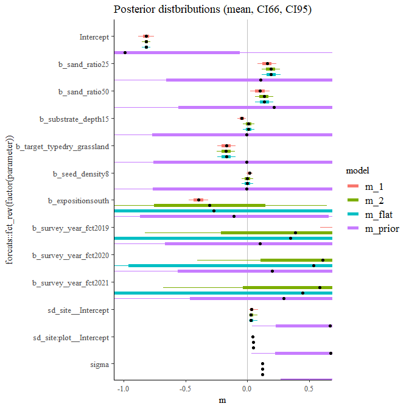<!-- -->

### Effect sizes

Effect sizes of chosen model just to get exact values of means etc. if
necessary.

``` r
draws1
```

    ## # A tibble: 70 × 10
    ##    varia…¹     mean   median     sd    mad      q5     q95  rhat ess_b…² ess_t…³
    ##    <chr>      <dbl>    <dbl>  <dbl>  <dbl>   <dbl>   <dbl> <dbl>   <dbl>   <dbl>
    ##  1 b_Inte… -1.11    -1.11    0.0352 0.0345 -1.16   -1.05    1.00   9524.  12728.
    ##  2 b_sand…  0.187    0.188   0.0374 0.0371  0.126   0.249   1.00   7752.  13149.
    ##  3 b_sand…  0.134    0.134   0.0371 0.0371  0.0728  0.194   1.00   7477.  12786.
    ##  4 b_targ… -0.172   -0.171   0.0370 0.0365 -0.233  -0.111   1.00   6570.  12019.
    ##  5 b_expo… -0.317   -0.317   0.381  0.383  -0.936   0.310   1.00  14697.  17399.
    ##  6 b_surv…  0.393    0.392   0.503  0.506  -0.430   1.22    1.00  18804.  17693.
    ##  7 b_surv…  0.607    0.606   0.423  0.424  -0.0860  1.31    1.00  17051.  18043.
    ##  8 b_surv…  0.590    0.588   0.510  0.513  -0.252   1.43    1.00  18936.  18630.
    ##  9 b_subs… -0.00441 -0.00446 0.0178 0.0177 -0.0337  0.0249  1.00  17865.  18751.
    ## 10 b_seed…  0.00412  0.00406 0.0180 0.0181 -0.0254  0.0336  1.00  17713.  18274.
    ## # … with 60 more rows, and abbreviated variable names ¹​variable, ²​ess_bulk,
    ## #   ³​ess_tail

``` r
emmeans(m_1, revpairwise ~ target_type + sand_ratio | exposition |
          survey_year_fct, type = "response")
```

    ## NOTE: A nesting structure was detected in the fitted model:
    ##     botanist_year %in% (exposition*survey_year_fct)

    ## $emmeans
    ## exposition = north, survey_year_fct = 2018:
    ##  target_type   sand_ratio emmean lower.HPD upper.HPD
    ##  hay_meadow    0          -1.161    -1.218    -1.098
    ##  dry_grassland 0          -1.333    -1.394    -1.274
    ##  hay_meadow    25         -0.974    -1.035    -0.913
    ##  dry_grassland 25         -1.233    -1.295    -1.174
    ##  hay_meadow    50         -1.027    -1.086    -0.966
    ##  dry_grassland 50         -1.215    -1.276    -1.153
    ## 
    ## exposition = south, survey_year_fct = 2018:
    ##  target_type   sand_ratio emmean lower.HPD upper.HPD
    ##  hay_meadow    0          -1.537    -1.597    -1.476
    ##  dry_grassland 0          -1.593    -1.653    -1.530
    ##  hay_meadow    25         -1.538    -1.600    -1.477
    ##  dry_grassland 25         -1.542    -1.607    -1.484
    ##  hay_meadow    50         -1.616    -1.680    -1.557
    ##  dry_grassland 50         -1.645    -1.705    -1.583
    ## 
    ## exposition = north, survey_year_fct = 2019:
    ##  target_type   sand_ratio emmean lower.HPD upper.HPD
    ##  hay_meadow    0          -0.387    -0.448    -0.327
    ##  dry_grassland 0          -0.573    -0.634    -0.511
    ##  hay_meadow    25         -0.437    -0.498    -0.377
    ##  dry_grassland 25         -0.649    -0.709    -0.587
    ##  hay_meadow    50         -0.390    -0.453    -0.331
    ##  dry_grassland 50         -0.514    -0.575    -0.451
    ## 
    ## exposition = south, survey_year_fct = 2019:
    ##  target_type   sand_ratio emmean lower.HPD upper.HPD
    ##  hay_meadow    0          -1.030    -1.093    -0.967
    ##  dry_grassland 0          -1.161    -1.222    -1.098
    ##  hay_meadow    25         -0.995    -1.060    -0.932
    ##  dry_grassland 25         -1.052    -1.115    -0.988
    ##  hay_meadow    50         -1.049    -1.115    -0.986
    ##  dry_grassland 50         -1.056    -1.121    -0.993
    ## 
    ## exposition = north, survey_year_fct = 2020:
    ##  target_type   sand_ratio emmean lower.HPD upper.HPD
    ##  hay_meadow    0          -0.294    -0.354    -0.232
    ##  dry_grassland 0          -0.437    -0.499    -0.375
    ##  hay_meadow    25         -0.326    -0.385    -0.263
    ##  dry_grassland 25         -0.470    -0.530    -0.409
    ##  hay_meadow    50         -0.293    -0.353    -0.231
    ##  dry_grassland 50         -0.425    -0.488    -0.365
    ## 
    ## exposition = south, survey_year_fct = 2020:
    ##  target_type   sand_ratio emmean lower.HPD upper.HPD
    ##  hay_meadow    0          -0.798    -0.859    -0.736
    ##  dry_grassland 0          -0.885    -0.946    -0.826
    ##  hay_meadow    25         -0.744    -0.804    -0.682
    ##  dry_grassland 25         -0.790    -0.851    -0.729
    ##  hay_meadow    50         -0.799    -0.860    -0.738
    ##  dry_grassland 50         -0.797    -0.859    -0.736
    ## 
    ## exposition = north, survey_year_fct = 2021:
    ##  target_type   sand_ratio emmean lower.HPD upper.HPD
    ##  hay_meadow    0          -0.298    -0.358    -0.236
    ##  dry_grassland 0          -0.398    -0.461    -0.340
    ##  hay_meadow    25         -0.295    -0.357    -0.236
    ##  dry_grassland 25         -0.431    -0.491    -0.371
    ##  hay_meadow    50         -0.277    -0.336    -0.215
    ##  dry_grassland 50         -0.361    -0.423    -0.300
    ## 
    ## exposition = south, survey_year_fct = 2021:
    ##  target_type   sand_ratio emmean lower.HPD upper.HPD
    ##  hay_meadow    0          -0.681    -0.741    -0.620
    ##  dry_grassland 0          -0.839    -0.898    -0.777
    ##  hay_meadow    25         -0.719    -0.778    -0.656
    ##  dry_grassland 25         -0.768    -0.830    -0.708
    ##  hay_meadow    50         -0.704    -0.766    -0.644
    ##  dry_grassland 50         -0.760    -0.822    -0.699
    ## 
    ## Results are averaged over the levels of: substrate_depth, seed_density, botanist_year 
    ## Point estimate displayed: median 
    ## HPD interval probability: 0.95 
    ## 
    ## $contrasts
    ## exposition = north, survey_year_fct = 2018:
    ##  contrast                                                 estimate lower.HPD
    ##  dry_grassland sand_ratio0 - hay_meadow sand_ratio0      -0.171446  -0.24314
    ##  hay_meadow sand_ratio25 - hay_meadow sand_ratio0         0.187542   0.11609
    ##  hay_meadow sand_ratio25 - dry_grassland sand_ratio0      0.358898   0.28322
    ##  dry_grassland sand_ratio25 - hay_meadow sand_ratio0     -0.071758  -0.14630
    ##  dry_grassland sand_ratio25 - dry_grassland sand_ratio0   0.099969   0.02711
    ##  dry_grassland sand_ratio25 - hay_meadow sand_ratio25    -0.259233  -0.32860
    ##  hay_meadow sand_ratio50 - hay_meadow sand_ratio0         0.134325   0.06299
    ##  hay_meadow sand_ratio50 - dry_grassland sand_ratio0      0.305514   0.23225
    ##  hay_meadow sand_ratio50 - hay_meadow sand_ratio25       -0.053722  -0.12606
    ##  hay_meadow sand_ratio50 - dry_grassland sand_ratio25     0.205713   0.13336
    ##  dry_grassland sand_ratio50 - hay_meadow sand_ratio0     -0.054427  -0.12878
    ##  dry_grassland sand_ratio50 - dry_grassland sand_ratio0   0.117706   0.04225
    ##  dry_grassland sand_ratio50 - hay_meadow sand_ratio25    -0.241281  -0.31709
    ##  dry_grassland sand_ratio50 - dry_grassland sand_ratio25  0.017466  -0.05709
    ##  dry_grassland sand_ratio50 - hay_meadow sand_ratio50    -0.187879  -0.26092
    ##  upper.HPD
    ##   -0.09748
    ##    0.26377
    ##    0.43043
    ##    0.00183
    ##    0.17388
    ##   -0.18212
    ##    0.20842
    ##    0.37895
    ##    0.02124
    ##    0.28032
    ##    0.01942
    ##    0.19048
    ##   -0.16891
    ##    0.09065
    ##   -0.11227
    ## 
    ## exposition = south, survey_year_fct = 2018:
    ##  contrast                                                 estimate lower.HPD
    ##  dry_grassland sand_ratio0 - hay_meadow sand_ratio0      -0.056407  -0.12845
    ##  hay_meadow sand_ratio25 - hay_meadow sand_ratio0        -0.001250  -0.07548
    ##  hay_meadow sand_ratio25 - dry_grassland sand_ratio0      0.055717  -0.01877
    ##  dry_grassland sand_ratio25 - hay_meadow sand_ratio0     -0.005182  -0.07729
    ##  dry_grassland sand_ratio25 - dry_grassland sand_ratio0   0.051405  -0.02008
    ##  dry_grassland sand_ratio25 - hay_meadow sand_ratio25    -0.003701  -0.07641
    ##  hay_meadow sand_ratio50 - hay_meadow sand_ratio0        -0.078280  -0.15317
    ##  hay_meadow sand_ratio50 - dry_grassland sand_ratio0     -0.021997  -0.09371
    ##  hay_meadow sand_ratio50 - hay_meadow sand_ratio25       -0.077411  -0.15566
    ##  hay_meadow sand_ratio50 - dry_grassland sand_ratio25    -0.073289  -0.14807
    ##  dry_grassland sand_ratio50 - hay_meadow sand_ratio0     -0.108562  -0.18406
    ##  dry_grassland sand_ratio50 - dry_grassland sand_ratio0  -0.051750  -0.12664
    ##  dry_grassland sand_ratio50 - hay_meadow sand_ratio25    -0.107164  -0.18165
    ##  dry_grassland sand_ratio50 - dry_grassland sand_ratio25 -0.103248  -0.17704
    ##  dry_grassland sand_ratio50 - hay_meadow sand_ratio50    -0.029686  -0.10401
    ##  upper.HPD
    ##    0.01617
    ##    0.07282
    ##    0.12922
    ##    0.07082
    ##    0.12750
    ##    0.07331
    ##   -0.00579
    ##    0.05256
    ##   -0.00505
    ##    0.00122
    ##   -0.03751
    ##    0.02063
    ##   -0.03398
    ##   -0.02957
    ##    0.04370
    ## 
    ## exposition = north, survey_year_fct = 2019:
    ##  contrast                                                 estimate lower.HPD
    ##  dry_grassland sand_ratio0 - hay_meadow sand_ratio0      -0.186723  -0.26119
    ##  hay_meadow sand_ratio25 - hay_meadow sand_ratio0        -0.049815  -0.12613
    ##  hay_meadow sand_ratio25 - dry_grassland sand_ratio0      0.136456   0.06159
    ##  dry_grassland sand_ratio25 - hay_meadow sand_ratio0     -0.262472  -0.33630
    ##  dry_grassland sand_ratio25 - dry_grassland sand_ratio0  -0.075737  -0.15017
    ##  dry_grassland sand_ratio25 - hay_meadow sand_ratio25    -0.212498  -0.28560
    ##  hay_meadow sand_ratio50 - hay_meadow sand_ratio0        -0.003381  -0.07638
    ##  hay_meadow sand_ratio50 - dry_grassland sand_ratio0      0.183286   0.10758
    ##  hay_meadow sand_ratio50 - hay_meadow sand_ratio25        0.047273  -0.02628
    ##  hay_meadow sand_ratio50 - dry_grassland sand_ratio25     0.259450   0.18370
    ##  dry_grassland sand_ratio50 - hay_meadow sand_ratio0     -0.127231  -0.20124
    ##  dry_grassland sand_ratio50 - dry_grassland sand_ratio0   0.059028  -0.01628
    ##  dry_grassland sand_ratio50 - hay_meadow sand_ratio25    -0.077526  -0.15338
    ##  dry_grassland sand_ratio50 - dry_grassland sand_ratio25  0.135199   0.05883
    ##  dry_grassland sand_ratio50 - hay_meadow sand_ratio50    -0.124216  -0.20174
    ##  upper.HPD
    ##   -0.11295
    ##    0.02092
    ##    0.20938
    ##   -0.18653
    ##   -0.00353
    ##   -0.13678
    ##    0.07213
    ##    0.25722
    ##    0.12108
    ##    0.33251
    ##   -0.05089
    ##    0.13380
    ##   -0.00477
    ##    0.20867
    ##   -0.05077
    ## 
    ## exposition = south, survey_year_fct = 2019:
    ##  contrast                                                 estimate lower.HPD
    ##  dry_grassland sand_ratio0 - hay_meadow sand_ratio0      -0.131531  -0.20274
    ##  hay_meadow sand_ratio25 - hay_meadow sand_ratio0         0.035230  -0.03944
    ##  hay_meadow sand_ratio25 - dry_grassland sand_ratio0      0.166260   0.09060
    ##  dry_grassland sand_ratio25 - hay_meadow sand_ratio0     -0.021280  -0.09521
    ##  dry_grassland sand_ratio25 - dry_grassland sand_ratio0   0.109279   0.03477
    ##  dry_grassland sand_ratio25 - hay_meadow sand_ratio25    -0.057172  -0.13086
    ##  hay_meadow sand_ratio50 - hay_meadow sand_ratio0        -0.018115  -0.09155
    ##  hay_meadow sand_ratio50 - dry_grassland sand_ratio0      0.112776   0.03801
    ##  hay_meadow sand_ratio50 - hay_meadow sand_ratio25       -0.053436  -0.12756
    ##  hay_meadow sand_ratio50 - dry_grassland sand_ratio25     0.003671  -0.07293
    ##  dry_grassland sand_ratio50 - hay_meadow sand_ratio0     -0.025825  -0.09833
    ##  dry_grassland sand_ratio50 - dry_grassland sand_ratio0   0.105207   0.03240
    ##  dry_grassland sand_ratio50 - hay_meadow sand_ratio25    -0.061209  -0.13532
    ##  dry_grassland sand_ratio50 - dry_grassland sand_ratio25 -0.003892  -0.07878
    ##  dry_grassland sand_ratio50 - hay_meadow sand_ratio50    -0.007578  -0.08280
    ##  upper.HPD
    ##   -0.05438
    ##    0.10953
    ##    0.23907
    ##    0.05401
    ##    0.18307
    ##    0.01883
    ##    0.05682
    ##    0.18785
    ##    0.02159
    ##    0.07702
    ##    0.04900
    ##    0.18112
    ##    0.01243
    ##    0.07020
    ##    0.06505
    ## 
    ## exposition = north, survey_year_fct = 2020:
    ##  contrast                                                 estimate lower.HPD
    ##  dry_grassland sand_ratio0 - hay_meadow sand_ratio0      -0.143250  -0.21900
    ##  hay_meadow sand_ratio25 - hay_meadow sand_ratio0        -0.031656  -0.10429
    ##  hay_meadow sand_ratio25 - dry_grassland sand_ratio0      0.111425   0.03816
    ##  dry_grassland sand_ratio25 - hay_meadow sand_ratio0     -0.176350  -0.24993
    ##  dry_grassland sand_ratio25 - dry_grassland sand_ratio0  -0.033118  -0.10589
    ##  dry_grassland sand_ratio25 - hay_meadow sand_ratio25    -0.144658  -0.21793
    ##  hay_meadow sand_ratio50 - hay_meadow sand_ratio0         0.000611  -0.07391
    ##  hay_meadow sand_ratio50 - dry_grassland sand_ratio0      0.143681   0.06989
    ##  hay_meadow sand_ratio50 - hay_meadow sand_ratio25        0.032429  -0.04229
    ##  hay_meadow sand_ratio50 - dry_grassland sand_ratio25     0.176994   0.10140
    ##  dry_grassland sand_ratio50 - hay_meadow sand_ratio0     -0.131889  -0.20415
    ##  dry_grassland sand_ratio50 - dry_grassland sand_ratio0   0.011445  -0.06470
    ##  dry_grassland sand_ratio50 - hay_meadow sand_ratio25    -0.099772  -0.17385
    ##  dry_grassland sand_ratio50 - dry_grassland sand_ratio25  0.044683  -0.02934
    ##  dry_grassland sand_ratio50 - hay_meadow sand_ratio50    -0.132104  -0.20697
    ##  upper.HPD
    ##   -0.07028
    ##    0.04242
    ##    0.18690
    ##   -0.10187
    ##    0.04298
    ##   -0.06952
    ##    0.07307
    ##    0.21878
    ##    0.10624
    ##    0.25011
    ##   -0.05673
    ##    0.08417
    ##   -0.02483
    ##    0.11871
    ##   -0.05794
    ## 
    ## exposition = south, survey_year_fct = 2020:
    ##  contrast                                                 estimate lower.HPD
    ##  dry_grassland sand_ratio0 - hay_meadow sand_ratio0      -0.087213  -0.15995
    ##  hay_meadow sand_ratio25 - hay_meadow sand_ratio0         0.053303  -0.02192
    ##  hay_meadow sand_ratio25 - dry_grassland sand_ratio0      0.140379   0.06809
    ##  dry_grassland sand_ratio25 - hay_meadow sand_ratio0      0.007428  -0.06608
    ##  dry_grassland sand_ratio25 - dry_grassland sand_ratio0   0.094388   0.02125
    ##  dry_grassland sand_ratio25 - hay_meadow sand_ratio25    -0.045571  -0.11862
    ##  hay_meadow sand_ratio50 - hay_meadow sand_ratio0        -0.001680  -0.07497
    ##  hay_meadow sand_ratio50 - dry_grassland sand_ratio0      0.085642   0.01215
    ##  hay_meadow sand_ratio50 - hay_meadow sand_ratio25       -0.055084  -0.13143
    ##  hay_meadow sand_ratio50 - dry_grassland sand_ratio25    -0.009068  -0.08234
    ##  dry_grassland sand_ratio50 - hay_meadow sand_ratio0      0.000460  -0.07474
    ##  dry_grassland sand_ratio50 - dry_grassland sand_ratio0   0.087600   0.01223
    ##  dry_grassland sand_ratio50 - hay_meadow sand_ratio25    -0.052890  -0.12896
    ##  dry_grassland sand_ratio50 - dry_grassland sand_ratio25 -0.006883  -0.07997
    ##  dry_grassland sand_ratio50 - hay_meadow sand_ratio50     0.001832  -0.07107
    ##  upper.HPD
    ##   -0.01142
    ##    0.12845
    ##    0.21664
    ##    0.08215
    ##    0.16816
    ##    0.03074
    ##    0.07325
    ##    0.15993
    ##    0.01866
    ##    0.06596
    ##    0.07467
    ##    0.16052
    ##    0.02118
    ##    0.06981
    ##    0.07719
    ## 
    ## exposition = north, survey_year_fct = 2021:
    ##  contrast                                                 estimate lower.HPD
    ##  dry_grassland sand_ratio0 - hay_meadow sand_ratio0      -0.100237  -0.17563
    ##  hay_meadow sand_ratio25 - hay_meadow sand_ratio0         0.002222  -0.07316
    ##  hay_meadow sand_ratio25 - dry_grassland sand_ratio0      0.102288   0.02849
    ##  dry_grassland sand_ratio25 - hay_meadow sand_ratio0     -0.133750  -0.20895
    ##  dry_grassland sand_ratio25 - dry_grassland sand_ratio0  -0.033711  -0.10842
    ##  dry_grassland sand_ratio25 - hay_meadow sand_ratio25    -0.135930  -0.20953
    ##  hay_meadow sand_ratio50 - hay_meadow sand_ratio0         0.021368  -0.05453
    ##  hay_meadow sand_ratio50 - dry_grassland sand_ratio0      0.121108   0.04810
    ##  hay_meadow sand_ratio50 - hay_meadow sand_ratio25        0.018742  -0.05611
    ##  hay_meadow sand_ratio50 - dry_grassland sand_ratio25     0.154615   0.08093
    ##  dry_grassland sand_ratio50 - hay_meadow sand_ratio0     -0.063761  -0.13889
    ##  dry_grassland sand_ratio50 - dry_grassland sand_ratio0   0.036225  -0.03697
    ##  dry_grassland sand_ratio50 - hay_meadow sand_ratio25    -0.066102  -0.14016
    ##  dry_grassland sand_ratio50 - dry_grassland sand_ratio25  0.070061  -0.00525
    ##  dry_grassland sand_ratio50 - hay_meadow sand_ratio50    -0.085099  -0.15883
    ##  upper.HPD
    ##   -0.02822
    ##    0.07553
    ##    0.17785
    ##   -0.06103
    ##    0.03804
    ##   -0.06150
    ##    0.09292
    ##    0.19531
    ##    0.09268
    ##    0.22809
    ##    0.01022
    ##    0.11142
    ##    0.01063
    ##    0.14312
    ##   -0.01106
    ## 
    ## exposition = south, survey_year_fct = 2021:
    ##  contrast                                                 estimate lower.HPD
    ##  dry_grassland sand_ratio0 - hay_meadow sand_ratio0      -0.157929  -0.23150
    ##  hay_meadow sand_ratio25 - hay_meadow sand_ratio0        -0.037378  -0.11083
    ##  hay_meadow sand_ratio25 - dry_grassland sand_ratio0      0.120633   0.04585
    ##  dry_grassland sand_ratio25 - hay_meadow sand_ratio0     -0.086522  -0.16056
    ##  dry_grassland sand_ratio25 - dry_grassland sand_ratio0   0.071314  -0.00378
    ##  dry_grassland sand_ratio25 - hay_meadow sand_ratio25    -0.049522  -0.12247
    ##  hay_meadow sand_ratio50 - hay_meadow sand_ratio0        -0.022883  -0.09993
    ##  hay_meadow sand_ratio50 - dry_grassland sand_ratio0      0.134874   0.06096
    ##  hay_meadow sand_ratio50 - hay_meadow sand_ratio25        0.014032  -0.06238
    ##  hay_meadow sand_ratio50 - dry_grassland sand_ratio25     0.063578  -0.00976
    ##  dry_grassland sand_ratio50 - hay_meadow sand_ratio0     -0.078681  -0.15383
    ##  dry_grassland sand_ratio50 - dry_grassland sand_ratio0   0.078985   0.00295
    ##  dry_grassland sand_ratio50 - hay_meadow sand_ratio25    -0.041520  -0.11511
    ##  dry_grassland sand_ratio50 - dry_grassland sand_ratio25  0.007461  -0.06568
    ##  dry_grassland sand_ratio50 - hay_meadow sand_ratio50    -0.056008  -0.13206
    ##  upper.HPD
    ##   -0.08295
    ##    0.03822
    ##    0.19556
    ##   -0.01161
    ##    0.14651
    ##    0.02839
    ##    0.04822
    ##    0.20929
    ##    0.08565
    ##    0.13863
    ##   -0.00619
    ##    0.15116
    ##    0.03310
    ##    0.08289
    ##    0.01718
    ## 
    ## Results are averaged over the levels of: substrate_depth, seed_density, botanist_year 
    ## Point estimate displayed: median 
    ## HPD interval probability: 0.95

# Session info (BARG 2.A/6.A/6.B)

    ## R version 4.2.2 (2022-10-31 ucrt)
    ## Platform: x86_64-w64-mingw32/x64 (64-bit)
    ## Running under: Windows 10 x64 (build 22621)
    ## 
    ## Matrix products: default
    ## 
    ## locale:
    ## [1] LC_COLLATE=German_Germany.utf8  LC_CTYPE=German_Germany.utf8   
    ## [3] LC_MONETARY=German_Germany.utf8 LC_NUMERIC=C                   
    ## [5] LC_TIME=German_Germany.utf8    
    ## 
    ## attached base packages:
    ## [1] stats     graphics  grDevices utils     datasets  methods   base     
    ## 
    ## other attached packages:
    ##  [1] emmeans_1.8.3             tidybayes_3.0.2          
    ##  [3] loo_2.5.1                 bayesplot_1.10.0         
    ##  [5] DHARMa.helpers_0.0.0.9000 brms_2.18.0              
    ##  [7] Rcpp_1.0.9                patchwork_1.1.2          
    ##  [9] ggbeeswarm_0.6.0          forcats_0.5.2            
    ## [11] stringr_1.5.0             dplyr_1.0.10             
    ## [13] purrr_0.3.5               readr_2.1.3              
    ## [15] tidyr_1.2.1               tibble_3.1.8             
    ## [17] ggplot2_3.4.0             tidyverse_1.3.2          
    ## [19] here_1.0.1               
    ## 
    ## loaded via a namespace (and not attached):
    ##   [1] utf8_1.2.2           tidyselect_1.2.0     lme4_1.1-31         
    ##   [4] htmlwidgets_1.5.4    grid_4.2.2           RNeXML_2.4.8        
    ##   [7] munsell_0.5.0        codetools_0.2-18     interp_1.1-3        
    ##  [10] DT_0.26              miniUI_0.1.1.1       withr_2.5.0         
    ##  [13] Brobdingnag_1.2-9    colorspace_2.0-3     qgam_1.3.4          
    ##  [16] uuid_1.1-0           highr_0.9            knitr_1.41          
    ##  [19] rstudioapi_0.14      stats4_4.2.2         labeling_0.4.2      
    ##  [22] rstan_2.26.13        bit64_4.0.5          farver_2.1.1        
    ##  [25] gap.datasets_0.0.5   bridgesampling_1.1-2 rprojroot_2.0.3     
    ##  [28] coda_0.19-4          vctrs_0.5.1          generics_0.1.3      
    ##  [31] xfun_0.35            timechange_0.1.1     adegenet_2.1.8      
    ##  [34] doParallel_1.0.17    R6_2.5.1             markdown_1.4        
    ##  [37] assertthat_0.2.1     promises_1.2.0.1     scales_1.2.1        
    ##  [40] vroom_1.6.0          googlesheets4_1.0.1  phylobase_0.8.10    
    ##  [43] beeswarm_0.4.0       gtable_0.3.1         processx_3.8.0      
    ##  [46] rlang_1.0.6          splines_4.2.2        gargle_1.2.1        
    ##  [49] broom_1.0.1          checkmate_2.1.0      inline_0.3.19       
    ##  [52] yaml_2.3.6           reshape2_1.4.4       abind_1.4-5         
    ##  [55] modelr_0.1.10        threejs_0.3.3        crosstalk_1.2.0     
    ##  [58] backports_1.4.1      httpuv_1.6.6         tensorA_0.36.2      
    ##  [61] tools_4.2.2          ellipsis_0.3.2       posterior_1.3.1     
    ##  [64] RColorBrewer_1.1-3   plyr_1.8.8           progress_1.2.2      
    ##  [67] base64enc_0.1-3      ps_1.7.2             prettyunits_1.1.1   
    ##  [70] deldir_1.0-6         zoo_1.8-11           cluster_2.1.4       
    ##  [73] haven_2.5.1          fs_1.5.2             magrittr_2.0.3      
    ##  [76] ggdist_3.2.0         colourpicker_1.2.0   reprex_2.0.2        
    ##  [79] googledrive_2.0.0    mvtnorm_1.1-3        matrixStats_0.63.0  
    ##  [82] hms_1.1.2            shinyjs_2.1.0        mime_0.12           
    ##  [85] evaluate_0.18        arrayhelpers_1.1-0   xtable_1.8-4        
    ##  [88] XML_3.99-0.13        shinystan_2.6.0      jpeg_0.1-10         
    ##  [91] readxl_1.4.1         gridExtra_2.3        rstantools_2.2.0    
    ##  [94] compiler_4.2.2       KernSmooth_2.23-20   V8_4.2.2            
    ##  [97] crayon_1.5.2         minqa_1.2.5          StanHeaders_2.26.13 
    ## [100] htmltools_0.5.3      mgcv_1.8-41          later_1.3.0         
    ## [103] tzdb_0.3.0           RcppParallel_5.1.5   lubridate_1.9.0     
    ## [106] DBI_1.1.3            dbplyr_2.2.1         MASS_7.3-58.1       
    ## [109] boot_1.3-28          Matrix_1.5-3         ade4_1.7-20         
    ## [112] permute_0.9-7        cli_3.4.1            adegraphics_1.0-16  
    ## [115] DHARMa_0.4.6         parallel_4.2.2       igraph_1.3.5        
    ## [118] pkgconfig_2.0.3      rncl_0.8.6           sp_1.5-1            
    ## [121] foreach_1.5.2        xml2_1.3.3           svUnit_1.0.6        
    ## [124] dygraphs_1.1.1.6     vipor_0.4.5          estimability_1.4.1  
    ## [127] rvest_1.0.3          distributional_0.3.1 callr_3.7.3         
    ## [130] digest_0.6.30        vegan_2.6-4          rmarkdown_2.18      
    ## [133] cellranger_1.1.0     gap_1.3-1            curl_4.3.3          
    ## [136] shiny_1.7.3          gtools_3.9.4         nloptr_2.0.3        
    ## [139] lifecycle_1.0.3      nlme_3.1-160         jsonlite_1.8.4      
    ## [142] seqinr_4.2-23        fansi_1.0.3          pillar_1.8.1        
    ## [145] lattice_0.20-45      fastmap_1.1.0        httr_1.4.4          
    ## [148] pkgbuild_1.4.0       glue_1.6.2           xts_0.12.2          
    ## [151] iterators_1.0.14     png_0.1-8            shinythemes_1.2.0   
    ## [154] bit_4.0.5            stringi_1.7.8        latticeExtra_0.6-30 
    ## [157] ape_5.6-2
